# Carátula

**UNIVERSIDAD AUTÓNOMA GABRIEL RENÉ MORENO**
**FACULTAD DE INGENIERÍA EN CIENCIAS DE LA COMPUTACIÓN Y TELECOMUNICACIONES**
**CARRERA DE INGENIERÍA INFORMÁTICA**

# Wireless HeatMapper

**Sistema integrado de levantamiento y visualización de cobertura Wi-Fi**

**Proyecto de Desarrollo de Software**
**Ingeniería de Software II — Grupo 24**

**Integrantes:**

| Apellidos y Nombres                | Registro  |
| ---------------------------------- | --------- |
| Fernandez Ortega Jhasmany Jhunnior | 207025509 |
| Quiroga Flores Herland Borys       | 200104373 |

**Santa Cruz de la Sierra, Bolivia**
**Mayo de 2026**


```{=openxml}
<w:p><w:r><w:br w:type="page"/></w:r></w:p>
```

# Tabla de Contenidos

## CAPÍTULO 1 — Definición del Proyecto

- 1.1 Introducción
- 1.2 Antecedentes
  - 1.2.1 Fundamentación Teórica del Dominio
  - 1.2.2 Comparación de Software Similar
- 1.3 Descripción del Problema
- 1.4 Situación Problemática
- 1.5 Situación Deseada
- 1.6 Objetivos
- 1.7 Alcance
- 1.8 Tecnología de Desarrollo
- 1.9 Bibliografía
- 1.10 Anexos

## CAPÍTULO 2 — Redes Inalámbricas de Área Local y Análisis de Cobertura WiFi

- 2.1 Diseño y Planificación de Redes WLAN
- 2.2 Planificación de Canales y Gestión de Interferencias
- 2.3 Sistemas de Información Geoespacial para Interiores
- 2.4 Visualización de Datos RF mediante Mapas de Calor y Validación de Cobertura

## CAPÍTULO 3 — Arquitectura y Stack Tecnológico del Sistema

- 3.1 Arquitectura REST y Framework FastAPI
- 3.2 Persistencia con PostgreSQL, SQLAlchemy y Alembic
- 3.3 Desarrollo Móvil con Flutter y Arquitectura BLoC
- 3.4 Desarrollo Web con React 18 y TypeScript
- 3.5 Inteligencia Artificial Aplicada al Análisis de Cobertura WiFi
- 3.6 Infraestructura con Docker Compose, Nginx y CI/CD

## Sprint 0 — Ingeniería de Requisitos Inicial

- S0.1 Organización del Equipo
- S0.2 Ingeniería de Requisitos
- S0.3 Modelos Iniciales del Sistema

## Sprint 1 — Fundación Backend y Admin

- S1.1 Historias de Usuario
- S1.2 Modelos Generados
- S1.3 Implementación
- S1.4 Pruebas

## Sprint 2 — Planos en Línea (Importar + Calibrar)

- S2.1 Historias de Usuario
- S2.2 Modelos Generados
- S2.3 Implementación
- S2.4 Pruebas

## Sprint 3 — Captura WiFi en Línea

- S3.1 Historias de Usuario
- S3.2 Modelos Generados
- S3.3 Implementación
- S3.4 Pruebas


```{=openxml}
<w:p><w:r><w:br w:type="page"/></w:r></w:p>
```

# Capítulo 1 — Definición del Proyecto

Este capítulo recoge el perfil completo del proyecto Wireless HeatMapper, elaborado durante la fase inicial de análisis con el cliente Bulldog Tech. Se exponen el contexto que origina la necesidad del sistema, la descripción y delimitación del problema, los objetivos de la solución, el alcance funcional acordado y las tecnologías seleccionadas para su implementación. El capítulo concluye con la bibliografía de referencia y los documentos de formalización del proyecto.


```{=openxml}
<w:p><w:r><w:br w:type="page"/></w:r></w:p>
```

## 1.1 Introducción

Bulldog Tech. es una empresa tecnológica con sede en Santa Cruz de la Sierra, Bolivia, con trayectoria consolidada en servicios de soporte técnico, mantenimiento de equipos y consultoría en sistemas de información. Hace aproximadamente un año, la empresa amplió su cartera incorporando el área de infraestructura tecnológica de telecomunicaciones, que comprende la instalación, configuración y mantenimiento de redes de datos inalámbricas para clientes corporativos y pymes de la región.

En esa área, el proceso de trabajo que la empresa ha adoptado sigue el modelo tradicional del sector: el técnico especializado visita las instalaciones del cliente, evalúa el espacio con criterio propio y determina la ubicación de los puntos de acceso a partir de su experiencia directa. Es el técnico quien, en ese recorrido presencial, aporta el mayor valor para la toma de decisiones sobre posicionamiento, cantidad y configuración de los equipos. El resultado depende, en gran medida, de la calidad de ese juicio profesional y de la información que logra obtener durante la visita.

El **Wireless HeatMapper** surge como respuesta al límite natural de ese proceso. A medida que la empresa asume proyectos de mayor envergadura, la evaluación exclusivamente subjetiva resulta insuficiente para garantizar coberturas homogéneas, documentar las decisiones técnicas o demostrar objetivamente los resultados a los clientes. El sistema propuesto permite al técnico respaldar y enriquecer su criterio con datos de señal medidos en campo, generando mapas de calor sobre los planos reales de las instalaciones, identificando zonas problemáticas y produciendo reportes que acompañan cada proyecto de infraestructura.

Este documento fue elaborado por el equipo de desarrollo —Fernandez Ortega Jhasmany Jhunnior y Quiroga Flores Herland Borys— a partir del trabajo de análisis, diseño y planificación realizado directamente con el cliente, **Bulldog Tech.**

El documento se organiza en dos partes. La **Parte 1** contiene el Perfil del Proyecto: contexto del problema, objetivos, alcance y tecnologías seleccionadas. La **Parte 2** documenta los resultados de las dos primeras iteraciones: el Sprint 0 (ingeniería de requisitos inicial y modelos del sistema) y el Sprint 1 (primera entrega funcional con autenticación, gestión de usuarios, clientes y proyectos). A lo largo del texto el lector encontrará los fundamentos que justifican cada decisión tomada durante el desarrollo.


```{=openxml}
<w:p><w:r><w:br w:type="page"/></w:r></w:p>
```

## 1.2 Antecedentes

### 1.2.1 Fundamentación Teórica

La fundamentación teórica del proyecto descansa sobre tres pilares: el comportamiento físico de las señales de radiofrecuencia en espacios interiores, las métricas estándar de medición de cobertura Wi-Fi y la metodología profesional de *site survey*. La fuente técnica de referencia para esta sección es el libro *CWNA Certified Wireless Network Administrator Study Guide (Examen CWNA-107)*, que constituye el estándar de la industria para la certificación de administradores de redes inalámbricas.

#### 1.2.1.1 Propagación de señal RF en espacios interiores

Las redes de área local inalámbrica (WLAN), estandarizadas bajo la familia IEEE 802.11, operan principalmente en las bandas de radiofrecuencia de 2.4 GHz y 5 GHz. A diferencia de los entornos exteriores, los espacios interiores presentan condiciones de propagación adversas que determinan directamente la calidad de la cobertura.

El modelo teórico base de pérdida de señal en el espacio libre es la **ecuación FSPL** (*Free Space Path Loss*):

> FSPL (dB) = 20 log(d) + 20 log(f) + 20 log(4π/c)

donde *d* es la distancia en metros y *f* es la frecuencia en Hz. En la práctica, la atenuación real supera siempre a la teórica porque los materiales de construcción absorben y reflejan la señal. La siguiente tabla resume los valores de atenuación empírica documentados en el estándar CWNA-107:

**Tabla 1.** Atenuación típica de materiales constructivos sobre señal Wi-Fi (fuente: CWNA-107, Cap. 3)

| Material                  | Atenuación aproximada (dB) |
| ------------------------- | -------------------------- |
| Tabique de yeso (drywall) | 3 a 5                      |
| Ventana de vidrio común   | 3 a 4                      |
| Vidrio con malla metálica | 6 a 10                     |
| Partición de madera       | 5 a 6                      |
| Ladrillo / bloque         | 6 a 10                     |
| Concreto armado           | 10 a 15                    |
| Lámina o panel metálico   | 12 a 35                    |

Adicionalmente, el fenómeno de **propagación multitrayecto** (*multipath*) ocurre cuando la señal llega al receptor por múltiples rutas —reflexión, difracción y dispersión— con distintos retardos de fase. Esto puede causar tanto interferencia constructiva (incremento de señal) como destructiva (*null*), produciendo zonas de señal nula incluso en áreas con aparente buena cobertura. La norma 802.11n y versiones posteriores mitigan este efecto mediante tecnología MIMO (*Multiple Input Multiple Output*).

Fuente: CWNA-107, Cap. 3 — *RF Signal Characteristics* y Cap. 4 — *Radio Frequency Components, Measurements, and Mathematics*.

#### 1.2.1.2 Métricas de medición de cobertura Wi-Fi

La calidad de la señal Wi-Fi se cuantifica mediante dos métricas complementarias: el nivel de señal recibida y la relación señal a ruido.

**RSSI y dBm.** El indicador **RSSI** (*Received Signal Strength Indicator*) es, técnicamente, una escala propietaria de cada fabricante de chips Wi-Fi (típicamente de 0 a 255 o de 0 a 127) y no tiene unidades estandarizadas entre vendors. Para garantizar comparabilidad entre dispositivos, el valor de referencia universal en la industria es el nivel de señal expresado en **dBm** (decibelios relativos a 1 milivatio), que sí es una magnitud física absoluta. El CWNA-107 establece que toda herramienta de *site survey* profesional debe reportar el nivel de señal en dBm, no en unidades RSSI propietarias. Wireless HeatMapper adopta este criterio: almacena y visualiza únicamente valores en dBm.

Los umbrales de referencia para la clasificación de la cobertura, basados en la Tabla 13.1 del CWNA-107, son:

**Tabla 2.** Clasificación de calidad de señal Wi-Fi por nivel de señal (fuente: CWNA-107, Cap. 13, Tabla 13.1)

| Nivel de señal  | Clasificación            | Aplicaciones sostenibles                        |
| --------------- | ------------------------ | ----------------------------------------------- |
| −30 dBm         | Excepcional              | Máxima tasa de transferencia (MCS máximo)       |
| −55 dBm         | Muy buena                | Datos, voz y video sin restricción              |
| −65 dBm         | Excelente                | VoIP y aplicaciones de tiempo real              |
| −70 dBm         | Buena (objetivo diseño)  | Límite recomendado para nuevas instalaciones    |
| −71 a −80 dBm   | Aceptable con limitación | Solo datos básicos; tasa reducida por DRS       |
| −81 a −89 dBm   | Débil                    | Conexión marginal; alta probabilidad de errores |
| menor a −90 dBm | Zona muerta              | Sin conectividad funcional                      |

El fenómeno **DRS** (*Dynamic Rate Switching*) es directamente responsable de los problemas de rendimiento en zonas de señal débil: cuando el nivel de señal cae por debajo de los umbrales superiores de la tabla, el estándar 802.11 reduce automáticamente la tasa de modulación (MCS) para mantener la asociación, lo que puede degradar el throughput de cientos de Mbps a menos de 6 Mbps sin que el usuario lo perciba como una desconexión. El umbral de −70 dBm como objetivo de diseño no es arbitrario: garantiza un margen de desvanecimiento (*fade margin*) suficiente para mantener tasas de transferencia aceptables ante variaciones de señal debidas al movimiento de personas y objetos.

**SNR e interferencia.** La **relación señal a ruido** (SNR, *Signal-to-Noise Ratio*) es igualmente crítica: expresa, en dB, la diferencia entre el nivel de señal útil y el piso de ruido del ambiente. El CWNA-107 establece los siguientes requisitos mínimos de SNR para aplicaciones en entornos empresariales:

- Datos generales: SNR mayor o igual a 20 dB.
- Aplicaciones de voz (VoIP): SNR mayor o igual a 25 dB.
- SNR menor o igual a 10 dB: muy malo, conexión poco confiable.

En entornos con densidad alta de puntos de acceso coexisten dos tipos de interferencia. La **interferencia de canal adyacente** (ACI, *Adjacent Channel Interference*) ocurre cuando dos celdas vecinas operan en canales solapados en frecuencia (por ejemplo, canales 1 y 3 en la banda 2.4 GHz), produciendo corrupción de tramas a nivel de capa 2. La **interferencia de canal co-ubicado** (CCI, *Co-Channel Interference*) ocurre cuando varios puntos de acceso comparten el mismo canal y se escuchan mutuamente, reduciendo la eficiencia del medio al multiplicar los tiempos de diferimiento CSMA/CA. Para la banda 2.4 GHz, el CWNA-107 establece que únicamente los canales 1, 6 y 11 son no solapados, y su uso sistemático es el patrón mínimo requerido para evitar ACI.

Fuente: CWNA-107, Cap. 4 — *RF Components, Measurements, and Mathematics*; Cap. 13 — *WLAN Design Concepts*.

#### 1.2.1.3 Metodología de site survey

Un **levantamiento de sitio** (*site survey*) es el proceso formal mediante el cual un ingeniero de redes inalámbricas caracteriza las condiciones RF de un espacio antes, durante o después de desplegar una WLAN. El CWNA-107 describe el método moderno predominante en la industria como **método híbrido**, compuesto de cuatro fases:

1. **Visita inicial al sitio** (*Initial Site Visit*): reconocimiento físico con planos de planta en mano, documentación fotográfica de la estructura y toma de nota de materiales de construcción, obstáculos y restricciones de montaje.

2. **Análisis de espectro** (*Spectrum Analysis*): medición de las fuentes de interferencia no Wi-Fi presentes en las bandas 2.4 GHz y 5 GHz. El CWNA-107 establece que si el ruido de fondo supera −85 dBm en cualquier banda, el rendimiento de la WLAN se degrada severamente.

3. **Medición de atenuación de materiales** (*Attenuation Spot Checks*): cuantificación empírica de la pérdida de señal a través de cada tipo de pared del edificio, para alimentar el modelo predictivo de cobertura con valores reales en lugar de valores predeterminados.

4. **Diseño predictivo** (*Predictive Design*): uso de software especializado para modelar la distribución de cobertura sobre el plano digital, iterando la ubicación y potencia de los puntos de acceso hasta cumplir los umbrales de diseño (primario: −65 dBm; secundario: −70 dBm).

El resultado del proceso es un reporte formal que incluye: análisis de espectro, mapa de calor de cobertura (*heatmap*), plano de ubicación de puntos de acceso con canales y potencias asignadas, análisis de capacidad y throughput, y listado de materiales. Wireless HeatMapper aborda precisamente la automatización de la fase de recolección de datos de campo y la generación de este reporte para entornos donde las herramientas comerciales (como Ekahau Site Survey, con costo de licencia superior a USD 3,000) resultan prohibitivas.

La **validación post-instalación** (*Validation Survey*) es otra fase documentada por el CWNA-107 frecuentemente omitida en instalaciones pequeñas: consiste en caminar todo el espacio instalado midiendo cobertura real y comparándola con el diseño previsto, antes de poner la red en servicio. Las métricas a validar incluyen: nivel de señal (dBm), SNR, pérdida de paquetes IP y retransmisiones de capa 2 (objetivo: menor al 5% para datos, menor al 2% para VoIP).

Fuente: CWNA-107, Cap. 14 — *Site Survey and Validation*.

#### 1.2.1.4 Restricciones de plataforma móvil Android

En dispositivos Android 8.0 (Oreo) o posterior, el sistema operativo impone un límite de *throttling* en el escaneo de redes inalámbricas en segundo plano: el sistema permite como máximo 4 escaneos cada 2 minutos cuando la aplicación no está en primer plano. Esta restricción fue introducida por Google para reducir el consumo de batería y tiene implicaciones directas sobre la densidad de muestras que una aplicación de levantamiento de cobertura puede obtener. El diseño de Wireless HeatMapper debe compensar esta limitación mediante una experiencia de usuario orientada a mantener la aplicación activa en primer plano durante todo el proceso de levantamiento, además de implementar un indicador visual de frecuencia de escaneo efectiva.

Fuente: CWNA-107, Cap. 3 — *RF Signal Characteristics*, sección sobre comportamiento de cliente Android; documentación Android Developers API 26+.

#### 1.2.1.5 Sistemas de información geoespacial y algoritmos de interpolación

El levantamiento de cobertura Wi-Fi es, en esencia, una actividad de recolección de datos geoespaciales: cada medición de señal (en dBm) se asocia a una coordenada dentro de un espacio físico representado sobre un plano de planta. A partir de un conjunto discreto de muestras, los algoritmos de interpolación espacial permiten construir una superficie continua de valores, que es lo que se visualiza como mapa de calor.

Los dos algoritmos más utilizados en el contexto de heatmapping Wi-Fi son:

- **IDW** (*Inverse Distance Weighting* — Ponderación por distancia inversa): asigna a cada punto sin medición un valor calculado como promedio ponderado de las muestras vecinas, donde el peso de cada muestra es inversamente proporcional a la distancia. Es el algoritmo más común por su simplicidad computacional.

- **Kriging**: método geoestadístico que modela la correlación espacial entre muestras mediante un variograma. Produce estimaciones de mayor fidelidad en entornos con variación espacial estructurada, pero a mayor costo computacional.

En el caso específico de señales Wi-Fi, la propagación RF no es isótropa (no decrece uniformemente con la distancia) debido a la atenuación por materiales. Para compensar esto, el módulo de inteligencia artificial puede incorporar modelos de propagación basados en la ecuación FSPL con factores de atenuación calibrados por tipo de material, generando así una interpolación físicamente informada que supera la calidad de IDW puro.

---

### 1.2.2 Comparación de Software Similar

A continuación se analizan tres proyectos de código abierto con funcionalidades similares a las que aborda Wireless HeatMapper:

---

#### 1.2.2.1 WiFi Analyzer

- **Repositorio:** [github.com/VREMSoftwareDevelopment/WiFiAnalyzer](https://github.com/VREMSoftwareDevelopment/WiFiAnalyzer)
- **Plataforma:** Android (aplicación móvil nativa)
- **Descripción:** Aplicación de análisis de redes Wi-Fi en tiempo real. Permite visualizar canales, intensidad de señal y puntos de acceso cercanos mediante gráficos dinámicos.
- **Aspectos relevantes:**
  - Visualización en tiempo real de señal (RSSI) por red
  - Análisis de canales para detectar interferencias
  - Interfaz simple y accesible para usuarios técnicos
  - No genera mapas de calor ni permite levantamientos georreferenciados
  - No tiene componente web ni backend centralizado
- **Limitación frente a Wireless HeatMapper:** Opera exclusivamente en modo local y no persiste datos entre sesiones ni permite analizar la distribución espacial de la cobertura.

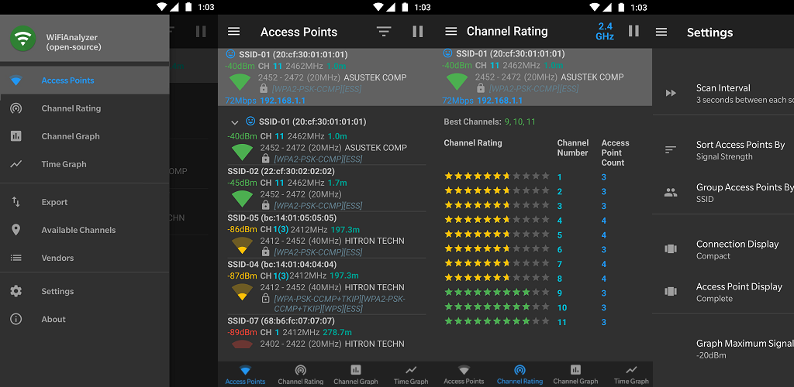

_Figura 1. Interfaz de WiFi Analyzer — visualización de intensidad de señal y canales Wi-Fi en dispositivo Android._

---

#### 1.2.2.2 WiFi Surveyor

- **Repositorio:** [github.com/ecoAPM/WiFiSurveyor](https://github.com/ecoAPM/WiFiSurveyor)
- **Plataforma:** Multiplataforma (Linux/macOS/Windows)
- **Descripción:** Herramienta de escritorio para realizar levantamientos básicos de cobertura Wi-Fi con visualización de señal en tiempo real sobre un mapa de planta.
- **Aspectos relevantes:**
  - Permite importar un plano de planta como imagen de fondo
  - Registro manual de mediciones sobre el plano
  - Generación de mapas de calor básicos
  - No tiene aplicación móvil para levantamiento en campo
  - Sin backend centralizado ni módulo de análisis inteligente
- **Limitación frente a Wireless HeatMapper:** El levantamiento es manual y no existe integración con análisis automatizado ni acceso multiusuario a través de una plataforma web.

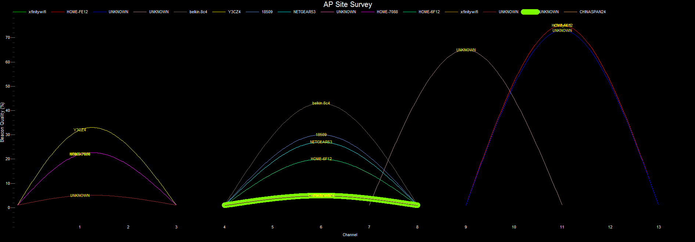

_Figura 2. Interfaz de WiFi Surveyor — registro de mediciones sobre plano de planta en entorno de escritorio._

---

#### 1.2.2.3 python-wifi-survey-heatmap

- **Repositorio:** [github.com/jantman/python-wifi-survey-heatmap](https://github.com/jantman/python-wifi-survey-heatmap)
- **Plataforma:** Linux (línea de comandos + interfaz gráfica básica)
- **Descripción:** Script Python para ejecutar un *site survey* Wi-Fi interactivo sobre un plano de planta, generando un mapa de calor de RSSI, velocidad de transmisión y otros parámetros.
- **Aspectos relevantes:**
  - Genera mapas de calor con múltiples métricas (RSSI, TX rate, calidad)
  - Visualización inmediata con matplotlib
  - Requiere conocimiento técnico para instalación y uso
  - Sin aplicación móvil; el levantamiento se hace con laptop en campo
  - Sin persistencia en base de datos ni historial de proyectos
  - Sin interfaz web ni módulo de IA
- **Limitación frente a Wireless HeatMapper:** Es una herramienta para usuarios altamente técnicos, orientada a uso puntual. No permite gestión de proyectos, acceso remoto ni análisis inteligente de resultados.

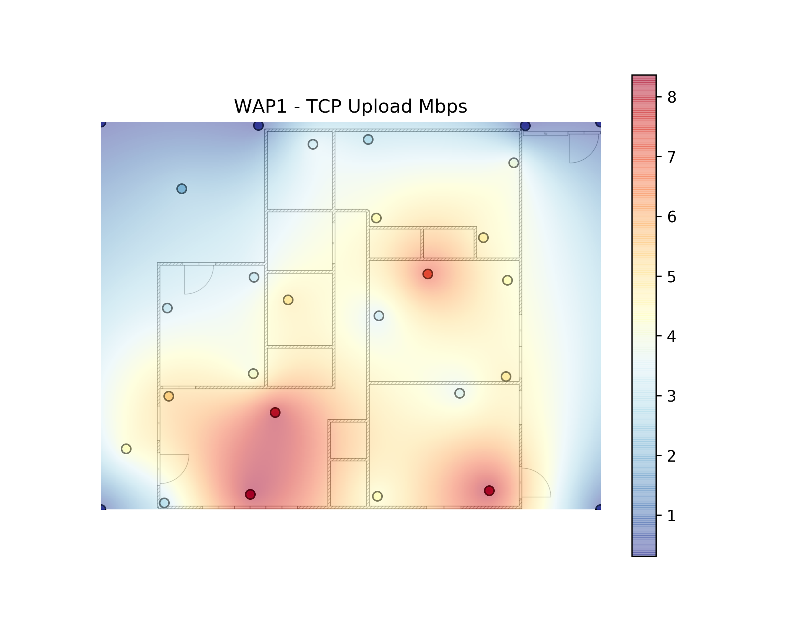

_Figura 3. Interfaz de python-wifi-survey-heatmap — generación de mapa de calor de cobertura Wi-Fi sobre plano digital._

---

#### Resumen comparativo

**Tabla 3.** Comparación de características entre herramientas de heatmapping existentes y Wireless HeatMapper

| Característica                        | WiFi Analyzer | WiFi Surveyor | python-wifi-survey | **Wireless HeatMapper** |
| ------------------------------------- | :-----------: | :-----------: | :----------------: | :---------------------: |
| Aplicación móvil Android              |      Sí       |      No       |        No          |           Sí            |
| Panel web de administración           |      No       |      No       |        No          |           Sí            |
| Backend centralizado con BD           |      No       |      No       |        No          |           Sí            |
| Generación de mapa de calor           |      No       |      Sí       |        Sí          |           Sí            |
| Levantamiento georreferenciado        |      No       |      Sí       |        Sí          |           Sí            |
| Análisis con Inteligencia Artificial  |      No       |      No       |        No          |           Sí            |
| Gestión de proyectos y clientes       |      No       |      No       |        No          |           Sí            |
| Multiusuario y acceso remoto          |      No       |      No       |        No          |           Sí            |


```{=openxml}
<w:p><w:r><w:br w:type="page"/></w:r></w:p>
```

## 1.3 Descripción del Problema

### 1.3.1 Narrativa del Problema

Bulldog Tech. es una empresa tecnológica con sede en Santa Cruz de la Sierra, Bolivia, con experiencia consolidada en servicios de soporte técnico, mantenimiento de equipos y consultoría en sistemas de información. Hace aproximadamente un año, la empresa amplió su operación incorporando el área de infraestructura tecnológica de telecomunicaciones, orientada a la instalación, configuración y mantenimiento de redes de datos inalámbricas para clientes corporativos y pymes de la región.

En esta área, Bulldog Tech. aplica el proceso tradicional del sector: el técnico especializado visita las instalaciones del cliente, evalúa el espacio y determina la ubicación de los puntos de acceso (APs) a partir de su criterio y experiencia directa. Es el técnico quien, durante esa visita presencial, aporta el mayor valor para las decisiones de diseño de la red: cuántos APs instalar, dónde colocarlos y cómo configurarlos. El proyecto avanza desde esa evaluación subjetiva como único insumo técnico documentado.

Ese modelo funciona en instalaciones simples, pero presenta limitaciones estructurales conforme la empresa asume proyectos de mayor envergadura. La principal es que el proceso no genera evidencia objetiva: no se miden niveles de señal por zona, no se documenta la cobertura real alcanzada y no se deja una línea base que permita comparar el estado de la red antes y después de una intervención. La metodología profesional de *site survey*, documentada en el estándar de la industria CWNA-107, establece que el umbral mínimo de calidad de señal aceptable para una instalación nueva es de −70 dBm, y que cualquier zona con señal inferior a −90 dBm constituye una zona muerta donde la conectividad funcional no puede garantizarse. Sin instrumentos de medición, no existe forma de verificar si estos umbrales se cumplen en el trabajo que la empresa entrega a sus clientes.

Las consecuencias se manifiestan tanto hacia adentro como hacia los proyectos del cliente. En las instalaciones propias de Bulldog Tech., los técnicos reportan cortes intermitentes en el área de taller, el personal administrativo trabaja con velocidades insuficientes y los clientes que esperan en recepción perciben una señal débil. Ante cada reporte de falla, el diagnóstico es informal: se visita el lugar, se reinicia el equipo, se revisan cables, sin registro escrito, sin identificación de causa raíz y sin garantía de que el problema no reaparezca. En los proyectos de clientes, la empresa no puede demostrar objetivamente que la red entregada cumple con los parámetros técnicos acordados, lo que representa un riesgo creciente a medida que la cartera de clientes se expande.

La ausencia de una herramienta de levantamiento formal impide tomar decisiones basadas en datos para la reubicación o ampliación de puntos de acceso, y hace que el conocimiento técnico sobre cada instalación permanezca en la memoria del técnico que realizó la visita, sin sistematizarse. Este problema no es exclusivo de Bulldog Tech.: representa una limitación común en empresas que inician en el área de infraestructura de telecomunicaciones y no disponen del presupuesto para contratar herramientas comerciales de *site survey* (como Ekahau Site Survey o AirMagnet), cuyo costo de licencia puede superar los USD 3,000 anuales.

---

### 1.3.2 Diagrama Causa-Efecto (Ishikawa)

El siguiente diagrama identifica las causas raíz que originan la deficiente gestión de cobertura Wi-Fi en Bulldog Tech.:

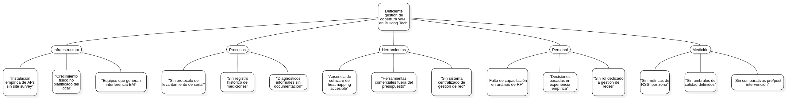

_Figura 4. Diagrama de causa-efecto (Ishikawa) — Deficiente gestión de cobertura Wi-Fi en Bulldog Tech._

---

### 1.3.3 Modelo de Dominio

El modelo de dominio representa los conceptos clave del negocio involucrados en el problema. Cada clase es un concepto puro del negocio, no una tabla ni una clase de código:

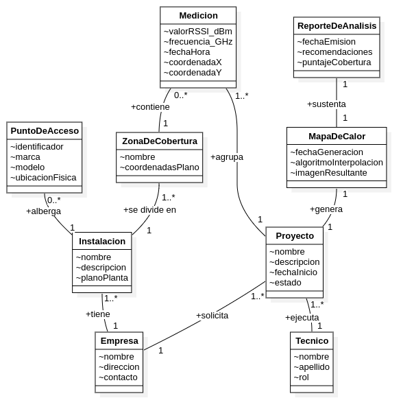

_Figura 5. Modelo de dominio — conceptos clave del problema de cobertura Wi-Fi en Bulldog Tech._


```{=openxml}
<w:p><w:r><w:br w:type="page"/></w:r></w:p>
```

## 1.4 Situación Problemática

Desde que Bulldog Tech. incorporó el área de infraestructura de telecomunicaciones, hace aproximadamente un año, los proyectos de instalación de redes inalámbricas se han ejecutado siguiendo un proceso tradicional: el técnico asignado visita las instalaciones del cliente, recorre los espacios, identifica los ambientes a cubrir y determina, a partir de su experiencia y criterio profesional, cuántos puntos de acceso instalar y dónde ubicarlos. En ese modelo, el técnico es la fuente principal de información para la toma de decisiones. Lo que él observa durante la visita es, en la práctica, el único insumo técnico que sustenta el diseño de la red.

Este enfoque funciona dentro de ciertos límites. Para instalaciones pequeñas y simples, el juicio del técnico experimentado es suficiente para lograr una cobertura aceptable. Sin embargo, a medida que los proyectos crecen en tamaño y complejidad, la evaluación subjetiva empieza a mostrar sus restricciones: no permite cuantificar la calidad de la señal por zona, no genera documentación que respalde las decisiones tomadas, no deja un registro que sirva como línea base para comparar el estado antes y después de una intervención, y no es transferible si el técnico que realizó la visita no está disponible para el seguimiento del proyecto.

El resultado de ese proceso, aplicado también a la infraestructura propia de Bulldog Tech., es una red Wi-Fi que funciona de forma general, pero sin que nadie pueda afirmar con certeza qué zonas tienen cobertura suficiente, cuáles presentan degradación de señal y dónde existen puntos ciegos. Las consecuencias se perciben en el día a día: cortes intermitentes en el área de taller, velocidades insuficientes en administración y señal débil en recepción. Ante cada reporte de falla, la respuesta es reactiva: se visita el lugar, se reinicia el equipo, se revisa el cableado, sin dejar registro escrito ni identificar la causa raíz, lo que hace que los mismos problemas reaparezcan semanas después.

La empresa carece de métricas objetivas de cobertura, de un historial de mediciones y de criterios técnicos documentados para fundamentar decisiones de mejora. Las inversiones en infraestructura de red se aplican sin sustento verificable, con resultados que no se pueden demostrar objetivamente ni a la gerencia ni a los clientes.


```{=openxml}
<w:p><w:r><w:br w:type="page"/></w:r></w:p>
```

## 1.5 Situación Deseada

Con Wireless HeatMapper implementado, Bulldog Tech. tendrá la capacidad de complementar el criterio técnico del especialista con datos de señal medidos objetivamente en campo. El técnico que realiza la visita al cliente seguirá siendo quien aporta el juicio profesional sobre el diseño de la red, pero contará con un instrumento que le permite respaldar sus decisiones: medirá los niveles de señal por zona sobre el plano real de las instalaciones, identificará con precisión los puntos ciegos y las zonas de cobertura degradada, y producirá un mapa de calor que documenta el estado de la red en el momento del levantamiento.

Para cada proyecto, el sistema generará un historial de mediciones que permite comparar el estado antes y después de cada intervención técnica. El módulo de inteligencia artificial analizará los datos recolectados y producirá recomendaciones de reposicionamiento de puntos de acceso fundamentadas en los umbrales de cobertura establecidos por el estándar CWNA-107. Los reportes generados automáticamente podrán ser entregados al cliente como parte del servicio, lo que fortalece la propuesta de valor de la empresa frente a instaladores que operan únicamente con criterio empírico.

El resultado más significativo es la formalización del proceso. El conocimiento que hoy reside exclusivamente en la experiencia del técnico quedará sistematizado en el historial de cada proyecto: qué se midió, cuándo, dónde y con qué resultado. Eso no solo reduce la dependencia de personas específicas, sino que permite a Bulldog Tech. crecer en el área de infraestructura de telecomunicaciones con un proceso técnico documentado, reproducible y verificable, apropiado para la envergadura de los proyectos que la empresa busca asumir.


```{=openxml}
<w:p><w:r><w:br w:type="page"/></w:r></w:p>
```

## 1.6 Objetivos

### 1.6.1 Objetivo General

Desarrollar un sistema integrado de levantamiento y visualización de cobertura Wi-Fi, compuesto por una aplicación móvil Android, un backend REST con módulo de inteligencia artificial y una plataforma web de administración, que permita a Bulldog Tech. diagnosticar, documentar y optimizar la distribución de su red inalámbrica mediante mapas de calor georreferenciados y análisis automatizado.

---

### 1.6.2 Objetivos Específicos

1. **Diseñar e implementar el backend REST** con FastAPI y PostgreSQL que gestione la autenticación de usuarios, la administración de clientes y proyectos, y el almacenamiento centralizado de mediciones Wi-Fi.
   - *Entregable:* API REST funcional con endpoints documentados y base de datos relacional normalizada.

2. **Desarrollar la aplicación móvil Android** con Flutter que permita al técnico autenticarse, seleccionar un proyecto, y recolectar mediciones de RSSI georreferenciadas sobre el plano de planta de la instalación.
   - *Entregable:* Aplicación Flutter con módulos de autenticación y levantamiento de señal operativos.

3. **Construir el panel web de administración** con React y TypeScript que permita gestionar usuarios, clientes, proyectos y visualizar los mapas de calor generados.
   - *Entregable:* Aplicación web funcional con autenticación, CRUD de entidades principales y visualización de resultados.

4. **Integrar un módulo de inteligencia artificial** en el backend capaz de analizar los datos de cobertura recolectados y generar recomendaciones de optimización de la red.
   - *Entregable:* Módulo de IA con al menos un modelo de análisis validado y endpoint de recomendaciones funcional.

5. **Definir y documentar la arquitectura de despliegue** del sistema mediante Docker Compose y GitHub Actions, garantizando la reproducibilidad del entorno en producción.
   - *Entregable:* Archivo `docker-compose.yml` funcional con todos los servicios orquestados y pipeline de CI/CD configurado.


```{=openxml}
<w:p><w:r><w:br w:type="page"/></w:r></w:p>
```

## 1.7 Alcance

El sistema Wireless HeatMapper abarca las siguientes funcionalidades organizadas por módulos:

---

### 1.7.1 Módulo de Autenticación y Usuarios

Gestiona el acceso seguro al sistema para todos los perfiles de usuario. Incluye:

- Registro e inicio de sesión con autenticación JWT.
- Gestión de roles: Administrador, Técnico y Cliente.
- Recuperación de contraseña y gestión de perfil.
- Control de sesiones activas y cierre de sesión seguro.

---

### 1.7.2 Módulo de Gestión de Clientes y Proyectos

Permite la administración completa de los clientes (empresas) y sus proyectos de levantamiento Wi-Fi. Incluye:

- Alta, edición y desactivación de clientes (organizaciones).
- Creación y gestión de proyectos de levantamiento por instalación.
- Carga y administración del plano de planta de cada instalación.
- Asignación de técnicos a proyectos.
- Listado, filtrado y seguimiento del estado de proyectos.

---

### 1.7.3 Módulo de Levantamiento Wi-Fi (App Móvil)

Ejecutado desde la aplicación Android Flutter, permite al técnico recolectar datos de señal en campo. Incluye:

- Visualización del plano de planta del proyecto activo.
- Marcación de puntos de medición sobre el plano con posicionamiento táctil.
- Captura automática de valores RSSI, SSID, BSSID, frecuencia y canal de todas las redes detectadas en cada punto.
- Indicador visual del nivel de cobertura por punto medido.
- Envío inmediato de mediciones al backend (modalidad 100% en línea, sin almacenamiento local).
- Control de throttling Android (máx. 4 escaneos / 2 min en Android 8.0+).

---

### 1.7.4 Módulo de Generación de Heatmap

Procesa las mediciones recolectadas y genera la visualización de cobertura. Incluye:

- Interpolación de valores RSSI sobre el plano usando algoritmo IDW (*Inverse Distance Weighting*).
- Generación de mapa de calor con escala de colores por umbral (excelente, buena, aceptable, débil, zona muerta).
- Exportación del mapa de calor como imagen PNG y como reporte PDF.
- Historial de mapas por proyecto para comparativa temporal.

---

### 1.7.5 Módulo de Análisis con Inteligencia Artificial

Procesa los datos de cobertura y genera recomendaciones automatizadas. Incluye:

- Identificación de zonas muertas (RSSI ≤ −90 dBm) y zonas con cobertura insuficiente.
- Detección de solapamiento excesivo de canales entre APs.
- Generación de recomendaciones textuales: reubicación de APs, cambio de canal, potencia de transmisión.
- Puntaje global de calidad de cobertura por instalación.

---

### 1.7.6 Panel de Administración Web

Interfaz web accesible desde navegador para administradores y clientes. Incluye:

- Dashboard con resumen de proyectos activos y alertas de cobertura.
- CRUD completo de usuarios, clientes y proyectos.
- Visualización de mapas de calor y descarga de reportes.
- Historial de levantamientos y comparativa de evolución de cobertura.
- Gestión de configuración del sistema.

---

### Requerimientos fuera del alcance

Los siguientes aspectos quedan **explícitamente fuera del alcance** del proyecto:

- Soporte para tecnologías de red distintas a Wi-Fi (Bluetooth, LTE, Ethernet).
- Posicionamiento en interiores con GPS o trilateración (el posicionamiento es manual sobre plano).
- Módulo de facturación o cobro de servicios.
- Integración con sistemas ERP o CRM externos.
- Modo offline en la aplicación móvil (toda la persistencia ocurre en el backend).


```{=openxml}
<w:p><w:r><w:br w:type="page"/></w:r></w:p>
```

## 1.8 Tecnología de Desarrollo

### 1.8.1 Stack Tecnológico

#### Backend

**Tabla 11a.** Stack tecnológico — Backend

| Tecnología        | Uso                                           | Justificación                                                                                                                                                    |
| ----------------- | --------------------------------------------- | ---------------------------------------------------------------------------------------------------------------------------------------------------------------- |
| **Python 3.11+**  | Lenguaje principal del backend                | Ecosistema maduro para ciencia de datos e IA; sintaxis clara; amplia disponibilidad de bibliotecas para procesamiento de señales y machine learning.              |
| **FastAPI**       | Framework REST API                            | Alto rendimiento (basado en Starlette/ASGI), validación automática con Pydantic, generación de documentación OpenAPI integrada y soporte nativo para async/await. |
| **PostgreSQL 15+**| Base de datos relacional central              | Motor robusto, open source, soporte de tipos espaciales (PostGIS para coordenadas), transacciones ACID y excelente integración con SQLAlchemy.                    |
| **SQLAlchemy**    | ORM y acceso a datos                          | Permite un control preciso del esquema y las consultas; facilita la migración con Alembic y desacopla el modelo de dominio del motor de BD.                       |
| **Alembic**       | Migraciones de base de datos                  | Control de versiones del esquema de base de datos alineado con el ciclo de desarrollo incremental de Scrum.                                                       |

#### Aplicación Móvil

| Tecnología          | Uso                                           | Justificación                                                                                                                                               |
| ------------------- | --------------------------------------------- | ----------------------------------------------------------------------------------------------------------------------------------------------------------- |
| **Flutter / Dart**  | App Android (cliente REST en línea)           | Un solo código base para múltiples plataformas, widgets Material 3, rendimiento nativo. Elimina la necesidad de BD local (modalidad 100% en línea).          |
| **BLoC / Cubit**    | Gestión de estado                             | Patrón declarativo, testeable y predecible; separa presentación de lógica de negocio conforme a la arquitectura por capas del proyecto.                     |
| **Dio**             | Cliente HTTP                                  | Interceptores de autenticación JWT, manejo de errores centralizado y soporte para *multipart* (carga de planos e imágenes).                                  |

#### Frontend Web

| Tecnología              | Uso                                           | Justificación                                                                                                                                              |
| ----------------------- | --------------------------------------------- | ---------------------------------------------------------------------------------------------------------------------------------------------------------- |
| **React 18 + TypeScript** | Panel de administración web                 | Ecosistema maduro, tipado estático que reduce errores en tiempo de desarrollo, componentes reutilizables y amplio soporte de la comunidad.                  |
| **Vite**                | Bundler y servidor de desarrollo              | Compilación rápida en desarrollo, Hot Module Replacement eficiente, configuración mínima.                                                                  |
| **TanStack Query**      | Gestión de estado del servidor                | Caché automática, sincronización con el backend y manejo declarativo de estados de carga y error.                                                          |

#### Infraestructura y Despliegue

| Tecnología           | Uso                                           | Justificación                                                                                                                                                  |
| -------------------- | --------------------------------------------- | -------------------------------------------------------------------------------------------------------------------------------------------------------------- |
| **Docker Compose**   | Orquestación de servicios en local/producción | Reproducibilidad del entorno; todos los servicios (backend, BD, frontend, Nginx) se levantan con un único comando.                                             |
| **Nginx**            | Reverse proxy                                 | Gestión centralizada de rutas HTTP/HTTPS; separa el tráfico de la API del frontend estático.                                                                   |
| **GitHub Actions**   | CI/CD                                         | Integrado con el repositorio; automatiza linting, pruebas, construcción de imágenes Docker y despliegue al entorno de producción en cada merge a `main`.       |

#### Herramientas CASE y Desarrollo Colaborativo

| Herramienta       | Uso                                                    |
| ----------------- | ------------------------------------------------------ |
| **StarUML**       | Modelado UML 2.5+: casos de uso, clases, secuencia, despliegue, paquetes |
| **PlantUML**      | Diagramas embebidos en documentación Markdown           |
| **GitHub**        | Control de versiones, gestión de issues y pull requests |
| **VS Code**       | IDE principal con extensiones para Flutter, Python y TypeScript |

---

### 1.8.2 Proceso de Desarrollo

El proyecto adopta **Scrum** como marco de trabajo ágil, combinando su ciclo iterativo e incremental con las cuatro actividades fundamentales de ingeniería de software: análisis, diseño, implementación y pruebas. Estas actividades se ejecutan dentro de cada sprint, lo que permite un desarrollo continuo con entregas verificables al final de cada iteración.

#### Estructura del proceso

```
Sprint 0 (Inicio)
├── Organización del equipo (roles Scrum)
├── Ingeniería de Requisitos inicial (conversación con el cliente)
└── Modelos iniciales: contexto, arquitectura, datos → Product Backlog

Sprint N (1, 2, 3...)
├── Planificación del Sprint
│   ├── Selección de HU del Product Backlog
│   ├── Análisis: Las 3 C's (Cards, Conversación, Confirmación)
│   └── Sprint Backlog (tareas de granularidad mínima)
│
├── Ejecución del Sprint
│   ├── Diseño: arquitectura, datos, lógica, interfaces
│   ├── Implementación: código con estándar y refactoring
│   └── Pruebas: unitarias (dev), calidad (QA), aceptación (PO)
│
└── Revisión del Sprint
    ├── Demostración del incremento operativo al cliente
    └── Actualización del Product Backlog
```

#### Roles del equipo

| Rol              | Integrante                         | Responsabilidad principal                                   |
| ---------------- | ---------------------------------- | ----------------------------------------------------------- |
| Scrum Master     | Fernandez Ortega Jhasmany Jhunnior | Facilitar el proceso Scrum; remover impedimentos             |
| Product Owner    | Quiroga Flores Herland Borys       | Gestionar el Product Backlog; representar al cliente         |
| Desarrolladores  | Ambos integrantes                  | Diseño, implementación y pruebas (equipo multifuncional)    |

#### Duración de sprints

| Sprint          | Duración          | Fechas                        |
| --------------- | ----------------- | ----------------------------- |
| Sprint 0        | 1 semana (5 días) | 13 abr 2026 → 17 abr 2026    |
| Sprint 1        | 1 semana (5 días) | 20 abr 2026 → 24 abr 2026    |
| Sprint 2 al 6   | 2 semanas (14 días) | A partir del 27 abr 2026    |
| Cierre          | 1 semana (5 días) | Al finalizar Sprint 6         |

> **M0 — Presentación conjunta Sprint 0 + Sprint 1:** 27 de abril de 2026.

#### Incremento

Cada sprint debe generar una **versión operativa de software** que aporte valor real al cliente. Las historias de usuario se consideran completas únicamente cuando pasan los tres filtros de prueba: unitarias (desarrollador), calidad (QA) y aceptación (Product Owner).

#### Plan de Sprints — Gantt

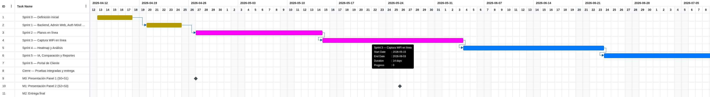

_Figura 15. Diagrama de Gantt — Cronograma de sprints del proyecto Wireless HeatMapper (abril–julio 2026)._

#### Objetivos por Sprint

**Tabla 12.** Objetivos e hitos verificables por sprint

| Sprint   | Objetivo                                                                                                    | Hito verificable                                                |
| -------- | ----------------------------------------------------------------------------------------------------------- | --------------------------------------------------------------- |
| Sprint 0 | Backend "hello world" con Docker Compose, PostgreSQL, CI/CD y modelos UML aprobados                        | `curl /api/health` → 200 OK                                     |
| Sprint 1 | Admin crea técnicos y clientes en panel web; técnico inicia sesión en app y gestiona proyectos             | Crear usuario/cliente en web → login en app → CRUD proyectos    |
| Sprint 2 | Técnico sube plano PNG/PDF y lo calibra sobre un proyecto; persiste en PostgreSQL                           | Recorrido completo plano + calibración                          |
| Sprint 3 | Técnico marca puntos sobre el plano y captura mediciones Wi-Fi persistidas en línea                        | Demo en vivo captura → BD muestra registros                     |
| Sprint 4 | Técnico solicita heatmap al backend y ve análisis automático (zonas muertas, CCI/ACI); el sistema aplica los umbrales CWNA-107 (−70 dBm objetivo, −90 dBm zona muerta) para clasificar las zonas | Heatmap renderizado + panel de análisis con clasificación por zonas                         |
| Sprint 5 | Técnico recibe recomendaciones de IA, compara escenarios y exporta reporte PDF                              | Recomendaciones IA + comparación + PDF descargable              |
| Sprint 6 | Técnico genera enlace; cliente lo abre en navegador y ve heatmap, análisis y plan AP                       | Portal de cliente con token real funcionando                    |


```{=openxml}
<w:p><w:r><w:br w:type="page"/></w:r></w:p>
```

## 1.9 Bibliografía

Las siguientes referencias sustentan el desarrollo técnico y metodológico del proyecto Wireless HeatMapper, presentadas en formato APA 7.ª edición.

---

### Referencias

Coleman, D., Westcott, D. A., Harkins, B., & Jackman, S. (2021). *CWNA: Certified Wireless Network Administrator study guide (Examen CWNA-107)* (5.ª ed.). Sybex / Wiley.

Schwaber, K., & Sutherland, J. (2020). *La Guía Definitiva de Scrum: Las Reglas del Juego*. Scrum.org. https://scrumguides.org/docs/scrumguide/v2020/2020-Scrum-Guide-Spanish-Latin-South-American.pdf

IEEE. (2016). *IEEE Standard for Information Technology — Telecommunications and information exchange between systems — Local and metropolitan area networks — Specific requirements — Part 11: Wireless LAN Medium Access Control (MAC) and Physical Layer (PHY) Specifications (IEEE Std 802.11-2016)*. Institute of Electrical and Electronics Engineers.

FastAPI. (2024). *FastAPI — Documentación oficial*. Tiangolo. https://fastapi.tiangolo.com/

Flutter. (2024). *Flutter — Documentación oficial*. Google. https://docs.flutter.dev/

PostgreSQL Global Development Group. (2024). *PostgreSQL 15 Documentation*. https://www.postgresql.org/docs/15/

VREM Software Development. (2024). *WiFi Analyzer* [Software de código abierto]. GitHub. https://github.com/VREMSoftwareDevelopment/WiFiAnalyzer

ecoAPM. (2023). *WiFi Surveyor* [Software de código abierto]. GitHub. https://github.com/ecoAPM/WiFiSurveyor

Antman, J. (2023). *python-wifi-survey-heatmap* [Software de código abierto]. GitHub. https://github.com/jantman/python-wifi-survey-heatmap

Object Management Group. (2017). *OMG® Unified Modeling Language® (OMG UML®) Version 2.5.1*. https://www.omg.org/spec/UML/2.5.1/

React. (2024). *React — Documentación oficial*. Meta Open Source. https://react.dev/

Docker Inc. (2024). *Docker Compose — Documentación oficial*. https://docs.docker.com/compose/


```{=openxml}
<w:p><w:r><w:br w:type="page"/></w:r></w:p>
```

## 1.10 Anexos

### 1.10.1 Esquema Gráfico: Situación Actual vs. Situación Deseada

El siguiente diagrama ilustra el contraste entre el estado actual de gestión de cobertura Wi-Fi en Bulldog Tech. y el escenario que se alcanzará con la implementación de Wireless HeatMapper:


---

### 1.10.2 Datos del Caso de Estudio

| Campo               | Detalle                                                        |
| ------------------- | -------------------------------------------------------------- |
| **Empresa**         | Bulldog Tech.                                                  |
| **Rubro**           | Servicios tecnológicos: soporte, consultoría, redes           |
| **Ubicación**       | Santa Cruz de la Sierra, Bolivia                               |
| **Problemática**    | Deficiente gestión y diagnóstico de cobertura Wi-Fi interna    |
| **Áreas afectadas** | Taller técnico, área administrativa, sala de atención al cliente |
| **Necesidad clave** | Herramienta accesible de site survey y heatmapping Wi-Fi       |

---

### 1.10.3 Currículum Vitae de los Integrantes

#### Fernandez Ortega Jhasmany Jhunnior

| Campo              | Detalle                                               |
| ------------------ | ----------------------------------------------------- |
| **Carrera**        | Ingeniería Informática — FICCT, UAGRM                |
| **Registro**       | 207025509                                             |
| **Rol en el proyecto** | Scrum Master / Desarrollador                      |
| **Áreas de enfoque** | Backend, infraestructura, DevOps                   |

---

#### Quiroga Flores Herland Borys

| Campo              | Detalle                                               |
| ------------------ | ----------------------------------------------------- |
| **Carrera**        | Ingeniería Informática — FICCT, UAGRM                |
| **Registro**       | 200104373                                             |
| **Rol en el proyecto** | Product Owner / Desarrollador                    |
| **Áreas de enfoque** | Análisis de requisitos, frontend web, mobile       |

---

### Nota sobre la Carta de Formalización

La **Carta de Formalización** del acuerdo con el cliente Bulldog Tech. es un documento físico firmado que se adjunta de forma impresa al presente trabajo. Contiene el compromiso formal entre el equipo de desarrollo y el representante de Bulldog Tech. para la ejecución del proyecto Wireless HeatMapper bajo el marco de trabajo Scrum.


```{=openxml}
<w:p><w:r><w:br w:type="page"/></w:r></w:p>
```

# 2. Redes Inalámbricas de Área Local y Análisis de Cobertura WiFi

El presente capítulo expone los fundamentos conceptuales del dominio que Wireless HeatMapper modela en la operación diaria de Bulldog Tech. No se retoman aquí las bases físicas ya desarrolladas en los antecedentes, sino los criterios técnicos que convierten una medición aislada en una evaluación útil de cobertura, capacidad y calidad de servicio dentro de una red inalámbrica empresarial.

La primera parte aborda el diseño de redes *Wireless Local Area Network* (WLAN, red de área local inalámbrica), donde se definen objetivos de cobertura, solapamiento de celdas y capacidad por punto de acceso. Luego se examina la planificación de canales y la gestión de interferencias, aspecto decisivo cuando varias celdas comparten espectro en un mismo edificio. La tercera sección estudia los sistemas de información geoespacial para interiores, necesarios para traducir un plano digital en un espacio de medición con coordenadas y escala verificables.

Finalmente, se desarrolla la lógica de visualización de datos de radiofrecuencia mediante mapas de calor y el proceso de validación posterior al despliegue. Estos conceptos no se incorporan como teoría ornamental. Cada uno se refleja en decisiones concretas del software: clasificación cromática del *heatmap* (mapa de calor), calibración métrica de planos, posicionamiento de muestras, detección de interferencias y criterios de análisis comparativo entre escenarios de cobertura.

### Referencias

Coleman, D., Westcott, D. A., Harkins, B., & Jackman, S. (2021). *CWNA: Certified Wireless Network Administrator study guide (Examen CWNA-107)* (5.ª ed.). Sybex.

International Organization for Standardization. (2014). *ISO 19115-1:2014 Geographic information—Metadata—Part 1: Fundamentals*. ISO.


```{=openxml}
<w:p><w:r><w:br w:type="page"/></w:r></w:p>
```

## 2.1 Diseño y Planificación de Redes WLAN

El diseño de una red *Wireless Local Area Network* (WLAN, red de área local inalámbrica) parte de metas de cobertura medibles. El CWNA-107 diferencia un objetivo primario de aproximadamente −65 dBm para áreas con aplicaciones sensibles a latencia, como voz sobre IP, y un objetivo secundario de −70 dBm para nuevas instalaciones donde se prioriza conectividad estable de datos. Esa distinción evita evaluar la red con un único umbral absoluto. Un edificio puede cumplir conectividad general y, al mismo tiempo, fallar para servicios que requieren márgenes de señal más exigentes.

La cobertura no se analiza solo por intensidad puntual. También importa el solapamiento entre celdas vecinas. En despliegues corporativos se recomienda un traslape de 15 % a 20 % entre áreas útiles de servicio para permitir *roaming* (traspaso de asociación entre puntos de acceso) sin cortes perceptibles. Si el solapamiento es menor, el cliente pierde continuidad durante el desplazamiento. Si es excesivo, aumenta la contención del medio y se degrada la reutilización espectral.

La capacidad por punto de acceso tampoco puede estimarse desde el estándar nominal. En 802.11ac y 802.11ax el ancho de canal, la modulación, la cantidad de flujos espaciales y la densidad de usuarios concurrentes modifican el *throughput* (caudal útil) real disponible para cada cliente. En escenarios empresariales, un AP que anuncia velocidades muy superiores a 1 Gbps rara vez entrega esa cifra como capacidad efectiva por usuario; el presupuesto debe considerar sobrecarga MAC, contención CSMA/CA y degradación por distancia. Por ello, el dimensionamiento de celdas y el análisis de capacidad deben evaluarse de forma conjunta.

El modelo idealizado de celdas hexagonales sirve como abstracción para planificar reutilización y cobertura. Sin embargo, en edificios reales la señal se deforma por muros, mobiliario, ductos, ascensores y vacíos estructurales. La celda observada deja de ser regular y adquiere contornos asimétricos. Wireless HeatMapper toma esa diferencia como criterio operativo: no asume geometrías perfectas, sino que parte de mediciones sobre plano para aproximar la cobertura efectiva de cada zona.

En el proyecto, los umbrales de −65 dBm y −70 dBm alimentan la clasificación visual del *heatmap*, mientras que la lectura del solapamiento entre celdas permite justificar recomendaciones de reubicación o ajuste de potencia de puntos de acceso. El análisis de cobertura, por tanto, no se limita a colorear un plano; interpreta si la distribución espacial satisface el objetivo de diseño esperado para el edificio intervenido.

### Referencias

Coleman, D., Westcott, D. A., Harkins, B., & Jackman, S. (2021). *CWNA: Certified Wireless Network Administrator study guide (Examen CWNA-107)* (5.ª ed.). Sybex.

IEEE. (2021). *IEEE Standard for Information Technology—Telecommunications and information exchange between systems Local and metropolitan area networks—Specific requirements—Part 11: Wireless LAN Medium Access Control (MAC) and Physical Layer (PHY) Specifications*. Institute of Electrical and Electronics Engineers.


```{=openxml}
<w:p><w:r><w:br w:type="page"/></w:r></w:p>
```

## 2.2 Planificación de Canales y Gestión de Interferencias

La planificación de canales determina cuánta eficiencia puede conservar una WLAN cuando múltiples puntos de acceso operan en un mismo espacio físico. En la banda de 2.4 GHz existen 14 canales definidos por el estándar, aunque en la región de las Américas normalmente se utilizan 11. Debido al ancho espectral de 20 MHz y a la cercanía entre frecuencias centrales, solo los canales 1, 6 y 11 pueden considerarse no solapados en condiciones normales de diseño. Esa restricción convierte a 2.4 GHz en una banda útil para compatibilidad, pero limitada para ambientes densos.

La banda de 5 GHz ofrece mayor flexibilidad. Los canales se distribuyen en segmentos *Unlicensed National Information Infrastructure* (UNII, infraestructura nacional no licenciada), comúnmente UNII-1, UNII-2 y UNII-3, con un conjunto amplio de canales no solapados cuando se trabaja en anchos de 20 MHz. En la práctica, el aprovechamiento efectivo depende del país, de la política regulatoria sobre DFS y del perfil de los clientes. Aun así, 5 GHz brinda mejores condiciones para reutilización espectral y diseño de alta densidad.

Un patrón de reutilización de canales busca separar celdas cercanas que emiten en la misma frecuencia. Cuando dos APs comparten canal y se escuchan mutuamente se produce *Co-Channel Interference* (CCI, interferencia co-canal). No siempre implica corrupción de tramas, pero sí más tiempo de espera, menor eficiencia y degradación del *throughput*. En cambio, la *Adjacent Channel Interference* (ACI, interferencia de canal adyacente) sí introduce solapamiento espectral entre celdas en canales vecinos, fenómeno especialmente dañino en 2.4 GHz por el reuso incorrecto de combinaciones como 1, 3 y 5.

Otro problema clásico es el *hidden node problem* (problema del nodo oculto). Ocurre cuando dos clientes no pueden oírse entre sí, aunque ambos sí alcanzan al mismo AP. El resultado son colisiones repetidas en el receptor compartido. El mecanismo RTS/CTS no elimina toda la ineficiencia, pero puede reducirla al coordinar la reserva temporal del medio antes de la transmisión de tramas más sensibles a colisión.

En Wireless HeatMapper estos conceptos se traducen en reglas de análisis. El sistema puede identificar puntos de acceso observados en el levantamiento, reconocer coincidencia de canal y valorar si existe un patrón de solapamiento problemático cuando señales elevadas del mismo canal coexisten en zonas cercanas. Esa lectura resulta esencial para el módulo de interferencias y para la emisión de recomendaciones sobre cambio de canal, redistribución de potencia o segmentación por banda.

### Referencias

Coleman, D., Westcott, D. A., Harkins, B., & Jackman, S. (2021). *CWNA: Certified Wireless Network Administrator study guide (Examen CWNA-107)* (5.ª ed.). Sybex.

IEEE. (2021). *IEEE Standard for Information Technology—Telecommunications and information exchange between systems Local and metropolitan area networks—Specific requirements—Part 11: Wireless LAN Medium Access Control (MAC) and Physical Layer (PHY) Specifications*. Institute of Electrical and Electronics Engineers.


```{=openxml}
<w:p><w:r><w:br w:type="page"/></w:r></w:p>
```

## 2.3 Sistemas de Información Geoespacial para Interiores

Los sistemas de posicionamiento en interiores, conocidos como *Indoor Positioning Systems* (IPS, sistemas de posicionamiento en interiores), surgieron para suplir la pérdida de precisión del GPS en ambientes cerrados. Las cubiertas, muros y elementos estructurales atenúan o bloquean la señal satelital, por lo que el posicionamiento absoluto deja de ser confiable dentro de edificios. En ese contexto se recurre a alternativas basadas en coordenadas relativas, sensores inerciales, triangulación por radio, *fingerprinting* (huellas de señal) o marcación manual sobre un plano digital.

Para aplicaciones de survey WiFi, el plano de planta cumple el papel de sistema de referencia local. En lugar de coordenadas geográficas globales, el software trabaja con una superficie bidimensional donde cada punto se expresa mediante coordenadas relativas sobre la imagen del edificio. Esa decisión simplifica la captura en campo y evita depender de infraestructura adicional. No obstante, obliga a calibrar la escala con rigor para que un desplazamiento en píxeles represente una distancia física consistente.

La digitalización de planos puede partir de formatos raster, como PNG o JPG, o de formatos vectoriales, como PDF o SVG. Los primeros almacenan la imagen como malla de píxeles y son sencillos de renderizar en clientes móviles. Los segundos preservan trazos geométricos y pueden escalar sin pérdida, aunque requieren procesamiento adicional para su visualización homogénea. En Wireless HeatMapper se admite la importación de PNG, JPG y PDF, con renderizado de la primera página a imagen utilizable dentro del editor de planos.

El factor de escala se calcula como la razón entre la distancia real medida y la distancia observada en el plano digital. Si dos puntos separados 100 píxeles equivalen a 10 metros reales, entonces la escala es de 0.1 metros por píxel. A partir de ese valor, cualquier medición posterior puede convertirse desde la superficie digital a una magnitud física interpretable. Esa operación resulta central para la georreferenciación de muestras, ya que cada punto (x, y) marcado sobre el plano adquiere significado espacial dentro del edificio.

En el proyecto, la calibración definida en PB-11 establece esa relación métrica, mientras que PB-04 reutiliza el plano calibrado para registrar puntos de medición en coordenadas consistentes. La decisión de usar marcación manual sobre plano responde al contexto operativo: no requiere infraestructura de balizas, funciona con recursos disponibles en campo y deja evidencia visual inmediata del recorrido realizado.

**Tabla 13.** Comparativa de métodos de posicionamiento en interiores aplicables a levantamientos WiFi

| Método | Principio operativo | Ventajas | Limitaciones | Aplicación en el proyecto |
| ------ | ------------------- | -------- | ------------ | ------------------------- |
| Triangulación | Estima posición a partir de distancias o ángulos respecto a múltiples emisores | Puede automatizar ubicación | Requiere geometría controlada y referencias adicionales | No se adopta como mecanismo principal |
| *Fingerprinting* | Compara patrones de señal observados con una base histórica del entorno | Buena precisión en ambientes estables | Exige entrenamiento previo y mantenimiento del mapa de huellas | Se considera insumo analítico futuro, no para captura base |
| *Dead reckoning* | Integra acelerómetro, giroscopio y rumbo para estimar desplazamiento | Funciona sin infraestructura externa | Acumula error con rapidez en recorridos largos | No es suficiente para la precisión requerida |
| Marcación manual sobre plano | El técnico selecciona el punto exacto sobre el plano digital calibrado | Simple, controlable y alineado al flujo de survey | Depende de disciplina operativa del técnico | Método adoptado en PB-04 |

### Referencias

Li, B., Gallagher, T., Dempster, A. G., & Rizos, C. (2012). How feasible is the use of magnetic field alone for indoor positioning? *2012 International Conference on Indoor Positioning and Indoor Navigation*, 1–9. https://doi.org/10.1109/IPIN.2012.6418880

OGC. (2019). *IndoorGML 1.1*. Open Geospatial Consortium. https://www.ogc.org/standards/indoorgml

Zlatanova, S., Sithole, G., Nakagawa, M., & Zhu, Q. (2013). Problems in indoor mapping and modelling. *ISPRS Annals of the Photogrammetry, Remote Sensing and Spatial Information Sciences, II-4/W1*, 63–68. https://doi.org/10.5194/isprsannals-II-4-W1-63-2013


```{=openxml}
<w:p><w:r><w:br w:type="page"/></w:r></w:p>
```

## 2.4 Visualización de Datos RF mediante Mapas de Calor y Validación de Cobertura

Un *heatmap* (mapa de calor) representa una superficie continua de intensidad derivada de un conjunto discreto de muestras. En el contexto de radiofrecuencia, cada medición de señal se asocia a una posición sobre el plano y luego se interpola para estimar valores en áreas no muestreadas de manera puntual. El resultado no sustituye la observación original; la amplifica espacialmente para facilitar la lectura de patrones, transiciones y vacíos de cobertura.

La convención cromática cumple una función semántica. Verde suele indicar cobertura excelente, amarillo una condición buena o aceptable, naranja una degradación ya perceptible, rojo una señal débil y negro o gris una zona muerta. En redes WiFi empresariales, estos rangos se interpretan a partir de umbrales como los descritos en la Tabla 13.1 del CWNA-107. Un color, por sí solo, carece de valor técnico si no está ligado a una escala explícita de dBm y a un criterio de uso previsto.

La validación posterior a la instalación compara el diseño previsto con la medición real. No basta con comprobar que existe conectividad. Se debe cuantificar qué porcentaje del área útil conserva niveles iguales o superiores a −70 dBm, cuánta superficie cae por debajo de −90 dBm y dónde se concentran las discontinuidades. Estas métricas convierten la inspección visual en una evaluación repetible, útil para aceptar o corregir un despliegue.

También resulta relevante la comparación entre escenarios. Un mismo plano puede levantarse antes y después de una optimización de potencia, de un cambio de canal o de la reubicación de un punto de acceso. Al contrastar dos superficies de cobertura se identifican mejoras, degradaciones y desplazamientos del patrón de señal. Esa capacidad es valiosa para Bulldog Tech., porque permite demostrar con evidencia espacial si una intervención produjo el efecto esperado.

Wireless HeatMapper adopta esta lógica como base para el módulo de *heatmap* del Sprint 4 y para la comparación de escenarios prevista en el Sprint 5. La utilidad del sistema no radica solo en visualizar colores sobre un plano, sino en vincular cada zona con umbrales de aceptación, métricas de cobertura y recomendaciones operativas derivadas del comportamiento real de la WLAN.

**Tabla 14.** Métricas de validación de cobertura para entornos empresariales basadas en CWNA-107

| Métrica | Umbral de referencia | Interpretación operativa |
| ------- | -------------------- | ------------------------ |
| Área con señal ≥ −70 dBm | Meta principal de diseño | Cobertura adecuada para datos empresariales y continuidad de servicio |
| Área con señal ≥ −65 dBm | Meta reforzada | Cobertura apta para aplicaciones sensibles a latencia |
| Área con señal < −90 dBm | Debe tender a 0 % | Zona muerta o de conectividad marginal |
| Comparación entre escenarios | Diferencia por celda o por área agregada | Permite verificar mejora o deterioro después de una intervención |

### Referencias

Coleman, D., Westcott, D. A., Harkins, B., & Jackman, S. (2021). *CWNA: Certified Wireless Network Administrator study guide (Examen CWNA-107)* (5.ª ed.). Sybex.

Longley, P. A., Goodchild, M. F., Maguire, D. J., & Rhind, D. W. (2015). *Geographic information science and systems* (4.ª ed.). Wiley.


```{=openxml}
<w:p><w:r><w:br w:type="page"/></w:r></w:p>
```

# 3. Arquitectura y Stack Tecnológico del Sistema

Este capítulo desarrolla los conceptos técnicos que sustentan la arquitectura implementada en Wireless HeatMapper. No se reiteran las razones de selección del stack expuestas previamente, sino que se profundiza en la forma en que cada tecnología participa en el comportamiento del sistema y en la interacción entre sus componentes: backend, persistencia, aplicación móvil, panel web, módulo analítico e infraestructura de despliegue.

La revisión se organiza siguiendo el flujo principal de la solución. Primero se examina la capa de servicios REST del backend con FastAPI y el esquema de autenticación basado en JWT. Después se estudia la persistencia relacional con PostgreSQL, SQLAlchemy y Alembic. La tercera y cuarta secciones explican la arquitectura del cliente móvil en Flutter y del panel web en React con TypeScript, ambos integrados con el backend mediante contratos tipados.

El capítulo concluye con la fundamentación del análisis automatizado de cobertura y con la infraestructura de contenedores, proxy reverso y automatización continua. En conjunto, estas tecnologías hacen posible una solución estrictamente en línea, donde la captura, almacenamiento, análisis y visualización de la cobertura WiFi se ejecutan como un sistema coordinado y verificable.

### Referencias

FastAPI. (2024). *FastAPI — Documentación oficial*. Tiangolo. https://fastapi.tiangolo.com/

PostgreSQL Global Development Group. (2024). *PostgreSQL 15 documentation*. https://www.postgresql.org/docs/15/


```{=openxml}
<w:p><w:r><w:br w:type="page"/></w:r></w:p>
```

## 3.1 Arquitectura REST y Framework FastAPI

La arquitectura *Representational State Transfer* (REST, transferencia de estado representacional) organiza la API alrededor de recursos direccionables y operaciones uniformes. En Wireless HeatMapper esto se expresa mediante rutas claras para proyectos, planos, puntos y mediciones, con mensajes autocontenidos y sin estado de sesión persistido en el servidor entre solicitudes. El principio *stateless* (sin estado) simplifica la escalabilidad horizontal y obliga a que cada petición incluya su contexto de autenticación.

La interfaz uniforme se concreta mediante verbos HTTP coherentes con la intención del recurso: `POST` para crear, `GET` para consultar, `PATCH` para actualizar y `DELETE` para remover. El principio de sistema por capas también está presente. El cliente conversa con Nginx, el proxy reenvía al backend y este delega la lógica a routers, esquemas y repositorios. Cuando una respuesta es susceptible de reutilización, como un detalle de recurso, el diseño permite incorporar comportamiento *cacheable* (almacenable en caché) sin alterar el contrato expuesto.

La autenticación se apoya en *JSON Web Token* (JWT, token web JSON). Un JWT contiene tres segmentos: `header`, `payload` y `signature`. El encabezado indica algoritmo y tipo; la carga útil incorpora identidad y reclamos; la firma protege la integridad del token. En el flujo del proyecto, el usuario se autentica una vez, recibe un token de acceso de corta duración y utiliza un mecanismo de renovación para obtener nuevos tokens sin reenviar credenciales en cada operación.

FastAPI aporta dos capacidades decisivas. La primera es la generación automática de contratos OpenAPI 3.0 a partir de tipos Python y modelos declarados. La segunda es su ejecución sobre *Asynchronous Server Gateway Interface* (ASGI, interfaz asíncrona de pasarela para servidores), que permite aprovechar `async` y `await` cuando una operación requiere concurrencia eficiente. Aunque no toda la lógica es asíncrona, el modelo de FastAPI facilita mezclar validación, serialización y enrutamiento con bajo costo ceremonial.

El patrón de inyección de dependencias mediante `Depends()` estructura buena parte del backend. Se utiliza para resolver autenticación, sesiones de base de datos y colaboradores de acceso a datos sin acoplar las funciones de ruta a instancias globales rígidas. Sobre esa base, Pydantic v2 valida esquemas de entrada y salida, convierte tipos, aplica restricciones y serializa respuestas en formatos consistentes.

En la solución implementada, esta fundamentación se observa en la capa de presentación del backend: routers especializados, esquemas para entrada y salida, dependencias para control de acceso y documentación automática de los endpoints que consumen la app móvil y el panel web.

### Referencias

FastAPI. (2024). *FastAPI — Documentación oficial*. Tiangolo. https://fastapi.tiangolo.com/

Fielding, R. T. (2000). *Architectural styles and the design of network-based software architectures* (Doctoral dissertation, University of California, Irvine).

Jones, M., Bradley, J., & Sakimura, N. (2015). *JSON Web Token (JWT)* (RFC 7519). IETF. https://doi.org/10.17487/RFC7519


```{=openxml}
<w:p><w:r><w:br w:type="page"/></w:r></w:p>
```

## 3.2 Persistencia con PostgreSQL, SQLAlchemy y Alembic

PostgreSQL 15 constituye la fuente central de verdad del sistema. Su modelo transaccional ACID garantiza atomicidad, consistencia, aislamiento y durabilidad, propiedades indispensables cuando una misma operación debe registrar un punto de medición y varias lecturas WiFi como un único lote coherente. En este proyecto también resultan relevantes tipos como `NUMERIC` o `FLOAT` para factores de escala, `BYTEA` cuando se requiere almacenar binarios en otros escenarios, y `TIMESTAMP WITH TIME ZONE` para auditar eventos desde diferentes clientes sin perder referencia temporal uniforme.

Sobre el motor relacional se aplica la capa *Object-Relational Mapper* (ORM, mapeador objeto-relacional). El ORM no reemplaza el modelo de dominio, pero reduce fricción entre objetos de aplicación y tablas persistentes. En Wireless HeatMapper el patrón Repository encapsula consultas y reglas de acceso a datos, mientras que la unidad transaccional se conserva en la sesión SQLAlchemy, siguiendo la lógica de una *Unit of Work* (unidad de trabajo) controlada por solicitud.

SQLAlchemy resuelve el mapeo de entidades, relaciones y ciclo de vida de objetos persistidos. La gestión de `Session` delimita cuándo una transacción inicia, confirma o revierte cambios. A su vez, la distinción entre *lazy loading* (carga diferida) y *eager loading* (carga anticipada) permite equilibrar simplicidad y rendimiento según el caso. Relaciones declaradas con `relationship()` enlazan proyectos con planos, planos con puntos y puntos con mediciones, manteniendo integridad de cascada cuando el modelo así lo exige.

Alembic extiende esta arquitectura al versionado del esquema. Cada migración se registra como código reproducible, trazable y reversible. El modo `autogenerate` acelera la detección de cambios estructurales, aunque la revisión manual sigue siendo necesaria para asegurar nombres, tipos y restricciones coherentes. En el proyecto, la migración inicial establece la base del sistema; la migración `a1b2c3d4e5f6` introduce la entidad de planos y sus campos de calibración; y las migraciones `c3d4e5f6a7b8` y `d5e6f7a8b9c0` incorporan el modelo de mediciones y el campo `numero_lectura` para sesiones continuas.

Esta capa tecnológica define la persistencia del backend. Gracias a ella, la lógica de negocio puede operar sobre entidades del dominio sin perder control sobre transacciones, claves foráneas, cascadas de borrado ni evolución incremental del esquema de base de datos.

### Referencias

Alembic. (2024). *Alembic documentation*. SQLAlchemy authors. https://alembic.sqlalchemy.org/

PostgreSQL Global Development Group. (2024). *PostgreSQL 15 documentation*. https://www.postgresql.org/docs/15/

SQLAlchemy. (2024). *SQLAlchemy 2.0 documentation*. https://docs.sqlalchemy.org/


```{=openxml}
<w:p><w:r><w:br w:type="page"/></w:r></w:p>
```

## 3.3 Desarrollo Móvil con Flutter y Arquitectura BLoC

Flutter construye la interfaz a partir de un árbol declarativo de widgets que el motor de renderizado dibuja con alta frecuencia de actualización. En plataformas Android recientes, la pila gráfica puede apoyarse en Skia o Impeller para mantener animaciones e interacción fluida. Esta base resulta particularmente útil en Wireless HeatMapper, donde el técnico manipula planos, ejecuta zoom, desplaza la vista y necesita retroalimentación visual inmediata durante la captura en campo.

La app se organiza con una arquitectura limpia de tres capas: presentación, dominio y datos. La capa de presentación contiene páginas, componentes visuales y gestores de estado. La capa de dominio modela entidades y casos de uso sin depender de detalles externos. La capa de datos integra clientes HTTP, serialización y repositorios concretos. Esta división reduce acoplamiento y facilita pruebas unitarias sobre flujos críticos como autenticación, calibración y captura WiFi.

El patrón *Business Logic Component* (BLoC, componente de lógica de negocio) y su variante Cubit desacoplan la interfaz de las transiciones de estado. Un Cubit recibe eventos implícitos desde la interacción del usuario, ejecuta lógica de negocio y emite estados observables por la UI. En el proyecto esto se aprecia en `PlanosCubit` y `CapturaCubit`, que controlan carga de datos, modo continuo, detalle de punto, errores de envío y pausas por conectividad o throttling.

Para la visualización del plano se emplean `CustomPainter` e `InteractiveViewer`. El primero permite pintar sobre la superficie elementos como puntos de calibración, líneas de referencia y marcadores de medición. El segundo gestiona zoom y desplazamiento con conservación del contexto visual. Gracias a esta combinación, la coordenada seleccionada por el técnico se traduce a píxeles del plano real y no a coordenadas efímeras de pantalla.

La aplicación integra además tres complementos críticos: `wifi_scan` para obtener resultados de escaneo, `permission_handler` para gestionar permisos Android y `file_picker` para seleccionar planos desde el dispositivo. El cliente HTTP se implementa con Dio, que permite interceptores para JWT, reintentos con retroceso exponencial y manejo centralizado de errores de red. Sobre este flujo opera `ThrottlingManager`, responsable de respetar la restricción de Android 8.0 o superior de 4 escaneos cada 2 minutos.

En conjunto, estas decisiones sostienen la arquitectura móvil del proyecto: una app orientada a trabajo de campo, con interacción táctil sobre planos, captura en línea y separación clara entre presentación, lógica y acceso a datos.

### Referencias

Flutter. (2024). *Flutter — Documentación oficial*. Google. https://docs.flutter.dev/

Google. (2024). *Wi-Fi scan overview*. Android Developers. https://developer.android.com/develop/connectivity/wifi/wifi-scan

bloclibrary.dev. (2024). *bloc package documentation*. https://bloclibrary.dev/


```{=openxml}
<w:p><w:r><w:br w:type="page"/></w:r></w:p>
```

## 3.4 Desarrollo Web con React 18 y TypeScript

React 18 estructura la interfaz mediante componentes funcionales y *hooks* (ganchos) que encapsulan estado, efectos y memorias derivadas. `useState` gestiona datos locales, `useEffect` sincroniza la vista con cambios externos, `useContext` distribuye información transversal como autenticación, y `useCallback` ayuda a estabilizar referencias de función cuando el componente lo requiere. Este modelo es adecuado para un panel administrativo que combina formularios, tablas, navegación y consumo intensivo de API.

TypeScript agrega tipado estático sobre JavaScript. En un sistema como Wireless HeatMapper, donde backend, móvil y web comparten conceptos de dominio, las interfaces tipadas reducen ambigüedad en contratos de datos y mejoran la detección temprana de errores. Los *type guards* (guardas de tipo) permiten validar estructuras en tiempo de ejecución cuando la información proviene del servidor o de entradas externas.

La arquitectura del panel corresponde a una *Single Page Application* (SPA, aplicación de página única). El enrutamiento ocurre del lado del cliente y evita recargas completas para operaciones internas de administración. Cuando un módulo no es requerido de inmediato, puede cargarse mediante división de código con `React.lazy`, lo que reduce el volumen inicial transferido al navegador.

El estado del servidor se administra con TanStack Query. La biblioteca conserva resultados en caché, usa `queryKey` para identificar recursos, controla vigencia con `staleTime` y simplifica invalidaciones después de mutaciones como creación o edición. Esta aproximación evita duplicar en estado local información cuyo origen autorizado sigue siendo el backend. En términos prácticos, mejora consistencia y reduce solicitudes redundantes.

Vite complementa el flujo con compilación rápida y *Hot Module Replacement* (HMR, reemplazo de módulos en caliente) durante el desarrollo. En producción, el empaquetado aprovecha optimizaciones como *tree shaking* (eliminación de código no usado), lo que favorece entregas ligeras del frontend. Sobre esa base se monta el contexto de autenticación del panel, encargado de almacenar el token, proteger rutas y coordinar el mecanismo de renovación cuando corresponde.

Esta fundamentación se refleja en la arquitectura del panel web del proyecto, especialmente en páginas como Login, Dashboard, Users, Organizations y Projects, que operan como una interfaz administrativa coherente sobre el mismo backend REST utilizado por la app móvil.

### Referencias

Microsoft. (2024). *TypeScript documentation*. https://www.typescriptlang.org/docs/

React. (2024). *React — Documentación oficial*. Meta Open Source. https://react.dev/

TanStack. (2024). *TanStack Query documentation*. https://tanstack.com/query/latest

Vite. (2024). *Vite guide*. https://vite.dev/guide/


```{=openxml}
<w:p><w:r><w:br w:type="page"/></w:r></w:p>
```

## 3.5 Inteligencia Artificial Aplicada al Análisis de Cobertura WiFi

El análisis automatizado de cobertura puede formularse como un problema de clasificación espacial y de generación de recomendaciones sobre una superficie medida parcialmente. Cada punto capturado entrega una observación discreta de RSSI, canal y frecuencia. A partir de ese conjunto, el sistema debe estimar el comportamiento del espacio completo, identificar patrones anómalos y proponer acciones con sentido técnico. No se trata de una inteligencia artificial genérica, sino de un motor analítico acotado al dominio de propagación y validación WiFi.

El método de interpolación previsto es *Inverse Distance Weighting* (IDW, ponderación por distancia inversa). Su lógica asigna a cada celda de la grilla un valor calculado a partir de mediciones vecinas ponderadas por la distancia elevada a una potencia `p`. Cuando `p` aumenta, las muestras cercanas dominan con más fuerza el resultado. Esta técnica es apropiada para el proyecto porque ofrece una relación favorable entre costo computacional, interpretabilidad y capacidad de ejecución en backend sobre planos de tamaño moderado.

Sobre la superficie interpolada opera una clasificación por umbrales basada en CWNA-107. Cada celda o punto puede etiquetarse como EXCELENTE, BUENA, ACEPTABLE, DEBIL o ZONA_MUERTA según el rango de dBm observado o estimado. Esta clasificación convierte un valor continuo en una señal de decisión utilizable por el técnico y por los módulos de visualización del sistema.

El análisis de interferencias requiere una segunda capa de reglas. Cuando varias muestras del mismo punto revelan APs en el mismo canal con RSSI alto, existe evidencia para investigar solapamiento co-canal. Si la distribución de canales vecinos en 2.4 GHz es inadecuada, también puede inferirse riesgo de interferencia adyacente. Sobre esos hallazgos se construye un árbol de decisiones simple: zonas muertas sugieren incorporación o reubicación de AP; CCI persistente sugiere ajuste de canal; señal marginal en áreas extensas sugiere revisar potencia, densidad o ubicación.

La comparación de escenarios amplía el módulo analítico. Dos matrices de cobertura obtenidas sobre el mismo plano pueden restarse para detectar mejora o deterioro por región. Con ello, el sistema no solo evalúa un levantamiento aislado, sino el efecto de una optimización entre dos estados del despliegue.

En el proyecto, esta fundamentación sostiene el módulo analítico del backend previsto para los Sprint 4 y 5, donde la cobertura deja de ser un dato descriptivo y pasa a convertirse en una interpretación operativa del comportamiento WiFi del edificio.

### Referencias

Li, Y., Ai, B., He, R., Yang, Z., & Zhong, Z. (2020). Machine learning based wireless channel modeling: Challenges and opportunities. *IEEE Communications Magazine, 58*(3), 112–118. https://doi.org/10.1109/MCOM.001.1900487

Shepard, D. (1968). A two-dimensional interpolation function for irregularly-spaced data. *Proceedings of the 1968 ACM National Conference*, 517–524. https://doi.org/10.1145/800186.810616


```{=openxml}
<w:p><w:r><w:br w:type="page"/></w:r></w:p>
```

## 3.6 Infraestructura con Docker Compose, Nginx y CI/CD

Docker encapsula aplicaciones y dependencias dentro de imágenes reproducibles compuestas por capas de sistema de archivos. Cada contenedor aísla procesos, variables y puertos, lo que permite ejecutar servicios heterogéneos con configuración consistente entre desarrollo, pruebas y despliegue. En Wireless HeatMapper este enfoque evita configuraciones manuales divergentes entre backend, base de datos, frontend y proxy.

Docker Compose extiende esa lógica hacia la orquestación local de varios servicios. El archivo de composición del proyecto describe contenedores para `db`, `backend`, `web` y `nginx`, además de volúmenes persistentes para la base de datos y el almacenamiento de planos. Los *healthchecks* (comprobaciones de salud) permiten determinar cuándo un servicio está listo para aceptar conexiones, reduciendo fallos por arranque desordenado entre dependencias.

Nginx actúa como *reverse proxy* (proxy reverso), punto de entrada único para tráfico HTTP y HTTPS. Mediante bloques `upstream` y reglas `proxy_pass`, el servidor separa el tráfico dirigido al backend REST del contenido estático entregado por el frontend. Esta capa también puede centralizar encabezados de seguridad, compresión, límites de carga y terminación TLS cuando el entorno lo exige.

La automatización continua se apoya en GitHub Actions. Un flujo de trabajo en `.github/workflows/ci.yml` puede encadenar validación de código, ejecución de pruebas y construcción de artefactos. En términos de proceso, el pipeline del proyecto sigue la secuencia lógica de `push` a `main`, verificación técnica, construcción de imágenes y preparación para despliegue. Las credenciales sensibles no se fijan en el repositorio; se administran mediante secretos y variables de entorno definidas en el entorno de ejecución.

Esta infraestructura respalda el comportamiento 100 % en línea del sistema. La app móvil, el panel web y el backend no operan como piezas aisladas, sino como servicios coordinados que comparten persistencia, autenticación y un mismo punto de publicación sobre la red.

### Referencias

Docker Inc. (2024). *Docker Compose — Documentación oficial*. https://docs.docker.com/compose/

GitHub. (2024). *GitHub Actions documentation*. https://docs.github.com/actions

Nginx, Inc. (2024). *NGINX admin guide*. https://docs.nginx.com/


```{=openxml}
<w:p><w:r><w:br w:type="page"/></w:r></w:p>
```

# Sprint 0 — Organización del Equipo

## S0.1 Organización del Equipo Scrum

El Sprint 0 corresponde al momento de inicio del proyecto, previo al primer sprint de desarrollo. En esta etapa se definió la estructura del equipo, se establecieron los canales de comunicación y se acordaron las herramientas de trabajo colaborativo.

**Duración:** 1 semana (5 días hábiles)
**Fecha de inicio:** 13 de abril de 2026
**Fecha de fin:** 17 de abril de 2026
**Hito al finalizar (M1):** Backend "hello world" con Docker Compose, PostgreSQL y CI/CD funcionando.

### Cronograma del Sprint 0

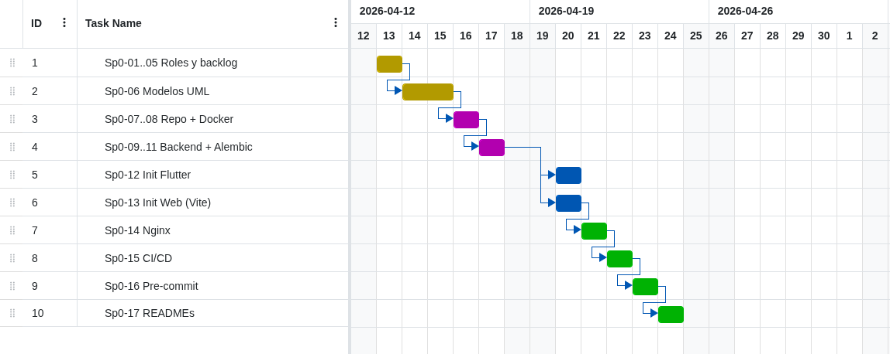

_Figura 23. Diagrama de Gantt — Planificación detallada del Sprint 0 (13–17 abr 2026)._

---

### Roles asignados

| Rol              | Integrante                           | Responsabilidades                                                                                                           |
| ---------------- | ------------------------------------ | --------------------------------------------------------------------------------------------------------------------------- |
| **Scrum Master** | Fernandez Ortega Jhasmany Jhunnior   | Facilitar los eventos Scrum, remover impedimentos, asegurar el cumplimiento del marco de trabajo, gestionar el tablero Kanban |
| **Product Owner**| Quiroga Flores Herland Borys         | Definir y priorizar el Product Backlog, interlocutor con el cliente (Bulldog Tech.), validar criterios de aceptación         |
| **Desarrolladores** | Ambos integrantes               | Diseño, implementación y pruebas; el equipo es multifuncional y autogestionado                                               |

---

### Herramientas de trabajo colaborativo

| Herramienta        | Propósito                                              |
| ------------------ | ------------------------------------------------------ |
| GitHub             | Control de versiones, gestión de issues y pull requests |
| GitHub Projects    | Tablero Kanban para seguimiento del Sprint Backlog      |
| VS Code + extensiones | IDE principal con Live Share para trabajo colaborativo |
| WhatsApp / Discord | Comunicación informal del equipo                        |
| StarUML            | Modelado UML 2.5+                                       |

---

### Acuerdo de trabajo

- **Frecuencia de Daily Scrum:** diaria (asincrónica por chat cuando no coinciden horarios).
- **Duración de sprints:** Sprint 0 = 1 semana (13–17 abr 2026); Sprint 1 = 1 semana (20–24 abr 2026); Sprint 2 en adelante = 2 semanas.
- **M0 — Presentación conjunta Sprint 0 + Sprint 1:** 27 de abril de 2026.
- **Estándar de commits:** mensajes en español, con prefijo de tipo (`feat:`, `fix:`, `docs:`, `test:`).
- **Definición de Hecho (DoD):** código revisado por el compañero, pruebas unitarias pasando, funcionalidad demostrable en entorno local.


```{=openxml}
<w:p><w:r><w:br w:type="page"/></w:r></w:p>
```

# Sprint 0 — Ingeniería de Requisitos

## S0.2 Ingeniería de Requisitos Inicial

Durante el Sprint 0 se realizó la sesión inicial de levantamiento de requisitos con el representante de Bulldog Tech. El Product Owner condujo la entrevista siguiendo las 3 C's: documentar las historias (Cards), conversar con el cliente para comprenderlas (Conversación) y confirmar la comprensión mediante ejemplos concretos (Confirmación).

---

### Técnicas utilizadas

- **Entrevista semiestructurada** con el cliente para identificar problemas operativos concretos.
- **Modelo de dominio preliminar** para alinear el vocabulario del negocio con el equipo.
- **Brainstorming interno** para identificar actores, funcionalidades y restricciones.

---

### Requerimientos Principales identificados (RP)

**Tabla 3.** Requerimientos principales del sistema Wireless HeatMapper

| ID    | Requerimiento Principal                                                                      | Prioridad |
| ----- | -------------------------------------------------------------------------------------------- | :-------: |
| RP1   | Gestión de usuarios y autenticación segura (JWT, roles)                                      | Alta      |
| RP2   | Gestión de clientes (organizaciones) por parte del administrador                             | Alta      |
| RP3   | Gestión de proyectos de levantamiento Wi-Fi                                                  | Alta      |
| RP4   | Levantamiento de señal Wi-Fi desde app móvil (recolección de mediciones RSSI)               | Alta      |
| RP5   | Generación de mapa de calor georreferenciado sobre plano de planta                           | Alta      |
| RP6   | Análisis con IA y generación de recomendaciones de optimización                              | Media     |
| RP7   | Panel web de administración y visualización de resultados                                    | Alta      |
| RP8   | Generación y exportación de reportes (PDF/PNG)                                               | Media     |
| RP9   | Gestión de planos de planta (carga y administración)                                         | Media     |

---

### Product Backlog inicial — Historias de Usuario (resumen)

**Tabla 4.** Product Backlog inicial — Historias de usuario priorizadas

| ID     | Historia de Usuario                                                   | PHU | Sprint |
| ------ | --------------------------------------------------------------------- | :-: | :----: |
| PB-01  | Como administrador, quiero gestionar usuarios del sistema             |  3  |   1    |
| PB-09  | Como administrador, quiero gestionar clientes (organizaciones)        |  5  |   1    |
| PB-10  | Como usuario, quiero autenticarme con correo y contraseña             |  3  |   1    |
| PB-13  | Como administrador, quiero gestionar proyectos de levantamiento       |  5  |   1    |
| PB-18  | Como administrador, quiero ver el listado de proyectos por cliente    |  3  |   1    |
| PB-19  | Como técnico, quiero autenticarme desde la app móvil                  |  3  |   1    |
| PB-02  | Como técnico, quiero seleccionar un proyecto y ver su plano           |  5  |   2    |
| PB-03  | Como técnico, quiero marcar puntos de medición sobre el plano         |  8  |   2    |
| PB-04  | Como técnico, quiero que se capture el RSSI automáticamente al marcar |  5  |   2    |
| PB-05  | Como sistema, quiero generar el heatmap a partir de las mediciones    |  8  |   2    |
| PB-06  | Como administrador, quiero ver el heatmap en el panel web             |  5  |   3    |
| PB-07  | Como sistema, quiero analizar la cobertura con IA                     | 13  |   3    |
| PB-08  | Como administrador, quiero exportar reportes en PDF                   |  5  |   3    |
| PB-11  | Como técnico, quiero gestionar planos de planta desde la app          |  5  |   2    |
| PB-12  | Como administrador, quiero gestionar planos desde el panel web        |  3  |   2    |
| PB-15  | Como cliente, quiero ver mis proyectos en el panel web                |  3  |   3    |
| PB-16  | Como sistema, quiero enviar notificaciones de alerta de cobertura     |  5  |   3    |
| PB-17  | Como administrador, quiero gestionar configuración del sistema        |  3  |   3    |

> **Nota:** PB-14 (sincronización offline) fue **eliminada** en la modalidad 100% en línea. Toda la persistencia ocurre en el backend.


```{=openxml}
<w:p><w:r><w:br w:type="page"/></w:r></w:p>
```

# Sprint 0 — Modelos Iniciales del Sistema

## S0.3 Modelos Iniciales

Como resultado de la ingeniería de requisitos del Sprint 0 se generaron los tres modelos iniciales que sirven como base para todos los sprints posteriores.

---

## S0.3.1 Modelo de Contexto — Diagrama de Casos de Uso

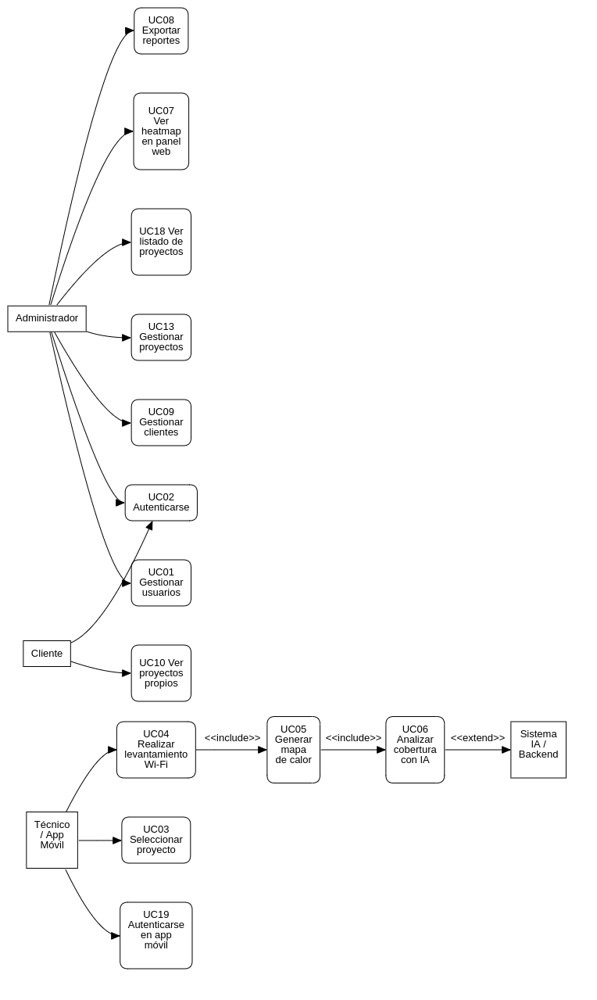

_Figura 6. Modelo de contexto — Diagrama de casos de uso del sistema Wireless HeatMapper._

---

### Diagrama de Paquetes


_Figura 7. Diagrama de paquetes — Arquitectura por capas del sistema Wireless HeatMapper._

### Diagrama de Despliegue


_Figura 8. Diagrama de despliegue — Infraestructura Docker del sistema Wireless HeatMapper._

---

## S0.3.3 Modelo de Datos Inicial — Conceptual


_Figura 9. Modelo conceptual de datos — Entidades principales del dominio de Wireless HeatMapper._


```{=openxml}
<w:p><w:r><w:br w:type="page"/></w:r></w:p>
```

# Sprint 1 — Historias de Usuario

## S1.1 Historias de Usuario del Sprint 1

**Objetivo del Sprint 1:** Establecer la fundación del sistema con el backend base, el panel de administración web (gestión de usuarios, clientes y proyectos), y la autenticación desde la app móvil.

**Duración:** 1 semana (5 días hábiles: 20–24 de abril de 2026)
**Presentación conjunta S0+S1:** 27 de abril de 2026
**Puntos de Historia del Sprint:** 29 PHU

### Cronograma del Sprint 1

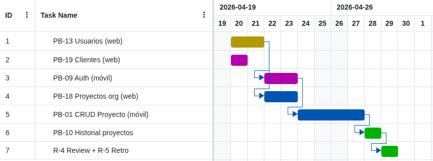

_Figura 24. Diagrama de Gantt — Planificación detallada del Sprint 1 (20–24 abr 2026)._

---

### PB-13 — Gestionar proyectos de levantamiento

| Campo                | Detalle |
| -------------------- | ------- |
| **ID**               | PB-13 |
| **Rol**              | Como administrador |
| **Funcionalidad**    | quiero crear, editar, visualizar y eliminar proyectos de levantamiento Wi-Fi |
| **Beneficio**        | para organizar el trabajo técnico por cliente e instalación |
| **PHU**              | 5 |
| **RP asociado**      | RP3 |

**Criterios de aceptación:**
- El administrador puede crear un nuevo proyecto asociado a un cliente existente.
- El sistema valida que el nombre del proyecto no esté duplicado para el mismo cliente.
- El administrador puede editar nombre, descripción y estado del proyecto.
- El administrador puede desactivar (eliminación lógica) un proyecto.
- El listado de proyectos muestra nombre, cliente, estado y fecha de creación.

---

### PB-19 — Autenticarse en la app móvil

| Campo                | Detalle |
| -------------------- | ------- |
| **ID**               | PB-19 |
| **Rol**              | Como técnico |
| **Funcionalidad**    | quiero iniciar sesión desde la aplicación móvil con mi correo y contraseña |
| **Beneficio**        | para acceder de forma segura a mis proyectos asignados |
| **PHU**              | 3 |
| **RP asociado**      | RP1 |

**Criterios de aceptación:**
- El técnico ingresa correo y contraseña; el sistema autentica contra el backend.
- Si las credenciales son correctas, se almacena el token JWT en memoria segura de la app.
- Si las credenciales son incorrectas, se muestra un mensaje de error claro.
- La sesión persiste mientras el token es válido.
- El técnico puede cerrar sesión explícitamente.

---

### PB-09 — Gestionar clientes (organizaciones)

| Campo                | Detalle |
| -------------------- | ------- |
| **ID**               | PB-09 |
| **Rol**              | Como administrador |
| **Funcionalidad**    | quiero registrar, editar, ver y desactivar clientes (organizaciones) en el sistema |
| **Beneficio**        | para tener un catálogo actualizado de empresas con proyectos de levantamiento |
| **PHU**              | 5 |
| **RP asociado**      | RP2 |

**Criterios de aceptación:**
- El administrador puede registrar una nueva organización con nombre, dirección y contacto.
- El sistema impide registrar dos organizaciones con el mismo nombre.
- El administrador puede editar los datos de una organización existente.
- El administrador puede desactivar una organización (no se eliminan sus proyectos).
- El listado muestra nombre, contacto, estado y fecha de registro.

---

### PB-18 — Ver listado de proyectos por cliente

| Campo                | Detalle |
| -------------------- | ------- |
| **ID**               | PB-18 |
| **Rol**              | Como administrador |
| **Funcionalidad**    | quiero ver todos los proyectos agrupados o filtrados por cliente |
| **Beneficio**        | para tener visibilidad del trabajo activo e histórico por organización |
| **PHU**              | 3 |
| **RP asociado**      | RP3, RP7 |

**Criterios de aceptación:**
- El panel web muestra un listado de proyectos filtrable por cliente.
- Cada entrada muestra: nombre del proyecto, cliente, estado y fecha de creación.
- El administrador puede navegar al detalle de cualquier proyecto desde el listado.

---

### PB-01 — Gestionar usuarios del sistema

| Campo                | Detalle |
| -------------------- | ------- |
| **ID**               | PB-01 |
| **Rol**              | Como administrador |
| **Funcionalidad**    | quiero crear, editar, ver y desactivar usuarios del sistema |
| **Beneficio**        | para controlar quién tiene acceso al sistema y con qué rol |
| **PHU**              | 3 |
| **RP asociado**      | RP1 |

**Criterios de aceptación:**
- El administrador puede crear un usuario asignando nombre, correo, contraseña temporal y rol.
- Los roles disponibles son: Administrador, Técnico, Cliente.
- El sistema no permite dos usuarios con el mismo correo.
- El administrador puede editar datos y cambiar el rol de un usuario.
- El administrador puede desactivar un usuario (no puede iniciar sesión al estar inactivo).

---

### PB-10 — Autenticarse en el panel web

| Campo                | Detalle |
| -------------------- | ------- |
| **ID**               | PB-10 |
| **Rol**              | Como usuario (administrador o cliente) |
| **Funcionalidad**    | quiero iniciar sesión en el panel web con correo y contraseña |
| **Beneficio**        | para acceder de forma segura a las funciones que corresponden a mi rol |
| **PHU**              | 3 |
| **RP asociado**      | RP1 |

**Criterios de aceptación:**
- El usuario ingresa correo y contraseña en el formulario de login.
- Si las credenciales son correctas, se genera un token JWT y se redirige al dashboard.
- Si las credenciales son incorrectas, se muestra mensaje de error sin revelar cuál campo falló.
- El sistema redirige automáticamente al login si el token expira.
- El usuario puede cerrar sesión desde cualquier página del panel.

---

### Resumen del Sprint Backlog

| HU     | Descripción                              | PHU | Estado   |
| ------ | ---------------------------------------- | :-: | -------- |
| PB-13  | Gestionar proyectos de levantamiento     |  5  | Completada |
| PB-19  | Autenticarse en la app móvil             |  3  | Completada |
| PB-09  | Gestionar clientes (organizaciones)      |  5  | Completada |
| PB-18  | Ver listado de proyectos por cliente     |  3  | Completada |
| PB-01  | Gestionar usuarios del sistema           |  3  | Completada |
| PB-10  | Autenticarse en el panel web             |  3  | Completada |
| **Total** |                                       | **22** | |

> **Nota:** Los 29 PHU incluyen tareas técnicas de infraestructura (configuración de Docker Compose, setup de base de datos, pipeline CI/CD) contabilizadas en el Sprint Backlog pero no asociadas a una HU específica (7 PHU adicionales).


```{=openxml}
<w:p><w:r><w:br w:type="page"/></w:r></w:p>
```

# Sprint 1 — Modelos Generados

## S1.2 Modelos del Sprint 1

---

## S1.2.1 Modelo de Contexto — Sprint 1

El diagrama de casos de uso muestra exclusivamente las funcionalidades abarcadas en el Sprint 1:

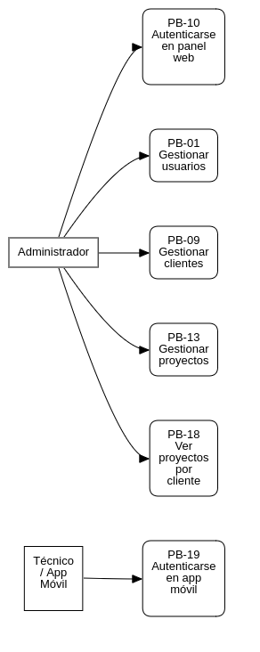

_Figura 10. Modelo de contexto actualizado al Sprint 1 — Casos de uso implementados en la primera iteración._

---

### Diagrama de Paquetes (Sprint 1)


_Figura 11. Diagrama de paquetes del Sprint 1 — Módulos implementados y sus dependencias._

### Diagrama de Despliegue (Sprint 1)


_Figura 12. Diagrama de despliegue del Sprint 1 — Configuración Docker de los contenedores en producción._

---

### Modelo Conceptual


_Figura 13. Modelo conceptual de datos del Sprint 1 — Entidades de usuario, organización y proyecto._

### Modelo Lógico (Esquema Relacional)

```
usuarios (
  id          PK  SERIAL
  nombre          VARCHAR(100)  NOT NULL
  apellido        VARCHAR(100)  NOT NULL
  correo          VARCHAR(255)  NOT NULL  UNIQUE
  contrasena_hash VARCHAR(255)  NOT NULL
  rol             VARCHAR(20)   NOT NULL  CHECK (rol IN ('admin','tecnico','cliente'))
  activo          BOOLEAN       NOT NULL  DEFAULT TRUE
  fecha_creacion  TIMESTAMP     NOT NULL  DEFAULT NOW()
)

organizaciones (
  id             PK  SERIAL
  nombre             VARCHAR(200)  NOT NULL  UNIQUE
  direccion          VARCHAR(300)
  contacto           VARCHAR(200)
  activo             BOOLEAN       NOT NULL  DEFAULT TRUE
  fecha_creacion     TIMESTAMP     NOT NULL  DEFAULT NOW()
)

proyectos (
  id               PK  SERIAL
  nombre               VARCHAR(200)  NOT NULL
  descripcion          TEXT
  estado               VARCHAR(20)   NOT NULL  DEFAULT 'activo'
                         CHECK (estado IN ('activo','pausado','completado','cancelado'))
  fecha_inicio         DATE
  fecha_fin            DATE
  fecha_creacion       TIMESTAMP     NOT NULL  DEFAULT NOW()
  organizacion_id  FK  INTEGER       NOT NULL  REFERENCES organizaciones(id)
  usuario_id       FK  INTEGER                 REFERENCES usuarios(id)
)
```

### Normalización aplicada

- **1FN:** Todos los atributos son atómicos; no hay grupos repetitivos.
- **2FN:** No hay dependencias parciales (todas las tablas tienen clave primaria simple).
- **3FN:** No hay dependencias transitivas; `rol` y `estado` usan CHECK constraint en lugar de tabla de lookup para simplicidad en este sprint.

---

## S1.2.4 Modelo de Lógica — Flujo de Autenticación (PB-10 / PB-19)

El flujo de autenticación es el proceso más relevante del Sprint 1 por involucrar múltiples componentes. Se documenta mediante diagrama de secuencia:

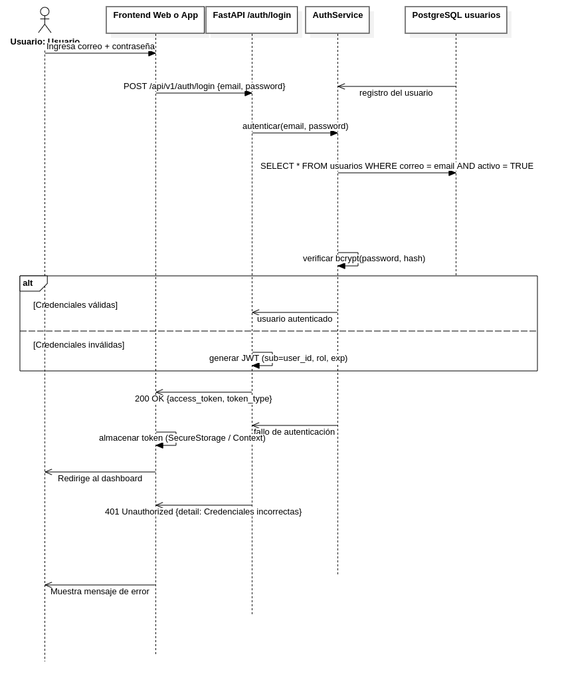

_Figura 14. Diagrama de secuencia — Flujo de autenticación mediante JWT (PB-10 / PB-19)._


```{=openxml}
<w:p><w:r><w:br w:type="page"/></w:r></w:p>
```

# Sprint 1 — Implementación

## S1.3 Avance de Implementación

### Estándar de codificación adoptado

- **Backend (Python):** PEP 8, nombres en `snake_case`, docstrings en funciones públicas, tipado estático con `mypy`.
- **Frontend (TypeScript):** ESLint + Prettier, componentes funcionales con hooks, nombres de archivos en `PascalCase` para componentes y `camelCase` para utilidades.
- **Mobile (Dart):** Guía de estilo oficial de Flutter (`dart format`), BLoC separado por funcionalidad, repositorios con interfaz en dominio e implementación en data.

### Estilo arquitectónico

- **Backend:** Arquitectura por capas (presentación → servicios → repositorios → base de datos).
- **Frontend web:** Componentes con separación de lógica (`hooks`) y presentación (`JSX`).
- **App móvil:** Clean Architecture de tres capas (presentation / domain / data) con BLoC/Cubit.

### Gestión de base de datos

Se utiliza **SQLAlchemy ORM** con **Alembic** para migraciones. Esta decisión otorga:
- Desacoplamiento del modelo de dominio del motor de BD.
- Control de versiones del esquema en cada sprint.
- Facilidad de pruebas con base de datos en memoria (SQLite) en CI.

---

### Descripción de componentes implementados

#### Backend — FastAPI

| Componente                         | Descripción                                                                 |
| ---------------------------------- | --------------------------------------------------------------------------- |
| `POST /api/v1/auth/login`          | Autenticación con correo/contraseña, retorna JWT firmado (HS256)            |
| `GET/POST /api/v1/users`           | CRUD de usuarios del sistema (solo administrador)                           |
| `GET/POST /api/v1/organizations`   | CRUD de organizaciones/clientes                                             |
| `GET/POST /api/v1/projects`        | CRUD de proyectos de levantamiento                                          |
| `GET /api/v1/projects?org_id=X`    | Listado de proyectos filtrado por organización                              |
| Middleware JWT                     | Verificación de token en cada endpoint protegido; extracción de rol         |
| Alembic migration `001_initial`    | Creación de tablas `usuarios`, `organizaciones`, `proyectos`                |

#### Frontend Web — React + TypeScript

| Componente                | Descripción                                                              |
| ------------------------- | ------------------------------------------------------------------------ |
| `LoginPage`               | Formulario de autenticación con validación y manejo de errores           |
| `DashboardPage`           | Vista principal con resumen de proyectos activos                         |
| `UsersPage`               | Listado, creación y edición de usuarios                                  |
| `OrganizationsPage`       | CRUD de organizaciones con tabla paginada                                |
| `ProjectsPage`            | Listado y filtro de proyectos por organización; creación y edición       |
| `apiClient` (Axios)       | Instancia centralizada con interceptor para agregar token JWT al header  |
| Contexto de autenticación | Gestión global del estado de sesión (usuario, token, rol)                |

#### App Móvil — Flutter

| Componente              | Descripción                                                                    |
| ----------------------- | ------------------------------------------------------------------------------ |
| `LoginScreen`           | Pantalla de inicio de sesión con Material 3, Poppins/Inter, manejo de errores |
| `DashboardScreen`       | Pantalla principal post-login con listado de proyectos asignados               |
| `AuthCubit`             | Gestión de estado de autenticación (inicial, cargando, autenticado, error)     |
| `AuthRemoteDataSource`  | Cliente Dio para `POST /auth/login`; almacenamiento de token con FlutterSecureStorage |
| `AuthRepository`        | Abstracción de dominio que desacopla la UI de la fuente de datos               |

---

### Infraestructura

| Componente                   | Estado        |
| ----------------------------- | ------------- |
| `docker-compose.yml`          | Implementado  |
| Servicio `db` (PostgreSQL 15) | Implementado  |
| Servicio `backend` (FastAPI)  | Implementado  |
| Servicio `web` (React/Nginx)  | Implementado  |
| Servicio `nginx` (proxy)      | Implementado  |
| GitHub Actions (CI lint+test) | Implementado  |


```{=openxml}
<w:p><w:r><w:br w:type="page"/></w:r></w:p>
```

# Sprint 1 — Pruebas

## S1.4 Pruebas Realizadas

Las pruebas del Sprint 1 siguen tres filtros de verificación complementarios que cubren la perspectiva del desarrollador, del equipo de calidad y del responsable del producto.

---

## Filtro 1 — Pruebas Unitarias (Desarrollador)

Cada desarrollador entregó código con pruebas unitarias que verifican la lógica de negocio de forma aislada, sin depender de la base de datos real ni de la red.

### Backend (pytest)

**Tabla 5.** Pruebas unitarias del backend (pytest) — Sprint 1

| ID Prueba   | Módulo                  | Caso probado                                                         | Resultado |
| ----------- | ----------------------- | -------------------------------------------------------------------- | :-------: |
| UT-BE-01    | `AuthService`           | Autenticación exitosa con credenciales válidas retorna token JWT     | Aprobada  |
| UT-BE-02    | `AuthService`           | Autenticación con contraseña incorrecta lanza `HTTPException 401`    | Aprobada  |
| UT-BE-03    | `AuthService`           | Autenticación de usuario inactivo lanza `HTTPException 401`          | Aprobada  |
| UT-BE-04    | `UserService`           | Creación de usuario con correo duplicado lanza `HTTPException 409`   | Aprobada  |
| UT-BE-05    | `UserService`           | Creación de usuario con datos válidos retorna usuario creado         | Aprobada  |
| UT-BE-06    | `OrganizationService`   | Creación de organización con nombre duplicado lanza `HTTPException 409` | Aprobada |
| UT-BE-07    | `OrganizationService`   | Desactivación de organización actualiza campo `activo = False`       | Aprobada  |
| UT-BE-08    | `ProjectService`        | Creación de proyecto con organización inexistente lanza `HTTPException 404` | Aprobada |
| UT-BE-09    | `ProjectService`        | Listado de proyectos filtrado por `organizacion_id` retorna solo los correspondientes | Aprobada |
| UT-BE-10    | Middleware JWT           | Token expirado en endpoint protegido retorna `HTTPException 401`     | Aprobada  |

### App Móvil (flutter_test)

**Tabla 6.** Pruebas unitarias de la app móvil (flutter_test) — Sprint 1

| ID Prueba   | Módulo                  | Caso probado                                                         | Resultado |
| ----------- | ----------------------- | -------------------------------------------------------------------- | :-------: |
| UT-FL-01    | `AuthCubit`             | Estado inicial es `AuthInitial`                                      | Aprobada  |
| UT-FL-02    | `AuthCubit`             | Login exitoso emite `AuthLoading` → `AuthAuthenticated`              | Aprobada  |
| UT-FL-03    | `AuthCubit`             | Login fallido emite `AuthLoading` → `AuthError` con mensaje          | Aprobada  |
| UT-FL-04    | `AuthRepository`        | `login()` llama al datasource con correo y contraseña correctos      | Aprobada  |
| UT-FL-05    | `LoginScreen` widget    | Botón de login deshabilitado si campos vacíos                        | Aprobada  |

---

## Filtro 2 — Pruebas de Calidad (QA)

El segundo integrante actuó como QA verificando funcionalidad, rendimiento y seguridad de los módulos entregados.

### Pruebas funcionales

**Tabla 7.** Pruebas funcionales de calidad — Sprint 1

| ID Prueba   | Funcionalidad                         | Escenario probado                                          | Resultado |
| ----------- | ------------------------------------- | ---------------------------------------------------------- | :-------: |
| QA-F-01     | Login panel web                       | Flujo completo de login con usuario administrador          | Aprobada  |
| QA-F-02     | Login panel web                       | Login con contraseña errónea muestra mensaje sin revelar campo | Aprobada |
| QA-F-03     | Gestión de usuarios                   | CRUD completo desde panel web                              | Aprobada  |
| QA-F-04     | Gestión de organizaciones             | CRUD completo; intento de nombre duplicado muestra error   | Aprobada  |
| QA-F-05     | Gestión de proyectos                  | Crear proyecto, filtrar por cliente, editar estado         | Aprobada  |
| QA-F-06     | Login app móvil                       | Flujo completo de autenticación en dispositivo Android     | Aprobada  |

### Pruebas de rendimiento

**Tabla 8.** Pruebas de rendimiento de endpoints críticos — Sprint 1

| ID Prueba   | Endpoint                         | Métrica                        | Resultado  |
| ----------- | -------------------------------- | ------------------------------ | :--------: |
| QA-P-01     | `POST /auth/login`               | Tiempo de respuesta < 500 ms   | 180 ms  |
| QA-P-02     | `GET /projects?org_id=1`         | Tiempo de respuesta < 300 ms   | 95 ms   |
| QA-P-03     | `GET /users` (100 registros)     | Tiempo de respuesta < 500 ms   | 210 ms  |

### Pruebas de seguridad

**Tabla 9.** Pruebas de seguridad de autenticación y autorización — Sprint 1

| ID Prueba   | Escenario                                                    | Resultado |
| ----------- | ------------------------------------------------------------ | :-------: |
| QA-S-01     | Acceso a `/users` sin token retorna 401                      | Aprobada  |
| QA-S-02     | Acceso a `/users` con token de rol `tecnico` retorna 403     | Aprobada  |
| QA-S-03     | Token manipulado (firma inválida) retorna 401                | Aprobada  |

---

## Filtro 3 — Pruebas de Aceptación (Product Owner)

El Product Owner verificó que cada historia de usuario cumple con sus criterios de aceptación definidos en la planificación del sprint.

**Tabla 10.** Pruebas de aceptación — Verificación por historia de usuario

| HU     | Criterios verificados                                                  | Aceptada |
| ------ | ---------------------------------------------------------------------- | :------: |
| PB-01  | CRUD de usuarios; no permite correo duplicado; desactivación funciona  | Sí    |
| PB-09  | CRUD de organizaciones; nombre duplicado muestra error; desactivación  | Sí    |
| PB-10  | Login web; JWT persiste en sesión; logout funciona; error sin revelar campo | Sí |
| PB-13  | CRUD de proyectos; asociación con cliente; estados correctos           | Sí    |
| PB-18  | Listado filtrado por cliente; navegación al detalle funciona           | Sí    |
| PB-19  | Login app móvil; token almacenado; sesión persiste; logout funciona    | Sí    |

**Resultado del Sprint 1:** Todas las historias de usuario comprometidas fueron aceptadas por el Product Owner. El incremento es una versión operativa que aporta valor: el sistema cuenta con autenticación segura, gestión completa de la estructura organizacional (usuarios, clientes, proyectos) y acceso desde la app móvil.


```{=openxml}
<w:p><w:r><w:br w:type="page"/></w:r></w:p>
```

# Sprint 2 — Historias de Usuario

## S2.1 Historias de Usuario del Sprint 2

**Objetivo del Sprint 2:** Consolidar la gestión de proyectos del técnico y habilitar el trabajo con planos en línea mediante importación, visualización y calibración métrica sobre el backend central.

**Duración:** 2 semanas (28 abr – 11 may 2026)
**Puntos de Historia del Sprint:** 16 PHU

### Cronograma del Sprint 2

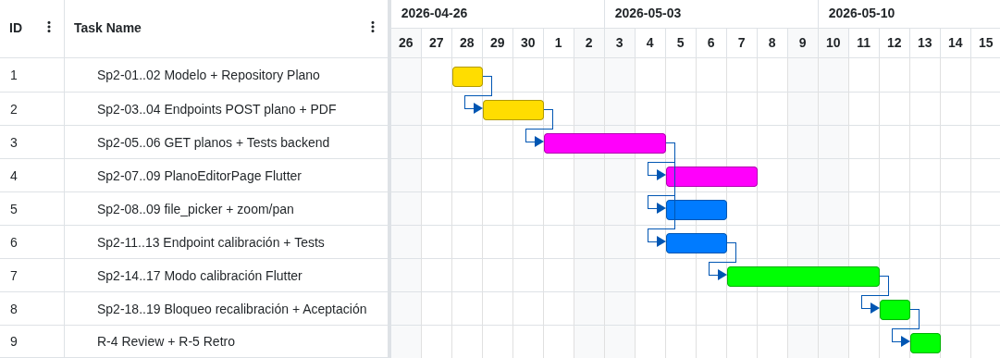

_Figura 25. Diagrama de Gantt — Planificación detallada del Sprint 2 (28 abr – 11 may 2026)._

---

### PB-01 — Gestionar Proyecto

| Campo | Detalle |
| ----- | ------- |
| **ID** | PB-01 |
| **Rol** | Como técnico de campo |
| **Funcionalidad** | quiero crear, editar, archivar y eliminar proyectos de survey |
| **Beneficio** | para organizar las mediciones por edificio, cliente o zona intervenida |
| **PHU** | 5 |

**Conversación / reglas de negocio:**
- El técnico autenticado solo gestiona proyectos asociados a su cuenta.
- Archivar conserva la información histórica y retira el proyecto del listado principal.
- Eliminar requiere confirmación explícita y se bloquea cuando existen reportes exportados.

**Criterios de aceptación:**
- El sistema crea un proyecto válido y lo refleja en el listado activo.
- La edición actualiza nombre, cliente y descripción sin perder historial.
- El archivado modifica el estado y oculta el proyecto del listado por defecto.
- El acceso a proyectos ajenos no está permitido.

---

### PB-10 — Ver Historial de Proyectos

| Campo | Detalle |
| ----- | ------- |
| **ID** | PB-10 |
| **Rol** | Como técnico de campo |
| **Funcionalidad** | quiero consultar mis proyectos con estado y actividad reciente |
| **Beneficio** | para retomar levantamientos sin perder contexto operativo |
| **PHU** | 3 |

**Conversación / reglas de negocio:**
- El listado ordena por última actividad descendente.
- La búsqueda filtra por nombre del proyecto y cliente asociado.
- El listado distingue proyectos activos y archivados.

**Criterios de aceptación:**
- El historial se muestra paginado y con orden consistente.
- El filtro de búsqueda responde sobre nombre y cliente.
- El técnico puede abrir el detalle de cualquier proyecto propio desde el historial.

---

### PB-02 — Importar Plano

| Campo | Detalle |
| ----- | ------- |
| **ID** | PB-02 |
| **Rol** | Como técnico de campo |
| **Funcionalidad** | quiero subir planos en formato PNG, JPG o PDF al proyecto seleccionado |
| **Beneficio** | para disponer de una base visual donde posicionar futuras mediciones WiFi |
| **PHU** | 8 |

**Conversación / reglas de negocio:**
- El backend acepta archivos de hasta 20 MB.
- Si el archivo es PDF y contiene varias páginas, se procesa la primera y se informa advertencia.
- El proyecto puede contener varios planos por locación, piso o zona.

**Criterios de aceptación:**
- Un plano válido retorna `201` con identificador, dimensiones y URL firmada.
- Un archivo que excede el tamaño permitido retorna `413`.
- Un formato no soportado retorna `415`.
- La app renderiza el plano con capacidades de zoom y desplazamiento.

---

### PB-11 — Calibrar Escala

| Campo | Detalle |
| ----- | ------- |
| **ID** | PB-11 |
| **Rol** | Como técnico de campo |
| **Funcionalidad** | quiero marcar dos puntos sobre el plano e ingresar la distancia real |
| **Beneficio** | para obtener una escala fiable en metros por píxel antes de capturar mediciones |
| **PHU** | 8 |

**Conversación / reglas de negocio:**
- La calibración es obligatoria antes de iniciar la captura del Sprint 3.
- La distancia real mínima permitida es 1 metro.
- Un plano con puntos de medición registrados no puede recalibrarse.

**Criterios de aceptación:**
- Dos toques sobre el plano dibujan una línea de referencia.
- Una distancia válida retorna el factor de escala calculado.
- Una distancia menor a 1 metro genera validación `422`.
- La escala persiste al reabrir el proyecto.

---

### Resumen del Sprint Backlog

| HU | Descripción | PHU | Estado |
| -- | ----------- | :-: | ------ |
| PB-01 | Gestionar Proyecto | 5 | Completada |
| PB-10 | Ver Historial de Proyectos | 3 | Completada |
| PB-02 | Importar Plano | 8 | Completada |
| PB-11 | Calibrar Escala | 8 | Completada |
| **Total comprometido** |  | **16** |  |


```{=openxml}
<w:p><w:r><w:br w:type="page"/></w:r></w:p>
```

# Sprint 2 — Modelos Generados

## S2.2 Modelos del Sprint 2

### Modelo de contexto — Planos y calibración

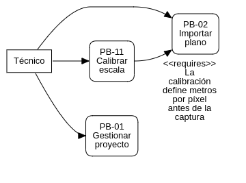

_Figura 16. Casos de uso del Sprint 2 centrados en importación y calibración de planos._

### Diagrama de clases conceptual

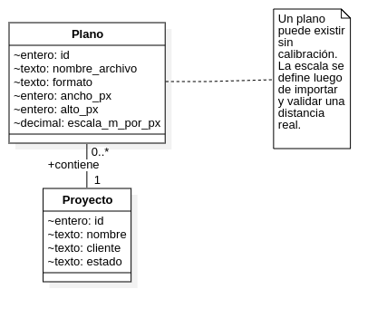

_Figura 17. Modelo conceptual del Sprint 2 con la entidad Plano asociada al proyecto._

### Diagrama de secuencia — Subida de plano

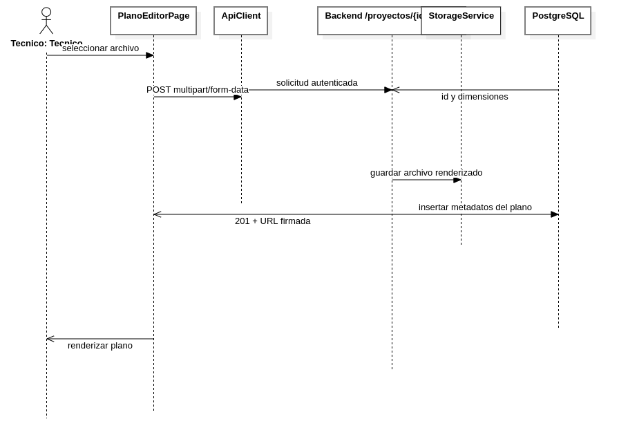

_Figura 18. Secuencia de importación de plano desde la app móvil hacia el backend._

### Diagrama de secuencia — Calibración de escala

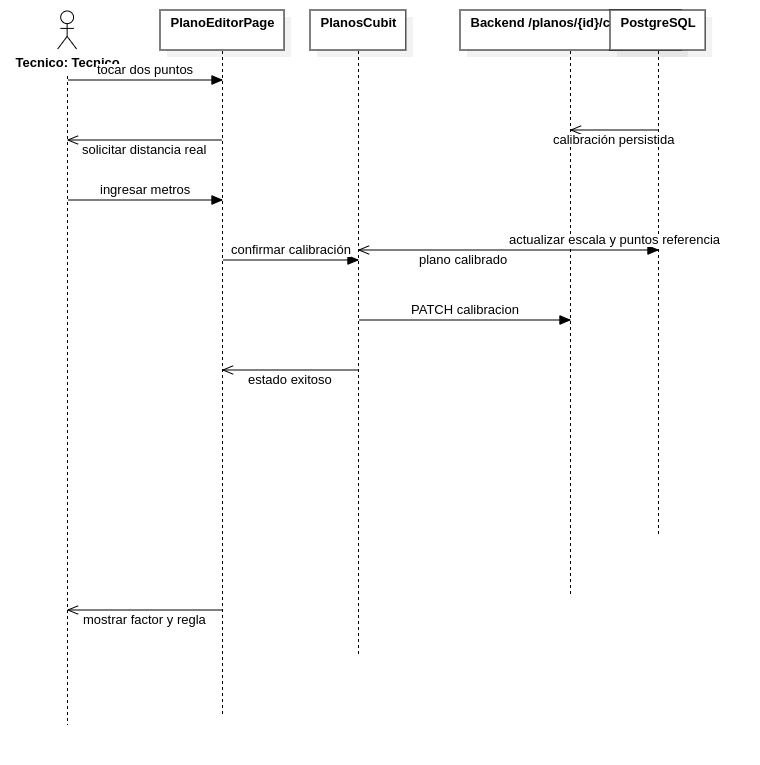

_Figura 19. Secuencia de calibración del plano a partir de una distancia conocida._

**Tabla 15.** Diseño físico de datos de la tabla `planos`

| Columna | Tipo de dato | Descripción |
| ------- | ------------ | ----------- |
| `id` | INTEGER | Identificador del plano |
| `proyecto_id` | INTEGER | Referencia al proyecto propietario |
| `nombre_archivo` | VARCHAR(255) | Nombre original del archivo importado |
| `formato` | VARCHAR(10) | Formato admitido: PNG, JPG o PDF |
| `ruta_storage` | VARCHAR(500) | Ubicación lógica del archivo en storage |
| `ancho_px` | INTEGER | Ancho del plano en píxeles |
| `alto_px` | INTEGER | Alto del plano en píxeles |
| `escala_m_por_px` | DECIMAL(10,6) | Factor de conversión de metros por píxel |
| `x1_cal` | DECIMAL(10,2) | Coordenada X del primer punto de calibración |
| `y1_cal` | DECIMAL(10,2) | Coordenada Y del primer punto de calibración |
| `x2_cal` | DECIMAL(10,2) | Coordenada X del segundo punto de calibración |
| `y2_cal` | DECIMAL(10,2) | Coordenada Y del segundo punto de calibración |
| `distancia_real_m` | DECIMAL(10,2) | Distancia física declarada por el técnico |
| `creado_en` | TIMESTAMP WITH TIME ZONE | Fecha y hora de creación del registro |


```{=openxml}
<w:p><w:r><w:br w:type="page"/></w:r></w:p>
```

# Sprint 2 — Implementación

## S2.3 Avance de Implementación

### Componentes del backend

**Tabla 16.** Componentes implementados en backend para el Sprint 2

| Componente | Descripción |
| ---------- | ----------- |
| `POST /api/proyectos/{id}/planos` | Recibe archivos `multipart/form-data`, valida formato y tamaño, y persiste el plano asociado al proyecto |
| `GET /api/proyectos/{id}/planos` | Lista los planos registrados para un proyecto |
| `GET /api/planos/{id}/url-firmada` | Renueva la URL temporal para descarga o visualización del plano |
| `PATCH /api/planos/{id}/calibracion` | Registra puntos de referencia y factor `escala_m_por_px` |
| `DELETE /api/planos/{id}` | Elimina un plano si no existen puntos de medición asociados |
| `StorageService` | Abstracción de almacenamiento sobre sistema de archivos con interfaz compatible con futura evolución hacia S3 |
| `PdfService` con PyMuPDF | Renderiza la primera página de PDF a PNG utilizable en la app y el backend |

### Componentes de la aplicación móvil

**Tabla 17.** Componentes implementados en la app móvil para el Sprint 2

| Componente | Descripción |
| ---------- | ----------- |
| `PlanoEditorPage` | Editor visual del plano con superficie interactiva basada en Flutter Canvas |
| `InteractiveViewer` | Habilita zoom y desplazamiento para navegar el plano sin perder precisión táctil |
| `file_picker` | Selecciona archivos PNG, JPG y PDF desde el dispositivo |
| `pdfx` | Previsualiza documentos PDF importados en la capa móvil |
| Modo calibración | Captura dos toques, solicita distancia real y dibuja la línea de referencia |
| Visualización de regla | Permite medir distancias una vez persistida la calibración |

### Infraestructura y persistencia

La capa de datos del backend se amplió con la migración Alembic `a1b2c3d4e5f6_sp2_planos`, que introduce la entidad de planos y sus campos de calibración. De manera complementaria, la infraestructura en contenedores incorpora un volumen persistente destinado al almacenamiento físico de archivos. Esta decisión mantiene separado el repositorio de código del contenido subido por el técnico y deja abierta la posibilidad de migrar el almacenamiento a un servicio compatible con S3 sin cambiar el contrato principal de la aplicación.

### Resultado técnico del incremento

Al cierre del Sprint 2, el sistema permite crear o localizar un proyecto, subir un plano en línea, visualizarlo desde la app móvil y establecer su escala real con persistencia centralizada. Ese incremento deja preparado el escenario para asociar puntos de medición georreferenciados en el Sprint 3.


```{=openxml}
<w:p><w:r><w:br w:type="page"/></w:r></w:p>
```

# Sprint 2 — Pruebas

## S2.4 Pruebas Realizadas

### Pruebas del backend

**Tabla 18.** Casos de prueba del backend (pytest) — Sprint 2

| ID | Caso de prueba | Resultado esperado | Estado |
| -- | -------------- | ------------------ | ------ |
| CA1 | Importación de plano válido | `201 Created` con metadatos y URL firmada | Pasada |
| CA2 | Archivo con tamaño excedido | `413 Payload Too Large` | Pasada |
| CA3 | Formato inválido | `415 Unsupported Media Type` | Pasada |
| CA4 | PDF multipágina | `201 Created` y advertencia de primera página importada | Pasada |
| CA5 | Calibración válida | `200 OK` con factor calculado | Pasada |
| CA6 | Distancia menor a 1 metro | `422 Unprocessable Entity` | Pasada |
| CA7 | Recalibración con puntos existentes | `409 Conflict` | Pasada |

### Pruebas de la app móvil

**Tabla 19.** Casos de prueba de la aplicación móvil — Sprint 2

| ID | Funcionalidad evaluada | Resultado esperado | Estado |
| -- | ---------------------- | ------------------ | ------ |
| FL1 | Importación de plano PNG/JPG/PDF | El archivo se carga y el plano queda visible en pantalla | Pasada |
| FL2 | Zoom y desplazamiento sobre el plano | La navegación mantiene estabilidad y contexto visual | Pasada |
| FL3 | Calibración con dos toques | La línea de referencia se dibuja y permite confirmar distancia | Pasada |
| FL4 | Visualización de distancia con regla | El sistema muestra metros coherentes con la escala persistida | Pasada |

### Resultado de la revisión del sprint

En la Sprint Review del 11 de mayo de 2026 se constató que todos los casos comprometidos fueron superados. El incremento fue aceptado con el criterio de que el plano queda disponible y calibrado para la captura WiFi en línea prevista en el sprint siguiente.


```{=openxml}
<w:p><w:r><w:br w:type="page"/></w:r></w:p>
```

# Sprint 3 — Historias de Usuario

## S3.1 Historias de Usuario del Sprint 3

**Objetivo del Sprint 3:** Implementar la captura WiFi en línea con asociación inmediata de mediciones a puntos georreferenciados sobre el plano calibrado.

**Duración:** 2 semanas (12 may – 25 may 2026)
**Puntos de Historia del Sprint:** 21 PHU

**Restricciones CWNA-107:** throttling Android 4 scans/2 min y clasificación de cobertura basada en umbrales de señal.

### Cronograma del Sprint 3

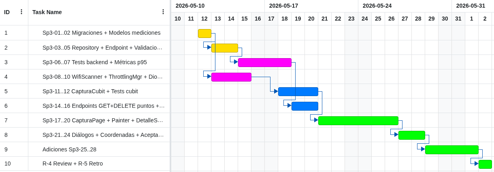

_Figura 26. Diagrama de Gantt — Planificación detallada del Sprint 3 (12–25 may 2026)._

---

### PB-03 — Capturar Señales WiFi

| Campo | Detalle |
| ----- | ------- |
| **ID** | PB-03 |
| **Rol** | Como técnico de campo |
| **Funcionalidad** | quiero escanear redes WiFi y enviar cada lote de resultados al backend en línea |
| **Beneficio** | para registrar mediciones sin persistencia local y disponer de datos inmediatos en el servidor |
| **PHU** | 13 |

**Conversación / reglas de negocio:**
- Cada lote incluye la posición del punto y una colección de mediciones con SSID, BSSID, RSSI, canal y frecuencia.
- El plano debe estar calibrado antes de permitir la captura.
- El backend clasifica la señal según rangos de dBm alineados con CWNA-107.
- Android limita el escaneo a 4 lecturas por cada 2 minutos bajo las condiciones definidas por la plataforma.

**Criterios de aceptación:**
- Un lote válido se registra en línea con respuesta `201`.
- RSSI fuera del rango operativo retorna `422`.
- Si no hay conectividad disponible, la aplicación no guarda lotes localmente y notifica la incidencia.
- La clasificación de cobertura se aplica desde el backend al persistir el lote.

---

### PB-04 — Marcar Puntos de Medición

| Campo | Detalle |
| ----- | ------- |
| **ID** | PB-04 |
| **Rol** | Como técnico de campo |
| **Funcionalidad** | quiero marcar puntos sobre el plano y consultar o eliminar sus lecturas asociadas |
| **Beneficio** | para vincular cada escaneo con una ubicación verificable del edificio |
| **PHU** | 8 |

**Conversación / reglas de negocio:**
- El modo puntual crea un punto por toque sobre el plano.
- El modo continuo agrega lecturas periódicas a un punto existente con `numero_lectura` incremental.
- Cada punto se dibuja con un color asociado al nivel agregado de señal.
- El detalle del punto agrupa mediciones por ciclo de lectura.

**Criterios de aceptación:**
- Cada toque en modo puntual genera punto, escaneo y persistencia.
- El modo continuo respeta el intervalo configurado y el límite de throttling.
- El detalle del punto se consulta desde el backend y se presenta ordenado.
- Eliminar un punto remueve también sus mediciones asociadas.

---

### Resumen del Sprint Backlog

| HU | Descripción | PHU | Estado |
| -- | ----------- | :-: | ------ |
| PB-03 | Capturar Señales WiFi | 13 | Completada |
| PB-04 | Marcar Puntos de Medición | 8 | Completada |
| **Total comprometido** |  | **21** |  |


```{=openxml}
<w:p><w:r><w:br w:type="page"/></w:r></w:p>
```

# Sprint 3 — Modelos Generados

## S3.2 Modelos del Sprint 3

### Modelo de contexto — Captura y marcado de puntos

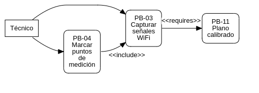

_Figura 20. Casos de uso del Sprint 3 para captura en línea y marcado de puntos._

### Diagrama de secuencia — Captura WiFi en línea

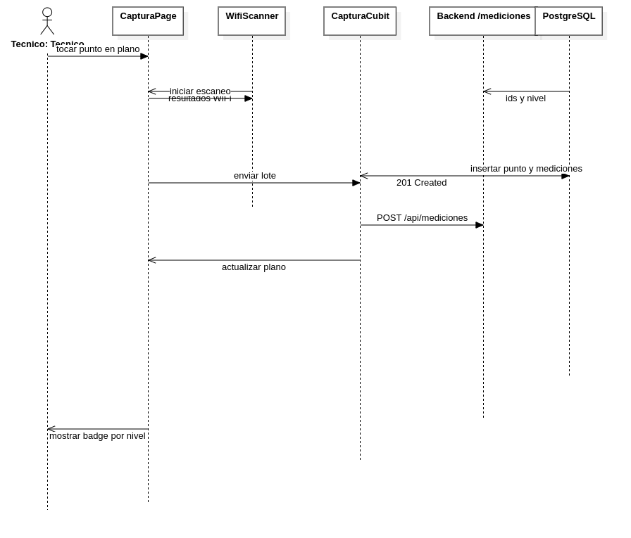

_Figura 21. Secuencia de captura y envío de mediciones WiFi hacia el backend._

### Diagrama de estados — Sesión de captura

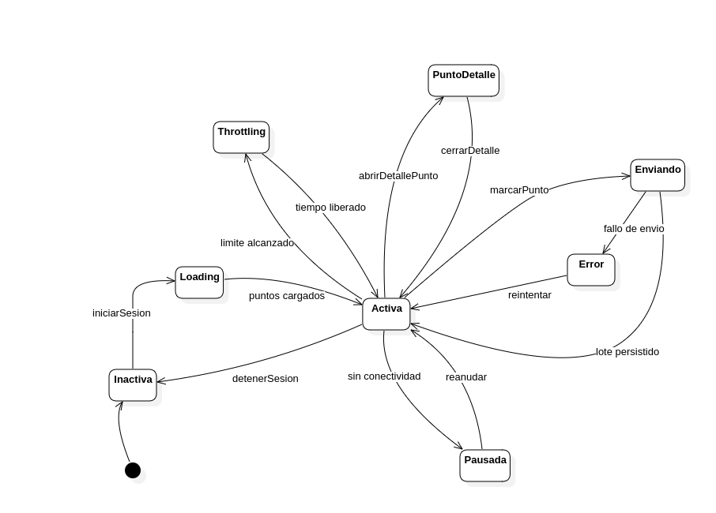

_Figura 22. Estados operativos del `CapturaCubit` durante una sesión de medición._

**Tabla 20.** Diseño físico de datos de `punto_medicion` y `medicion_wifi`

| Tabla | Columna | Tipo de dato | Descripción |
| ----- | ------- | ------------ | ----------- |
| `punto_medicion` | `id` | INTEGER | Identificador del punto |
| `punto_medicion` | `plano_id` | INTEGER | Referencia al plano calibrado |
| `punto_medicion` | `x_px` | DECIMAL(10,2) | Coordenada X del punto sobre el plano |
| `punto_medicion` | `y_px` | DECIMAL(10,2) | Coordenada Y del punto sobre el plano |
| `punto_medicion` | `nivel` | VARCHAR(20) | Nivel agregado del punto según peor RSSI |
| `punto_medicion` | `creado_en` | TIMESTAMP WITH TIME ZONE | Fecha de creación del punto |
| `medicion_wifi` | `id` | INTEGER | Identificador de la medición |
| `medicion_wifi` | `punto_id` | INTEGER | Referencia al punto de medición |
| `medicion_wifi` | `ssid` | VARCHAR(255) | Nombre de la red detectada |
| `medicion_wifi` | `bssid` | VARCHAR(17) | Dirección MAC del AP detectado |
| `medicion_wifi` | `rssi` | INTEGER | Intensidad de señal en dBm |
| `medicion_wifi` | `frecuencia` | INTEGER | Frecuencia de operación en MHz |
| `medicion_wifi` | `canal` | INTEGER | Canal observado |
| `medicion_wifi` | `numero_lectura` | INTEGER | Ciclo de escaneo dentro del mismo punto |
| `medicion_wifi` | `creado_en` | TIMESTAMP WITH TIME ZONE | Fecha de registro de la lectura |

**Tabla 21.** Clasificación CWNA-107 aplicada en backend

| Rango dBm | Nivel documentado | Uso interpretativo |
| --------- | ----------------- | ------------------ |
| `>= -70` | EXCELENTE | Cobertura objetivo |
| `-71 a -80` | BUENA | Cobertura funcional |
| `-81 a -85` | ACEPTABLE | Cobertura degradada |
| `-86 a -90` | DEBIL | Riesgo de pérdida de calidad |
| `< -90` | ZONA_MUERTA | Sin cobertura útil |


```{=openxml}
<w:p><w:r><w:br w:type="page"/></w:r></w:p>
```

# Sprint 3 — Implementación

## S3.3 Avance de Implementación

### Componentes del backend

**Tabla 22.** Componentes implementados en backend para captura WiFi

| Componente | Descripción |
| ---------- | ----------- |
| `POST /api/mediciones` | Inserta un lote completo de mediciones asociado a un nuevo punto |
| `POST /api/puntos/{id}/mediciones` | Agrega lecturas adicionales a un punto existente en modo continuo |
| `GET /api/planos/{id}/puntos` | Lista los puntos persistidos de un plano |
| `GET /api/puntos/{id}` | Devuelve el detalle del punto y sus mediciones |
| `DELETE /api/puntos/{id}` | Elimina el punto y sus mediciones en cascada |
| `MedicionRepository` | Persiste lotes y clasifica el nivel por umbrales de señal |
| Alembic `c3d4e5f6a7b8` | Crea `punto_medicion` y `medicion_wifi` |
| Alembic `d5e6f7a8b9c0` | Añade `numero_lectura` para distinguir ciclos de escaneo |

### Componentes de la aplicación móvil

**Tabla 23.** Componentes implementados en la app móvil para el Sprint 3

| Componente | Descripción |
| ---------- | ----------- |
| `WifiScanner` | Envoltura sobre `wifi_scan` con validación de permisos y normalización de resultados |
| `ThrottlingManager` | Controla el límite de 4 escaneos por 2 minutos y expone contador regresivo |
| `CapturaCubit` | Gestiona ocho estados operativos: Inactiva, Loading, Activa, Enviando, Throttling, Pausada, PuntoDetalle y Error |
| `CapturaPage` | Superficie principal de captura con `InteractiveViewer` y `TransformationController` |
| `PlanoPuntosPainter` | Dibuja puntos sobre el plano con color asociado al nivel de señal |
| `PuntoDetalleSheet` | Presenta lecturas agrupadas por `numero_lectura` mediante `DraggableScrollableSheet` |
| Modo continuo | Ejecuta capturas periódicas con `Timer` configurable en 15, 30 o 60 segundos |

### Funcionalidades añadidas sobre la planificación base

Durante la implementación se incorporaron tres ajustes funcionales que complementan el alcance inicialmente descrito. El primero es el campo `numero_lectura`, necesario para diferenciar ciclos de escaneo sobre un mismo punto en modo continuo. El segundo es el endpoint específico para agregar mediciones a un punto ya existente, lo que evita duplicar marcadores innecesarios en el plano. El tercero es el estado `CapturaPuntoDetalle`, que conserva el contexto del plano mientras se inspecciona o elimina un punto desde la interfaz móvil.

### Resultado técnico del incremento

Al finalizar el Sprint 3, el sistema registra mediciones WiFi en línea, las asocia a puntos georreferenciados sobre el plano calibrado y ofrece retroalimentación visual inmediata sobre el estado de la cobertura observada en campo.


```{=openxml}
<w:p><w:r><w:br w:type="page"/></w:r></w:p>
```

# Sprint 3 — Pruebas

## S3.4 Pruebas Realizadas

### Pruebas del backend

**Tabla 24.** Casos de prueba del backend (pytest) — Sprint 3

| Grupo | Verificación | Resultado esperado | Estado |
| ----- | ------------ | ------------------ | ------ |
| BE1 | Latencia p95 con 50 mediciones por lote | `<= 1 s` | Pasada |
| BE2 | Validación de RSSI en rango `-120 a 0` | `422` para valores inválidos | Pasada |
| BE3 | Validación de ownership | Rechazo de acceso a planos y puntos ajenos | Pasada |
| BE4 | Plano no calibrado | `422` con mensaje de calibración obligatoria | Pasada |
| BE5 | 10 pruebas parametrizadas de umbrales CWNA-107 | Clasificación correcta de nivel | Pasada |

### Pruebas unitarias del `CapturaCubit`

**Tabla 25.** Grupos de pruebas unitarias con `bloc_test` y `mocktail`

| Grupo | Alcance | Estado |
| ----- | ------- | ------ |
| CU1 | `iniciarSesion` | Pasada |
| CU2 | `marcarPunto` | Pasada |
| CU3 | `agregarMedicionesAPunto` | Pasada |
| CU4 | `abrirDetallePunto` | Pasada |
| CU5 | `eliminarPunto` | Pasada |

### Prueba de integración

**Tabla 26.** Verificación integrada de captura en campo

| Escenario | Evidencia esperada | Estado |
| --------- | ------------------ | ------ |
| Captura completa en plano calibrado | Registros visibles en `punto_medicion` y `medicion_wifi` después del envío desde la app | Pasada |

### Resultado de la revisión del sprint

La revisión confirmó que el flujo completo de captura, persistencia y consulta de puntos quedó operativo. Todos los grupos de prueba fueron aceptados y el incremento se consideró listo para servir de base al análisis de cobertura y generación del *heatmap* en las iteraciones siguientes.

