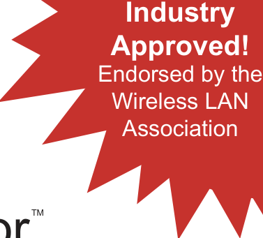
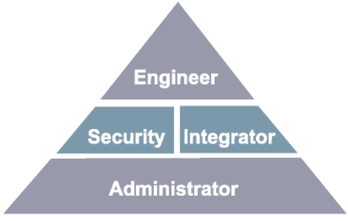

# The Official CWNA Study Guide

_PDF pages 1-29_

TM

## Certified Wireless

#### Official Study Guide

##### Exam PW0-100

Objective-by-Objective coverage
of the CWNA certification exam

##### Vendor-neutral wireless network training and certification

Planet3 Wireless

--- end of page=0 ---

##### CWNP™ Certification Program

The Certified Wireless Network Professional Training & Certification Program is
intended for individuals who administer, install, design, and support IEEE 802.11
compliant wireless networks. Because the CWNP program is vendor neutral, candidates
who achieve the different levels of CWNP Certification will be trained and qualified to
administer and support many different brands of wireless LAN hardware. Although there
are many manufacturers of wireless LAN hardware, the technologies behind the hardware

        - Radio Frequency and Local Area Networking – are the same for each piece of gear.
Each manufacturer approaches these technologies in different ways.

The CWNP program consists of 4 levels of certification:

**Administrator**        - Site survey, installation and management of 802.11 compliant wireless
LANs

**Security Expert**        - Design and implementation of 802.11 security techniques, processes,
hardware, and software

**Integrator**        - Advanced site survey, design, bridging and integration of 802.11 compliant
wireless LANs

**Engineer**       - Lab intensive approach to design, implementation, troubleshooting & repair,
security and integration of 802.11 compliant wireless LANs

CWNA Study Guide © Copyright 2002 Planet3 Wireless, Inc.

--- end of page=1 ---

Copyright © 2002 Planet3 Wireless, Inc., P.O. Box 412, Bremen Georgia 30110. World rights reserved. No part of
this publication may be stored in any retrieval system, transmitted, or reproduced in any way, including but not
limited to photocopying, photographing, magnetic, electronic, or other record, without the prior written agreement
and written permission of Planet3 Wireless, Inc.

ISBN: 0-9716057-2-6
Version: FAY534IR8E1

CNWP, CWNA, CWNI, CWSE, CWNE, CWAP, CWEC and their respective logos are registered marks of Planet3
Wireless, Inc. in the United States and/or other countries.

This study guide and reference manual are not sponsored by or affiliated with any wireless LAN manufacturer,
including those mentioned in the text and in the lab exercise notes.

TRADEMARKS: Planet3 Wireless, Inc. has attempted throughout this book to distinguish proprietary trademarks
from descriptive terms by following the capitalization style used by the manufacturers. The author and publisher
have made their best efforts to prepare this book, and the content is based upon final release software whenever
possible. Portions of the manuscript may be based on pre-release versions supplied by software manufactures. The
author and publisher make no representation or warranties of any kind with regard to the completeness or accuracy
of the contents herein and accept no liability of any kind including but not limited to performance, merchantability,
fitness for any particular purpose, or any losses or damages of any kind caused or alleged to be caused directly or
indirectly from this book.

Manufactured in the United States of America

CWNA Study Guide © Copyright 2002 Planet3 Wireless, Inc.

--- end of page=2 ---

LICENSE AGREEMENT
PLEASE READ THESE TERMS AND CONDITIONS CAREFULLY BEFORE USING THIS MANUAL
(“MATERIALS”). BY USING THE MATERIALS YOU AGREE TO BE BOUND BY THE TERMS AND
CONDITIONS OF THIS LICENSE.

OWNERSHIP
The Study Guide is proprietary to PLANET3 WIRELESS, INC., who retains exclusive title to and ownership of the
copyrights and other intellectual property rights in the Study Guide. These rights are protected by the national and
state copyright, trademark, trade secret, and other intellectual property laws of the United States and international
treaty provisions, including without limitation the Universal Copyright Convention and the Berne Copyright
Convention. You have no ownership rights in the Study Guide. Except as expressly set forth herein, no part of the
Study Guide may be modified, copied, or distributed in hardcopy or machine-readable form without prior written
consent from PLANET3 WIRELESS, INC. All rights not expressly granted to you herein are expressly reserved by
PLANET3 WIRELESS, INC. Any other use of the Study Guide by any person or entity is strictly prohibited and a
violation of this Agreement.

SCOPE OF RIGHTS LICENSED (PERMITTED USES)
PLANET3 WIRELESS, INC. is granting you a limited, non-exclusive, non-transferable license to use the Study
Guide, in part or in whole, for your internal business or personal use. Any internal or personal use of the Study
Guide content must be accompanied by the phrase "Used with permission from PLANET3 WIRELESS, INC." or
other phrasing agreed upon in writing by PLANET3 WIRELESS, INC.

RESTRICTIONS ON TRANSFER
Reproduction or disclosure in whole or in part to parties other than the PLANET3 WIRELESS, INC. client that is
the original subscriber to this Study Guide is permitted only with the written and express consent of PLANET3
WIRELESS, INC. This Study Guide shall be treated at all times as a confidential and proprietary document for
internal use only.

Any purported sale, assignment, transfer or sublicense without the prior written consent of PLANET3 WIRELESS,
INC. will be void and will automatically terminate the License granted hereunder.

LIMITED WARRANTY
THE INFORMATION CONTAINED IN THIS STUDY GUIDE IS BELIEVED TO BE RELIABLE BUT
CANNOT BE GUARANTEED TO BE CORRECT OR COMPLETE. If the Study Guide's electronic delivery
format is defective, PLANET3 WIRELESS, INC. will replace it at no charge if PLANET3 WIRELESS, INC. is
notified of the defective formatting within THIRTY days from the date of the original download or receipt of Study
Guide. PLANET3 WIRELESS, INC., MAKES NO WARRANTY, EXPRESS OR IMPLIED, OF
MERCHANTABILITY OR FITNESS FOR A PARTICULAR PURPOSE

LIMITATION OF LIABILITY
IN NO EVENT WILL PLANET3 WIRELESS, INC. BE LIABLE TO YOU FOR ANY DAMAGES, INCLUDING,
WITHOUT LIMITATION, ANY LOST PROFITS, LOST SAVINGS, OR OTHER INCIDENTAL OR
CONSEQUENTIAL DAMAGES ARISING OUT OF YOUR USE OR INABILITY TO USE THE STUDY GUIDE
REGARDLESS OF WHETHER SUCH DAMAGES ARE FORESEEABLE OR WHETHER SUCH DAMAGES
ARE DEEMED TO RESULT FROM THE FAILURE OR INADEQUACY OF ANY EXCLUSIVE OR OTHER
REMEDY. IN ANY EVENT, THE LIABILITY OF PLANET3 WIRELESS, INC. SHALL NOT EXCEED THE
LICENSE FEE PAID BY YOU TO PLANET3 WIRELESS, INC.

CWNA Study Guide © Copyright 2002 Planet3 Wireless, Inc.

--- end of page=3 ---

_We at Planet3 Wireless would like to dedicate this book to our Lord Jesus Christ. It is through Him that_
_we have had the talent, time, encouragement, and strength to work many long months in preparing this_
_text. Our goal through the creation of this book and through all things that He allows us to do going_
_forward is to glorify Him. We acknowledge His hand in every part of our company, our work, and our_
_friendships. We would also like to thank our families who have been amazingly supportive, our friends_
_who have encouraged us and everyone that contributed to this book in any way._

_“I can do all things through Christ, who strengthens me.” – Philippians 4:13_

CWNA Study Guide © Copyright 2002 Planet3 Wireless, Inc.

--- end of page=4 ---

##### Acknowledgements

     - Devin Akin

     - Kevin Sandlin

     - Scott Turner

     - Robert Nicholas

     - Josh McCord

     - Jeff Jones

     - Stan Brooks

     - Bill Waldo

     - Barry Oxford

Planet3 Wireless, Inc. would like to acknowledge and thank the following people for
their tireless contributions to this work:

**Devin Akin**, whose knowledge of wireless LANs, networking, and radio frequency
surprised even us. His talents to convey, teach, write, and edit were essential in making
this the most accurate and comprehensive writing on wireless LANs in today's market.

**Scott Turner**, who constantly keeps us in line and focused on what is important. Scott's
work in formatting, framing, content organization, and graphics creation was
indispensable. Scott's eye for detail and his motivation for perfection in everything he
does keep us in awe.

**Kevin Sandlin,** for his intellect to make difficult concepts sound simple, his skill to write
and edit the most difficult material, and his ability to motivate every member of the team
to do their best and to keep their eyes on the sometimes moving target. His leadership
skills are second to none.

**Robert Nicholas**, for his ability to conceptualize and create difficult graphics and radio
frequency concepts, his savvy in presentation of difficult material, and his ability to find
the answer to even the most vague concepts through diligent research and study. His
effort in support of this book is greatly appreciated.

**Jeff Jones** and **Josh McCord,** who have been with Planet3 since the beginning of this
project. Their willingness to volunteer as much time and effort as was needed to make all
of it possible has been amazing. They have been an inspiration to the entire team. Their
relentless pursuit of perfection in support of Planet3's mission is recognized and greatly
appreciated.

**Stan Brooks**, **Bill Waldo**, and **Barry Oxford**, each of whom brought a unique set of
skills to the review and quality assurance process for this publication. Their time, effort
and eye for necessary changes were immeasurable, and helped to publish this book in a
timely manner.

CWNA Study Guide © Copyright 2002 Planet3 Wireless, Inc.

--- end of page=5 ---

**vi** Contents

##### Contents at a Glance

_Introduction_ _xvi_

**Chapter 1** Introduction to Wireless LANs 1

**Chapter 2** Radio Frequency (RF) Fundamentals 17

**Chapter 3** Spread Spectrum Technology 45

**Chapter 4** Wireless LAN Infrastructure Devices 71

**Chapter 5** Antennas and Accessories 103

**Chapter 6** Wireless LAN Organizations and Standards 145

**Chapter 7** 802.11 Network Architecture 167

**Chapter 8** MAC and Physical Layers 201

**Chapter 9** Troubleshooting Wireless LAN Installations 223

**Chapter 10** Wireless LAN Security 259

**Chapter 11** Site Survey Fundamentals 295

**Appendix A** RF in Perspective 341

**Glossary** 347

CWNA Study Guide © Copyright 2002 Planet3 Wireless, Inc.

--- end of page=6 ---

Contents **vii**

##### Contents

_Introduction_ xxiv
**Chapter  1** **Introduction to Wireless LANs** **1**

The Wireless LAN Market 2
Today’s Wireless LAN Standards 3
Applications of Wireless LANs 3
Access Role 4
Network Extension 5
Building-to-Building Connectivity 5
Last Mile Data Delivery 6
Mobility 7
Small Office-Home Office 8
Summary 10
Key Terms 11
Review Questions 12
Answers to Review Questions 15

**Chapter  2** **Radio Frequency (RF) Fundamentals** **17**

Radio Frequency 18
RF Behaviors 19
Gain 19
Loss 19
Reflection 20
Refraction 21
Diffraction 22
Scattering 23
Voltage Standing Wave Ratio (VSWR) 23
VSWR Measurements 24
Effects of VSWR 24
Solutions to VSWR 25
Principles of Antennas 25
Line of Sight (LOS) 25
Fresnel Zone 26
Obstructions 27
Antenna Gain 27
Intentional Radiator 27
Equivalent Isotropically Radiated Power (EIRP) 28
Radio Frequency Mathematics 29
Units of Measure 30
Watts (W) 30
Milliwatt 30
Decibels 30
dBm 32
dBi 34
Accurate Measurements 35
Key Terms 37
Review Questions 38
Answers to Review Questions 43

**Chapter  3** **Spread Spectrum Technology** **45**

CWNA Study Guide © Copyright 2002 Planet3 Wireless, Inc.

--- end of page=7 ---

**viii** Contents

Introducing Spread Spectrum 46

Narrow Band Transmission 46
Spread Spectrum Technology 47
Uses of Spread Spectrum 48
Wireless Local Area Networks 48
Wireless Personal Area Networks 49
Wireless Metropolitan Area Networks 49
FCC Specifications 49
Frequency Hopping Spread Spectrum (FHSS) 50
How FHSS Works 50
Effects of Narrow Band Interference 51
Frequency Hopping Systems 51
Channels 51
Dwell Time 52
Hop Time 53
Dwell Time Limits 53
FCC Rules affecting FHSS 54
Direct Sequence Spread Spectrum (DSSS) 55
How DSSS Works 55
Direct Sequence Systems 55
Channels 56
Effects of Narrow Band Interference 58
FCC Rules affecting DSSS 58
Comparing FHSS and DSSS 58
Narrowband Interference 58
Cost 59
Co-location 59
Equipment compatibility and availability 60
Data rate & throughput 60
Security 61
Standards Support 61
Key Terms 62
Review Questions 63
Answers to Review Questions 68

**Chapter  4** **Wireless LAN Infrastructure Devices** **71**

Access Points 72
Access Point Modes 73
Root Mode 74
Bridge Mode 74
Repeater Mode 75
Common Options 76
Fixed or Detachable Antennas 76
Advanced Filtering Capabilities 76
Removable (Modular) Radio Cards 77
Variable Output Power 77
Varied Types of Wired Connectivity 77
Configuration and Management 78
Wireless Bridges 79
Wireless Bridge Modes 80
Root Mode 80
Non-root Mode 81

CWNA Study Guide © Copyright 2002 Planet3 Wireless, Inc.

--- end of page=8 ---

Contents **ix**

Access Point Mode 81

Repeater Mode 81
Common Options 82
Fixed or Detachable Antennas 82
Advanced Filtering Capabilities 83
Removable (Modular) Radio Cards 83
Variable Output Power 83
Varied Types of Wired Connectivity 83
Configuration and Management 84
Wireless Workgroup Bridges 84
Common Options 85
Configuration and Management 85
Wireless LAN Client Devices 86
PCMCIA & Compact Flash Cards 86
Wireless Ethernet & Serial Converters 87
USB Adapters 88
PCI & ISA Adapters 88
Configuration and Management 89
Driver Installation 89
Manufacturer Utilities 89
Wireless Residential Gateways 90
Common Options 91
Configuration and Management 92
Enterprise Wireless Gateways 92
Configuration and Management 94
Key Terms 95
Review Questions 96
Answers to Review Questions 100

**Chapter  5** **Antennas and Accessories** **103**

RF Antennas 105
Omni-directional (Dipole) Antennas 105
Usage 107
Semi-directional Antennas 108
Usage 109
Highly-directional Antennas 110
Usage 110
RF Antenna Concepts 111
Polarization 111
Gain 113
Beamwidth 113
Free Space Path Loss 114
The 6dB Rule 115
Antenna Installation 115
Placement 115
Mounting 116
Appropriate Use 116
Orientation 116
Alignment 117
Safety 117
Maintenance 118
Power over Ethernet (PoE) Devices 118

CWNA Study Guide © Copyright 2002 Planet3 Wireless, Inc.

--- end of page=9 ---

**x** Contents

Common PoE Options 119

Single-port DC Voltage Injectors 120
Multi-port DC Voltage Injectors 120
Active Ethernet Switches 121
PoE Compatibility 121
Types of Injectors 121
Types of Picker / Taps 122
Voltage and Pinout Standards 122
Fault Protection 122
Wireless LAN Accessories 123
RF Amplifiers 123
Common Options 124
Configuration & Management 125
RF Attenuators 125
Common Options 126
Configuration and Management 127
Lightning Arrestors 127
Common Options 128
Configuration & Maintenance 130
RF Splitters 130
Choosing an RF Splitter 131
RF Connectors 133
Choosing an RF Connector 134
RF Cables 134
RF “Pigtail” Adapter Cable 136
Key Terms 137
Review Questions 138
Answers to Review Questions 142

**Chapter  6** **Wireless LAN Organizations and** **145**

**Standards** **145**
Federal Communications Commission 146
ISM and UNII Bands 146
Advantages and Disadvantages of License-Free Bands 147
Industrial Scientific Medical (ISM) Bands 147
900 MHz ISM Band 148
2.4 GHz ISM Band 148
5.8 GHz ISM Band 148
Unlicensed National Information Infrastructure (UNII) Bands 148
Lower Band 149
Middle Band 149
Upper Band 149
Power Output Rules 149
Point-to-Multipoint (PtMP) 149
Point-to-Point (PtP) 150
Institute of Electrical and Electronics Engineers 151
IEEE 802.11 152
IEEE 802.11b 152
IEEE 802.11a 153
IEEE 802.11g 153
Major Organizations 154
Wireless Ethernet Compatibility Alliance 154

CWNA Study Guide © Copyright 2002 Planet3 Wireless, Inc.

--- end of page=10 ---

Contents **xi**

European Telecommunications Standards Institute 154

Wireless LAN Association 155
Competing Technologies 155
HomeRF 156
Bluetooth 156
Infrared Data Association (IrDA) 157
Infrared 157
Wireless LAN Interoperability Forum (WLIF) 158
Key Terms 159
Review Questions 160
Answers to Review Questions 164

**Chapter  7** **802.11 Network Architecture** **167**

Locating a Wireless LAN 168
Service Set Identifier 168
Beacons 168
Time Synchronization 169
FH or DS Parameter Sets 169
SSID Information 169
Traffic Indication Map (TIM) 169
Supported Rates 169
Passive Scanning 169
Active Scanning 171
Authentication & Association 171
Authentication 172
Association 172
States of Authentication & Association 172
Unauthenticated and Unassociated 173
Authenticated and Unassociated 173
Authenticated and Associated 173
Authentication Methods 174
Open System Authentication 174
Shared Key Authentication 175
Authentication Security 176
Shared Secrets & Certificates 176
Emerging Authentication Protocols 177
Service Sets 181
Basic Service Set (BSS) 181
Extended Service Set (ESS) 182
Independent Basic Service Set (IBSS) 182
Roaming 183
Standards 184
Connectivity 185
Reassociation 185
VPN Use 186
Layer 2 & 3 Boundaries 187
Load Balancing 189
Power Management Features 190
Continuous Aware Mode 190
Power Save Polling 191
PSP Mode in a Basic Service Set 191
PSP in an Independent Basic Service Set 192

CWNA Study Guide © Copyright 2002 Planet3 Wireless, Inc.

--- end of page=11 ---

**xii** Contents

Key Terms 194

Review Questions 195
Answers to Review Questions 199

**Chapter  8** **MAC and Physical Layers** **201**

How Wireless LANs Communicate 202
Wireless LAN Frames vs. Ethernet Frames 202
Collision Handling 203
Fragmentation 204
Dynamic Rate Shifting (DRS) 205
Distributed Coordination Function 206
Point Coordination Function 206
The PCF Process 206
Interframe Spacing 207
Three Types of Spacing 207
Short Interframe Space (SIFS) 208
Point Coordination Function Interframe Space (PIFS) 208
Distributed Coordination Function Interframe Space (DIFS) 208
Slot Times 209
The Communications Process 209
Request to Send/Clear to Send (RTS/CTS) 212
Configuring RTS/CTS 213
Modulation 214
Key Terms 216
Review Questions 217
Answers to Review Questions 221

**Chapter  9** **Troubleshooting Wireless LAN** **223**

**Installations** **223**
Multipath 224
Effects of Multipath 225
Decreased Signal Amplitude 225
Corruption 225
Nulling 226
Increased Signal Amplitude 227
Troubleshooting Multipath 228
Solutions for Multipath 229
Hidden Node 230
Troubleshooting Hidden Node 231
Solutions for Hidden Node 232
Use RTS/CTS 232
Increase Power to the Nodes 233
Remove Obstacles 233
Move the Node 233
Near/Far 233
Troubleshooting Near/Far 234
Solutions for Near/Far 235
System Throughput 235
Co-location Throughput (Theory vs. Reality) 236
Theory: What Should Happen 237
Reality: What Does Happen 238
Solutions for Co-location Throughput Problems 239
Use Two Access Points 239

CWNA Study Guide © Copyright 2002 Planet3 Wireless, Inc.

--- end of page=12 ---

Contents **xiii**

Use 802.11a Equipment 240

Summary 240
Types of Interference 241
Narrowband 241
All-band Interference 243
Weather 244
Wind 244
Stratification 245
Lightning 245
Adjacent Channel and Co-Channel Interference 245
Adjacent Channel Interference 246
Co-channel Interference 247
Range Considerations 248
Transmission Power 249
Antenna Type 249
Environment 249
Key Terms 250
Review Questions 251
Answers to Review Questions 255

**Chapter   10** **Wireless LAN Security** **259**

Wired Equivalent Privacy 260
Why WEP Was Chosen 261
WEP Keys 262
Static WEP Keys 263
Centralized Encryption Key Servers 264
WEP Usage 265
Advanced Encryption Standard 266
Filtering 266
SSID Filtering 266
MAC Address Filtering 268
Protocol Filtering 269
Attacks on Wireless LANs 270
Passive Attacks 270
Active Attacks 271
Jamming 272
Man-in-the-middle Attacks 274
Emerging Security Solutions 275
WEP Key Management 275
Wireless VPNs 275
Key Hopping Technologies 276
Temporal Key Integrity Protocol (TKIP) 277
AES Based Solutions 277
Wireless Gateways 277
802.1x and Extensible Authentication Protocol 278
Corporate Security Policy 280
Keep Sensitive Information Private 280
Physical Security 281
Wireless LAN Equipment Inventory & Security Audits 281
Using Advanced Security Solutions 282
Public Wireless Networks 282
Limited and Tracked Access 282

CWNA Study Guide © Copyright 2002 Planet3 Wireless, Inc.

--- end of page=13 ---

**xiv** Contents

Security Recommendations 283

WEP 283
Cell Sizing 283
User Authentication 284
Security Needs 284
Use Additional Security Tools 285
Monitoring for Rogue Hardware 285
Switches, not hubs 285
Wireless DMZ 285
Firmware & Software Updates 286
Key Terms 287
Review Questions 288
Answers to Review Questions 293

**Chapter  11** **Site Survey Fundamentals** **295**

What is a Site Survey? 296
Preparing for a Site Survey 297
Facility Analysis 298
Existing Networks 299
Area Usage & Towers 301
Purpose & Business Requirements 302
Bandwidth & Roaming Requirements 303
Available Resources 305
Security Requirements 306
Preparation Exercises 307
Preparation Checklist 307
Site Survey Equipment 308
Access Point 308
PC Card and Utilities 309
Laptops & PDAs 311
Paper 311
Outdoor Surveys 312
Spectrum Analyzer 312
Network Analyzer (a.k.a. "Sniffer") 313
Site Survey Kit Checklist 314
Conducting a Site Survey 316
Indoor Surveys 316
Outdoor Surveys 317
Before You Begin 317
RF Information Gathering 318
Range and Coverage Patterns 319
Data Rate Boundaries 321
Documentation 321
Throughput Tests & Capacity Planning 322
Interference Sources 322
Wired Data Connectivity & AC Power Requirements 325
Outdoor Antenna Placement 326
Spot Checks 327
Site Survey Reporting 327
Report Format 327
Purpose and Business Requirements 328
Methodology 328

CWNA Study Guide © Copyright 2002 Planet3 Wireless, Inc.

--- end of page=14 ---

Contents **xv**

RF Coverage Areas 328

Throughput 328
Interference 328
Problem Areas 328
Drawings 329
Hardware placement & configuration information 329
Additional Reporting 330
Key Terms 332
Review Questions 333
Answers to Review Questions 338

**Appendix  A** **RF in Perspective** **341**

RF in Perspective 342
Radio acts like light 342
Light bulb analogy 342
Transmit Range Tests 342
Receive range tests 343
Obstacles 344
Fresnel Zone 344
Increasing power at the tower 345
Reflection 345
RF Summary 345
**Glossary** **347**

CWNA Study Guide © Copyright 2002 Planet3 Wireless, Inc.

--- end of page=15 ---

**xvi** Introduction

##### Introduction

This Official CWNA Study Guide is intended first to help prepare you to install, manage,
and support wireless networks, and second to prepare you to take and pass the CWNA
certification exam. As part of the CWNP Training and Certification program, the CWNA
certification picks up where other popular networking certification programs leave off:
_**wireless LANs**_ **.**

Your study of wireless networking will help you bring together two fascinating worlds of
technology, because wireless networks are the culmination of Radio Frequency (RF) and
networking technologies. No study of wireless LANs would be complete without first
making sure the student understands the foundations of both RF and local area
networking fundamentals.

For that reason, we recommend that you obtain a basic level of networking knowledge, as
exhibited in the CompTIA Network+ [™] certification. If you have achieved other
certifications such as CCNA, MCSE, or CNE, then you most likely already have the
understanding of networking technologies necessary to move into wireless.

By purchasing this book, you are taking the first step towards a bright future in the
networking world. Why? Because you have just jumped ahead and apart from the rest of
the pack by learning wireless networking to complement your existing networking
knowledge.

The wireless LAN industry is growing faster than any other market segment in
networking. Many new careers will be presenting themselves in support of the added
responsibilities network administrators must deal with when they add wireless LANs to
their networks. Getting a head start on wireless technology now will enable you to
compete effectively in tomorrow's marketplace.

**Who This Book Is For**

This book focuses on the technologies and tasks vital to installing, managing, and
supporting wireless networks, based on the exam objectives of the CWNA certification
exam. You will learn the wireless technology standards, governing bodies, hardware, RF
math, RF behavior, security, troubleshooting, and site survey methodology. After you
achieve your CWNA certification, you will find this book to be a concise compilation of
the basic knowledge necessary to work on wireless LANs.

The best method of preparation for the CWNA certification exam is attending an official
CWNA training course. If you prefer to study and prepare at your own pace, then this
book and a practice exam should adequately prepare you to pass the exam.

**New To Wireless**

If you’ve been working on networks – LANs, MANs, WANs, etc. – but not yet taken on
wireless, then this book and the subsequent certification exam are great introductions into
wireless LAN technology. Be careful not to assume that wireless is just like any other
form of networking. While they certainly serve as an extension to wired LANs, wireless

CWNA Study Guide © Copyright 2002 Planet3 Wireless, Inc.

--- end of page=16 ---

Introduction **xvii**

LANs are a field of study all their own. An individual can spend many more than the
standard 40 hours in a week learning and using wireless LAN technology. With wireless
LAN security now clearly in focus, the industry is piling on knowledge requirements that
wireless LAN administrators must master quickly in order to keep pace. Wireless LANs
are reaching into new areas with each passing month that nobody thought they would
ever reach. If you administer LANs, there's simply no avoiding wireless. Wireless is
here to stay.

**Wireless Experts**

If you are experienced in wireless networking already, there is substantial material
covered in this book that will benefit you. Most people who attend a CWNA class
marvel from the first day about how much they _don’t_ know. If you have been working
with wireless LANs for years, be careful you don’t assume that you know all there is to
know about them. Even experts who spent 12 hours each day studying wireless material
in order to stay up-to-date cannot keep up with the technology. Many new solutions,
both for seamless connectivity and for security, are released each week. There are new
solutions that are designed each month and before you can blink, there are 3 or 4
companies producing products supporting these new technologies. This book will be
kept up-to-date as the wireless industry progresses so that the reader always knows that
they are receiving the latest information.

While our program was still in its infancy, we were privileged to have some industry
experts take part in our testing. We found out very quickly that their status of "expert"
was in question. There is such a broad base of knowledge required to be a wireless
expert that it will likely feel overwhelming at times. As you will soon see, this book is
geared toward the beginner and intermediate reader alike. We hope that it will take you
further than you had expected to go when you first picked it up, and we hope that it will
open your eyes to a wonderful new field of study.

**RF Experienced**

Some of you may have worked with RF for years, perhaps in the military, and have
moved into the networking industry. Your knowledge and experience is right on track
with the evolution of wireless LAN technology, but you have probably never measured
your knowledge of these two technologies by taking a certification exam. This
measurement is the purpose of the CWNA certification exam. Fields of study like
Electrical Engineering, RF Metrology, Satellite Communications, and others typically
provide a solid background in radio frequency fundamentals. In this book, we will
address specific topics that you may or may not be familiar with, or you may just have to
dust off that portion of your memory. Many people have crossed over from careers in
radio frequency to careers in Information Technology (IT), but never dreamed where the
two fields of study might meet. Wireless LAN technology is the meeting place.

**New to Networking**

Finally, if you are stepping into the networking world for the very first time, please make
sure you have a basic understanding of networking concepts, and then jump right in! The
wireless LAN industry is growing at a phenomenal rate. Wireless networking is
replacing and adding to the mobility of conventional network access methods very

CWNA Study Guide © Copyright 2002 Planet3 Wireless, Inc.

--- end of page=17 ---

**xviii** Introduction

quickly. We won’t pretend to know which technology will ultimately hold the greatest
market share. Instead, we cover all currently available wireless LAN technologies.
Some technologies, like 802.11b, hold a tremendous market share presently, and those
will be covered at length in this book. Again, as the industry and market place change, so
will this book in order to stay current.

**How Is This Book Organized?**

This Official CWNA Study Guide is organized in the same manner as the official CWNA
course is taught, starting with the basic concepts or building blocks and developing your
knowledge of the convergence of RF and networking technologies.

Each chapter contains subsections that correspond to the different topics covered on the
CWNA exam. Each topic is explained in detail, followed by a list of key terms that you
should know after comprehending each chapter. Then, we close each chapter with
comprehensive review questions that cause you to apply the knowledge you’ve just
gained to real world scenarios.

Finally, we have a complete glossary of wireless LAN terms for continual reference to
you as you use your new wireless LAN knowledge on the job.

**Why Become CWNA Certified?**

Planet3 Wireless, Inc. has created a certification program, not unlike those of Cisco,
Novell, and Microsoft, that gives networking professionals a standardized set of
measurable wireless LAN skills and employers a standard level of wireless LAN
expertise to require of their employees.

Passing the CWNA exam proves you have achieved a certain level of knowledge about
wireless networking. Where Cisco and Microsoft certifications will prove a given level
of knowledge about their products, the CWNA exam is proof of achievement about
wireless technology that can be applied to any vendor’s products. The wireless LAN
industry is still in its infancy, much like the world of networking LANs and WANs was
in the early 1990s.  Learning wireless networking sets you apart from your peers and
your competition.

For some positions, certification is a requirement for employment, advancement, or
increases in salary. The CWNP program is positioned to be that certification for wireless
networking. Imagine if you had CCIE, MCSE, or CNE in 1993! Advancement in
wireless technologies will follow the same steps as other certifications – an increase in
responsibilities within your organization, perhaps followed by increases in salary.

CWNA Study Guide © Copyright 2002 Planet3 Wireless, Inc.

--- end of page=18 ---

Introduction **xix**

**How Do You Get CWNA Certified?**

The CWNP program consists of multiple levels of certification, beginning with CWNA.
You can become CWNA certified by passing one written exam. The CWNA exam is
currently available at all Prometric testing centers worldwide.

The best way to prepare for the CWNA exam is to attend a CWNA training course or to
study at your own pace with this book. The CWNA practice exam will provide you with
a good idea of the types of questions that can be found on the real exam. The CWNA
[practice exam is available at http://www.quizware.com. Complete information on](http://www.quizware.com)
[available training for the CWNA certification is available at http://www.cwne.com.](http://www.cwne.com)

As you prepare for the CWNA exam, and the other, more advanced CWNP certifications,
we highly recommend that you practice with wireless LAN gear. The best part of that
recommendation is that wireless LAN gear is plummeting in price. As of the writing of
this book, you can get a basic wireless LAN (Access Point, USB Client, PC Card, PCI
Card) for less than $500 retail.

CWNA Study Guide © Copyright 2002 Planet3 Wireless, Inc.

--- end of page=19 ---

**xx** Introduction

**Exam Objectives**

The CWNA certification covering the 2002 objectives will certify that successful
candidates know the fundamentals of RF behavior, can describe the features and
functions of wireless LAN components, and have the skills needed to install, configure,
and troubleshoot wireless LAN hardware peripherals and protocols. A typical candidate
should have the CompTIA Network+ certification or equivalent knowledge, although
Network+ certification is not required.

The skills and knowledge measured by this examination are derived from a survey of
wireless networking experts and professionals. The results of this survey were used in
weighing the subject areas and ensuring that the weighting is representative of the
relative importance of the content.

This section outlines the exam objectives for the CWNA exam.

**Radio Frequency (RF) Technologies – 24%**

**1.1. RF Fundamentals**

1.1.1. Define and apply the basic concepts of RF behavior

    - Gain

    - Loss

    - Reflection

    - Refraction

    - Diffraction

    - Scattering

    - VSWR

    - Amplification & attenuation

1.1.2. Understand the applications of basic RF antenna concepts

    - Visual LOS

    - RF LOS

    - The Fresnel Zone

    - Intentional Radiator

    - EIRP

    - Wave propagation

**1.2. RF Math**

1.2.1. Understand and apply the basic components of RF mathematics

    - Watt

    - Milliwatt

CWNA Study Guide © Copyright 2002 Planet3 Wireless, Inc.

--- end of page=20 ---

Introduction **xxi**

    - Decibel (dB)

    - dBm

    - dBi

**1.3. Spread Spectrum Technologies**

1.3.1. Identify some of the different uses for spread spectrum technologies

    - Wireless LANs

    - Wireless PANs

    - Wireless WANs

1.3.2. Comprehend the differences between, and apply the different types of spread
spectrum technologies

    - FHSS

    - DSSS

1.3.3. Identify and apply the concepts which make up the functionality of spread
spectrum technology

    - Co-location

    - Channels

    - Dwell time

    - Throughput

    - Hop time

1.3.4. Identify the laws set forth by the FCC that govern spread spectrum
technology, including power outputs, frequencies, bandwidths, hop times, and
dwell times.

**Wireless LAN Technologies – 17%**

**2.1. 802.11 Network Architecture**

2.1.1. Identify and apply the processes involved in authentication and association

    - Passive scanning

    - Active scanning

    - Authentication

    - Association

    - Open system authentication

    - Shared key authentication

    - Secret keys and certificates

    - AAA Support

2.1.2. Recognize the following concepts associated with wireless LAN service sets

    - BSS

    - ESS

    - IBSS

    - SSID

CWNA Study Guide © Copyright 2002 Planet3 Wireless, Inc.

--- end of page=21 ---

**xxii** Introduction

       - Infrastructure mode

       - Ad-hoc mode

       - Roaming

2.1.3. Understand the implications of the following power management features of
wireless LANs

       - PSP Mode

       - CAM

       - Beacons

       - TIM

       - ATIM

       - ATIM Windows

**2.2. Physical and MAC Layers**

2.2.1. Understand and apply the following concepts surrounding wireless LAN
Frames

       - The difference between wireless LAN and Ethernet frames

       - Layer 3 Protocols supported by wireless LANs

2.2.2. Specify the modes of operation involved in the movement of data traffic
across wireless LANs

       - DCF

       - PCF

       - CSMA/CA vs. CSMA/CD

       - Interframe spacing

       - RTS/CTS

       - Dynamic Rate Selection

       - Modulation and coding

**Wireless LAN Implementation and Management – 30%**

**3.1. Wireless LAN Application**

3.1.1. Identify the technology roles for which wireless LAN technology is an
appropriate technology application

       - Data access role

       - Extension of existing networks into remote locations

       - Building-to-building connectivity

       - Last mile data delivery

       - Flexibility for mobile users

       - SOHO Use

       - Mobile office, classroom, industrial, and healthcare

CWNA Study Guide © Copyright 2002 Planet3 Wireless, Inc.

--- end of page=22 ---

Introduction **xxiii**

**3.2. Hardware Management**

3.2.1. Identify the purpose of the following infrastructure devices and explain how
to install, configure, and manage them

  - Access points

  - Wireless bridges

  - Wireless workgroup bridges

3.2.2. Identify the purpose of the following wireless LAN client devices and explain
how to install, configure, and manage them

  - PCMCIA cards

  - Serial and Ethernet converters

  - USB devices

  - PCI/ISA devices

3.2.3. Identify the purpose of the following wireless LAN gateway devices and
explain how to install, configure, and manage them

  - Residential gateways

  - Enterprise gateways

3.2.4. Identify the basic attributes, purpose, and function of the following types of
antennas

  - Omni-directional/dipole

  - Semi-directional

  - High-gain

3.2.5. Describe the proper locations and methods for installing antennas.

3.2.6. Explain the concepts of polarization, gain, beamwidth, and free-space path
loss as they apply to implementing solutions that require antennas.

3.2.7. Identify the use of the following wireless LAN accessories and explain how to
install, configure, and manage them

  - Power over Ethernet devices

  - Amplifiers

  - Attenuators

  - Lightning arrestors

  - RF connectors and cables

  - RF splitters

**3.3. Troubleshooting Wireless LAN Installations**

3.3.1. Identify, understand, correct or compensate for the following wireless LAN
implementation challenges

  - Multipath

CWNA Study Guide © Copyright 2002 Planet3 Wireless, Inc.

--- end of page=23 ---

**xxiv** Introduction

       - Hidden node

       - Near-Far

       - RF interference

       - All-band interference

       - System throughput

       - Co-location throughput

       - Weather

3.3.2. Explain how antenna diversity compensates for multipath.

**3.4. RF Site Survey Fundamentals**

3.4.1. Identify and understand the importance and process of conducting a thorough
site survey.

3.4.2. Identify and understand the importance of the necessary tasks involved in
preparing to do an RF site survey

       - Gathering business requirements

       - Interviewing management and users

       - Defining security requirements

       - Site-specific documentation

       - Documenting existing network characteristics

3.4.3. Identify the necessary equipment involved in performing a site survey

       - Wireless LAN equipment

       - Measurement tools

       - Documentation

3.4.4. Understand the necessary procedures involved in performing a site survey

       - Non-RF information

       - Permits and zoning requirements

       - Outdoor considerations

       - RF related information

       - Interference sources

       - Connectivity and power requirements

3.4.5. Identify and understand site survey reporting procedures

       - Requirements

       - Methodology

       - Measurements

       - Security

       - Graphical documentation

       - Recommendations

CWNA Study Guide © Copyright 2002 Planet3 Wireless, Inc.

--- end of page=24 ---

Introduction **xxv**

**Wireless LAN Security – 16%**

**4.1. Protection**

4.1.1. Identify the strengths, weaknesses and appropriate uses of the following
wireless LAN security techniques

    - WEP

    - AES

    - Filtering

    - Emerging security techniques

**4.2. Attacks**

4.2.1. Describe the following types of wireless LAN security attacks, and explain
how to identify and prevent them

    - Passive attacks (eavesdropping)

    - Active attacks (connecting, probing, and configuring the network)

    - Jamming

    - Man-in-the-middle

**4.3. Security Solutions**

4.3.1. Given a wireless LAN scenario, identify the appropriate security solution
from the following available wireless LAN security solutions

    - WEP key solutions

    - Wireless VPN

    - Key hopping

    - AES based solutions

    - Wireless gateways

    - 802.1x and EAP

4.3.2. Explain the uses of the following corporate security policies and how they are
used to secure a wireless LAN

    - Securing sensitive information

    - Physical security

    - Inventory and audits

    - Using advanced solutions

    - Public networks

4.3.3. Identify how and where the following security precautions are used to secure
a wireless LAN

    - WEP

    - Cell sizing

    - Monitoring

    - User authentication

    - Wireless DMZ

CWNA Study Guide © Copyright 2002 Planet3 Wireless, Inc.

--- end of page=25 ---

**xxvi** Introduction

**Wireless LAN Industry and Standards – 13%**

**5.1. Standards**

5.1.1. Identify, apply and comprehend the differences between the following
wireless LAN standards

       - 802.11

       - 802.11b

       - 802.11a

       - 802.11g

       - Bluetooth

       - HomeRF

**5.2. Organizations & Regulations**

5.2.1. Understand the roles of the following organizations in providing direction and
accountability within the wireless LAN industry

       - FCC

       - IEEE

       - WECA

       - WLANA

       - IrDA

       - ETSI

5.2.2. Identify the differences between the ISM and UNII bands

5.2.3. Identify and understand the differences between the power output rules for
point-to-point and point-to-multipoint links

5.2.4. Identify the basic characteristics of infrared wireless LANs

CWNA Study Guide © Copyright 2002 Planet3 Wireless, Inc.

--- end of page=26 ---

Introduction **xxvii**

**Where do you take the CWNA Exam?**

You may take the CWNA exam at any one of the Prometric Testing Centers worldwide.
For the location of a testing center near you, call 800-639-3926 or visit
[http://www.2test.com. The CWNA Exam is exam number](http://www.2test.com) **PW0-100** . The exam cost is
$150.00 worldwide.

Once you register for the exam, you will be given complete instructions for where to go
and what to bring. For cancellations, please pay close attention to the procedures, which
can be found at the following URL:

[http://www.cwne.com/cwnp/exam_policy.html](http://www.cwne.com/cwnp/exam_policy.html)

**Tips for successfully taking the CWNA Exam**

The CWNA exam consists of 60 questions, and you will have 90 minutes to complete the
exam. You may schedule and take the exam the next day.

Following are some general tips for success on the CWNA Exam:

    - Take advantage of the CWNA Practice exam so you will be familiar with the types
of questions that you will see on the real exam.

    - Arrive at least 15 minutes earlier than your scheduled exam time, and preferably 30
minutes early, so you can relax and review your study guide one last time.

    - Read every question very carefully.

    - Don’t leave any unanswered questions. These count against your score.

Once you have completed the CWNA exam, you will be provided with a complete
Examination Score Report, which shows your pass/fail status section by section. Your
test scores are sent to Planet3 Wireless, Inc. within 7 working days. If you pass the
exam, you will receive a CWNA Certificate within 2 weeks.

**Contact information**

We are always eager to receive feedback on our courses and training materials. If you
have specific questions about something you have read in this book, please use the
information below to contact Planet3 Wireless, Inc.

Planet3 Wireless, Inc.
P.O. Box 412
Bremen, Georgia 30110
866-GET-CWNE
[http://www.p3wireless.com](http://www.p3wireless.com/)
[http://www.cwne.com](http://www.cwne.com/)

Direct feedback via email:
[feedback@cwne.com](mailto:feedback@cwne.com)

CWNA Study Guide © Copyright 2002 Planet3 Wireless, Inc.

--- end of page=27 ---

--- end of page=28 ---
