# Chapter 1 - Introduction to wireless LANs

_PDF pages 30-45_

##### Introduction to Wireless LANs

**CWNA Exam Objectives Covered:**

- Identify the technology roles for which wireless LAN
technology is an appropriate application:

 - Data access role

 - Extension of existing networks into remote
locations

 - Building-to-building connectivity

 - Last mile data delivery

 - Flexibility for mobile users

 - SOHO Use

 - Mobile office, classroom, industrial, and
healthcare

CWNA Study Guide © Copyright 2002 Planet3 Wireless, Inc.

CHAPTER
# 1

**In This Chapter**

The Wireless LAN Market

Applications of Wireless
LANs

--- end of page=29 ---

Chapter 1 - Introduction to Wireless LANs **2**

In this section, we will discuss the wireless LAN market, an overview of the past,
present, and future of wireless LANs, and an introduction to the standards that govern
wireless LANs. We will then discuss some of the appropriate applications of wireless
LANs. In closing, we will introduce you to the various organizations that guide the
evolution and development of wireless LANs.

The knowledge of the history and evolution of wireless LAN technology is an essential
part of the foundational principles of wireless LANs. A thorough understanding of where
wireless LANs came from and the organizations and applications that have helped the
technology mature will enable you to better apply wireless LANs to your organization or
your client’s needs.

##### The Wireless LAN Market

The market for wireless LANs seems to be evolving in a similar fashion to the
networking industry as a whole, starting with the early adopters using whatever
technology was available. The market has moved into a rapid growth stage, for which
popular standards are providing the catalyst. The big difference between the networking
market as a whole and the wireless LAN market is the rate of growth. Wireless LANs
allow so many flexibilities in their implementation that it's no wonder that they are
outpacing every other market sector.

**History of Wireless LANs**

Spread spectrum wireless networks, like many technologies, came of age under the
guidance of the military. The military needed a simple, easily implemented, and secure
method of exchanging data in a combat environment.

As the cost of wireless technology declined and the quality increased, it became costeffective for enterprise companies to integrate wireless segments into their network.
Wireless technology offered a relatively inexpensive way for corporate campuses to
connect buildings to one another without laying copper or fiber cabling. Today, the cost
of wireless technology is such that most businesses can afford to implement wireless
segments on their network, if not convert completely to a wireless network, saving the
company time and money while allowing the flexibility of roaming.

Households are also benefiting from the low cost and subsequent availability of wireless
LAN hardware.  Many people are now creating cost-effective wireless networks that take
advantage of the convenience of mobility and creating home offices or wireless gaming
stations.

As wireless LAN technology improves, the cost of manufacturing (and thus purchasing
and implementing) the hardware continues to fall, and the number of installed wireless
LANs continues to increase. The standards that govern wireless LAN operation will
increasingly stress interoperability and compatibility. As the number of users grows, lack
of compatibility may render a network useless, and the lack of interoperability may
interfere with the proper operation of other networks.

CWNA Study Guide © Copyright 2002 Planet3 Wireless, Inc.

--- end of page=30 ---

**3** Chapter 1 - Introduction to Wireless LANs

**Today’s Wireless LAN Standards**

Because wireless LANs transmit using radio frequencies, wireless LANs are regulated by
the same types of laws used to govern such things as AM/FM radios. The Federal
Communications Commission (FCC) regulates the use of wireless LAN devices. In the
current wireless LAN market there are several accepted operational standards and drafts
in the United States that are created and maintained by the _Institute of Electrical and_
_Electronic Engineers (IEEE_ ).

These standards are created by groups of people that represent many different
organizations, including academics, business, military, and the government. Because
standards set forth by the IEEE can have such an impact on the development of
technology, the standards can take many years to be created and agreed upon. You may
even have an opportunity to comment on these standards at certain times during the
creation process.

The standards specific to wireless LANs are covered in greater detail in Chapter 6
(Wireless LAN Organizations and Standards). Because these standards are the basis upon
which the latest wireless LANs are built, a brief overview is provided here.

_IEEE 802.11_        - the original wireless LAN standard that specifies the slowest data transfer
rates in both RF and light-based transmission technologies.

_IEEE 802.11b_        - describes somewhat faster data transfer rates and a more restrictive scope
of transmission technologies. This standard is also widely promoted as Wi-Fi™ by the
Wireless Ethernet Compatibility Alliance, or WECA.

_IEEE 802.11a -_ describes much faster data transfer rate than (but lacks backwards
compatibility with) IEEE 802.11b, and uses the 5 GHz UNII frequency bands.

_IEEE 802.11g_        - the most recent draft based on the 802.11 standard that describes data
transfer rates equally as fast as IEEE 802.11a, and boasts the backward compatibility to
802.11b required to make inexpensive upgrades possible.

Emerging technologies will require standards that describe and define their proper
behavior. The challenge for manufacturers and standards-makers alike will be bringing
their resources to bear on the problems of interoperability and compatibility.

##### Applications of Wireless LANs

When computers were first built, only large universities and corporations could afford
them. Today you may find 3 or 4 personal computers in your neighbor’s house. Wireless
LANs have taken a similar path, first used by large enterprises, and now available to us
all at affordable prices. As a technology, wireless LANs have enjoyed a very fast
adoption rate due to the many advantages they offer to a variety of situations. In this
section, we will discuss some of the most common and appropriate uses of wireless
LANs.

CWNA Study Guide © Copyright 2002 Planet3 Wireless, Inc.

--- end of page=31 ---

Chapter 1 - Introduction to Wireless LANs **4**

**Access Role**

Wireless LANs are deployed in an access layer role, meaning that they are used as an
entry point into a wired network. In the past, access has been defined as dial-up, ADSL,
cable, cellular, Ethernet, Token Ring, Frame Relay, ATM, etc. Wireless is simply
another method for users to access the network. Wireless LANs are Data-Link layer
networks like all of the access methods just listed. Due to a lack of speed and resiliency,
wireless networks are not typically implemented in Distribution or Core roles in
networks. Of course, in small networks, there may be no differentiation between the
Core, Distribution, or Access layers of the network. The Core layer of a network should
be very fast and very stable, able to handle a tremendous amount of traffic with little
difficulty and experience no down time. The Distribution layer of a network should be
fast, flexible, and reliable. Wireless LANs do not typically meet these requirements for
an enterprise solution. Figure 1.1 illustrates mobile clients gaining access to a wired
network through a connection device (access point).

**FIGURE 1.1** Access role of a wireless LAN

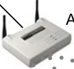

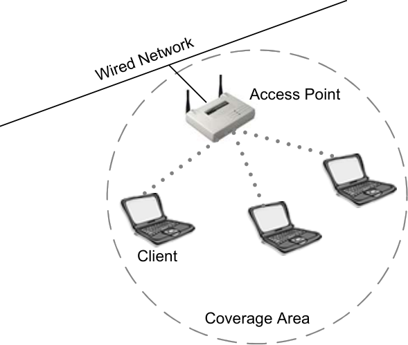

Wireless LANs offer a specific solution to a difficult problem: mobility. Without a
doubt, wireless LANs solve a host of problems for corporations and home users alike, but
all of these problems point to the need for freedom from data cabling. Cellular solutions
have been available for quite some time, offering users the ability to roam while staying
connected, at slow speeds and very high prices. Wireless LANs offer the same flexibility
without the disadvantages. Wireless LANs are fast, inexpensive, and they can be located
almost anywhere.

When considering wireless LANs for use in your network, keep in mind that using them
for their intended purpose will provide the best results. Administrators implementing
wireless LANs in a Core or Distribution role should understand exactly what
performance to expect before implementing them in this fashion to avoid having to
remove them later. The only distribution role in a corporate network that is definitely
appropriate for wireless LANs is that of building-to-building bridging. In this scenario,
wireless _could_ be considered as playing a distribution role; however, it will always
depend on how the wireless bridging segments are used in the network.

CWNA Study Guide © Copyright 2002 Planet3 Wireless, Inc.

--- end of page=32 ---

**5** Chapter 1 - Introduction to Wireless LANs

There are some Wireless Internet Service Providers (WISPs) that use licensed wireless
frequencies in a distribution role, but almost never unlicensed frequencies such as the
ones discussed at length in this book.

**Network Extension**

Wireless networks can serve as an extension to a wired network. There may be cases
where extending the network would require installing additional cabling that is cost
prohibitive. You may discover that hiring cable installers and electricians to build out a
new section of office space for the network is going to cost tens of thousands of dollars.
Or in the case of a large warehouse, the distances may be too great to use Category 5
(Cat5) cable for the Ethernet network. Fiber might have to be installed, requiring an even
greater investment of time and resources. Installing fiber might involve upgrades to
existing edge switches.

Wireless LANs can be easily implemented to provide seamless connectivity to remote
areas within a building, as illustrated by the floor plan image in Figure 1.2. Because little
wiring is necessary to install a wireless LAN, the costs of hiring installers and purchasing
Ethernet cable might be completely eliminated.

**FIGURE 1.2** Network Extension

Warehouse

**Building-to-Building Connectivity**

In a campus environment or an environment with as few as two adjacent buildings, there
may be a need to have the network users in each of the different buildings have direct
access to the same computer network. In the past, this type of access and connectivity
would be accomplished by running cables underground from one building to another or
by renting expensive leased-lines from a local telephone company.

CWNA Study Guide © Copyright 2002 Planet3 Wireless, Inc.

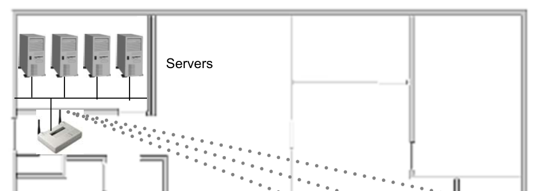

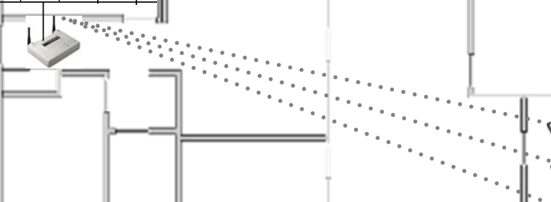

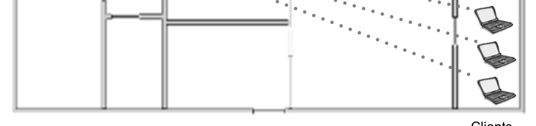

--- end of page=33 ---

Chapter 1 - Introduction to Wireless LANs **6**

Using wireless LAN technology, equipment can be installed easily and quickly to allow
two or more buildings to be part of the same network without the expense of leased lines
or the need to dig up the ground between buildings. With the proper wireless antennas,
any number of buildings can be linked together on the same network. Certainly there are
limitations to using wireless LAN technology, as there are in any data-connectivity
solution, but the flexibility, speed, and cost-savings that wireless LANs introduce to the
network administrator make them indispensable.

There are two different types of building-to-building connectivity. The first is called
point-to-point (PTP), and the second is called point-to-multipoint (PTMP). Point-to-point
links are wireless connections between only two buildings, as illustrated in Figure 1.3.
PTP connections almost always use semi-directional or highly-directional antennas at
each end of the link.

**FIGURE 1.3** Building-to-building connectivity

Point-to-multipoint links are wireless connections between three or more buildings,
typically implemented in a hub-n-spoke fashion, where one building is the central focus
point of the network. This central building would have the core network, Internet
connectivity, and the server farm. Point-to-multipoint links between buildings typically
use omni-directional antennas in the central "hub" building and semi-directional antennas
on each of the outlying "spoke" buildings. Antennas will be covered in greater detail in
Chapter 5.

There are many ways to implement these two basic types of connectivity, as you will
undoubtedly see over the course of your career as a wireless LAN administrator or
consultant. However, no matter how the implementations vary, they all fall into one of
these two categories.

**Last Mile Data Delivery**

Wireless Internet Service Providers (WISPs) are now taking advantage of recent
advancements in wireless technology to offer last mile data delivery service to their
customers. "Last mile" refers to the communication infrastructure—wired or wireless—
that exists between the central office of the telecommunications company (telco) or cable
company and the end user. Currently the telcos and cable companies own their last mile
infrastructure, but with the broadening interest in wireless technology, WISPs are now
creating their own wireless last mile delivery service, as illustrated in Figure 1.4.

CWNA Study Guide © Copyright 2002 Planet3 Wireless, Inc.

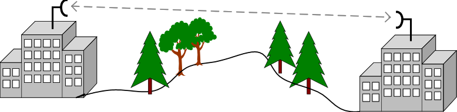

--- end of page=34 ---

**7** Chapter 1 - Introduction to Wireless LANs

**FIGURE 1.4** Last Mile Service

Remote

Owned

Residence

Tower

Consider the case where both the cable companies and telcos are encountering difficulties
expanding their networks to offer broadband connections to more households or
businesses. If you live in a rural area, chances are you do not have access to a broadband
connection (cable modem or xDSL), and probably will not for quite some time. It is
much more cost effective for WISPs to offer wireless access to these remote locations
because WISPs will not encounter the same costs a cable company or telco would incur
in order to install the necessary equipment.

WISPs have their own unique set of challenges. Just as xDSL providers have problems
going further than 18,000 feet from the central office and cable providers have issues
with the cable being a shared medium to users, WISPs have problems with rooftops,
trees, mountains, lightning, towers, and many other obstacles to connectivity. Certainly
WISPs don't have a fail-proof solution, but they have the capability to offer broadband
access to users that other, more conventional technologies cannot reach.

**Mobility**

As an access layer solution, wireless LANs cannot replace wired LANs in terms of data
rates (100BT at 100Mbps versus IEEE 802.11a at 54Mbps). What wireless LANs do
offer is an increase in mobility (as can be seen in Figure 1.5) as the trade off for speed
and quality of service.

For example, a parcel delivery company uses wireless technology to update parceltracking data immediately upon the arrival of the delivery vehicle. As the driver parks at
the dock, the driver’s computer has already logged onto the network and transferred the
day's delivery data to the central network.

CWNA Study Guide © Copyright 2002 Planet3 Wireless, Inc.

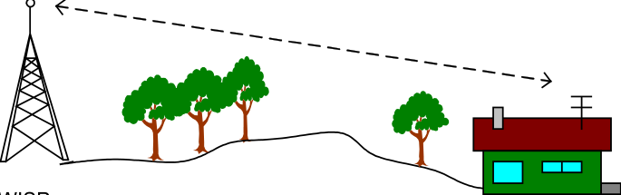

--- end of page=35 ---

**FIGURE 1.5** Mobility

Chapter 1 - Introduction to Wireless LANs **8**

Employee with a
hand scanner

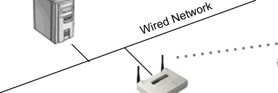

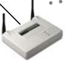

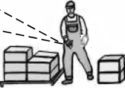

In warehousing facilities, wireless networks are used to track the storage locations and
disposition of products. This data is then synchronized in the central computer for the
purchasing and shipping departments. Handheld wireless scanners are becoming
commonplace in organizations with employees that move around within their facility
processing orders and inventory.

In each of these cases, wireless networks have created the ability to transfer data without
requiring the time and manpower to input the data manually at a wired terminal.
Wireless connectivity has also eliminated the need for such user devices to be connected
using wires that would otherwise get in the way of the users.

Some of the newest wireless technology allows users to _roam,_ or move physically from
one area of wireless coverage to another without losing connectivity, just as a mobile
telephone customer is able to roam between cellular coverage areas. In larger
organizations, where wireless coverage spans large areas, roaming capability has
significantly increased the productivity of these organizations, simply because users
remain connected to the network away from their main workstations.

**Small Office-Home Office**

As an IT professional, you may have more than one computer at your home. And if you
do, these computers are most likely networked together so you can share files, a printer,
or a broadband connection.

This type of configuration is also utilized by many businesses that have only a few
employees. These businesses have the need for the sharing of information between users
and a single Internet connection for efficiency and greater productivity.

For these applications – small office-home office, or SOHO – a wireless LAN is a very
simple and effective solution. Figure 1.6 illustrates a typical SOHO wireless LAN
solution. Wireless SOHO devices are especially beneficial when office workers want to
share a single Internet connection. The alternative of course is running wires throughout
the office to interconnect all of the workstations. Many small offices are not outfitted
with pre-installed Ethernet ports, and only a very small number of houses are wired for
Ethernet networks. Trying to retrofit these places with Cat5 cabling usually results in
creating unsightly holes in the walls and ceilings. With a wireless LAN, users can be
interconnected easily and neatly.

CWNA Study Guide © Copyright 2002 Planet3 Wireless, Inc.

--- end of page=36 ---

**9** Chapter 1 - Introduction to Wireless LANs

**FIGURE 1.6** SOHO Wireless LAN

Wireless
Residential
Gateway

**Mobile Offices**

Mobile offices or classrooms allow users to pack up their computer equipment quickly
and move to another location. Due to overcrowded classrooms, many schools now use
mobile classrooms. These classrooms usually consist of large, movable trailers that are
used while more permanent structures are built. In order to extend the computer network
to these temporary buildings, aerial or underground cabling would have to be installed at
great expense. Wireless LAN connections from the main school building to the mobile
classrooms allow for flexible configurations at a fraction of the cost of alternative
cabling. A simplistic example of connecting mobile classrooms using wireless LAN
connectivity is illustrated in Figure 1.7.

Temporary office spaces also benefit from being networked with wireless LANs. As
companies grow, they often find themselves with a shortage of office space, and need to
move some workers to a nearby location, such as an adjacent office or an office on
another floor of the same building. Installing Cat5 or fiber cabling for these short periods
of time is not cost-effective, and usually the owners of the building do not allow for the
installed cables to be removed. With a wireless network, the network components can be
packed up and moved to the next location quickly and easily.

**FIGURE 1.7** A school with mobile classrooms

Main
Educational
Portable Classrooms
Facility

CWNA Study Guide © Copyright 2002 Planet3 Wireless, Inc.

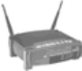

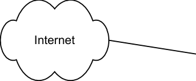

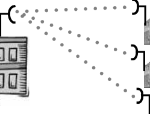

--- end of page=37 ---

Chapter 1 - Introduction to Wireless LANs **10**

There are many groups that might use movable networks effectively. Some of these
include the Superbowl, the Olympics, circuses, carnivals, fairs, festivals, construction
companies, and others. Wireless LANs are well suited to these types of environments.

Hospitals and other healthcare facilities benefit greatly from wireless LANs. Some
valuable uses of wireless LANs within these facilities include doctors using wireless
PDAs to connect to the networks and mobile diagnostic carts that nurses can move from
room to room to connect to the patient and the network. Wireless networks allow doctors
and nurses to perform their jobs more efficiently using these new devices and associated
software.

Industrial facilities, such as warehouses and manufacturing facilities, utilize wireless
networks in various ways. A good example of an industrial wireless LAN application is
shipping companies whose trucks pull into the dock and automatically connect to the
wireless network. This type of networking allows the shipping company to become
automated and more efficient in handling the uploading of data onto the central servers.

**Summary**

Wireless technology has come a long way since its simple military implementations. The
popularity and level of technology used in wireless LANs continues to grow at an
incredible rate. Manufactures have created a myriad of solutions for our varying wireless
networking needs. The convenience, popularity, availability, and cost of wireless LAN
hardware provide us all with many different solutions.

With the explosive expansion of wireless technology, manufacturers, and hardware, the
role of organizations such as the FCC, IEEE, WECA, and WLANA will become
increasingly important to the removal of barriers of operation between solutions. The
laws put in place by regulatory organizations like the FCC along with the standards
provided by promotional and other organizations like IEEE, WLANA, and WECA will
focus the wireless LAN industry and provide a common path for it to grow and evolve
over time.

CWNA Study Guide © Copyright 2002 Planet3 Wireless, Inc.

--- end of page=38 ---

**11** Chapter 1 - Introduction to Wireless LANs

##### Key Terms

Before taking the exam, you should be familiar with the following terms:

_access layer_

_core layer_

_distribution layer_

_FCC_

_IEEE_

_IEEE 802.11_

_IEEE 802.11a_

_IEEE 802.11b_

_IEEE 802.11g_

_last mile_

_SOHO_

_WISP_

CWNA Study Guide © Copyright 2002 Planet3 Wireless, Inc.

--- end of page=39 ---

Chapter 1 - Introduction to Wireless LANs **12**

##### Review Questions

1. Which one of the following does a wireless LAN provide that a wired network does
not?

A. Mobility

B. Centralized security

C. Reliability

D. VPN security

2. Which one of the following would not be an appropriate use of a wireless LAN?

A. Connecting two buildings together that are on opposite sides of the street

B. Connecting two computers together in a small office so they can share a printer

C. Connecting a remote home to a WISP for Internet access

D. Connecting two rack-mounted computers together

3. Why is a wireless LAN a good choice for extending a network? Choose all that
apply.

A. Reduces the cost of cables required for installation

B. Can be installed faster than a wired network

C. The hardware is considerably less expensive

D. Eliminates a significant portion of the labor charges for installation

4. Wireless ISPs provide which one of the following services?

A. Small office/home office services

B. Connectivity for large enterprises

C. Last mile data delivery

D. Building-to-building connectivity

5. Wireless LANs are primarily deployed in which one of the following roles?

A. Backbone

B. Access

C. Application

D. Core

CWNA Study Guide © Copyright 2002 Planet3 Wireless, Inc.

--- end of page=40 ---

**13** Chapter 1 - Introduction to Wireless LANs

6. Why would a mobile office be a good choice for using a wireless LAN? Choose all
that apply.

A. It would take less time to setup than wiring a network

B. The equipment could be removed easily if the office moves

C. It would not require any administration

D. It is a more centralized approach

7. Which one of the following is the IEEE family of standards for wireless LANs?

A. 802.3

B. 803.5

C. 802.11

D. 802.1x

8. As a consultant, you have taken a job creating a wireless LAN for an office complex
that will connect 5 buildings in close vicinity together. Given only this information,
which one of the following wireless LAN implementations would be most
appropriate for this scenario?

A. Last-mile data service from a WISP

B. Point-to-point bridge links between all buildings

C. Point-to-multipoint bridge link from a central building to all remote buildings

D. One central antenna at the main building only

9. Which of the following are challenges that WISPs face that telephone companies
and cable companies do not? Choose all that apply.

A. Customers located more than 18,000 feet from a central office

B. High costs of installing telephone lines or copper cabling

C. Trees as line of sight obstructions

D. Rooftop access for antenna installation

10. In what organization did the use of spread spectrum wireless data transfer originate?

A. WECA

B. WLANA

C. FCC

D. U.S. Military

CWNA Study Guide © Copyright 2002 Planet3 Wireless, Inc.

--- end of page=41 ---

Chapter 1 - Introduction to Wireless LANs **14**

11. Which one of the following is the most recently approved IEEE standard for
wireless LANs?

A. 802.11a

B. 802.11b

C. 802.11c

D. 802.11g

12. Which one of the following IEEE standards for wireless LANs is _not_ compatible
with the standard currently known as Wi-Fi™?

A. 802.11

B. 802.11g

C. 802.11a

D. 802.11b

13. Which one of the following IEEE 802.11 standards for wireless LANs utilizes the 5
GHz UNII bands for its radio signal transmissions?

A. 802.11b

B. Bluetooth

C. 802.11

D. 802.11g

E. 802.11a

14. A WISP would take advantage of which one of the following applications for
wireless LANs?

A. Last Mile data delivery

B. Building-to-building bridging

C. Classroom connectivity

D. Home network connectivity

15. Who makes the laws that govern the usage of wireless LANs in the United States?

A. IEEE

B. WECA

C. FCC

D. FAA

CWNA Study Guide © Copyright 2002 Planet3 Wireless, Inc.

--- end of page=42 ---

**15** Chapter 1 - Introduction to Wireless LANs

##### Answers to Review Questions

1. A. The most alluring feature of a wireless network is the freedom to move about
while remaining connected to the network. Wired networks cannot offer this
feature.

2. D. Generally speaking, computers that are rack-mounted together are servers, and
servers should be connected to a high-speed, wired backbone. Wireless networks
are meant for mobile access rather than server room connectivity.

3. A, B, D. Cabling a facility is a time-consuming and expensive task. Wireless
networks can quickly and inexpensively be installed and configured.

4. C. Wireless Internet Service Providers (WISPs) provide last mile data delivery
service to homes and businesses. In this fashion, they compete directly against
wired ISPs such as telephone and cable companies.

5. B. The _access_ layer of the industry standard design model is where users attach to
the network. Wireless network devices are most generally installed in this capacity.
There are times when wireless networks may be used in a distribution role, such as
building-to-building bridging, but a very large percentage of wireless networks are
used strictly for access.

6. A, B. In the setup and teardown of a mobile office, cabling is the most significant
task. In a small office, many of the common problems of a wireless network are not
experienced so time-consuming tasks such as site surveys are not required.
Centralized connection points (called access points) are minimal so wiring is
minimal.

7. C. The 802.11 family of standards specifically address wireless LANs. There are
many flavors of standards addressing many types of wireless technologies and
various topics related to wireless technologies. For example, 802.11, 802.11b,
802.11g, and 802.11a are all specifications of wireless LANs systems whereas
802.11f addresses inter-access point protocol and 802.11i addresses wireless LAN
security. The 802.1x standard is for port-based network access control.

8. C. Since using a single antenna would likely have severe problems with coverage
and many point-to-point bridge links (forming a partial or full mesh) would be
highly expensive, the only logical alternative is to use point-to-multipoint bridge
connectivity between buildings. This is an economically sound and highly effective
solution.

9. C, D. Wireless Internet Service Providers (WISPs) face problems with line of sight
limitations of 2.4 GHz and 5 GHz wireless LAN systems. Antennas must be
installed on rooftops or higher if possible in most cases. Trees and hills both pose
problems to WISPs for the same reason.

10. D. During WWII, actress Hedy Lamarr and composer George Antheil co-invented
the frequency hopping communications technique. The U.S. military began using
frequency hopping spread spectrum communications in 1957 well before the broad
commercial use that spread spectrum systems enjoy today.

CWNA Study Guide © Copyright 2002 Planet3 Wireless, Inc.

--- end of page=43 ---

Chapter 1 - Introduction to Wireless LANs **16**

11. A. The first wireless LAN standard was the 802.11 standard using the 2.4 GHz ISM
band, approved in 1997. Following 802.11 was 802.11b raising the top speed to 11
Mbps and limiting use to DSSS technology only. Following 802.11b was 802.11a,
which uses the 5 GHz UNII bands. The 802.11g standard is in draft form, and has
not yet been completed.

12. C. Wi-Fi is the hardware compatibility standard created and maintained by WECA
for 802.11b devices. IEEE 802.11g devices use the 2.4 GHz ISM band are
backwards compatible with 802.11b. 802.11a devices use a different set of
frequencies and a different modulation type from 802.11b, and are thus
incompatible.

13. E. The IEEE 802.11, 802.11b, 802.11g, Bluetooth, and HomeRF all use the 2.4
GHz ISM bands, whereas the 802.11a standard uses the 5 GHz UNII bands.

14. A. WISPs are direct competitors for telephone companies and cable companies in
providing last-mile connectivity to businesses and residences in the broadband
Internet services market.

15. C. The Federal Communications Commission (FCC) makes the laws regarding
frequency band usage (licensed and unlicensed) in the United States. The IEEE
makes standards regarding wireless LANs, which use RF frequencies. WECA
makes hardware compatibility standards called Wi-Fi and Wi-Fi5, and the Federal
Aviation Commission (FAA) controls airspace and aviation vehicles.

CWNA Study Guide © Copyright 2002 Planet3 Wireless, Inc.

--- end of page=44 ---
