# Chapter 2 - RF Fundamentals

_PDF pages 46-73_

**CWNA Exam Objectives Covered:**

- Define and apply the basic concepts of RF behavior:

 - Gain

 - Loss

 - Reflection

 - Refraction

 - Diffraction

 - Scattering

 - VSWR

 - Amplification & attenuation

- Identify and understand application of basic RF antenna
concepts:

 - Visual LOS

 - RF LOS

 - The Fresnel Zone

 - Intentional Radiator

 - EIRP

 - Wave propagation

- Understand and apply the basic components of RF
mathematics:

 - Watt

 - Milliwatt

 - Decibel (dB)

 - dBm

 - dBi

CWNA Study Guide © Copyright 2002 Planet3 Wireless, Inc.

CHAPTER

**In This Chapter**

RF Behavior

Principles of Antennas

RF Mathematics

--- end of page=45 ---

Chapter 2 – RF Fundamentals **18**

In order to understand the wireless aspects of a wireless LAN, an administrator must have
a solid foundation in the fundamentals of radio frequency (RF) theory. In this chapter we
will discuss the properties of RF radiation and how its behavior in certain situations can
affect the performance of a wireless LAN. Antennas will be introduced to create a good
understanding of their uses and properties. We will discuss the mathematical
relationships that exist in RF circuits and why they are important, as well as how to
perform the necessary RF math calculations.

To a wireless LAN administrator, an understanding of RF concepts is essential to the
implementation, expansion, maintenance, and troubleshooting of the wireless network.

##### Radio Frequency

Radio frequencies are high frequency alternating current (AC) signals that are passed
along a copper conductor and then radiated into the air via an antenna. An antenna
converts/transforms a wired signal to a wireless signal and vice versa. When the high
frequency AC signal is radiated into the air, it forms radio waves. These radio waves
propagate (move) away from the source (the antenna) in a straight line in all directions at
once.

If you can imagine dropping a rock into a still pond (Figure 2.1) and watching the
concentric ripples flow away from the point where the rock hit the water, then you have
an idea of how RF behaves as it is propagated from an antenna. Understanding the
behavior of these propagated RF waves is an important part of understanding why and
how wireless LANs function. Without this base of knowledge, an administrator would be
unable to locate proper installation locations of equipment and would not understand how
to troubleshoot a problematic wireless LAN.

**FIGURE 2.1** Rock into a pond

CWNA Study Guide © Copyright 2002 Planet3 Wireless, Inc.

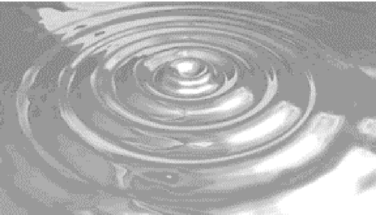

--- end of page=46 ---

**19** Chapter 2 – RF Fundamentals

**RF Behaviors**

RF is sometimes referred to as "smoke and mirrors" because RF seems to act erratically
and inconsistently under given circumstances. Things as small as a connector not being
tight enough or a slight impedance mismatch on the line can cause erratic behavior and
undesirable results. The following sections describe these types of behaviors and what
can happen to radio waves as they are transmitted.

**Gain**

Gain, illustrated in Figure 2.2, is the term used to describe an increase in an RF signal's
amplitude. Gain is usually an active process; meaning that an external power source,
such as an RF amplifier, is used to amplify the signal or a high-gain antenna is used to
focus the beamwidth of a signal to increase its signal amplitude.

**FIGURE 2.2** Power Gain

Gain as seen by an
Oscilloscope

Gain of DSSS as seen by a
spectrum analyzer

|Peak Amplitude after Gain|Col2|
|---|---|
|Peak Amplitude before Gain|Peak Amplitude before Gain|
|||

However, passive processes can also cause gain. For example, reflected RF signals can
combine with the main signal to increase the main signal's strength. Increasing the RF
signal's strength may have a positive or a negative result. Typically, more power is
better, but there are cases, such as when a transmitter is radiating power very close to the
legal power output limit, where added power would be a serious problem.

**Loss**

Loss describes a decrease in signal strength (Figure 2.3). Many things can cause RF
signal loss, both while the signal is still in the cable as a high frequency AC electrical
signal and when the signal is propagated as radio waves through the air by the antenna.
Resistance of cables and connectors causes loss due to the converting of the AC signal to
heat. Impedance mismatches in the cables and connectors can cause power to be
reflected back toward the source, which can cause signal degradation. Objects directly in
the propagated wave's transmission path can absorb, reflect, or destroy RF signals. Loss
can be intentionally injected into a circuit with an RF attenuator. RF attenuators are

CWNA Study Guide © Copyright 2002 Planet3 Wireless, Inc.

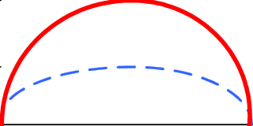

--- end of page=47 ---

Chapter 2 – RF Fundamentals **20**

accurate resistors that convert high frequency AC to heat in order to reduce signal
amplitude at that point in the circuit.

**FIGURE 2.3** Power Loss

Loss as seen by an
Oscilloscope

Loss of DSSS as seen by a
spectrum analyzer

|Col1|Peak Amplitude before Loss|Col3|
|---|---|---|
||Peak Amplitude after Loss||
||||

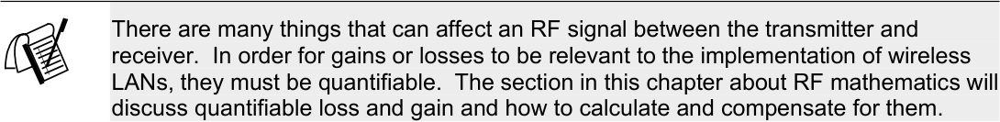

Being able to measure and compensate for loss in an RF connection or circuit is
important because radios have a receive sensitivity threshold. A sensitivity threshold is
defined as the point at which a radio can clearly distinguish a signal from background
noise. Since a receiver’s sensitivity is finite, the transmitting station must transmit a
signal with enough amplitude to be recognizable at the receiver. If losses occur between
the transmitter and receiver, the problem must be corrected either by removing the
objects causing loss or by increasing the transmission power.

**Reflection**

Reflection, as illustrated in Figure 2.4, occurs when a propagating electromagnetic wave
impinges upon an object that has very large dimensions when compared to the
wavelength of the propagating wave. Reflections occur from the surface of the earth,
buildings, walls, and many other obstacles. If the surface is smooth, the reflected signal
may remain intact, though there is some loss due to absorption and scattering of the
signal.

CWNA Study Guide © Copyright 2002 Planet3 Wireless, Inc.

--- end of page=48 ---

**21** Chapter 2 – RF Fundamentals

**FIGURE 2.4** Reflection

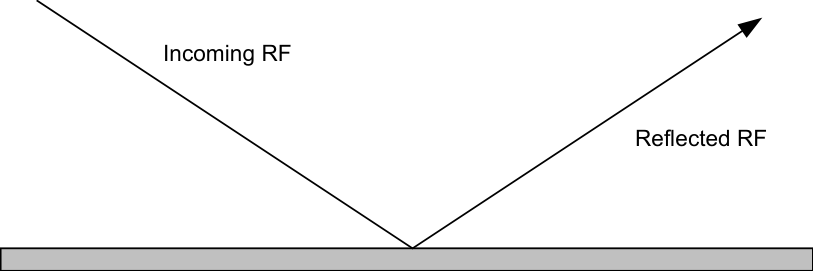

RF signal reflection can cause serious problems for wireless LANs. This reflecting of the
main signal from many objects in the area of the transmission is referred to as _multipath_ .
Multipath can have severe adverse affects on a wireless LAN, such as degrading or
canceling the main signal and causing holes or gaps in the RF coverage area. Surfaces
such as lakes, metal roofs, metal blinds, metal doors, and others can cause severe
reflection, and hence, multipath.

Reflection of this magnitude is never desirable and typically requires special functionality
(antenna diversity) within the wireless LAN hardware to compensate for it. Both
multipath and antenna diversity are discussed further in Chapter 9 (Troubleshooting).

**Refraction**

Refraction describes the bending of a radio wave as it passes through a medium of
different density. As an RF wave passes into a denser medium (like a pool of cold air
lying in a valley) the wave will be bent such that its direction changes. When passing
through such a medium, some of the wave will be reflected away from the intended
signal path, and some will be bent through the medium in another direction, as illustrated
in Figure 2.5.

**FIGURE 2.5** Refraction

|Col1|Incoming RF Reflected RF|Col3|
|---|---|---|
||||
||||

Refraction can become a problem for long distance RF links. As atmospheric conditions
change, the RF waves may change direction, diverting the signal away from the intended
target.

CWNA Study Guide © Copyright 2002 Planet3 Wireless, Inc.

--- end of page=49 ---

Chapter 2 – RF Fundamentals **22**

**Diffraction**

Diffraction occurs when the radio path between the transmitter and receiver is obstructed
by a surface that has sharp irregularities or an otherwise rough surface.  At high
frequencies, diffraction, like reflection, depends on the geometry of the obstructing object
and the amplitude, phase, and polarization of the incident wave at the point of diffraction.

Diffraction is commonly confused with and improperly used interchangeably with
_refraction_ . Care should be taken not to confuse these terms. Diffraction describes a
wave bending around an obstacle (Figure 2.6), whereas refraction describes a wave
bending through a medium. Taking the rock in the pond example from above, now
consider a small twig sticking up through the surface of the water near where the rock hit
the water. As the ripples hit the stick, they would be blocked to a small degree, but to a
larger degree, the ripples would bend around the twig. This illustration shows how
diffraction acts with obstacles in its path, depending on the makeup of the obstacle. If the
object was large or jagged enough, the wave might not bend, but rather might be blocked.

**FIGURE 2.6** Diffraction

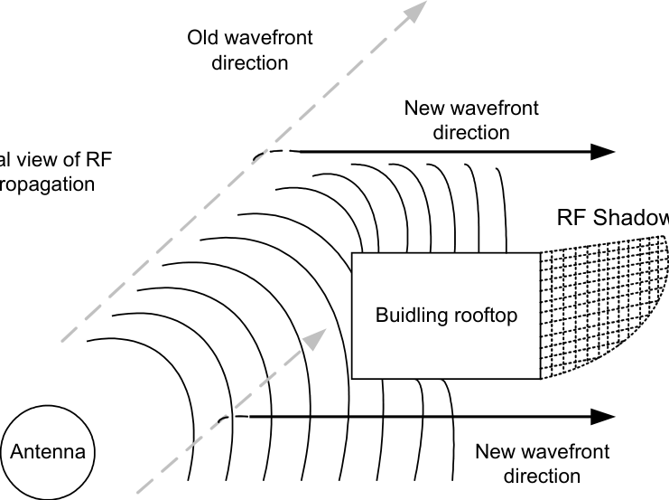

Old wavefront
direction

Diffraction is the slowing of the wave front at the point where the wave front strikes an
obstacle, while the rest of the wave front maintains the same speed of propagation.
Diffraction is the effect of waves turning, or bending, around the obstacle. As another
example, consider a machine blowing a steady stream of smoke. The smoke would flow
straight until an obstacle entered its path. Introducing a large wooden block into the
smoke stream would cause the smoke to curl around the corners of the block causing a
noticeable degradation in the smoke's velocity at that point and a significant change in
direction.

CWNA Study Guide © Copyright 2002 Planet3 Wireless, Inc.

--- end of page=50 ---

**23** Chapter 2 – RF Fundamentals

**Scattering**

Scattering occurs when the medium through which the wave travels consists of objects
with dimensions that are small compared to the wavelength of the signal, and the number
of obstacles per unit volume is large. Scattered waves are produced by rough surfaces,
small objects, or by other irregularities in the signal path, as can be seen in Figure 2.7.

**FIGURE 2.7** Scattering

Some outdoor examples of objects that can cause scattering in a mobile communications
system include foliage, street signs, and lampposts. Scattering can take place in two
primary ways.

First, scattering can occur when a wave strikes an uneven surface and is reflected in many
directions simultaneously. Scattering of this type yields many small amplitude
reflections and destroys the main RF signal. Dissipation of an RF signal may occur when
an RF wave is reflected off sand, rocks, or other jagged surfaces. When scattered in this
manner, RF signal degradation can be significant to the point of intermittently disrupting
communications or causing complete signal loss.

Second, scattering can occur as a signal wave travels through particles in the medium
such as heavy dust content. In this case, rather than being reflected off an uneven
surface, the RF waves are individually reflected on a very small scale off tiny particles.

**Voltage Standing Wave Ratio (VSWR)**

VSWR occurs when there is mismatched _impedance_ (resistance to current flow,
measured in Ohms) between devices in an RF system. VSWR is caused by an RF signal
reflected at a point of impedance mismatch in the signal path. VSWR causes _return loss_,
which is defined as the loss of forward energy through a system due to some of the power
being reflected back towards the transmitter. If the impedances of the ends of a
connection do not match, then the maximum amount of the transmitted power will not be
received at the antenna. When part of the RF signal is reflected back toward the
transmitter, the signal level on the line varies instead of being steady. This variance is an
indicator of VSWR.

As an illustration of VSWR, imagine water flowing through two garden hoses. As long

CWNA Study Guide © Copyright 2002 Planet3 Wireless, Inc.

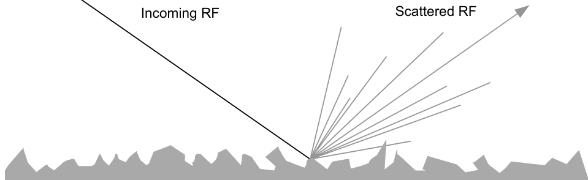

--- end of page=51 ---

Chapter 2 – RF Fundamentals **24**

as the two hoses are the same diameter, water flows through them seamlessly. If the hose
connected to the faucet were significantly larger than the next hose down the line, there
would be backpressure on the faucet and even at the connection between the two hoses.
This standing backpressure illustrates VSWR, as can be seen in Figure 2.8. In this
example, you can see that backpressure can have negative effects and not nearly as much
water is transferred to the second hose as there would have been with matching hoses
screwed together properly.

**FIGURE 2.8** VSWR - like water through a hose

Lower

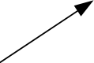

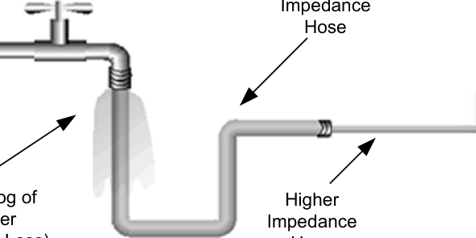

**VSWR Measurements**

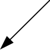

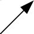

VSWR is a ratio, so it is expressed as a relationship between two numbers. A typical
VSWR value would be 1.5:1. The two numbers relate the ratio of impedance mismatch
against a perfect impedance match. The second number is always 1, representing the
perfect match, where as the first number varies. The lower the first number (closer to 1),
the better impedance matching your system has. For example, a VSWR of 1.1:1 is better
than 1.4:1. A VSWR measurement of 1:1 would denote a perfect impedance match and
no voltage standing wave would be present in the signal path.

**Effects of VSWR**

Excessive VSWR can cause serious problems in an RF circuit. Most of the time, the
result is a marked decrease in the amplitude of the transmitted RF signal. However, since
some transmitters are not protected against power being applied (or returned) to the
transmitter output circuit, the reflected power can burn out the electronics of the
transmitter. VSWR's effects are evident when transmitter circuits burn out, power output
levels are unstable, and the power observed is significantly different from the expected
power. The methods of changing VSWR in a circuit include proper use of proper
equipment. Tight connections between cables and connectors, use of impedance matched
hardware throughout, and use of high-quality equipment with calibration reports where
necessary are all good preventative measures against VSWR. VSWR can be measured
with high-accuracy instrumentation such as SWR meters, but this measurement is beyond
the scope of this text and the job tasks of a network administrator.

CWNA Study Guide © Copyright 2002 Planet3 Wireless, Inc.

--- end of page=52 ---

**25** Chapter 2 – RF Fundamentals

**Solutions to VSWR**

To prevent the negative effects of VSWR, it is imperative that all cables, connectors, and
devices have impedances that match as closely as possible to each other. Never use 75Ohm cable with 50-Ohm devices, for example. Most of today’s wireless LAN devices
have an impedance of 50 Ohms, but it is still recommended that you check each device
before implementation, just to be sure. Every device from the transmitter to the antenna
must have impedances matching as closely as possible, including cables, connectors,
antennas, amplifiers, attenuators, the transmitter output circuit, and the receiver input
circuit.

##### Principles of Antennas

It is not our intention to teach antenna theory in this book, but rather to explain some very
basic antenna principals that directly relate to use of wireless LANs. It is not necessary
for a wireless LAN administrator to thoroughly understand antenna design in order to
administer the network. A couple of key points that are important to understand about
antennas are:

      - Antennas convert electrical energy into RF waves in the case of a transmitting
antenna, or RF waves into electrical energy in the case of a receiving antenna.

      - The physical dimensions of an antenna, such as its length, are directly related to
the frequency at which the antenna can propagate waves or receive propagated
waves.

Some essential points of understanding in administering license-free wireless LANs are
line of sight, the effects of the Fresnel (pronounced “fra-NEL”) Zone, and antenna gain
through focused beamwidths. These points will be discussed in this section.

**Line of Sight (LOS)**

With visible light, visual LOS (also called simply ‘LOS’) is defined as the apparently
straight line from the object in sight (the transmitter) to the observer's eye (the receiver).
The LOS is an _apparently_ straight line because light waves are subject to changes in
direction due to refraction, diffraction, and reflection in the same way as RF frequencies.
Figure 2.9 illustrates LOS. RF works very much the same way as visible light within
wireless LAN frequencies with one major exception: RF LOS can also be affected by
blockage of the Fresnel Zone.

CWNA Study Guide © Copyright 2002 Planet3 Wireless, Inc.

--- end of page=53 ---

Chapter 2 – RF Fundamentals **26**

**FIGURE 2.9** Line of Sight

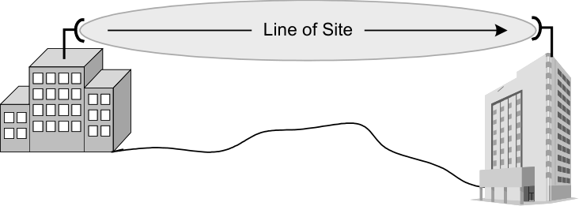

Imagine that you are looking through a two-foot long piece of pipe. Imagine further that
an obstruction were blocking part of the inside of the pipe. Obviously, this obstruction
would block your view of the objects at the other end of the pipe. This simple illustration
shows how RF works when objects block the Fresnel Zone, except that, with the pipe
scenario, you can still see the other end to some degree. With RF, that same limited
ability to see translates into a broken or corrupted connection. RF LOS is important
because RF doesn't behave in exactly the same manner as visible light.

**Fresnel Zone**

A consideration when planning or troubleshooting an RF link is the Fresnel Zone. The
Fresnel Zone occupies a series of concentric ellipsoid-shaped areas around the LOS path,
as can be seen in Figure 2.10. The Fresnel Zone is important to the integrity of the RF
link because it defines an area around the LOS that can introduce RF signal interference
if blocked. Objects in the Fresnel Zone such as trees, hilltops, and buildings can diffract
or reflect the main signal away from the receiver, changing the RF LOS. These same
objects can absorb or scatter the main RF signal, causing degradation or complete signal
loss.

**FIGURE 2.10** Fresnel Zone

Fresnel Zone

The radius of the Fresnel Zone at its widest point can be calculated by the following
formula,

where _d_ is the link distance in miles, _f_ is the frequency in GHz, and the answer, _r_, is in

CWNA Study Guide © Copyright 2002 Planet3 Wireless, Inc.

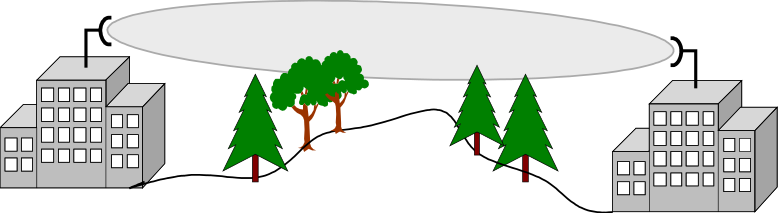

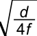

--- end of page=54 ---

**27** Chapter 2 – RF Fundamentals

feet. For example, suppose there is a 2.4000 GHz link 5 miles in length. The resulting
Fresnel Zone would have a radius of 31.25 feet.

**Obstructions**

Considering the importance of Fresnel Zone clearance, it is also important to quantify the
degree to which the Fresnel Zone can be blocked. Since an RF signal, when partially
blocked, will bend around the obstacle to some degree, some blockage of the Fresnel
Zone can occur without significant link disruption. Typically, 20% - 40% Fresnel Zone
blockage introduces little to no interference into the link. It is always suggested to err to
the conservative side allowing no more than 20% blockage of the Fresnel Zone.
Obviously, if trees or other growing objects are the source of the blockage, you might
want to consider designing the link based on 0% blockage.

If the Fresnel Zone of a proposed RF link is more than 20% blocked, or if an active link
becomes blocked by new construction or tree growth, raising the height of the antennas
will usually alleviate the problem.

**Antenna Gain**

An antenna element – without the amplifiers and filters typically associated with it – is a
passive device. There is no conditioning, amplifying, or manipulating of the signal by
the antenna element itself. The antenna can create the effect of amplification by virtue of
its physical shape. Antenna amplification is the result of focusing the RF radiation into a
tighter beam, just as the bulb of a flashlight can be focused into a tighter beam creating a
seemingly brighter light source that sends the light further. The focusing of the radiation
is measured by way of beamwidths, which are measured in degrees horizontal and
vertical. For example, an omni-directional antenna has a 360-degree horizontal
beamwidth. By limiting the 360-degree beamwidth into a more focused beam of, say, 30
degrees, at the same power, the RF waves will be radiated further. This is how patch,
panel, and Yagi antennas (all of which are semi-directional antennas) are designed.
Highly directional antennas take this theory a step further by very tightly focusing both
horizontal and vertical beamwidths to maximize distance of the propagated wave at low
power.

**Intentional Radiator**

As defined by the Federal Communication Commission (FCC), an intentional radiator is
an RF device that is specifically designed to generate and radiate RF signals. In terms of
hardware, an intentional radiator will include the RF device and all cabling and
connectors up to, but not including, the antenna, as illustrated in Figure 2.11 below.

CWNA Study Guide © Copyright 2002 Planet3 Wireless, Inc.

--- end of page=55 ---

Chapter 2 – RF Fundamentals **28**

**FIGURE 2.11** Intentional Radiator

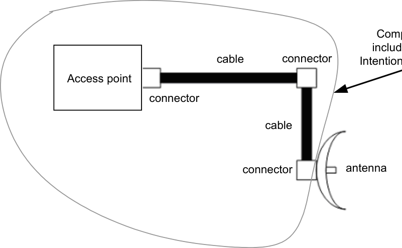

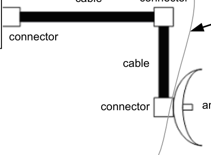

Any reference to "power output of the Intentional Radiator" refers to the power output at
the end of the last cable or connector before the antenna. For example, consider a 30milliwatt transmitter that loses 15 milliwatts of power in the cable and another 5
milliwatts from the connector at the antenna. The power at the intentional radiator would
be 10 milliwatts. As an administrator, it is your responsibility to understand the FCC
rules relating to Intentional Radiators and their power output. Understanding how power
output is measured, how much power is allowed, and how to calculate these values are all
covered in this book. FCC regulations concerning output power at the Intentional
Radiator and EIRP are found in Part 47 CFR, Chapter 1, Section 15.247 dated October 1,
2000.

**Equivalent Isotropically Radiated Power (EIRP)**

EIRP is the power actually radiated by the antenna element, as shown in Figure 2.12.
This concept is important because it is regulated by the FCC and because it is used in
calculating whether or not a wireless link is viable. EIRP takes into account the gain of
the antenna.

CWNA Study Guide © Copyright 2002 Planet3 Wireless, Inc.

--- end of page=56 ---

**29** Chapter 2 – RF Fundamentals

**FIGURE 2.12** EIRP

Access point

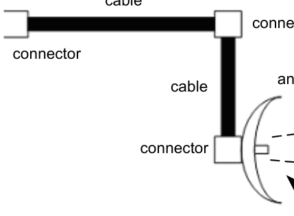

RF Beam

EIRP
(output power)

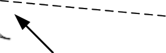

Suppose a transmitting station uses a 10-dBi antenna (which amplifies the signal 10-fold)
and is fed by 100 milliwatts from the intentional radiator. The EIRP is 1000 mW, or 1
Watt. The FCC has rules defining both the power output at the intentional radiator and
the antenna element.

##### Radio Frequency Mathematics

There are four important areas of power calculation in a wireless LAN. These areas are:

      - Power at the transmitting device

      - Loss and gain of connectivity devices between the transmitting device and the
antenna - such as cables, connectors, amplifiers, attenuators, and splitters

      - Power at the last connector before the RF signal enters the antenna (Intentional
Radiator)

      - Power at the antenna element (EIRP)

These areas will be discussed in calculation examples in forthcoming sections.  Each of
these areas will help to determine whether RF links are viable without overstepping
power limitations set by the FCC. Each of these factors must be taken into account when
planning a wireless LAN, and all of these factors are related mathematically. The
following section explains the units of measurement that are used to calculate power
output when configuring wireless LAN devices.

CWNA Study Guide © Copyright 2002 Planet3 Wireless, Inc.

--- end of page=57 ---

Chapter 2 – RF Fundamentals **30**

**Units of Measure**

There are a few standard units of measure that a wireless network administrator should
become familiar with in order to be effective in implementing and troubleshooting
wireless LANs. We will discuss them all in detail, giving examples of their usage. We
will then put them to use in some sample math problems so that you have a solid grasp of
what is required as part of the CWNA's job tasks.

**Watts (W)**

The basic unit of power is a watt. A watt is defined as one ampere (A) of current at one
volt (V). As an example of what these units mean, think of a garden hose that has water
flowing through it. The pressure on the water line would represent the voltage in an
electrical circuit. The water flow would represent the amperes (current) flowing through
the garden hose. Think of a watt as the result of a given amount of pressure and a given
amount of water in the garden hose. One watt is equal to an Ampere multiplied times a
Volt.

A typical 120-volt plug-in night-light is about 7 watts. On a clear night this 7 W light
may be seen 50 miles away in all directions, and, if we could somehow encode
information, such as with Morse code, we would have a wireless link established.
Remember, we are only interested in sending and receiving data, not illuminating the
receiver with RF energy as we would illuminate a room with light. You can see that
relatively little power is required to form an RF link of great distance. The FCC allows
only 4 watts of power to be radiated from an antenna in a point-to-multipoint wireless
LAN connection using unlicensed 2.4 GHz spread spectrum equipment. Four watts
might not seem like much power, but it is enough to send a clear RF data signal for miles.

**Milliwatt**

When implementing wireless LANs, power levels as low as 1 milliwatt (1/1000 watt,
abbreviated as “mW”) can be used for a small area, and power levels on a single wireless
LAN segment are rarely above 100 mW - enough to communicate up to a half mile in
optimum conditions. Access points generally have the ability to radiate 30-100 mW of
power, depending on the manufacturer. It is only in the case of point-to-point outdoor
connections between buildings that power levels above 100 mW would be used. Most of
the power levels referred to by administrators will be in mW or dBm. These two units of
measurement both represent an absolute amount of power and are both industry standard
measurements.

**Decibels**

When a receiver is very sensitive to RF signals, it may be able to pick up signals as small
as 0.000000001 Watts. Other than its obvious numerical meaning, this tiny number has
little intuitive meaning to the layperson and will likely be ignored or misread. Decibels
allow us to represent these numbers by making them more manageable and
understandable. Decibels are based on a logarithmic relationship to the previously
explained linear measurement of power: watts. Concerning RF, a logarithm is the

CWNA Study Guide © Copyright 2002 Planet3 Wireless, Inc.

--- end of page=58 ---

**31** Chapter 2 – RF Fundamentals

exponent to which the number 10 must be raised to reach some given value.

If we are given the number 1000 and asked to find the logarithm (log), we find that log
1000 = 3 because 10 [3] = 1000. Notice that our logarithm, 3, is the exponent. An
important thing to note about logarithms is that the logarithm of a negative number or of
zero does not exist.

Log (-100) = undefined!

Log (0) = undefined!

On the linear watt scale we can plot points of absolute power. Absolute power
measurement refers to the measurement of power in relation to some fixed reference. On
most linear scales (watts, degrees Kelvin, miles per hour), the reference is fixed at zero,
which usually describes the absence of the thing measured: zero watts = no power, zero
degrees Kelvin = no thermal energy, zero MPH = no movement. On a logarithmic scale,
the reference cannot be zero because the log of zero does not exist. Decibels are a
relative measurement unit unlike the absolute measurement of milliwatts.

**Gain and Loss Measurements**

Power gain and loss are measured in decibels, not in watts, because gain and loss are
relative concepts and a decibel is a relative measurement. Gain or loss in an RF system
may be referred to by absolute power measurement (e.g. ten watts of power) or by a
relative power measurement (e.g. half of its power). Losing half of the power in a system
corresponds to losing 3 decibels. If a system loses half of its power (-3 dB), then loses
half again (another -3 dB), then the total system loss is 3/4 of the original power - ½ first,
then ¼ (½ of ½). Clearly, no absolute measurement of watts can quantify this
asymmetrical loss in a meaningful way, but decibels do just that.

As a quick and easy reference, there are some numbers related to gain and loss that an
administrator should be familiar with. These numbers are:

-3 dB = half the power in mW
+3 dB = double the power in mW
-10 dB = one tenth the power in mW
+10 dB = ten times the power in mW

We refer to these quick references as the 10's and 3's of RF math. When calculating
power gain and loss, one can almost always divide an amount of gain or loss by 10 or 3
or both. These values give the administrator the ability to quickly and easily calculate RF
loss and gain with a fair amount of accuracy without the use of a calculator. In the case
where use of this method is not possible, there are conversion formulas, shown below,
that can be used for these calculations.

The following is the general equation for converting mW to dBm:

_Pdbm_ = 10 log _PmW_

CWNA Study Guide © Copyright 2002 Planet3 Wireless, Inc.

--- end of page=59 ---

Chapter 2 – RF Fundamentals **32**

This equation can be manipulated to reverse the conversion, now converting dBm to mW:

_Pmw_ = log - [1]  _Pdbm_

 10

 _Pdbm_ 

 10 




*Note: log [−] 1 denotes the inverse logarithm (inverse log)

Another important point is that gains and losses are additive. If an access point were
connected to a cable whose loss was -2 dB and then a connector whose loss was -1 dB,
then these loss measurements would be additive and yield a total of -3 dB of loss. We
will walk through some RF calculations in the coming sections to give you a better idea
of how to relate these numbers to actual scenarios.

**dBm**

The reference point that relates the logarithmic dB scale to the linear watt scale is:

1 mW = 0 dBm

The _m_ in dBm refers simply to the fact that the reference is 1 milliwatt (1 mW) and
therefore a dBm measurement is a measurement of absolute power.

The relationship between the decibels scale and the watt scale can be estimated using the
following rules of thumb:

+3 dB will double the watt value:

(10 mW + 3dB ≈ 20 mW)

Likewise, -3 dB will halve the watt value:

(100 mW - 3dB ≈ 50 mW)

+10 dB will increase the watt value by ten-fold:

(10 mW + 10dB ≈ 100 mW)

Conversely, -10 dB will decrease the watt value to one tenth of that value:

(300 mW - 10dB ≈ 30 mW)

CWNA Study Guide © Copyright 2002 Planet3 Wireless, Inc.

--- end of page=60 ---

**33** Chapter 2 – RF Fundamentals

These rules will allow a quick calculation of milliwatt power levels when given power
levels, gains, and losses in dBm and dB. Figure 2.13 shows that the reference point is
always the same, but power levels can move in either direction from the reference point
depending on whether they represent a power gain or loss.

**FIGURE 2.13** Power level chart

-40 -30 -20 -10 0 +10 +20 +30 +40

|Col1|Col2|Col3|Col4|Col5|Col6|Col7|Col8|
|---|---|---|---|---|---|---|---|
|0 W 1 uW 10 uW 100 uW 1 mW 10 mW 100 mW 1,000 mW 10, m 2 m -9 dBm -6 dBm -3 dBm -0 dBm +3 dBm +6 dBm +9 dBm + dB|0 W 1 uW 10 uW 100 uW 1 mW 10 mW 100 mW 1,000 mW 10, m 2 m -9 dBm -6 dBm -3 dBm -0 dBm +3 dBm +6 dBm +9 dBm + dB|0 W 1 uW 10 uW 100 uW 1 mW 10 mW 100 mW 1,000 mW 10, m 2 m -9 dBm -6 dBm -3 dBm -0 dBm +3 dBm +6 dBm +9 dBm + dB|0 W 1 uW 10 uW 100 uW 1 mW 10 mW 100 mW 1,000 mW 10, m 2 m -9 dBm -6 dBm -3 dBm -0 dBm +3 dBm +6 dBm +9 dBm + dB|0 W 1 uW 10 uW 100 uW 1 mW 10 mW 100 mW 1,000 mW 10, m 2 m -9 dBm -6 dBm -3 dBm -0 dBm +3 dBm +6 dBm +9 dBm + dB|0 W 1 uW 10 uW 100 uW 1 mW 10 mW 100 mW 1,000 mW 10, m 2 m -9 dBm -6 dBm -3 dBm -0 dBm +3 dBm +6 dBm +9 dBm + dB|0 W 1 uW 10 uW 100 uW 1 mW 10 mW 100 mW 1,000 mW 10, m 2 m -9 dBm -6 dBm -3 dBm -0 dBm +3 dBm +6 dBm +9 dBm + dB|0 W 1 uW 10 uW 100 uW 1 mW 10 mW 100 mW 1,000 mW 10, m 2 m -9 dBm -6 dBm -3 dBm -0 dBm +3 dBm +6 dBm +9 dBm + dB|
|||||||||

uW uW uW uW mW mW mW mW mW

In the top chart of Figure 2.13, gains and losses of 10 dB are shown at each increment.
Notice that a gain of +10 dB from the reference point of 1 mW moves the power to +10
dBm (10 mW). Conversely, notice that a loss of -10 dB moves the power to -10 dBm
(100 microwatts). On the bottom chart, the same principal applies. These charts both
represent the same thing, except that one is incremented in gains and losses of 3 dB and
the other for gains and losses of 10 dB. They have been separated into two charts for
ease of viewing. Using these charts, one can easily convert dBm and mW power levels.

**Examples**

+43 dBm divided into 10's and 3's would equal +10 +10 +10 +10 +3. From the reference
point, the charts show you that you would multiply the milliwatt value (starting at the
reference point) times a factor of 10 four times then times a factor of 2 one time yielding
the following:

1 mW x **10** = 10 mW
10 mW x **10** = 100 mW
100 mW x **10** = 1,000 mW
1,000 mW x **10** = 10,000 mW
10,000 mW x **2** = 20,000 mW = 20 watts

So, we now see that +43 dBm equals 20 watts of power. Another example that takes into
consideration measurement negative from the reference point would be -26 dBm.

CWNA Study Guide © Copyright 2002 Planet3 Wireless, Inc.

--- end of page=61 ---

Chapter 2 – RF Fundamentals **34**

In this example, we see that -26 dBm equals -10 -10 -3 -3. From the reference point, the
charts show you that you would divide the milliwatt value (starting at the reference point)
by a factor of 10 twice and by a factor of 3 twice yielding the following:

1 mW / **10** = 100 uW
100 uW / **10** = 10 uW
10 uW / **2** = 5 uW
5 uW / **2** = 2.5 uW

So, we now see that -26 dBm equals 2.5 microwatts of power.

**dBi**

As discussed previously, gain and loss are measured in decibels. When quantifying the
gain of an antenna, the decibel units are represented by dBi. The unit of measurement
dBi refers only to the gain of an antenna. The “i” stands for “isotropic”, which means that
the change in power is referenced against an isotropic radiator. An isotropic radiator is a
theoretical ideal transmitter that produces useful electromagnetic field output in all
directions with equal intensity, and at 100-percent efficiency, in three-dimensional space.
One example of an isotropic radiator is the sun. Think of dBi as being referenced against
perfection. The dBi measurement is used in RF calculations in the same manner as dB.
Units of dBi are relative.

Consider a 10 dBi antenna with 1 watt of power applied. What is the EIRP (output power
at the antenna element)?

1 W + 10 dBi (a ten-fold increase) = 10 W

This calculation works in the same fashion as showing gain measured in dB. A gain of
10 dBi multiplies the input power of the antenna by a factor of ten. Antennas, unless they
are malfunctioning, do not degrade the signal, so the dBi value is always positive. Like
dB, dBi is a relative unit of measure and can be added to or subtracted from other decibel
units. For example, if an RF signal is reduced by 3 dB as it runs through a copper cable,
then is transmitted by an antenna with a gain of 5 dBi, the result is an overall gain of +2
dB.

**Example**

Given the RF circuit in Figure 2.14, determine the power at all marked points in
milliwatts.

CWNA Study Guide © Copyright 2002 Planet3 Wireless, Inc.

--- end of page=62 ---

**35** Chapter 2 – RF Fundamentals

**FIGURE 2.14** Sample wireless LAN configuration

Access point

Point A Point B

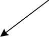

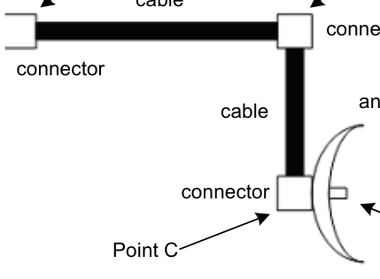

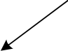

**Access Point** **Point A  Point B  Point C  Point D**
100 mW -3 dB   -3 dB    -3 dB +12 dBi
= 100 mW ÷2 ÷2     ÷2 (x2 x2 x2 x2)
= 100 mW ÷2       ÷2     ÷2 x16
= 50 mW ÷2     ÷2 x16
= 25 mW ÷2 x16
= 12.5 mW x16
= 200 mW

**Accurate Measurements**

Although these techniques are helpful and expedient in some situations, there are times
when rounded or even numbers may not be available. In these times, using the formula is
the best method of doing RF calculations. Since the decibel is a unit of relative power
measurement, a change in power level is implied. If the power level is given in dBm,
then change in dB is simple to calculate:

Initial power = 20 dBm
Final power = 33 dBm
Change in power, ∆P = 33 – 20 = +13 dB, the value is positive, indicating an
increase in power.

If the power levels are given in milliwatts, the process can become more complicated:

Initial power = 130 mW
Final power = 5.2 W
Change in power,

CWNA Study Guide © Copyright 2002 Planet3 Wireless, Inc.

--- end of page=63 ---

Chapter 2 – RF Fundamentals **36**


∆ _P_ = 10 log []

 _Pf_ 

 []  []
 _Pi_ 

_f_

_i_

_P_ = 10 log _Pf_

 []

_P_

 []


10 log

 5.2 _W_ 
= 10 log 
 130 _mW_ 

 5.2

10 log

 130

10 log 40
10 ∗1.6
16dB

_W_
_mW_

= 10
= 10 ∗
= 16

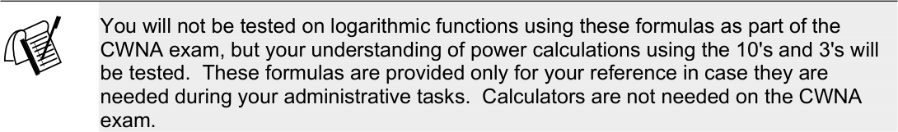

CWNA Study Guide © Copyright 2002 Planet3 Wireless, Inc.

--- end of page=64 ---

**37** Chapter 2 – RF Fundamentals

##### Key Terms

Before taking the exam, you should be familiar with the following terms:

_antenna_

_impedance_

_Line of sight_

_logarithm_

CWNA Study Guide © Copyright 2002 Planet3 Wireless, Inc.

--- end of page=65 ---

Chapter 2 – RF Fundamentals **38**

##### Review Questions

1. When visual line of sight (LOS) is present, RF LOS will always be present.

A. This statement is always true

B. This statement is always false

C. It depends on the configuration of the antennas

2. When RF LOS is present, visual LOS will always be present.

A. This statement is always true

B. This statement is always false

C. It depends on the specific factors

3. What unit of measurement is used to quantify the power gain or loss of an RF
signal? Choose all that apply.

A. dBi

B. dBm

C. Watts

D. dB

4. Using which of the following will reduce VSWR? Choose all that apply.

A. Cables and connectors that all have an impedance of 50 Ohms

B. Cables with a 50 Ohm impedance and connectors with 75 Ohm impedance

C. Cables and connectors that all have an impedance of 75 Ohms

D. Cables with 75 Ohm impedance and connectors with 50 Ohm impedance

5. In an RF circuit, what is the intentional radiator defined as?

A. The output of the transmitting device

B. The output of the last connector before the signal enters the antenna

C. The output as measured at the antenna element

D. The output after the first length of cable attached to the transmitting device

CWNA Study Guide © Copyright 2002 Planet3 Wireless, Inc.

--- end of page=66 ---

**39** Chapter 2 – RF Fundamentals

6. _dBi_ is a relative measurement of decibels to which one of the following?

A. Internet

B. Intentional radiator

C. Isotropic radiator

D. Isotropic radio

7. Which one of the following is considered impedance in an RF circuit?

A. The inability to transmit RF signals

B. Interference of an RF signal during foul weather

C. Resistance to current flow, measured in Ohms

D. The frequency on which an RF transmitter sends signals

8. In RF mathematics, 1 watt equals what measurement of dBm?

A. 1

B. 3

C. 10

D. 30

E. 100

9. Which one of the following RF behaviors is defined as “the bending of a wave as it
passes through a medium of different density”?

A. Diffraction

B. Reflection

C. Refraction

D. Distraction

CWNA Study Guide © Copyright 2002 Planet3 Wireless, Inc.

--- end of page=67 ---

Chapter 2 – RF Fundamentals **40**

10. A year ago, while working for your current organization, you installed a wireless
link between two buildings. Recently you have received reports that the throughput
of the link has decreased. After investigating the connection problems, you discover
there is a tree within the Fresnel Zone of the link that is causing 25% blockage of the
connection. Which of the following statements are true? Choose all that apply.

A. The tree cannot be the problem, because only 25% of the connection is blocked

B. The tree might be the problem, because up to 40% of the Fresnel Zone can be
blocked without causing problems

C. If the tree is the problem, raising the heights of both antennas will fix the
problem

D. If the tree is the problem, increasing the power at the transmitters at each end of
the link will fix the problem

11. Given an access point with 100 mW of output power connected through a 50-foot
cable with 3 dB of loss to an antenna with 10 dBi of gain, what is the EIRP at the
antenna in mW?

A. 100 mW

B. 250 mW

C. 500 mW

D. 1 W

12. Given a wireless bridge with 200 mW of output power connected through a 100 foot
cable with 6 dB of loss to an antenna with 9 dBi of gain, what is the EIRP at the
antenna in dBm?

A. 20 dBm

B. 26 dBm

C. 30 dBm

D. 36 dBm

13. Given an access point with an output power of 100 mW connected through a cable
with a loss of 2 dB to antenna with a gain of 11 dBi, what is the EIRP in mW?

A. 200 mW

B. 400 mW

C. 800 mW

D. 1 W

CWNA Study Guide © Copyright 2002 Planet3 Wireless, Inc.

--- end of page=68 ---

**41** Chapter 2 – RF Fundamentals

14. Given an access point with an output power of 20 dBm connected through a cable
with a loss of 6 dB to an amplifier with a 10 dB gain, then through a cable with 3 dB
of loss to an antenna with 6 dBi of gain, what is the EIRP in dBm?

A. 18 dBm

B. 23 dBm

C. 25 dBm

D. 27 dBm

15. What is the net gain or loss of a circuit if it is using two cables with 3 dB loss each,
one amplifier with a 12 dB gain, 1 antenna with 9 dBi gain, and an attenuator with a
loss of 5 dB?

A. 5 dB

B. 10 dB

C. 15 dB

D. 20 dB

16. Which of the following is a cause of VSWR?

A. Mismatched impedances between wireless LAN connectors

B. Too much power being radiated from the antenna element

C. The incorrect type of antenna used to transmit a signal

D. Use of the incorrect RF frequency band

17. Radio waves propagate (move) away from the source (the antenna) in what manner?

A. In a straight line in all directions at once within the vertical and horizontal
beamwidths

B. In circles spiraling away from the antenna

C. In spherical, concentric circles within the horizontal beamwidth

D. Up and down across the area of coverage

18. Why is the Fresnel Zone important to the integrity of the RF link?

A. The Fresnel Zone defines the area of coverage in a typical RF coverage cell

B. The Fresnel Zone must always be 100% clear of any and all blockage for a
wireless LAN to operate properly

C. The Fresnel Zone defines an area around the LOS that can introduce RF signal
interference if blocked

D. The Fresnel Zone does not change with the length of the RF link

CWNA Study Guide © Copyright 2002 Planet3 Wireless, Inc.

--- end of page=69 ---

Chapter 2 – RF Fundamentals **42**

19. The FCC allows how many watts of power to be radiated from an antenna in a pointto-multipoint wireless LAN connection using unlicensed 2.4 GHz spread spectrum
equipment?

A. 1 watt

B. 2 watts

C. 3 watts

D. 4 watts

20. In regards to gain and loss measurements in wireless LANs, the statement that gains
and losses are additive is:

A. Always true

B. Always false

C. Sometimes true

D. Sometimes false

E. It depends on the equipment manufacturer

CWNA Study Guide © Copyright 2002 Planet3 Wireless, Inc.

--- end of page=70 ---

**43** Chapter 2 – RF Fundamentals

##### Answers to Review Questions

1. B. In order to have RF LOS, the Fresnel Zone must be clear. Having a clear visual
line of sight between two points does not necessarily mean that your Fresnel Zone is
clear. The radius of the Fresnel Zone can be calculated with a simple formula.

2. C. Due to weather, smog, or distance, the person configuring the RF link may not
be able to see the other end, yet because there is nothing in the Fresnel Zone
interfering with the RF signal, the link works fine.

3. A, D. Power gain or loss is a change in power, not an absolute amount of power.
For this reason, dB and dBi are correct because they are measurements of a change
in power.

4. A, C. It's important in keeping VSWR to a minimum that all devices in an RF
system be impedance-matched. This means that all devices in the system must be 50
ohms, 75 ohms, or whatever impedance is being used, just so that all devices match.

5. B. The FCC defines the Intentional Radiator as the input power to the antenna. This
definition means that the power output of the transmitter, plus all cabling,
connectors, splitters, amplifiers, and attenuators before the antenna is included as
part of Intentional Radiator.

6. C. There's no such thing as the perfect antenna, yet that's exactly what an isotropic
radiator is. An isotropic radiator radiates power evenly in all directions (a spherical
pattern). Omni-directional antennas have a doughnut-shaped coverage pattern that
has gain relative to an isotropic radiator due to the squeezing of the RF field. All
antennas are referenced against this imaginary antenna for quantifiable
measurement.

7. C. Impedance (measured in Ohms) is a resistance to current flow in any electrical
circuit. RF signals are high-frequency alternating current (AC) and experience loss
due to resistance while in a copper conductor such as cabling.

8. D. The mathematical reference point most commonly used with wireless LANs is 0
dBm = 1 mW. Using the simple calculation of adding 30 dB, we can quickly see
that 1 watt = 30 dBm.

9. C. Refraction of RF waves works similarly to visible light bending as it passes from
air into water. Be careful not to confuse refraction and diffraction.

10. B, C. Raising the antennas on each end will fix the problem, but what happens in
another year when the tree has grown again? This is only a short-term fix. Turning
up the power will not always solve the problem since the problem may be
retransmissions due to packet errors instead of decreased signal amplitude.
Trimming the tree as a test, and then cutting it down if it is the problem is the
solution to this problem.

11. C. 100 mW with a 3 dB loss results in 50 mW of output power remaining because a
3 dB loss cuts the power in half. A gain of 10 dBi will multiply the remaining
power of 50 mW by a factor of 10 yielding 500 mW of output power at the antenna
element (referred to as EIRP).

12. B. Converting 200 mW to dBm, we see that we start out with 23 dBm. From this
point, it's a simple addition/subtraction problem. 23 dBm - 6 dB + 9 dBi = 26 dBm.

CWNA Study Guide © Copyright 2002 Planet3 Wireless, Inc.

--- end of page=71 ---

Chapter 2 – RF Fundamentals **44**

13. C. Starting with 100 mW of output power, and not being able to use the 10's and 3's,
we have a more complex math problem. A trick here is to first realize that gains and
losses are additive so a 2 dB loss and an 11 dBi gain equals 9 dB of change.
Luckily, 9 dB is divisible by 3, so we have 100 x 2 x 2 x 2 = 800 mW of output
power at the antenna (EIRP).

14. D. This question is a simple addition/subtraction problem from start to finish. 20
dBm - 6 dB + 10 dB - 3 dB + 6 dBi = 27 dBm. It starts and ends with absolute
amounts of power, but adds and subtracts changes in power along the way.

15. B. Instead of the usual question that begins and ends with an absolute amount of
power (measured in mW or dBm), this question is testing your understanding of the
additive nature of power change. -3 dB - 3 dB + 12 dB -3 dB +9 dBi - 5 dB yields a
combined power change of +10 dB.

16. A. Having mismatched impedances between any two devices in a system can cause
VSWR at that point of connection. This concept applies to cables, connectors, the
output circuit of the transmitter, the input circuit of the receiver, the antenna, and
any other device in the system.

17. A. The angles of the horizontal and vertical beamwidth determine exactly what
direction the RF waves will propagate from the antenna. Waves propagate within
these angles in all directions simultaneously.

18. C. The Fresnel Zone is an area around the direct path between the transmitter and
the receiver that must be mostly clear (60-80%) in order to avoid RF signal
interference. Trees, buildings, and many other objects tend to get into the Fresnel
Zone of long-distance RF links. It's important to try to keep the Fresnel Zone as
clear as possible. There is a simple formula for calculating the radius of the Fresnel
Zone.

19. D. The FCC defines EIRP as the output from the antenna. EIRP in a point-tomultipoint configuration (which includes any configuration using an omnidirectional antenna) is limited to 4 watts by the FCC.

20. A. Gains and losses in a wireless LAN systems are always additive. Sometimes this
means adding in negative numbers (losses) and sometimes the numbers are positive
(gain). As you've seen in some of the practice questions in this section, gain and
loss can be calculated by adding all gains and losses in a system.

CWNA Study Guide © Copyright 2002 Planet3 Wireless, Inc.

--- end of page=72 ---
