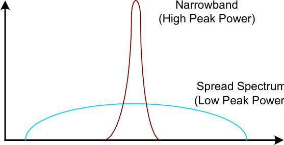
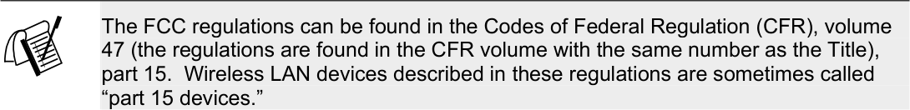
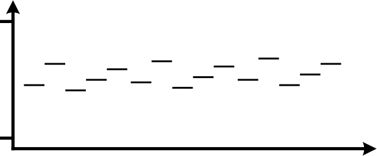
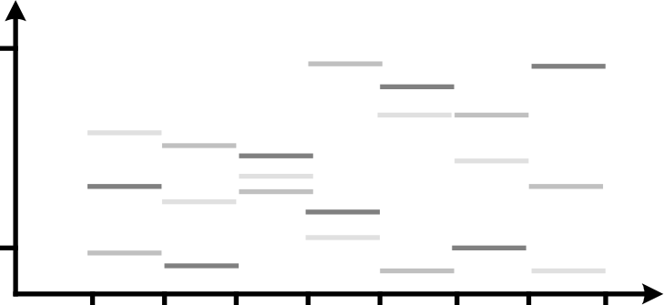
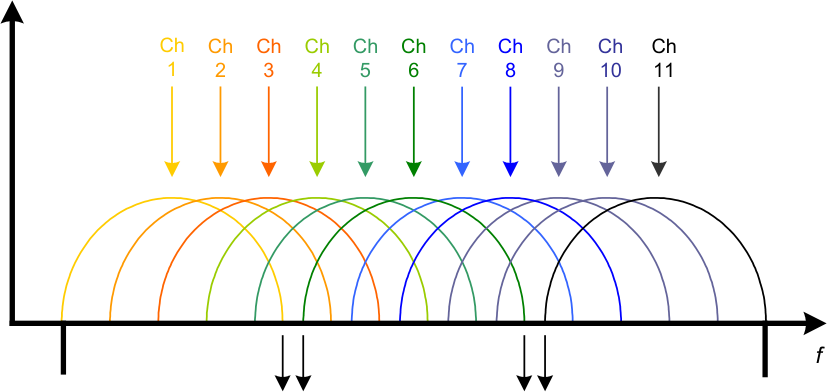
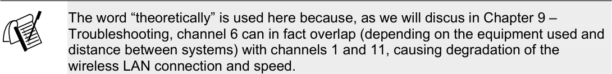
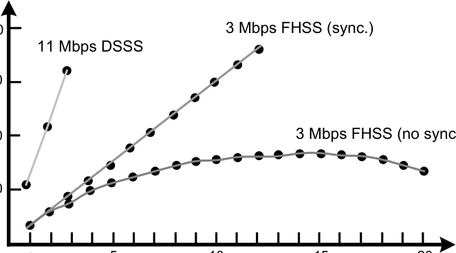
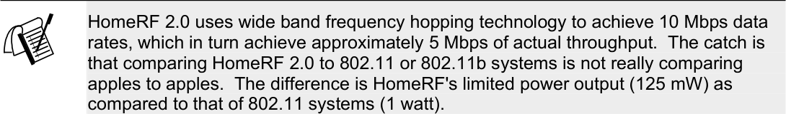

# Chapter 3 - Spread Spectrum Technology

_PDF pages 74-99_

##### Spread Spectrum Technology

**CWNA Exam Objectives Covered:**

- Identify some of the different uses for spread spectrum
technologies:

 - Wireless LANs

 - Wireless PANs

 - Wireless WANs

- Comprehend the differences between, and apply the
different types of spread spectrum technologies:

 - FHSS

 - DSSS

- Identify and apply the concepts which make up the
functionality of spread spectrum technology:

 - Co-location

 - Channels

 - Dwell time

 - Throughput

 - Hop time

CWNA Study Guide © Copyright 2002 Planet3 Wireless, Inc.

**CHAPTER**
# 5 3

**In This Chapter**

Spread Spectrum
Introduction

Frequency Hopping (FHSS)

Direct Sequence (DSSS)

Comparing FHSS to DSSS

--- end of page=73 ---

Chapter 3 – Spread Spectrum Technology **46**

In order to administer and troubleshoot wireless LANs effectively, a good understanding
of spread spectrum technology and its implementation is required. In this section, we
will cover what spread spectrum technology is and how it is used according to FCC
guidelines. We will differentiate and compare the two main spread spectrum
technologies and discuss, in depth, how spread spectrum technology is implemented in
wireless LANs.

##### Introducing Spread Spectrum

Spread spectrum is a communications technique characterized by wide bandwidth and
low peak power.  Spread spectrum communication uses various modulation techniques
in wireless LANs and possesses many advantages over its precursor, narrow band
communication. Spread spectrum signals are noise-like, hard to detect, and even harder
to intercept or demodulate without the proper equipment. Jamming and interference have
a lesser affect on a spread spectrum communication than on narrow band
communications. For these reasons, spread spectrum has long been a favorite of the
military. In order to discuss what spread spectrum is we must first establish a reference
by discussing the concept of narrowband transmission.

**Narrow Band Transmission**

A narrowband transmission is a communications technology that uses only enough of the
frequency spectrum to carry the data signal, and no more. It has always been the FCC's
mission to conserve frequency usage as much as possible, handing out only what is
absolutely necessary to get the job done. Spread spectrum is in opposition to that mission
since it uses much wider frequency bands than is necessary to transmit the information.
This brings us to the first requirement for a signal to be considered spread spectrum. A
signal is a spread spectrum signal when _the bandwidth is much wider than what is_
_required to send the information_ .

Figure 3.1 illustrates the difference between narrowband and spread spectrum
transmissions. Notice that one of the characteristics of narrow band is high peak power.
More power is required to send a transmission when using a smaller frequency range. In
order for narrow band signals to be received, they must stand out above the general level
of noise, called the _noise floor_, by a significant amount. Because its band is so narrow, a
high peak power ensures error-free reception of a narrow band signal.

CWNA Study Guide © Copyright 2002 Planet3 Wireless, Inc.

--- end of page=74 ---

**47** Chapter 3 – Spread Spectrum Technology

**FIGURE 3.1** Narrow band vs. spread spectrum on a frequency domain

**P**

**f**

A compelling argument against narrowband transmission—other than the high peak
power required to send it—is that narrow band signals can be jammed or experience
interference very easily. Jamming is the intentional overpowering of a transmission
using unwanted signals transmitted on the same band. Because its band is so narrow,
other narrow band signals, including noise, can completely eliminate the information by
overpowering a narrowband transmission, much like a passing train overpowers a quiet
conversation.

**Spread Spectrum Technology**

Spread spectrum technology allows us to take the same amount of information that we
previously would have sent using a narrow band carrier signal and spread it out over a
much larger frequency range. For example, we may use 1 MHz at 10 Watts with narrow
band, but 20 MHz at 100 mW with spread spectrum. By using a wider frequency
spectrum, we reduce the probability that the data will be corrupted or jammed. A narrow
band jamming attempt on a spread spectrum signal would likely be thwarted by virtue of
only a small part of the information falling into the narrow band signal's frequency range.
Most of the digital data would be received error-free. Today's spread spectrum RF radios
can retransmit any small amount of data loss due to narrowband interference.

While the spread spectrum band is relatively wide, the peak power of the signal is quite
low. This is the second requirement for a signal to be considered spread spectrum. For a
signal to be considered spread spectrum, it must use low power. These two
characteristics of spread spectrum (use of a wide band of frequencies and very low
power) make it look to most receivers as if it were a noise signal. Noise is a wide band,
low power signal, but the difference is that noise is unwanted. Furthermore, since most
radio receivers will view the spread spectrum signal as noise, these receivers will not
attempt to demodulate or interpret it, creating a slightly more secure communication.

CWNA Study Guide © Copyright 2002 Planet3 Wireless, Inc.

--- end of page=75 ---

Chapter 3 – Spread Spectrum Technology **48**

**Uses of Spread Spectrum**

This inherent security is what interested the military in spread spectrum technology
through the 1950s and 1960s. Because of its noise-like characteristics, spread spectrum
signals could be sent under the noses of enemies using classic communication techniques.
Security was all but guaranteed. Naturally, this perceived security of communication was
only valid so long as no one else used the technology. If another group were to use the
same technology, these spread spectrum communications could be discovered, if not
intercepted and decoded.

In the 1980s, the FCC implemented a set of rules making spread spectrum technology
available to the public and encouraging research and investigation into the
commercialization of spread spectrum technology. Though at first glance it may seem
that the military had lost its advantage, it had not. The bands used by the military are
different from the bands used by the public. Also, the military uses very different
modulation and encoding techniques to ensure that its spread spectrum communications
are far more difficult to intercept than those of the general public.

Since the 1980s, when research began in earnest, spread spectrum technologies have been
used in cordless phones, global positioning systems (GPS), digital cellular telephony
(CDMA), personal communications system (PCS), and now wireless local area networks
(wireless LANs). Amateur radio enthusiasts are now beginning to experiment with
spread spectrum technologies for many of the reasons we’ve discussed.

In addition to wireless LANs (WLANs), wireless personal area networks (WPANs),
wireless metropolitan area networks (WMANs), and wireless wide area networks
(WWANs) are also taking advantage of spread spectrum technologies. WPANs use
Bluetooth technology to take advantage of very low power requirements to allow wireless
networking within a very short range. WWANs and WMANs can use highly directional,
high gain antennas to establish long-distance, high-speed RF links with relatively low
power.

**Wireless Local Area Networks**

Wireless LANs, WMANs, and WWANs use the same spread spectrum technologies in
different ways. For example, a wireless LAN might be used within a building to provide
connectivity for mobile users, or bridges might be used to provide building-to-building
connectivity across a campus. These are specific uses of spread spectrum technology that
fit within the description of a Local Area Network (LAN).

The most common uses of spread spectrum technology today lie in a combination of
wireless 802.11 compliant LANs and 802.15 compliant Bluetooth devices. These two
technologies have captured a tremendous market share, so it is ironic that the two
function much differently, play within the same FCC rules, and yet interfere with each
other greatly. Considerable research, time, and resources have gone into making these
two technologies coexist peacefully.

CWNA Study Guide © Copyright 2002 Planet3 Wireless, Inc.

--- end of page=76 ---

**49** Chapter 3 – Spread Spectrum Technology

**Wireless Personal Area Networks**

Bluetooth, the most popular of WPAN technologies is specified by the IEEE 802.15
standard. The FCC regulations regarding spread spectrum use are broad, allowing for
differing types of spread spectrum implementations. Some forms of spread spectrum
introduce the concept of frequency hopping, meaning that the transmitting and receiving
systems hop from frequency to frequency within a frequency band transmitting data as
they go. For example, Bluetooth hops approximately 1600 times per second while
HomeRF technology (a wide band WLAN technology) hops approximately 50 times per
second. Both of these technologies vary greatly from the standard 802.11 WLAN, which
typically hops 5-10 times per second.

Each of these technologies has different uses in the marketplace, but all fall within the
FCC regulations. For example, a typical 802.11 frequency hopping WLAN might be
implemented as an enterprise wireless networking solution while HomeRF is only
implemented in home environments due to lower output power restrictions by the FCC.

**Wireless Metropolitan Area Networks**

Other spread spectrum uses, such as wireless links that span an entire city using highpower point-to-point links to create a network, fall into the category known as Wireless
Metropolitan Area Networks, or WMANs. Meshing many point-to-point wireless links
to form a network across a very large geographical area is considered a WMAN, but still
uses the same technologies as the WLAN.

The difference between a WLAN and a WMAN, if any, would be that in many cases,
WMANs use licensed frequencies instead of the unlicensed frequencies typically used
with WLANs. The reason for this difference is that the organization implementing the
network will have control of the frequency range where the WMAN is being
implemented and will not have to worry about the chance of someone else implementing
an interfering network. The same factors apply to WWANs.

**FCC Specifications**

Though there are many different implementations of spread spectrum technology, only
two types are specified by the FCC. The law specifies spread spectrum devices in Title
47, a collection of laws passed by congress under the heading “Telegraphs, Telephones,
and Radiotelegraphs.” These laws provide the basis for implementation and regulation
by the FCC.

These FCC regulations describe two spread spectrum technologies: _direct sequence_
_spread spectrum (DSSS)_ and _frequency hopping spread spectrum (FHSS)_ .

CWNA Study Guide © Copyright 2002 Planet3 Wireless, Inc.

--- end of page=77 ---

Chapter 3 – Spread Spectrum Technology **50**

##### Frequency Hopping Spread Spectrum (FHSS)

Frequency hopping spread spectrum is a spread spectrum technique that uses frequency
agility to spread the data over more than 83 MHz. Frequency agility refers to the radio’s
ability to change transmission frequency abruptly within the usable RF frequency band.
In the case of frequency hopping wireless LANs, the usable portion of the 2.4 GHz ISM
band is 83.5 MHz, per FCC regulation and the IEEE 802.11 standard.

**How FHSS Works**

In frequency hopping systems, the carrier changes frequency, or _hops_, according to a
pseudorandom sequence. The pseudorandom sequence is a list of several frequencies to
which the carrier will hop at specified time intervals before repeating the pattern. The
transmitter uses this hop sequence to select its transmission frequencies. The carrier will
remain at a certain frequency for a specified time (known as the _dwell time_ ), and then use
a small amount of time to hop to the next frequency ( _hop time_ ). When the list of
frequencies has been exhausted, the transmitter will repeat the sequence.

Fig. 3.2 shows a frequency hopping system using a hop sequence of five frequencies over
a 5 MHz band. In this example, the sequence is:

1. 2.449 GHz

2. 2.452 GHz

3. 2.448 GHz

4. 2.450 GHz

5. 2.451 GHz

**FIGURE 3.2** Single frequency hopping system

2.4835

2.4000

Elapsed Time

Once the radio has transmitted the information on the 2.451 GHz carrier, the radio will
repeat the hop sequence, starting again at 2.449 GHz. The process of repeating the
sequence will continue until the information is received completely.

CWNA Study Guide © Copyright 2002 Planet3 Wireless, Inc.

--- end of page=78 ---

**51** Chapter 3 – Spread Spectrum Technology

The receiver radio is synchronized to the transmitting radio's hop sequence in order to
receive on the proper frequency at the proper time. The signal is then demodulated and
used by the receiving computer.

**Effects of Narrow Band Interference**

Frequency hopping is a method of sending data where the transmission and receiving
systems hop along a repeatable pattern of frequencies together. As is the case with all
spread spectrum technologies, frequency hopping systems are resistant—but not
immune—to narrow band interference. In our example in Figure 3.2, if a signal were to
interfere with our frequency hopping signal on, say, 2.451 GHz, only that portion of the
spread spectrum signal would be lost. The rest of the spread spectrum signal would
remain intact, and the lost data would be retransmitted.

In reality, an interfering narrow band signal may occupy several megahertz of bandwidth.
Since a frequency hopping band is over 83 MHz wide, even this interfering signal will
cause little degradation of the spread spectrum signal.

**Frequency Hopping Systems**

It is the job of the IEEE to create standards of operation within the confines of the
regulations created by the FCC. The IEEE and OpenAir standards regarding FHSS
systems describe:

      - what frequency bands may be used

      - hop sequences

      - dwell times

      - data rates

The IEEE 802.11 standard specifies data rates of 1 Mbps and 2 Mbps and OpenAir (a
standard created by the now defunct Wireless LAN Interoperability Forum) specifies data
rates of 800 kbps and 1.6 Mbps. In order for a frequency hopping system to be 802.11 or
OpenAir compliant, it must operate in the 2.4 GHz ISM band (which is defined by the
FCC as being from 2.4000 GHz to 2.5000 GHz). Both standards allow operation in the
range of 2.4000 GHz to 2.4835 GHz.

**Channels**

A frequency hopping system will operate using a specified hop pattern called a _channel_ .
Frequency hopping systems typically use the FCC’s 26 standard hop patterns or a subset
thereof. Some frequency hopping systems will allow custom hop patterns to be created,

CWNA Study Guide © Copyright 2002 Planet3 Wireless, Inc.

--- end of page=79 ---

Chapter 3 – Spread Spectrum Technology **52**

and others even allow synchronization between systems to completely eliminate
collisions in a co-located environment.

**FIGURE 3.3** Co-located frequency hopping systems

2.4835

2.4000

200 400 600 800 1000 1200 1400 1600
Elapsed Time in Milliseconds (ms)

Channel 1 Channel 2 Channel 78

Though it is possible to have as many as 79 synchronized, co-located access points, with
this many systems, each frequency hopping radio would require precise synchronization
with all of the others in order not to interfere with (transmit on the same frequency as)
another frequency hopping radio in the area. The cost of such a set of systems is
prohibitive and is generally not considered an option. If synchronized radios are used,
the expense tends to dictate 12 co-located systems as the maximum.

If non-synchronized radios are to be used, then 26 systems can be co-located in a wireless
LAN; this number is considered to be the maximum in a medium-traffic wireless LAN.
Increasing the traffic significantly or routinely transferring large files places the practical
limit on the number of co-located systems at about 15. More than 15 co-located
frequency-hopping systems in this environment will interfere to the extent that collisions
will begin to reduce the aggregate throughput of the wireless LAN.

**Dwell Time**

When discussing frequency hopping systems, we are discussing systems that must
transmit on a specified frequency for a time, and then hop to a different frequency to
continue transmitting. When a frequency hopping system transmits on a frequency, it
must do so for a specified amount of time. This time is called the _dwell time_ . Once the
dwell time has expired, the system will switch to a different frequency and begin to
transmit again.

Suppose a frequency hopping system transmits on only two frequencies, 2.401 GHz and
2.402 GHz. The system will transmit on the 2.401 GHz frequency for the duration of the
dwell time—100 milliseconds (ms), for example. After 100ms the radio must change its
transmitter frequency to 2.402 GHz and send information at that frequency for 100ms.

CWNA Study Guide © Copyright 2002 Planet3 Wireless, Inc.

--- end of page=80 ---

**53** Chapter 3 – Spread Spectrum Technology

Since, in our example, the radio is only using 2.401 and 2.402 GHz, the radio will hop
back to 2.401 GHz and begin the process over again.

**Hop Time**

When considering the hopping action of a frequency hopping radio, dwell time is only
part of the story. When a frequency hopping radio jumps from frequency A to frequency
B, it must change the transmit frequency in one of two ways. It either must switch to a
different circuit tuned to the new frequency, or it must change some element of the
current circuit in order to tune to the new frequency. In either case, the process of
changing to the new frequency must be complete before transmission can resume, and
this change takes time due to electrical latencies inherent in the circuitry. There is a
small amount of time during this frequency change in which the radio is not transmitting
called the _hop time_ . The hop time is measured in microseconds (µs) and with relatively
long dwell times of around 100-200 ms, the hop time is not significant. A typical 802.11
FHSS system hops between channels in 200-300 µs.

With very short dwell times of 500 – 600µs, like those being used in some frequency
hopping systems such as Bluetooth, hop time can become very significant. If we look at
the effect of hop time in terms of data throughput, we discover that the longer the hop
time in relation to the dwell time, the slower the data rate of bits being transmitted.

This translates roughly to _longer dwell time = greater throughput_ .

**Dwell Time Limits**

The FCC defines the maximum dwell time of a frequency hopping spread spectrum
system at 400 ms per carrier frequency in any 30 second time period. For example, if a
transmitter uses a frequency for 100 ms, then hops through the entire sequence of 75 hops
(each hop having the same 100 ms dwell time) returning to the original frequency, it has
expended slightly over 7.5 seconds in this hopping sequence. The reason it is not exactly
7.5 seconds is due to hop time. Hopping through the hop sequence four consecutive
times would yield 400 ms on each of the carrier frequencies during this timeframe of just
barely over 30 seconds (7.5 seconds x 4 passes through the hop sequence) which is
allowable by FCC rules. Other examples of how a FHSS system might stay within the
FCC rules would be a dwell time of 200 ms passing through the hop sequence only twice
in 30 seconds or a dwell time of 400 ms passing through the hop sequence only once in
30 seconds. Any of these scenarios are perfectly fine for a manufacturer to implement.
The major difference between each of these scenarios is how hop time affects throughput.
Using a dwell time of 100 ms, 4 times as many hops must be made as when using a 400
ms dwell time. This additional hopping time decreases system throughput.

Normally, frequency hopping radios will not be programmed to operate at the legal limit;
but instead, provide some room between the legal limit and the actual operating range in
order to provide the operator with the flexibility of adjustment.  By adjusting the dwell
time, an administrator can optimize the FHSS network for areas where there is either
considerable interference or very little interference. In an area where there is little
interference, longer dwell time, and hence greater throughput, is desirable. Conversely,
in an area where there is considerable interference and many retransmissions are likely
due to corrupted data packets, shorter dwell times are desirable.

CWNA Study Guide © Copyright 2002 Planet3 Wireless, Inc.

--- end of page=81 ---

Chapter 3 – Spread Spectrum Technology **54**

**FCC Rules affecting FHSS**

On August 21, 2000, the FCC changed the rules governing how FHSS can be
implemented. The rule changes allowed frequency hopping systems to be more flexible
and more robust. The rules are typically divided into “pre- 8/31/2000” rules and “post8/31/2000” rules, but the FCC allows for some decision-making on the part of the
manufacturer or the implementer. If a manufacturer creates a frequency hopping system
today, the manufacturer may use either the “pre- 8/31/2000” rules or the “post8/31/2000” rules, depending on his needs. If the manufacturer decides to use the “post8/31/2000” rules, then the manufacturer will be bound by all of these rules. Conversely,
if using the "pre- 8/31/2000” rules, the manufacturer will be bound by that set of rules. A
manufacturer cannot use some provisions from the “pre- 8/31/2000” rules and mix them
with other provisions of the “post- 8/31/2000” rules.

Prior to 8/31/00, FHSS systems were mandated by the FCC (and the IEEE) to use at least
75 of the possible 79 carrier frequencies in a frequency hop set at a maximum output
power of 1 Watt at the intentional radiator. Each carrier frequency is a multiple of 1
MHz between 2.402 GHz and 2.480 GHz. This rule states that the system must hop on
75 of the 79 frequencies before repeating the pattern.

This rule was amended on 8/31/00 to state that only 15 hops in a set were required, but
other changes ensued as well. For example, the maximum output power of a system
complying with these new rules is 125 mW and can have a maximum of 5 MHz of carrier
frequency bandwidth. Remember, with an increase in bandwidth for the same
information, less peak power is required. As further explanation of this rule change,
though not exactly in the same wording used by the FCC regulation, the number of hops
multiplied times the bandwidth of the carrier had to equal a total span of at least 75 MHz.
For example, if 25 hops are used, a carrier frequency only 3 MHz wide is required, or if
15 hops are used, a carrier frequency 5 MHz wide (the maximum) must be used. It is
important to note that systems may comply with either the pre- 8/31/00 rule or the post8/31/00 rule, but no mixing or matching of pieces of each rule is allowed.

No overlapping frequencies are allowed under either rule. If the minimum 75 MHz of
used bandwidth within the frequency spectrum were cut into pieces as wide as the carrier
frequency bandwidth in use, they would have to sit side-by-side throughout the spectrum
with no overlap. This regulation translates into 75 non-overlapping carrier frequencies
under the pre- 8/31/00 rules and 15-74 non-overlapping carrier frequencies under the
post- 8/31/00 rules.

The IEEE states in the 802.11 standard that FHSS systems will have at least 6 MHz of
carrier frequency separation between hops. Therefore, a FHSS system transmitting on
2.410 GHz must hop to at least 2.404 if decreasing in frequency or 2.416 if increasing in
frequency. This requirement was left unchanged by the IEEE after the FCC change on
8/31/00.

The pre- 8/31/00 FCC rules concerning FHSS systems allowed a maximum of 2 Mbps by
today's technology. By increasing the maximum carrier bandwidth from 1 MHz to 5
MHz, the maximum data rate was increased to 10 Mbps.

CWNA Study Guide © Copyright 2002 Planet3 Wireless, Inc.

--- end of page=82 ---

**55** Chapter 3 – Spread Spectrum Technology

##### Direct Sequence Spread Spectrum (DSSS)

Direct sequence spread spectrum is very widely known and the most used of the spread
spectrum types, owing most of its popularity to its ease of implementation and high data
rates. The majority of wireless LAN equipment on the market today uses DSSS
technology. DSSS is a method of sending data in which the transmitting and receiving
systems are both on a 22 MHz-wide set of frequencies. The wide channel enables
devices to transmit more information at a higher data rate than current FHSS systems.

**How DSSS Works**

DSSS combines a data signal at the sending station with a higher data rate bit sequence,
which is referred to as a _chipping code_ or _processing gain_ . A high processing gain
increases the signal’s resistance to interference. The minimum linear processing gain that
the FCC allows is 10, and most commercial products operate under 20. The IEEE 802.11
working group has set their minimum processing gain requirements at 11.

The process of direct sequence begins with a carrier being modulated with a code
sequence. The number of “chips” in the code will determine how much spreading occurs,
and the number of chips per bit and the speed of the code (in chips per second) will
determine the data rate.

**Direct Sequence Systems**

In the 2.4 GHz ISM band, the IEEE specifies the use of DSSS at a data rate of 1 or 2
Mbps under the 802.11 standard. Under the 802.11b standard—sometimes called highrate wireless—data rates of 5.5 and 11 Mbps are specified.

IEEE 802.11b devices operating at 5.5 or 11 Mbps are able to communicate with 802.11
devices operating at 1 or 2 Mbps because the 802.11b standard provides for backward
compatibility. Users employing 802.11 devices do not need to upgrade their entire
wireless LAN in order to use 802.11b devices on their network.

A recent addition to the list of devices using direct sequence technology is the IEEE
802.11a standard, which specifies units that can operate at up to 54 Mbps. Unfortunately
for 802.11 and 802.11b device users, 802.11a is wholly incompatible with 802.11b
because it does not use the 2.4 GHz band, but instead uses the 5 GHz UNII bands.

For a short while this was a problem because many users wanted to take advantage of the
direct sequence technology delivering data rates of 54 Mbps, but did not want to incur the
cost of a complete wireless LAN upgrade. So recently the IEEE 802.11g standard was
approved to specify direct sequence systems operating in the 2.4 GHz ISM band that can
deliver up to 54 Mbps data rate. The 802.11g technology became the first 54 Mbps
technology that was backward compatible with 802.11 and 802.11b devices.

CWNA Study Guide © Copyright 2002 Planet3 Wireless, Inc.

--- end of page=83 ---

Chapter 3 – Spread Spectrum Technology **56**

**Channels**

Unlike frequency hopping systems that use hop sequences to define the channels, direct
sequence systems use a more conventional definition of channels. Each channel is a
contiguous band of frequencies 22 MHz wide, and 1 MHz carrier frequencies are used
just as with FHSS. Channel 1, for instance, operates from 2.401 GHz to 2.423 GHz
(2.412 GHz ± 11 MHz); channel 2 operates from 2.406 to 2.429 GHz (2.417 ± 11 MHz),
and so forth. Figure 3.4 illustrates this point.

**FIGURE 3.4** DSSS channel allocation and spectral relationship

_P_

2.401 GHz 3 3 2.473 GHz

MHz MHz

The chart in Figure 3.5 has a complete list of channels used in the United States and
Europe. The FCC specifies only 11 channels for non-licensed use in the United States.
We can see that channels 1 and 2 overlap by a significant amount. Each of the
frequencies listed in this chart are considered center frequencies. From this center
frequency, 11 MHz is added and subtracted to get the useable 22 MHz wide channel. It
is easy to see that adjacent channels (channels directly next to each other) would overlap
significantly.

CWNA Study Guide © Copyright 2002 Planet3 Wireless, Inc.

--- end of page=84 ---

**57** Chapter 3 – Spread Spectrum Technology

**FIGURE 3.5** DSSS channel frequency assignments

|Channel ID|FCC Channel Frequencies GHz|ETSI Channel Frequencies GHz|
|---|---|---|
|1|2.412|N/A|
|2|2.417|N/A|
|3|2.422|2.422|
|4|2.427|2.427|
|5|2.432|2.432|
|6|2.437|2.437|
|7|2.442|2.442|
|8|2.447|2.447|
|9|2.452|2.452|
|10|2.457|2.457|
|11|2.462|2.462|

To use DSSS systems with overlapping channels in the same physical space would cause
interference between the systems. DSSS systems with overlapping channels should not
be co-located because there will almost always be a drastic or complete reduction in
throughput. Because the center frequencies are 5 MHz apart and the channels are 22
MHz wide, channels should be co-located only if the channel numbers are at least five
apart: channels 1 and 6 do not overlap, channels 2 and 7 do not overlap, etc. There is a
maximum of three co-located direct sequence systems possible because channels 1, 6 and
11 are the only theoretically non-overlapping channels. The 3 non-overlapping channels
are illustrated in Figure 3.6

**FIGURE 3.6** DSSS non-overlapping channels

_P_

3 MHz

_f_

|22 MHz Channel 1|Col2|Channel 6 Channel 11|
|---|---|---|
||||

2.401 GHz 2.473 GHz

CWNA Study Guide © Copyright 2002 Planet3 Wireless, Inc.

--- end of page=85 ---

Chapter 3 – Spread Spectrum Technology **58**

**Effects of Narrow Band Interference**

Like frequency hopping systems, direct sequence systems are also resistant to narrow
band interference due to their spread spectrum characteristics. A DSSS signal is more
susceptible to narrow band interference than FHSS because the DSSS band is much
smaller (22 MHz wide instead of the 79 MHz wide band used by FHSS) and the
information is transmitted along the entire band simultaneously instead of one frequency
at a time. With FHSS, frequency agility and a wide frequency band ensures that the
interference is only influential for a small amount of time, corrupting only a small portion
of the data.

**FCC Rules affecting DSSS**

Just as with FHSS systems, the FCC has regulated that DSSS systems use a maximum of
1 watt of transmit power in point-to-multipoint configurations. The maximum output
power is independent of the channel selection, meaning that, regardless of the channel
used, the same power output maximum applies. This regulation applies to spread
spectrum in both the 2.4 GHz ISM band and the upper 5 GHz UNII bands (discussed in
Chapter 6).

##### Comparing FHSS and DSSS

Both FHSS and DSSS technologies have their advantages and disadvantages, and it is
incumbent on the wireless LAN administrator to give each its due weight when deciding
how to implement a wireless LAN. This section will cover some of the factors that
should be discussed when determining which technology is appropriate for your
organization, including:

      - Narrowband interference

      - Co-location

      - Cost

      - Equipment compatibility & availability

      - Data rate & throughput

      - Security

      - Standards support

**Narrowband Interference**

The advantages of FHSS include a greater resistance to narrow band interference. DSSS
systems may be affected by narrow band interference more than FHSS because of the use
of 22 MHz wide contiguous bands instead of the 79 MHz used by FHSS. This fact may
be a serious consideration if the proposed wireless LAN site is in an environment that has
such interference present.

CWNA Study Guide © Copyright 2002 Planet3 Wireless, Inc.

--- end of page=86 ---

**59** Chapter 3 – Spread Spectrum Technology

**Cost**

When implementing a wireless LAN, the advantages of DSSS may be more compelling
than those of FHSS systems, particularly when driven by a tight budget. The cost of
implementing a direct sequence system is far less than that of a frequency hopping
system. DSSS equipment is widely available in today’s marketplace, and its rapid
adoption has helped in driving down the cost. Only a few short years ago, equipment was
only affordable by enterprise customers. Today, very good quality 802.11b compliant PC
cards can be purchased for under $100. FHSS cards complying with either the 802.11 or
OpenAir standards typically run between $150 and $350 in today's market depending on
the manufacturer and the standards to which the cards adhere.

**Co-location**

An advantage of FHSS over DSSS is the ability for many more frequency hopping
systems to be co-located than direct sequence systems. Since frequency hopping systems
are “frequency agile” and make use of 79 discrete channels, frequency hopping systems
have a co-location advantage over direct sequence systems, which have a maximum colocation of 3 access points.

**FIGURE 3.7** Co-location comparison

Number of Co-located Systems

However, when calculating the hardware costs of an FHSS system to get the same
throughput as a DSSS system, the advantage quickly disappears. Because DSSS can
have 3 co-located access points, the maximum throughput for this configuration would
be:

3 access points x 11 Mbps = 33 Mbps

At roughly 50% of rated bandwidth, the DSSS system throughput would be
approximately:

33 Mbps / 2 = 16.5 Mbps

CWNA Study Guide © Copyright 2002 Planet3 Wireless, Inc.

--- end of page=87 ---

Chapter 3 – Spread Spectrum Technology **60**

To achieve roughly the same rated system bandwidth using an IEEE 802.11 compliant
FHSS system would require:

16 access points x 2 Mbps = 32 Mbps

At roughly 50% of rated bandwidth, the FHSS system throughput would be
approximately:

32 Mbps / 2 = 16 Mbps

In this configuration, an FHSS system would require 13 additional access points to be
purchased to get the same throughput as the DSSS system. Also, additional installation
services for these units, cables, connectors, and antennas would all need to be purchased.

As you can see, there are advantages to co-location for each type of system. If the
objectives are low cost and high throughput, clearly DSSS technology wins out. If
keeping users segmented using different access points in a dense co-location environment
is the objective, FHSS might be a viable alternative.

**Equipment compatibility and availability**

The Wireless Ethernet Compatibility Alliance (WECA) provides testing of 802.11b
compliant DSSS wireless LAN equipment to ensure that such equipment will operate in
the presence of and interoperate with other 802.11b DSSS devices. The interoperability
standard that WECA created and now uses is called Wireless Fidelity, or Wi-Fi™, and
those devices that pass the tests for interoperability are “Wi-Fi compliant” devices.
Devices so deemed are allowed to affix the Wi-Fi logo on the related marketing material
and devices themselves showing that they have been tested and interoperate with other
Wi-Fi compliant devices.

There are no such compatibility tests for equipment that uses FHSS. There are standards
such as 802.11 and OpenAir, but no organization has stepped forward to do the same
kind of compatibility testing for FHSS as WECA does for DSSS.

Due to the immense popularity of 802.11b compliant radios, it is much easier to obtain
these units. The demand seems only to be growing for the Wi-Fi compliant radios while
the demand for FHSS radios has remained fairly steady, even decreasing to some degree
over the past year.

**Data rate & throughput**

The latest frequency hopping systems are slower than the latest DSSS systems mostly
because their data rate is only 2 Mbps. Though some FHSS systems operate at 3 Mbps or
more, these systems are not 802.11 compliant and may not interoperate with other FHSS
systems. FHSS and DSSS systems have a throughput (data actually sent) of only about
half of the data rate. When testing the throughput of a new wireless LAN installation,
achieving 5 – 6 Mbps on the 11 Mbps setting for DSSS or 1 Mbps on the 2 Mbps setting
is common using DSSS.

CWNA Study Guide © Copyright 2002 Planet3 Wireless, Inc.

--- end of page=88 ---

**61** Chapter 3 – Spread Spectrum Technology

When wireless frames are transmitted, there are pauses between data frames for control
signals and other overhead tasks. With frequency hopping systems, this “interframe
spacing” is longer than that used by direct sequence systems, causing a slow-down in the
rate that data is actually sent (throughput). Additionally, when the frequency hopping
system is in the process of changing the transmit frequency, no data is sent. This
translates to more lost throughput, albeit only a minor amount. Some wireless LAN
systems use proprietary physical layer protocols in order to increase throughput. These
methods work, yielding throughputs as high as 80% of the data rate, but in so doing,
sacrifice interoperability.

**Security**

It is widely touted—and is a myth—that frequency hopping systems are inherently more
secure than direct sequence systems. The first fact that disproves this myth is that FHSS
radios are only produced by a minimal number of manufacturers. Of this small list of
manufacturers, all of them adhere to standards such as 802.11 or OpenAir in order to sell
their products effectively. Second, each of these manufacturers uses a standard set of hop
sequences, which generally comply with a pre-determined list, produced by the standards
body (IEEE or WLIF). These 2 items together make breaking the code of hop sequences
relatively simple.

Other reasons that make finding the hop sequence quite simple is that the channel number
is broadcasted in the clear with each beacon. Also, the MAC address of the transmitting
access point can be seen with each beacon (which indicates the manufacturer of the
radio). Some manufacturers allow the administrator the flexibility of defining custom
hopping patterns. However, even this custom capability is no level of security since
fairly unsophisticated devices such as spectrum analyzers and a standard laptop computer
can be used to track the hopping pattern of a FHSS radio in a matter of seconds.

**Standards Support**

As previously discussed, DSSS has gained wide acceptance due to low cost, high speed,
WECA's Wi-Fi interoperability standards, and many other factors. This market
acceptance will only accelerate due to the industry moving toward newer, faster DSSS
systems such as the new 802.11g and 802.11a compliant wireless LAN hardware.
WECA's new Wi-Fi5 interoperability standard for 5 GHz DSSS systems operating in the
UNII bands will help move the industry along even faster in the same direction it is
already headed. The new standards for FHSS systems include HomeRF 2.0 and 802.15
(in support of WPANs such as Bluetooth), but none for advancing FHSS systems in the
enterprise. All of these standards and technologies will be further discussed at in Chapter
6 (Organizations and Regulations).

CWNA Study Guide © Copyright 2002 Planet3 Wireless, Inc.

--- end of page=89 ---

Chapter 3 – Spread Spectrum Technology **62**

##### Key Terms

Before taking the exam, you should be familiar with the following terms:

_channel_

_chipping code_

_co-location_

_direct sequence_

_dwell time_

_frequency hopping_

_hop time_

_interoperability_

_narrow band_

_noise floor_

_processing gain_

_throughput_

CWNA Study Guide © Copyright 2002 Planet3 Wireless, Inc.

--- end of page=90 ---

**63** Chapter 3 – Spread Spectrum Technology

##### Review Questions

1. Increasing the dwell time for an FHSS system will increase the throughput.

A. This statement is always true

B. This statement is always false

C. It depends on the manufacturer of the equipment

2. Which one of the following dwell times will result in the greatest throughput in a
FHSS system and will still be within FCC regulations?

A. 100 ms

B. 200 ms

C. 300 ms

D. 400 ms

3. An 802.11b compliant wireless LAN configuration using DSSS can have a
maximum of ___ non-overlapping, co-located access points.

A. 3

B. 15

C. 26

D. 79

4. Consider the following two wireless LAN configurations:

System 1. IEEE 802.11 compliant FHSS system, 6 co-located access points running
at maximum data rate.

System 2. IEEE 802.11b compliant DSSS system, 3 co-located access points
running at 50% of maximum data rate.

Which one of the following statements is true?

A. System 1 will have more throughput

B. System 2 will have more throughput

C. System 1 and System 2 will have the same throughput

CWNA Study Guide © Copyright 2002 Planet3 Wireless, Inc.

--- end of page=91 ---

Chapter 3 – Spread Spectrum Technology **64**

5. Channels on direct sequence systems for 802.11b equipment are ___ MHz wide.

A. 5

B. 20

C. 22

D. 83

6. Which of the following are advantages of 802.11b DSSS over 802.11 FHSS?
Choose all that apply.

A. Cost

B. Throughput

C. Security

D. Resistance to narrowband interference

7. If having compatible equipment from different manufactures were an important
factor when purchasing wireless LAN equipment, which of the following spread
spectrum technologies would be the best choice?

A. FHSS

B. DSSS

8. The FCC has two sets of rules regarding FHSS that are known as before and after
which of the following dates?

A. 06/30/2000

B. 08/31/1999

C. 08/31/2000

D. 08/31/2001

9. The latest published FCC rules regarding power output for FHSS states a maximum
output of which one of the following?

A. 100 mW

B. 125 mW

C. 200 mW

D. 1 W

CWNA Study Guide © Copyright 2002 Planet3 Wireless, Inc.

--- end of page=92 ---

**65** Chapter 3 – Spread Spectrum Technology

10. The FCC specifies how many channels in the 2.4 GHz ISM band that can be used
for DSSS in the United States?

A. 3

B. 6

C. 9

D. 11

11. You have been hired on as a consultant to increase the capacity of an existing
wireless LAN based on FHSS technology. After your research is completed you
recommend that a replacement system based on DSSS would be better. Which of
the following could be your arguments to defend your position? Choose all that
apply.

A. The DSSS devices will cost less and have more throughput

B. The DSSS devices will cost more but have more throughput

C. Additional new FHSS devices may not be compatible with the older devices

D. DSSS is more secure than FHSS

12. The statement, “802.11b wireless LAN devices are backward compatible with
802.11 wireless LAN devices” is:

A. Always true

B. Always false

C. Sometimes true

13. What is considered to be the maximum number of co-located FHSS access points in
a wireless LAN, if non-synchronized radios are to be used?

A. 3

B. 16

C. 20

D. 26

14. In Frequency Hopping wireless LAN systems, the term _hopping_ refers to which one
of the following?

A. Switching between throughput speeds from 11 Mbps to 5.5 Mbps

B. What happens when the carrier frequency is changed

C. The change that occurs as a result of the RF signal getting weaker

D. Changing technologies from FHSS to DSSS

CWNA Study Guide © Copyright 2002 Planet3 Wireless, Inc.

--- end of page=93 ---

Chapter 3 – Spread Spectrum Technology **66**

15. A DSSS channel is more susceptible to narrowband interference than a FHSS
channel because of which of the following? Choose all that apply.

A. The DSSS channel is much smaller (22 MHz wide instead of the 79 MHz wide
band used by FHSS)

B. The information is transmitted along the entire band simultaneously instead of
one frequency at a time

C. FHSS systems simply avoid the frequency on which the narrowband
interference is located

D. FHSS systems only use one frequency at a time, so the narrowband interference
must be on the same exact frequency at the same time

16. The _noise floor_ is defined by which one of the following?

A. The general level of RF noise in the environment around the wireless LAN

B. The noise that is generated as a result of foot traffic

C. A fixed level of -100 dBm

D. The level of noise at which a wireless LAN starts working

17. Which one of the following is _not_ described by the IEEE and OpenAir standards
regarding FHSS systems?

A. What frequency bands may be used

B. Hop sequences

C. Allowable levels of interference

D. Dwell times

E. Data rates

18. An RF signal is considered spread spectrum when which of the following are true?
Choose all that apply.

A. The system sending the signal is using infrared technology

B. The power required to send the information is significantly greater than is
necessary

C. The bandwidth used is much wider than what is required to send the
information

D. The bandwidth used is much less than what is used to send the information

CWNA Study Guide © Copyright 2002 Planet3 Wireless, Inc.

--- end of page=94 ---

**67** Chapter 3 – Spread Spectrum Technology

19. Some 2.4 GHz FHSS systems operate at 3 Mbps or more. Which of the following is
true regarding these systems?

A. They are always IEEE 802.11 compliant

B. They may not interoperate with other FHSS systems

C. They are always OpenAir compliant

D. They are backwards compatible with 900 MHz systems

20. How many different types of implementations of spread spectrum technology does
the FCC specify for the 2.4 GHz ISM band?

A. 1

B. 2

C. 3

D. 4

CWNA Study Guide © Copyright 2002 Planet3 Wireless, Inc.

--- end of page=95 ---

Chapter 3 – Spread Spectrum Technology **68**

##### Answers to Review Questions

1. A. The dwell time is the time spent by a transmitter on a certain frequency actually
transmitting data. The longer a transmitter stays on a given frequency, the higher
the throughput of the system will be. Hopping between frequencies takes time and
takes away from the system throughput.

2. D. 400 ms is the legal limit on dwell time per the FCC. This dwell time is also the
most advantageous for systems with the goal of maximized throughput.

3. A. Using Direct Sequence technology within the 2.4 GHz ISM allows only three
non-overlapping channels within the 83.5 MHz allotted by the FCC. These channels
are 1, 6, & 11.

4. B. Six IEEE 802.11 compliant access points, synchronized to have absolutely no
collisions, would yield a maximum data rate of 12 Mbps because each system has a
maximum data rate of 2 Mbps. Three 802.11b compliant access points on nonoverlapping channels would yield a maximum data rate of 16.5 Mbps because each
system has a data rate of 5.5 Mbps (half of the maximum 11 Mbps). Since
throughput on each of these systems is approximately 50% of the data rate due to
overhead with the CSMA/CA protocol, the 802.11b systems would yield greater
throughput.

5. C. Channels on 802.11b compliant DSSS systems in the 2.4 GHz band are 22 MHz
wide. This is in contrast to those DSSS channels used by the 802.11a standard using
the 5 GHz UNII bands, which are each 20 MHz wide.

6. A, B. The 802.11b standard specifies rates up to 11 Mbps whereas the highest data
rate specified by the 802.11 standard is 2 Mbps. Therefore, the DSSS technology
specified in 802.11b is significantly faster than that of 802.11 FHSS. 802.11b
compliant hardware is often as little as 1/3 of the price of 802.11 FHSS hardware
offering a much better value to the average user. Security is implemented in both
standards in the same fashion, and FHSS has better resistance to narrowband
interference due to frequency diversity.

7. B. DSSS technologies have become amazingly popular with 802.11b Wi-Fi
compliant devices. FHSS devices have taken a back seat with 802.11 and OpenAir
standards losing popularity in comparison to IEEE's 802.11b and WECA's Wi-Fi
standards. Wi-Fi has become the de-facto standard in DSSS wireless LAN
equipment interoperability.

8. C. On 8/31/00, the FCC changed the rules regarding use of FHSS systems. Systems
manufactured to meet the new rules of 8/31/00 are referred to as using Wide Band
Frequency Hopping. These changes in rules are explained in detail in the FHSS
section.

9. B. With the FCC rules regarding FHSS equipment, a manufacturer could either
implement a piece of equipment to meet the old rules or the new rules. Under the
old rules, the maximum power output was 1 watt, but under the new rules, due to a
significant increase in carrier bandwidth, the power limit was changed to 125 mW.

10. D. There are 14 channels specified for use by the FCC and IEEE for spread
spectrum technologies in the 2.4 GHz ISM band. Of these, only 11 are allowed to
be used in the United States.

CWNA Study Guide © Copyright 2002 Planet3 Wireless, Inc.

--- end of page=96 ---

**69** Chapter 3 – Spread Spectrum Technology

11. A, C. Implementations of DSSS hardware meeting the 802.11b standard are both
fast and inexpensive. One problem that might be encountered with FHSS systems is
compatibility. There are two standards manufacturers can choose to use for creating
their hardware - 802.11 and OpenAir - but both are losing popularity. They are
incompatible standards and there is no organization performing OpenAir and 802.11
FHSS testing for interoperability. Buying two OpenAir FHSS systems is no
guarantee of interoperability.

12. C. The 802.11b standard supports DSSS devices only whereas 802.11 supports
DSSS and FHSS. This being the case, an administrator could have a situation where
there are 802.11 FHSS nodes and access points in place. Trying to add 802.11b
devices into the network will not work for clients that are using FHSS PCMCIA
cards. This would only work if the existing WLAN consists of 802.11 DSSS clients
and access points.

13. D. When synchronized radios are used, a maximum of 12 radios in a system is
currently available (no vendor currently has the ability to synchronize more than 12
radios). With unsynchronized radios, a recommended maximum of 15 radios should
be used for the best performance, but up to 26 radios can be used before collisions
hinder performance more than the throughput gain of adding another access point.

14. B. When a FHSS system hops, both the transmitter and receiver systems change the
carrier frequency in a synchronized fashion.

15. A, B, D. Frequency hopping systems use the entire useable range of the 2.4 GHz
ISM band with a range of 83.5 MHz whereas direct sequence systems use only a 22
MHz portion of the same frequency band. For this reason, the same narrowband
signal will disrupt the DSSS system more. Additionally, if the narrowband signal is
either intermittent or changes frequencies, the chance of it affecting FHSS is slim.

16. A. The noise floor is a mixture of all of the background RF radiation found in the
environment surrounding the system in use. The noise floor is generally in the -100
dBm area, but can be much higher or much lower depending on the environment.
RF signals must be higher than the noise floor to be detectible as a valid, useful
signal by a receiver. Spread spectrum systems are much closer to the noise floor
than are narrowband signals.

17. C. Both the OpenAir and 802.11 standards define all parameters necessary for
functioning of the equipment. These specifications include dwell times, data rates,
data rate fallback functionality, frequency hop patterns (channels), and the frequency
bands to be used. This is not a comprehensive list.

18. C. Spread spectrum transmitters spread a data signal out over a wide band of
frequencies using many symbols per bit for redundancy and using very low power.

19. B. FHSS systems that can transmit data at 3 Mbps may or may not have the ability
to slow their data rate to 2 or 1 Mbps, which is specified by the 802.11 standard.
These systems could comply with the IEEE standard if they could transmit at 2 & 1
Mbps or the OpenAir standard if they could transmit at 1.6 Mbps and 800 kbps.
While they are transmitting at other than these speeds, they are NOT compliant with
either standard.

20. B. The FCC specifies use of two types of spread spectrum technology in the 2.4
GHz ISM band. These types are Frequency Hopping and Direct Sequence.

CWNA Study Guide © Copyright 2002 Planet3 Wireless, Inc.

--- end of page=97 ---

--- end of page=98 ---
