# Chapter 4 - Infrastructure Devices

_PDF pages 100-131_

##### Wireless LAN Infrastructure Devices

**CWNA Exam Objectives Covered:**

- Identify the purpose of the following infrastructure devices and
explain how to install, configure, and manage them:

 - Access Points

 - Bridges

 - Workgroup Bridges

- Identify the purpose of the following wireless LAN client devices
and explain how to install, configure, and manage them:

 - PCMCIA Cards

 - Serial and Ethernet Converters

 - USB Devices

 - PCI/ISA Devices

- Identify the purpose of the following wireless LAN gateway
devices and explain how to install, configure, and manage them:

 - Residential Gateways

 - Enterprise Gateways

CWNA Study Guide © Copyright 2002 Planet3 Wireless, Inc.

CHAPTER CHAPTER
# 5 4

**In This Chapter**

Access Points

Bridges

Workgroup Bridges

Client Devices

Residential Gateways

Enterprise Gateways

--- end of page=99 ---

Chapter 4 – Wireless LAN Infrastructure Devices **72**

This chapter of the book may be the most important section of the book for you, the
CWNA candidate, to have access to at least some wireless LAN hardware. As mentioned
in previous chapters, you can purchase a basic home or SOHO wireless network for
under $400, including an access point, wireless PC Cards, and possibly a USB client.
Although with this type of equipment you won’t get hands-on experience with every
piece of hardware covered in this chapter, you will have a good idea of how the devices
communicate and otherwise behave using RF technology.

This chapter covers the different categories of wireless network infrastructure equipment
and some of the variations within each category. From reading this chapter alone, you
should be noticeably more versed in the actual implementation of wireless LANs, simply
by being aware of all the different kinds of wireless LAN equipment that you have at
your disposal when you begin to create or add to a wireless network. These hardware
items are the physical building blocks for any wireless LAN.

In general, we will cover each type of hardware in this section in a similar manner
according to the following topics:

      - Definition and role of the hardware on the network

      - Common options that might be included with the hardware

      - How to install and configure the hardware

The goal of this section of the book is to make you aware of all the types of hardware that
are available for the many varying wireless LAN configurations that you will encounter
as a wireless LAN administrator. Antennas and wireless LAN accessories are covered in
Chapter 5.

##### Access Points

Second only to the basic wireless PC card, the access point, or “AP”, is probably the most
common wireless LAN device with which you will work as a wireless LAN
administrator. As its name suggests, the access point provides clients with a point of
access into a network. An access point is a half-duplex device with intelligence
equivalent to that of a sophisticated Ethernet switch. Figure 4.1 shows an example of an
access point, while Figure 4.2 illustrates where an access point is used on a wireless
LAN.

CWNA Study Guide © Copyright 2002 Planet3 Wireless, Inc.

--- end of page=100 ---

**73** Chapter 4 – Wireless LAN Infrastructure Devices

**FIGURE 4.1** A sample access point

**FIGURE 4.2** An access point installed on a network

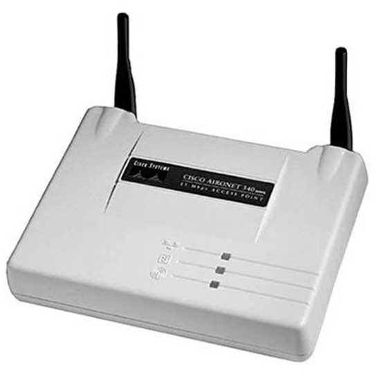

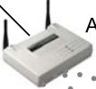

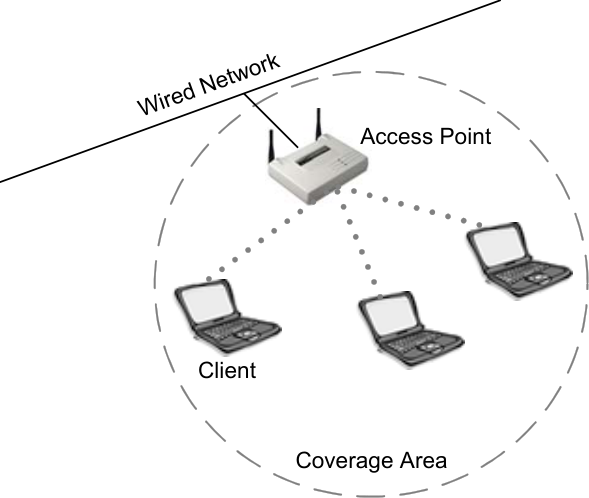

**Access Point Modes**

Access points communicate with their wireless clients, with the wired network, and with
other access points. There are three modes in which an access point can be configured:

     - Root Mode

     - Repeater Mode

     - Bridge Mode

Each of these modes is described below.

CWNA Study Guide © Copyright 2002 Planet3 Wireless, Inc.

--- end of page=101 ---

Chapter 4 – Wireless LAN Infrastructure Devices **74**

**Root Mode**

Root Mode is used when the access point is connected to a wired backbone through its
wired (usually Ethernet) interface. Most access points that support modes other than root
mode come configured in root mode by default. When an access point is connected to
the wired segment through its Ethernet port, it will normally be configured for root mode.
When in root mode, access points that are connected to the same wired distribution
system can talk to each other over the wired segment. Access points talk to each other to
coordinate roaming functionality such as reassociation. Wireless clients can
communicate with other wireless clients that are located in different cells through their
respective access points across the wired segment, as shown in Figure 4.3.

**FIGURE 4.3** An access point in root mode

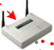

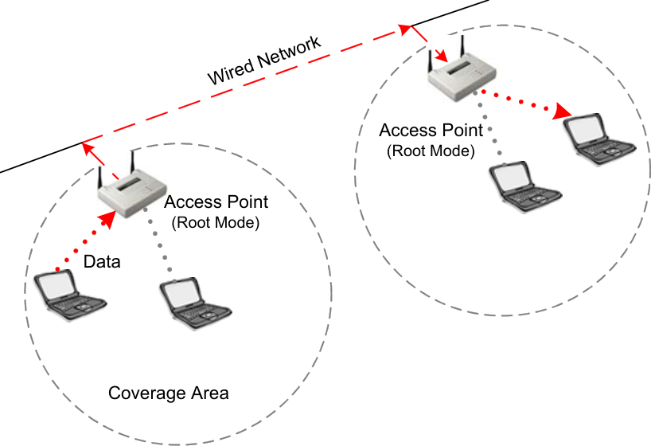

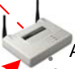

**Bridge Mode**

In bridge mode, access points act exactly like wireless bridges, which will be discussed
later in this chapter. In fact, they become wireless bridges while configured in this
manner. Only a small number of access points on the market have bridge functionality,
which typically adds significant cost to the equipment. We will explain shortly how
wireless bridges function, but you can see from Figure 4.4 that clients do not associate to
bridges, but rather, bridges are used to link two or more wired segments together
wirelessly.

CWNA Study Guide © Copyright 2002 Planet3 Wireless, Inc.

--- end of page=102 ---

**75** Chapter 4 – Wireless LAN Infrastructure Devices

**FIGURE 4.4** An access point in bridge mode

PC

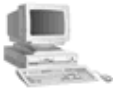

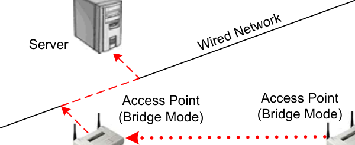

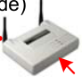

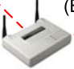

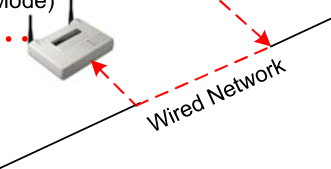

**Repeater Mode**

In repeater mode, access points have the ability to provide a wireless upstream link into
the wired network rather than the normal wired link. As you can see in Figure 4.5, one
access point serves as the root access point and the other serves as a wireless repeater.
The access point in repeater mode connects to clients as an access point and connects to
the upstream root access point as a client itself. Using an access point in repeater mode is
not suggested unless absolutely necessary because cells around each access point in this
scenario must overlap by a minimum of 50%. This configuration drastically reduces the
range at which clients can connect to the repeater access point. Additionally, the repeater
access point is communicating with the clients as well as the upstream access point over
the wireless link, reducing throughput on the wireless segment. Users attached to the
repeater access point will likely experience low throughput and high latencies in this
scenario. It is typical for the wired Ethernet port to be disabled while in repeater mode.

**FIGURE 4.5** An access point in repeater mode

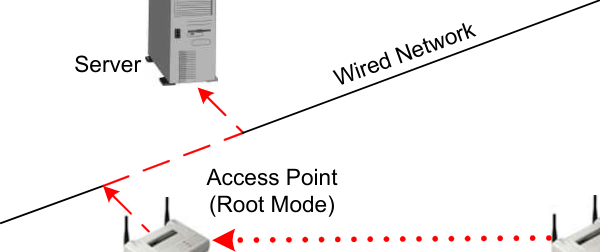

CWNA Study Guide © Copyright 2002 Planet3 Wireless, Inc.

Access Point

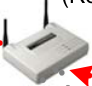

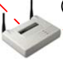

--- end of page=103 ---

Chapter 4 – Wireless LAN Infrastructure Devices **76**

**Common Options**

An access point is considered a portal because it allows client connectivity from an
802.11 network to 802.3 or 802.5 networks. Access points are available with many
different hardware and software options. The most common of these options are:

     - Fixed or Detachable Antennas

     - Advanced Filtering Capabilities

     - Removable (Modular) Radio Cards

     - Variable Output Power

     - Varied Types of Wired Connectivity

**Fixed or Detachable Antennas**

Depending on your organization or client’s needs, you will need to choose between
having an access point with fixed (meaning non-removable) antennas or detachable
antennas. An access point with detachable antennas gives you the ability to attach a
different antenna to the access point using whatever length of cable you require. For
example, if you needed to mount the access point inside, and give outdoor users access to
the network, you could attach a cable and an outdoor antenna directly to the access point
and mount only the antenna outside.

Access points may be shipped with or without diversity antennas. Wireless LAN antenna
diversity is the use of multiple antennas with multiple inputs on a single receiver in order
to sample signals arriving through each antenna. The point of sampling two antennas is
to pick the input signal of whichever antenna has the best reception. The two antennas
might have different signal reception because of a phenomenon called multipath, which
will be discussed in detail in Chapter 9.

**Advanced Filtering Capabilities**

MAC or protocol filtering functionality may be included on an access point. Filtering is
typically used to screen out intruders on your wireless LAN. As a basic security
provision (covered in Chapter 10 - Security), an access point can be configured to filter
out devices that are not listed in the access point’s MAC filter list, which the
administrator controls.

Protocol filtering allows the administrator to decide and control which protocols should
be used across the wireless link. For example, if an administrator only wishes to provide
http access across the wireless link so that users can browse the web and check their webbased email, then setting an http protocol filter would prevent all other types of protocol
access to that segment of the network.

CWNA Study Guide © Copyright 2002 Planet3 Wireless, Inc.

--- end of page=104 ---

**77** Chapter 4 – Wireless LAN Infrastructure Devices

**Removable (Modular) Radio Cards**

Some manufacturers allow you to add and remove radios to and from built-in PCMCIA
slots on the access point. Some access points may have two PCMCIA slots for special
functionality. Having two radio slots in an access point allows one radio card to act as an
access point while the other radio card is acting as a bridge (in most cases a wireless
backbone). Another somewhat dissimilar use is to use each radio card as an independent
access point.  Having each card act as an independent access point allows an
administrator to accommodate twice as many users in the same physical space without
the purchase of a second access point, further reducing costs. When the access point is
configured in this manner, each radio card should be configured on a non-overlapping
channel, ideally channels 1 and 11, respectively.

**Variable Output Power**

Variable output power allows the administrator to control the power (in milliwatts) that
the access point uses to send its data. Controlling the power output may become
necessary in some situations where distant nodes cannot locate the access point. It also
may simply be a luxury that allows you to control the area of coverage for the access
point. As the power output is increased on the access point, clients will be able to move
farther away from the access point without losing connectivity. This feature can also aid
in security by allowing for proper sizing of RF cells so that intruders cannot connect to
the network from outside the building’s walls.

The alternative to the variable output power feature is use of fixed output access points.
With a fixed output from the access point, creative measures such as amplifiers,
attenuators, long cables, or high-gain antennas may have to be implemented. Controlling
output power both from the access point and from the antenna is also important regarding
operation within FCC guidelines. We will discuss use of these items in Chapter 5,
Antennas and Accessories.

**Varied Types of Wired Connectivity**

Connectivity options for an access point can include a link for 10baseTx, 10/100baseTx,
100baseTx, 100baseFx, token ring, or others. Because an access point is typically the
device through which clients communicate with the wired network backbone, the
administrator must understand how to properly connect the access point into the wired
network. Proper network design and connectivity will help prevent the access point from
being a bottleneck and will result in far fewer problems due to malfunctioning equipment.

Consider using a standard, off-the-shelf access point for use in an enterprise wireless
LAN. If, in this case, the access point were to be located 150 meters from the nearest
wiring closet, running a category 5 (Cat5) Ethernet cable to the access point probably will
not work. This scenario would be a problem because Ethernet over Cat5 cable is only
specified to 100 meters. In this case, purchasing an access point that had a 100baseFx
connector and running fiber from the wiring closet to the access point mounting location
ahead of time would allow this configuration to function properly, and more easily.

CWNA Study Guide © Copyright 2002 Planet3 Wireless, Inc.

--- end of page=105 ---

Chapter 4 – Wireless LAN Infrastructure Devices **78**

**Configuration and Management**

The method or methods used to configure and manage access points will vary with each
manufacturer. Most brands offer at least console, telnet, USB, or a built-in web server
for browser access, and some access points will have custom configuration and
management software. The manufacturer configures the access point with an IP address
during the initial configuration. If the administrator needs to reset the device to factory
defaults, there will usually be a hardware reset button on the outside of the unit for this
purpose.

Features found in access points vary. However, one thing is constant: the more features
the access point has, the more the access point will cost. For example, some SOHO
access points will have WEP, MAC filters, and even a built-in web server. If features
such as viewing the association table, 802.1x/EAP support, VPN support, routing
functionality, Inter-access point protocol, and RADIUS support are required, expect to
pay several times as much for an enterprise-level access point.

Even features that are standard on Wi-Fi compliant access points sometimes vary in their
implementation. For example, two different brands of a SOHO access point may offer
MAC filters, but only one of them might offer MAC filtering where you can explicitly
permit _and_ explicitly deny stations, rather than only one or the other. Some access points
support full-duplex 10/100 wired connectivity whereas others offer only 10baseT half
duplex connectivity on the wired side.

Understanding what features to expect on a SOHO, mid-range, and enterprise-level
access points is an important part of being a wireless network administrator. Below is a
list of features to look for in SOHO and enterprise categories. This listing is by no means
comprehensive because manufacturers release new features frequently at each level. This
list is meant to provide an idea of where to start in looking for an appropriate access
point. These lists build upon each other beginning with the SOHO level access point,
meaning that every higher level includes the features of the layer below it.

**Small Office, Home Office (SOHO)**

     - MAC filters

     - WEP (64- or 128-bit)

     - USB or console configuration interface

     - Simple built-in web server configuration interface

     - Simple custom configuration application

**Enterprise**

     - Advanced custom configuration application

     - Advanced built-in web server configuration interface

     - Telnet access

     - SNMP management

     - 802.1x/EAP

     - RADIUS client

     - VPN client and server

     - Routing (static/dynamic)

CWNA Study Guide © Copyright 2002 Planet3 Wireless, Inc.

--- end of page=106 ---

**79** Chapter 4 – Wireless LAN Infrastructure Devices

      - Repeater functions

      - Bridging functions

Using the manufacturer’s manuals and quick start guides will provide more specific
information for each brand. Some of these functions, such as those having to do with
security like RADIUS and VPN support, will be discussed in later sections. Some of
these functions are included as part of the pre-requisites to reading this book, such as
telnet, USB, and web-servers. Other topics, such as static and dynamic routing, are
beyond the scope of this book.

As a wireless LAN administrator, you should know your environment, look for products
that fit your deployment and security needs, and then compare features among 3 or 4
vendors that make products for that particular market segment. This evaluation process
will undoubtedly take a substantial amount of time, but time spent learning about the
different products on the market is useful. The best possible resource for learning about
each of the competing brands in a particular market is each manufacturer’s website.
When choosing an access point, be sure to take into account manufacturer support, in
addition to features and price.

##### Wireless Bridges

A wireless bridge provides connectivity between two wired LAN segments, and is used
in point-to-point or point-to-multipoint configurations. A wireless bridge is a half-duplex
device capable of layer 2 wireless connectivity only. Figure 4.6 shows an example of a
wireless bridge, while Figure 4.7 illustrates where a wireless bridge is used on a wireless
LAN.

**FIGURE 4.6** A sample wireless bridge

CWNA Study Guide © Copyright 2002 Planet3 Wireless, Inc.

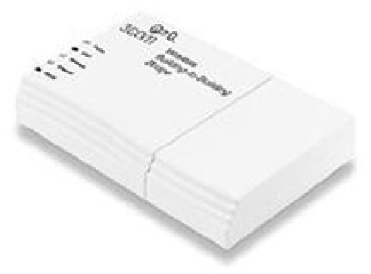

--- end of page=107 ---

**FIGURE 4.7** A point-to-point wireless bridge link

**Wireless Bridge Modes**

Chapter 4 – Wireless LAN Infrastructure Devices **80**

PC

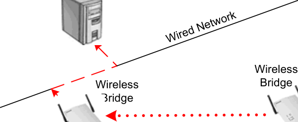

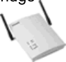

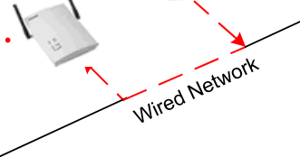

Wireless bridges communicate with other wireless bridges in one of four modes:

  - Root Mode

  - Non-root Mode

  - Access Point Mode

  - Repeater Mode

Each of these modes is described below.

**Root Mode**

One bridge in each group of bridges must be set as the root bridge. A root bridge can
only communicate with non-root bridges and other client devices and cannot associate
with another root bridge. Figure 4.8 illustrates a root bridge communicating with nonroot bridges.

CWNA Study Guide © Copyright 2002 Planet3 Wireless, Inc.

--- end of page=108 ---

**81** Chapter 4 – Wireless LAN Infrastructure Devices

**FIGURE 4.8** A root bridge communicating with non-root bridges

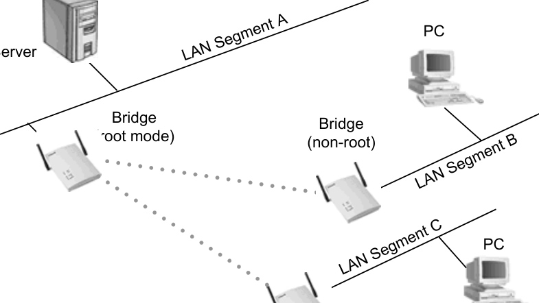

**Non-root Mode**

Bridge
(non-root)

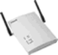

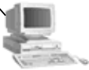

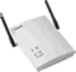

Wireless bridges in non-root mode attach, wirelessly, to wireless bridges that are in root
mode. Some manufacturers’ wireless bridges support _client_ connectivity to non-root
mode bridges while in _bridging_ mode. This mode is actually a special mode where the
bridge is acting as both an access point and as a bridge simultaneously. When using the
Spanning Tree Protocol, all non-root bridges must have connectivity to the root bridge.

**Access Point Mode**

Some manufacturers give the administrator the ability to have clients connect to bridges,
which is actually just giving the bridge access point functionality. In many cases, the
bridge has an “access point” mode that converts the bridge into an access point.

**Repeater Mode**

Wireless bridges can also be configured as repeaters, as shown in Figure 4.9. In repeater
configuration, a bridge will be positioned between two other bridges for the purpose of
extending the length of the wireless bridged segment. While using a wireless bridge in
this configuration has the advantage of extending the link, it has the disadvantage of
decreased throughput due to having to repeat all frames using the same half duplex radio.
Repeater bridges are non-root bridges, and many times the wired port will be disabled
while the bridge is in repeater mode.

CWNA Study Guide © Copyright 2002 Planet3 Wireless, Inc.

--- end of page=109 ---

Chapter 4 – Wireless LAN Infrastructure Devices **82**

**FIGURE 4.9** A wireless bridge in repeater mode

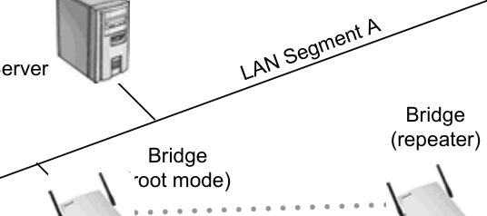

**Common Options**

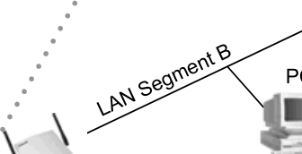

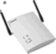

Bridge
(non-root)

The hardware and software options of a wireless bridge are similar to those of an access
point, and for many of the same purposes:

  - Fixed or Detachable Antennas

  - Advanced Filtering Capabilities

  - Removable (Modular) Radio Cards

  - Variable Output Power

  - Varied Types of Wired Connectivity

**Fixed or Detachable Antennas**

Wireless bridge antennas may be fixed or detachable and may come with or without
diversity. Many times, diversity is not considered when configuring a wireless bridge
because both bridges (one at each end of the link) will be static, and the environment
around the wireless bridges tends not to change very often. For these reasons, multipath
is typically not as much of a concern as it is with access points and mobile users.

Detachable antennas are a particularly nice feature with wireless bridges because they
provide the ability to mount the bridge indoors and run a cable outdoors to connect to the
antenna. In almost all cases, semi-directional or directional antennas are used with
wireless bridges. The alternative to connecting a detachable antenna to a wireless bridge
and mounting the bridge indoors is mounting the wireless bridge outdoors in a NEMAcompliant weatherproof enclosure.

CWNA Study Guide © Copyright 2002 Planet3 Wireless, Inc.

--- end of page=110 ---

**83** Chapter 4 – Wireless LAN Infrastructure Devices

**Advanced Filtering Capabilities**

MAC or protocol filters may be built into a wireless bridge. As a basic security
provision, the administrator may configure a wireless bridge to allow or disallow network
access to particular devices based on their MAC address.

Most wireless bridges offer protocol filtering. Protocol filtering is the use of layer 3-7
protocol filters allowing or disallowing specific packets or datagrams based on their layer
3 protocols, layer 4 port, or even layer 7 application. Protocol filters are useful for
limiting use of the wireless LAN. For example, an administrator may prevent a group of
users from using bandwidth-intensive applications based on the port or protocol used by
the application.

**Removable (Modular) Radio Cards**

Having the ability to form a wireless backbone using one of the two radio card slots
found in some bridges reduces the number of devices from four to two when providing
client connectivity and bridging functionality. Typically these functions would require an
access point and a bridge on both ends of the link. Some wireless bridges perform these
same functions using a single radio. While still performing the same tasks, this
configuration allows for much less throughput than if separate sets of radios are used for
the access point and bridging functions.

**Variable Output Power**

Variable Output Power feature allows the administrator to control the power (in
milliwatts) that the bridge uses to send its RF signal. This functionality is especially
useful when performing an outdoor site survey because it allows the site surveyor the
flexibility of controlling the output power without adding and subtracting amplifiers,
attenuators, and lengths of cable from the circuit during testing. Used in conjunction with
amplifiers, variable output in the bridge can be useful on long-distance links in reducing
the amount of time it takes to fine-tune the output power such that the power is high
enough to create a viable link and low enough to stay within FCC regulations.

**Varied Types of Wired Connectivity**

Connectivity options for a wireless bridge can include 10baseTx, 10/100baseTx,
100baseTx, or 100baseFx. Always attempt to establish a full-duplex connection to the
wired segment in order to maximize the throughput of the wireless bridge. It is important
when preparing to purchase a wireless bridge to take note of certain issues, such as the

CWNA Study Guide © Copyright 2002 Planet3 Wireless, Inc.

--- end of page=111 ---

Chapter 4 – Wireless LAN Infrastructure Devices **84**

distance from the nearest wiring closet, for the purpose of specifying wired connectivity
options for wireless bridges.

**Configuration and Management**

Wireless bridges have much the same configuration accessibility as do access points:
console, telnet, HTTP, SNMP, or custom configuration and management software.
Many bridges support Power over Ethernet (PoE) as well (discussed in Chapter 5). Once
wireless bridges are implemented, throughput checks should be done regularly to assure
that the link has not degraded because a piece of the equipment was moved or the antenna
shifted.

Wireless bridges usually come with a factory default IP address and can be accessed via
the methods mentioned above for initial configuration. There is almost always a
hardware reset button on the outside of the unit for resetting the unit back to factory
defaults.

##### Wireless Workgroup Bridges

Similar to and often confused with wireless bridges are wireless _workgroup_ bridges
(WGB). The biggest difference between a bridge and a workgroup bridge is that the
workgroup bridge is a _client_ device. A wireless workgroup bridge is capable of
aggregating multiple wired LAN client devices into one collective wireless LAN client.

In the association table on an access point, a workgroup bridge will appear in the table as
a single client device. The MAC addresses of devices behind the workgroup bridge will
not be seen on the access point. Workgroup bridges are especially useful in
environments with mobile classrooms, mobile offices, or even remote campus buildings
where a small group of users need access into the main network. Bridges can be used for
this type of functionality, but if an access point rather than a bridge is in place at the
central site, then using a workgroup bridge prevents the administrator from having to buy
an additional bridge for the central site. Figure 4.10 shows an example of a wireless
workgroup bridge, while Figure 4.11 illustrates where it is used on a wireless LAN.

In an indoor environment in which a group of users is physically separated from the main
body of network users, a workgroup bridge can be ideal for connecting the entire group
back into the main network wirelessly. Additionally, workgroup bridges may have
protocol filtering capabilities allowing the administrator to control traffic across the
wireless link.

CWNA Study Guide © Copyright 2002 Planet3 Wireless, Inc.

--- end of page=112 ---

**85** Chapter 4 – Wireless LAN Infrastructure Devices

**FIGURE 4.10** A sample wireless workgroup bridge

**FIGURE 4.11** A wireless workgroup bridge installed on a network

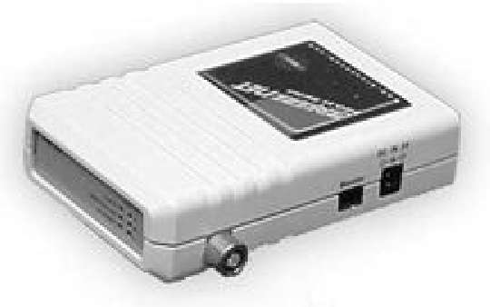

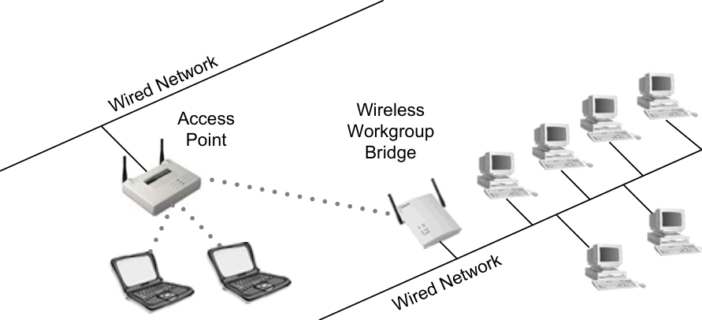

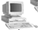

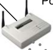

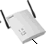

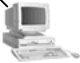

**Common Options**

Because the wireless workgroup bridge is a type of bridge, many of the options that you
will find in a bridge – MAC and protocol filtering, fixed or detachable antennas, variable
power output, and varied types of wired connectivity – are also found in a workgroup
bridge. There is a limit to the number of stations that may use the workgroup bridge from
the wired segment. This number ranges between 8 and 128 depending on the
manufacturer. Use of more than about 30 clients over the wireless segment is likely to
cause throughput to drop to a point at which users might feel that the wireless link is
simply too slow to adequately perform their job tasks.

**Configuration and Management**

The methods used to access, configure, and manage a wireless workgroup bridge are
similar to those of a wireless bridge: console, telnet, HTTP, SNMP support, or custom
configuration and management software. Workgroup bridges are configured for a default
IP address from the manufacturer, but can be changed either by accessing the unit via
console port, web browser, telnet, or custom software application. The administrator can
reset the device to factory defaults by using the hardware reset button on the device.

CWNA Study Guide © Copyright 2002 Planet3 Wireless, Inc.

--- end of page=113 ---

Chapter 4 – Wireless LAN Infrastructure Devices **86**

##### Wireless LAN Client Devices

The term “client devices” will, for purposes of this discussion, cover several wireless
LAN devices that an access point recognizes as a client on a network. These devices
include:

      - PCMCIA & Compact Flash Cards

      - Ethernet & Serial Converters

      - USB Adapters

      - PCI & ISA Adapters

Wireless LAN clients are end-user nodes such as desktop, laptop, or PDA computers that
need wireless connectivity into the wireless network infrastructure. The wireless LAN
client devices listed above provide connectivity for wireless LAN clients. It is important
to understand that manufacturers only make radio cards in two physical formats, and
those are PCMCIA and Compact Flash (CF). All radio cards are built (by the
manufacturers) into these card formats and then connected to adapters such as PCI, ISA,
USB, etc.

**PCMCIA & Compact Flash Cards**

The most common component on any wireless network is the PCMCIA card. More
commonly known as “PC cards”, these devices are used in notebook (laptop) computers
and PDAs. The PC card is the component that provides the connection between a client
device and the network. The PC card serves as a modular radio in access points, bridges,
workgroup bridges, USB adapters, PCI & ISA adapters, and even print servers. Figure
4.12 shows an example of a PCMCIA card.

**FIGURE 4.12** A sample PCMCIA card

Antennas on PC cards vary with each manufacturer. You might notice that several
manufacturers use the same antenna while others use radically different models. Some
are small and flat such as the one shown in figure 4.12, while others are detachable and
connected to the PC card via a short cable. Some PC cards are shipped with multiple

CWNA Study Guide © Copyright 2002 Planet3 Wireless, Inc.

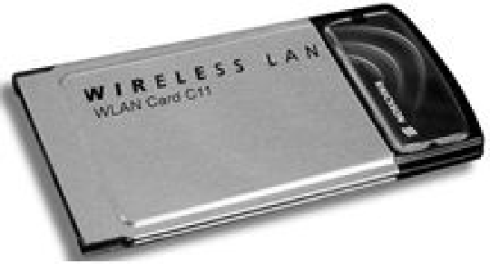

--- end of page=114 ---

**87** Chapter 4 – Wireless LAN Infrastructure Devices

antennas and even accessories for mounting detachable antennas to the laptop or desktop
case with Velcro.

Compact Flash Cards, more commonly known as “CF cards”, are very similar to wireless
PC cards in that they have the same functionality, but CF cards are much smaller and
typically used in PDAs. Wireless CF cards draw very little power and are about the size
of a matchbook.

**Wireless Ethernet & Serial Converters**

Ethernet and serial converters are used with any device having Ethernet or legacy 9-pin
serial ports for the purpose of converting those network connections into wireless LAN
connections. When you use a wireless Ethernet converter, you are externally connecting
a wireless LAN radio to that device with a category 5 (Cat5) cable. A common use of
wireless Ethernet converters is connection of an Ethernet-based print server to a wireless
network.

Serial devices are considered legacy devices and are rarely used with personal computers.
Serial converters are typically used on old equipment that uses legacy serial for network
connectivity such as terminals, telemetry equipment, and serial printers. Many times
manufacturers will sell a client device that includes both a serial and Ethernet converter
in the same enclosure.

These Ethernet and serial converter devices do not normally include the PC card radio.
Instead, the PC card must be purchased separately and installed in the PCMCIA slot in
the converter enclosure. Ethernet converters in particular allow administrators to convert
a large number of wired nodes to wireless in a short period of time.

Configuration of Ethernet and serial converters varies. In most cases, console access is
provided via a 9-pin legacy serial port. Figure 4.13 shows an example of an Ethernet and
serial converter.

**FIGURE 4.13** A sample Ethernet and serial converter

CWNA Study Guide © Copyright 2002 Planet3 Wireless, Inc.

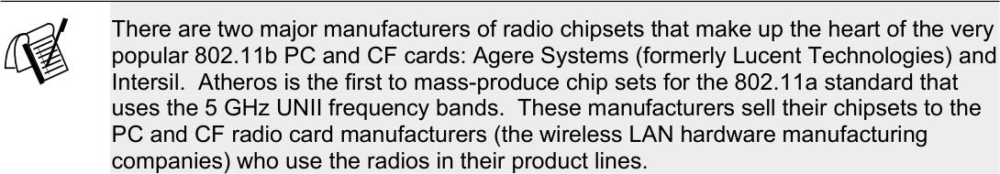

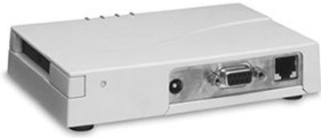

--- end of page=115 ---

Chapter 4 – Wireless LAN Infrastructure Devices **88**

**USB Adapters**

USB clients are becoming very popular due to their simple connectivity. USB client
devices support plug–n-play, and require no additional power other than what is delivered
through the USB port on the computer. Some USB clients utilize modular, easily
removable radio cards and others have a fixed internal card that cannot be removed
without opening the case. When purchasing a USB client device, be sure you understand
whether or not the USB adapter includes the PC card radio. In cases of a USB adapter
that requires a PC card, it is recommended, although not always required, that you use the
same vendor’s equipment for both the adapter and the PC card. Figure 4.14 shows an
example of a USB client.

**FIGURE 4.14** A sample USB client

**PCI & ISA Adapters**

Wireless PCI and ISA are installed inside a desktop or server computer.  Wireless PCI
devices are plug–n–play compatible, but may also only come as an “empty” PCI card and
require a PC card to be inserted into the PCMCIA slot once the PCI card is installed into
the computer. Wireless ISA cards will likely not be plug-n-play compatible and will
require manual configuration both via a software utility and in the operating system.
Since the operating system cannot configure ISA devices that aren’t plug-n-play
compatible, the administrator must make sure the adapter’s setting and those of the
operating system match. Manufacturers typically have separate drivers for the PCI or
ISA adapters and the PC card that will be inserted into each. As with USB adapters, it is
recommended that you use the same vendor’s equipment for the PCI/ISA adapters and
the PC card. Figure 4.15 shows an example of a PCI adapter with a PC card inserted.

CWNA Study Guide © Copyright 2002 Planet3 Wireless, Inc.

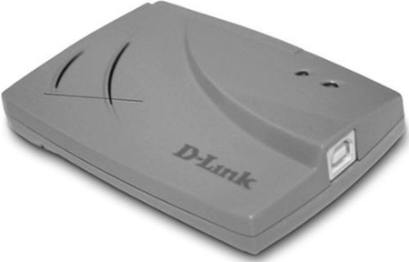

--- end of page=116 ---

**89** Chapter 4 – Wireless LAN Infrastructure Devices

**FIGURE 4.15** A sample PCI Adapter

**Configuration and Management**

There are two steps to installing wireless LAN client devices:

1. Install the drivers

2. Install manufacturer’s wireless utilities

**Driver Installation**

The drivers included for cards are installed the same way drivers for any other type of PC
hardware would be. Most devices (other than ISA adapters) are plug-n-play compatible,
which means that when the client device is first installed, the user will be prompted to
insert the CD or disks containing the driver software into the machine. Specific steps for
device installation will vary by manufacturer. Be sure to follow the instruction manuals
for your specific brand of hardware.

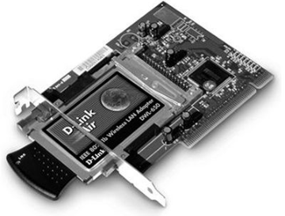

Serial & Ethernet converters require no special drivers to work; however, wireless LAN
client utilities can still be installed and utilized.

**Manufacturer Utilities**

Some manufacturers offer a full suite of utilities and others simply provide the user with
the most basic means of connectivity. A robust set of utilities might include:

  - Site Survey tools (Covered in Chapter 11, Site Survey Fundamentals)

  - Spectrum Analyzer

  - Power and speed monitoring tools

  - Profile configuration utilities

  - Link status monitor with link testing functionality

CWNA Study Guide © Copyright 2002 Planet3 Wireless, Inc.

--- end of page=117 ---

Chapter 4 – Wireless LAN Infrastructure Devices **90**

Site survey tools can include many different items that allow the user to find networks,
identify MAC addresses of access points, quantify signal strengths and signal-to-noise
ratios, and see interfering access points all at the same time during a site survey.

Spectrum analyzer software has many practical uses including finding interference
sources and overlapping wireless LAN channels in the immediate area around your
wireless LAN.

Power output and speed configuration utilities and monitors are useful for knowing what
a wireless link is capable of doing at any particular time. For example, if a user were
planning on transferring a large amount of data from a server to a laptop, the user may
not want to start the transfer until the wireless connection to the network is 11 Mbps
instead of 1 Mbps. Knowing the location of the point at which throughput
increases/decreases is valuable for increasing user productivity.

Profile configuration utilities ease administration tasks considerably when changing from
one wireless network to another. Instead of manually having to reconfigure all of the
wireless client’s settings each time you change networks, you may configure profiles for
each wireless network during the initial configuration of the client device to save time
later.

Link status monitor utilities allow the user to view packet errors, successful
transmissions, connection speed, link viability, and many other valuable parameters.
There is usually a utility for doing real-time link connectivity tests so that, for example,
an administrator would be able to see how stable a wireless link is while in the presence
of heavy RF interference or signal blockage.

**Common Functionality**

Manufacturers' utilities vary greatly in their functionality, but share a common set of
configurable parameters. Each of these parameters is discussed in detail in this book.

      - Infrastructure mode / Ad Hoc mode

      - SSID (a.k.a. Network Name)

      - Channel (if in ad hoc mode)

      - WEP Keys

      - Authentication type (Open System, Shared Key)

##### Wireless Residential Gateways

A wireless residential gateway is a device designed to connect a small number of wireless
nodes to a single device for Layer 2 (wired and wireless) and Layer 3 connectivity to the
Internet or to another network.  Manufacturers have begun combining the roles of access
points and gateways into a single device. Wireless residential gateways usually include a
built-in hub or switch as well as a fully configurable, Wi-Fi compliant access point. The
WAN port on a wireless residential gateway is the Internet-facing Ethernet port that may
be connected to the Internet through one of the following:

CWNA Study Guide © Copyright 2002 Planet3 Wireless, Inc.

--- end of page=118 ---

**91** Chapter 4 – Wireless LAN Infrastructure Devices

      - Cable modem

      - xDSL modem

      - Analog modem

      - Satellite modem

Figure 4.16 shows an example of a wireless residential gateway, while Figure 4.17
illustrates where a wireless residential gateway is used on a wireless LAN.

**FIGURE 4.16** A sample wireless residential gateway

**FIGURE 4.17** A wireless residential gateway installed on a network

Wireless
Residential
Gateway

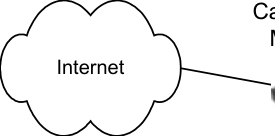

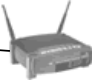

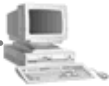

**Common Options**

Because wireless residential gateways are becoming increasingly popular in homes of
telecommuters and in small businesses, manufacturers have begun adding more features
to these devices to aid in productivity and security. Common options that most wireless
residential gateways include are:

     - Point-to-Point Protocol over Ethernet (PPPoE)

     - Network Address Translation (NAT)

     - Port Address Translation (PAT)

CWNA Study Guide © Copyright 2002 Planet3 Wireless, Inc.

--- end of page=119 ---

Chapter 4 – Wireless LAN Infrastructure Devices **92**

     - Ethernet switching

     - Virtual Servers

     - Print Serving

     - Fail-over routing

     - Virtual Private Networks (VPNs)

     - Dynamic Host Configuration Protocol (DHCP) Server and Client

     - Configurable Firewall

This diverse array of functionality allows home and small office users to afford an all-inone single device solution that is easily configurable and meets most business needs.
Residential gateways have been around for quite some time, but recently, with the
extreme popularity of 802.11b compliant wireless devices, wireless was added as a
feature. Wireless residential gateways have all of the expected SOHO-class access point
configuration selections such as WEP, MAC filters, channel selection, and SSID.

**Configuration and Management**

Configuring and installing wireless residential gateways generally consists of browsing to
the built-in HTTP server via one of the built-in Ethernet ports and changing the userconfigurable settings to meet your particular needs. This configuration may include
changing ISP, LAN, or VPN settings. Configuration and monitoring are done in similar
fashion through the browser interface. Some wireless residential gateways units support
console, telnet, and USB connectivity for management and configuration. The text-based
menus typically provided by the console port and telnet sessions are less user-friendly
than the browser interface, but adequate for configuration. Statistics that can be
monitored may include items such as up-time, dynamic IP addresses, VPN connectivity,
and associated clients. These settings are usually well marked or explained for the nontechnical home or home office user.

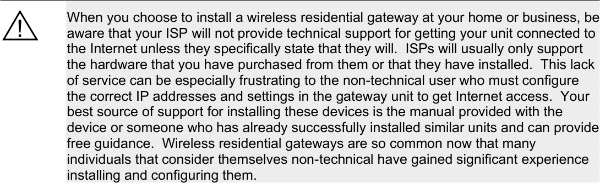

##### Enterprise Wireless Gateways

An enterprise wireless gateway is a device that can provide specialized authentication and
connectivity for wireless clients. Enterprise wireless gateways are appropriate for large

CWNA Study Guide © Copyright 2002 Planet3 Wireless, Inc.

--- end of page=120 ---

**93** Chapter 4 – Wireless LAN Infrastructure Devices

scale wireless LAN environments providing a multitude of manageable wireless LAN
services such as rate limiting, Quality of Service (QoS), and profile management.

It is important that an enterprise wireless gateway device needs to have a powerful CPU
and fast Ethernet interfaces because it may be supporting many access points, all of
which send traffic to and through the enterprise wireless gateway. Enterprise wireless
gateway units usually support a variety of WLAN and WPAN technologies such as
802.11 standard devices, Bluetooth, HomeRF, and more. Enterprise wireless gateways
support SNMP and allow enterprise-wide simultaneous upgrades of user profiles. These
devices can be configured for hot fail-over (when installed in pairs), support of RADIUS,
LDAP, Windows NT authentication databases, and data encryption using industrystandard VPN tunnel types. Figure 4.18 shows an example of an enterprise wireless
gateway, while Figure 4.19 illustrates where it is used on a wireless LAN.

**FIGURE 4.18** A sample enterprise wireless gateway

**FIGURE 4.19** An enterprise wireless gateway installed on a network

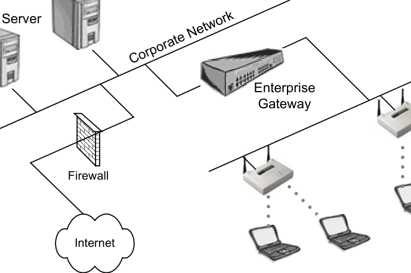

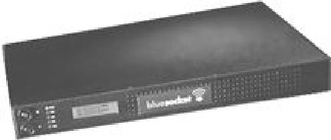

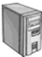

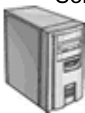

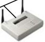

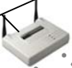

Authentication technologies incorporated into enterprise wireless gateways are often built
into the more advanced levels of access points. For example, VPN and 802.1x/EAP
connectivity are supported in many brands of enterprise level access points.

Enterprise wireless gateways do have features, such as Role-Based Access Control
(RBAC), that are not found in any access points. RBAC allows an administrator to

CWNA Study Guide © Copyright 2002 Planet3 Wireless, Inc.

--- end of page=121 ---

Chapter 4 – Wireless LAN Infrastructure Devices **94**

assign a certain level of wireless network access to a particular job position in the
company. If the person doing that job is replaced, the new person automatically gains the
same network rights as the replaced person. Having the ability to limit a wireless user's
access to corporate resources, as part of the "role", can be a useful security feature.

Class of service is typically supported, and an administrator can assign levels of service
to a particular user or role. For example, a guest account might be able to use only 500
kbps on the wireless network whereas an administrator might be allowed 2 Mbps
connectivity.

In some cases, Mobile IP is supported by the enterprise wireless gateway, allowing a user
to roam across a layer 3 boundary. User roaming may even be defined as part of an
enterprise wireless gateway policy, allowing the user to roam only where the
administrator allows. Some enterprise wireless gateways support packet queuing and
prioritization, user tracking, and even time/date controls to specify when users may
access the wireless network.

MAC spoofing prevention and complete session logging are also supported and aid
greatly in securing the wireless LAN. There are many more features that vary
significantly between manufacturers. Enterprise wireless gateways are so comprehensive
that we highly recommend that the administrator take the manufacturer's training class
before making a purchase so that the deployment of the enterprise wireless gateway will
go more smoothly.

Consultants finding themselves in a situation of having to provide a security solution for
a wireless LAN deployment with many access points that do not support advanced
security features might find enterprise wireless gateways to be a good solution.
Enterprise wireless gateways are expensive, but considering the number of management
and security solutions they provide, usually worth the expense.

**Configuration and Management**

Enterprise wireless gateways are installed in the main the data path on the wired LAN
segment just past the access point(s) as seen in Figure 4.19. Enterprise wireless gateways
are configured through console ports (using CLI), telnet, internal HTTP or HTTPS
servers, etc. Centralized management of only a few devices is one big advantage of using
enterprise wireless gateways. An administrator, from a single console, can easily manage
a large wireless deployment using only a few central devices instead of a very large
number of access points.

Enterprise wireless gateways are normally upgraded through use of TFTP in the same
fashion as many switches and routers on the market today. Configuration backups can
often be automated so that the administrator won't have to spend additional management
time backing up or recovering from lost configuration files. Enterprise wireless gateways
are mostly manufactured as rack-mountable 1U or 2U devices that can fit into your
existing data center design.

CWNA Study Guide © Copyright 2002 Planet3 Wireless, Inc.

--- end of page=122 ---

**95** Chapter 4 – Wireless LAN Infrastructure Devices

##### Key Terms

Before taking the exam, you should be familiar with the following terms:

_bridge mode_

_configurable firewall_

_converters_

_detachable antenna_

_Dynamic Host Configuration Protocol (DHCP) Server and Client_

_Ethernet switching_

_fail-over routing_

_modular cards_

_Network Address Translation (NAT)_

_Point-to-Point Protocol over Ethernet (PPPoE)_

_Port Address Translation (PAT)_

_portal_

_print serving_

_profiles_

_repeater mode_

_root mode_

_SNMP_

_wired connectivity_

_variable output_

_USB_

_Virtual Private Networks (VPNs)_

_virtual servers_

CWNA Study Guide © Copyright 2002 Planet3 Wireless, Inc.

--- end of page=123 ---

Chapter 4 – Wireless LAN Infrastructure Devices **96**

##### Review Questions

1. Why would it not be a good idea to have a number of access points in repeater mode
in series? Choose all that apply.

A. Throughput would be reduced to unacceptable levels

B. The access points would all be required to be physically connected to the
network

C. Data corruption can occur over the series of hops back to the root access point

D. Legacy serial devices would not be able to communicate with the root access
point

2. You are installing a wireless LAN in a factory, and the laptop client computers have
no USB support. Which one of the following client devices could be used as a
stand-alone client connection to the wireless LAN?

A. ISA adapter

B. PCI adapter

C. PCMCIA card

D. Ethernet converter

3. You need to connect two wired networks together that currently share no network
connectivity between them. Using only access points to connect the networks, what
mode would the access points need to be placed in?

A. Root mode

B. Repeater mode

C. Bridging mode

4. When an access point connects to another access point wirelessly for the purpose of
extending the wireless segments to client out of range of the access point connected
to the wired segment, the access point not connected to the wired LAN segment is in
______ mode.

A. Root

B. Repeater

C. Bridge

5. Wireless bridges are used for which of the following functions? Choose all that
apply.

A. Connecting mobile users to the wired LAN

B. Point-to-multipoint configurations

C. Building-to-building connectivity

D. Wireless security

CWNA Study Guide © Copyright 2002 Planet3 Wireless, Inc.

--- end of page=124 ---

**97** Chapter 4 – Wireless LAN Infrastructure Devices

6. Properly aligning two wireless bridges will optimize their throughput. This
statement is:

A. Always true

B. Always false

C. Depends on the manufacturer

7. Your friend owns a small business, and asks you what he could buy to provide lowcost wireless Internet access for his 5 salespeople in the office. Which one of the
following devices would be an appropriate solution?

A. Access point

B. Wireless workgroup bridge

C. Enterprise wireless gateway

D. Wireless residential gateway

8. A company has hired you to recommend wireless LAN equipment that will allow
them to place limits on the bandwidth used by each of their wireless users. Which
one of the following devices would you recommend?

A. Access point

B. Wireless workgroup bridge

C. Enterprise wireless gateway

D. Wireless residential gateway

9. In a situation in which you need to allow outdoor users to connect to your network
via a wireless LAN, which one of the following features would allow you to use an
indoor access point with an outdoor antenna?

A. Antenna diversity

B. Detachable antennas

C. Plug and play support

D. Modular radio cards

10. Which of the following wireless client devices would not be a plug–n-play device?

A. USB Client

B. PCMCIA Card

C. ISA Card

D. Compact Flash Card

CWNA Study Guide © Copyright 2002 Planet3 Wireless, Inc.

--- end of page=125 ---

Chapter 4 – Wireless LAN Infrastructure Devices **98**

11. Your client has a number of sales people that are located in a remote office building.
Each sales person has both a PC and a laptop. The client wants to purchase a
hardware solution that will permit each sales person to have wireless network
connectivity for his or her PC and laptop. Only the PC or the laptop needs network
access at any given time, and both have USB support. Which of the following
solutions would work? Choose all that apply.

A. 1 PCMCIA card

B. 1 PCMCIA card, 1 PCI adapter

C. 1 PCMCIA card, 1 USB adapter

D. 1 PCMCIA card, 1 CF card

12. You have configured an access point in a small office and are concerned about
hackers intruding on your wireless network. What settings will you adjust (from the
manufacturer’s default settings) on the unit to address this potential problem?
Choose all that apply.

A. Detachable antennas

B. MAC Filtering

C. Radio card position

D. Output power

E. WEP configuration

13. Which of the following are common security options that most wireless residential
gateways include? Choose all that apply.

A. PPPoE – Point-to-Point Protocol over Ethernet

B. Virtual Servers

C. Routing

D. PAT – Port Address Translation

E. VPN Client or VPN Client Passthrough

14. Which of the following are wired connectivity options that a wireless bridge can
include? Choose all that apply.

A. 10baseTx

B. 10baseFL

C. 10/100baseTx

D. 1000baseSX

E. 100baseFx

15. A workgroup bridge is a(n) ______ device.

A. Client

B. Infrastructure

C. Gateway

D. Antenna

CWNA Study Guide © Copyright 2002 Planet3 Wireless, Inc.

--- end of page=126 ---

**99** Chapter 4 – Wireless LAN Infrastructure Devices

16. Which one of the following is not a hardware or software option on a wireless
bridge?

A. Fixed or detachable antennas

B. Advanced filtering capabilities

C. Removable (modular) radio cards

D. Full duplex radio links

E. Varied Types of Wired Connectivity

17. Ethernet and serial converters are used with devices having which of the following
physical connectivity? Choose all that apply.

A. 9-pin serial ports

B. Ethernet ports

C. USB Ports

D. Parallel Ports

18. Why is an access point considered a portal?

A. An access point allows client connectivity from an 802.11 network to either
802.3 or 802.5 networks

B. An access point always connects users to the Internet

C. An access point connects clients to one another

D. An access point is a gateway to another collision domain

19. The statement that _an access point is a half duplex wireless device_ is which one of
the following?

A. Always true

B. Always false

C. Dependent on the maker of the access point

20. A USB adapter is used with which type of wireless LAN device?

A. Gateway

B. Access point

C. Bridge

D. Client

E. Converter

CWNA Study Guide © Copyright 2002 Planet3 Wireless, Inc.

--- end of page=127 ---

Chapter 4 – Wireless LAN Infrastructure Devices **100**

##### Answers to Review Questions

1. A, C. When an access point is used in repeater mode, throughput of the wireless
connection to clients is significantly reduced due to the access point having to listen
to the clients _and_ retransmit every frame upstream over the same wireless segment.
This situation causes much more contention for the medium than would normally be
expected. Having a series of repeater hops can cause data corruption. Use of only
one repeater in a series is recommended.

2. C. PCI cards and Ethernet converters use PCMCIA cards for connectivity into the
wireless LAN. In this scenario, only PCMCIA cards themselves are standalone
wireless LAN connectivity devices.

3. C. Access points, when serving in root or repeater mode, allow only client
connectivity. In this scenario, wireless bridges should be used, but in their absence,
many wireless access points support a bridging mode where the access points can
effectively be a wireless bridge connecting two wired segments together wirelessly.
Although an access point in repeater mode can talk to another access point, it does
so as a client and on behalf of other clients, and multiple wired segments cannot be
connected using access points in this manner.

4. B. The purpose behind repeater mode is to extend the wireless segment to users
who cannot see the access point connected to the wired LAN. Many times repeater
mode is used because an additional access point could not be connected to the wired
infrastructure in a particular area of a facility.

5. B, C. There are two basic configurations using wireless bridges: point-to-point and
point-to-multipoint. Building-to-building bridging can take on either of these
configurations. Clients cannot connect to wireless bridges, and wireless bridges are
not security devices.

6. A. If highly directional antennas are misaligned only slightly, it can result in a loss
of throughput in the wireless link. For this reason, administrators often use semidirectional antennas in order to simplify the task of alignment and to minimize the
chance of misalignment caused by things such as wind loading.

7. D. Wireless residential gateways, which are sometimes referred to as SOHO
devices, provide the necessary connectivity for both wired and wireless clients in a
small network environment. Additionally, these gateways provide needed upstream
Internet connectivity and internal functionality, such as DHCP, that eases
administrative overhead.

8. C. Some wireless enterprise gateways support role-based access control (RBAC)
where profiles can be attached to user accounts allowing specific types of access
functionality, such as rate limiting, on a per-user basis.

9. B. Access points and bridges are typically mounted inside the building unless
placed in a weatherproof enclosure. It is often more economical to place access
points and bridges indoors, requiring that the antenna be detachable. Mounting the
antenna outdoors and running a long cable between the antenna and access point
allow the administrator to protect the access point against weather and theft.

CWNA Study Guide © Copyright 2002 Planet3 Wireless, Inc.

--- end of page=128 ---

**101** Chapter 4 – Wireless LAN Infrastructure Devices

10. C. Wireless ISA devices do not support plug-n-play functionality, and therefore
require manual configuration. Legacy 9-pin serial wireless client devices likewise
do not support plug-n-play configuration. PCI, PCMCIA, CF, and USB devices
support plug-n-play.

11. B, C. With a PCI card, the desktop computer would be able to accept the PCMCIA
card. The PCMCIA card can be inserted directly into the laptop computer.
Likewise the USB adapter can be connected to either computer, and the PCMCIA
card can be inserted into the PCMCIA adapter.

12. B, D, E. If output power is only high enough to allow company personnel to attach
to the network, but not passers-by, then the network is likely more secure. Setting
WEP keys and MAC filters before deployment is a very good idea for small wireless
networks.

13. B, D, E. Port Address Translation is a many-to-one configuration variance of
Network Address Translation. Using private IP addresses in the corporate
environment and using public IP addresses on the Internet connection allows a
degree of security for corporate users. Likewise, VPN client or VPN client
passthrough functionality allows SOHO users to connect to a corporate VPN server
over the Internet using a secure tunnel. Virtual servers must be manually configured
by the administrator to direct packets to a particular server. This type of manual
control allows the administrator to keep the internal servers secure.

14. A, C, E. 10baseTx, 10/100baseTx, and 100baseFx are common wired Ethernet ports
on access points, bridges, and even workgroup bridges. Cat5 or short-haul fiber is
used to connect these devices to the wired distribution system. 10baseFL is
basically obsolete, and using gigabit Ethernet connectivity such as 1000baseSx
would increase costs of the infrastructure device but add no further speed to the
network. Since access points and bridges only have a maximum of 100 Mbps on the
fastest available wireless LAN system (802.11a devices in proprietary mode), there
is no need to have a connection on the wired segment faster than 100 Mbps.

15. A. Workgroup bridges are client devices capable of advanced filtering and
connecting a group of wired users on a wired network segment to another wired
segment over a wireless link as a single, collective client.

16. D. All wireless LAN radios are half duplex. Because radios can either transmit or
receive on a particular frequency, but not both simultaneously, full-duplex
communications are not possible on a wireless LAN without using multiple radios
and multiple frequencies at one time. Wireless LAN radio manufacturers do not
build their radios to be full duplex capable because of the very high cost of doing so.

17. A, B. Ethernet converters are used to connect wired stations to the wireless network
via standard wired Ethernet ports that are already installed in the computer. Serial
converters are used to connect stations that have no network connectivity or have
legacy serial network connectivity to the wireless network via the standard 9-pin
serial (COM) port.

18. A. A portal is a device that connects dissimilar media types such as 802.11 wireless
and 802.3 Ethernet, or maybe even 802.5 Token Ring.

19. A. All wireless LAN radios are half duplex. The same radios used for client
connectivity are used for access points, bridges, and workgroup bridges.

CWNA Study Guide © Copyright 2002 Planet3 Wireless, Inc.

--- end of page=129 ---

Chapter 4 – Wireless LAN Infrastructure Devices **102**

20. D. A USB adapter connects a computer’s USB port to a wireless network using a
standard PCMCIA radio (whether internally fixed or externally modular).

CWNA Study Guide © Copyright 2002 Planet3 Wireless, Inc.

--- end of page=130 ---
