# Chapter 5 - Antennas & Accessories

_PDF pages 132-173_

##### Antennas and Accessories

**CWNA Exam Objectives Covered:**

- Identify the basic attributes, purpose, and function of the
following types of antennas

 - Omni-directional/dipole

 - Semi-directional

 - Highly-directional

- Describe the proper locations and methods for installing antennas

- Explain the concepts of polarization, gain, beamwidth, and
free-space path loss as they apply to implementing solutions
that require antennas

- Identify the purpose of the following wireless LAN
accessories and explain how to install, configure, and
manage them

 - Power over Ethernet devices

 - Amplifiers

 - Attenuators

 - Lightning arrestors

 - RF connectors and cables

 - RF splitters

CWNA Study Guide © Copyright 2002 Planet3 Wireless, Inc.

CHAPTER CHAPTER
# 5 5

**In This Chapter**

RF Antennas

Power over Ethernet

Accessories

--- end of page=131 ---

Chapter 5 – Antennas and Accessories **104**

In the previous chapter, we discussed the many different pieces of wireless LAN
equipment that are available on the market today for creating simple and complex
wireless LANs. In this chapter, we will discuss a basic element of the devices that make
access points, bridges, pc cards and other wireless devices communicate: antennas.

Antennas are most often used to increase the range of wireless LAN systems, but proper
antenna selection can also enhance the security of your wireless LAN. A properly chosen
and positioned antenna can reduce the signal leaking out of your workspace, and make
signal interception extremely difficult. In this chapter, we will explain the radiation
patterns of different antenna designs, and how the positioning of the user's antenna makes
a difference in signal reception.

There are three general categories into which all wireless LAN antennas fall: omnidirectional, semi-directional, and highly-directional. We will discuss the attributes of
each of these groups in-depth, as well as the proper methods for installing each kind of
antenna. We will also explain polarization, coverage patterns, appropriate uses, and
address the many different items that are used to connect antennas to other wireless LAN
hardware.

Up to now, we have discussed RF theory and some of the major categories of wireless
LAN devices that an administrator will use on a daily basis. This knowledge is a good
foundation, but is of little value without a solid working knowledge of antennas, which
are the devices that actually send and receive the RF signals.

This chapter will also cover wireless LAN accessories such as:

 - RF Amplifiers

 - RF Attenuators

 - Lightning Arrestors

 - RF Connectors

 - RF Cables

 - RF Splitters

 - Pigtails

Knowledge of these devices' uses, specifications, and effects on RF signal strength is
essential to being able to build a functional wireless LAN.

Power over Ethernet (PoE) has become an important factor in today's wireless networks
spawning new product lines and new standards. PoE technology will be discussed along
with the different types of PoE equipment that can be used to deliver power to a PoEenabled device.

CWNA Study Guide © Copyright 2002 Planet3 Wireless, Inc.

--- end of page=132 ---

**105** Chapter 5 – Antennas and Accessories

##### RF Antennas

An RF antenna is a device used to convert high frequency (RF) signals on a transmission
line (a cable or waveguide) into propagated waves in the air. The electrical fields emitted
from antennas are called _beams_ or _lobes_ . There are three generic categories of RF
antennas:

      - Omni-directional

      - Semi-directional

      - Highly-directional

Each category has multiple types of antennas, each having different RF characteristics
and appropriate uses. As the gain of an antenna goes up, the coverage area narrows so
that high-gain antennas offer longer coverage areas than low-gain antennas at the same
input power level. There are many types of antenna mounts, each suited to fit a particular
need. After studying this section, you will understand which antenna and mount best
meets your needs and why.

**Omni-directional (Dipole) Antennas**

The most common wireless LAN antenna is the Dipole antenna. Simple to design, the
dipole antenna is standard equipment on most access points. The dipole is an omnidirectional antenna, because it radiates its energy equally in all directions around its axis.
Directional antennas concentrate their energy into a cone, known as a "beam." The
dipole has a radiating element just one inch long that performs an equivalent function to
the "rabbit ears" antennas on television sets. The dipole antennas used with wireless
LANs are much smaller because wireless LAN frequencies are in the 2.4 GHz microwave
spectrum instead of the 100 MHz TV spectrum. As the frequency gets higher, the
wavelength and the antennas become smaller.

Figure 5.1 shows that the dipole's radiant energy is concentrated into a region that looks
like a doughnut, with the dipole vertically through the "hole" of the "doughnut." The
signal from an omni-directional antenna radiates in a 360-degree horizontal beam. If an
antenna radiates in all directions equally (forming a sphere), it is called an isotropic
radiator. The sun is a good example of an isotropic radiator. We cannot make an
isotropic radiator, which is the theoretical reference for antennas, but rather, practical
antennas all have some type of gain over that of an isotropic radiator. The higher the
gain, the more we horizontally squeeze our doughnut until it starts looking like a
pancake, as is the case with very high gain antennas.

CWNA Study Guide © Copyright 2002 Planet3 Wireless, Inc.

--- end of page=133 ---

Chapter 5 – Antennas and Accessories **106**

**FIGURE 5.1** Dipole Doughnut

The dipole radiates equally in all directions around its axis, but does not radiate along the
length of the wire itself - hence the doughnut pattern. Notice the side view of a dipole
radiator as it radiates waves in Figure 5.2. This figure also illustrates that dipole antennas
form a "figure 8" in their radiation pattern if viewed standing beside a perpendicular
antenna.

**FIGURE 5.2** Dipole side-view

If a dipole antenna is placed in the center of a single floor of a multistory building, most
of its energy will be radiated along the length of that floor, with some significant fraction
sent to the floors above and below the access point. Figure 5.3 shows examples of some
different types of omni-directional antennas. Figure 5.4 shows a two-dimensional
example of the top view and side view of a dipole antenna.

**FIGURE 5.3** Sample omni-directional antennas

Omni Pillar Omni Ground Omni Ceiling
Mount Antenna Plane Antenna Mount Antenna

CWNA Study Guide © Copyright 2002 Planet3 Wireless, Inc.

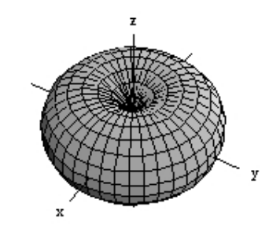

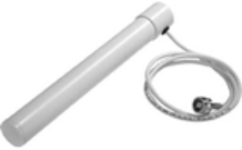

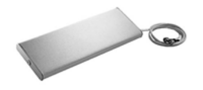

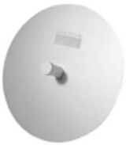

--- end of page=134 ---

**107** Chapter 5 – Antennas and Accessories

**FIGURE 5.4** Coverage area of an omni-directional antenna

Side View Top View

High-gain omni-directional antennas offer more horizontal coverage area, but the vertical
coverage area is reduced, as can be seen in Figure 5.5. This characteristic can be an
important consideration when mounting a high-gain omni antenna indoors on the ceiling.
If the ceiling is too high, the coverage area may not reach the floor, where the users are
located.

**FIGURE 5.5** Coverage area of a high-gain omni-directional antenna

Side View Top View

**Usage**

Omni-directional antennas are used when coverage in all directions around the horizontal
axis of the antenna is required. Omni-directional antennas are most effective where large
coverage areas are needed around a central point. For example, placing an omnidirectional antenna in the middle of a large, open room would provide good coverage.
Omni-directional antennas are commonly used for _point-to-multipoint_ designs with a
hub-n-spoke topology (See Figure 5.6). Used outdoors, an omni-directional antenna
should be placed on top of a structure (such as a building) in the middle of the coverage
area. For example, on a college campus the antenna might be placed in the center of the
campus for the greatest coverage area. When used indoors, the antenna should be placed
in the middle of the building or desired coverage area, near the ceiling, for optimum
coverage. Omni-directional antennas emit a large coverage area in a circular pattern and
are suitable for warehouses or tradeshows where coverage is usually from one corner of
the building to the other.

CWNA Study Guide © Copyright 2002 Planet3 Wireless, Inc.

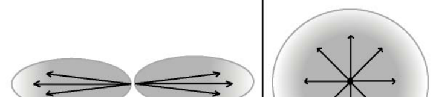

--- end of page=135 ---

Chapter 5 – Antennas and Accessories **108**

**FIGURE 5.6** Point-to-multipoint link

**Semi-directional Antennas**

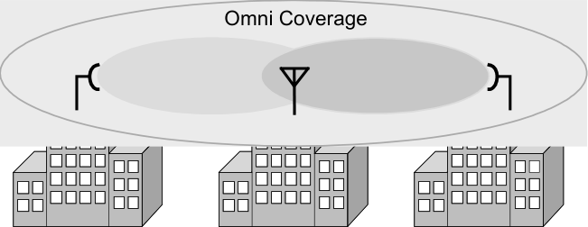

Semi-directional antennas come in many different styles and shapes.  Some semidirectional antennas types frequently used with wireless LANs are Patch, Panel, and Yagi
(pronounced “YAH-gee”) antennas. All of these antennas are generally flat and designed
for wall mounting. Each type has different coverage characteristics. Figure 5.7 shows
some examples of semi-directional antennas.

**FIGURE 5.7** Sample semi-directional antennas

Yagi Antenna Patch Antenna Panel Antenna

These antennas direct the energy from the transmitter significantly more in one particular
direction rather than the uniform, circular pattern that is common with the omnidirectional antenna. Semi-directional antennas often radiate in a hemispherical or
cylindrical coverage pattern as can be seen in Figure 5.8.

CWNA Study Guide © Copyright 2002 Planet3 Wireless, Inc.

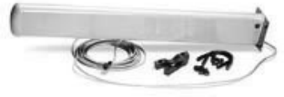

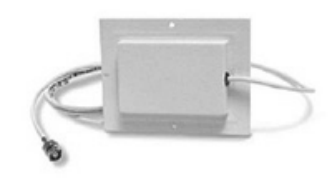

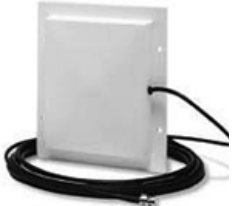

--- end of page=136 ---

**109** Chapter 5 – Antennas and Accessories

**FIGURE 5.8** Coverage area of a semi-directional antenna

**Usage**

Semi-directional antennas are ideally suited for short and medium range bridging. For
example, two office buildings that are across the street from one another and need to
share a network connection would be a good scenario in which to implement semidirectional antennas. In a large indoor space, if the transmitter must be located in the
corner or at the end of a building, a corridor, or a large room, a semi-directional antenna
would be a good choice to provide the proper coverage. Figure 5.9 illustrates a link
between two buildings using semi-directional antennas.

**FIGURE 5.9** Point-to-point link using semi-directional antennas

Many times, during an indoor site survey, engineers will constantly be thinking of how to
best locate _omni_ -directional antennas. In some cases, semi-directional antennas provide
such long-range coverage that they may eliminate the need for multiple access points in a
building. For example, in a long hallway, several access points with omni antennas may
be used or perhaps only one or two access points with properly placed semi-directional
antennas - saving the customer a significant amount of money. In some cases, semidirectional antennas have back and side lobes that, if used effectively, may further reduce
the need for additional access points.

CWNA Study Guide © Copyright 2002 Planet3 Wireless, Inc.

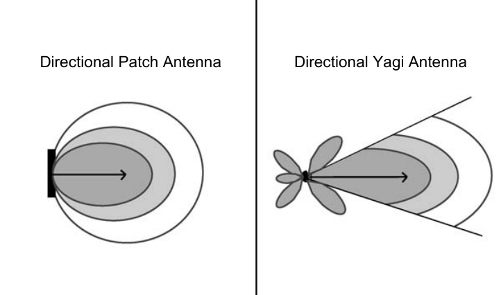

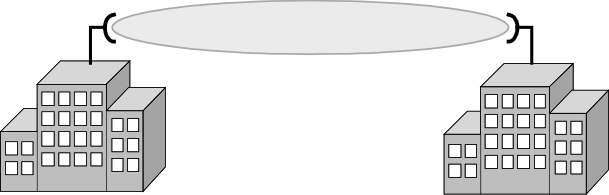

--- end of page=137 ---

Chapter 5 – Antennas and Accessories **110**

**Highly-directional Antennas**

As their name would suggest, highly-directional antennas emit the most narrow signal
beam of any antenna type and have the greatest gain of these three groups of antennas.
Highly-directional antennas are typically concave, dish-shaped devices, as can be seen in
Figures 5.10 and 5.11. These antennas are ideal for long distance, point-to-point wireless
links. Some models are referred to as _parabolic dishes_ because they resemble small
satellite dishes. Others are called _grid_ antennas due to their perforated design for
resistance to wind loading.

**FIGURE 5.10** Sample of a highly-directional parabolic dish antenna

**FIGURE 5.11** Sample of a highly-directional grid antenna

Figure 5.12 illustrates the radiation pattern of a high-gain antenna.

**FIGURE 5.12** Radiation pattern of a highly-directional antenna

**Usage**

High-gain antennas do not have a coverage area that client devices can use. These
antennas are used for point-to-point communication links, and can transmit at distances
up to 25 miles. Potential uses of highly directional antennas might be to connect two
buildings that are miles away from each other but have no obstructions in their path.
Additionally, these antennas can be aimed directly at each other within a building in
order to "blast" through an obstruction. This setup would be used in order to get network
connectivity to places that cannot be wired and where normal wireless networks will not
work.

CWNA Study Guide © Copyright 2002 Planet3 Wireless, Inc.

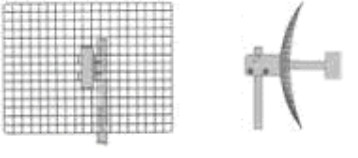

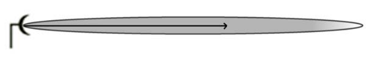

--- end of page=138 ---

**111** Chapter 5 – Antennas and Accessories

**RF Antenna Concepts**

There are several concepts that are essential knowledge when implementing solutions
that require RF antennas. Among those that will be described are:

      - Polarization

      - Gain

      - Beamwidth

      - Free Space Path Loss

The above list is by no means a comprehensive list of all RF antenna concepts, but rather
a set of must-have fundamentals that allow an administrator to understand how wireless
LAN equipment functions over the wireless medium. A solid understanding of basic
antenna functionality is the key to moving forward in learning more advanced RF
concepts.

Knowing where to place antennas, how to position them, how much power they are
radiating, the distance that radiated power is likely to travel, and how much of that power
can be picked up by receivers is, many times, the most complex part of an administrator's
job.

**Polarization**

A radio wave is actually made of up two fields, one electric and one magnetic. These two
fields are on planes perpendicular to each other, as shown in figure 5.13.

**FIGURE 5.13** E-planes and H-planes

The sum of the two fields is called the electro-magnetic field. Energy is transferred back
and forth from one field to the other, in the process known as "oscillation." The plane
that is parallel with the antenna element is referred to as the "E-plane" whereas the plane
that is perpendicular to the antenna element is referred to as the "H-plane." We are

CWNA Study Guide © Copyright 2002 Planet3 Wireless, Inc.

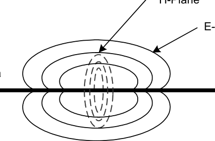

--- end of page=139 ---

Chapter 5 – Antennas and Accessories **112**

interested primarily in the electric field since its position and direction with reference to
the Earth's surface (the ground) determines wave polarization.

Polarization is the physical orientation of the antenna in a horizontal or vertical position.
The electric field is parallel to the radiating elements (the antenna element is the metal
part of the antenna that is doing the radiating) so, if the antenna is vertical, then the
polarization is vertical.

      - _Horizontal polarization_      - the electric field is parallel to the ground

      - _Vertical polarization_      - the electric field is perpendicular to the ground

Vertical polarization, which is typically used in wireless LANs, is perpendicular to the
Earth’s plane. Notice the dual antennas sticking up vertically from most any access point

         - these antennas are vertically polarized in that position. Horizontal polarization is
parallel to the Earth. Figure 5.14 illustrates the effects polarization can have when
antennas are not aligned correctly. Antennas that are not polarized in the same way are
not able to communicate with each other effectively.

**FIGURE 5.14** Polarization

**Practical Use**

The designers of the antennas for PCMCIA cards face a real problem. It is not easy to
form antennas onto the small circuit board inside the plastic cover that sticks off the end
of the PCMCIA card. Rarely do antennas built into PCMCIA cards provide adequate
coverage, especially when the client is roaming. The polarization of PCMCIA cards and
that of access points is sometimes not the same, which is why turning your laptop in
different directions generally improves reception. PDAs, which usually have a vertically
oriented PCMCIA card, normally exhibit good reception. External, detachable antennas
mounted with Velcro to the laptop computer vertically almost always show great
improvement over the snap-on antennas included with most PCMCIA cards. In areas
where there are a high number of PCMCIA card users, it is often recommended to orient
access point antennas horizontally for better reception.

CWNA Study Guide © Copyright 2002 Planet3 Wireless, Inc.

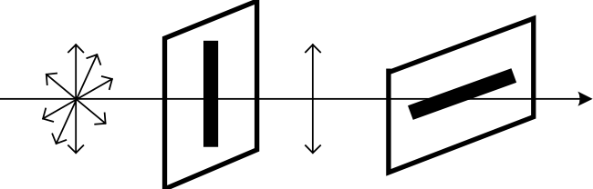

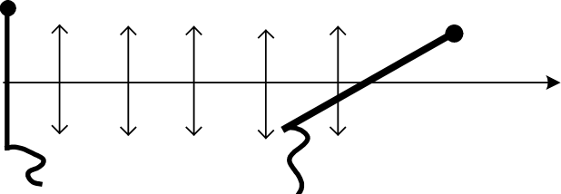

--- end of page=140 ---

**113** Chapter 5 – Antennas and Accessories

**Gain**

Antenna gain is specified in dBi, which means decibels referenced to an isotropic
radiator. An isotropic radiator is a sphere that radiates power equally in all directions
simultaneously. We haven't the ability to make an isotropic radiator, but instead we can
make omni-directional antennas such as a dipole that radiates power in a 360-degree
horizontal fashion, but not 360 degrees vertically. RF signal radiation in this fashion
gives us a doughnut pattern. The more we horizontally squeeze this doughnut, the flatter
it becomes, forming more of a pancake shape when the gain is very high. Antennas have
passive gain, which means they do not increase the power that is input into them, but
rather shape the radiation field to lengthen or shorten the distance the propagated wave
will travel. The higher the antenna gain, the farther the wave will travel, concentrating its
output wave more tightly so that more of the power is delivered to the destination (the
receiving antenna) at long distances. As was shown in Figure 5.5, the coverage has been
squeezed vertically so that the coverage pattern is elongated, reaching further.

**Beamwidth**

As we've discussed previously, narrowing, or focusing antenna beams increases the
antenna’s gain (measured in dBi). An antenna’s beamwidth means just what it sounds
like: the “width” of the RF signal beam that the antenna transmits. Figure 5.15 illustrates
the term beamwidth.

**FIGURE 5.15** Beamwidth of an antenna

There are two vectors to consider when discussing an antenna’s beamwidths: the vertical
and the horizontal. The vertical beamwidth is measure in degrees and is perpendicular to
the Earth's surface. The horizontal beamwidth is measured in degrees and is parallel to
the Earth's surface. Beamwidth is important for you to know because each type of
antenna has different beamwidth specifications. The chart below can be used as a quick
reference guide for beamwidths.

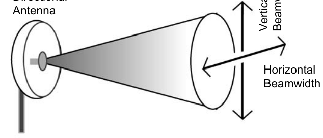

|Antenna Type|Horizontal Beamwidth (in degrees)|Vertical Beamwidth (in degrees)|
|---|---|---|
|Omni-directional|360|Ranges from 7-80|
|Patch/Panel|Ranges from 30-180|Ranges from 6-90|
|Yagi|Ranges from 30-78|Ranges from 14-64|
|Parabolic Dish|Ranges from 4-25|Ranges from 4-21|

CWNA Study Guide © Copyright 2002 Planet3 Wireless, Inc.

--- end of page=141 ---

Chapter 5 – Antennas and Accessories **114**

Selecting an antenna with appropriately wide or narrow beamwidths is essential in having
the desired RF coverage pattern. For example, imagine a long hallway in a hospital.
There are rooms on both sides of the hallway, and instead of using several access points
with omni antennas, you have decided to use a single access point with a semi-directional
antenna such as a patch antenna.

The access point and patch antenna are placed at one end of the hallway facing down the
hallway. For complete coverage on the floors directly above and below this floor a patch
antenna could be chosen with a significantly large vertical beamwidth such as 60-90
degrees. After some testing, you may find that your selection of a patch antenna with 80
degrees vertical beamwidth does the job well.

Now the horizontal beamwidth needed must be decided on. Due to the length of the
hallway, testing may reveal a high-gain patch antenna must be used in order to have
adequate signal coverage at the opposite end. Having this high gain, the patch antenna's
horizontal beamwidths are significantly narrowed such that the rooms on each side of the
hallway do not have adequate coverage. Additionally, the high-gain antenna doesn't have
a large enough vertical beamwidth to cover the floors immediately above and below. In
this case, you might decide to use two patch antennas - one at each end of the hallway
facing each other. They would both be low gain with wide horizontal and vertical
beamwidths such that the rooms on each side of the hallway are covered along with the
floors above and below. Due to the low gain, the antennas may each only cover a portion
(maybe half) of the length of the hallway.

As you can see from this example, appropriate selection of beamwidths to have the right
coverage pattern is essential and may likely determine how much hardware (such as
access points) needs to be purchased for an installation.

**Free Space Path Loss**

Free Space Path Loss (or just Path Loss) refers to the loss incurred by an RF signal due
largely to "signal dispersion" which is a natural broadening of the wave front. The wider
the wave front, the less power can be induced into the receiving antenna. As the
transmitted signal traverses the atmosphere, its power level decreases at a rate inversely
proportional to the distance traveled and proportional to the wavelength of the signal.
The power level becomes a very important factor when considering link viability.

The Path Loss equation is one of the foundations of link budget calculations. Path Loss
represents the single greatest source of loss in a wireless system. Below is the formula
for Path Loss.

 4 ∏ _d_ 
_PathLoss_ = 20 _LOG_ 10  λ { _dB_ }

CWNA Study Guide © Copyright 2002 Planet3 Wireless, Inc.

--- end of page=142 ---

**115** Chapter 5 – Antennas and Accessories

**The 6dB Rule**

Close inspection of the Path Loss equation yields a relationship that is useful in dealing
with link budget issues. Each 6 dB increase in EIRP equates to a doubling of range.
Conversely, a 6 dB reduction in EIRP translates into a cutting of the range in half. Below
is a chart that gives you a rough estimate of the Path Loss for given distances between
transmitter and receiver at 2.4 GHz.

|Distance|Loss (in dB)|
|---|---|
|100 meters|80.23|
|200 meters|86.25|
|500 meters|94.21|
|1,000 meters|100.23|
|2,000 meters|106.25|
|5,000 meters|114.21|
|10,000 meters|120.23|

**Antenna Installation**

It is very important to have proper installation of the antennas in a wireless LAN. An
improper installation can lead to damage or destruction of your equipment and can also
lead to personal injury. Equally as important as personal safety is good performance of
the wireless LAN system, which is achieved through proper placement, mounting,
orientation, and alignment. In this section we will cover:

     - Placement

     - Mounting

     - Appropriate Use

     - Orientation

     - Alignment

     - Safety

     - Maintenance

**Placement**

Mount omni-directional antennas attached to access points near the middle of the desired
coverage area whenever possible. Place the antenna as high as possible to increase
coverage area, being careful that users located somewhat below the antenna still have
reception, particularly when using high-gain omni antennas. Outdoor antennas should be

CWNA Study Guide © Copyright 2002 Planet3 Wireless, Inc.

--- end of page=143 ---

Chapter 5 – Antennas and Accessories **116**

mounted above obstructions such as trees and buildings such that no objects encroach on
the Fresnel Zone.

**Mounting**

Once you have calculated the necessary output power, gain, and distance that you need to
transmit your RF signal, and have chosen the appropriate antenna for the job, you must
mount the antenna. There are several options for mounting antennas both indoors and
outdoors.

**Antenna Mounting Options**

  - ceiling mount - typically hung from crossbars of drop ceilings

  - wall mount - forces the signal away from a perpendicular surface

  - pillar mount - mounts flush to a perpendicular surface

  - ground plane - sits flat on the ground

  - mast mount - the antenna mounts to a pole

  - articulating mount - movable mast mount

  - chimney mount - various hardware to allow antenna mounting to a chimney

  - tripod-mast - the antenna sits atop a tripod

There is no perfect answer for where to mount your particular antenna. You will learn in
Chapter 11 (Site Surveying Fundamentals) that the recommended placement and
mounting of antennas will be part of a proper site survey. There is no substitute for on
the job training, which is where you are likely to learn how to mount wireless LAN
antennas using various types of mounting hardware. Each type of mount will come with
instructions from the manufacturer on how to install and secure it. There are many
different variations of each mount type because manufacturers each have their own way
of designing the mounting kit.

**Appropriate Use**

Use indoor antennas inside of buildings and outdoor antennas outside of buildings unless
the indoor area is significantly large to warrant use of an outdoor antenna. Outdoor
antennas are most often sealed to prevent water from entering the antenna element area
and made of plastics able to withstand extreme heat and cold. Indoor antennas are not
made for outdoor use and generally cannot withstand the elements.

**Orientation**

Antenna orientation determines polarization, which was discussed previously as having a
significant impact on signal reception. If an antenna is oriented with the electrical field
parallel to the Earth's surface, then the clients (if the antenna is mounted to an access
point) should also have this same orientation for maximum reception. The reverse is also
true with both having the electrical field oriented perpendicular to the Earth's surface.

CWNA Study Guide © Copyright 2002 Planet3 Wireless, Inc.

--- end of page=144 ---

**117** Chapter 5 – Antennas and Accessories

The throughput of a bridge link will be drastically reduced if each end of the link does
not have the same antenna orientation.

**Alignment**

Antenna alignment is sometimes critical and other times not. Some antennas have very
wide horizontal and vertical beamwidths allowing the administrator to aim two antennas
in a building-to-building bridging environment in each other's general direction and get
almost perfect reception. Alignment is more important when implementing long-distance
bridging links using highly-directional antennas. Wireless bridges come with alignment
software that aids the administrator in optimizing antenna alignment for best reception,
which reduces lost packets and high retry counts while maximizing signal strength.
When using access points with omni-directional or semi-directional antennas, proper
alignment usually is a matter of covering the appropriate area such that wireless clients
can connect in places where connectivity is required.

**Safety**

RF antennas, like other electrical devices, can be dangerous to implement and operate.
The following guidelines should be observed whenever you or one of your associates is
installing or otherwise working with RF antennas.

**Follow the Manual**

Carefully follow instructions provided with all antennas. Following all provided
instructions will prevent damage to the antenna and personal injury. Most of the safety
precautions found in antenna manufacturers’ manuals are common sense.

**Do not touch when power is applied**

Never touch a high-gain antenna to any part of your body or point it toward your body
while it is transmitting. The FCC allows very high amounts of RF power to be
transmitted in the license free bands when configuring a point-to-point link. Putting any
part of your body in front of a 2.4 GHz highly-directional antenna that is transmitting at
high power would be the equivalent to putting your body in a microwave oven.

**Professional Installers**

For most elevated antenna installations, consider using a professional installer.
Professional climbers and installers are trained in proper climbing safety, and will be able
to better install and secure your wireless LAN antenna if it is to be mounted in on a pole,
tower, or other type of elevated construction.

**Metal Obstructions**

Keep antennas away from metal obstructions such as heating and air-conditioning ducts,
large ceiling trusses, building superstructures, and major power cabling runs. These
types of metal obstructions create a significant amount of multipath. And, since these
types of metal obstructions reflect a large portion of the RF signal, if the signal is being
broadcasted at high power, the reflected signal could be dangerous to bystanders.

CWNA Study Guide © Copyright 2002 Planet3 Wireless, Inc.

--- end of page=145 ---

Chapter 5 – Antennas and Accessories **118**

**Power Lines**

Antenna towers should be a safe distance from overhead power lines. The recommended
safe distance is twice the antenna height. Since wireless LAN antennas are generally
small, this recommended practice does not usually apply. It is not a good idea to have
wireless LAN antennas near significant power sources because an electrical short
between the power source and the wireless LAN could be dangerous to personnel
working on the wireless LAN and would likely destroy the wireless LAN equipment.

**Grounding Rods**

Use special grounding rods and follow the National Electrical Code and local Electrical
codes for proper outdoor antenna and tower grounding. Grounding rods should generally
have less than 5 ohms to Earth ground. The recommended minimum resistance is 2 ohms
or less. Grounding rods can prevent damage to the wireless LAN equipment and might
even save the life of anyone climbing on the tower if the tower is struck by lightning.

**Maintenance**

To prevent moisture entry into antenna cable, seal all external cable connectors using
commercial products such as coax compatible electrical tape or Coax-Seal. Moisture that
has entered connectors and cabling is very difficult to remove. It is usually more
economical to replace the cable and connectors than to remove the moisture. Connectors
and cables with any amount of water will likely make the RF signal erratic and can cause
significant signal degradation because the presence of water will change the cable’s
impedance, and hence the VSWR.

When installing outdoor RF cabling, make sure to mount connectors facing downward
and use drip loops in the cabling so that water will be directed away from points where
moisture is likely to enter connections. Check seals periodically. Sealant materials can
sometimes dry rot when exposed to the sun for long periods of time and may need
replacing from time to time.

##### Power over Ethernet (PoE) Devices

Power over Ethernet (PoE) is a method of delivering DC voltage to an access point,
wireless bridge, or wireless workgroup bridge over the Cat5 Ethernet cable for the
purpose of powering the unit. PoE is used when AC power receptacles are not available
where wireless LAN infrastructure devices are to be installed. The Ethernet cable is used
to carry both the power and the data to the units.

Consider a warehouse where the access points need to be installed in the ceiling of the
building. The labor costs that would be incurred to install electrical outlets throughout
the ceiling of the building to power the access points would be considerable. Hiring an
electrician to do this type of work would be very expensive and time consuming.
Remember that Ethernet cables can only carry data reliably for 100 meters and, for any

CWNA Study Guide © Copyright 2002 Planet3 Wireless, Inc.

--- end of page=146 ---

**119** Chapter 5 – Antennas and Accessories

distance more than 100 meters, PoE is not a viable solution. Figure 5.16 illustrates how a
PoE device would provide power to an access point.

**FIGURE 5.16** PoE installation

Passive Hub or Switch

|Un-powered Ethernet Powered Ethernet|Col2|
|---|---|
|Powered Ethernet Un-powered Ethernet||
|||

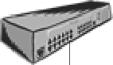

POE
Device

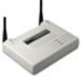

Access Point

As you will learn in Chapter 11 (Site Surveying Fundamentals), the best places to install
access points or bridges for RF connectivity often have no power source. Therefore, PoE
can be a great help in implementing a well-designed wireless network. Some
manufacturers allow for _only_ PoE to power up their devices, not standard AC power.

**Common PoE Options**

PoE devices are available in several types.

     - Single-port DC voltage injectors

     - Multi-port DC voltage injectors

     - Ethernet switches designed to inject DC voltage on each port on a given pair of
pins

Although configuration and management is generally not necessary for a PoE device,
there are some caveats to be aware of if and when you begin to implement PoE.

First, there is no industry standard on implementation of PoE. This means that the
manufacturers of PoE equipment have not worked together and agreed on how this
equipment should interface with other devices. If you are using a wireless device such as
an access point and will be powering it using PoE, it is recommended that you purchase
the PoE device from the same manufacturer as the access point. This recommendation
holds true for any device when considering powering with PoE.

Second, and similar in nature to the first caveat, is that the output voltage required to
power a wireless LAN device differs from manufacturer to manufacturer. This caveat is
another reason to use the same vendor's equipment when using PoE. When in doubt, ask
the manufacturer or the vendor from whom the equipment was purchased.

Finally, the unused pins used to carry the current over Ethernet are not standardized. One
manufacturer may carry power on pins 4 and 5, while another carries power on pins 7 and

CWNA Study Guide © Copyright 2002 Planet3 Wireless, Inc.

--- end of page=147 ---

Chapter 5 – Antennas and Accessories **120**

8. If you connect a cable carrying power on pins 4 and 5 to an access point that does not
accept power on those pins, the access point will not power up.

**Single-port DC Voltage Injectors**

Access points and bridges that specify mandatory use of PoE include single-port DC
voltage injectors for the purpose of powering the unit. See Figure 5.17 below for an
example of a single-port DC voltage injector. These single-port injectors are acceptable
when used with a small number of wireless infrastructure devices, but quickly become a
burden, cluttering wiring closets, when building medium or large wireless networks.

**FIGURE 5.17** A single-port PoE injector

**Multi-port DC Voltage Injectors**

Several manufacturers offer multi-port injectors including 4, 6, or 12-port models. These
models may be more economical or convenient for installations where many devices are
to be powered through the Cat5 cable originating in a single wiring closet or from a
single switch. Multi-port DC voltage injectors typically operate in exactly the same
manner as their single-port counterparts. See Figure 5.18 for an example of a multi-port
PoE injector. A multi-port DC voltage injector looks like an Ethernet switch with twice
as many ports. A multi-port DC voltage injector is a pass-through device to which you
connect the Ethernet switch (or hub) to the input port, and then connect the PoE client
device to the output device, both via Cat5 cable. The PoE injector connects to an AC
power source in the wiring closet. These multi-port injectors are appropriate for mediumsized wireless network installations where up to 50 access points are required, but in
large enterprise rollouts, even the most dense multi-port DC voltage injectors combined
with Ethernet hubs or switches can become cluttered when installed in a wiring closet.

**FIGURE 5.18** A multi-port PoE injector

CWNA Study Guide © Copyright 2002 Planet3 Wireless, Inc.

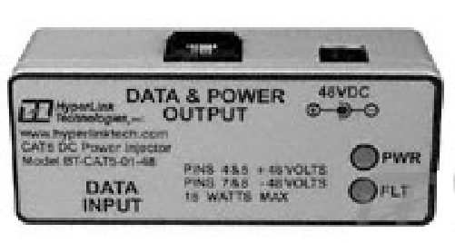

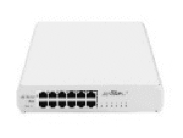

--- end of page=148 ---

**121** Chapter 5 – Antennas and Accessories

**Active Ethernet Switches**

The next step up for large enterprise installations of access points is the implementation
of active Ethernet switches. These devices incorporate DC voltage injection into the
Ethernet switch itself allowing for large numbers of PoE devices without any additional
hardware in the network. See Figure 5.19 for an example of an Active Ethernet switch.
Wiring closets will not have any additional hardware other than the Ethernet switches
that would already be there for a non-PoE network. Several manufacturers make these
switches in many different configurations (number of ports). In many Active Ethernet
switches, the switch can auto-sense PoE client devices on the network. If the switch does
not detect a PoE device on the line, the DC voltage is switched off for that port.

**FIGURE 5.19** An Active Ethernet switch

As you can see from the picture, an Active Ethernet switch looks no different from an
ordinary Ethernet switch. The only difference is the added internal functionality of
supplying DC voltage to each port.

**PoE Compatibility**

Devices that are not "PoE Compatible" can be converted to Power-over-Ethernet by way
of a DC "picker" or "tap". These are sometimes called Active Ethernet "splitters". This
device picks-off the DC voltage that has been injected into the CAT5 cable by the
injector and makes it available to the equipment through the regular DC power jack.

In order to use Power-over-Ethernet one of the two following device combinations are
needed:

(Injector) + (PoE compatible device)

or

(Injector) + (non-PoE compatible device) + (Picker)

**Types of Injectors**

There are 2 basic types of Injectors available: _passive_ and _fault protected_ . Each type is
typically available in a variety of voltage levels and number of ports.

_Passive injectors_ place a DC voltage onto a CAT5 cable. These devices provide no
short-circuit or over-current protection.

CWNA Study Guide © Copyright 2002 Planet3 Wireless, Inc.

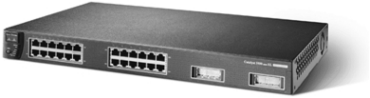

--- end of page=149 ---

Chapter 5 – Antennas and Accessories **122**

_Fault protected injectors_ provide continuous fault monitoring and protection to detect
short circuits and over-current conditions in the CAT5 cable.

**Types of Picker / Taps**

Two basic types of pickers and taps are available: _passive_ and _regulated_ . A passive tap
simply takes the voltage from the Cat5 cable and directs it to the equipment for direct
connection. Therefore, if the injector injects 48 VDC (Volts of Direct Current), then 48
VDC will be produced at the output of the passive tap.

A regulated tap takes the voltage on the Cat5 cable and converts it to another voltage.
Several standard regulated voltages are available (5 VDC, 6 VDC, & 12 VDC) allowing a
wide variety of non-PoE equipment to be powered through the Cat5 cable.

**Voltage and Pinout Standards**

Although the IEEE and other industry groups are trying to create PoE standards, a
definitive standard has yet to be introduced. At present, different equipment vendors use
different PoE voltages and Cat5 pin configurations to provide the DC power. Therefore,
it is important to select the appropriate PoE devices for each piece of equipment you plan
to power through the Cat5 cable. The IEEE has standardized on the use of 48 VDC as
the injected PoE voltage. The use of this higher voltage reduces the current flowing
through the Cat5 cable and therefore increases the load and increases the Cat5 cable
length limitations. Where the maximum cable length has not been a major consideration,
some vendors have chosen 24 VDC and even 12 VDC as their injected voltage.

**Fault Protection**

The primary purpose of fault protection is to protect the cable, the equipment, and the
power supply in the event of a fault or short-circuit. During normal operation, a fault
may never occur in the Cat5 cable. However, there are many ways a fault might be
introduced into the Cat5 cable, including the following examples:

  - The attached device may be totally incompatible with PoE and may have some
non-standard or defective connection that short-circuits the PoE conductors. At
present, most non-PoE devices have no connection on the PoE pins.

  - Incorrectly wired Cat5 cabling. Cut or crushed Cat5 cable, in which the
insulation on one or more of the conductors have come in contact with each other
or another conducting material.

During any fault condition, the fault-protection circuit shuts off the DC voltage injected
onto the cable. Fault protection circuit operation varies from model to model. Some
models continuously monitor the cable and restore power automatically once the fault is
removed. Some models must be manually reset by pressing a reset button or cycling
power.

CWNA Study Guide © Copyright 2002 Planet3 Wireless, Inc.

--- end of page=150 ---

**123** Chapter 5 – Antennas and Accessories

##### Wireless LAN Accessories

When the time comes to connect all of your wireless LAN devices together, you will
need to purchase the appropriate cables and accessories that will maximize your
throughput, minimize your signal loss, and, most importantly, allow you to make the
connections correctly. This section will discuss the different types of accessories and
where they fit into a wireless LAN design. The following types of accessories are
discussed in this section:

      - RF Amplifiers

      - RF Attenuators

      - Lightning Arrestors

      - RF Connectors

      - RF Cables

      - RF Splitters

Each of these devices is important to building a successful wireless LAN. Some items
are used more than others, and some items are mandatory whereas others are optional. It
is likely that an administrator will have to install and use all of these items multiple times
while implementing and managing a wireless LAN.

**RF Amplifiers**

As its name suggests, an RF amplifier is used to amplify, or increase the amplitude of, an
RF signal, which is measured in +dB. An amplifier will be used when compensating for
the loss incurred by the RF signal, either due to the distance between antennas or the
length of cable from a wireless infrastructure device to its antenna. Most RF amplifiers
used with wireless LANs are powered using DC voltage fed onto the RF cable with a DC
injector near the RF signal source (such as the access point or bridge).

Sometimes this DC voltage used to power RF amplifiers is called "phantom voltage"
because the RF amplifier seems to magically power up. This DC injector is powered
using AC voltage from a wall outlet, so it might be located in a wiring closet. In this
scenario, the RF cable carries both the high frequency RF signal and the DC voltage
necessary to power the in-line amplifier, which, in turn, boosts the RF signal amplitude.
Figure 5.20 shows an example of an RF amplifier (left), and how an RF amplifier is
mounted on a pole (right) between the access point and its antenna.

CWNA Study Guide © Copyright 2002 Planet3 Wireless, Inc.

--- end of page=151 ---

Chapter 5 – Antennas and Accessories **124**

**FIGURE 5.20** A sample of a fixed-gain RF amplifier

RF amplifiers come in two types: unidirectional and bi-directional. Unidirectional
amplifiers compensate for the signal loss incurred over long RF cables by increasing the
signal level before it is injected into the transmitting antenna. Bi-directional amplifiers
boost the effective sensitivity of the receiving antenna by amplifying the received signal
before it is fed into the access point, bridge, or client device.

**Common Options**

Within each type of amplifier, there are two types: fixed gain and variable gain. Fixed
gain amplifiers offer a fixed amount of gain to your RF signal; whereas variable gain
amplifiers allow you to manually configure the amount of gain that you require from the
amplifier. To choose which RF amplifier to integrate into your wireless LAN, there are
some other variables that will help you decide.

First, before you ever get to a point of deciding which amplifier to purchase, you should
already know the amplifier specification requirements. Once you know the impedance
(ohms), gain (dB), frequency response (range in GHz), VSWR, input (mW or dBm), and
output (mW or dBm) specifications, you are ready to select an RF amplifier.

Frequency response is likely the first criteria you will decide upon. If a wireless LAN
uses the 5 GHz frequency spectrum, an amplifier that works only in the 2.4 GHz
frequency spectrum will not work. Determine how much gain, input, and output power is
required by performing the necessary RF math calculations. The amplifier should match
impedances with all of the other wireless LAN hardware between the transmitter and the
antenna. Generally, wireless LAN components have an impedance of 50 ohms; however,
it is always a good idea to check the impedance of every component on a wireless LAN.

The amplifier must be connected into the network, so an amplifier should be chosen with
the same kinds of connectors as the cables and/or antennas to which the amplifier will be
connected. Typically, RF amplifiers will have either SMA or N-Type connectors. SMA
and N-Type connectors perform well and are widely used.

CWNA Study Guide © Copyright 2002 Planet3 Wireless, Inc.

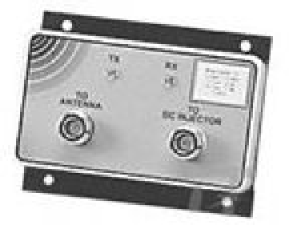

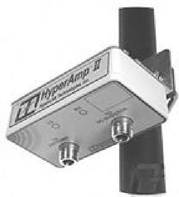

--- end of page=152 ---

**125** Chapter 5 – Antennas and Accessories

**Configuration & Management**

RF amplifiers used with wireless LANs are installed in series with the main signal path as
seen below in Figure 5.21. Amplifiers are typically mounted to a solid surface using
screws through the amplifier’s flange plates. Configuration of RF amplifiers is not
generally required unless the amplifier is a variable RF amplifier. If the amplifier is
variable, the amplifier must be configured for the proper amount of amplification
required, according to your RF math calculations. The manufacturer's user manual will
explain how to program or configure the amplifier.

**FIGURE 5.21** RF amplifier placement in the wireless LAN system

Access Point Amplifier

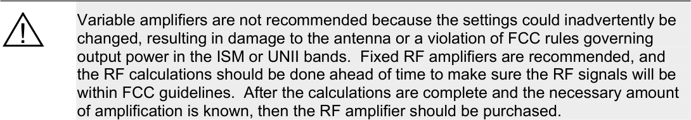

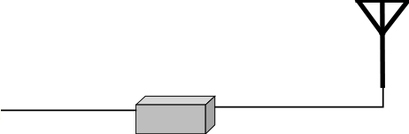

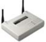

**RF Attenuators**

An RF attenuator is a device that causes precisely measured loss (in –dB) in an RF signal.
While an amplifier will increase the RF signal, an attenuator will decrease it. Why would
you need or want to _decrease_ your RF signal? Consider the case where an access point
has a fixed output of 100mW, and the only antenna available is an omni-directional
antenna with +20 dBi gain. Using this equipment together would violate FCC rules for
power output, so an attenuator could be added to decrease the RF signal down to 30mW
before it entered the antenna. This configuration would put the power output within FCC
parameters. Figure 5.22 shows examples of fixed-loss RF attenuators with BNC
connectors (left) and SMA connectors (right). Figure 5.23 shows an example of an RF
step attenuator.

CWNA Study Guide © Copyright 2002 Planet3 Wireless, Inc.

--- end of page=153 ---

Chapter 5 – Antennas and Accessories **126**

**FIGURE 5.22** A sample of a fixed-loss RF attenuator

**FIGURE 5.23** A sample of a RF step attenuator (variable loss)

**Common Options**

RF attenuators are available as either fixed-loss or variable-loss. Like variable
amplifiers, variable attenuators allow the administrator to configure the amount of loss
that is caused in the RF signal with precision.

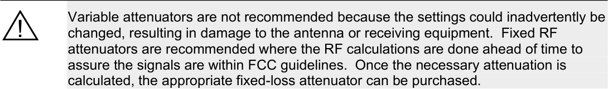

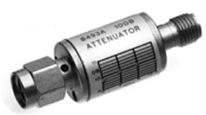

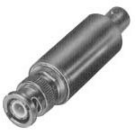

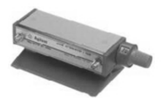

**FIGURE 5.24** RF Attenuator placement in a wireless LAN

Access Point Attenuator

In choosing what kind of attenuator is required, consider the similar items as when
choosing an RF amplifier (see above). The type of attenuator (fixed or variable loss),
impedance, ratings (input power, loss, and frequency response), and connector types
should all be part of the decision-making process.

CWNA Study Guide © Copyright 2002 Planet3 Wireless, Inc.

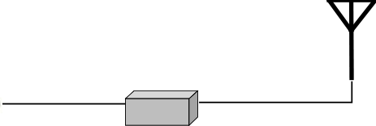

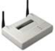

--- end of page=154 ---

**127** Chapter 5 – Antennas and Accessories

**Configuration and Management**

Figure 5.24 above shows the proper placement in a wireless LAN for an RF attenuator,
which is directly in series with the main signal path. Fixed, coaxial attenuators are
connected directly between any two connection points between the transmitter and the
antenna. For example, a fixed, coaxial antenna might be connected directly on the output
of an access point, at the input to the antenna, or anywhere between these two points if
multiple RF cables are used. Variable antennas are generally mounted to a surface with
screws through their flange plates or simply placed in a wiring closet on a shelf.

Configuration of RF attenuators is not required unless a variable attenuator is used, in
which case, the amount of attenuation required is configured according to your RF
calculations. Configuration instructions for any particular attenuator will be included in
the manufacturer's user manual.

**Lightning Arrestors**

A lightning arrestor is used to shunt transient current into the ground that is caused by
lightning. Lightning arrestors are used for protecting wireless LAN hardware such as
access points, bridges, and workgroup bridges that are attached to a coaxial transmission
line. Coaxial transmission lines are susceptible to surges from nearby lightning strikes.

A lightning arrestor can generally shunt (redirect) surges of up to 5000 Amperes at up to
50 Volts. Lightning arrestors function as follows:

1. Lightning strikes a nearby object

2. Transient currents are inducing into the antenna or the RF transmission line

3. The lightning arrestor senses these currents and immediately ionizes the gases
held internally to cause a short (a path of almost no resistance) directly to earth
ground

Figure 5.25 shows how a lightning arrestor is installed on a wireless LAN. When objects
are struck by lightning an electric field is built around that object for just an instant.
When the lightning ceases to induce electricity into the object, the field collapses. When

CWNA Study Guide © Copyright 2002 Planet3 Wireless, Inc.

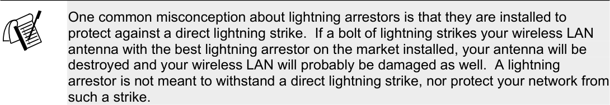

--- end of page=155 ---

Chapter 5 – Antennas and Accessories **128**

the field collapses, it induces high amounts of current into nearby objects, which, in this
case, would be your wireless LAN antenna or coaxial transmission line.

**FIGURE 5.25** A lightning arrestor installed on a network

Earth Ground

**Common Options**

There are few options on a lightning arrestor, and the cost will be between $50 - $150 for
any brand. However, there are some attributes that should be considered for any
lightning arrestor that is purchased:

      - It should meet the IEEE standard of <8 µ S

      - Reusable

      - Gas tube breakdown voltage

      - Connector types

      - Frequency response

      - Impedance

      - Insertion loss

      - VSWR rating

      - Warranty

**IEEE Standards**

Most lightning arrestors are able to trigger a short to Earth ground in under 2
microseconds ( µ S), but the IEEE specifies that this process should happen in no more
than 8 µ S. It is very important that the lightning arrestor you choose at least meet the
IEEE standard.

**Reusable**

Some lightning arrestors are reusable after a lightning strike and some are not. It is more
cost effective to own an arrestor that can be used a number of times. Reusable models

CWNA Study Guide © Copyright 2002 Planet3 Wireless, Inc.

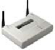

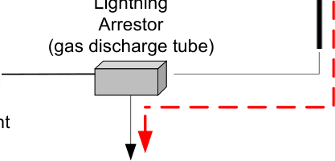

--- end of page=156 ---

**129** Chapter 5 – Antennas and Accessories

have replaceable gas discharge tube elements that are cheaper to replace than the entire
lightning arrestor. Purchase an arrestor that has a replaceable gas tube and allows for the
arrestor to be left in-line while replacing the gas tube. This feature allows you to replace
the working element of a lightning arrestor without taking the wireless LAN off line for
any length of time.

**Voltage Breakdown**

Some lightning arrestors support the passing of DC voltage for use in powering RF
amplifiers and others do not. A lightning arrestor should be able to pass the DC voltage
used in powering RF amplifiers if you plan on placing an RF amplifier closer to the
antenna than the lightning arrestor. The gas tube breakdown voltage (the voltage at
which the arrestor begins shorting current to ground) should be higher than the voltage
required to operate in-line RF amplifiers. It is suggested that you place lightning
arrestors as the last component on the RF transmission line before the antenna so that the
lightning arrestor can protect amplifiers and attenuators along with your bridge or access
point.

**Connector Types**

Make sure the connector types of the lightning arrestor you choose match those on the
cable you are planning to use on your wireless LAN. If they do not match, then adapter
connectors will have to be used, inserting more loss into the RF circuit than is necessary.

**Frequency Response**

The frequency response specification of the lightning arrestor should be at least as high as
the highest frequency used in a wireless LAN. For example, if you are using only a 2.4
GHz wireless LAN, a lightning arrestor that is specified for use at up to 3 GHz is best.

**Impedance**

The impedance of the arrestor should match all of the other devices in the circuit between
the transmitter and the antenna. Impedance is usually 50 ohms in most wireless LANs.

**Insertion Loss**

The insertion loss should be significantly low (perhaps around 0.1 dB) so as not to cause
high RF signal amplitude loss as the signal passes through the arrestor.

**VSWR Rating**

The VSWR rating of a good quality lightning arrestor will be around 1.1:1, but some may
be as high as 1.5:1. The lower the ratio of the device, the better, since reflected voltage
degrades the main RF signal.

**Warranty**

Regardless of the quality of a lightning arrestor, the unit can malfunction. Seek out a
manufacturer that offers a good warranty on their lightning arrestors. Some
manufacturers offer a highly desirable "No Matter What" type of warranty.

CWNA Study Guide © Copyright 2002 Planet3 Wireless, Inc.

--- end of page=157 ---

Chapter 5 – Antennas and Accessories **130**

**Configuration & Maintenance**

No configuration is necessary for a lightning arrestor. Lightning arrestors are installed in
series with the main RF signal path, and the grounding connection should be attached to
an Earth ground with a measurable resistance of 5 ohms or less. It is recommended that
you test an Earth ground connection with an appropriate Earth ground resistance tester
before deciding that the installation of the lightning arrestor is satisfactory. Make it a
point, along with other periodic maintenance tasks, to check the Earth ground resistance
and the gas discharge tube regularly.

**RF Splitters**

An RF Splitter is a device that has a single input connector and multiple output
connectors. An RF Splitter is used for the purpose of splitting a single signal into
multiple independent RF signals. Use of splitters in everyday implementations of
[wireless LANs is not recommended. Sometimes two 120-degree panel antennas or two](http://www.telexwireless.com/2444aax2.gif)
[90-degree panel antennas may be combined with a splitter and equal-length cables when](http://www.telexwireless.com/2444aax2.gif)
the antennas are pointing in opposite directions. This configuration will produce a bidirectional coverage area, which may be ideal for covering the area along a river or major
highway. Back-to-back 90 degree panels may be separated by as little as 10 inches or as
much as 40 inches on either side of the mast or tower. Each panel in this configuration
[may have a mechanical down tilt. The resultant gain in each of the main radiation lobes](http://www.telexwireless.com/2444x2_20in_5d.gif)
is reduced by 3 - 4 dB in these configurations.

When installing an RF splitter, the input connector should always face the source of the
RF signal. The output connectors (sometimes called "taps") are connected facing the
destination of the RF signal (the antenna). Figure 5.26 shows two examples of RF
splitters. Figure 5.27 illustrates how an RF splitter would be used in a wireless LAN
installation.

Splitters may be used to keep track of power output on a wireless LAN link. By hooking
a power meter to one output of the splitter and the RF antenna to the other, an
administrator can actively monitor the output at any given time. In this scenario, the
power meter, the antenna, and the splitter must all have equal impedance. Although not a
common practice, removing the power meter from one output of the splitter and replacing
it with a 50 ohm dummy load would allow the administrator to move the power meter
from one connection point to another throughout the wireless LAN while making output
power measurements.

CWNA Study Guide © Copyright 2002 Planet3 Wireless, Inc.

--- end of page=158 ---

**131** Chapter 5 – Antennas and Accessories

**FIGURE 5.26** Sample RF Splitters

**FIGURE 5.27** A RF Splitter installed on a network

**Choosing an RF Splitter**

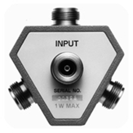

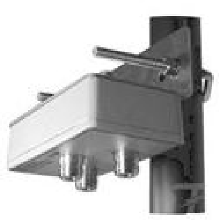

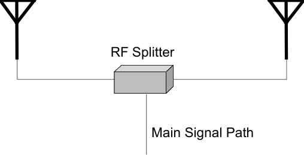

Below is a checklist of things to consider when choosing an RF splitter.

 - Insertion loss

 - Frequency response

 - Impedance

 - VSWR rating

 - High isolation impedance

 - Power ratings

 - Connector types

 - Calibration report

 - Mounting

 - DC voltage passing

CWNA Study Guide © Copyright 2002 Planet3 Wireless, Inc.

--- end of page=159 ---

Chapter 5 – Antennas and Accessories **132**

**Insertion Loss**

Low insertion loss (loss incurred by just introducing the item into the circuit) is necessary
because simply putting the splitter in the RF circuit can cause a significant RF signal
amplitude decrease. Insertion loss of 0.5 dB or less is considered good for an RF splitter.

**Frequency Response**

The frequency response specification of the splitter should be at least as high as the
highest frequency used in the wireless LAN. For example, if you are using only a 2.4
GHz wireless LAN, a splitter that is specified for use at up to 3 GHz would be best.

**Impedance**

The impedance, usually 50 ohms in most wireless LANs, of the splitter should match all
of the other devices in the circuit between the transmitter and the antenna.

**VSWR Rating**

As with many other RF devices, VSWR ratings should be as close to 1:1 as possible.
Typical VSWR ratings on RF splitters are < 1.5:1. Low VSWR ratings on splitters are
much more critical than on many other devices in an RF system, because reflected RF
power in a splitter may be reflected in multiple directions inside the splitter, affecting
both the splitter input signal and all splitter output signals.

**High Isolation Impedance**

High isolation impedance between ports on an RF splitter is important for several
reasons. First, a load on one output port should not affect the output power on another
output port of the splitter. Second, a signal arriving into the output port of a splitter (such
as the received RF signal) should be directed to the input port rather than to another
output port. These requirements are accomplished through high impedance between
output connectors. Typical isolation (resistance causing separation) is 20 dB or more
between ports. Some RF splitters have a "feature" known as reverse port isolation that
allows the outputs to be used as inputs. Using the splitter in this way allows the
administrator to connect 2 or 3 access points or bridges to the splitter, which then feeds a
single RF antenna. This configuration can save money on the purchasing and installation
of multiple RF antennas.

CWNA Study Guide © Copyright 2002 Planet3 Wireless, Inc.

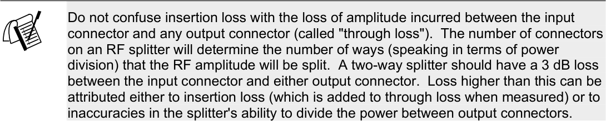

--- end of page=160 ---

**133** Chapter 5 – Antennas and Accessories

**Power Ratings**

Splitters are rated for power input maximums, which means that you are limited in the
amount of power that you can run feed into your splitter. Exceeding the manufacturer's
power rating will result in damage to the RF splitter.

**Connector Types**

RF splitters will generally have N-type or SMA connectors. It is very important to
purchase a splitter with the same connector types as the cable being used. Doing so cuts
down on adapter connectors, which reduce RF signal amplitude. This knowledge is
especially important when using splitters, since splitters already cut the signal amplitude
in an RF system.

**Calibration Report**

All RF splitters should come with a calibration report that shows insertion loss, frequency
response, through loss at each connector, etc. Having splitters calibrated once per year is
recommended so that the administrator will know if the splitter is causing any degraded
performance. Calibration requires taking the wireless LAN off line for an extended
period of time, and may not seem practical, but is necessary for continuous optimum
throughput.

**Mounting**

Mounting an RF splitter is usually a matter of putting screws through the flange plates
into whatever surface on which you the splitter will be mounted. Some models come
with pole-mounting hardware using "U" bolts, mounting plates, and standard-sized nuts.
Depending on the manufacturer, the splitter might be weatherproof, meaning it can be
mounted outside on a pole without fear of water causing problems. When this is the case,
be sure to seal cable connections and use drip loops.

**DC Voltage Passing**

Some RF splitters have the option of passing the required DC voltage to all output ports
in parallel. This feature is helpful when there are RF amplifiers, which power internal
circuitry with DC voltage originating from a DC voltage injector in a wiring closet,
located on the output of each splitter port.

**RF Connectors**

RF connectors are specific types of connection devices used to connect cables to devices
or devices to devices. Traditionally, N, F, SMA, BNC, & TNC connectors (or
derivatives) have been used for RF connectors on wireless LANs.

In 1994, the FCC & DOC (Canadian Department of Communications) ruled that
connectors for use with wireless LAN devices should be proprietary between
manufacturers. For this reason, many variations on each connector type exist such as:

      - N-type

CWNA Study Guide © Copyright 2002 Planet3 Wireless, Inc.

--- end of page=161 ---

Chapter 5 – Antennas and Accessories **134**

      - Reverse polarity N-type

      - Reverse threaded N-type

Figure 5.28 illustrates the N and SMA type connectors.

**FIGURE 5.28** Sample N-type and SMA connectors

The N Connector The SMA Connector

**Choosing an RF Connector**

There are five things that should be considered when purchasing and installing any RF
connector, and they are similar in nature to the criteria for choosing RF amplifiers and
attenuators.

1. The RF connector should match the impedance of all other wireless LAN
components (generally 50 ohms).

2. Know how much insertion loss each connector inserted into the signal path
causes. The amount of loss caused will factor into your calculations for signal
strength required and distance allowed.

3. Know the upper frequency limit (frequency response) specified for the particular
connectors. This point will be very important as 5 Ghz wireless LANs become
more and more common. Some connectors are rated only as high as 3 GHz,
which is fine for use with 2.4 GHz wireless LANs, but will not work for 5 GHz
wireless LANs. Some connectors are rated only up to 1 GHz and will not work
with wireless LANs at all, other than legacy 900 MHz wireless LANs.

4. Beware of bad quality connectors. First, always consider purchasing from a
reputable company. Second, purchase only high-quality connectors made by
name-brand manufacturers. This kind of purchasing particularity will help
eliminate many problems with sporadic RF signals, VSWR, and bad connections.

5. Make sure you know both the type of connector (N, F, SMA, etc.) that you need
and the sex of the connector. Connectors come in male and female. Male
connectors have a center pin, and female connectors have a center receptacle.

**RF Cables**

In the same manner that you must choose the proper cables for your 10 Gbps wired
infrastructure backbone, you must choose the proper cables for connecting an antenna to

CWNA Study Guide © Copyright 2002 Planet3 Wireless, Inc.

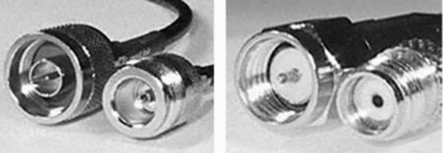

--- end of page=162 ---

**135** Chapter 5 – Antennas and Accessories

an access point or wireless bridge. Below are some criteria to be considered in choosing
the proper cables for your wireless network.

      - Cables introduce loss into a wireless LAN, so make sure the shortest cable length
necessary is used.

      - Plan to purchase pre-cut lengths of cable with pre-installed connectors. Doing so
minimizes the possibility of bad connections between the connector and the
cable. Professional manufacturing practices are almost always superior to cables
manufactured by untrained individuals.

      - Look for the lowest loss cable available at your particular price range (the lower
the loss, the more expensive the cable). Cables are typically rated for loss in
dB/100-feet. The table in Figure 5.29 illustrates the loss that is introduced by
adding cables to a wireless LAN.

      - Purchase cable that has the same impedance as all of your other wireless LAN
components (generally 50 ohms).

      - The frequency response of the cable should be considered as a primary decision
factor in your purchase. With 2.4 GHz wireless LANs, a cable with a rating of at
least 2.5 GHz should be used. With 5 GHz wireless LANs, a cable with a rating
of at least 6 GHz should be used.

**FIGURE 5.29** Coaxial cable attenuation ratings (in dB/foot at X MHz)

|LMR CABLE|30|50|150|220|450|900|1500|1800|2000|2500|
|---|---|---|---|---|---|---|---|---|---|---|
|100A|3.9|5.1|8.9|10.9|15.8|22.8|30.1|33.2|35.2|39.8|
|195|2.0|2.6|4.4|5.4|7.8|11.1|14.5|16.0|16.9|19.0|
|200|1.8|2.3|4.0|4.8|7.0|9.9|12.9|14.2|15.0|16.9|
|240|1.3|1.7|3.0|3.7|5.3|7.6|9.9|10.9|11.5|12.9|
|300|1.1|1.4|2.4|2.9|4.2|6.1|7.9|8.7|9.2|10.4|
|400|0.7|0.9|1.5|1.9|2.7|3.9|5.1|5.7|6.0|6.8|
|400UF|0.8|1.1|1.7|2.2|3.1|4.5|5.9|6.6|6.9|7.8|
|500|0.54|.70|1.2|1.5|2.2|3.1|4.1|4.6|4.8|5.5|
|600|0.42|.55|1.0|1.2|1.7|2.5|3.3|3.7|3.9|4.4|
|600UF|0.48|.63|1.15|1.4|2.0|2.9|3.8|4.3|4.5|5.1|
|900|0.29|0.37|0.66|0.80|1.17|1.70|2.24|2.48|2.63|2.98|
|1200|0.21|0.27|0.48|0.59|0.89|1.3|1.7|1.9|2.0|2.3|
|1700|0.15|0.19|0.35|0.43|0.63|0.94|1.3|1.4|1.5|1.7|

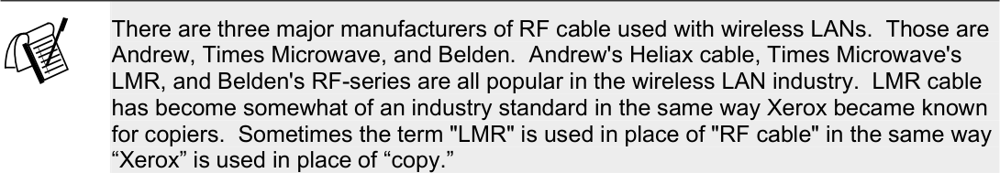

CWNA Study Guide © Copyright 2002 Planet3 Wireless, Inc.

--- end of page=163 ---

Chapter 5 – Antennas and Accessories **136**

**RF “Pigtail” Adapter Cable**

Pigtail adapter cables are used to connect cables that have industry-standard connectors to
manufacturer’s wireless LAN equipment. Pigtails are used to adapt proprietary
connectors to industry standard connectors like N-type and SMA connectors. One end of
the pigtail cable is the proprietary connector while the other end is the industry-standard
connector. Figure 5.30 shows an example of a pigtail cable.

**FIGURE 5.30** Sample RF Pigtail adapter

The DOC and FCC (United States Federal Communications Commission) ruling of June
23, 1994, stated that connectors manufactured after June 23, 1994 must be manufactured
as proprietary antenna connectors. The 1994 rule was intended to discourage use of
amplifiers, high-gain antennas, or other means of increasing RF radiation significantly.
The rules are further intended to discourage “home brew” systems which are installed by
inexperienced users and which - either accidentally or intentionally - do not comply with
FCC regulations for use in the ISM band.

Since this rule was enacted, consumers have had to obtain proprietary connectors from
manufacturers to connect to an industry standard connector. Third party manufacturers
have begun custom making these adapter cables (called "pigtails") and selling them
inexpensively on the open market.

CWNA Study Guide © Copyright 2002 Planet3 Wireless, Inc.

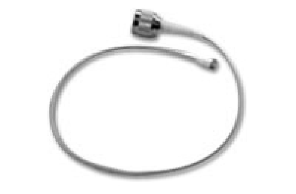

--- end of page=164 ---

**137** Chapter 5 – Antennas and Accessories

##### Key Terms

Before taking the exam, you should be familiar with the following terms:

_azimuth_

_beam_

_beamwidth_

_bi-directional amplifier_

_coverage area_

_horizontal beamwidth_

_lobe_

_narrowing_

_n-type_

_pigtails_

_point-to-multipoint_

_point-to-point_

_radiation pattern_

_SMA-type_

_transient current_

_unidirectional amplifier_

_unused pair_

_vertical beamwidth_

CWNA Study Guide © Copyright 2002 Planet3 Wireless, Inc.

--- end of page=165 ---

Chapter 5 – Antennas and Accessories **138**

##### Review Questions

1. In a small warehouse installation, you must provide the greatest coverage area
possible for the users inside the warehouse. The warehouse is free from tall
obstructions such as shelving, but has a high ceiling. You have decided to use a
low-gain omni-directional antenna to achieve your goal. For the best coverage area,
where should the antenna be installed?

A. In the center of the building on the roof

B. In the center of the building on the ceiling

C. In one of the corners of the building

D. On one of the walls of the building

2. When purchasing RF connectors, which of the following should be considered when
making your decision? Choose all that apply.

A. Impedance

B. Insertion loss

C. Gain

D. Maximum frequency allowed

3. You have been hired as a consultant to install a wireless LAN that will connect only
two buildings that are 1.5 miles apart at 11 Mbps. Which one of the following
antennas would you use?

A. Omni-directional

B. High-gain Dipole

C. High-gain Yagi

D. Parabolic dish

4. You have been hired as a consultant to install a wireless LAN that will connect two
buildings that are 10 miles apart. In this particular area, wind gusts are a problem.
Which one of the following antennas would you use?

A. High-gain Grid

B. High-gain Dipole

C. High-gain Yagi

D. Parabolic dish

CWNA Study Guide © Copyright 2002 Planet3 Wireless, Inc.

--- end of page=166 ---

**139** Chapter 5 – Antennas and Accessories

5. You have been hired as a consultant to install a wireless LAN that will connect four
buildings that are 100 meters apart. Which of the following antennas could you use?
Choose all that apply.

A. 4 dipole antennas

B. 4 patch antennas

C. 1 dipole and 3 patch antennas

D. 2 parabolic dish antennas and 2 Yagi antennas

E. 4 panel antennas

6. A wireless LAN installation has a 50-meter cable running between the access point
and a highly-directional antenna. The output signal being sent and received is very
weak at each end of the link. What device should you add to the configuration that
would fix the problem?

A. Uni-directional amplifier

B. Bi-directional amplifier

C. Uni-directional attenuator

D. Bi-directional attenuator

7. The RF signal amplitude loss that occurs because of the natural broadening of the
RF wave front is referred to as which one of the following?

A. Fresnel zone loss

B. Coverage area loss

C. Radiation pattern loss

D. Free space path loss

8. PoE could be used in which one of the following scenarios?

A. To power an antenna that is less than 100 meters away from an access point

B. To power an antenna that is more than 100 meters away from an access point

C. To power an access point that is less than 100 meters away from a wiring
closet

D. To power an access point that is more than 100 meters away from a wiring
closet

9. You are performing an outdoor installation of an omni-directional antenna. Which
of the following will you need to do to ensure proper installation? Choose all that
apply.

A. Check that RF LOS exists with the other antennas in the installation

B. Check that visual LOS exists with the other antennas in the installation

C. Install a lightning arrestor to protect against transient currents

D. Seal all the cable connections in the series to prevent water damage

CWNA Study Guide © Copyright 2002 Planet3 Wireless, Inc.

--- end of page=167 ---

Chapter 5 – Antennas and Accessories **140**

10. Which of the following are true about PoE devices from different manufacturers?
Choose all that apply.

A. They always use the same unused pairs for sending current

B. They are guaranteed to interoperate with devices from other vendors

C. They use the same output voltage

D. They may cause damage to devices from other vendors

11. You have purchased a semi-directional antenna from Vendor A, and an access point
from Vendor B. What type of cables or connectors will you need to complete the
link between the two?

A. An RF cable with industry standard connectors and a pigtail cable with
appropriate connectors

B. An RF cable with connectors matching the access point and a pigtail cable with
appropriate connectors for the antenna and RF cable connection

C. An RF cable with N connectors and a pigtail with N connectors on both sides

D. An RF cable with SMA connectors and a pigtail with N connectors on both
sides

12. An antenna’s beamwidth refers to which one of the following?

A. The width of the RF signal beam that the antenna transmits

B. The width of the antenna main element

C. The width of the mounting beam on which the antenna is mounted

D. The width of the beam of the RF signal relative to the Earth's surface

13. When should an omni-directional antenna be used?

A. When coverage in all horizontal directions from the antenna is required

B. When coverage in a specific direction is required

C. When coverage is required over more than 7 miles in a specific direction

D. Indoors only, for short-range coverage of non-roaming wireless LAN clients

14. Which of the following are names of semi-directional antenna types? Choose all
that apply.

A. Yagi

B. Omni

C. Patch

D. Panel

E. Point-to-point

CWNA Study Guide © Copyright 2002 Planet3 Wireless, Inc.

--- end of page=168 ---

**141** Chapter 5 – Antennas and Accessories

15. The coverage area of a Yagi antenna is ONLY in the direction that the antenna is
pointing. This statement is:

A. Always true

B. Always false

C. Sometimes true, depending on the antenna manufacturer

D. Depends on how the antenna itself is installed

16. Polarization is defined as which one of the following?

A. The direction of the RF antenna in relation to the north and south poles

B. The magnetic force behind the antenna element

C. The power sources of an antenna that cause the antenna to transmit signal in
more than one direction

D. The physical orientation of the antenna in a horizontal or vertical position

17. Which one of the following is an accurate description of an access point with
vertically polarized antennas?

A. Both antennas are standing perpendicular to the Earth's surface

B. Both antennas are standing parallel to the Earth's surface

C. One antenna is parallel to the Earth's surface and the other is perpendicular to
the Earth's surface

18. What is the unit of measurement for gain as related to an RF antenna?

A. Decibels

B. Watts

C. dBi

D. dBm

E. dB

19. Which one of the following defines Free Space Path Loss?

A. The loss incurred by an RF signal whose path has crossed a large free space

B. What occurs as an RF signal is deflected off of its intended path into free space

C. The loss incurred by an RF signal due largely to "signal dispersion" which is a
natural broadening of the wave front

D. The weakening of the RF signal propagation due to an infinite amount of free
space

20. Which of the following are variations of the "N-type" connector?

A. Standard N-type

B. Reverse threaded N-type

C. Reverse polarity N-type

D. Dual head N-type

CWNA Study Guide © Copyright 2002 Planet3 Wireless, Inc.

--- end of page=169 ---

Chapter 5 – Antennas and Accessories **142**

##### Answers to Review Questions

1. B. In an open area where maximum user coverage is required, using a low-gain
omni antenna makes practical and economic sense. Warehouses typically have high
ceilings, so use of a high-gain omni might not be effective for users below the
antenna. Mounting the antenna near the center of the intended coverage area in an
out-of-the-way place like the ceiling is most effective.

2. A, B, D. Making sure the connector you choose has the right impedance for your
system, has a low insertion loss, and supports frequencies at least as high as the
circuit with which you'll be using it are critical. There is a vast range of quality in
connector choices where seemingly the same connector might cost $1.00 from one
manufacturer and $20.00 from another. Typically, the more expensive manufacturer
has made their connector to exacting standards and fully guarantees their product.

3. C. Yagi antennas are most often used on short to medium length building-tobuilding bridging up to 2 miles. Patch and panel antennas are more typically used
on short range building-to-building and in-building directional links and Parabolic
Dish antennas are more often used on very long distance links such as 2-25 miles.
Omni-directional and dipole antennas are the same thing and are mostly used
indoors. If omni antennas are used outdoors, the required coverage area is often
relatively small.

4. A. While both parabolic dish and grid antennas will perform the function of
connecting building miles apart, the grid antenna is designed for maximum
resistance to wind loading by being perforated to let the wind pass through it. A
parabolic dish in this scenario would likely cause intermittent service for the
wireless link due to wind loading.

5. A, C. In this very short-range scenario, 4 omni-directional antennas such as dipoles
could be used. The better scenario for security reasons is to use a single omnidirectional antenna and three semi-directional antennas using only as much power at
each antenna as necessary. This configuration forms a hub-n-spoke topology, which
is commonly used in such point-to-multipoint scenarios.

6. B. By adding a bi-directional amplifier to this scenario, the signal produced by the
access point will be amplified before the antenna transmits the signal. Even though
the received signal is the same amplitude as before, the bi-directional amplifier
boosts the signal before it enters the access point so that the signal is above the
amplitude threshold of the access point.

7. D. Free Space Path Loss or just "Path Loss" is the reason that the amplitude of the
RF signal at the receiver is significantly less than what was transmitted. Path Loss is
a result of both the natural broadening of the wave front and the size of the receiving
aperture.

8. C. Power over Ethernet is used for getting DC power to an access point from a
power injector. Access points located further than 100 meters from a wiring closet
(where the injector will be located) will not have the luxury of PoE because the DC
power is sent over the same cable as the data. Since Cat5 cable can only extend to
100 meters and still be used for reliable data transmission, PoE should not be used
on cable lengths over 100 meters.

CWNA Study Guide © Copyright 2002 Planet3 Wireless, Inc.

--- end of page=170 ---

**143** Chapter 5 – Antennas and Accessories

9. A, C, D. RF line of sight is critical for the proper functioning of any wireless LAN
link. Not having line of sight means that throughput will be reduced, possibly
significantly. Installing lightning arrestors, sealing connectors that are outside the
building, proper grounding, and lightning rods may all be significant parts of an
outdoor installation. Visual line of sight is not necessary in order to have a good RF
connection. Fog, smog, rain, snow, or long distances might for good RF LOS and
no Visual LOS.

10. D. Since no standard yet exists for PoE, manufacturers implement PoE in various
ways. Various voltages and polarities are used as well as different sets of unused
pins in the Cat5 cable. Be careful not to damage your wireless LAN equipment by
using PoE equipment from one vendor and wireless LAN equipment from another.
PoE is sometimes called Power-over-LAN as well.

11. B. A pigtail cable is used to adapt two different kinds of connectors. Typically one
of the connectors is an industry standard type such as an N type or SMA, but not
necessarily. Having the RF cable’s connector match the access point’s connector
saves from having to purchase separate adapter connectors, which would insert more
loss into the circuit. The pigtail cable will be attached to the RF cable and the
antenna.

12. A. Beamwidth refers to the angle of transmission (for both horizontal and vertical)
from an antenna. For example, a patch antenna might have a 45-degree vertical
beamwidth and a 65-degree horizontal beamwidth whereas a dipole antenna might
have a 40-degree vertical beamwidth and would have a 360-degree horizontal
beamwidth.

13. A. Omni-directional antennas radiate in a 360-degree field around the element,
providing complete coverage in the shape of a doughnut horizontally around the
antenna.

14. A, C, D. Yagi, Patch, and Panel antennas are common types of semi-directional
antennas that loosely focus their radiation pattern in general direction.

15. B. Yagi antennas always have a back lobe and sometimes have significant side
lobes as well. The size of these lobes depends on the gain and design of the antenna.
Whether or not the side and rear lobes are used effectively is irrelevant to this
question. The lobes are there regardless of whether or not they are used. Sometimes
these lobes can even interfere with other systems when care is not taken to aim them
properly or to block them with obstacles.

16. D. Since the electric field around the antenna is parallel with the radiating element,
and the electric field defines the polarization, the orientation of the antenna
determines whether the antenna is vertically or horizontally polarized.

17. A. If the access point is sitting on a flat platform and if its antennas are oriented
such that they are vertical (perpendicular to the Earth's surface), then it is vertically
polarized. Both of the diversity antennas commonly found on access points should
be oriented in the same fashion. It is not uncommon to get better reception with
horizontally polarized antennas when using PCMCIA cards in laptop computer. It
all depends on the mounting and positioning of the access point and the relative
location of the laptop computers.

CWNA Study Guide © Copyright 2002 Planet3 Wireless, Inc.

--- end of page=171 ---

Chapter 5 – Antennas and Accessories **144**

18. C. The unit of measure "dBi" means an amount of gain relative to an isotropic
radiator. Isotropic radiators are spheres that radiate RF in all directions
simultaneously such as the sun. We are unable to make such an isotropic radiator,
so any amount of horizontal squeezing of this sphere is considered gain over the
distance that the isotropic radiator would have radiated the signal. Decibels, or
“dB”, are the unit of measure used to measure gain or loss of an RF signal while in a
copper conductor or waveguide.

19. C. When thinking of Path Loss, consider blowing a bubble with chewing gum. As
the bubble gets larger, the amount of gum at any point on the surface gets thinner. If
a one-inch square section of this bubble were taken while the bubble is small, more
gum would be gathered than if the same amount of gum were taken when the bubble
is much larger. This natural broadening of the wavefront thins the amount of power
that a receiver can gather. The one-inch section of gum represents how much power
the receiving aperture (antenna element) can receive.

20. A, B, C. Due to the Canadian Department of Communications and FCC regulations
implemented in 1994, manufacturers had to produce proprietary connectors for their
wireless LAN equipment. Because of this fact, many different variations on
connector types have been created. A good example is the N-type connector. There
are standard, reverse threaded, and reverse polarity N-type connectors on the market
today. There's no such thing as a dual head N-type connector.

CWNA Study Guide © Copyright 2002 Planet3 Wireless, Inc.

--- end of page=172 ---
