# Chapter 7 - 802.11 Network Architecture

_PDF pages 196-229_

##### 802.11 Network Architecture

**CWNA Exam Objectives Covered:**

- Identify and apply the processes involved in authentication and
association:

 - Authentication

 - Association

 - Open System authentication

 - Shared Key authentication

 - Secret keys & certificates

 - AAA Support

- Recognize the following concepts associated with wireless
LAN Service Sets:

 - BSS

 - ESS

 - IBSS

 - SSID

 - Infrastructure Mode

 - Ad hoc Mode

 - Roaming

- Understand the implications of the following power
management features of wireless LANs:

 - PSP Mode

 - CAM

 - Beacons

 - TIM

 - ATIM

 - ATIM Windows

CWNA Study Guide © Copyright 2002 Planet3 Wireless, Inc.

CHAPTER CHAPTER
# 7 5

**In This Chapter**

Locating a wireless LAN

Authentication &
Association

Service Sets

Power Management
Features

--- end of page=195 ---

Chapter 7 – 802.11 Network Architecture **168**

This chapter covers some of the key concepts found in the 802.11 network architecture.
Most of the topics in this chapter are defined directly in the 802.11 standard, and are
required for implementation of 802.11-compliant hardware. In this chapter, we’re going
to examine the process by which clients connect to an access point, the terms used for
organizing wireless LANs, and how power management is accomplished in wireless
LAN client devices.

Without a solid understanding of the principals covered in this chapter, it would be quite
difficult to design, administer, or troubleshoot a wireless LAN. This chapter holds some
of the most elementary steps of both wireless LAN design and administration. As you
administer wireless LANs, the understanding of these concepts will allow you to more
intelligently manage your day-to-day operations.

##### Locating a Wireless LAN

When you install, configure, and finally start up a wireless LAN client device such as a
USB client or PCMCIA card, the client will automatically “listen" to see if there is a
wireless LAN within range. The client is also discovering if it can associate with that
wireless LAN. This process of listening is called _scanning_ . Scanning occurs before any
other process, since scanning is how the client _finds_ the network.

There are two kinds of scanning: passive scanning and active scanning. In finding an
access point, client stations follow a trail of breadcrumbs left by the access point. These
breadcrumbs are called service set identifiers (SSID) and beacons. These tools serve as a
means for a client station to find any and all access points.

**Service Set Identifier**

The service set identifier (SSID) is a unique, case sensitive, alphanumeric value from 232 characters long used by wireless LANs as a network name. This naming handle is
used for segmenting networks, as a rudimentary security measure, and in the process of
joining a network. The SSID value is sent in beacons, probe requests, probe responses,
and other types of frames. A client station must be configured for the correct SSID in
order to join a network. The administrator configures the SSID (sometimes called the
ESSID) in each access point. Some stations have the ability to use any SSID value
instead of only one manually specified by the administrator. If clients are to roam
seamlessly among a group of access points, the clients and all access points must be
configured with matching SSIDs. The most important point about an SSID is that it must
match EXACTLY between access points and clients.

**Beacons**

Beacons (short for _beacon management frame_ ) are short frames that are sent from the
access point to stations (infrastructure mode) or station-to-station (ad hoc mode) in order
to organize and synchronize wireless communication on the wireless LAN. Beacons
serve several functions, including the following.

CWNA Study Guide © Copyright 2002 Planet3 Wireless, Inc.

--- end of page=196 ---

**169** Chapter 7 – 802.11 Network Architecture

**Time Synchronization**

Beacons synchronize clients by way of a time-stamp at the exact moment of transmission.
When the client receives the beacon, it changes its own clock to reflect the clock of the
access point. Once this change is made, the two clocks are synchronized. Synchronizing
the clocks of communicating units will ensure that all time-sensitive functions, such as
hopping in FHSS systems, are performed without error. The beacon also contains the
beacon interval, which informs stations how often to expect the beacon.

**FH or DS Parameter Sets**

Beacons contain information specifically geared to the spread spectrum technology the
system is using. For example, in a FHSS system, hop and dwell time parameters and hop
sequence are included in the beacon. In a DSSS system, the beacon contains channel
information.

**SSID Information**

Stations look in beacons for the SSID of the network they wish to join. When this
information is found, the station looks at the MAC address of where the beacon
originated and sends an authentication request in hopes of associating with that access
point. If a station is set to accept any SSID, then the station will attempt to join the
network through the first access point that sends a beacon or the one with the strongest
signal strength if there are multiple access points.

**Traffic Indication Map (TIM)**

The TIM is used an as indicator of which sleeping stations have packets queued at the
access point. This information is passed in each beacon to all associated stations. While
sleeping, synchronized stations power up their receivers, listen for the beacon, check the
TIM to see if they are listed, then, if they are not listed, they power down their receivers
and continue sleeping.

**Supported Rates**

With wireless networks, there are many supported speeds depending on the standard of
the hardware in use. For example, an 802.11b compliant device supports 11, 5.5, 2, & 1
Mbps speeds. This capability information is passed in the beacons to inform the stations
what speeds are supported on the access point.

There is more information passed within beacons, but this list covers everything that
could be considered important from an administrator's point of view.

**Passive Scanning**

Passive scanning is the process of listening for beacons on each channel for a specific
period of time after the station is initialized. These beacons are sent by access points

CWNA Study Guide © Copyright 2002 Planet3 Wireless, Inc.

--- end of page=197 ---

Chapter 7 – 802.11 Network Architecture **170**

(infrastructure mode) or client stations (ad hoc mode), and the scanning station catalogs
characteristics about the access points or stations based on these beacons. The station
searching for a network listens for beacons until it hears a beacon listing the SSID of the
network it wishes to join. The station then attempts to join the network through the
access point that sent the beacon. Passive scanning is illustrated in Figure 7.1.

In configurations where there are multiple access points, the SSID of the network the
station wishes to join may be broadcast by more than one of these access points. In this
situation, the station will attempt to join the network through the access point with the
strongest signal strength and the lowest bit error rate.

**FIGURE 7.1** Passive Scanning

Beacons

Stations continue passive scanning even after associating to an access point. Passive
scanning saves time reconnecting to the network if the client is disconnected
(disassociated) from the access point to which the client is currently connected. By
maintaining a list of available access points and their characteristics (channel, signal
strength, SSID, etc), the station can quickly locate the best access point should its current
connection be broken for any reason.

Stations will roam from one access point to another after the radio signal from the access
point where the station is connected gets to a certain low level of signal strength.
Roaming is implemented so that the station can stay connected to the network. Stations
use the information obtained through passive scanning for locating the next best access
point (or ad hoc network) to use for connectivity back into the network. For this reason,
overlap between access point cells is usually specified at approximately 20-30%. This
overlap allows stations to seamlessly roam between access points while disconnecting
and reconnecting without the user’s knowledge.

CWNA Study Guide © Copyright 2002 Planet3 Wireless, Inc.

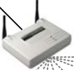

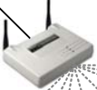

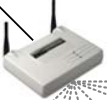

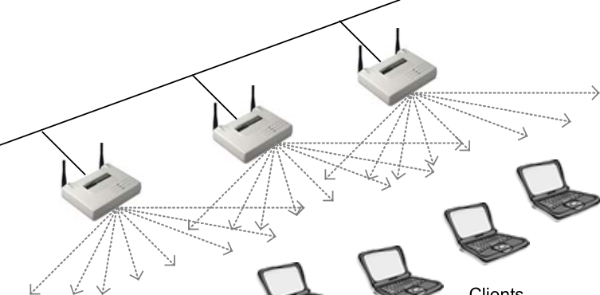

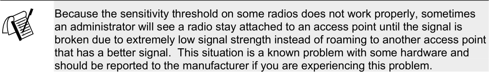

--- end of page=198 ---

**171** Chapter 7 – 802.11 Network Architecture

**Active Scanning**

Active scanning involves the sending of a probe request frame from a wireless station.
Stations send this probe frame when they are actively seeking a network to join. The
probe frame will contain either the SSID of the network they wish to join or a broadcast
SSID. If a probe request is sent specifying an SSID, then only access points that are
servicing that SSID will respond with a probe response frame. If a probe request frame is
sent with a broadcast SSID, then all access points within reach will respond with a probe
response frame, as can be seen in Figure 7.2.

The point of probing in this manner is to locate access points through which the station
can attach to the network. Once an access point with the proper SSID is found, the
station initiates the authentication and association steps of joining the network through
that access point.

**FIGURE 7.2** Active Scanning

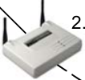

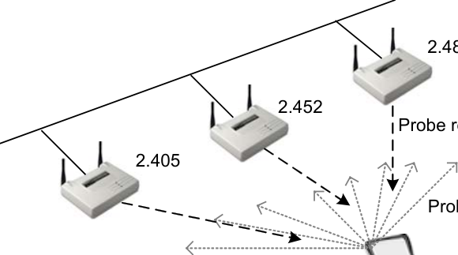

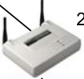

Client

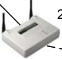

The information passed from the access point to the station in probe response frames is
almost identical to that of beacons. Probe response frames differ from beacons only in
that they are not time-stamped and they do not include a Traffic Indication Map (TIM).

The signal strength of the probe response frames that the PC Card receives back helps
determine the access point with which the PC card will attempt to associate. The station
generally chooses the access point with the strongest signal strength and lowest bit error
rate (BER). The BER is a ratio of corrupted packets to good packets typically determined
by the Signal-to-Noise Ratio of the signal. If the peak of an RF signal is somewhere near
the noise floor, the receiver may confuse the data signal with noise.

##### Authentication & Association

The process of connecting to a wireless LAN consists of two separate sub-processes.
These sub-processes always occur in the same order, and are called _authentication_ and
_association_ . For example, when we speak of a wireless PC card connecting to a wireless
LAN, we say that the PC card has been authenticated by and has associated with a certain
access point. Keep in mind that when we speak of association, we are speaking of Layer

CWNA Study Guide © Copyright 2002 Planet3 Wireless, Inc.

--- end of page=199 ---

Chapter 7 – 802.11 Network Architecture **172**

2 connectivity, and authentication pertains directly to the radio PC card, not to the user.
Understanding the steps involved in getting a client connected to an access point is
crucial to security, troubleshooting, and management of the wireless LAN.

**Authentication**

The first step in connecting to a wireless LAN is authentication. Authentication is the
process through which a wireless node (PC Card, USB Client, etc.) has its identity
verified by the network (usually the access point) to which the node is attempting to
connect. This verification occurs when the access point to which the client is connecting
verifies that the client is who it says it is. To put it another way, the access point
responds to a client requesting to connect by verifying the client’s identity before any
connection happens. Sometimes the authentication process is null, meaning that,
although both the client and access point have to proceed through this step in order to
associate, there's really no special identity required for association. This is the case when
most brand new access points and PC cards are installed in their default configuration.
We will discuss two types of authentication processes later in this chapter.

The client begins the authentication process by sending an authentication request frame to
the access point (in infrastructure mode). The access point will either accept or deny this
request, thereafter notifying the station of its decision with an authentication response
frame. The authentication process can be accomplished at the access point, or the access
point might pass along this responsibility to an upstream authentication server such as
RADIUS. The RADIUS server would perform the authentication based on a list of
criteria, and then return its results to the access point so that the access point could return
the results to the client station.

**Association**

Once a wireless client has been authenticated, the client then associates with the access
point. _Associated_ is the state at which a client is allowed to pass data through an access
point. If your PC card is associated to an access point, you are connected to that access
point, and hence, the network.

The process of becoming associated is as follows. When a client wishes to connect, the
client sends an authentication request to the access point and receives back an
authentication response. After authentication is completed, the station sends an
association request frame to the access point who replies to the client with an association
response frame either allowing or disallowing association.

**States of Authentication & Association**

The complete process of authentication and association has three distinct states:

1. Unauthenticated and unassociated

2. Authenticated and unassociated

3. Authenticated and associated

CWNA Study Guide © Copyright 2002 Planet3 Wireless, Inc.

--- end of page=200 ---

**173** Chapter 7 – 802.11 Network Architecture

**Unauthenticated and Unassociated**

In this initial state, the wireless node is completely disconnected from the network and
unable to pass frames through the access point. Access points keep a table of client
connection statuses known as the association table. It's important to note that different
vendors refer to the unauthenticated and unassociated state in their access points'
association table differently.  This table will typically show "unauthenticated" for any
client that has not completed the authentication process or has attempted authentication
and failed.

**Authenticated and Unassociated**

In this second state, the wireless client has passed the authentication process, but is not
yet associated with the access point. The client is not yet allowed to send or receive data
through the access point. The access point's association table will typically show
“authenticated.” Because clients pass the authentication stage and immediately proceed
into the association stage very quickly (milliseconds), rarely do you see the
"authenticated" step on the access point. It is far more likely that you will see
"unauthenticated" or "associated" - which brings us to the last stage.

**Authenticated and Associated**

In this final state, your wireless node is completely connected to the network and able to
send and receive data through the access point to which the node is connected
(associated). Figure 7.3 illustrates a client associating with an access point. You will
likely see "associated" in the access point's association table denoting that this client is
fully connected and authorized to pass traffic through the access point. As you can
deduce from the description of each of these three states, advanced wireless network
security measures would be implemented at the point at which the client is attempting to
authenticate.

**FIGURE 7.3** Association

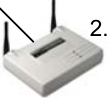

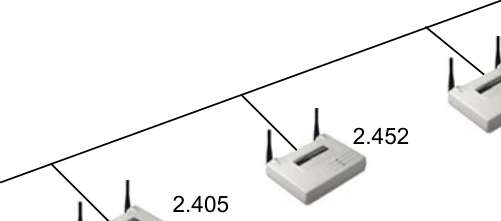

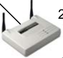

Client

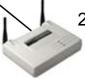

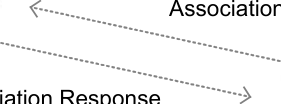

CWNA Study Guide © Copyright 2002 Planet3 Wireless, Inc.

--- end of page=201 ---

Chapter 7 – 802.11 Network Architecture **174**

**Authentication Methods**

The IEEE 802.11 standard specifies two methods of authentication: _Open System_
_authentication_ and _Shared Key authentication_ . The simpler and also the more secure of
the two methods is Open System authentication. For a client to become authenticated,
the client must walk through a series of steps with the access point. This series of steps
varies depending on the authentication process used. Below, we will discuss each
authentication process specified by the 802.11 standard, how they work, and why they are
used.

**Open System Authentication**

Open System authentication is a method of null authentication and is specified by the
IEEE 802.11 as the default setting in wireless LAN equipment. Using this method of
authentication, a station can associate with any access point that uses Open System
authentication based only on having the right service set identifier (SSID). The SSIDs
must match on both the access point and client before a client is allowed to complete the
authentication process. Uses of the SSID relating to security will be discussed in Chapter
10 (Security). The Open System authentication process is used effectively in both secure
and non-secure environments.

**Open System Authentication Process**

The Open System authentication process occurs as follows:

1. The wireless client makes a request to associate to the access point

2. The access point authenticates the client and sends a positive response and the
client becomes associated (connected)

These steps can be seen in Figure 7.4.

**FIGURE 7.4** Open System Authentication Process

Communication Process

Client A request to Access Point

authenticate is sent
to the access point

The access point
authenticates

The client connects
to the network

Open System authentication is a very simple process. As the wireless LAN
administrator, you have the option of using WEP (wired equivalent privacy) encryption
with Open System authentication. If WEP is used with the Open System authentication

CWNA Study Guide © Copyright 2002 Planet3 Wireless, Inc.

--- end of page=202 ---

**175** Chapter 7 – 802.11 Network Architecture

process, there is still no verification of the WEP key on each side of the connection
during authentication. Rather, the WEP key is used only for encrypting data once the
client is authenticated and associated.

Open System authentication is used in several scenarios, but there are two main reasons
to use it. First, Open System authentication is considered the more secure of the two
available authentication methods for reasons explained below. Second, Open System
authentication is simple to configure because it requires no configuration at all. All
802.11-compliant wireless LAN hardware is configured to use Open System
authentication by default, making it easy to get started building and connecting your
wireless LAN right out of the box.

**Shared Key Authentication**

Shared Key authentication is a method of authentication that requires use of WEP. WEP
encryption uses keys that are entered (usually by the administrator) into both the client
and the access point. These keys must match on both sides for WEP to work properly.
Shared Key authentication uses WEP keys in two fashions, as we will describe here.

**Shared Key Authentication Process**

The authentication process using Shared Key authentication occurs as follows.

1. A client requests association to an access point – this step is the same as that of
Open System authentication.

2. The access point issues a challenge to the client – this challenge is randomly
generated plain text, which is sent from the access point to the client in the clear.

3. The client responds to the challenge – the client responds by encrypting the
challenge text using the client’s WEP key and sending it back to the access point.

4. The access point responds to the client’s response – The access point decrypts the
client's encrypted response to verify that the challenge text is encrypted using a
matching WEP key. Through this process, the access point determines whether or
not the client has the correct WEP key. If the client’s WEP key is correct, the
access point will respond positively and authenticate the client. If the client’s
WEP key is not correct, the access point will respond negatively, and not
authenticate the client, leaving the client unauthenticated and unassociated.

This process is shown in Figure 7.5.

CWNA Study Guide © Copyright 2002 Planet3 Wireless, Inc.

--- end of page=203 ---

Chapter 7 – 802.11 Network Architecture **176**

**FIGURE 7.5** Shared Key Authentication Process

Communication Process

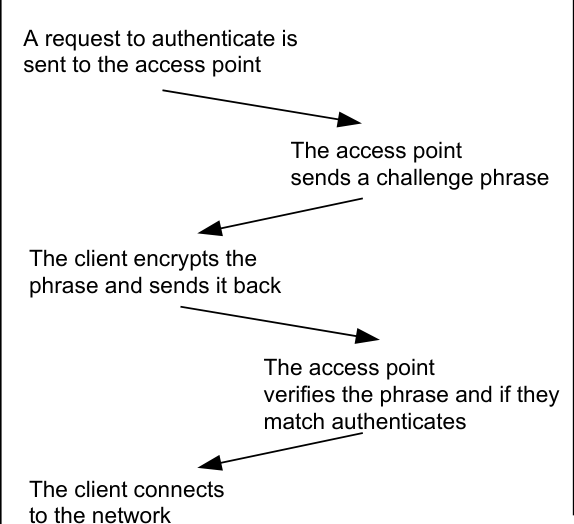

It would seem that the Shared Key authentication process is more secure than that of
Open System authentication, but as you will soon see, it is not. Rather, Shared Key
authentication opens the door for would-be hackers. It is important to understand both
ways that WEP is used. The WEP key can be used during the Shared Key authentication
process to verify a client's identity, but it can also be used for encryption of the data
payload send by the client through the access point. This type of WEP use is further
discussed in Chapter 10 (Security).

**Authentication Security**

Shared Key authentication is not considered secure because the access point transmits the
challenge text in the clear and receives the same challenge text encrypted with the WEP
key. This scenario allows a hacker using a sniffer to see both the plaintext challenge and
the encrypted challenge. Having both of these values, a hacker could use a simple
cracking program to derive the WEP key. Once the WEP key is obtained, the hacker
could decrypt encrypted traffic. It is for this reason that Open System authentication is
considered more secure than Shared Key authentication.

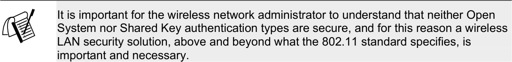

**Shared Secrets & Certificates**

Shared secrets are strings of numbers or text that are commonly referred to as the WEP
key. Certificates are another method of user identification used with wireless networks.
Just as with WEP keys, certificates (which are authentication documents) are placed on

CWNA Study Guide © Copyright 2002 Planet3 Wireless, Inc.

--- end of page=204 ---

**177** Chapter 7 – 802.11 Network Architecture

the client machine ahead of time. This placement is done so that when the user wishes to
authenticate to the wireless network, the authentication mechanism is already in place on
the client station. Both of these methods have historically been implemented in a manual
fashion, but there are applications available today that allow automation of this process.

**Emerging Authentication Protocols**

There are many new authentication security solutions and protocols on the market today,
including VPN and 802.1x using Extensible Authentication Protocol (EAP). Many of
these security solutions involve passing authentication through to authentication servers
upstream from the access point while keeping the client waiting during the authentication
phase. Windows XP has native support for 802.11, 802.1x, and EAP. Cisco and other
wireless LAN manufacturers also support these standards. For this reason, it is easy to
see that the 802.1x and EAP authentication solution could be a common solution in the
wireless LAN security market.

**802.1x and EAP**

The 802.1x (port-based network access control) standard is relatively new, and devices
that support it have the ability to allow a connection into the network at layer 2 only if
user authentication is successful. This protocol works well for access points that need the
ability to keep users disconnected if they are not supposed to be on the network. EAP is
a layer 2 protocol that is a flexible replacement for PAP or CHAP under PPP that works
over local area networks. EAP allows plug-ins at either end of a link through which
many methods of authentication can be used. In the past, PAP and/or CHAP have been
used for user authentication, and both support using passwords. The need for a stronger,
more flexible alternative is clear with wireless networks since more varied
implementations abound with wireless than with wired networks.

Typically, user authentication is accomplished using a Remote Authentication Dial-In
User Service (RADIUS) server and some type of user database (Native RADIUS, NDS,
Active Directory, LDAP, etc.). The process of authenticating using EAP is shown in
Figure 7.6. The new 802.11i standard includes support for 802.1x, EAP, AAA, mutual
authentication, and key generation, none of which were included in the original 802.11
standard. “ _AAA_ ” is an acronym for _authentication_ (identifying who you are),
_authorization_ (attributes to allow you to perform certain tasks on the network), and
_accounting_ (shows what you’ve done and where you’ve been on the network).

In the 802.1x standard model, network authentication consists of three pieces: the
supplicant, the authenticator, and the authentication server.

CWNA Study Guide © Copyright 2002 Planet3 Wireless, Inc.

--- end of page=205 ---

Chapter 7 – 802.11 Network Architecture **178**

**FIGURE 7.6** 802.1x and EAP

Client Access Point Authentication Server

Associate

EAP Identity Request

EAP Identity Response

EAP Auth Request

EAP Auth Response

EAP-Success

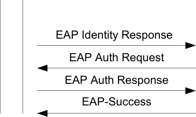

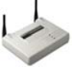

Because wireless LAN security is essential – and EAP authentication types provide the
means of securing the wireless LAN connection – vendors are rapidly developing and
adding EAP authentication types to their wireless LAN access points. Knowing the type
of EAP being used is important in understanding the characteristics of the authentication
method such as passwords, key generation, mutual authentication, and protocol. Some of
the commonly deployed EAP authentication types include:

_EAP-MD-5 Challenge_ . The earliest EAP authentication type, this essentially duplicates
CHAP password protection on a wireless LAN. EAP-MD5 represents a kind of baselevel EAP support among 802.1x devices.

_EAP-Cisco Wireless_ . Also called _LEAP_ (Lightweight Extensible Authentication
Protocol), this EAP authentication type is used primarily in Cisco wireless LAN access
points. LEAP provides security during credential exchange, encrypts data transmission
using dynamically generated WEP keys, and supports mutual authentication.

_EAP-TLS_ (Transport Layer Security). EAP-TLS provides for certificate-based, mutual
authentication of the client and the network. EAP-TLS relies on client-side and serverside certificates to perform authentication, using dynamically generated user- and
session-based WEP keys distributed to secure the connection. Windows XP includes an
EAP-TLS client, and EAP-TLS is also supported by Windows 2000.

_EAP-TTLS_ . Funk Software and Certicom have jointly developed _EAP-TTLS_ (Tunneled
Transport Layer Security). EAP-TTLS is an extension of EAP-TLS, which provides for
certificate-based, mutual authentication of the client and network. Unlike EAP-TLS,
however, EAP-TTLS requires only server-side certificates, eliminating the need to
configure certificates for each wireless LAN client.

In addition, EAP-TTLS supports legacy password protocols, so you can deploy it against
your existing authentication system (such as Active Directory or NDS). EAP-TTLS
securely tunnels client authentication within TLS records, ensuring that the user remains
anonymous to eavesdroppers on the wireless link. Dynamically generated user- and
session-based WEP keys are distributed to secure the connection.

CWNA Study Guide © Copyright 2002 Planet3 Wireless, Inc.

--- end of page=206 ---

**179** Chapter 7 – 802.11 Network Architecture

_EAP-SRP_ (Secure Remote Password). SRP is a secure, password-based authentication
and key-exchange protocol. It solves the problem of authenticating clients to servers
securely in cases where the user of the client software must memorize a small secret (like
a password) and carries no other secret information. The server carries a verifier for each
user, which allows the server to authenticate the client. However, if the verifier were
compromised, the attacker would not be allowed to impersonate the client. In addition,
SRP exchanges a cryptographically strong secret as a byproduct of successful
authentication, which enables the two parties to communicate securely.

_EAP-SIM (GSM_ ). EAP-SIM is a mechanism for Mobile IP network access authentication
and registration key generation using the GSM Subscriber Identity Module (SIM). The
rationale for using the GSM SIM with Mobile IP is to leverage the existing GSM
authorization infrastructure with the existing user base and the existing SIM card
distribution channels. By using the SIM key exchange, no other preconfigured security
association besides the SIM card is required on the mobile node. The idea is not to use
the GSM radio access technology, but to use GSM SIM authorization with Mobile IP
over any link layer, for example on Wireless LAN access networks.

It is likely that this list of EAP authentication types will grow as more and more vendors
enter the wireless LAN security market, and until the market chooses a standard.

**VPN Solutions**

VPN technology provides the means to securely transmit data between two network
devices over an unsecure data transport medium. It is commonly used to link remote
computers or networks to a corporate server via the Internet. However, VPN is also a
solution for protecting data on a wireless network. VPN works by creating a tunnel on
top of a protocol such as IP. Traffic inside the tunnel is encrypted, and totally isolated as
can be seen in Figures 7.7 and 7.8. VPN technology provides three levels of security:
user authentication, encryption, and data authentication.

 - User authentication ensures that only authorized users (over a specific device) are
able to connect, send, and receive data over the wireless network.

 - Encryption offers additional protection as it ensures that even if transmissions are
intercepted, they cannot be decoded without significant time and effort.

 - Data authentication ensures the integrity of data on the wireless network,
guaranteeing that all traffic is from authenticated devices only.

CWNA Study Guide © Copyright 2002 Planet3 Wireless, Inc.

--- end of page=207 ---

**FIGURE 7.7** Access point with an integrated VPN server

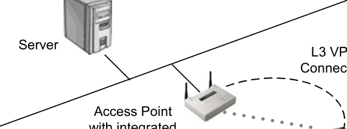

VPN server

**FIGURE 7.8** Access point with an external VPN server

Chapter 7 – 802.11 Network Architecture **180**

L2 Connection

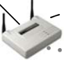

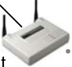

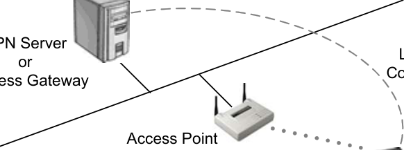

L2 Connection

Applying VPN technology to secure a wireless network requires a different approach
than when it is used on wired networks for the following reasons.

 - The inherent repeater function of wireless access points automatically forwards
traffic between wireless LAN stations that communicate together and that appear
on the same wireless network.

 - The range of the wireless network will likely extend beyond the physical
boundaries of an office or home, giving intruders the means to compromise the
network.

The ease and scalability with which wireless LAN solutions can be deployed makes them
ideal solutions for many different environments. As a result, implementation of VPN
security will vary based on the needs of each type of environment. For example, a hacker
with a wireless sniffer, if he obtained the WEP key, could decode packets in real time.
With a VPN solution, the packets would not only be encrypted, but also tunneled. This
extra layer of security provides many benefits at the access level.

CWNA Study Guide © Copyright 2002 Planet3 Wireless, Inc.

--- end of page=208 ---

**181** Chapter 7 – 802.11 Network Architecture

##### Service Sets

A _service_ _set_ is a term used to describe the basic components of a fully operational
wireless LAN. In other words, there are three ways to configure a wireless LAN, and
each way requires a different set of hardware. The three ways to configure a wireless
LAN are:

      - Basic service set

      - Extended service set

      - Independent basic service set

**Basic Service Set (BSS)**

When one access point is connected to a wired network and a set of wireless stations, the
network configuration is referred to as a basic service set (BSS). A basic service set
consists of only one access point and one or more wireless clients, as shown in Figure
7.9. A basic service set uses _infrastructure mode_         - a mode that requires use of an access
point and in which all of the wireless traffic traverses the access point. No direct clientto-client transmissions are allowed.

**FIGURE 7.9** Basic Service Set

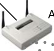

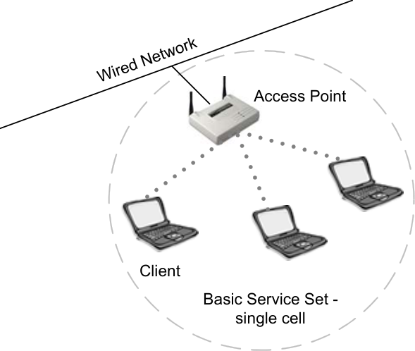

Each wireless client must use the access point to communicate with any other wireless
client or any wired host on the network. The BSS covers a single cell, or RF area, around
the access point with varying data rate zones (concentric circles) of differing data speeds,
measured in Mbps. The data speeds in these concentric circles will depend on the
technology being utilized. If the BSS were made up of 802.11b equipment, then the
concentric circles would have data speeds of 11, 5.5, 2, and 1 Mbps. The data rates get
smaller as the circles get farther away from the access point. A BSS has one unique
SSID.

CWNA Study Guide © Copyright 2002 Planet3 Wireless, Inc.

--- end of page=209 ---

Chapter 7 – 802.11 Network Architecture **182**

**Extended Service Set (ESS)**

An extended service set is defined as two or more basic service sets connected by a
common distribution system, as shown in Figure 7.10. The distribution system can be
either wired, wireless, LAN, WAN, or any other method of network connectivity. An
ESS must have at least 2 access points operating in infrastructure mode. Similar to a
BSS, all packets in an ESS must go through one of the access points.

**FIGURE 7.10** Extended Service Set

Other characteristics of extended service sets, according to the 802.11 standard, are that
an ESS covers multiple cells, allows – but does not require – roaming capabilities, and
does not require the same SSID in both basic service sets.

**Independent Basic Service Set (IBSS)**

An independent basic service set is also known as an _ad hoc_ network. An IBSS has no
access point or any other access to a distribution system, but covers one single cell and
has one SSID, as shown in Figure 7.11. The clients in an IBSS alternate the
responsibility of sending beacons since there is no access point to perform this task.

CWNA Study Guide © Copyright 2002 Planet3 Wireless, Inc.

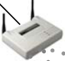

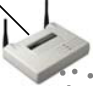

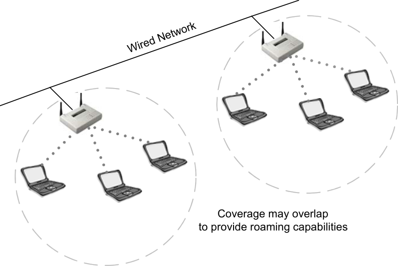

--- end of page=210 ---

**183** Chapter 7 – 802.11 Network Architecture

**FIGURE 7.11** Independent Basic Service Set

In order to transmit data _outside_ an IBSS, one of the clients in the IBSS must be acting as
a gateway, or router, using a software solution for this purpose. In an IBSS, clients make
direct connections to each other when transmitting data, and for this reason, an IBSS is
often referred to as a _peer-to-peer_ network.

**Roaming**

Roaming is the process or ability of a wireless client to move seamlessly from one cell
(or BSS) to another without losing network connectivity. Access points hand the client
off from one to another in a way that is invisible to the client, ensuring unbroken
connectivity. Figure 7.12 illustrates a client roaming from one BSS to another BSS.

When any area in the building is within reception range of more than one access point,
the cells’ coverage overlaps. Overlapping coverage areas are an important attribute of the
wireless LAN setup, because it enables seamless roaming between overlapping cells.
Roaming allows mobile users with portable stations to move freely between overlapping
cells, constantly maintaining their network connection.

CWNA Study Guide © Copyright 2002 Planet3 Wireless, Inc.

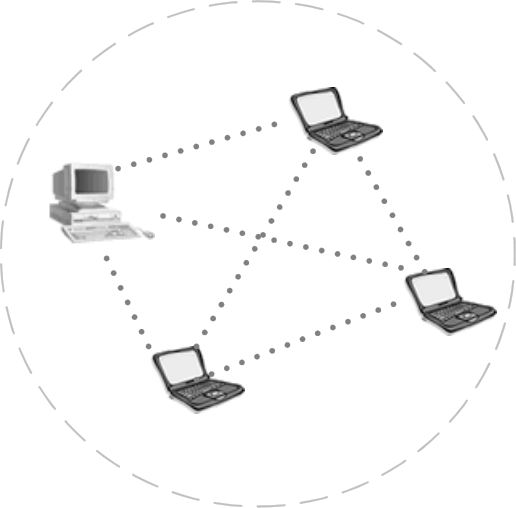

--- end of page=211 ---

Chapter 7 – 802.11 Network Architecture **184**

**FIGURE 7.12** Roaming in an ESS

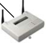

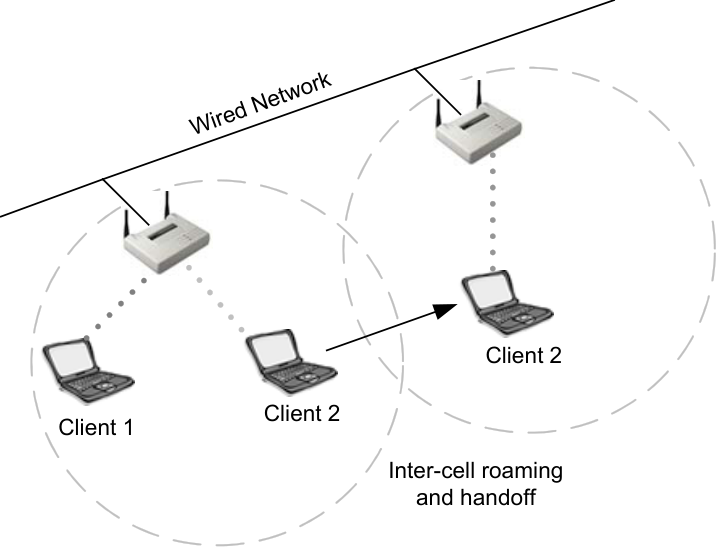

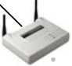

When roaming is seamless, a work session can be maintained while moving from one cell
to another. Multiple access points can provide wireless roaming coverage for an entire
building or campus.

When the coverage area of two or more access points overlap, the stations in the
overlapping area can establish the best possible connection with one of the access points
while continuously searching for the best access point. In order to minimize packet loss
during switchover, the “old” and “new” access points communicate to coordinate the
roaming process.  This function is similar to a cellular phones’ handover, with two main
differences:

  - On a packet-based LAN system, the transition from cell to cell may be performed
between packet transmissions, as opposed to telephony where the transition may
occur during a phone conversation.

  - On a voice system, a temporary disconnection may not affect the conversation,
while in a packet-based environment it significantly reduces performance
because the upper layer protocols then retransmit the data.

**Standards**

The 802.11 standard does not define how roaming should be performed, but does define
the basic building blocks. These building blocks include active & passive scanning and a
reassociation process. The reassociation process occurs when a wireless station roams
from one access point to another, becoming associated with the new access point.

The 802.11 standard allows a client to roam among multiple access points operating on
the same or separate channels. For example, every 100 ms, an access point might
transmit a beacon signal that includes a time stamp for client synchronization, a traffic
indication map, an indication of supported data rates, and other parameters. Roaming

CWNA Study Guide © Copyright 2002 Planet3 Wireless, Inc.

--- end of page=212 ---

**185** Chapter 7 – 802.11 Network Architecture

clients use the beacon to gauge the strength of their existing connection to the access
point. If the connection is weak, the roaming station can attempt to associate itself with a
new access point.

To meet the needs of mobile radio communications, the 802.11b standard must be
tolerant of connections being dropped and re-established. The standard attempts to
ensure minimum disruption to data delivery, and provides some features for caching and
forwarding messages between BSSs.

Particular implementations of some higher layer protocols such as TCP/IP may be less
tolerant. For example, in a network where DHCP is used to assign IP addresses, a
roaming node may lose its connection when it moves across cell boundaries. The node
will then have to re-establish the connection when it enters the next BSS or cell.
Software solutions are available to address this particular problem.

The 802.11b standard leaves much of the detailed functioning of what it calls the
distribution system to manufacturers. This decision was a deliberate decision on the part
of the standard designers, because they were most concerned with making the standard
entirely independent of any other existing network standards. As a practical matter, an
overwhelming majority of 802.11b wireless LANs using ESS topologies are connected to
Ethernet LANs and make heavy use of TCP/IP.  Wireless LAN vendors have stepped
into the gap to offer proprietary methods of facilitating roaming between nodes in an
ESS.

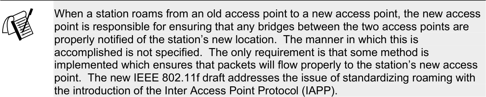

**Connectivity**

The 802.11 MAC layer is responsible for how a client associates with an access point.
When an 802.11 client enters the range of one or more access points, the client chooses
an access point to associate with (also called joining a BSS) based on signal strength and
observed packet error rates.

Once associated with the access point, the station periodically surveys all 802.11
channels in order to assess whether a different access point would provide better
performance characteristics. If the client determines that there is a stronger signal from a
different access point, the client re-associates with the new access point, tuning to the
radio channel to which that access point is set. The station will not attempt to roam until
it drops below a manufacturer-defined signal strength threshold.

**Reassociation**

Reassociation usually occurs because the wireless station has physically moved away
from the original access point, causing the signal to weaken. In other cases, reassociation

CWNA Study Guide © Copyright 2002 Planet3 Wireless, Inc.

--- end of page=213 ---

Chapter 7 – 802.11 Network Architecture **186**

occurs due to a change in radio characteristics in the building, or due simply to high
network traffic on the original access point. In the latter case, this function is known as
_load balancing_, since its primary function is to distribute the total wireless LAN load
most efficiently across the available wireless infrastructure.

Association and reassociation differ only slightly in their use. Association request frames
are used when joining a network for the first time. Reassociation request frames are used
when roaming between access points so that the new access point knows to negotiate
transfer of buffered frames from the old access point and to let the distribution system
know that the client has moved. Reassociation is illustrated in Figure 7.13.

**FIGURE 7.13** Roaming with reassociation

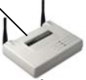

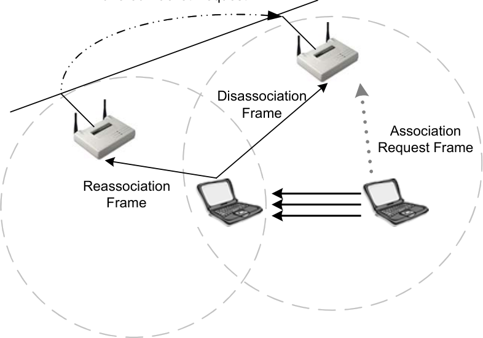

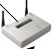

This process of dynamically associating and re-associating with access points allows
network managers to set up wireless LANs with very broad coverage by creating a series
of overlapping 802.11 cells throughout a building or across a campus.  To be successful,
the IT manager ideally will employ _channel reuse_, taking care to configure each access
point on an 802.11 DSSS channel that does not overlap with a channel used by a
neighboring access point. While there are 14 partially overlapping channels specified in
802.11 DSSS (11 channels can be used within the U.S.), there are only 3 channels that do
not overlap at all, and these are the best to use for multi-cell coverage. If two access
points are in range of one another and are set to the same or partially overlapping
channels, they may cause some interference for one another, thus lowering the total
available bandwidth in the area of overlap.

**VPN Use**

Wireless VPN solutions are typically implemented in two fashions. First, a centralized
VPN server is implemented upstream from the access points. This VPN server could be a
proprietary hardware solution or a server with a VPN application running on it. Both
serve the same purpose and provide the same type of security and connectivity. Having

CWNA Study Guide © Copyright 2002 Planet3 Wireless, Inc.

--- end of page=214 ---

**187** Chapter 7 – 802.11 Network Architecture

this VPN server (also acting as a gateway and firewall) between the wireless user and the
core network provides a level of security similar to wired VPNs.

The second approach is a distributed set of VPN servers. Some manufacturers implement
a VPN server into their access points. This type of solution would provide security for
small office and medium-sized organizations without use of an external authentication
mechanism like RADIUS. For scalability, these same access point/VPN servers typically
support RADIUS.

Tunnels are built from the client station to the VPN server, as illustrated in Figure 7.14.
When a user roams, the client is roaming between access points across layer 2
boundaries. This process is seamless to the layer 3 connectivity. However, if a tunnel is
built to the access point or centralized VPN server and a layer 3 boundary is crossed, a
mechanism of some kind must be provided for keeping the tunnel alive when the
boundary is crossed.

**FIGURE 7.14** Roaming within VPN tunnels

VPN Server Switch

**Layer 2 & 3 Boundaries**

A constraint of existing technology is that wired networks are often segmented for
manageability.  Enterprises with multiple buildings, such as hospitals or large
businesses, often implement a LAN in each building and then connect these LANs with
routers or switch-routers. This is layer 3 segmentation has two major advantages. First,
it contains broadcasts effectively, and second it allows access control between segments
on the network. This type of segmentation can also be done at layer 2 using VLANs on
switches. VLANs are often seen implemented floor-by-floor in multi-floor office
buildings or for each remote building in a campus for the same reasons. Segmenting at
layer 2 in this fashion segments the networks completely as if multiple networks were
being implemented. When using routers such as seen in figure 7.15, users must have a
method of roaming across router boundaries without losing their layer 3 connection. The
layer 2 connection is still maintained by the access points, but since the IP subnet has

CWNA Study Guide © Copyright 2002 Planet3 Wireless, Inc.

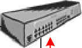

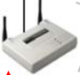

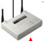

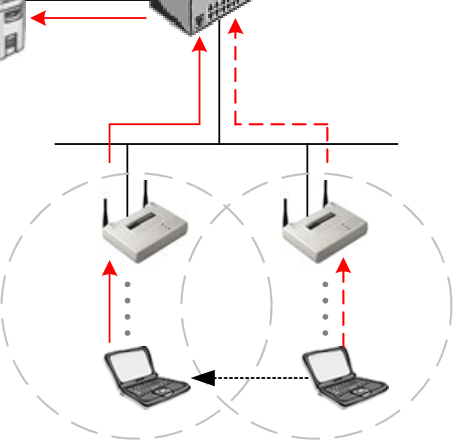

--- end of page=215 ---

Chapter 7 – 802.11 Network Architecture **188**

changed while roaming, the connection to servers, for example, will be broken. Without
subnet-roaming capability (such as with using a Mobile IP solution or using DHCP),
wireless LAN access points must all be connected to a single subnet (a.k.a. "a flat
network"). This work-around can be done at a loss of network management flexibility,
but customers may be willing to incur this cost if they perceive that the value of the end
system is high enough.

**FIGURE 7.15** Roaming across Layer 3 boundaries

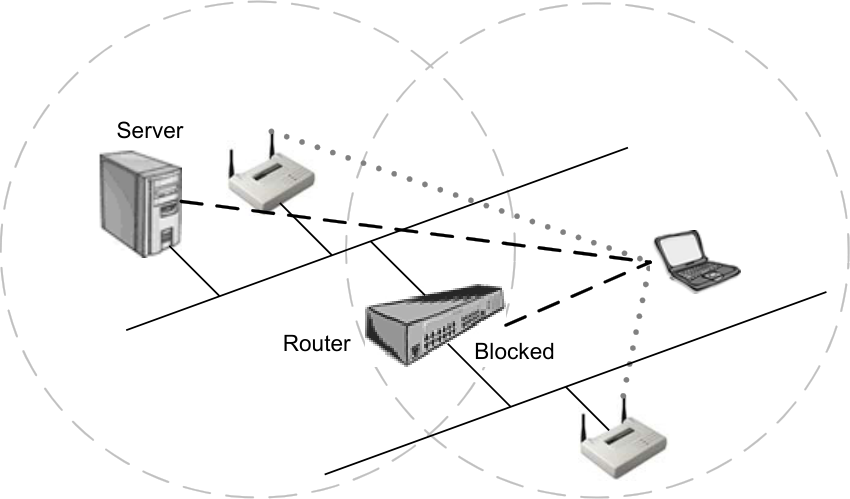

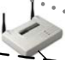

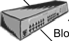

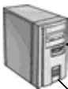

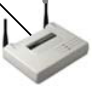

Layer 2 Connection =

Layer 3 Connection =

Many network environments (e.g., multi-building campuses, multi-floored high rises, or
older or historical buildings) cannot embrace a single subnet solution as a practical
option. This wired architecture is at odds with current wireless LAN technology. Access
points can't hand off a session when a remote device moves across router boundaries
because crossing routers changes the client device's IP address. The wired system no
longer knows where to send the message. When a mobile device reattaches to the
network, all application end points are lost and users are forced to log in again, reauthenticate, relocate themselves in their applications, and recreate lost data. The same
type of problem is incurred when using VLANs. Switches see users as roaming across
VLAN boundaries.

CWNA Study Guide © Copyright 2002 Planet3 Wireless, Inc.

--- end of page=216 ---

**189** Chapter 7 – 802.11 Network Architecture

**FIGURE 7.16** Roaming Across VLANs

Router

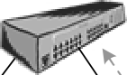

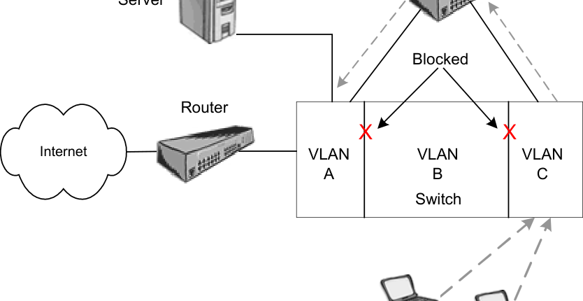

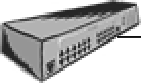

A hardware solution to this problem is to deploy all access points on a single VLAN
using a flat IP subnet for all access points so that there is no change of IP address for
roaming users and a Mobile IP solution isn't required. Users are then routed as a group
back into the corporate network using a firewall, a router, a gateway device, etc. This
solution can be difficult to implement in many instances, but is generally accepted as the
"standard" methodology. There are many more instances where an enterprise must
forego use of a wireless LAN altogether because such a solution just isn't practical.

Even with all access points on a single subnet, mobile users can still encounter coverage
problems. If a user moves out of range, into a coverage hole, or simply suspends the
device to prolong battery life, all application end points are lost and users in these
situations again are also forced to log in again and find their way back to where they left
off.

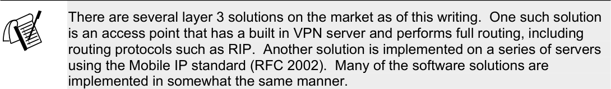

**Load Balancing**

Congested areas with many users and heavy traffic load per unit may require a multi-cell
structure. In a multi-cell structure, several co-located access points “illuminate” the same
area creating a common coverage area, which increases aggregate throughput. Stations
inside the common coverage area automatically associate with the access point that is less
loaded and provides the best signal quality.

CWNA Study Guide © Copyright 2002 Planet3 Wireless, Inc.

--- end of page=217 ---

Chapter 7 – 802.11 Network Architecture **190**

As illustrated in Figure 7.17, the stations are equally divided between the access points in
order to equally share the load between all access points. Efficiency is maximized
because all access points are working at the same low-level load. Load balancing is also
known as load sharing and is configured on both the stations and the access point in most
cases.

**FIGURE 7.17** Load balancing

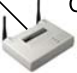

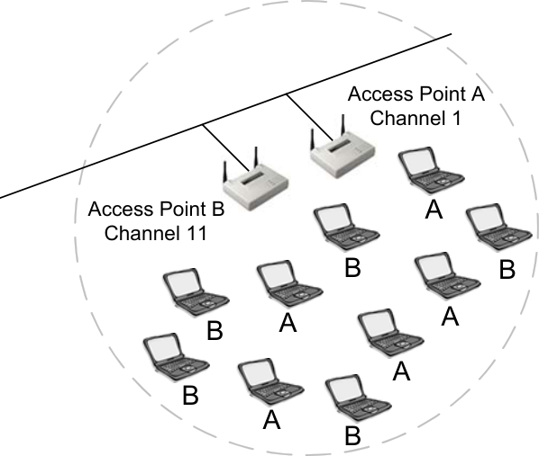

##### Power Management Features

Wireless clients operate in one of two power management modes specified by the IEEE
802.11 standard. These power management modes are active mode, which is commonly
called _continuous aware mode_ (CAM) and power save, which is commonly called _power_
_save polling_ (PSP) mode. Conserving power using a power-saving mode is especially
important to mobile users whose laptops or PDAs run on batteries. Extending the life of
these batteries allows the user to stay up and running longer without a recharge. Wireless
LAN cards can draw a significant amount of power from the battery while in CAM,
which is why power saving features are included in the 802.11 standard.

**Continuous Aware Mode**

Continuous aware mode is the setting during which the wireless client uses full power,
does not “sleep,” and is constantly in regular communication with the access point. Any
computers that stay plugged into an AC power outlet continuously such as a desktop or
server should be set for CAM. Under these circumstances, there is no reason to have the
PC card conserve power.

CWNA Study Guide © Copyright 2002 Planet3 Wireless, Inc.

--- end of page=218 ---

**191** Chapter 7 – 802.11 Network Architecture

**Power Save Polling**

Using power save polling (PSP) mode allows a wireless client to “sleep.” By sleep, we
mean that the client actually powers down for a very short amount of time, perhaps a
small fraction of a second. This sleep is enough time to save a significant amount of
power on the wireless client. In turn, the power saved by the wireless client enables a
laptop computer user, for example, to work for a longer period of time on batteries,
making that user more productive.

When using PSP, the wireless client behaves differently within basic service sets and
independent basic service sets. The one similarity in behavior from a BSS to an IBSS is
the sending and receiving of beacons.

The processes that operate during PSP mode, in both BSS and IBSS, are described below.
Keep in mind that these processes occur many times per second. That fact allows your
wireless LAN to maintain its connectivity, but also causes a certain amount of additional
overhead. An administrator should consider this overhead when planning for the needs
of the users on the wireless LAN.

**PSP Mode in a Basic Service Set**

When using PSP mode in a BSS, stations first send a frame to the access point to inform
the access point that they are going to sleep, (temporarily powering down). The access
point then records the sleeping stations as asleep. The access point buffers any frames
that are intended for the sleeping stations. Traffic for those clients who are asleep
continues arriving at the access point, but the access point cannot send traffic to a
sleeping client. Therefore, packets get queued in a buffer marked for the sleeping client.

The access point is constantly sending beacons at a regular interval. Clients, since they
are time-synchronized with the access point, know exactly when to receive the beacon.
Clients that are sleeping power up their receivers to listen for beacons, which contain the
traffic indication map (TIM) If a station sees itself listed in the TIM, it powers up, and
sends a frame to the access point notifying the access point that it is now awake and
ready to receive the buffered data packets. Once the client has received its packets from
the access point, the client sends a message to the access point informing it that the client
is going back to ‘sleep’. Then the process repeats itself over and over again. This
process creates some overhead that would not be present if PSP mode were not being
utilized. The steps of this process are shown in Figure 7.18.

CWNA Study Guide © Copyright 2002 Planet3 Wireless, Inc.

--- end of page=219 ---

**FIGURE 7.18** PSP Mode in a BSS

Chapter 7 – 802.11 Network Architecture **192**

1. Client goes to sleep
2. Access point marks client asleep
3. Access point buffers client packets
4. Client wakes up, notifies access point
5. Access point tells client data is waiting
6. Client requests data
7. Access point sends data

**PSP in an Independent Basic Service Set**

The power saving communication process in an IBSS is very different than when power
saving mode is used in a BSS. An IBSS does not contain an access point, so there is no
device to buffer packets. Therefore, every station must buffer packets destined from
itself to every other station in the Ad Hoc network. Stations alternate the sending of
beacons on an IBSS network using varied methods, each dependent on the manufacturer.

When stations are using power saving mode, there is a period of time called an ATIM
window, during which each station is fully awake and ready to receive data frames. A _d_
_hoc traffic indication messages (ATIM)_ are unicast frames used by stations to notify other
stations that there is data destined to them and that they should stay awake long enough to
receive it. ATIMs and beacons are both sent during the ATIM window. The process
followed by stations in order to pass traffic between peers is:

  - Stations are synchronized through the beacons so they wake up before the ATIM
window begins.

  - The ATIM window begins, the stations send beacons, and then stations send
ATIM frames notifying other stations of buffered traffic destined to them.

  - Stations receiving ATIM frames during the ATIM window stay awake to receive
data frames. If no ATIM frames are received, stations go back to sleep.

  - The ATIM window closes, and stations begin transmitting data frames. After
receiving data frames, stations go back to sleep awaiting the next ATIM window.

This PSP process for an IBSS is illustrated in Figure 7.19.

CWNA Study Guide © Copyright 2002 Planet3 Wireless, Inc.

--- end of page=220 ---

**193** Chapter 7 – 802.11 Network Architecture

**FIGURE 7.19** PSP Mode in an IBSS

Well before next ATIM Window

All clients are asleep

Just before ATIM Window

During ATIM Window

After ATIM Window

Repeat the Process

As a wireless LAN administrator, you need to know what affect power management
features will have on performance, battery life, broadcast traffic on your LAN, etc. In the
example described above, the effects could be significant.

CWNA Study Guide © Copyright 2002 Planet3 Wireless, Inc.

--- end of page=221 ---

Chapter 7 – 802.11 Network Architecture **194**

##### Key Terms

Before taking the exam, you should be familiar with the following terms:

_AAA support_

_channel reuse_

_load balancing_

_multicell coverage_

_reassociation_

CWNA Study Guide © Copyright 2002 Planet3 Wireless, Inc.

--- end of page=222 ---

**195** Chapter 7 – 802.11 Network Architecture

##### Review Questions

1. A client that can transmit data over a wireless network is considered to be which of
the following? Choose all that apply.

A. Unauthenticated

B. Unassociated

C. Authenticated

D. Associated

2. Which one of the following supports Authentication, Authorization, and Accounting
(AAA)?

A. Open System authentication

B. Shared Key authentication

C. Open System and Shared Key authentication

D. 802.11

E. None of the above

3. A basic service set has how many access points?

A. None

B. 1

C. 2

D. Unlimited

4. Shared Key authentication is more secure than Open System authentication.

A. This statement is always true

B. This statement is always false

C. It depends on whether or not WEP is utilized

5. A traffic indication map (TIM) is populated with station information when using
which one of the following power management features in a basic or extended
service set?

A. Continuous aware mode

B. Continuous power mode

C. Power save polling mode

D. Power aware polling mode

CWNA Study Guide © Copyright 2002 Planet3 Wireless, Inc.

--- end of page=223 ---

Chapter 7 – 802.11 Network Architecture **196**

6. An ad hoc traffic indication message (ATIM) is sent when using which one of the
following power management features in an independent basic service set?

A. Continuous aware mode

B. Continuous power mode

C. Power save polling mode

D. Power aware polling mode

7. An independent basic service set is also commonly referred to as which one of the
following?

A. Ad hoc mode

B. Infrastructure mode

C. Network mode

D. Power save polling mode

8. The 802.11 standard specifies which of the following authentication processes?
Choose all that apply.

A. Open System authentication

B. 802.1x/EAP

C. Shared Key authentication

D. RADIUS

9. Using power save polling mode (PSP) in a wireless LAN will result in which of the
following? Choose all that apply.

A. Increased throughput on the network due to less overhead traffic

B. Decreased throughput on the network due to more overhead traffic

C. Network traffic is not effected by using PSP

D. Longer battery life on the clients that use PSP

10. In an ad hoc network, every client station buffers packets.

A. This statement is always true

B. This statement is always false

C. It depends on whether one station is acting as a gateway

CWNA Study Guide © Copyright 2002 Planet3 Wireless, Inc.

--- end of page=224 ---

**197** Chapter 7 – 802.11 Network Architecture

11. Which of the following are functions of the beacon frame?

A. Load balancing all clients across multiple access points

B. Broadcasting the SSID so that clients can connect to the access point

C. Synchronizing the time between the access point and clients

D. Allowing client authentication with the access point when using Shared Key
authentication

12. What is passive scanning used for in a wireless LAN?

A. Allows clients to authenticate with an access point

B. Allows clients to actively search for any access points within range

C. Reduces the time it takes clients to locate and associate to access points when
roaming

D. Helps determine which bridge the client will connect to

13. What does the acronym "SSID" stand for?

A. Security Set Identifier

B. Service Set Information Directory

C. Service Set Identifier

D. Security Service Information Dependency

14. The process of authentication and association has how many distinct states?

A. 1

B. 2

C. 3

D. 4

E. 5

15. Why is Shared Key authentication considered a security risk?

A. The access point transmits the challenge text in the clear and receives the same
challenge text encrypted with the WEP key

B. The keys are shared via broadcast with all network nodes

C. A hacker could see the keys with a sniffer

D. The WEP keys used on all computers are the same

CWNA Study Guide © Copyright 2002 Planet3 Wireless, Inc.

--- end of page=225 ---

Chapter 7 – 802.11 Network Architecture **198**

16. What is a basic service set?

A. The basic components of a wireless LAN

B. All clients in a wireless LAN that are being serviced by one access point

C. The area around an access point which can be serviced by the access point

D. One or more access points transmitting an RF signal

17. In a basic service set, or BSS, the access point must operate in which mode?

A. Repeater

B. Router

C. Bridge

D. Infrastructure

E. Gateway

18. An IBSS can also be called which of the following? Choose all that apply.

A. Peer-to-peer

B. Indifferent Basic Service Set

C. Ad hoc network

D. Internet Bindery Set Solution

19. Continuous Aware Mode, or CAM, should be configured on wireless LAN clients in
which of the following situations?

A. Portable laptop stations whose users need the ability to roam away from power
sources

B. Desktop stations that are rarely moved from their permanent location

C. PDAs with limited battery life

D. Laptop computers that can remain connected to a power source

20. Which of the following statements is true? Choose all that apply.

A. Using power save polling (PSP) mode allows a wireless client to sleep

B. Using power save polling (PSP) mode forces a wireless client to accept an
access point's polling

C. Using power save polling (PSP) mode allows a wireless client to accept packets
while asleep

D. Using power save polling (PSP) mode causes overhead in an ad hoc network

CWNA Study Guide © Copyright 2002 Planet3 Wireless, Inc.

--- end of page=226 ---

**199** Chapter 7 – 802.11 Network Architecture

##### Answers to Review Questions

1. C, D. A client station must be both authenticated (authorized) and associated
(connected) before it is allowed to communicate with other nodes on the network.
Authentication happens before association.

2. E. The 802.11 standard does not support AAA. Both Shared Key and Open System
authentication are specified by the 802.11 standard.

3. B. A basic service set (BSS) may only have one access point. The cell around this
single access point is where client stations may connect to the access point. The
BSS typically connects into a wired LAN, but does not have to.

4. B. While the process used by Shared Key authentication lends it to looking much
more secure than Open System authentication, Shared Key opens the system up to
attack with the vulnerability of passing both the plain text challenge and the
encrypted challenge across the wireless segment. Since the WEP key is used both
for authentication and data encryption, if the WEP key is compromised due to a
weakness in the method of authenticating, then all encrypted data is compromised.
For this reason, Open System authentication is considered more secure than shared
key authentication.

5. C. When a station is not sleeping, the access point has no need to buffer packets
destined to that station. However, if a station is sleeping, there is a need for the
access point to buffer its packets so that the packets are not lost. The TIM is used
for the purpose of notifying stations using power save polling (PSP) mode that they
have packets buffered at the access point. Client stations use power save poll frames
to notify the access point to send the buffered packets.

6. C. An ATIM is used for the purpose of notifying stations that are using power save
poll (PSP) mode that there is data queued for them by other stations, awaiting
delivery. After stations send the ATIMs to other stations, the ATIM window (the
time during which ATIMs are sent) closes and the data is then delivered according
to CSMA/CA medium access rules.

7. A. The terms _ad hoc_ and _IBSS_ are interchangeable. Both indicate a lack of an
access point in a wireless LAN where stations are communicating directly with each
other.

8. A, C. The 802.11 standard specifies use of only two processes of authentication.
These processes are Shared Key authentication and Open System authentication. In
order to comply with the 802.11 standard, the default setting on a system must be
Open System authentication. The reason the IEEE specified Open System as the
default is to aid in ease of installation and configuration when receiving an access
point or client station device from the manufacturer for the first time.

9. B, D. The advantage of using PSP mode is prolonged battery life on mobile
stations. The drawback of using PSP is the additional overhead of PSP frames on
the network. Of course, PSP frames are short and don't add very much overhead so
overhead is likely not a big consideration in deciding on using PSP mode on
stations.

CWNA Study Guide © Copyright 2002 Planet3 Wireless, Inc.

--- end of page=227 ---

Chapter 7 – 802.11 Network Architecture **200**

10. A. In an ad hoc (IBSS) network, there is no access point to buffer packets for
sleeping stations. Stations communicate directly with each other in an IBSS,
creating the need for each station to buffer packets for each sleeping destination
station for which it has packets buffered.

11. B, C. Sending time synchronization and SSID information are two of the main
functions of the beacon management frame (often referred to simply as the _beacon_ ).
There are many other important roles of the beacon including sending the TIM,
supported communication rates, and FH/DS parameters.

12. C. By constantly monitoring beacons sent by all access points in its vicinity, a client
station is able to keep abreast of which access point would be the best candidate for
reassociation if its current link should fail. In knowing the best access point to
attempt association with before the need arises, time is saved in reassociation,
making roaming a more seamless process. Clients do not associate to bridges.

13. C. Although the SSID is often mistakenly quoted as "security set identifier", it
actually stands for "service set identifier" denoting which service set a device is to
participate in.

14. C. The authentication and association process has 3 distinct states that a client
station moves through in becoming connected to the network. These are (1)
unauthenticated & unassociated, (2) authentication & unassociated, and (3)
authenticated & associated.

15. A. Because the plaintext challenge and the encrypted plaintext challenge are
transmitted in the clear in sequence, a hacker could easily obtain both with a sniffer.
After obtaining these two pieces of information, some calculations could be
performed on them to yield the WEP key, which could then be used for real-time
decryption of data packets on the network.

16. B. A basic service set is a wireless LAN consisting of one access point wired to a
distribution system servicing one or more wireless stations.

17. D. Basic service sets and extended service sets both use infrastructure mode on the
access point and clients in order to communicate. Infrastructure mode specifies that
all client communication must traverse the access point.

18. A, C. An ad hoc network is often referred to as a peer-to-peer network because, in
this mode, stations communicate directly with each other as opposed to
infrastructure mode where all communication must traverse the access point. The
802.11 standard uses the terminology "ad hoc", but peer-to-peer is a more common
name for this type of network.

19. B, D. Stations that have a continuous power source other than batteries can use
CAM instead of PSP to improve performance of both the station and the network.

20. A, D. PSP mode is a mode allowing wireless clients to sleep. Sleeping clients
cannot receive packets so they are buffered at the access point. Any time PSP mode
is used, it creates additional overhead on the wireless network segment. Polling is
configured on a station, but is not related to PSP.

CWNA Study Guide © Copyright 2002 Planet3 Wireless, Inc.

--- end of page=228 ---
