# Chapter 8 - MAC and Physical Layers

_PDF pages 230-251_

##### MAC and Physical Layers

**CWNA Exam Objectives Covered:**

- Understand and apply the following concepts surrounding
wireless LAN Frames:

 - The difference between wireless LAN and Ethernet frames

 - Layer 3 Protocols supported by wireless LANs

- Specify the modes of operation involved in the movement of
data traffic across wireless LANs:

 - Distributed Coordination Function (DCF)

 - Point Coordination Function (PCF)

 - CSMA/CA vs. CSMA/CD

 - Interframe spacing

 - RTS/CTS

 - Dynamic Rate Selection

 - Modulation and coding

CWNA Study Guide © Copyright 2002 Planet3 Wireless, Inc.

CHAPTER CHAPTER
# 8 5

**In This Chapter**

How wireless LANs
communicate

Interframe Spacing

RTS/CTS Process

Modulation

--- end of page=229 ---

Chapter 8 – MAC and Physical Layers **202**

We mentioned earlier in this book how most of the technology in any wireless LAN is the
same, but that manufacturers approach and utilize that technology differently. In this
chapter we will discuss some of the MAC and Physical layer characteristics of wireless
LANs that are common to all wireless LAN products, regardless of manufacturer. We
will explain the difference between Ethernet and wireless LAN frames and how wireless
LANs avoid collisions. We’ll walk through how wireless LAN stations communicate
with one another under normal circumstances, then how collision handling occurs in a
wireless LAN.

It is important for you as a wireless LAN administrator to know this level of detail in
order to be able to properly configure and administer an access point, as well as to be able
to diagnose and solve problems that are common to wireless LANs.

##### How Wireless LANs Communicate

In order to understand how to configure and manage a wireless LAN, the administrator
must understand communication parameters that are configurable on the equipment and
how to implement those parameters. In order to estimate throughput across wireless
LANs, one must understand the affects of these parameters and collision handling on
system throughput. This section conveys a basic understanding of many configurable
parameters and their affects on network performance.

**Wireless LAN Frames vs. Ethernet Frames**

Once a wireless client has joined a network, the client and the rest of the network will
communicate by passing frames across the network, in almost the same manner as any
other IEEE 802 network. To clear up a common misconception, wireless LANs do NOT
use 802.3 Ethernet frames. The term _wireless Ethernet_ is somewhat of a misnomer.
Wireless LAN frames contain more information than common Ethernet frames do. The
actual structure of a wireless LAN frame versus that of an Ethernet frame is beyond the
scope of both the CWNA exam as well as a wireless LAN administrator’s job.

Something to consider is that there are many types of IEEE 802 frames, but there is only
one type of wireless frame. With 802.3 Ethernet frames, once chosen by the network
administrator, the same frame type is used to send all data across the wire just as with
wireless. Wireless frames are all configured with the same overall frame format. One
similarity to 802.3 Ethernet is that the payload of both is a maximum of 1500 bytes.
Ethernet's maximum frame size is 1514 bytes where 802.11 wireless LANs have a
maximum frame size of 1518 bytes.

There are three different categories of frames generated within the confines of this overall
frame format. These three frame categories and the types within each category are:

      - Management Frames

        - Association request frame

        - Association response frame

        - Reassociation request frame

        - Reassociation response frame

CWNA Study Guide © Copyright 2002 Planet3 Wireless, Inc.

--- end of page=230 ---

**203** Chapter 8 – MAC and Physical Layers

        - Probe request frame

        - Probe response frame

        - Beacon frame

        - ATIM frame

        - Disassociation frame

        - Authentication frame

        - Deauthentication frame

      - Control Frames

        - Request to send (RTS)

        - Clear to send (CTS)

        - Acknowledgement (ACK)

        - Power-Save Poll (PS Poll)

        - Contention-Free End (CF End)

        - CF End + CF Ack

      - Data Frames

Certain types of frames (listed above) use certain fields within the overall frame type of a
wireless frame. What a wireless LAN administrator needs to know is that wireless LANs
support practically all Layer 3-7 protocols – IP, IPX, NetBEUI, AppleTalk, RIP, DNS,
FTP, etc. The main differences from 802.3 Ethernet frames are implemented at the
Media Access Control (MAC) sub layer of the Data Link layer and the entire Physical
layer. Upper layer protocols are simply considered payload by the Layer 2 wireless
frames.

**Collision Handling**

Since radio frequency is a shared medium, wireless LANs have to deal with the
possibility of collisions just the same as traditional wired LANs do. The difference is
that, on a wireless LAN, there is no means through which the sending station can
determine that there has actually _been_ a collision. It is impossible to detect a collision on
a wireless LAN. For this reason, wireless LANs utilize the Carrier Sense Multiple
Access / Collision _Avoidance_ protocol, also known as CSMA/CA. CSMA/CA is
somewhat similar to the protocol CSMA/CD, which is common on Ethernet networks.

The biggest difference between CSMA/CA and CSMA/CD is that CSMA/CA avoids
collisions and uses positive acknowledgements (ACKs) instead of arbitrating use of the
medium when collisions occur. The use of acknowledgements, or ACKs, works in a very
simple manner. When a wireless station sends a packet, the receiving station sends back
an ACK once that station actually receives the packet. If the sending station does not
receive an ACK, the sending station assumes there was a collision and resends the data.

CSMA/CA, added to the large amount of control data used in wireless LANs, causes
overhead that uses approximately 50% of the available bandwidth on a wireless LAN.
This overhead, plus the additional overhead of protocols such as RTS/CTS that enhance
collision avoidance, is responsible for the actual throughput of approximately 5.0 - 5.5
Mbps on a typical 802.11b wireless LAN rated at 11 Mbps. CSMA/CD also generates
overhead, but only about 30% on an average use network. When an Ethernet network
becomes congested, CSMA/CD can cause overhead of up to 70%, while a congested
wireless network remains somewhat constant at around 50 - 55% throughput.

CWNA Study Guide © Copyright 2002 Planet3 Wireless, Inc.

--- end of page=231 ---

Chapter 8 – MAC and Physical Layers **204**

The CSMA/CA protocol avoids the probability of collisions among stations sharing the
medium by using a _random back off time_ if the station's physical or logical sensing
mechanism indicates a busy medium. The period of time immediately following a busy
medium is when the highest probability of collisions occurs, especially under high
utilization. At this point in time, many stations may be waiting for the medium to
become idle and will attempt to transmit at the same time. Once the medium is idle, a
random back off time defers a station from transmitting a frame, minimizing the chance
that stations will collide.

**Fragmentation**

Fragmentation of packets into shorter fragments adds protocol overhead and reduces
protocol efficiency (decreases network throughput) when no errors are observed, but
reduces the time spent on re-transmissions if errors occur. Larger packets have a higher
probability of collisions on the network; hence, a method of varying packet fragment size
is needed. The IEEE 802.11 standard provides support for fragmentation.

By decreasing the length of each packet, the probability of interference during packet
transmission can be reduced, as illustrated in Figure 8.1. There is a tradeoff that must be
made between the lower packet error rate that can be achieved by using shorter packets,
and the increased overhead of more frames on the network due to fragmentation. Each
fragment requires its own headers and ACK, so the adjustment of the fragmentation level
is also an adjustment of the amount of overhead associated with each packet transmitted.
Stations never fragment multicast and broadcast frames, but rather only unicast frames in
order not to introduce unnecessary overhead into the network. Finding the optimal
fragmentation setting to maximize the network throughput on an 802.11 network is an
important part of administering a wireless LAN. Keep in mind that a 1518 byte frame is
the largest frame that can traverse a wireless LAN segment without fragmentation.

**FIGURE 8.1** Fragmentation

1. Increased chance of collision

**Data-1** **Data-2** **Data-3**

**FCS**

1. Decreased chance of collision
2. More overhead

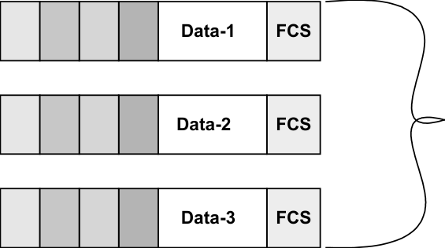

CWNA Study Guide © Copyright 2002 Planet3 Wireless, Inc.

--- end of page=232 ---

**205** Chapter 8 – MAC and Physical Layers

One way to use fragmentation to improve network throughput in times of heavy packet
errors is to monitor the packet error rate on the network and adjust the fragmentation
level manually. As a recommended practice, you should monitor the network at multiple
times throughout a typical day to see what impact fragmentation adjustment will have at
various times. Another method of adjustment is to configure the fragmentation threshold.

If your network is experiencing a high packet error rate (faulty packets), increase the
fragmentation threshold on the client stations and/or the access point (depending on
which units allow these settings on your particular equipment). Start with the maximum
value and gradually decrease the fragmentation threshold size until an improvement
shows. If fragmentation is used, the network will experience a performance hit due to the
overhead incurred with fragmentation. Sometimes this hit is acceptable in order to gain
more throughput due to a decrease in packet errors and subsequent retransmissions.

**Dynamic Rate Shifting (DRS)**

Adaptive (or Automatic) Rate Selection (ARS) and Dynamic Rate Shifting (DRS) are
both terms used to describe the method of dynamic speed adjustment on wireless LAN
clients. This speed adjustment occurs as distance increases between the client and the
access point or as interference increases. It is imperative that a network administrator
understands how this function works in order to plan for network throughput, cell sizes,
power outputs of access points and stations, and security.

Modern spread spectrum systems are designed to make discrete jumps only to specified
data rates, such as 1, 2, 5.5, and 11 Mbps. As distance increases between the access point
and a station, the signal strength will decrease to a point where the current data rate
cannot be maintained. When this signal strength decrease occurs, the transmitting unit
will drop its data rate to the next lower specified data rate, say from 11 Mbps to 5.5 Mbps
or from 2 Mbps to 1 Mbps. Figure 8.2 illustrates that, as the distance from the access
point increases, the data rate decreases.

**FIGURE 8.2** Dynamic Rate Shifting

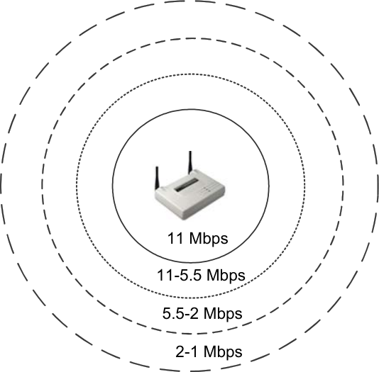

CWNA Study Guide © Copyright 2002 Planet3 Wireless, Inc.

--- end of page=233 ---

Chapter 8 – MAC and Physical Layers **206**

A wireless LAN system will never drop from 11 Mbps to 10 Mbps, for example, since 10
Mbps is not a specified data rate. The method of making such discrete jumps is typically
called either ARS or DRS, depending on the manufacturer. Both FHSS and DSSS
implement DRS, and the IEEE 802.11, IEEE 802.11b, HomeRF, and OpenAir standards
require it.

**Distributed Coordination Function**

Distributed Coordination Function (DCF) is an access method specified in the 802.11
standard that allows all stations on a wireless LAN to contend for access on the shared
transmission medium (RF) using the CSMA/CA protocol. In this case, the transmission
medium is a portion of the radio frequency band that the wireless LAN is using to send
data. Basic service sets (BSS), extended service sets (ESS), and independent basic
service sets (IBSS) can all use DCF mode. The access points in these service sets act in
the same manner as IEEE 802.3 based wired hubs to transmit their data, and DCF is the
mode in which the access points send the data.

**Point Coordination Function**

Point Coordination Function (PCF) is a transmission mode allowing for contention-free
frame transfers on a wireless LAN by making use of a polling mechanism. PCF has the
advantage of guaranteeing a known amount of latency so that applications requiring QoS
(voice or video for example) can be used. When using PCF, the access point on a
wireless LAN performs the polling. For this reason, an ad hoc network cannot utilize
PCF, because an ad hoc network has no access point to do the polling.

**The PCF Process**

First, a wireless station must tell the access point that the station is capable of answering
a poll. Then the access point asks, or polls, each wireless station to see if that station
needs to send a data frame across the network. PCF, through polling, generates a
significant amount of overhead on a wireless LAN.

DCF can be used without PCF, but PCF cannot be used without DCF. We will explain
how these two modes co-exist as we discuss interframe spacing. DCF is scalable due to
its contention-based design, whereas PCF, by design, limits the scalability of the wireless
network by adding the additional overhead of polling frames.

CWNA Study Guide © Copyright 2002 Planet3 Wireless, Inc.

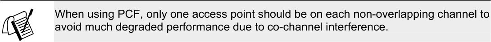

--- end of page=234 ---

**207** Chapter 8 – MAC and Physical Layers

##### Interframe Spacing

Interframe spacing doesn’t sound like something an administrator would need to know;
however, if you don’t understand the types of interframe spacing, you cannot effectively
grasp RTS/CTS, which helps you solve problems, or DCF and PCF, which are manually
configured in the access point. Both of these functions are integral in the ongoing
communications process of a wireless LAN. First, we will define each type of interframe
space (IFS), and then we will explain how each type works on the wireless LAN.

As we learned when we discussed beacons, all stations on a wireless LAN are timesynchronized. All the stations on a wireless LAN are effectively ‘ticking’ time in sync
with one another. Interframe spacing is the term we use to refer to standardized time
spaces that are used on all 802.11 wireless LANs.

**Three Types of Spacing**

There are three main spacing intervals (interframe spaces): SIFS, DIFS, and PIFS. Each
type of interframe space is used by a wireless LAN either to send certain types of
messages across the network or to manage the intervals during which the stations contend
for the transmission medium. Figure 8.3 illustrates the actual times that each interframe
space takes for each type of 802.11 technology.

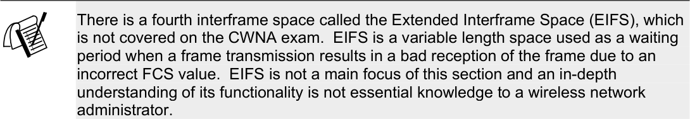

**FIGURE 8.3** Interframe spacing

|IFS|DSSS|FHSS|Diffused Infrared|
|---|---|---|---|
|**SIFS**|10 uS|28 uS|7 uS|
|**PIFS**|30 uS|78 uS|15 uS|
|**DIFS**|50 uS|128 uS|23 uS|

Interframe spaces are measured in microseconds and are used to defer a station's access to
the medium and to provide various levels of priority. On a wireless network, everything
is synchronized and all stations and access points use standard amounts of time (spaces)
to perform various tasks. Each node knows these spaces and uses them appropriately. A
set of standard spaces is specified for DSSS, FHSS, and Infrared as you can see from
Figure 8.3. By using these spaces, each node knows when and if it is supposed to
perform a certain action on the network.

CWNA Study Guide © Copyright 2002 Planet3 Wireless, Inc.

--- end of page=235 ---

Chapter 8 – MAC and Physical Layers **208**

**Short Interframe Space (SIFS)**

SIFS is the shortest fixed interframe space. SIFS are time spaces before and after which
the following types of messages are sent. The list below is not an exhaustive list.

  - RTS - Request-to-Send frame, used for reserving the medium by stations

  - CTS - Clear-to-Send frame, used as a response by access points to the RTS frame
generated by a station in order to ensure all stations have stopped transmitting

  - ACK - Acknowledgement frame used for notifying sending stations that data
arrived in readable format at the receiving station

SIFS provide the highest level of priority on a wireless LAN. The reason for SIFS
having the highest priority is that stations constantly listen to the medium (carrier sense)
awaiting a clear medium. Once the medium is clear, each station must wait a given
amount of time (spacing) before proceeding with a transmission. The length of time a
station must wait is determined by the function the station needs to perform. Each
function on a wireless network falls into a spacing category. Tasks that are high priority
fall into the SIFS category. If a station only has to wait a short period of time after the
medium is clear to begin its transmissions, it would have priority over stations having to
wait longer periods of time. SIFS is used for functions requiring a very short period of
time, yet needing high priority in order to accomplish the goal.

**Point Coordination Function Interframe Space (PIFS)**

A PIFS interframe space is neither the shortest nor longest fixed interframe space, so it
gets more priority than DIFS and less than SIFS. Access points use a PIFS interframe
space _only_ when the network is in point coordination function mode, which is manually
configured by the administrator. PIFS are shorter in duration than DIFS (see Figure 8.3),
so the access point will always win control of the medium before other contending
stations in distributed coordination function (DCF) mode. PCF only works with DCF,
not as a stand-alone operational mode so that, once the access point is finished polling,
other stations can continue to contend for the transmission medium using DCF mode.

**Distributed Coordination Function Interframe Space (DIFS)**

DIFS is the longest fixed interframe space and is used by default on all 802.11-compliant
stations that are using the distributed coordination function. Each station on the network
using DCF mode is required to wait until DIFS has expired before any station can
contend for the network. All stations operating according to DCF use DIFS for
transmitting data frames and management frames. This spacing makes the transmission
of these frames lower priority than PCF-based transmissions. Instead of all stations
assuming the medium is clear and arbitrarily beginning transmissions simultaneously
after DIFS (which would cause collisions), each station uses a random back off algorithm
to determine how long to wait before sending its data.

CWNA Study Guide © Copyright 2002 Planet3 Wireless, Inc.

--- end of page=236 ---

**209** Chapter 8 – MAC and Physical Layers

The period of time directly following DIFS is referred to as the contention period (CP).
All stations in DCF mode use the random back off algorithm during the contention
period. During the random back off process, a station chooses a random number and
multiplies it by the slot time to get the length of time to wait. The stations count down
these slot times one by one, performing a clear channel assessment (CCA) after each slot
time to see if the medium is busy. Whichever station's random back off time expires
first, that station does a CCA, and provided the medium is clear, it then begins
transmission.

Once the first station has begun transmissions all other stations sense that the medium is
busy, and remember the remaining amount of their random back off time from the
previous CP. This remaining amount of time is used in lieu of picking another random
number during the next CP. This process assures fair access to the medium among all
stations.

Once the random back off period is over, the transmitting station sends its data and
receives back the ACK from the receiving station. This entire process then repeats. It
stands to reason that most stations will chose different random numbers, eliminating most
collisions. However, it is important to remember that collisions do happen on wireless
LANs, but they cannot directly be detected. Collisions are assumed by the fact that the
ACK is not received back from the destination station.

**Slot Times**

A slot time, which is pre-programmed into the radio in the same fashion as the SIFS,
PIFS, and DIFS timeframes, is a standard period of time on a wireless network. Slot
times are used in the same method as a clock's second hand is used. A wireless node
ticks slot times just like a clock ticks seconds. These slot times are determined by the
wireless LAN technology being utilized.

      - FHSS Slot Time = 50uS

      - DSSS Slot Time = 20uS

      - Infrared Slot Time = 8uS

Notice the following:

PIFS = SIFS + 1 Slot Time
DIFS = PIFS + 1 Slot Time

Also notice that FHSS has noticeably longer slot times, DIFS times, and PIFS times than
DSSS. These longer times contribute to FHSS overhead, which decreases throughput.

**The Communications Process**

When you consider the PIFS process described above, it may seem as though the access
point would _always_ have control over the medium, since the access point does not have to
wait for DIFS, but the stations do. This would be true, except for the existence of what is
called a _superframe_ . A superframe is a period of time, and it consists of three parts:

CWNA Study Guide © Copyright 2002 Planet3 Wireless, Inc.

--- end of page=237 ---

Chapter 8 – MAC and Physical Layers **210**

1. Beacon

2. Contention Free Period (CFP)

3. Contention Period (CP)

A diagram of the superframe is shown in Figure 8.4. The purpose of the superframe is to
allow peaceful, fair co-existence between PCF and DCF mode clients on the network,
allowing QoS for some, but not for others.

**FIGURE 8.4** The Superframe

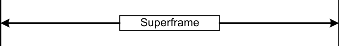

Again, remember that PIFS, and hence the superframe, only occurs when

1. The network is in point coordination function mode

2. The access point has been configured to do polling

3. The wireless clients have been configured to announce to the access point that
they are pollable

Therefore, if we start from a hypothetical beginning point on a network that has the
access point configured for PCF mode, and the some of the clients are configured for
polling, the process is as follows.

1. The access point broadcasts a beacon.

2. During the contention free period, the access point polls stations to see if any
station needs to send data.

3. If a station needs to send data, it sends one frame to the access point in response
to the access point’s poll

4. If a station does not need to send data, it returns a null frame to the access point
in response to the access point’s poll

5. Polling continues throughout the contention free period

6. Once the contention free period ends and the contention period begins, the access
point can no longer poll stations. During the contention period, stations using
DCF mode contend for the medium and the access point uses DCF mode.

7. The superframe ends with the end of the CP, and a new one begins with the
following CFP.

CWNA Study Guide © Copyright 2002 Planet3 Wireless, Inc.

--- end of page=238 ---

**211** Chapter 8 – MAC and Physical Layers

Think of the CFP as using a "controlled access policy" and the CP as using a "random
access policy." During the CFP, the access point is in complete control of all functions
on the wireless network, whereas during the CP, stations arbitrate and randomly gain
control over the medium. The access point, in PCF mode, does not have to wait for the
DIFS to expire, but rather uses the PIFS, which is shorter than the DIFS, in order to
capture the medium before any client using DCF mode does. Since the access point
captures the medium and begins polling transmissions during the CFP, the DCF clients
sense the medium as being busy and wait to transmit. After the CFP the CP begins,
during which all stations using DCF mode may contend for the medium and the access
point switches to DCF mode.

Figure 8.5 illustrates a short timeline for a wireless LAN using DCF and PCF modes.

**FIGURE 8.5** DCF/PCF mode timeline

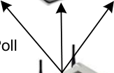

Access point seizes

Stations in DCF mode would
normally contend for access here

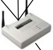

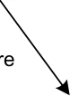

|Col1|DIFS PIFS|Contention Period|Col4|
|---|---|---|---|
||PIFS|PIFS|PIFS|

time

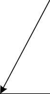

The process is somewhat simpler when a wireless LAN is only in DCF mode, because
there is no polling and, hence, no superframe. This process is as follows:

1. Stations wait for DIFS to expire

2. During the CP, which immediately follows DIFS, stations calculate their random
back off time based on a random number multiplied by a slot time

3. Stations tick down their random time with each passing slot time, checking the
medium (CCA) at the end of each slot time. The station with the shortest time
gains control of the medium first.

4. A station sends its data.

5. The receiving station receives the data and waits a SIFS before returning an ACK
back to the station that transmitted the data.

6. The transmitting station receives the ACK and the process starts over from the
beginning with a new DIFS.

CWNA Study Guide © Copyright 2002 Planet3 Wireless, Inc.

--- end of page=239 ---

Chapter 8 – MAC and Physical Layers **212**

Figure 8.6 illustrates a timeline for a DCF mode wireless LAN. Keep in mind that this
timeline is a few milliseconds long. The whole process happens many times every
second.

**FIGURE 8.6** DCF timeline

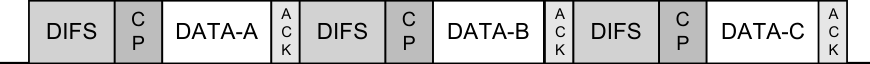
##### Request to Send/Clear to Send (RTS/CTS)

There are two carrier sense mechanisms used on wireless networks. The first is _physical_
_carrier sense_ . Physical carrier sense functions by checking the signal strength, called the
Received Signal Strength Indicator (RSSI), on the RF carrier signal to see if there is a
station currently transmitting. The second is _virtual carrier sense_ . Virtual carrier sense
works by using a field called the Network Allocation Vector (NAV), which acts as a
timer on the station. If a station wishes to broadcast its intention to use the network, the
station sends a frame to the destination station, which will set the NAV field on all
stations hearing the frame to the time necessary for the station to complete its
transmission, plus the returning ACK frame. In this way, any station can reserve use of
the network for specified periods of time. Virtual carrier sense is implemented with the
RTS/CTS protocol.

The RTS/CTS protocol is an extension of the CSMA/CA protocol. As the wireless LAN
administrator, you can take advantage of using this protocol to solve problems like
Hidden Node (discussed in Chapter 9, Troubleshooting). Using RTS/CTS allows stations
to broadcast their intent to send data across the network.

As you can imagine by the brief description above, RTS/CTS will cause significant
network overhead. For this reason RTS/CTS is turned OFF by default on a wireless
LAN. If you are experiencing an unusual amount of collisions on your wireless LAN
(evidenced by high latency and low throughput) using RTS/CTS can actually increase the
traffic flow on the network by decreasing the number of collisions. Use of RTS/CTS
should not be done haphazardly. RTS/CTS should be configured after careful study of
the network's collisions, throughput, latency, etc.

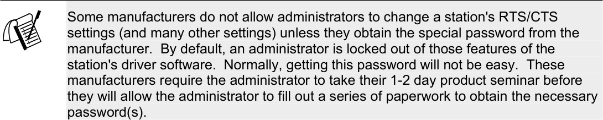

Figure 8.7 illustrates the 4-way handshake process used for RTS/CTS. In short, the
transmitting station broadcasts the RTS, followed by the CTS reply from the receiving
station, both of which go through the access point. Next, the transmitting station sends its
data payload through the access point to the receiving station, which immediately replies

CWNA Study Guide © Copyright 2002 Planet3 Wireless, Inc.

--- end of page=240 ---

**213** Chapter 8 – MAC and Physical Layers

with an acknowledgement frame, or ACK. This process is used for every frame that is
sent across the wireless network.

**FIGURE 8.7** RTS/CTS handshaking

Sending Access Point
Client

Request To Send (RTS)

**Configuring RTS/CTS**

Receiving
Client

Clear To Send (CTS)

Acknowledgement (ACK)

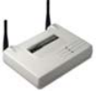

There are three settings on most access points and nodes for RTS/CTS:

 - Off

 - On

 - On with Threshold

When RTS/CTS is turned on, every packet that goes through the wireless network is
announced and cleared between the transmitting and receiving nodes prior to
transmission, creating a significant amount of overhead and significantly less throughput.
Generally, RTS/CTS should only be used in diagnosing network problems and when only
very large packets are flowing across a congested wireless network, which is rare.

However, the “on with threshold” setting allows the administrator to control which
packets (over a certain size - called the threshold) are announced and cleared to send by
the stations. Since collisions affect larger packets more than smaller ones, you can set the
RTS/CTS threshold to work only when a node wishes to send packets over a certain size.
This setting allows you to customize the RTS/CTS setting to your network data traffic
and optimize the throughput of your wireless LAN while preventing problems like
Hidden Node.

Figure 8.8 depicts a DCF network using the RTS/CTS protocol to transmit data. Notice
that the RTS and CTS transmissions are spaced by SIFS. The NAV is set with RTS on
all nodes, and then reset on all nodes by the immediately following CTS.

CWNA Study Guide © Copyright 2002 Planet3 Wireless, Inc.

--- end of page=241 ---

**FIGURE 8.8** RTS/CTS data transmission in DCF mode

Chapter 8 – MAC and Physical Layers **214**

sender

receiver

other
stations

##### Modulation

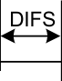

**t**

|Col1|Col2|Col3|Col4|Col5|Col6|Col7|Col8|Col9|Col10|
|---|---|---|---|---|---|---|---|---|---|
|RTS|RTS|RTS|RTS|data|data|data|data|data|data|
||SIFS SIFS CTS|SIFS SIFS CTS|SIFS SIFS CTS|SIFS SIFS CTS|SIFS ACK|SIFS ACK|SIFS ACK|SIFS ACK|SIFS ACK|
||SIFS SIFS CTS|CTS|CTS|CTS|CTS|ACK|ACK|ACK|ACK|
||||||||data DIFS|data DIFS|data DIFS|
||NAV (RTS)|NAV (RTS)|NAV (RTS)|NAV (RTS)|NAV (RTS)|NAV (RTS)|NAV (RTS)|NAV (RTS)|NAV (RTS)|
||NAV (RTS)|NAV (RTS)|NAV (RTS)|NAV (RTS)|NAV (RTS)|NAV (RTS)|NAV (RTS)||data|
||||NAV (CTS)|NAV (CTS)|NAV (CTS)|NAV (CTS)|NAV (CTS)|NAV (CTS)|NAV (CTS)|
|Defer access |Defer access |Defer access |Defer access |Defer access |Defer access |Defer access |Defer access |Defer access |Defer access |

Modulation, which is a Physical Layer function, is a process in which the radio
transceiver prepares the digital signal within the NIC for transmission over the airwaves.
Modulation is the process of adding data to a carrier by altering the amplitude, frequency,
or phase of the carrier in a controlled manner. Knowing the many different kinds of
modulations used with wireless LANs is helpful when trying to build a compatible
network piece-by-piece.

**FIGURE 8.9** Modulation and Spreading Code Types for 802.11 & 802.11b

|Col1|Spreading Code|Modulation Technology|Data Rate|
|---|---|---|---|
|**2.4 GHz** **DSSS**|Barker Code |DBPSK|1 Mbps|
|**2.4 GHz** **DSSS**|Barker Code |DQPSK|2 Mbps|
|**2.4 GHz** **DSSS**|CCK |DQPSK|5.5 Mbps|
|**2.4 GHz** **DSSS**|CCK|DQPSK|11 Mbps|
|**2.4 GHz** **FHSS**| |||
|**2.4 GHz** **FHSS**|Barker Code |2GFSK|1 Mbps|
|**2.4 GHz** **FHSS**| Barker Code|4GFSK|2 Mbps|

Figure 8.9 shows the details of modulation and spreading code types used with Frequency
Hopping and Direct Sequence wireless LANs in the 2.4 GHz ISM band. Differential
Binary Phase Shift Keying (DBPSK), Differential Quadrature Phase Shift Keying
(DQPSK), and Gaussian Frequency Shift Keying (GFSK) are the types of modulation
used by 802.11 and 802.11b products on the market today. Barker Code and
Complimentary Code Keying (CCK) are the types of spreading codes used in 802.11 and
802.11b wireless LANs.

CWNA Study Guide © Copyright 2002 Planet3 Wireless, Inc.

--- end of page=242 ---

**215** Chapter 8 – MAC and Physical Layers

As higher transmission speeds are specified (such as when a system is using DRS),
modulation techniques change in order to provide more data throughput. For example,
802.11g and 802.11a compliant wireless LAN equipment specify use of orthogonal
frequency division multiplexing (OFDM), allowing speeds of up to 54 Mbps, which is a
significant improvement over the 11 Mbps specified by 802.11b. Figure 8.10 shows the
modulation types used for 802.11a networks. The 802.11g standard provides backwards
compatibility by supporting CCK coding and even supports packet binary convolution
coding (PBCC) as an option. Bluetooth and HomeRF are both FHSS technologies that
use GFSK modulation technology in the 2.4 GHz ISM band.

**FIGURE 8.10** Modulation types and data rates for 802.11a

|Coding Technique|Modulation Technology|Data Rate|
|---|---|---|
|OFDM|BPSK|6 Mbps|
|OFDM|BPSK|9 Mbps|
|OFDM|QPSK|12 Mbps|
|OFDM|QPSK|18 Mbps|
|OFDM|16QAM|24 Mbps|
|OFDM|16QAM|36 Mbps|
|OFDM|64QAM|48 Mbps|
|OFDM|64QAM|54 Mbps|

Orthogonal frequency division multiplexing (OFDM) is a communications technique that
divides a communications channel into a number of equally spaced frequency bands. A
subcarrier carrying a portion of the user information is transmitted in each band. Each
subcarrier is orthogonal (independent of each other) with every other subcarrier,
differentiating OFDM from the commonly used frequency division multiplexing (FDM).

CWNA Study Guide © Copyright 2002 Planet3 Wireless, Inc.

--- end of page=243 ---

Chapter 8 – MAC and Physical Layers **216**

##### Key Terms

Before taking the exam, you should be familiar with the following terms:

_ACK_

_beacons_

_bit error rate_

_contention free period_

_contention period_

_DIFS_

_PIFS_

_polling_

_probe frame_

_SIFS_

_superframe_

CWNA Study Guide © Copyright 2002 Planet3 Wireless, Inc.

--- end of page=244 ---

**217** Chapter 8 – MAC and Physical Layers

##### Review Questions

1. Which of the following service sets can use distributed coordination function (DCF)
mode? Choose all that apply.

A. BSS

B. IBSS

C. ESS

D. IESS

2. Which of the following service sets can use point coordination function (PCF)
mode? Choose all that apply.

A. BSS

B. IBSS

C. ESS

D. IESS

3. You have a large number of users on one access point and collisions are becoming a
problem, causing reduced throughput. Some of the users are developers that do a
significant amount of large file transfers during the day. Which RTS/CTS setting
would best fix this problem?

A. On

B. Off

C. On with threshold

4. Which one of the following is an advantage to using point coordination function
(PCF) mode over distributed coordination mode (DCF)?

A. PCF has a lower overhead than using DCF

B. PCF can be used in and IBSS while DCF cannot

C. PCF uses CSMA/CA while DCF does not

D. PCF provides a given level of QoS

5. After a client station sends a data packet to another client station, the receiving
station replies with an acknowledgement after which interframe space?

A. IFS

B. SIFS

C. PIFS

D. DIFS

CWNA Study Guide © Copyright 2002 Planet3 Wireless, Inc.

--- end of page=245 ---

Chapter 8 – MAC and Physical Layers **218**

6. Why is the CSMA/CA protocol used in order to avoid collisions in a wireless LAN?

A. PCF mode requires use of a polling mechanism

B. The overhead of sending acknowledgements is high

C. All clients must acknowledge packets received while they're asleep

D. It is not possible to detect collisions on a wireless LAN

7. End stations will broadcast a _______ when actively scanning for access points on
the network.

A. Beacon management frame

B. Superframe

C. Probe request frame

D. Request to send

8. PIFS are only used during the communications of a wireless LAN when which of
the following have occurred?

A. The network is in point coordination function mode

B. The access point has been configured to use RTS/CTS

C. The access point has been configured to use CSMA/CD

D. The network is configured for fragmentation

9. You have just finished installing your first wireless LAN with 802.11b equipment
rated at 11 Mbps. After testing the throughput of the clients, you find your actual
throughput is only 5.5 Mbps. What is the likely cause of this throughput?

A. Wireless LANs use RTS/CTS by default

B. Wireless LANs use the CSMA/CA protocol

C. Use of PCF is reducing network throughput

D. DRS has caused all of the clients to decrease their data rates

10. You have just finished installing your first wireless LAN with 802.11b equipment
rated at 11 Mbps. After testing the throughput of the clients you find your actual
throughput is only 5.5 Mbps. What can you change to get 11Mbps throughput?

A. Turn off RTS/CTS

B. Move all of the clients closer to the access point

C. Turn up the power on the access point

D. Purchase another access point and co-locate both together

CWNA Study Guide © Copyright 2002 Planet3 Wireless, Inc.

--- end of page=246 ---

**219** Chapter 8 – MAC and Physical Layers

11. 802.11b devices use what type of modulation at 11 Mbps?

A. BPSK

B. DPSK

C. QPSK

D. CCK

12. 802.11a devices use what type of modulation at 24 Mbps?

A. BPSK

B. 16QAM

C. OFDM

D. CCK

13. If the sending station on a wireless LAN does not receive an ACK, the sending
station assumes which one of the following?

A. The receiving station is sleeping

B. The receiving station is a hidden node

C. There was a collision

D. That RTS/CTS is turned on

14. Modulation is which of one of the following?

A. The process by which digital data is modified to become RF data

B. The process of adding data to a carrier by altering the amplitude, frequency, or
phase of the carrier in a controlled manner

C. The process of propagating an RF signal through the airwaves

D. The means by which RF signals are received and processed by RF antennas

15. Which one of the following is not part of a superframe?

A. Beacon

B. Beacon Free Period

C. Contention Free Period

D. Contention Period

CWNA Study Guide © Copyright 2002 Planet3 Wireless, Inc.

--- end of page=247 ---

Chapter 8 – MAC and Physical Layers **220**

16. A superframe is used when which of the following is true? Choose all that apply

A. The access point has been configured for point coordination function mode

B. When beacons are disabled in the access point

C. The wireless clients have been configured to announce to the access point that
they are pollable

D. The access point has been configured for distributed coordination function
mode

17. What is the purpose of the superframe?

A. To increase the throughput of all wireless LANs

B. To ensure QoS for all voice and video applications running on wireless LANs

C. To ensure that PCF- and DCF-mode clients do not communicate within the
same wireless LAN

D. To allow fair co-existence between PCF- and DCF- mode clients on the
network

18. The acronym CCA stands for which one of the following?

A. Close Client Association

B. Clear Current Authentication

C. Clear Channel Assessment

D. Clean Channel Association

E. Calculate Clear Assessment

19. The Network Allocation Vector (NAV) acts as:

A. A timer on the station

B. A navigational feature for RF signal propagation

C. A location discovery tool for wireless LANs

D. A tool for allocating the bandwidth of a wireless LAN

20. Using RTS/CTS allows wireless stations to do which of the following?

A. Broadcast their intent to send data across the network to the receiving station

B. Send their packets across the network at the maximum rated speed of the
network

C. Eliminate hidden nodes on the network

D. Diagnose and reduce high overhead between stations

CWNA Study Guide © Copyright 2002 Planet3 Wireless, Inc.

--- end of page=248 ---

**221** Chapter 8 – MAC and Physical Layers

##### Answers to Review Questions

1. A, B, C. There is no such thing as an IESS service set type. The rest can all use
DCF mode.

2. A, C. There is no such thing as an IESS service set type. Any time there is an
access point present in the wireless LAN (which rules out IBSS networks), you can
use PCF mode (provided the access point supports it). IBSS networks have no
access points, and clients communicate directly with each other. There is no access
point to perform polling.

3. C. By turning on RTS/CTS with the threshold set to a given packet size, the heavy
bursts of traffic during the day would cause minimal disruption for other users in a
congested WLAN. The threshold setting is used for occasions such as this with
great success.

4. D. While PCF mode is not the answer to every QoS need, it does provide a given
level of QoS by providing predictable latencies in the wireless LAN.

5. B. A short interframe space (SIFS) is used between the data packet receipt and the
acknowledgement reply. SIFS are used before and after many frame types on
wireless networks such as RTS, CTS, ACK, PSP frames, etc.

6. D. It is impossible to detect collisions on a wireless LAN. For this reason, the
CSMA/CA protocol, the RTS/CTS protocol, and positive acknowledgements are
used in order to reduce the possibility of collisions on the wireless LAN.

7. C. When a client station is actively seeking access points with which to associate, it
sends probe request frames. All access points hearing the probe request frame
respond with probe response frames. Probe response frames contain almost
identical information to beacon management frames.

8. A. An access point using point coordination function mode uses PIFS interframe
spaces in order to capture use of the medium before stations that are using DCF
mode. PIFS is shorter than DIFS and therefore gives the access point priority over
stations competing for use of the medium using DIFS.

9. B. Wireless LANs use the CSMA/CA protocol in order to avoid collisions on the
network. The CSMA/CA protocol introduces approximately 50% overhead into the
network reducing throughput to approximately half of the data rate.

10. D. The typical maximum throughput of an 802.11b access point is approximately
5.5 Mbps. This is due to protocols like CSMA/CA and RTS/CTS being used. In
order to increase the throughput beyond this point, additional access points can be
co-located (up to 3 in an area) using non-overlapping channels. Each access point is
capable of the same 5.5 Mbps.

11. C. In many cases, manufacturers state that 802.11b devices use CCK modulation at
11 Mbps, but they do not. CCK is not a modulation type, but rather a coding
technique. The modulation type used at 11 Mbps is QPSK.

12. B. For every two steps in data rate using 802.11a, the modulation type is changed.
Many manufacturers mistakenly list OFDM as the modulation type for all 802.11a
devices, but this is incorrect. OFDM is not a modulation type, but rather a
communications technique that can use various types of modulation.

CWNA Study Guide © Copyright 2002 Planet3 Wireless, Inc.

--- end of page=249 ---

Chapter 8 – MAC and Physical Layers **222**

13. C. Transmitting stations not receiving ACKs from receiving stations assume that
there was a collision and begin resending the data.

14. B. There must be a means by which relevant data is imprinted or impressed upon
RF frequencies to allow transmission of the data from one point to another. This
process is referred to as modulation, and there are many modulation types. In this
book, we address six kinds of modulation used with wireless LANs.

15. B. The superframe is a time period during which contention-free and contentionbased clients can co-exist without disrupting each other. This time period consists
of three periods - the contention-free period (CFP), which is for stations in PCF
mode being polled by the access point, the contention period (CP) which is for
stations in DCF mode, and the beacon.

16. A, C. Superframes are used when the access point is using PCF mode and polling
stations that are configured to be polled. When all stations and the access point are
using DCF mode, there is no contention-free period and, thus, no need for a
superframe.

17. D. In allowing peaceful co-existence between DCF- and PCF-mode clients on the
network, the superframe allows some nodes to have QoS and others to have the
ability to contend for network access to maximize throughput.

18. C. A clear channel assessment is a function requested by the MAC layer and
performed at the Physical layer where the physical layer senses the RF amplitude
level on a particular frequency. If the amplitude is below a given threshold, the
medium is considered to be clear and ready for frames to be transmitted. This is
called a positive CCA. If the amplitude is above that same threshold, then the
medium is considered busy. This is considered a negative CCA.

19. A. The NAV field is used on a station as a timer. When using the RTS/CTS
protocol, RTS and CTS packets set the NAV on stations hearing them to an amount
of time that they must wait before trying to access the medium.

20. A. The RTS/CTS protocol is a method of remedying problems caused by the hidden
node problem on wireless LANs. While using RTS/CTS cannot eliminate hidden
nodes, stations broadcasting their intention to transmit packets on the network can
drastically reduce the problems hidden nodes cause with collisions on the network.

CWNA Study Guide © Copyright 2002 Planet3 Wireless, Inc.

--- end of page=250 ---
