# Chapter 9 - Troubleshooting

_PDF pages 252-287_

##### Troubleshooting Wireless LAN Installations

**CWNA Exam Objectives Covered:**

- Identify, understand and correct or compensate for the
following wireless LAN implementation challenges:

 - Multipath

 - Hidden Node

 - Near/Far

 - RF Interference

 - All-band interference

 - System throughput

 - Co-location throughput

 - Weather

CWNA Study Guide © Copyright 2002 Planet3 Wireless, Inc.

CHAPTER CHAPTER
# 9 5

**In This Chapter**

Multipath

Hidden Node

Near/Far

System Throughput

Co-location Throughput

Types of Interference

Range Considerations

--- end of page=251 ---

Chapter 9 –Troubleshooting Wireless LAN Installations **224**

Just as traditional wired networks have challenges during implementation, wireless LANs
have their own set of challenges, mainly dealing with the behavior of RF signals. In this
chapter, we will discuss the more common obstacles to successful implementation of a
wireless LAN, and how to troubleshoot them. There are different methods of discovering
when these challenges exist, and each of the challenges discussed has its remedies and
workarounds.

The challenges to implementing any wireless LAN discussed herein are considered by
many to be “textbook” problems that can occur within any wireless LAN installation,
and, therefore, can be avoided by careful planning and simply being aware that these
problems can and will occur.

##### Multipath

If you will recall from Chapter 2, RF Fundamentals, there are two types of line of sight
(LOS). First, there is _visual_ LOS, which is what the human eye sees. Visual LOS is your
first and most basic LOS test. If you can see the RF receiver from the installation point
of the RF transmitter, then you have _visual_ line of sight. Second, and different from
visual LOS, is RF line of sight. RF LOS is what your RF device can “see”.

The general behavior of an RF signal is to grow wider as it is transmitted farther.
Because of this type of behavior, the RF signal will encounter objects in its path that will
reflect, diffract, or otherwise interfere with the signal. When an RF wave is reflected off
an object (water, tin roof, other metal object, etc.) while moving towards its receiver,
multiple wave fronts are created (one for each reflection point). There are now waves
moving in many directions, and many of these reflected waves are still headed toward the
receiver. This behavior is where we get the term _multipath,_ as shown in Figure 9.1.
Multipath is defined as the composition of a primary signal plus duplicate or echoed
wave fronts caused by reflections of waves off objects between the transmitter and
receiver. The delay between the instant that the main signal arrives and the instant that
the last reflected signal arrives is known as _delay spread_ .

**FIGURE 9.1** Multipath

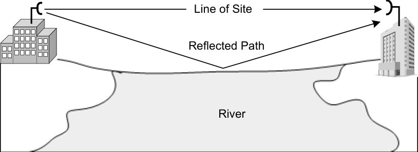

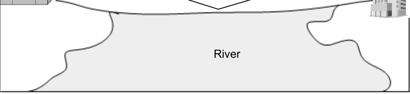

CWNA Study Guide © Copyright 2002 Planet3 Wireless, Inc.

--- end of page=252 ---

**225** Chapter 9 –Troubleshooting Wireless LAN Installations

**Effects of Multipath**

Multipath can cause several different conditions, all of which can affect the transmission
of the RF signal differently. These conditions include:

      - Decreased Signal Amplitude (downfade)

      - Corruption

      - Nulling

      - Increased Signal Amplitude (upfade)

**Decreased Signal Amplitude**

When an RF wave arrives at the receiver, many reflected waves may arrive at the same
time from different directions. The combination of these waves' amplitudes is additive to
the main RF wave. Reflected waves, if out-of-phase with the main wave, can cause
decreased signal amplitude at the receiver, as illustrated in Figure 9.2. This occurrence is
commonly referred to as _downfade_ and should be taken into consideration when
conducting a sight survey and selecting appropriate antennas.

**FIGURE 9.2** Downfade

Amplitude decrease

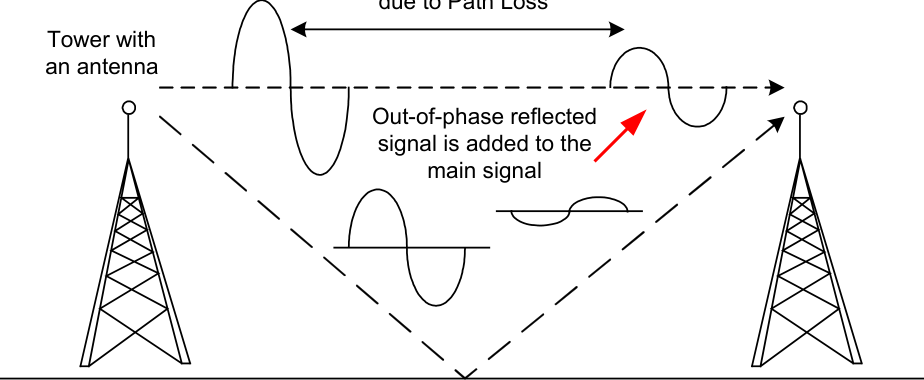

**Corruption**

Corrupted signals (waves) due to multipath can occur as a result of the same phenomena
that cause decreased amplitude, but to a greater degree. When reflected waves arrive at
the receiver out-of-phase with the main wave, as illustrated in Figure 9.3, they can cause
the wave to be greatly reduced in amplitude instead of only slightly reduced. The
amplitude reduction is such that the receiver is sensitive enough to detect most of the
information being carried on the wave, but not all.

CWNA Study Guide © Copyright 2002 Planet3 Wireless, Inc.

--- end of page=253 ---

**FIGURE 9.3** RF Signal Corruption

Chapter 9 –Troubleshooting Wireless LAN Installations **226**

Reflective surface

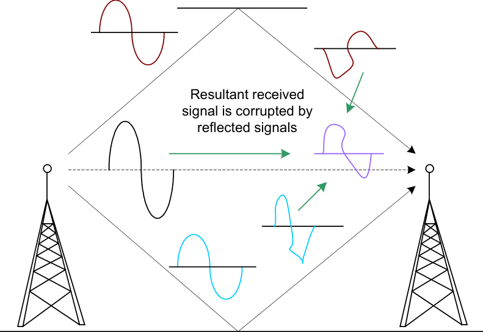

Reflective surface

In such cases, the signal to noise ratio (SNR) is generally very low, where the signal itself
is very close to the noise floor. The receiver is unable to clearly decipher between the
information signal and noise, causing the data that is received to be only part (if any) of
the transmitted data. This corruption of data will require the transmitter to resend the
data, increasing overhead and decreasing throughput in the wireless LAN.

**Nulling**

The condition known as nulling occurs when one or more reflected waves arrive at the
receiver out-of-phase with the main wave with such amplitude that the main wave's
amplitude is cancelled. As illustrated in Figure 9.4, when reflected waves arrive out-ofphase with the main wave at the receiver, the condition can cancel or “null” the entire set
of RF waves, including the main wave.

CWNA Study Guide © Copyright 2002 Planet3 Wireless, Inc.

--- end of page=254 ---

**227** Chapter 9 –Troubleshooting Wireless LAN Installations

**FIGURE 9.4** RF Signal Nulling

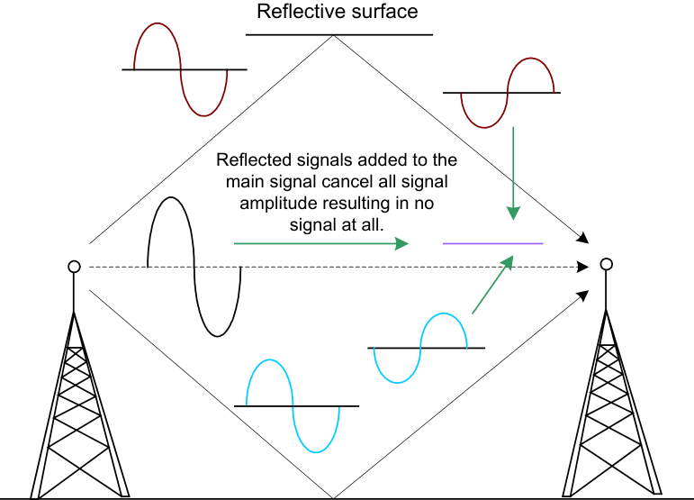

Reflective surface

When nulling occurs, retransmission of the data will not solve the problem. The
transmitter, receiver, or reflective objects must be moved. Sometimes more than one of
these must be relocated to compensate for the nulling effects on the RF wave.

**Increased Signal Amplitude**

Multipath conditions can also cause a signal’s amplitude to be increased from what it
would have been without reflected waves present. _Upfade_ is the term used to describe
when multipath causes an RF signal to gain strength _._ Upfade, as illustrated in Figure 9.5,
occurs due to reflected signals arriving at the receiver in-phase with the main signal.
Similar to a decreased signal, all of these waves are additive to the main signal. _Under_
_no circumstance can multipath cause the signal that reaches the receiver to be stronger_
_than the transmitted signal when the signal left the transmitting device._ If multipath
occurs in such a way as to be additive to the main signal, the total signal that reaches the
receiver will be stronger than the signal would have otherwise been without multipath
present.

CWNA Study Guide © Copyright 2002 Planet3 Wireless, Inc.

--- end of page=255 ---

**FIGURE 9.5** Upfade

Chapter 9 –Troubleshooting Wireless LAN Installations **228**

Amplitude decrease

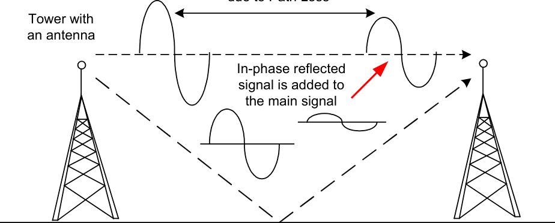

It is important to understand that a received RF signal can never be as large as the signal
that was transmitted due to the significance of free space path loss (usually called _path_
_loss_ ). Path loss is the effect of a signal losing amplitude due to expansion as the signal
travels through open space.

Think of path loss as someone blowing a bubble with bubble gum. As the gum expands,
the gum at any point becomes thinner. If someone were to reach out and grab a 1-inch
square piece of this bubble, the amount of gum they would actually get would be less and
less as the bubble expanded. If a person grabbed a piece of the bubble while it was still
small (close to the person's mouth, which is the transmitter) the person would get a
significant amount of gum. If the person waited to get that same size piece until the
bubble were large (further from the transmitter), the piece would be only a very small
amount of gum. This illustration shows that path loss is affected by two factors: first, the
distance between transmitter and receiver, and second, the size of the receiving aperture
(the size of the piece of gum that was grabbed).

**Troubleshooting Multipath**

An in-phase or out-of-phase RF wave cannot be seen, so we must look for the effects of
multipath in order to detect its occurrence. When doing a link budget calculation, in
order to find out just how much power output you will need to have a successful link
between sites, you might calculate an output power level that should work, but doesn't.
Such an occurrence is one way to determine that multipath is occurring.

Another common method of finding multipath is to look for RF coverage holes in a site
survey (discussed in Chapter 11). These holes are created both by lack of coverage and
by multipath reflections that cancel the main signal. Understanding the sources of
multipath is crucial to eliminating its effects.

Multipath is caused by reflected RF waves, so obstacles that more easily reflect RF
waves, such as metal blinds, bodies of water, and metal roofs, should be removed from or
avoided in the signal path if possible. This procedure may include moving the
transmitting and receiving antennas. Multipath is likely the most common "textbook"
wireless LAN problem. Administrators and installers deal with multipath daily. Even

CWNA Study Guide © Copyright 2002 Planet3 Wireless, Inc.

--- end of page=256 ---

**229** Chapter 9 –Troubleshooting Wireless LAN Installations

wireless LAN users - because they are mobile - experience problems with multipath.
Users may roam into an area with high multipath, not knowing why their RF signal has
been so significantly degraded.

**Solutions for Multipath**

_Antenna diversity_ was devised for the purpose of compensating for multipath. Antenna
diversity means using multiple antennas, inputs, and receivers in order to compensate for
the conditions that cause multipath. There are four types of receiving antenna diversity,
one of which is predominantly used in wireless LANs. The type of _transmission_
diversity used by wireless LANs is also described below.

      - Antenna Diversity - not active

        - Multiple antennas on single input

        - Rarely used

      - Switching Diversity

        - Multiple antennas on multiple receivers

        - Switches receivers based on signal strength

      - Antenna Switching Diversity – active

        - **Used by most WLAN manufacturers**

        - Multiple antennas on multiple inputs - single receiver

        - Signal is received through only one antenna at a time

      - Phase Diversity

        - Patented proprietary technology

        - Adjusts phase of antenna to the phase of the signal in order to maintain signal
quality

      - Diversity Transmission

        - **Used by most WLAN manufacturers**

        - Transmits out of the antenna last used for reception

        - Can alternate antennas for transmission retries

        - A unit can either transmit or receive, but not both simultaneously

Figure 9.6 illustrates an access point with multiple antennas to compensate for multipath.

CWNA Study Guide © Copyright 2002 Planet3 Wireless, Inc.

--- end of page=257 ---

Chapter 9 –Troubleshooting Wireless LAN Installations **230**

**FIGURE 9.6** Antenna Diversity

Unit selects the antenna
that has the best signal

Antenna diversity is made up of the following characteristics that work together to
compensate for the effects of multipath:

1. Antenna diversity uses multiple antennas on multiple inputs to bring a signal to a
single receiver.

2. The incoming RF signal is received through one antenna at a time. The receiving
radio is constantly sampling the incoming signals from both antennas to
determine which signal is of a higher quality. The receiving radio then chooses
to accept the higher quality signal.

3. The radio transmits its next signal out of the antenna that was last used to receive
an incoming signal because the received signal was a higher quality signal than
from the other antenna. If the radio must retransmit a signal, it will alternate
antennas until a successful transmission is made.

4. Finally, each antenna can be used to transmit or receive, but not both at the same
time. Only one antenna may be used at a time, and that antenna may only
transmit or receive, but not both, at any given instant.

Most access points in today’s wireless LANs are built with dual antennas for exactly this
purpose: to compensate for the degrading effects of multipath on signal quality and
throughput.

##### Hidden Node

Multiple access protocols that enable networked computing devices to share a medium,
such as Ethernet, are well developed and understood. However the nature of the wireless
medium makes traditional methods of sharing a common connection more difficult.

Collision detection has caused many problems in wired networking, and even more so for
wireless networks. Collisions occur when two or more nodes sharing a communication
medium transmit data simultaneously. The two signals corrupt each other and the result

CWNA Study Guide © Copyright 2002 Planet3 Wireless, Inc.

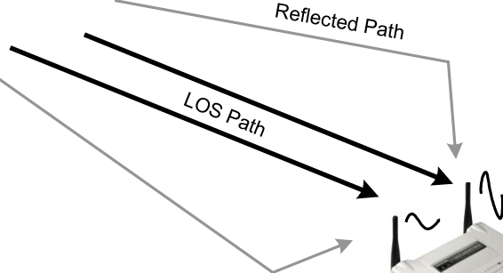

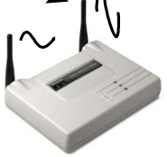

--- end of page=258 ---

**231** Chapter 9 –Troubleshooting Wireless LAN Installations

is a group of unreadable packet fragments. Collisions have always been a problem for
computer networks, and the simplest protocols often do not overcome this problem.
More complex protocols such as CSMA/CD and CSMA/CA check the channel before
transmitting data. CSMA/CD is the protocol used with Ethernet and involves checking
the voltage on the wire before transmitting. However, the process is considerably more
difficult for wireless systems since collisions are undetectable. A condition known as the
hidden node problem has been identified in wireless systems and is caused by problems
in transmission detection.

Hidden node is a situation encountered with wireless LANs in which at least one node is
unable to hear (detect) one or more of the other nodes connected to the wireless LAN. In
this situation, a node can see the access point, but cannot see that there are other clients
also connected to the same access point due to some obstacle or a large amount of
distance between the nodes. This situation causes a problem in medium access sharing,
causing collisions between node transmissions. These collisions can result in
significantly degraded throughput in the wireless LAN, as illustrated in Figure 9.7.

**FIGURE 9.7** Hidden Node

Access Point

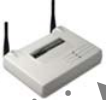

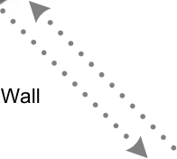

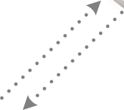

Figure 9.7 illustrates a brick wall with an access point sitting on top. On each side of the
wall is a wireless station. These wireless stations cannot hear each other's transmissions,
but both can hear the transmissions of the access point. If station A is transmitting a
frame to the access point, and station B cannot hear this transmission, station B assumes
that the medium is clear and can begin a transmission of its own to the access point. The
access point will, at this point, be receiving transmissions that have originated at two
points and there will be a collision. The collision will cause retransmissions by both
stations A & B, and again, since they cannot hear each other, they will transmit at will
thinking the medium is clear. There will likely be another collision. This problem is
exacerbated with many active nodes on the wireless LAN that cannot hear one another.

**Troubleshooting Hidden Node**

The primary symptom of a hidden node is degraded throughput over the wireless LAN.
Many times you will discover that you have a hidden node by hearing the complaints of

CWNA Study Guide © Copyright 2002 Planet3 Wireless, Inc.

--- end of page=259 ---

Chapter 9 –Troubleshooting Wireless LAN Installations **232**

users connected to the wireless LAN detecting an unusual sluggishness of the network.
Throughput may be decreased by up to 40% because of a hidden node problem. Since
wireless LANs use the CSMA/CA protocol, they already have an approximate overhead
of 50%, but, during a hidden node problem, it is possible to lose almost half of the
remaining throughput on the system.

Because the nature of a wireless LAN increases mobility, you may encounter a hidden
node at any time, despite a flawless design of your wireless LAN. If a user moves his
computer to a conference room, another office, or into a data room, the new location of
that node can potentially be hidden from the rest of the nodes connected to your wireless
LAN.

**Solutions for Hidden Node**

Once you have done the troubleshooting and discovered that there is a hidden node
problem, the problem node(s) must be located. Finding the node(s) will include a manual
search for nodes that might be out of reach of the main cluster of nodes. This process is
usually trial and error at best. Once these nodes are located, there are several remedies
and workarounds for the problem.

     - Use RTS/CTS

     - Increase power to the nodes

     - Remove obstacles

     - Move the node

**Use RTS/CTS**

The RTS/CTS protocol is not necessarily a solution to the hidden node problem. Instead,
it is a method of reducing the negative impact that hidden nodes have on the network.
Hidden nodes cause excessive collisions, which have a severely detrimental impact on
network throughput. The RTS/CTS (request-to-send/clear-to-send) protocol involves
sending a small packet (RTS) to the intended recipient to prompt it to send back a packet
(CTS) clearing the medium for data transmission before sending the data payload. This
process informs any nearby stations that data is about to be sent, having them delay
transmissions (and thereby avoiding collisions). Both the RTS and the CTS contain the
length of the impending data transmission so that stations overhearing either the RTS or
CTS frames know how long the transmission will take and when they can start to
transmit again.

There are three settings for RTS/CTS on most access points and clients: _On_, _Off_, and _On_
_with Threshold_ . The network administrator must manually configure RTS/CTS settings.
The _Off_ setting is the default in order to reduce unnecessary network overhead caused by
the RTS/CTS protocol. The threshold refers directly to the packet size that will trigger

CWNA Study Guide © Copyright 2002 Planet3 Wireless, Inc.

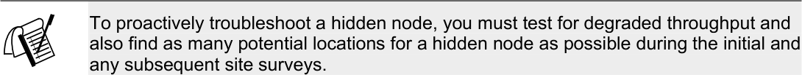

--- end of page=260 ---

**233** Chapter 9 –Troubleshooting Wireless LAN Installations

use of the RTS/CTS protocol. Since hidden nodes cause collisions, and collisions mainly
affect larger packets, you may be able to overcome the hidden node problem by using the
packet size threshold setting for RTS/CTS. What this setting essentially does is tell the
access point to transmit all packets that are greater in size than “x” (your setting) using
RTS/CTS and to transmit all other packets without RTS/CTS. If the hidden node is only
having a minor impact on network throughput, then activating RTS/CTS might have a
detrimental effect on throughput.

Try using RTS/CTS in the “On” mode as a test to see if your throughput is positively
affected. If RTS/CTS increases throughput, then you have most likely confirmed the
hidden node problem. You will encounter some additional overhead when using
RTS/CTS, but your overall throughput should increase over what it was when the hidden
node problem occurred.

**Increase Power to the Nodes**

Increasing the power (measured in milliwatts) of the nodes can solve the hidden node
problem by allowing the cell around each node to increase in size, encompassing all of
the other nodes. This configuration enables the non-hidden nodes to detect, or hear, the
hidden node. If the non-hidden nodes can hear the hidden node, the hidden node is no
longer hidden. Because wireless LANs use the CSMA/CA protocol, nodes will wait their
turn before communicating with the access point.

**Remove Obstacles**

Increasing the power on your mobile nodes may not work if, for example, the reason one
node is hidden is that there is a cement or steel wall preventing communication with other
nodes. It is doubtful that you would be able to remove such an obstacle, but removal of
the obstacle is another method of remedy for the hidden node problem. Keep these types
of obstacles in mind when performing a site survey.

**Move the Node**

Another method of solving the hidden node problem is moving the nodes so that they can
all hear each other. If you have found that the hidden node problem is the result of a user
moving his computer to an area that is hidden from the other wireless nodes, you may
have to force that user to move again. The alternative to forcing users to move is
extending your wireless LAN to add proper coverage to the hidden area, perhaps using
additional access points.

##### Near/Far

The near/far problem in wireless LAN implementation results from the scenario in which
there exists multiple client nodes that are (a) very near to the access point and (b) have
high power settings; and then at least one client that is (a) much farther away from the
access point than the aforementioned client nodes, and (b) is using much less transmitting
power than the other client nodes. The result of this type of situation is that the client(s)

CWNA Study Guide © Copyright 2002 Planet3 Wireless, Inc.

--- end of page=261 ---

Chapter 9 –Troubleshooting Wireless LAN Installations **234**

that are farther away from the access point and using less power simply cannot be heard
over the traffic from the closer, high-powered clients, as illustrated in Figure 9.8.

**FIGURE 9.8** Near/Far

Access Point

Unheard
Signal

Client A Client B
100 mW 5 mW

100 ft

Near/far is similar in nature to a crowd of people all screaming at one time into a
microphone, and one person whispering from fifty feet away from that same microphone.
The voice of the person 50 feet away is not going to reach the microphone over the noise
of the crowd shouting near the microphone. Even if the microphone is sensitive enough
to pick up the whisper under silent conditions, the high-powered close-range
conversations have effectively raised the noise floor to a point where low-amplitude
inputs are not heard.

Getting back to wireless LANs, the node that is being drowned out is well within the
normal range of the access point, but it simply cannot be heard over the signals of the
other clients. What this means to you as an administrator is that you must be aware of the
possibility of the near/far problem during site surveys and understand how to overcome
the problem through proper wireless LAN design and troubleshooting techniques.

**Troubleshooting Near/Far**

Troubleshooting the near/far problem is normally as simple as taking a good look at the
network design, locations of stations on the wireless network, and transmission output
power of each node. These steps will give the administrator clues as to what is likely
going on with the stations having connectivity problems. Since near/far prevents a node
from communicating, the administrator should check to see if the station has drivers
loaded properly for the wireless radio card and has associated with the access point
(shown in the association table of the access point).

The next step in troubleshooting near/far is use of a wireless sniffer. A wireless sniffer
will pick up transmissions from all stations it hears. One simple method of finding nodes
whose signals are not being heard by the access point is to move around the network
looking for stations with a faint signal in relation to the access point and nodes near the
access point. Using this method, it should not be too time-consuming to locate such a
node, depending on the size of the network and the complexity of the building structure.
Locating this node and comparing its signal strength to that of nodes near the access point
can solve the near/far problem fairly quickly.

CWNA Study Guide © Copyright 2002 Planet3 Wireless, Inc.

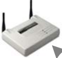

--- end of page=262 ---

**235** Chapter 9 –Troubleshooting Wireless LAN Installations

**Solutions for Near/Far**

Although the near/far problem can be debilitating for those clients whose RF signals get
drowned out, near/far is a relatively easy problem to overcome in most situations. It is
imperative to understand that the CSMA/CA protocol solves much of the near/far
problem with no intervention of the administrator. If a node can hear another node
transmitting, it will stop its own transmissions, complying with shared medium access
rules of CSMA/CA.  However, if for any reason the near/far problem still exists in the
network, below is a list of remedies that are easily implemented and can overcome the
near/far problem.

      - Increase power to remote node (the one that is being drowned out)

      - Decrease power of local nodes (the close, loud ones)

      - Move the remote node closer to the access point

One other solution is moving the access point to which the remote node is associated.
However, this solution should be viewed as a last resort, since moving an access point
will likely disrupt more clients than it would help. Furthermore, the need to move an
access point likely reveals a flawed site survey or network design, which is a much bigger
problem.

##### System Throughput

Throughput on a wireless LAN is based on many factors. For instance, the amount and
type of interference may impact the amount of data that can be successfully transmitted.
If additional security solutions are implemented, such as Wired Equivalent Privacy
(WEP—discussed in depth in Chapter 10, Wireless LAN Security), then the additional
overhead of encrypting and decrypting data will also cause a decrease in throughput.
Using VPN tunnels will add additional overhead to a wireless LAN system in the same
manner as will turning on WEP.

Greater distances between the transmitter and receiver will cause the throughput to
decrease because an increase in the number of errors (bit error rate) will create a need for
retransmissions. Modern spread spectrum systems are configured to make discrete jumps
to specified data rates (1, 2, 5.5, and 11 Mbps). If 11 Mbps cannot be maintained, for
example, then the device will drop to 5.5 Mbps. Since the throughput is about 50% of the
data rate on a wireless LAN system, changing the data rate will have a significant impact
on the throughput.

Hardware limitations will also dictate the data rate. If an IEEE 802.11 device is
communicating with an IEEE 802.11b device, the data rate can be no more than 2 Mbps,
despite the 802.11b device’s ability to communicate at 11 Mbps. Correspondingly, the
actual throughput will be less still—about 50%, or 1 Mbps. With wireless LAN
hardware, another consideration must be taken into account: the amount of CPU power
given to the access point. Having a slow CPU that cannot handle the full 11 Mbps data
rate with128-bit WEP enabled will affect throughput.

CWNA Study Guide © Copyright 2002 Planet3 Wireless, Inc.

--- end of page=263 ---

Chapter 9 –Troubleshooting Wireless LAN Installations **236**

The type of spread spectrum technology used, FHSS or DSSS, will make a difference in
throughput for two specific reasons. First, the data rates for FHSS and DSSS systems are
quite different. FHSS systems are typically in compliance with either the OpenAir
standard and can transmit at 800 kbps or 1.6 Mbps, or the IEEE 802.11 standard, which
allows them to transmit at 1 Mbps or 2 Mbps. Currently, DSSS systems comply with
either the IEEE 802.11 standard or the 802.11b standard, supporting data rates of 1, 2,
5.5, & 11 Mbps. The second reason that the type of spread spectrum technology will
affect throughput is that FHSS incurs the additional overhead of hop time.

Other factors limiting the throughput of a wireless LAN include proprietary data-link
layer protocols, the use of fragmentation (which requires the re-assembly of packets), and
packet size. Larger packets will result in greater throughput (assuming a good RF link)
because the ratio of data to overhead is better.

RTS/CTS, a protocol used on some wireless LAN implementations and which is similar
to the way that some serial links communicate, will create significant overhead because
of the amount of handshaking that takes place during the transfer.

The number of users attempting to access the medium simultaneously will have an
impact. An increase in simultaneous users will decrease the throughput each station
receives from the access point.

Using PCF mode on an access point, thereby invoking polling on the wireless network,
will decrease throughput. Polling causes lower throughput by introducing the extra
overhead of a polling mechanism and mandatory responses from wireless stations even
when no data needs to be sent by those stations.

**Co-location Throughput (Theory vs. Reality)**

Co-location is a common wireless LAN implementation technique that is used to provide
more bandwidth and throughput to wireless users in a given area. RF theory, combined
with FCC regulations, allows wireless LAN users in the United States three nonoverlapping RF channels (1, 6, and 11). These 3 channels can be used to co-locate
multiple (3) access points within the same physical area using 802.11b equipment, as can
be seen in Figure 9.9.

CWNA Study Guide © Copyright 2002 Planet3 Wireless, Inc.

--- end of page=264 ---

**237** Chapter 9 –Troubleshooting Wireless LAN Installations

**FIGURE 9.9** Co-location Throughput

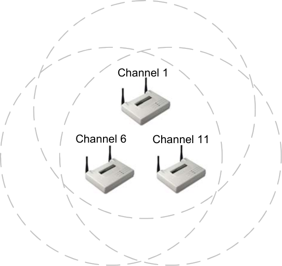

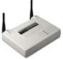

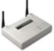

When co-locating multiple access points, it is highly recommended that you:

1. Use the same Spread Spectrum technology (either Direct Sequence or Frequency
Hopping, but not both) for all access points

2. Use the same vendor for all access points

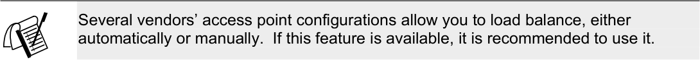

The portion of the 2.4 GHz ISM band that is useable for wireless LANs consists of 83.5
MHz. DSSS channels are 22 MHz wide, and there are 11 channels specified for use in
the United States. These channels are specifically designated ranges of frequencies
within the ISM band. According to the center frequency and width given to each of these
channels by the FCC, only three non-overlapping channels can exist in this band. Colocation of access points using non-overlapping channels in the same physical space has
advantages in implementing wireless LANs, so we will first explain what _should_ happen
when you co-locate these access points properly, and then we will explain what _will_
happen.

**Theory: What Should Happen**

For purposes of simplicity in this explanation, we will assume that all access points being
used in this scenario are 802.11b-compliant, 11Mbps access points. When using only one
access point in a simple wireless LAN, you should experience actual throughput of
somewhere between 4.5 Mbps and 5.5 Mbps. You will never see the full 11 Mbps of
rated bandwidth due to the half-duplex nature of the RF radios and overhead
requirements for wireless LAN protocols such as CSMA/CA.

CWNA Study Guide © Copyright 2002 Planet3 Wireless, Inc.

--- end of page=265 ---

Chapter 9 –Troubleshooting Wireless LAN Installations **238**

The RF theory of 3 non-overlapping channels should allow you to setup one access point
on channel 1, one access point on channel 6, and one access point on channel 11 without
any overlap in these access points' RF band usages. Therefore, you should see normal
throughput of approximately 5 Mbps on all co-located access points, with no adjacentchannel interference. Adjacent-channel interference would cause degradation of
throughput on one or both of the other access points.

**Reality: What Does Happen**

What actually happens is that channel 1 and channel 6 actually _do_ have a small amount of
overlap, as do channel 6 and channel 11. Figure 9.10 illustrates this overlap. The reason
for this overlap is typically that both access points are transmitting at approximately the
same high output power and are located relatively close to each other. So, instead of
getting normal half-duplex throughput on all access points, a detrimental effect is seen on
all three. Throughput can decrease to 4 Mbps or less on all three access points or may be
unevenly distributed where the access points might have 3, 4, and 5 Mbps respectively.

**FIGURE 9.10** DSSS channel overlap

Channel
1

Channel Channel
6 11

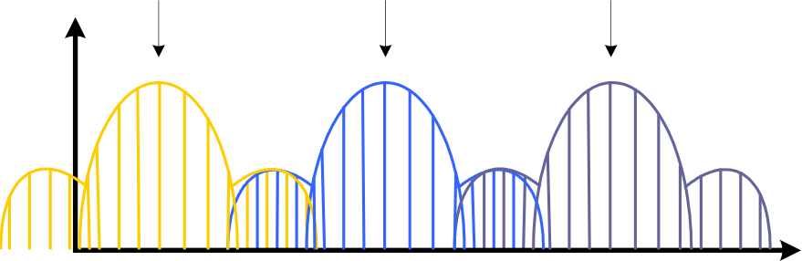

The portion of the theory that holds true is that adjacent channels (1, 2, 3, 4, and 5, for
example) have significant overlap, to the point that using an access point on channel 1
and another on channel 3, for example, results in even lower throughput (2Mbps or less)
on the two access points. In this case, in particular, a partial overlapping of channels
occurs. It is typically seen that a full overlap results in better throughput for the two
systems than does a partial overlap between systems.

All this discussion is not to say that you simply _cannot_ co-locate three access points using
channels 1, 6, and 11. Rather, it is to point out that when you do so, you should not
expect the theory to hold completely true. You will experience degraded throughput that
is significantly less than the normally expected rate of approximately 5 Mbps per access
point unless care is taken to turn down the output power and spread the access points
across a broader amount of physical space.

CWNA Study Guide © Copyright 2002 Planet3 Wireless, Inc.

--- end of page=266 ---

**239** Chapter 9 –Troubleshooting Wireless LAN Installations

**Solutions for Co-location Throughput Problems**

As a wireless LAN installer or administrator, you really have two choices when
considering access point co-location. You can accept the degraded throughput, or you
can attempt a workaround. Accepting the fact that your users will not have 5 Mbps of
actual throughput to the network backbone on each access point may be an acceptable
scenario. First, however, you must make sure that the users connecting to the network in
this situation can still be productive and that they do not actually require the full 5 Mbps
of throughput. The last thing you want to be responsible for as a wireless LAN
administrator is a network that does not allow the users to do their jobs or achieve the
connections that they require. An administrator's second option in this case is to attempt
a workaround. Below, we describe some of the alternatives to co-location problems.

**Use Two Access Points**

One option, which is the easiest, is to use channels 1 and 11 with only 2 access points, as
illustrated in Figure 9.11. Using only these two channels will ensure that you have no
overlap between channels regardless of proximity between systems, and therefore, no
detrimental effect on the throughput of each access point. By way of comparison, two
access points operating at the maximum capacity of 5.5 Mbps (about the best that you can
expect by any access point), give you a total capacity of 11 Mbps of aggregate
throughput, whereas three access points operating at approximately 4 Mbps each
(degraded from the maximum due to actual channel overlap) on average yields only 12
Mbps of aggregate throughput. For an additional 1 Mbps of throughput, an administrator
would have to spend the extra money to buy another access point, the time and labor to
install it, and the continued burden of managing it.

**FIGURE 9.11** Using two access points instead of three

Remove this access point
_P_ allowing more channel separation

_f_

|between access points for greate throughput Channel 1 Channel 6 Channel 11|Col2|Col3|
|---|---|---|
||||

2.401 GHz 2.473 GHz

CWNA Study Guide © Copyright 2002 Planet3 Wireless, Inc.

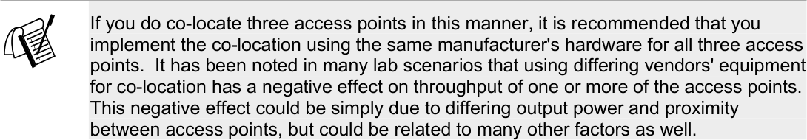

--- end of page=267 ---

Chapter 9 –Troubleshooting Wireless LAN Installations **240**

In certain instances, the extra 1 Mbps of bandwidth might still be advantageous, but in a
small environment, it might not be practical. Don't forget that this scenario applies only
to access points located in the same physical space serving the same client base, but using
different, non-overlapping channels. This configuration does not apply to channel reuse,
where cells on different non-overlapping channels are alternately spread throughout an
area to avoid co-channel interference.

**Use 802.11a Equipment**

As a second option, you could use 802.11a compliant equipment operating in the 5 GHz
UNII bands. The 5 GHz UNII bands, which are each wider than the 2.4 GHz ISM band,
have three usable bands, and each band allows for four non-overlapping channels. By
using a mixture of 802.11b and 802.11a equipment, more systems can be co-located in
the same space without fear of interference between systems. With two (or three) colocated 802.11b systems and up to 8 co-located 802.11a systems, there is the potential for
an incredible amount of throughput in the same physical space. The reason that we
specify 8 instead of 12 co-located access points with 802.11a is that only the lower and
middle bands (with 4 non-overlapping channels each) are specified for indoor use.
Therefore, indoors, where most access points are placed, there's normally only the
potential for up to 8 access points using 802.11a compliant devices.

**Issues with 802.11a Equipment**

802.11a equipment is now available from only a few vendors, and is more expensive than
equipment that uses the 2.4 GHz frequency band. However, the 5 GHz band has the
advantage of many more non-overlapping channels than the 2.4 GHz band (8 vs. 3),
allowing you to implement many more co-located access points.

You must keep in mind that while the 2.4 GHz band allows for less expensive gear, the
2.4 GHz band is much more crowded, which means you are more likely to encounter
interference from other nearby wireless LANs. Remember that 802.11a devices and
802.11b devices are incompatible. These devices do not see, hear, or communicate with
one another because they utilize different frequency bands and different modulation
techniques.

**Summary**

Why do "non-overlapping" channels overlap? There could be many answers to this
question; however, it seems that the greatest cause is access points being located too
close together. By separating the access points by a greater distance, the overlap between
theoretically non-overlapping channels is reduced. Watching this configuration on a
spectrum analyzer, you can see that for close-quarters co-location, there needs to be a
channel separation larger than 3 MHz; however, since that is what we, as administrators,
have to work with, we have to find a workaround.

We can either physically separate the radios by a further distance or we can use channels
further than 3 MHz apart (hence the suggestion of using channels 1 & 11 only for closequarters co-location). It also seems that co-location of different vendors' equipment
makes a difference as well. Using the same vendor's equipment for close-quarters co

CWNA Study Guide © Copyright 2002 Planet3 Wireless, Inc.

--- end of page=268 ---

**241** Chapter 9 –Troubleshooting Wireless LAN Installations

location has less severe overlapping than does using multiple vendors' equipment.
Whether this phenomenon is due to inaccuracies in the radios, or just due to each
vendor's implementation of hardware around the radio, is unknown.

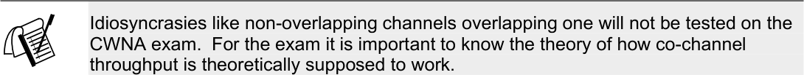

##### Types of Interference

Due to the unpredictable behavioral tendencies of RF technology, you must take into
account many kinds of RF interference during implementation and management of a
wireless LAN.  Narrowband, all-band, RF signal degradation, and adjacent and cochannel interference are the most common sources of RF interference that occur during
implementation of a wireless LAN. In this section, we will discuss these types of
interference, how they affect the wireless LAN, how to locate them, and in some cases
how to work around them.

**Narrowband**

Narrowband RF is basically the opposite of spread spectrum technology. Narrowband
signals, depending on output power, frequency width in the spectrum, and consistency,
can intermittently interrupt or even disrupt the RF signals emitted from a spread spectrum
device such as an access point. However, as its name suggests, narrowband signals do
not disrupt RF signals across the entire RF band. Thus, if the narrowband signal is
primarily disrupting the RF signals in channel 3, then you could, for example, use
Channel 11, where you may not experience any interference at all. It is also likely that
only a small portion of any given channel might be disrupted by narrowband interference.
Typically, only a single carrier frequency (a 1 MHz increment in an 802.11b 22 MHz
channel) would be disrupted due to narrowband interference. Given this type of
interference, spread spectrum technologies will usually work around this problem without
any additional administration or configuration.

**FIGURE 9.12** Picture of a handheld digital spectrum analyzer showing a narrowband signal

CWNA Study Guide © Copyright 2002 Planet3 Wireless, Inc.

--- end of page=269 ---

Chapter 9 –Troubleshooting Wireless LAN Installations **242**

To identify narrowband interference, you will need a spectrum analyzer, shown above in
Figure 9.12. Spectrum analyzers are used to locate and measure narrowband RF signals,
among other things. There are even handheld, digital spectrum analyzers available that
cost approximately $3,000. That may seem like quite a bit of money to locate a
narrowband interference source, but if that source is disabling your network, it might be
well worth it.

As an alternative, some wireless LAN vendors have implemented a software spectrum
analyzer into their client driver software. This software uses a FHSS PCMCIA card to
scan the useable portion of the 2.4 GHz ISM band for RF signals. The software
graphically displays all RF signals between 2.400 GHz and 2.4835 GHz, which gives the
administrator a way of "seeing" the RF that is present in a given area. An example of the
visual aid provided by such a spectrum analyzer is shown in Figure 9.13.

**FIGURE 9.13** Screenshot of a spectrum analyzer showing narrowband interference

In order to remedy a narrowband RF interference problem, you must first find where the
interference originates by using the spectrum analyzer. As you walk closer to the source
of the RF signal, the RF signal on the display of your spectrum analyzer grows in
amplitude (size). When the RF signal peaks on the screen, you have located its source.
At this point, you can remove the source, shield it, or use your knowledge as a wireless
network administrator to configure your wireless LAN to efficiently deal with the
narrowband interference. Of course, there are several options within this last category,
such as changing channels, changing spread spectrum technologies (DSSS to FHSS or
802.11b to 802.11a), and others that we will discuss in later sections.

CWNA Study Guide © Copyright 2002 Planet3 Wireless, Inc.

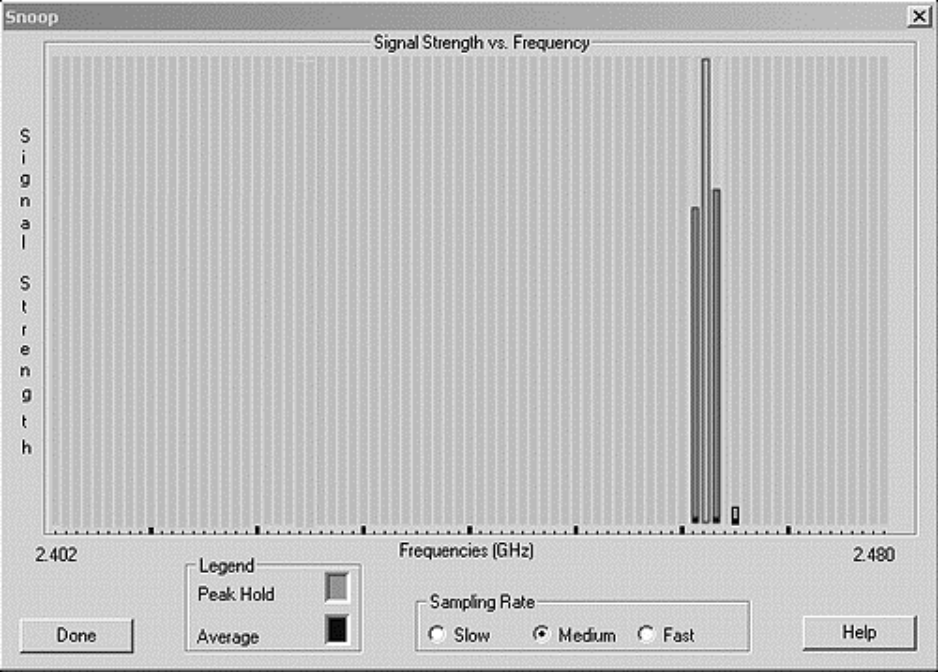

--- end of page=270 ---

**243** Chapter 9 –Troubleshooting Wireless LAN Installations

**All-band Interference**

All-band interference is any signal that interferes with the RF band from one end of the
radio spectrum to the other. All-band interference doesn't refer to interference only
across the 2.4 GHz ISM band, but rather is the term used in any case where interference
covers the entire range you're trying to use, regardless of frequency. Technologies like
Bluetooth (which hops across the entire 2.4 GHz ISM band many times per second) can,
and usually do, significantly interfere with 802.11 RF signals. Bluetooth is considered
all-band interference for an 802.11 wireless network. In Figure 9.14 a sample screen shot
of a spectrum analyzer recording all-band interference is shown.

**FIGURE 9.14** Screenshot of a software spectrum analyzer showing all-band interference

A possible source of all-band interference that can be found in homes and offices is a
microwave oven. Older, high-power microwave ovens can leak as much as one watt of
power into the RF spectrum. One watt is not much leakage for a 1000-watt microwave
oven, but considering the fact that one watt is many times as much power as is emitted
from a typical access point, you can see what a significant impact it might have. It is not
a given that a microwave oven will emit power across the entire 2.4 GHz band, but it is
possible, depending on the type and condition of the microwave oven. A spectrum
analyzer can detect this kind of problem.

When all-band interference is present, the best solution is to change to a different
technology, such as moving from 802.11b (which uses the 2.4 GHz ISM band) to 802.11a
(which uses the 5 GHz UNII bands). If changing technologies is not feasible due to cost
or implementation problems, the next best solution is to find the source of the all-band
interference and remove it from service, if possible. Finding the source of all-band

CWNA Study Guide © Copyright 2002 Planet3 Wireless, Inc.

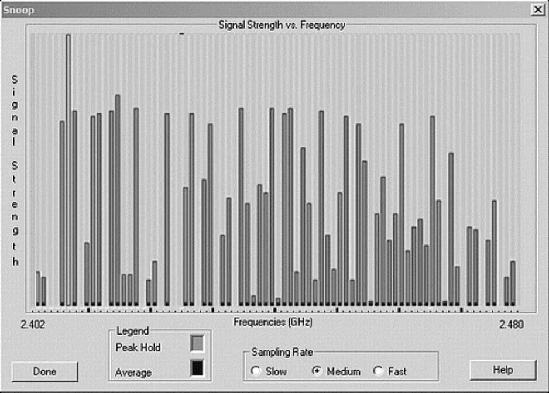

--- end of page=271 ---

Chapter 9 –Troubleshooting Wireless LAN Installations **244**

interference is more difficult than finding the source of narrowband interference because
you're not watching a single signal on the spectrum analyzer. Instead, you are looking at
a range of signals, all with varying amplitudes. You will most likely need a highly
directional antenna in order to locate the all-band interference source.

**Weather**

Severely adverse weather conditions can affect the performance of a wireless LAN. In
general, common weather occurrences like rain, hail, snow, or fog do not have an adverse
affect on wireless LANs. However, extreme occurrences of wind, fog, and perhaps smog
can cause degradation or even downtime of your wireless LAN. A _radome_ can be used
to protect an antenna from the elements. If used, radomes must have a drain hole for
condensation drainage. Yagi antennas without radomes are vulnerable to rain, as the
raindrops will accumulate on the elements and detune the performance. The droplets
actually make each element look longer than it really is. Ice accumulation on exposed
elements can cause the same detuning effect as rain; however, it stays around longer.
Radomes may also protect an antenna from falling objects such as ice falling from an
overhead tree.

2.4 GHz signals may be attenuated by up to 0.05 dB/km (0.08 dB/mile) by torrential rain
(4 inches/hr). Thick fog produces up to 0.02 dB/km (0.03 dB/mile) attenuation. At 5.8
GHz, torrential rain may produce up to 0.5 dB/km (0.8 dB/mile) attenuation, and thick
fog up to 0.07 dB/km (0.11 dB/mile). Even though rain itself does not cause major
propagation problems, rain will collect on the leaves of trees and will produce attenuation
until it evaporates.

**Wind**

Wind does not affect radio waves or an RF signal, but it can affect the positioning of
outdoor antennas. For example, consider a wireless point-to-point link that connects two
buildings that are 12 miles apart. Taking into account the curvature of the Earth (Earth
bulge), and having only a five-degree vertical and horizontal beam width on each
antenna, the positioning of each antenna would have to be exact. A strong wind could
easily move one or both antennas enough to completely degrade the signal between the
two antennas. This effect is called "antenna wind loading", and is illustrated in Figure
9.15.

CWNA Study Guide © Copyright 2002 Planet3 Wireless, Inc.

--- end of page=272 ---

**245** Chapter 9 –Troubleshooting Wireless LAN Installations

**FIGURE 9.15** Antenna Wind Loading on Point-to-point networks

Beam arrives

|No Wind|Col2|Col3|Col4|
|---|---|---|---|
|No Wind ||||

Beam misses

|re Wind moves antenna|Col2|Col3|Col4|
|---|---|---|---|
|r Wind moves antenna||||

Other similarly extreme weather occurrences like tornadoes or hurricanes must also be
considered. If you are implementing a wireless LAN in a geographic location where
hurricanes or tornadoes occur frequently, you should certainly take that into account
when setting up any type of outdoor wireless LAN. In such weather conditions, securing
antennas, cables, and the like are all very important.

**Stratification**

When very thick fog or even smog settles (such as in a valley), the air within this fog
becomes very still and begins to separate into layers. It is not the fog itself that causes
the diffraction of RF signals, but the stratification of the air within the fog. When the RF
signal goes through these layers, it is bent in the same fashion as visible light is bent as it
moves from air into water.

**Lightning**

Lightning can affect wireless LANs in two ways. First, lightning can strike either a
wireless LAN component such as an antenna or it may strike a nearby object. Lightning
strikes of nearby objects can damage your wireless LAN components as if these
components are not protected by a lightning arrestor. A second way that lightning affects
wireless LANs is by charging the air through which the RF waves must travel after
striking an object lying between the transmitter and receiver. The affect of lightning is
similar to the way that the Aurora Borealis Northern Lights provide problems for RF
television and radio transmissions.

**Adjacent Channel and Co-Channel Interference**

Having a solid understanding of channel use with wireless LANs is imperative for any
good wireless LAN administrator. As a wireless LAN consultant, you will undoubtedly

CWNA Study Guide © Copyright 2002 Planet3 Wireless, Inc.

--- end of page=273 ---

Chapter 9 –Troubleshooting Wireless LAN Installations **246**

find many wireless networks that have many access points, all of them configured for the
same channel. In these types of situations, a discussion with the network administrator
that installed the access points will divulge that he or she thought it was necessary for all
access points and clients to be on the same channel throughout the network in order for
the wireless LAN to work properly. This configuration is very common, and often
incorrect. This section will build on your knowledge of how channels are used;
explaining how multiple access points using various channels can have a detrimental
impact on a network.

**Adjacent Channel Interference**

Adjacent channels are those channels within the RF band being used that are, in essence,
side-by-side. For example, channel 1 is adjacent to channel 2, which is adjacent to
channel 3, and so on. These adjacent channels overlap each other because each channel
is 22 MHz wide and their center frequencies are only 5 MHz apart. Adjacent channel
interference happens when two or more access points using overlapping channels are
located near enough to each other that their coverage cells physically overlap. Adjacent
channel interference can severely degrade throughput in a wireless LAN.

It is especially important to pay attention to adjacent channel interference when colocating access points in an attempt to achieve higher throughput in a given area. Colocated access points on non-overlapping channels can experience adjacent channel
interference if there is not enough separation between the channels being used, as
illustrated in Figure 9.16.

**FIGURE 9.16** Adjacent channel Interference

_P_

_f_

|Adjacent Channel Interference|Col2|
|---|---|
|Channel 1 Channel 3|Channel 1 Channel 3|
|||

2.401 GHz

In order to find the problem of adjacent channel interference, a spectrum analyzer will be
needed. The spectrum analyzer will show you a picture of how the channels being used
overlap each other. Using the spectrum analyzer in the same physical area as the access
points will show the channels overlapping each other.

There are only two solutions for a problem with adjacent channel interference. The first
is to move access points on adjacent channels far enough away from each other that their
cells do not overlap, or turn the power down on each access point enough to where the
cells do not overlap. The second solution is to use only channels that have no overlap

CWNA Study Guide © Copyright 2002 Planet3 Wireless, Inc.

--- end of page=274 ---

**247** Chapter 9 –Troubleshooting Wireless LAN Installations

whatsoever. For example, using channels 1 & 11 in a DSSS system would accomplish
this task.

**Co-channel Interference**

Co-channel interference can have the same effects as adjacent channel interference, but is
an altogether different set of circumstances. Co-channel interference as seen by a
spectrum analyzer is illustrated in Figure 9.17 while how a network configuration would
produce this problem is shown in Figure 9.18.

**FIGURE 9.17** Co-channel Interference

_P_

_f_

|Ch1/Ch1 Co-channel Interfere|Col2|
|---|---|
|||

2.401 GHz

**FIGURE 9.18** Co-channel Interference in a network

Co-channel Interference

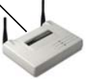

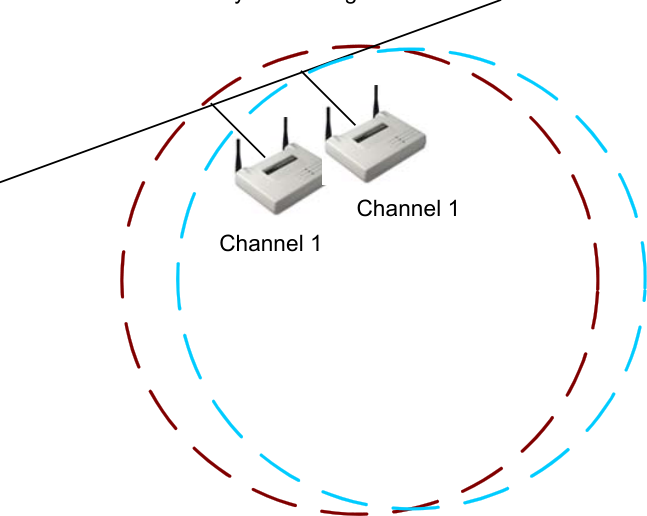

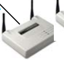

To illustrate co-channel interference, assume a 3-story building, with a wireless LAN on
each floor, with the wireless LANs each using channel 1. The access points’ signal
ranges, or cells, would likely overlap in this situation. Because each access point is on

CWNA Study Guide © Copyright 2002 Planet3 Wireless, Inc.

--- end of page=275 ---

Chapter 9 –Troubleshooting Wireless LAN Installations **248**

the same channel, they will interfere with one another. This type of interference is
known as co-channel interference.

In order to troubleshoot co-channel interference, a wireless network sniffer will be
needed. The sniffer will be able to show packets coming from each of the wireless LANs
using any particular channel. Additionally, it will show the signal strength of each
wireless LAN's packets, giving you an idea of just how much one wireless LAN is
interfering with the others.

The two solutions for co-channel interference are, first, the use of a different, nonoverlapping channel for each of the wireless LANs, and second, moving the wireless
LANs far enough apart that the access points’ cells do not overlap. These solutions are
the same remedy as for adjacent channel interference.

In situations where seamless roaming is required, a technique called channel reuse is used
in order to alleviate adjacent and co-channel interference while allowing users to roam
through adjacent cells. Channel reuse is the side-by-side locating of non-overlapping
cells to form a mesh of coverage where no cell on a given channel touches another cell on
that channel. Figure 9.19 illustrates channel reuse.

**FIGURE 9.19** Channel reuse

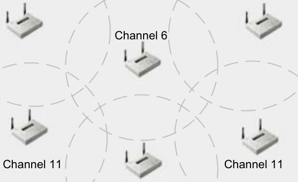

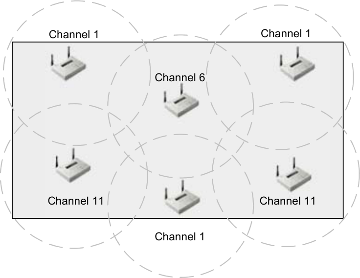

##### Range Considerations

When considering how to position wireless LAN hardware, the communication range of
the units must be taken into account. Generally, three things will affect the range of an
RF link: transmission power, antenna type and location, and environment. The
maximum communication range of a wireless LAN link is reached when, at some
distance, the link begins to become unstable, but is not lost.

CWNA Study Guide © Copyright 2002 Planet3 Wireless, Inc.

--- end of page=276 ---

**249** Chapter 9 –Troubleshooting Wireless LAN Installations

**Transmission Power**

The output power of the transmitting radio will have an effect on the range of the link. A
higher output power will cause the signal to be transmitted a greater distance, resulting in
a greater range. Conversely, lowering the output power will reduce the range.

**Antenna Type**

The type of antenna used affects the range either by focusing the RF energy into a tighter
beam transmitting it farther (as a parabolic dish antenna does); or by transmitting it in all
directions (as an omni-directional antenna does), reducing the range of communication.

**Environment**

A noisy or unstable environment can cause the range of a wireless LAN link to be
decreased. The packet error rate of an RF link is greater at the fringes of coverage due to
a small signal to noise ratio. Also, adding interference effectively raises the noise floor,
lessening the likelihood of maintaining a solid link.

The range of an RF link can also be influenced by the frequency of the transmission.
Though not normally a concern within a wireless LAN implementation, frequency might
be a consideration when planning a bridge link. For example, a 2.4 GHz system will be
able to reach further at the same output power than a 5 GHz system. The same holds true
for an older 900 MHz system: it will go further than a 2.4 GHz system at the same output
power. All of these bands are used in wireless LANs, but 2.4 GHz systems are by far the
most prevalent.

CWNA Study Guide © Copyright 2002 Planet3 Wireless, Inc.

--- end of page=277 ---

Chapter 9 –Troubleshooting Wireless LAN Installations **250**

##### Key Terms

Before taking the exam, you should be familiar with the following terms:

_adjacent channel Interference_

_all-band interference_

_antenna diversity_

_co-channel Interference_

_downfade_

_free space path loss_

_narrowband interference_

_nulling_

_spectrum analyzer_

_stratification_

_upfade_

CWNA Study Guide © Copyright 2002 Planet3 Wireless, Inc.

--- end of page=278 ---

**251** Chapter 9 –Troubleshooting Wireless LAN Installations

##### Review Questions

1. Which of the following are solutions to the hidden node problem? Choose all that
apply.

A. Using RTS/CTS

B. Increasing the power to the hidden nodes

C. Decreasing the power to the hidden node

D. Increasing the power on the access point

2. Antenna diversity is a solution to which one of the following wireless LAN
problems?

A. Near/Far

B. Hidden Node

C. Co-location throughput

D. Multipath

3. When objects in the Fresnel Zone absorb or block some of the RF wave, which one
of the following might result?

A. Signal fading

B. A surge in signal amplitude

C. A change in signal frequency

D. A change in modulation

4. What is the period of time between the main wave's arrival at the receiver and the
reflected wave's arrival at a receiver called?

A. SIFS

B. Delay spread

C. PIFS

D. Signal spread

5. Which of the following could be used to remedy a near/far problem? Choose all that
apply.

A. Decrease the power of the near nodes

B. Increase the power of the closer nodes

C. Decrease the power of the distant node

D. Increase the power of the far node

CWNA Study Guide © Copyright 2002 Planet3 Wireless, Inc.

--- end of page=279 ---

Chapter 9 –Troubleshooting Wireless LAN Installations **252**

6. Which of the following channels on three co-located access points will result in the
greatest co-channel interference?

A. 1, 1, 1

B. 1, 2, 3

C. 1, 6, 11

D. 1, 11

7. Which one of the following can cause all-band interference?

A. Metal roof

B. Lake

C. Bluetooth

D. HiperLAN

8. Why are most access points built with two antennas?

A. Access points are half-duplex devices that send on one antenna and receive on
the other

B. Access points use one antenna as a standby for reliability

C. Access points use two antennas to overcome multipath

D. Access points use two antennas to transmit on two different channels

9. Using RTS/CTS can solve the hidden node problem and will not affect network
throughput

A. This statement is always true

B. This statement is always false

C. Depends on the manufacturer’s equipment

10. Which of the following can cause RF interference in a wireless LAN? Choose all
that apply.

A. Wind

B. Lightning

C. Smog

D. Clouds

CWNA Study Guide © Copyright 2002 Planet3 Wireless, Inc.

--- end of page=280 ---

**253** Chapter 9 –Troubleshooting Wireless LAN Installations

11. Multipath is defined as which one of the following?

A. The negative effects induced on a wireless LAN by reflected RF signals
arriving at the receiver along with the main signal.

B. Surges in signal strength due to an RF signal taking multiple paths between the
sending and receiving stations

C. The condition caused by a receiving station having multiple antennas which
causes the signal to take multiple paths to the CPU

D. The result of using a signal splitter to create multiple signal paths between
sending and receiving stations

12. Multipath can cause signals to increase above the power of the signal that was
transmitted by the sending station. This statement is:

A. Always true

B. Always false

C. True, when the signal is transmitted in clear weather

D. False, unless a 12 dBi or higher power antenna is being used

13. Multipath is caused by which one of the following?

A. Multiple antennas

B. Wind

C. Reflected RF waves

D. Bad weather

14. When can the hidden node problem occur?

A. Only when a network is at full capacity

B. When all users of a wireless LAN are simultaneously transmitting data

C. Anytime, even after a flawless site survey

D. Every time a wireless LAN client roams from one access point to another

15. Which one of the following is NOT a solution for correcting the hidden node
problem?

A. Using the RTS/CTS protocol

B. Increasing power to the node(s)

C. Removing obstacles between nodes

D. Moving the hidden node(s)

CWNA Study Guide © Copyright 2002 Planet3 Wireless, Inc.

--- end of page=281 ---

Chapter 9 –Troubleshooting Wireless LAN Installations **254**

16. How is the threshold set when using RTS/CTS in "On with Threshold" mode on a
wireless LAN?

A. Automatically by the access points only

B. Manually by the user of the hidden node

C. Manually on the clients and access points by the wireless LAN administrator

D. Automatically by the clients only

17. A situation that results in the client(s) that are farther away from the access point and
using less power to not be heard over the traffic from the closer, high-powered
clients, is known as:

A. Hidden Node

B. Near/Far

C. Degraded throughput

D. Interference

18. Why should an administrator be able to co-locate 3 DSSS access points in the same
area using the 2.4 GHz ISM band?

A. Each access point will transmit on one band and receive on another.

B. Each access point will use co-channel interference to stop the others from
transmitting data when it is ready to send

C. The access points will use channels that do not overlap or cause adjacent
channel interference

D. There are up to five non-overlapping DSSS channels in the ISM bands.

19. How many channels in the 2.4 GHz spectrum are designated for use in the United
States?

A. 3

B. 14

C. 10

D. 11

20. Which one of the following is an advantage of 5 GHz (802.11a) equipment over
802.11b equipment?

A. The lower 5 GHz UNII band is wider than the 2.4 GHz ISM band

B. The 802.11a equipment is less expensive than 802.11b

C. The 5 GHz UNII bands allows for more non-overlapping channels than the 2.4
GHz ISM band

D. 802.11a equipment is backwards compatible with 802.11g equipment

CWNA Study Guide © Copyright 2002 Planet3 Wireless, Inc.

--- end of page=282 ---

**255** Chapter 9 –Troubleshooting Wireless LAN Installations

##### Answers to Review Questions

1. A, B. Sometimes increasing the power on the nodes is enough to transmit through
or around the obstacle blocking the RF signals from stations and sometimes it is not.
When increasing the power is not enough, the best course of action is use of the
RTS/CTS protocol in order that stations broadcast their intention to transmit data on
the network.

2. D. By having two antennas and supporting antenna diversity, most access points can
overcome multipath problems. Antenna diversity works by separating the two
antennas by a distance greater than the wavelength of the frequency in use thereby
reducing the changes that both spots will have exactly the same detrimental effects
from reflected waves.

3. A. Signal fading can refer to upfade, downfade, or nulling of an RF transmission.
This type of fading is sometimes referred to as Rayleigh fading, but most often it is
simply deemed _fading_ . No matter what type of fading happens, it's generally
detrimental to the main RF wave.

4. B. The delay spread is the amount of time between the arrival at the receiver of the
main RF wave and the arrival of the last reflected wave. This amount of time is
typically 4 nanoseconds or less.

5. A, D. The near/far problem is normally remedied by the wireless protocols in use
such as CSMA/CA. When these protocols are ineffective, increasing power to
remote nodes, moving the remote nodes closer to the local nodes, or decreasing
power to the local nodes are some available remedies.

6. A. Co-channel interference is the interference experienced between systems using
the same channel. In this question, only answer 'A' meets the criteria of all access
points being on the same channel.

7. C. All band interference is interference that spans the width of the frequency band
in use. This type of interference cannot be avoided by a wireless LAN system,
leaving the administrator one option: a different frequency band must be used, which
often means use of a different set of wireless LAN technologies. Bluetooth spans
the width of the 2.4 GHz ISM band disrupting 802.11, 802.11b, and 802.11g data
transmissions.

8. C. Access points use two antennas in order to implement antenna diversity to
overcome multipath. The radios used in wireless LANs are half duplex meaning
they can either transmit or receive at any given time. Multipath is an effect caused
by reflected RF waves and can disrupt or corrupt data transmissions. Access points
sample inputs from both antennas and use the best signal. Access points normally
transmit on the antenna last used for receiving.

9. B. Use of the RTS/CTS protocol always adds overhead to the network, decreasing
throughput. Use of the RTS/CTS protocol, when used appropriately, can help
reduce a high rate of collisions on a wireless network, but does not _solve_ the hidden
node problem. Solving the hidden node problem would consist of all nodes being
able to hear one another’s transmissions.

CWNA Study Guide © Copyright 2002 Planet3 Wireless, Inc.

--- end of page=283 ---

Chapter 9 –Troubleshooting Wireless LAN Installations **256**

10. A, B, C. Wind can load antennas, breaking RF links or at least causing degraded
throughput. Lightning can destroy wireless LAN equipment and can introduce high
levels of RF interference due to power surges around the transmission path between
the transmitter and receiver. Smog can have intermittent effects on wireless LANs
depending on the severity and makeup of the smog. Generally smog causes
degraded throughput for a long-distance RF link.

11. A. Multipath is the set of negative effects that multiple RF signals arriving at the
same destination at almost the same time from the same source has on a wireless
LAN. These reflected signals can have numerous effects on the main signal.
Multipath is especially disruptive when there are many reflective objects in area
around the signal path from transmitter to receiver.

12. B. Due to Free Space Path Loss, an RF wave arriving at a receiver will never be as
strong as the transmitted wave. Multipath can cause an increase in the received
signal over what it would have been had there been no multipath due to reflected
waves being in phase with the main wave, but the main signal will never be
increased in amplitude beyond the transmission power.

13. C. If there were no reflective objective near the signal path between transmitter and
receiver, multipath would not exist. The lack of any reflective object is rarely the
case since anything metal and many smooth things (like a body of water or a flat
stretch of earth) reflect RF waves. Multipath almost always exists in any wireless
LAN connection; hence, the use of dual antennas on most access points.

14. C. The causes of the hidden node problem are numerous. Typical causes are
obstructions through which RF waves cannot penetrate and low power on client
stations. A good site survey might help in reducing the occurrences of hidden node
problems, but eliminating them would only be possible in an unchanging
environment. The main use and advantage of a wireless LAN is mobility, which
creates an ever-changing environment.

15. A. The RTS/CTS protocol is not a cure for the hidden node problem, but a tool used
to reduce the negative effects that hidden nodes have on the network: collisions.

16. C. The network administrator must manually configure the access points and clients
for use of RTS/CTS regardless of the setting. The three settings are _Off_, _On_, and _On_
_with Threshold_ . The _Off_ setting is used by default to reduce unnecessary overhead
on the network.

17. B. The near/far problem is one that is addressed by the access protocols used by
wireless networks. This problem is seen in both cellular and wireless LAN
networks. When the problem is severe, it might be necessary to move distant nodes
closer, increase power to distant nodes, or to decrease power to closer nodes.

18. C. There are three non-overlapping DSSS channels specified by the FCC in the 2.4
GHz ISM band. Each of these bands is separated by 5 MHz. These channels are 1,
6, & 11 as numbered by the FCC.

19. D. The FCC specifies 14 channels for use with wireless LANs, 11 of which can be
used in the United States. Each channel is 22 MHz wide, and the channel is
specified as a center frequency +11 MHz and -11 MHz.

CWNA Study Guide © Copyright 2002 Planet3 Wireless, Inc.

--- end of page=284 ---

**257** Chapter 9 –Troubleshooting Wireless LAN Installations

20. C. The lower 5 GHz UNII band and the 2.4 GHz ISM band are the same width 100 MHz. 802.11a equipment is new and significantly more expensive than 802.11b
equipment and is not compatible with 802.11b or 802.11g equipment in any
capacity. The UNII bands (all three of them) allow for a larger useable portion than
does the 2.4 GHz ISM band, yielding a maximum of 4 non-overlapping DSSS
channels.

CWNA Study Guide © Copyright 2002 Planet3 Wireless, Inc.

--- end of page=285 ---

--- end of page=286 ---
