# Chapter 10 - Security

_PDF pages 288-323_

##### Wireless LAN Security

**CWNA Exam Objectives Covered:**

- Identify the strengths, weaknesses and appropriate uses of the
following wireless LAN security techniques

 - WEP

 - AES

 - Filtering

 - Emerging security techniques

- Describe the following types of wireless LAN security attacks,
and explain how to identify and prevent them

 - Passive attacks (eavesdropping)

 - Active attacks (connecting, probing, and configuring the network)

 - Jamming attacks

 - Man-in-the-middle attacks

- Given a wireless LAN scenario, identify the appropriate security
solution from the following available wireless LAN security
solutions

 - WEP key solutions

 - Wireless VPN

 - Key hopping

 - AES based solutions

 - Wireless gateways

 - 802.1x and EAP

- Explain the uses of the following corporate security policies and
how they are used to secure a wireless LAN

 - Securing sensitive information

 - Physical security

 - Inventory and audits

 - Using advanced solutions

 - Public networks

- Identify how and where the following security precautions are
used to secure a wireless LAN

 - WEP

 - Cell sizing

 - Monitoring

 - User authentication

 - Wireless DMZ

CWNA Study Guide © Copyright 2002 Planet3 Wireless, Inc.

CHAPTER CHAPTER
# 10 5

**In This Chapter**

WEP

Filtering

Attacks

Emerging Solutions

Corporate Security Policy

Security Recommendations

--- end of page=287 ---

Chapter 10 – Wireless LAN Security **260**

Wireless LANs are not inherently secure; however, if you do not take any precautions or
configure any defenses with _wired_ LAN or WAN connections, they are not secure either.
The key to making a wireless LAN secure, and keeping it secure, is educating those who
implement and manage the wireless LAN. Educating the administrator on basic and
advanced security procedures for wireless LANs is essential to preventing security
breaches into your wireless LAN.

In this very important chapter, we will discuss the much-maligned 802.11 specified
security solution known as Wired Equivalent Privacy, or WEP.  As you may already
know, WEP alone will not keep a hacker out of a wireless LAN for very long. This
chapter will explain why, and offer some steps for how WEP can be used with some level
of effectiveness.

We will explain the various methods that can be used to attack a wireless LAN so that as
an administrator you will know what to expect and how to prevent it. Then we will
discuss some of the emerging security solutions that are available, but not yet specified
by any of the 802.11 standards. Finally, we will offer some recommendations for
maintaining wireless LAN security and discuss corporate security policy as it pertains
specifically to wireless LANs.

This chapter on wireless LAN security is by no means the end of knowledge on the
subject. Rather, this chapter should serve the CWNA candidate as a basic introduction to
the inherent weaknesses of wireless LANs and the available solutions for compensating
for these weaknesses.

##### Wired Equivalent Privacy

Wired Equivalent Privacy (WEP) is an encryption algorithm used by the Shared Key
authentication process for authenticating users and for encrypting data payloads over only
the wireless segment of the LAN. The IEEE 802.11 standard specifies the use of WEP.

WEP is a simple algorithm that utilizes a pseudo-random number generator (PRNG) and
the RC4 stream cipher. For several years this algorithm was considered a trade secret and
details were not available, but in September of 1994, someone posted the source code in
the cypherpunks mailing list. Although the source code is now available, RC4 is still
trademarked by RSADSI.  The RC4 stream cipher is fast to decrypt and encrypt, which
saves on CPU cycles, and RC4 is also simple enough for most software developers to
code it into software.

When WEP is referred to as being simple, it means that it is _weak_ . The RC4 algorithm
was inappropriately implemented in WEP, yielding a less-than-adequate security solution
for 802.11 networks. Both 64-bit and 128-bit WEP (the two available types) have the
same weak implementation of a 24-bit Initialization Vector (IV) and use the same flawed
process of encryption. The flawed process is that most implementations of WEP
initialize hardware using an IV of 0 - thereafter incrementing the IV by 1 for each packet
sent. For a busy network, statistical analysis shows that all possible IVs (2 [24] ) would be
exhausted in half a day, meaning the IV would be reinitialized starting at zero at least
once a day. This scenario creates an open door for determined hackers. When WEP is

CWNA Study Guide © Copyright 2002 Planet3 Wireless, Inc.

--- end of page=288 ---

**261** Chapter 10 – Wireless LAN Security

used, the IV is transmitted in the clear with each encrypted packet. The manner in which
the IV is incremented and sent in the clear allows the following breaches in security:

      - _Active attacks to inject new traffic-_ Unauthorized mobile stations can inject
packets onto the network based on known plaintext

      - _Active attacks to decrypt traffic_      - Based on tricking the access point

      - _Dictionary-building attacks_      - After gathering enough traffic, the WEP key can be
cracked using freeware tools. Once the WEP key is cracked, real-time
decryption of packets can be accomplished by listening to broadcasts packets
using the WEP key

      - _Passive attacks to decrypt traffic_      - Using statistical analysis, WEP traffic can be
decrypted.

**Why WEP Was Chosen**

Since WEP is not secure, why was it chosen and implemented into the 802.11 standard?
Once the 802.11 standard was approved and completed, the manufacturers of wireless
LAN equipment rushed their products to market. The 802.11 standard specifies the
following criteria for security:

      - Exportable

      - Reasonably Strong

      - Self-Synchronizing

      - Computationally Efficient

      - Optional

WEP meets all these requirements. When it was implemented, WEP was intended to
support the security goals of confidentiality, access control, and data integrity. What
actually happened is that too many early adopters of wireless LANs thought that they
could simply implement WEP and have a completely secure wireless LAN. These early
adopters found out quickly that WEP wasn't the complete solution to wireless LAN
security. Fortunately for the industry, wireless LAN hardware had gained immense
popularity well before this problem was widely known. This series of events led to many
vendors and third party organizations scrambling to create wireless LAN security
solutions.

The 802.11 standard leaves WEP implementation up to wireless LAN manufacturers, so
each vendor’s implementation of WEP keys may or may not be the same, adding another
weakness to WEP. Even WECA's Wi-Fi interoperability standard tests include only 40bit WEP keys. Some wireless LAN manufacturers have chosen to enhance (fix) WEP,
while others have looked to using new standards such as 802.1x with EAP or Virtual
Private Networks (VPN). There are many solutions on the market addressing the
weaknesses found in WEP.

CWNA Study Guide © Copyright 2002 Planet3 Wireless, Inc.

--- end of page=289 ---

Chapter 10 – Wireless LAN Security **262**

**WEP Keys**

The core functionality of WEP lies in what are known as _keys_, which are the basis for the
encryption algorithm discussed in the previous section of this chapter. WEP keys are
implemented on client and infrastructure devices on a wireless LAN. A WEP key is an
alphanumeric character string used in two manners in a wireless LAN. First, a WEP key
can be used to verify the identity of an authenticating station. Second, WEP keys can be
used for data encryption.

When a WEP-enabled client attempts to authenticate and associate to an access point, the
access point will determine whether or not the client has the correct WEP key. By
“correct”, we mean that the client has to have a key that is part of the WEP key
distribution system implemented on that particular wireless LAN. The WEP keys must
match on both ends of the wireless LAN connection.

As a wireless LAN administrator, it may be your job to distribute the WEP keys
manually, or to setup a more advanced method of WEP key distribution. WEP key
distribution systems can be as simple as implementing static keys or as advanced as using
centralized encryption key servers. Obviously, the more advanced the WEP system is,
the harder it will be for a hacker to gain access to the network.

WEP keys are available in two types, 64-bit and 128-bit. Many times you will see them
referenced as 40-bit and 104-bit instead. This reference is a bit of a misnomer. The
reason for this misnomer is that WEP is implemented in the same way for both
encryption lengths. Each uses a 24-bit Initialization Vector concatenated (linked end-toend) with a secret key. The secret key lengths are 40-bit or 104-bit yielding WEP key
lengths of 64 bits and 128 bits.

Entering static WEP keys into clients or infrastructure devices such as bridges or access
points is quite simple. A typical configuration program is shown in Figure 10.1.
Sometimes there is a checkbox for selecting 40- or 128-bit WEP. Sometimes no
checkbox is present, so the administrator must know how many characters to enter when
asked. Most often, client software will allow inputting of WEP keys in alphanumeric
(ASCII) or hexadecimal (HEX) format. Some devices may require ASCII or HEX, and
some may take either form of input.

CWNA Study Guide © Copyright 2002 Planet3 Wireless, Inc.

--- end of page=290 ---

**263** Chapter 10 – Wireless LAN Security

**FIGURE 10.1** Entering WEP keys on client devices

The number of characters entered for the secret key depends on whether the configuration
software requires ASCII or HEX and whether 64-bit or 128-bit WEP is being used. If
your wireless card supports 128-bit WEP, then it automatically supports 64-bit WEP as
well. If entering your WEP key in ASCII format, then 5 characters are used for 64-bit
WEP and 13 characters are used for 128-bit WEP. If entering your WEP key in HEX
format, then 10 characters are used for 64-bit WEP and 26 characters are used for 128-bit
WEP.

**Static WEP Keys**

If you choose to implement static WEP keys, you would manually assign a static WEP
key to an access point and its associated clients. These WEP keys would never change,
making that segment of the network susceptible to hackers who may be aware of the
intricacies of WEP keys. For this reason, static WEP keys may be an appropriate basic
security method for simple, small wireless LANs, but are not recommended for enterprise
wireless LAN solutions.

When static WEP keys are implemented, it is simple for network security to be
compromised. Consider if an employee left a company and "lost" their wireless LAN
card. Since the card carries the WEP key in its firmware, that card will always have
access to the wireless LAN until the WEP keys on the wireless LAN are changed.

Most access points and clients have the ability to hold up to 4 WEP keys simultaneously,
as can be seen in Figure 10.2. One useful reason for having the ability to enter up to 4
WEP keys is network segmentation. Suppose a network had 100 client stations. Giving
out four WEP keys instead of one could segment the users into four distinct groups of 25.

CWNA Study Guide © Copyright 2002 Planet3 Wireless, Inc.

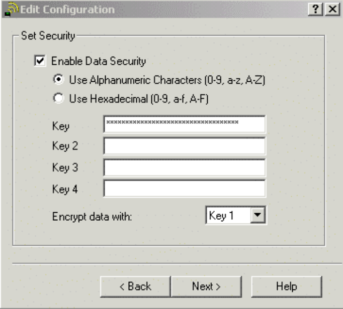

--- end of page=291 ---

Chapter 10 – Wireless LAN Security **264**

If a WEP key were compromised, it would mean changing 25 stations and an access point
or two instead of the entire network.

Another reason for multiple WEP keys is in case there is a mix of 64-bit and 128-bit
cards on the network. Since an administrator might want to use as strong an encryption
scheme as possible for nodes that support 128-bit WEP, being able to segment users into
groups of 64-bit and 128-bit WEP ensures the use of the maximum encryption available
for each without affecting the other group.

**Figure 10.2** Entering WEP keys on infrastructure devices

**Centralized Encryption Key Servers**

For enterprise wireless LANs using WEP as a basic security mechanism, centralized
encryption key servers should be used if possible for the following reasons:

      - Centralized key generation

      - Centralized key distribution

      - Ongoing key rotation

      - Reduced key management overhead

Any number of different devices can act as a centralized key server. Usually a server of
some kind such as a RADIUS server or a specialized application server for the purpose of
handing out new WEP keys on a short time interval is used. Normally, when using WEP,
the keys (made up by the administrator) are manually entered into the stations and access
points. When using a centralized key server, an automated process between stations,
access points, and the key server performs the task of handing out WEP keys. Figure
10.3 illustrates how a typical encryption key server would be setup.

CWNA Study Guide © Copyright 2002 Planet3 Wireless, Inc.

--- end of page=292 ---

**265** Chapter 10 – Wireless LAN Security

**FIGURE 10.3** Centralized Encryption Key Server

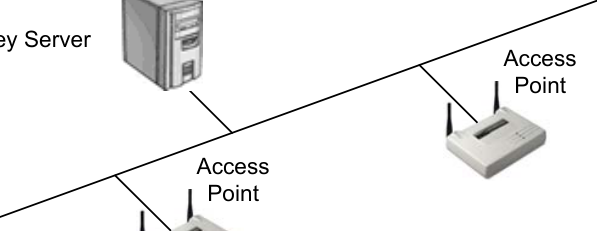

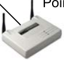

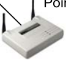

Centralized encryption key servers allow for key generation on a per-packet, per-session
or other method, depending on the particular manufacturer’s implementation. Per-packet
WEP key distribution calls for a new WEP key to be assigned to both ends of the
connection for every packet sent, whereas per-session WEP key distribution uses a new
WEP key for each new session between nodes.

**WEP Usage**

When WEP is initialized, the data payload of the packet being sent using WEP is
encrypted; however, part of the packet header – including MAC address – is _not_
encrypted. All layer 3 information including source and destination addresses is
encrypted with WEP. When an access point sends out its beacons on a wireless LAN
using WEP, the beacons are not encrypted. Remember that the beacons do not include
any layer 3 information.

When packets are sent using WEP encryption, those packets must be decrypted. This
decryption process consumes CPU cycles and reduces the effective throughput on the
wireless LAN, sometimes significantly. Some manufacturers have implemented
additional CPUs in their access points for the purpose of performing WEP encryption and
decryption. Many manufacturers implement WEP encryption/decryption in software and
use the same CPU that's used for access point management, packet forwarding, etc.
These access points are generally the ones where WEP will have the most significant
effects if enabled. By implementing WEP in hardware, it is very likely that an access
point can maintain its 5 Mbps (or more) throughput with WEP enabled. The disadvantage
of this implementation is the added cost of a more advanced access point.

WEP can be implemented as a basic security mechanism, but network administrators
should first be aware of WEP’s weaknesses and how to compensate for them. The
administrator should also be aware of the fact that each vendor’s use of WEP can and
may be different, hindering the use of multiple vendor hardware.

CWNA Study Guide © Copyright 2002 Planet3 Wireless, Inc.

--- end of page=293 ---

Chapter 10 – Wireless LAN Security **266**

**Advanced Encryption Standard**

The Advanced Encryption Standard (AES) is gaining acceptance as an appropriate
replacement for the RC4 algorithm used in WEP. AES uses the Rijndale (pronounced
‘RINE-dale’) algorithm in the following specified key lengths:

     - 128-bit

     - 192-bit

     - 256-bit

AES is considered to be un-crackable by most cryptographers, and the National Institute
of Standards and Technology (NIST) has chosen AES for the Federal Information
Processing Standard, or FIPS. As part of the effort to improve the 802.11 standard, the
802.11i working committee is considering the use of AES in _WEPv2_ .

AES, if approved by the 802.11i working group to be used in WEPv2, will be
implemented in firmware and software by vendors. Access point firmware and client
station firmware (the PCMCIA radio cards) will have to be upgraded to support AES.
Client station software (drivers and client utilities) will support configuring AES with
secret key(s).

**Filtering**

Filtering is a basic security mechanism that can be used in addition to WEP and/or AES.
Filtering literally means to keep out that which is _not_ wanted and to allow that which _is_
wanted. Filtering works the same way as access lists on a router: by defining parameters
to which stations must adhere in order to gain access to the network. With wireless
LANs, it is not so much what the stations do, but rather who they are and how they are
configured. There are three basic types of filtering that can be performed on a wireless
LAN:

     - SSID filtering

     - MAC address filtering

     - Protocol filtering

This section will explain what each of these types of filtering are, what each can do for
the administrator, and how to configure each one.

**SSID Filtering**

SSID filtering is a rudimentary method of filtering, and should only be used for the most
basic access control. The SSID (service set identifier) is just another term for the
network name. The SSID of a wireless LAN station must match the SSID on the access
point (infrastructure mode) or of the other stations (ad hoc mode) in order for the client to
authenticate and associate to the service set. Since the SSID is broadcast in the clear in
every beacon that the access point (or set of stations) sends out, it is very simple to find
out the SSID of a network using a sniffer. Many access points have the ability to take the

CWNA Study Guide © Copyright 2002 Planet3 Wireless, Inc.

--- end of page=294 ---

**267** Chapter 10 – Wireless LAN Security

SSID out of the beacon frame. When this is the case, the client must have the matching
SSID in order to associate to the access point. When a system is configured in this
manner, it is said to be a "closed system." SSID filtering is _not_ considered a reliable
method of keeping unauthorized users out of a wireless LAN.

Some manufacturer's access points have the ability to remove the SSID from beacons
and/or probe responses. In this case, in order to join the service set, a station must have
the SSID configured manually in the driver configuration settings. Some common
mistakes that wireless LAN users make in administering SSIDs are listed below:

      - _Using the default SSID_      - This setting is yet another way to give away information
about your wireless LAN. It is simple enough to use a sniffer to see that MAC
addresses originating from the access point and then look up the MAC address in
the OUI table hosted by IEEE. The OUI table lists the different MAC address
prefixes that are assigned to each manufacturer. Until Netstumbler came along,
this process was manual, but now Netstumbler performs this task automatically.
If you don't know how to use Netstumbler or are unfamiliar with network
sniffers, then looking for default SSIDs also works well. Each wireless LAN
manufacturer uses their own default SSID, and, since there are still a manageable
number of wireless LAN manufacturers in the industry, obtaining each of the
user manuals from the support section of each manufacturer's website and
looking for the default SSID and default IP subnet information is a simple task.
_Always change the default SSID._

- _Making the SSID something company-related_ - This type of setting is a security
risk because it simplifies the process of a hacker finding the company's physical
location. When looking for wireless LANs in any particular geographic region,
finding the physical location of the wireless LAN is half the battle. Even after
detecting the wireless LAN using tools such as Netstumbler, finding where the
signal originates takes time and considerable effort in many cases. When an
administrator uses an SSID that names the company or organization, it makes
finding the wireless LAN very easy. _Always use non-company-related SSIDs._

- _Using the SSID as a means of securing wireless networks_ - This practice is
highly discouraged since a user must only change the SSID in the configuration
setting is his workstation in order to join the network. SSIDs should be used as a
means of _segmenting_ the network, not securing it. Again, think of the SSID as
the network name. Just as with Windows' Network Neighborhood, changing the
workgroup your computer is a part of and is as simple as changing a
configuration setting on the client station.

- _Unnecessarily Broadcasting SSIDs_ - If your access points have the ability to
remove SSIDs from beacons and probe responses, configure them that way. This
configuration aids in deterring casual eavesdroppers from tinkering with or using
your wireless LAN.

CWNA Study Guide © Copyright 2002 Planet3 Wireless, Inc.

--- end of page=295 ---

Chapter 10 – Wireless LAN Security **268**

**MAC Address Filtering**

Wireless LANs can filter based on the MAC addresses of client stations. Almost all
access points (even very inexpensive ones) have MAC filter functionality. The network
administrator can compile, distribute, and maintain a list of allowable MAC addresses
and program them into each access point. If a PC card or other client with a MAC
address that is not in the access point’s MAC filter list tries to gain access to the wireless
LAN, the MAC address filter functionality will not allow that client to associate with that
access point. Figure 10.4 illustrates this point.

Of course, programming every wireless client's MAC address into every access point
across a large enterprise network would be impractical. MAC filters can be implemented
on some RADIUS servers instead of in each access point. This configuration makes
MAC filters a much more scalable security solution. Simply entering each MAC address
into RADIUS along with user identity information, which would have to be input
anyway, is a good solution. RADIUS servers often point to another authentication
source, so that other authentication source would need to support MAC filters.

**FIGURE 10.4** MAC Filters

Access Access

MAC Filter

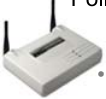

Stolen Card

Rogue Client
with Stolen
PC Card

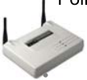

MAC filters can work in reverse as well. For example, consider an employee who left a
company and took their wireless LAN card with them. This wireless LAN card holds the
WEP key and MAC filters, which, for the sake of this example, are not used. The
administrator could then create a filter on all access points to disallow the MAC address
of the client device that was taken by the employee. If MAC filters were already being
used on this network when the wireless LAN card was stolen, removing the particular
client's MAC address from the _allow_ list would work as well.

Although MAC filters may seem to be a good method of securing a wireless LAN in
some instances, they are still susceptible to the following intrusions:

 - Theft of a PC card that is in the MAC filter of an access point

 - Sniffing the wireless LAN and then spoofing with the MAC address after
business hours

CWNA Study Guide © Copyright 2002 Planet3 Wireless, Inc.

--- end of page=296 ---

**269** Chapter 10 – Wireless LAN Security

MAC filters are great for home and small office networks where there are a small number
of client stations. Using WEP and MAC filters provides an adequate security solution in
these instances. This solution is adequate because no intelligent hacker is going to spend
the hours it takes to break WEP on a low-use network and expend the energy to
circumvent a MAC filter for the purpose of getting to a person's laptop or desktop PC at
home.

**Circumventing MAC Filters**

MAC addresses of wireless LAN clients are broadcast in the clear by access points and
bridges, even when WEP is implemented. Therefore, a hacker who can listen to traffic
on your network can quickly find out most MAC addresses that are allowed on your
wireless network. In order for a sniffer to see a station's MAC address, that station must
transmit a frame across the wireless segment.

Some wireless PC cards permit the changing of their MAC address through software or
even operating system configuration changes. Once a hacker has a list of allowed MAC
addresses, the hacker can simply change the PC card’s MAC address to match one of the
PC cards on your network, instantly gaining access to your entire wireless LAN.

Since two stations with the same MAC address cannot peacefully co-exist on a LAN, the
hacker must find the MAC address of a mobile station that is removed from the premises
at particular times of the day. It is during this time when the mobile station (notebook
computer) is not present on the wireless LAN that the hacker can gain access into the
network. MAC filters should be used when feasible, but not as the sole security
mechanism on your wireless LAN.

**Protocol Filtering**

Wireless LANs can filter packets traversing the network based on layer 2-7 protocols. In
many cases, manufacturers make protocol filters independently configurable for both the
wired segment and wireless segment of the access point.

Imagine a scenario where a wireless workgroup bridge is placed on a remote building in a
campus wireless LAN that connects back to the main information technology building's
access point. Because all users in the remote building are sharing the 5 Mbps of
throughput between these buildings, some amount of control over usage must be
implemented. If this link was installed for the express purpose of Internet access for
these users, then filtering out every protocol except SMTP, POP3, HTTP, HTTPS, FTP,
and any instant messaging protocols would limit users from being able to access internal
company file servers for example. The ability to set protocol filters such as these is very
useful in controlling utilization of the shared medium. Figure 10.5 illustrates how
protocol filtering works in a wireless LAN.

CWNA Study Guide © Copyright 2002 Planet3 Wireless, Inc.

--- end of page=297 ---

**FIGURE 10.5** Protocol Filtering

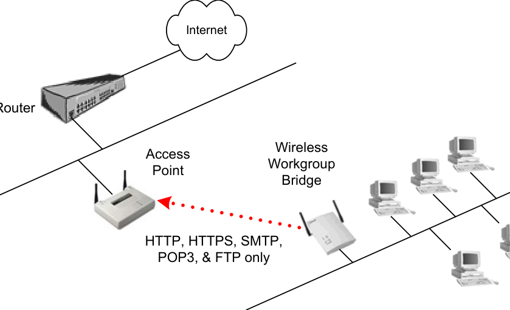

Chapter 10 – Wireless LAN Security **270**

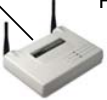

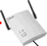

##### Attacks on Wireless LANs

A malicious hacker can seek to disable or attempt to gain access to a wireless LAN in
several ways. Some of these methods are:

1. Passive attacks (eavesdropping)

2. Active attacks (connecting, probing, and configuring the network)

3. Jamming attacks

4. Man-in-the-middle attacks

The above list is by no means exhaustive, and some of these methods can be orchestrated
in several different ways. It is beyond the scope of this book to present every possible
means of wireless LAN attack. This text is aimed at giving a network administrator
insight into some possible methods of attack so that security will be considered a vital
part of wireless LAN implementation.

**Passive Attacks**

Eavesdropping is perhaps the most simple, yet still effective type of wireless LAN attack.
Passive attacks like eavesdropping leave no trace of the hacker's presence on or near the
network since the hacker does not have to actually connect to an access point to listen to
packets traversing the wireless segment. Wireless LAN sniffers or custom applications
are typically used to gather information about the wireless network from a distance with a

CWNA Study Guide © Copyright 2002 Planet3 Wireless, Inc.

--- end of page=298 ---

**271** Chapter 10 – Wireless LAN Security

directional antenna, as illustrated in Figure 10.6. This method of access allows the
hacker to keep his distance from the facility, leave no trace of his presence, and listen to
and gather valuable information.

**FIGURE 10.6** Passive Attack Example

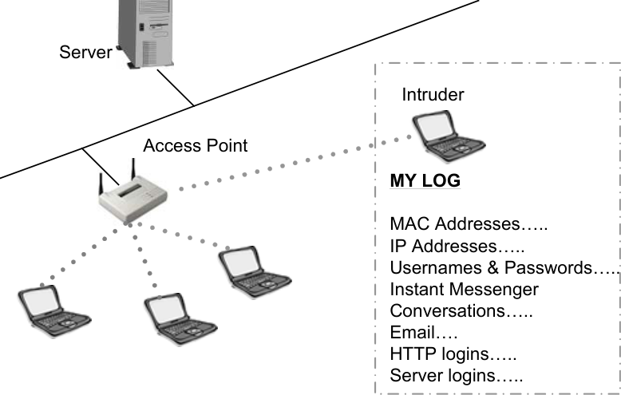

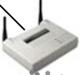

There are applications capable of gathering passwords from HTTP sites, email, instant
messengers, FTP sessions, and telnet sessions that are sent in clear text. There are other
applications that can snatch password hashes traversing the wireless segment between
client and server for login purposes. Any information going across the wireless segment
in this manner leaves the network and individual users vulnerable to attack. Consider the
impact if a hacker gained access to a user's domain login information and caused havoc
on the network. The hacker would be to blame, but network usage logs would point
directly at the user. This breach could cost a person their job. Consider another situation
in which HTTP or email passwords were gathered over the wireless segment and later
used by a malicious hacker for personal gain from a remote site.

A hacker who is parked in your facility’s parking lot may have a veritable toolkit for
breaking into your wireless LAN. All this individual needs is a packet sniffer and some
shareware or freeware hacking utilities to acquire your WEP keys and to gain access to
the wireless network.

**Active Attacks**

Hackers can stage active attacks in order to perform some type of function on the
network. An active attack might be used to gain access to a server to obtain valuable
data, use the organization's Internet access for malicious purposes, or even change the
network infrastructure configuration. By connecting to a wireless network through an
access point, a user can begin to penetrate deeper into the network or perhaps make
changes to the wireless network itself. For example, if a hacker made it past a MAC
filter, then the hacker could navigate to the access points and remove all MAC filters,

CWNA Study Guide © Copyright 2002 Planet3 Wireless, Inc.

--- end of page=299 ---

Chapter 10 – Wireless LAN Security **272**

making it easier to gain access next time. The administrator might not even notice this
change for some time. Figure 10.7 illustrates an active attack on a wireless LAN.

**FIGURE 10.7** Active Attack Example

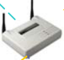

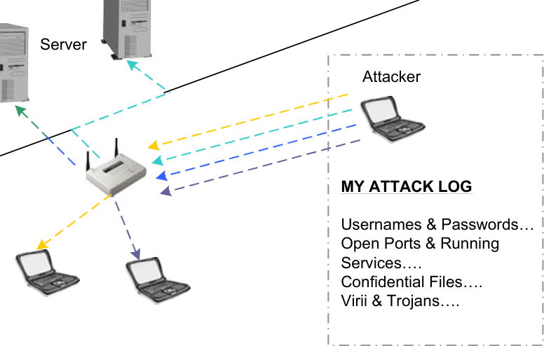

Some examples of active attacks might be a drive-by spammer or a business competitor
wanting access to your files. A spammer could queue emails in his laptop, then connect
to your home or business network through the wireless LAN. After obtaining an IP
address from your DHCP server, the hacker can send tens of thousands of emails using
your Internet connection and your ISP’s email server without your knowledge. This kind
of attack could cause your ISP to cut your connection for email abuse when it's not even
your fault.

A business competitor might want to get your customer list with contact information or
maybe your payroll information in order to better compete with you or to steal your
customers. These types of attacks happen regularly without the knowledge of the
wireless LAN administrator.

Once a hacker has a wireless connection to your network, he might as well be sitting in
his own office with a wired connection because the two scenarios are not much different.
Wireless connections offer the hacker plenty of speed and access to servers, wide area
connections, Internet connections, and users' desktops and laptops. With a few simple
tools, it is relatively simple to gather important information, impersonate a user, or even
cause damage to the network through reconfiguration. Probing servers with port scans,
creating null sessions to shares and having servers dump passwords to hacking utilities,
and then logging into servers using existing accounts are all things that can be done by
following the instructions in off-the-shelf hacker books.

**Jamming**

Whereas a hacker would use passive and active attacks to gain valuable information from
or to gain access to your network, jamming is a technique that would be used to simply

CWNA Study Guide © Copyright 2002 Planet3 Wireless, Inc.

--- end of page=300 ---

**273** Chapter 10 – Wireless LAN Security

shut down your wireless network. Similar to saboteurs arranging an overwhelming
denial of service (DoS) attack aimed at web servers, so a wireless LAN can be shut down
by an overwhelming RF signal. That overwhelming RF signal can be intentional or
unintentional, and the signal may be removable or non-removable. When a hacker stages
an intentional jamming attack, the hacker could use wireless LAN equipment, but more
likely, the hacker would use a high-power RF signal generator or sweep generator.
Figure 10.8 illustrates an example of jamming a wireless LAN.

**FIGURE 10.8** Jamming Attack Example

Jammer

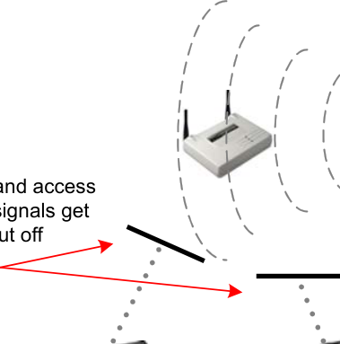

High-power RF
Signal Generator

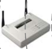

Removing this type of attacker from the premises first requires locating the source of the
RF signal. Locating an RF signal source can be done with an RF spectrum analyzer.
There are many spectrum analyzers on the market, but having one that is handheld and
battery operated is quite useful. Several manufacturers make handheld spectrum
analyzers, and a few wireless LAN manufacturers have created spectrum analyzer
software utilities for use in wireless client devices.

When jamming is caused by a non-moveable, non-malicious source such as a
communications tower or other legitimate system, the wireless LAN administrator might
have to consider using a wireless LAN system that utilizes a different set of frequencies.
For example, if an administrator were responsible for the design and installation of an RF
network at a large apartment complex, special considerations might be in order. If an RF
interference source were a large number of 2.4 GHz spread spectrum phones, baby
monitors, and microwave ovens in this apartment complex, then the administrator might
choose to implement 802.11a equipment that uses the 5 GHz UNII bands instead of
802.11b equipment that shares the 2.4 GHz ISM band with these other devices.

Unintentional jamming occurs regularly due to many different devices across many
different industries sharing the 2.4 GHz ISM band with wireless LANs. Malicious
jamming is not a common threat. The reason RF jamming is not very popular among
hackers is that it is fairly expensive to mount an attack, considering the cost of the
required equipment, and the only victory that the hacker gets is temporarily disabling a
network.

CWNA Study Guide © Copyright 2002 Planet3 Wireless, Inc.

--- end of page=301 ---

Chapter 10 – Wireless LAN Security **274**

**Man-in-the-middle Attacks**

A man-in-the-middle attack is a situation in which a malicious individual uses an access
point to effectively hijack mobile nodes by sending a stronger signal than the legitimate
access point is sending to those nodes. The mobile nodes then associate to this rogue
access point, sending their data, possibly sensitive data, into the wrong hands. Figure
10.9 illustrates a man-in-the-middle attack, hijacking wireless LAN clients.

In order to get clients to reassociate with the rogue access point, the rogue access point's
power must be much higher than that of the other access points in the area _and_ something
has to actively cause the users to roam to the rogue access point. Losing connectivity
with a legitimate access point happens seamlessly as a part of the roaming process so
some clients will connect to the rogue accidentally. Introducing all-band interference
into the area around the legitimate access point, as with a Bluetooth device, can cause
forced roaming.

**FIGURE 10.9** Man-in-the-middle attack

An access point and sometimes a
workgroup bridge are used to hijack users

The person perpetrating this man-in-the-middle attack would first have to know the SSID
that the wireless clients are using, and, as we’ve discussed earlier, this piece of
information is easily obtained. The perpetrator would have to know the network’s WEP
keys if WEP is being used on the network. Upstream (facing the network core)
connectivity from the rogue access point is handled through use of a client device such as
a PC card or workgroup bridge. Many times, man-in-the-middle attacks are orchestrated
using a single laptop computer with two PCMCIA cards. Access point software is run on
the laptop computer where one PC card is used as an access point and a second PC card is
used to connect the laptop to nearby legitimate access points. This configuration makes
the laptop a "man-in-the-middle", operating between clients and legitimate access points.
A man-in-the-middle hacker can obtain valuable information by running a sniffer on the
laptop in this scenario

One particular problem with the man-in-the-middle attack is that the attack is
undetectable by users. That being the case, the amount of information that a perpetrator
can gather in this situation is limited only by the amount of time that the perpetrator can
stay in place before getting caught. Physical security of the premises is the best remedy
for the man-in-the-middle attack.

CWNA Study Guide © Copyright 2002 Planet3 Wireless, Inc.

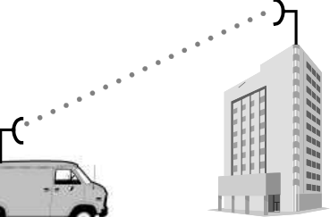

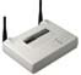

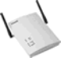

--- end of page=302 ---

**275** Chapter 10 – Wireless LAN Security

##### Emerging Security Solutions

Because wireless LANs are not inherently secure, and because WEP is not an end-to-end
security mechanism for enterprise wireless LANs, there is a significant opportunity for
other security solutions to take the forefront in the wireless LAN security market. We
will discuss some of these possible security solutions that, while not yet approved and
accepted into the 802.11 family of standards, can play a role in securing your wireless
LAN.

As of this writing, all of the available security solutions discussed in this book are
proprietary in nature. Although the IEEE has accepted 802.1x as a standard, its use as an
approved part of an 802.11 series standard is not yet official. There are new standards
still in draft form, such as 802.11i, that specifies use of such security mechanisms as
802.1x and EAP.

**WEP Key Management**

Instead of using static WEP keys, which can easily be learned or discovered by hackers,
wireless LANs can be made more secure by implementing dynamic per-session or perpacket key assignments using a central key distribution system.

Per-session or per-packet WEP key distribution assigns a new WEP key to both the client
and the access point for each session or each packet sent between the two. While dynamic
keys add more overhead and reduce throughput, they make hacking the network through
the wireless segment much more difficult. The hacker would have to be able to predict
the sequence of keys that the key distribution server is using, which is very difficult.

Remember that WEP protects only the layer 3-7 information and data payload, but does
not encrypt MAC addresses or beacons. A sniffer could capture any information being
broadcast in beacons from the access point or any MAC address information in unicast
packets from clients.

In order to put a centralized encryption key server in place, the wireless LAN
administrator must find an application that performs this task, buy a server with the
appropriate operating system installed, and configure the application according to the
organization's needs. This process could be costly and time-consuming, depending on
the scale of deployment, but will pay for itself in a very short period of time in preventing
liabilities due to malicious hackers.

**Wireless VPNs**

Wireless LAN manufacturers are increasingly including VPN server software in access
points and gateways, allowing VPN technology to help secure wireless LAN connections.
When the VPN server is built into the access point, clients use off-the-shelf VPN
software using protocols such as PPTP or IPsec to form a tunnel directly with the access
point.

CWNA Study Guide © Copyright 2002 Planet3 Wireless, Inc.

--- end of page=303 ---

Chapter 10 – Wireless LAN Security **276**

First, the client would associate with the access point, and then the dial-up VPN
connection would have to be made in order for the client to pass traffic through the access
point. All traffic is passed through the tunnel and can be encrypted as well as tunneled to
add an extra layer of security. Figure 10.10 shows a VPN configuration.

**FIGURE 10.10** Wireless LAN VPN solution

File

Data destined to LAN must
pass through tunnel

Use of PPTP with shared secrets is very simple to implement and provides a reasonable
level of security, especially when added to WEP encryption. Use of IPsec with shared
secrets or certificates is generally the solution of choice among security professionals in
this arena. When the VPN server is implemented in an enterprise gateway, the same
process takes place except that, after the client associates to the access point, the VPN
tunnel is established with the upstream gateway device instead of with the access point
itself.

There are also vendors that are offering modifications to their existing VPN solutions
(whether hardware or software) to support wireless clients and competing in the wireless
LAN market. These devices or applications serve in the same capacity as the enterprise
gateway, sitting between the wireless segment and the wired core of the network.
Wireless VPN solutions are reasonably economical and fairly simple to implement. If the
administrator has no experience with VPN solutions, it might be necessary to get training
in that area before implementing such a solution. VPNs that support wireless LANs are
usually designed with the novice VPN administrator in mind, which partially explains
why these devices have gained such popularity among users.

**Key Hopping Technologies**

Recently, key hopping technologies utilizing MD5 encryption and constantly changing
encryption keys have become available in the marketplace. The network constantly
changes, or “hops”, from one key to another as often as every 3 seconds. This solution
requires proprietary hardware and is only an interim solution pending approval of the
802.11i Security Enhancement Supplement Standard. Key algorithms are implemented

CWNA Study Guide © Copyright 2002 Planet3 Wireless, Inc.

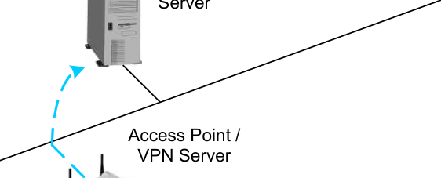

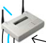

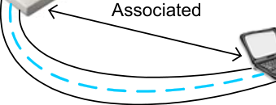

--- end of page=304 ---

**277** Chapter 10 – Wireless LAN Security

in such a manner as to avoid the weaknesses with WEP, such as the initialization vector
problem.

**Temporal Key Integrity Protocol (TKIP)**

TKIP is essentially an upgrade to WEP that fixes known security problems in WEP's
implementation of the RC4 stream cipher. TKIP provides for initialization vector
hashing to help defeat passive packet snooping. It also provides a Message Integrity
Check to help determine whether an unauthorized user has modified packets by injecting
traffic that enables key cracking. TKIP includes use of dynamic keys to defeat capture of
passive keys—a widely publicized hole in the existing Wired Equivalent Privacy (WEP)
standard.

TKIP can be implemented through firmware upgrades to access points and bridges as
well as software and firmware upgrades to wireless client devices. TKIP specifies rules
for the use of initialization vectors, re-keying procedures based on 802.1x, per-packet key
mixing, and message integrity code (MIC). There will be a performance loss when using
TKIP, but this performance decrease may be a valid trade-off, considering the gain in
network security.

**AES Based Solutions**

AES-based solutions may replace WEP using RC4, but in the interim, solutions such as
TKIP are being implemented. Although no products that use AES are currently on the
market as of this writing, several vendors have products pending release. AES has
undergone extensive cryptographic review and is very efficient in hardware and software.
The current 802.11i draft specifies use of AES, and, considering most wireless LAN
industry players are behind this effort, AES is likely to remain as part of the finalized
standard.

Changing data encryption techniques to a solution that is as strong as AES will make a
significant impact on wireless LAN security, but there still must be scalable solutions
implemented on enterprise networks such as centralized encryption key servers to
automate the process of handing out keys. If a client radio card is stolen with the AES
encryption key embedded, it would not matter how strong AES is because the perpetrator
would still be able to gain access to the network.

**Wireless Gateways**

Residential wireless gateways are now available with VPN technology, as well as NAT,
DHCP, PPPoE, WEP, MAC filters, and perhaps even a built-in firewall. These devices
are sufficient for small office or home office environments with few workstations and a
shared connection to the Internet. Costs of these units vary greatly depending on their
range of offered services. Some of the high-end units even boast static routing and
RIPv2.

Enterprise wireless gateways are a special adaptation of a VPN and authentication server
for wireless networks. An enterprise gateway sits on the wired network segment between

CWNA Study Guide © Copyright 2002 Planet3 Wireless, Inc.

--- end of page=305 ---

Chapter 10 – Wireless LAN Security **278**

the access points and the wired upstream network. As its name suggests, a gateway
controls access from the wireless LAN onto the wired network, so that, while a hacker
could possibly listen to or even gain access to the wireless segment, the gateway protects
the wired distribution system from attack.

An example of a good time to deploy an enterprise wireless LAN gateway might be the
following hypothetical situation. Suppose a hospital had implemented 40 access points
across several floors of their building. Their investment in access points is fairly
significant at this point, so if the access points do not support scalable security measures,
the hospital could be in the predicament of having to replace all of their access points.
Instead, the hospital could employ a wireless LAN gateway.

This gateway can be connected between the core switch and the distribution switch
(which connects to the access points) and can act as an authentication and VPN server
through which all wireless LAN clients can connect. Instead of deploying all new access
points, one (or more depending on network load) gateway device can be installed behind
all of the access points as a group. Use of this type of gateway provides security on behalf
of a non-security-aware access point. Most enterprise wireless gateways support an array
of VPN protocols such as PPTP, IPsec, L2TP, certificates, and even QoS based on
profiles.

**802.1x and Extensible Authentication Protocol**

The 802.1x standard provides specifications for port-based network access control. Portbased access control was originally – and still is – used with Ethernet switches. When a
user attempts to connect to the Ethernet port, the port then places the user's connection in
blocked mode awaiting verification of the user's identity with a backend authentication
system.

The 802.1x protocol has been incorporated into many wireless LAN systems and has
become almost a standard practice among many vendors. When combined with
extensible authentication protocol (EAP), 802.1x can provide a very secure and flexible
environment based on various authentication schemes in use today.

EAP, which was first defined for the point-to-point protocol (PPP), is a protocol for
negotiating an authentication method. EAP is defined in RFC 2284 and defines the
characteristics of the authentication method including the required user credentials
(password, certificate, etc.), the protocol to be used (MD5, TLS, GSM, OTP, etc.),
support of key generation, and support of mutual authentication. There are perhaps a
dozen types of EAP currently on the market since neither the industry players nor IEEE
have come together to agree on any single type, or small list of types, from which to
create a standard.

The successful 802.1x-EAP client authentication model works as follows:

1. The client requests association with the access point

2. The access point replies to the association request with an EAP identity request

3. The client sends an EAP identity response to the access point

4. The client's EAP identity response is forwarded to the authentication server

CWNA Study Guide © Copyright 2002 Planet3 Wireless, Inc.

--- end of page=306 ---

**279** Chapter 10 – Wireless LAN Security

5. The authentication server sends an authorization request to the access point

6. The access point forwards the authorization request to the client

7. The client sends the EAP authorization response to the access point

8. The access point forwards the EAP authorization response to the authentication
server

9. The authentication sends an EAP success message to the access point

10. The access point forwards the EAP success message to the client and places the
client's port in forward mode

**FIGURE 10.11** Two Logon Processes

User sees a
double logon

Layer 7

Layer 2

User sees a
single logon

Layer 7

Layer 2

NT Domain
Controller

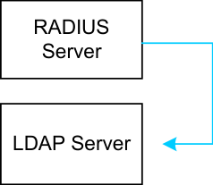

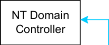

|RADIUS Server|Col2|
|---|---|
|RADIUS Server||

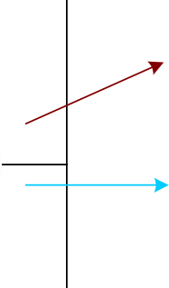

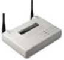

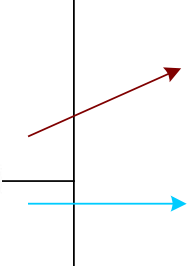

When 802.1x with EAP is used, a situation arises for an administrator in which it is
possible to have a double logon when powering up a notebook computer that is attached
wirelessly and logging into a domain or directory service. The reason for the possible
double logon is that 802.1x requires authentication in order to provide layer 2
connectivity. In most cases, this authentication is done via a centralized user database. If
this database is not the same database used for client authentication into the network
(such as with Windows domain controllers, Active Directory, NDS, or LDAP), or at least
synchronized with the database used for client authentication, then the user will
experience two logons each time network connectivity is required. Most administrators
choose to use the same database for MAC layer connectivity and client/server
connectivity, providing a seamless logon process for the client. A similar configuration
can also be used with wireless VPN solutions.

CWNA Study Guide © Copyright 2002 Planet3 Wireless, Inc.

--- end of page=307 ---

Chapter 10 – Wireless LAN Security **280**

##### Corporate Security Policy

A company that uses wireless LANs should have a corporate security policy that
addresses the unique risks that wireless LANs introduce to the network. The example of
an inappropriate cell size that allows the drive-by hacker to gain network access from the
parking lot is a very good example of one item that should be included in any corporate
security policy. Other items that should be covered in the security policy are strong
passwords, strong WEP keys, physical security, use of advanced security solutions, and
regular wireless LAN hardware inventories. This list is far from comprehensive,
considering that security solutions will vary between organizations. The depth of the
wireless LAN section of the security policy will depend on the security requirements of
organization as well as the extent of the wireless LAN segment(s) of the network.

The benefits of having, implementing, and maintaining a solid security policy are too
numerous to count. Preventing data loss and theft, preventing corporate sabotage or
espionage, and maintaining company secrets are just a few. Even the suggestion that
hackers could have stolen data from an industry-leading corporation may cause
confidence in the company to plummet.

The beginning of good corporate policy starts with management. Recognizing the need
for security and delegating the tasks of creating the appropriate documentation to include
wireless LANs into the existing security policy should be top priority. First, those who
are responsible for securing the wireless LAN segments must be educated in the
technology. Next, the educated technology professional should interact with upper
management and agree on company security needs. This team of educated individuals is
then able to construct a list of procedures and requirements that, if followed by personnel
at every applicable level, will ensure that the wireless network remains as safely guarded
as the wired network.

**Keep Sensitive Information Private**

Some items that should be known only by network administrators at the appropriate
levels are:

      - Usernames and passwords of access points and bridges

      - SNMP strings

      - WEP keys

      - MAC address lists

The point of keeping this information only in the hands of trusted, skilled individuals
such as the network administrator is important because a malicious user or hacker could
easily use these pieces of information to gain access into the network and network
devices. This information can be stored in one of many secure fashions. There are now
applications using strong encryption on the market for the explicit purpose of password
and sensitive data storage.

CWNA Study Guide © Copyright 2002 Planet3 Wireless, Inc.

--- end of page=308 ---

**281** Chapter 10 – Wireless LAN Security

**Physical Security**

Although physical security when using a traditional wired network is important, it is even
more important for a company that uses wireless LAN technology. For reasons discussed
earlier, a person that has a wireless PC Card (and maybe an antenna) does not have to be
in the same building as the network to gain access to the network. Even intrusion
detection software is not necessarily enough to prevent wireless hackers from stealing
sensitive information. Passive attacks leave no trace on the network because no
connection was ever made. There are utilities on the market now that can see a network
card that is in promiscuous mode, accessing data without making a connection.

When WEP is the only wireless LAN security solution in place, tight controls should be
placed on users who have company-owned wireless client devices, such as not allowing
them to take those client devices off of company premises. Since the WEP key is stored
in the client device’s firmware, wherever the card goes, so does the network’s weakest
security link. The wireless LAN administrator should know who, where, and when each
PC card is taken from the organization’s facilities.

Because such knowledge is often unreasonable, an administrator should realize that
WEP, by itself, is not an adequate wireless LAN security solution.  Even with such tight
controls, if a card is lost or stolen, the person responsible for the card (the user) should be
required to report the loss or theft immediately to the wireless LAN administrator so that
necessary security precautions can be taken. Such precautions should include, at a
minimum, resetting MAC filters, changing WEP keys, etc.

Having guards make periodic scans around the company premises looking specifically
for suspicious activity is effective in reducing netstumbling. Security guards that are
trained to recognize 802.11 hardware and alerting company personnel to always be on the
lookout for non-company personnel lurking around the building with 802.11-based
hardware is also very effective in reducing on-premises attacks.

**Wireless LAN Equipment Inventory & Security Audits**

As a complement to the physical security policy, all wireless LAN equipment should be
regularly inventoried to account for authorized and prevent unauthorized use of wireless
equipment to access the organization’s network. If the network is too large and contains
a significant amount of wireless equipment, periodic equipment inventories might not be
practical. In cases such as these, it is very important to implement wireless LAN security
solutions that are not based on hardware, but rather based on usernames and passwords or
some other type of non hardware-based security solution. For medium and small wireless
networks, doing monthly or quarterly hardware inventories can motivate users to report
hardware loss or theft.

Periodic scans of the network with sniffers, in a search for rogue devices, are a very
valuable way of keeping the wireless network secure. Consider if a very elaborate (and
expensive) wireless network solution were put in place with state-of-the-art security, and,
since coverage did not extend to a particular area of the building, a user took it into their
own hands to install an additional, unauthorized access point in their work area. In this

CWNA Study Guide © Copyright 2002 Planet3 Wireless, Inc.

--- end of page=309 ---

Chapter 10 – Wireless LAN Security **282**

case, this user has just provided a hacker with the necessary route into the network,
completely circumventing a very good (and expensive) wireless LAN security solution.

Inventories and security audits should be well documented in the corporate security
policy. The types of procedures to be performed, the tools to be used, and the reports to
be generated should all be clearly spelled out as part of the corporate policy so that this
tedious task does not get overlooked. Managers should expect a report of this type on a
regular basis from the network administrator.

**Using Advanced Security Solutions**

Organizations implementing wireless LANs should take advantage of some of the more
advanced security mechanisms available on the market today. It should also be required
in a security policy that the implementation of any such advanced security mechanism be
thoroughly documented. Because these technologies are new, proprietary, and often used
in combination with other security protocols or technologies, they must be documented
so that, if a security breach occurs, network administrators can determine where and how
the breach occurred.

Because so few people in the IT industry are educated in wireless technology, the
likelihood of employee turnover causing network disruption, or at least vulnerability, is
much higher when wireless LANs are part of the network. This turnover of employees is
another very important reason that thorough documentation on wireless LAN
administration and security functions be created and maintained.

**Public Wireless Networks**

It is inevitable that corporate users with sensitive information on their laptop computers
will connect those laptops to public wireless LANs. It should be a matter of corporate
policy that all wireless users (whether wireless is provided by the company or by the
user) run both personal firewall software and antiviral software on their laptops. Most
public wireless networks have little or no security in order to make connectivity simple
for the user and to decrease the amount of required technical support.

Even if upstream servers on the wired segment are protected, the wireless users are still
vulnerable. Consider the situation where a hacker is sitting at an airport, considered a
“Wi-Fi hot spot.” This hacker can sniff the wireless LAN, grab usernames and
passwords, log into the system, and then wait for unsuspecting users to login also. Then,
the hacker can do a ping sweep across the subnet looking for other wireless clients, find
the users, and begin hacking into their laptop computer’s files. These vulnerable users
are considered “low hanging fruit”, meaning that they are easy to hack because of their
general unfamiliarity with leading edge technology such as wireless LANs.

**Limited and Tracked Access**

Most enterprise LANs have some method of limiting and tracking a user’s access on the
LAN. Typically, a system supporting Authentication, Authorization, and Accounting
(AAA) services is deployed. This same security measure should be documented and

CWNA Study Guide © Copyright 2002 Planet3 Wireless, Inc.

--- end of page=310 ---

**283** Chapter 10 – Wireless LAN Security

implemented as part of wireless LAN security. AAA services will allow the organization
to assign use rights to particular classes of users. Visitors, for example, might be allowed
only Internet access whereas employees would be allowed to access their particular
department’s servers and the Internet.

Keeping logs of users’ rights and the activities they performed while using your network
can prove valuable if there’s ever a question of who did what on the network. Consider if
a user was on vacation, yet during the vacation the user’s account was used almost every
day. Keeping logs of activity such as this will give the administrator insight into what is
really happening on the LAN. Using the same example, and knowing that the user was
on vacation, the administrator could begin looking for where the masquerading user was
connecting to the network.

##### Security Recommendations

As a summary to this chapter, below are some recommendations for securing wireless
LANs.

**WEP**

Do not rely solely on WEP, no matter how well you have it implemented as an end-toend wireless LAN security solution.  A wireless environment protected with only WEP
is not a secure environment. When using WEP, do not use WEP keys that are related to
the SSID or to the organization. Make WEP keys very difficult to remember and to
figure out. In many cases, the WEP key can be easily guessed just by looking at the
SSID or the name of the organization.

WEP is an effective solution for reducing the risk of casual eavesdropping. Because an
individual who is not maliciously trying to gain access, but just happens to see your
network, will not have a matching WEP key, that individual would be prevented from
accessing your network.

**Cell Sizing**

In order to reduce the chance of eavesdropping, an administrator should make sure that
the cell sizes of access points are appropriate. The majority of hackers look for the
locations where very little time and energy must be spent gaining access into the network.
For this reason, it is important not to have access points emitting strong signals that
extend out into the organization's parking lot (or similar unsecure locations) unless
absolutely necessary. Some enterprise-level access points allow for the configuration of
power output, which effectively controls the size of the RF cell around the access point.
If an eavesdropper in your parking lot cannot detect your network, then your network is
not susceptible to this kind of attack.

It may be tempting for network administrators to always use the maximum power output
settings on all wireless LAN devices in an attempt to get maximum throughput and
coverage, but such blind configuration will come at the expense of security. An access

CWNA Study Guide © Copyright 2002 Planet3 Wireless, Inc.

--- end of page=311 ---

Chapter 10 – Wireless LAN Security **284**

point has a cell size that can be controlled by the amount of power that the access point is
emitting and the antenna gain of the antenna being used. If that cell is inappropriately
large to the point that a passerby can detect, listen to, or even gain access to the network,
then the network is unnecessarily vulnerable to attack. The necessary and appropriate
cell size can be determined by a proper site survey (Chapter 11). The proper cell size
should be documented along with the configuration of the access point or bridge for each
particular area. It may be necessary to install two access points with smaller cell sizes to
avoid possible security vulnerabilities in some instances.

Try to locate your access points towards the center of your house or building. This will
minimize the signal leak outside of the intended range. If you are using external
antennas, selecting the right type of antenna can be helpful in minimizing signal range.
Turn off access points when they are not in use. This will minimize your exposure to
potential hackers and lighten the network management burden.

**User Authentication**

Since user authentication is a wireless LAN’s weakest link, and the 802.11 standard does
not specify any method of user authentication, it is imperative that the administrator
implement user-based authentication as soon as possible upon installing a wireless LAN
infrastructure. User authentication should be based on device-independent schemes like
usernames and passwords, biometrics, smart cards, token-based systems, or some other
type of secure means of identifying the user, not the hardware.  The solution you
implement should support bi-directional authentication between an authentication server
(such as RADIUS) and the wireless clients.

RADIUS is the de-facto standard in user authentication systems in most every
information technology market. Access points send user authentication requests to a
RADIUS server, which can either have a built-in (local) user database or can pass the
authentication request through to a domain controller, an NDS server, an Active
Directory server, or even an LDAP compliant database system.

A few RADIUS vendors have streamlined their RADIUS products to include support for
the latest family of authentication protocols such as the many types of EAP.

Administering a RADIUS server can be very simple or very complicated, depending on
the implementation. Because wireless security solutions are very sensitive, care should
be taken when choosing a RADIUS server solution to make sure that the wireless
network administrator can administer it or can work effectively with the existing
RADIUS administrator.

**Security Needs**

Choose a security solution that fits your organizations’ needs and budget, both for today
and tomorrow. Wireless LANs are gaining popularity so fast partly because of their ease
of implementation. That means that a wireless LAN that began as an access point and 5
clients could quickly grow to 15 access points and 300 clients across a corporate campus.
The same security mechanism that worked just fine for one access point will not be as
acceptable, or as secure, for 300 users. An organization could waste money on security

CWNA Study Guide © Copyright 2002 Planet3 Wireless, Inc.

--- end of page=312 ---

**285** Chapter 10 – Wireless LAN Security

solutions that will be quickly outgrown as the wireless LAN grows. In many cases,
organizations already have security in place such as intrusion detection systems,
firewalls, and RADIUS servers. When deciding on a wireless LAN solution, leveraging
existing equipment is an important factor in keeping costs down.

**Use Additional Security Tools**

Taking advantage of the technology that is available, such as VPNs, firewalls, intrusion
detection systems (IDS), standards and protocols such as 802.1x and EAP, and client
authentication with RADIUS can help make wireless solutions secure above and beyond
what the 802.11 standard requires. The cost and time to implement these solutions vary
greatly from SOHO solutions to large enterprise solutions.

**Monitoring for Rogue Hardware**

To discover rogue access points, regular access point discovery sessions should be
scheduled but not announced. Actively discovering and removing rogue access points
will likely keep out hackers and allow the administrator to maintain network control and
security. Regular security audits should be performed to locate incorrectly configured
access points that could be security risks. This task can be done while monitoring the
network for rogue access points as part of a regular security routine. Present
configurations should be compared to past configurations in order to see if users or
hackers have reconfigured the access points. Access logs should be implemented and
monitored for the purpose of finding any irregular access on the wireless segment. This
type of monitoring can even help find lost or stolen wireless client devices.

**Switches, not hubs**

Another simple guideline to follow is always connecting access points to switches instead
of hubs. Hubs are broadcast devices, so every packet received by the hub will be sent out
on all of the hub’s other ports. If access points are connected to hubs, then every packet
traversing the wired segment will be broadcast across the wireless segment as well. This
functionality gives hackers additional information such as passwords and IP addresses.

**Wireless DMZ**

Another idea in implementing security for wireless LAN segments is to create a wireless
demilitarized zone (WDMZ). Creating these WDMZs using firewalls or routers can be
costly depending on the level of implementation. WDMZs are generally implemented in
medium- and large-scale wireless LAN deployments. Because access points are basically
unsecured and untrusted devices, they should be separated from other network segments
by a firewall device, as illustrated in Figure 10.13.

CWNA Study Guide © Copyright 2002 Planet3 Wireless, Inc.

--- end of page=313 ---

Chapter 10 – Wireless LAN Security **286**

**FIGURE 10.13** Wireless DMZ

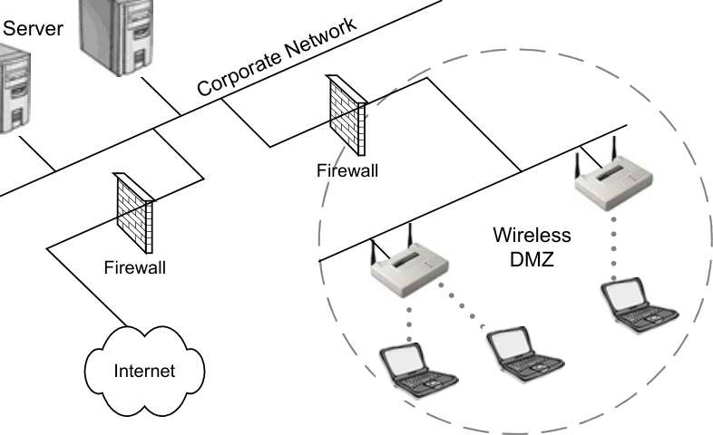

**Firmware & Software Updates**

Update the firmware and drivers on your access points and wireless cards.  It is always
wise to use the latest firmware and drivers on your access points and wireless cards.
Manufacturers commonly fix known issues, security holes, and enable new features with
these updates.

CWNA Study Guide © Copyright 2002 Planet3 Wireless, Inc.

--- end of page=314 ---

**287** Chapter 10 – Wireless LAN Security

##### Key Terms

Before taking the exam, you should be familiar with the following terms:

_Initialization Vector_

_key server_

_RC4_

_Rijndale_

_Wi-Fi hot spot_

CWNA Study Guide © Copyright 2002 Planet3 Wireless, Inc.

--- end of page=315 ---

Chapter 10 – Wireless LAN Security **288**

##### Review Questions

1. Which one of the following is NOT one of the criteria for WEP implementation,
according to the 802.11 standard?

A. Exportable

B. Reasonably Strong

C. Self-Synchronizing

D. Computationally Efficient

E. Mandatory

2. Centralized encryption key servers should be used if possible. Which one of the
following reasons would NOT be a good reason to implement centralized encryption
key servers?

A. Centralized key generation

B. Centralized key distribution

C. Centralized key coding and encryption

D. On-going key rotation

E. Reduced key management overhead

3. Typical key rotation options implemented by various manufacturers for encryption
key generation include which of the following? Choose all that apply.

A. Per-packet

B. Per-session

C. Per-user

D. Per-broadcast

E. Per-frame

4. A WEP key using a 40-bit secret key concatenated with the initialization vector to
form the WEP key, creates what level of encryption?

A. 24-bit

B. 40-bit

C. 64-bit

D. 128-bit

CWNA Study Guide © Copyright 2002 Planet3 Wireless, Inc.

--- end of page=316 ---

**289** Chapter 10 – Wireless LAN Security

5. Which piece of information on a wireless LAN is encrypted with WEP enabled?

A. The data payload of the frame

B. The MAC addresses of the frame

C. Beacon management frames

D. Shared Key challenge plaintext

6. AES uses which one of the following encryption algorithms?

A. Fresnel

B. NAV

C. Rijndale

D. Rinehart

7. What are the three types of filtering that can be performed on a wireless LAN?

A. SSID filtering

B. MAC address filtering

C. Protocol filtering

D. 802.11 standard filtering

E. Manufacturer hardware filtering

8. SSID filtering is a basic form of access control, and is not considered secure for
which of the following reasons? Choose all that apply.

A. The SSID is broadcasted in the clear in every access point beacon by default

B. It is very simple to find out the SSID of a network using a sniffer

C. The SSID of a wireless LAN client must match the SSID on the access point in
order for the client to authenticate and associate to the access point

D. SSID encryption is easy to break with freeware utilities

9. Using a ________, the network administrator can reduce the time it takes to rotate
WEP keys across an enterprise network.

A. Distributed Encryption Key Server

B. Centralized Encryption Key Server

C. Router Access Control List

D. Filter Application Server

CWNA Study Guide © Copyright 2002 Planet3 Wireless, Inc.

--- end of page=317 ---

Chapter 10 – Wireless LAN Security **290**

10. MAC filtering is NOT susceptible to which one of the following intrusions?

A. Theft of a PC card

B. MAC address spoofing

C. Sniffer collecting the MAC addresses of all wireless LAN clients

D. MAC filter bypass equipment

11. Which of the following are types of wireless LAN attacks? Choose all that apply.

A. Passive attacks

B. Antenna wind loading

C. Access point flooding

D. Active attacks

12. The following statement, "MAC addresses of wireless LAN clients are broadcast in
the clear by access points and bridges, even when WEP is implemented," is which of
the following?

A. Always true

B. Always false

C. Dependent upon manufacturer WEP implementation

13. The best solution for a jamming attack would be which one of the following?

A. To use a spectrum analyzer to locate the RF source and then remove it

B. Increase the power on the wireless LAN to overpower the jamming signal

C. Shut down the wireless LAN segment and wait for the jamming signal to
dissipate

D. Arrange for the FCC to shut down the jamming signal's transmitter

14. Why should access points be connected to switches instead of hubs?

A. Hubs are faster than switches and can handle high utilization networks

B. Hubs are full duplex and switches are only half duplex

C. Hubs are broadcast devices and pose an unnecessary security risk

D. Access points are not capable of full-duplex mode

CWNA Study Guide © Copyright 2002 Planet3 Wireless, Inc.

--- end of page=318 ---

**291** Chapter 10 – Wireless LAN Security

15. Which of the following protocols are network security tools above and beyond what
is specified by the 802.11? Choose all that apply.

A. 802.1x and EAP

B. 8011.g

C. VPNs

D. 802.11x and PAP

16. An enterprise wireless gateway is positioned at what point on the wired network
segment?

A. Between the access point and the wired network upstream

B. Between the access point and the wireless network clients

C. Between the switch and the router on the wireless network segment

D. In place of a regular access point on the wireless LAN segment

17. Networks using the 802.1x protocol control network access on what basis? Choose
all that apply.

A. Per–user

B. Per–port

C. Per-session

D. Per-MAC Address

E. Per-SSID

18. Which of the following is NOT true regarding wireless LAN security?

A. WEP cannot be relied upon to provide a complete security solution.

B. A wireless environment protected with only WEP is not a secure environment.

C. The 802.11 standard specifies user authentication methods

D. User authentication is a wireless LAN’s weakest link

19. Which of the following demonstrates the need for accurate RF cell sizing? Choose
all that apply.

A. Co-located access points having overlapping cells

B. A site survey utility can see 10 or more access points from many points in the
building

C. Users on the sidewalk passing by your building can see your wireless LAN

D. Users can attach to the network from their car parked in the facility's parking lot

CWNA Study Guide © Copyright 2002 Planet3 Wireless, Inc.

--- end of page=319 ---

Chapter 10 – Wireless LAN Security **292**

20. For maximum security wireless LAN user authentication should be based on which
of the following? Choose all that apply.

A. Device-independent schemes such as user names and passwords

B. Default authentication processes

C. MAC addresses only

D. SSID and MAC address

CWNA Study Guide © Copyright 2002 Planet3 Wireless, Inc.

--- end of page=320 ---

**293** Chapter 10 – Wireless LAN Security

##### Answers to Review Questions

1. E. The 802.11 standard specified that the use of WEP is to be optional. If a
manufacturer is to make its hardware compliant to the standard, the administrator
must be able to enable or disable WEP as necessary.

2. C. Encryption key servers are useful in performing the same tasks as an
administrator (changing WEP keys), except that the server can do it much faster and
more efficiently. Servers of this type bring value to the network security
architecture by being able to create and distribute encryption keys quickly and
easily.

3. A, B. Most centralized encryption key servers have the ability to implement key
rotation on a per-packet or a per-session basis. Be careful when implementing perpacket key rotation that you don't add more overhead to the network than the
network can withstand.

4. C. The initialization vector (IV) is a 24-bit number used to start and track the
wireless frames moving between nodes. The IV is concatenated with the secret key
to yield the WEP key. With a 40-bit secret key added to a 24-bit IV, a 64-bit WEP
key is generated.

5. A. Any station on the wireless segment can see the source and destination MAC
addresses. Any layer 3 information such as IP addresses is encrypted. The data
payload (layer 3-7 information) is encrypted. Shared Key authentication issues the
plaintext challenge in clear text - only the response is encrypted.

6. C. The Rijndale algorithm was chosen by NIST for AES. There were many
candidates competing for use as part of AES, but Rijndale was chosen and no
backup selection has been specified.

7. A, B, C. Filtering based on SSIDs should be aimed toward segmentation of the
network only, as SSID filtering does not present any real level of security. MAC
addresses can be spoofed, though it's not a simple task. MAC filters are great for
home and small office wireless LANs where managing lists of MAC addresses is
feasible. Protocol filters should be used as a means of bandwidth control.

8. A, B. The SSID is sent as part of each beacon frame and probe response frame.
Sniffers, wireless LAN client driver software, and applications such as Netstumbler
easily see SSIDs.

9. B. Having a single server generate and rotate encryption keys across the entire
network reduces the amount of time the administrator has to devote to managing
WEP on a wireless LAN.

10. D. There's no such thing as MAC filter bypass equipment, although it is possible to
get past MAC filters using software applications and custom operating system
configurations.

11. A, D. By passive listening to the wireless network or by connecting to access points
and performing scanning and probing of network resources, a hacker is able to gain
valuable information if the right precautions and security measures are not in place.

CWNA Study Guide © Copyright 2002 Planet3 Wireless, Inc.

--- end of page=321 ---

Chapter 10 – Wireless LAN Security **294**

12. A. MAC addresses must always be sent in the clear so that stations may recognize
both who the intended recipient is and who the source station is. Using WEP does
not change this.

13. A. Depending on whether the jamming signal was originating from a malicious
hacker or an unintentional nearby RF source, finding and removing the RF source is
the best solution to this problem. It may not be possible to remove it, so in this case
you might have to use a wireless LAN in another frequency spectrum in order to
avoid the interference. Waiting on a government agency such as the FCC to respond
to your complaint of a possible hacker jamming your license-free network, could
take a considerable amount of time. If you locate such a malicious attacker,
contacting the local law enforcement authorities is the proper procedure for
eliminating the attack.

14. C. Hubs are broadcast devices that pass along all information passing through them
to all of their ports. If access points are connected to hub ports, all packets on the
wire will also be broadcasted across the wireless segment giving hackers more
information about the network than is absolutely necessary.

15. A, C. 802.1x using EAP and VPNs both comprise good wireless LAN security
solutions. There are many other solutions, and many versions of both EAP and
wireless VPN solutions. Care should be taken when choosing a wireless LAN
security solution to assure it both meets the needs of the network and fits the
organization's security budget.

16. A. An enterprise wireless gateway has no wireless segments. These gateways have
a downstream wired connection and a wired connection upstream that allows them
to act as a gateway or firewall of sorts. Wireless LAN clients must be authenticated
through this device before it may pass packets upstream into the network. Through
the use of VPN tunnels, clients can even be blocked from accessing each other over
the wireless segment.

17. B. The 802.1x standard provides port-based access control. It functions by stopping
a port (a connection between the edge device and the client) until the edge device
authenticates the client. After authentication, the port is forwarded so that clients
can establish a connection with the edge devices and pass packets across the
network.

18. C. No user authentication is specified in the 802.11 standard. User authentication is
left up to the manufacturer to implement making user authentication a wireless
LAN's weakest link. Never rely on WEP as an end-to-end wireless LAN security
solution.

19. B, C, D. Being able to see many access points in a given area is indicative of cell
sizes being too large. Anytime someone can see or connect to your wireless LAN
from outside your building without this being the specific intent of the network
designer, the cell sizes are too large.

20. A. Basing user authentication on username and passwords or other appropriate user
knowledge instead of the hardware itself is a better way of securing wireless LANs.

CWNA Study Guide © Copyright 2002 Planet3 Wireless, Inc.

--- end of page=322 ---
