# Chapter 11 - Site Survey Fundamentals

_PDF pages 324-369_

##### Site Survey Fundamentals

**CWNA Exam Objectives Covered:**

- Understand the importance of and processes involved in
conducting an RF site survey

- Identify and understand the importance of the necessary tasks
involved in preparing for an RF site survey

 - Gathering business requirements

 - Interview management and users

 - Defining security requirements

 - Site-specific documentation

 - Documenting existing network characteristics

- Identify the necessary equipment involved in performing a
site survey

 - Wireless LAN equipment

 - Measurement tools

 - Documentation

- Understand the necessary procedures involved in
performing a site survey

 - Non-RF information

 - Permits and zoning requirements

 - Outdoor considerations

 - RF related information

 - Interference sources

 - Connectivity and power requirements

- Understand and implement RF site survey reporting
procedures

 - Requirements

 - Methodology

 - Measurements

 - Security

 - Graphical documentation

 - Recommendations

CWNA Study Guide © Copyright 2002 Planet3 Wireless, Inc.

CHAPTER CHAPTER
# 11 5

**In This Chapter**

What is a Site Survey?

Preparation

Tools and Equipment
Needed

Conducting the Survey

Reporting

--- end of page=323 ---

Chapter 11 – Site Survey Fundamentals **296**

In this chapter, we will discuss the process of conducting a site survey, also known as a
"facilities analysis." We will discuss terms and concepts that you have probably heard
and used before if you have ever installed a wireless network from the ground up. If
wireless is new to you, you might notice that some of the terms and concepts carry over
from traditional wired networks. Concepts like throughput needs, power accessibility,
extendibility, application requirements, budget requirements, and signal range will all be
key components as you conduct a site survey. We will further discuss the ramifications
of a poor site survey and even no site survey at all. Our discussion will cover a checklist
of tasks that you need to accomplish and equipment you will use, and we will apply those
checklists to several hypothetical examples.

##### What is a Site Survey?

An RF site survey is a _map_ to successfully implementing a wireless network.

There is no hard and fast technical definition of a site survey. You, as the CWNA
candidate, must learn the process of conducting the best possible site survey for the
client, whether that client is internal or external to your organization. The site survey is
not to be taken lightly, and can take days or even weeks, depending on the site being
surveyed. The resulting information of a quality site survey can be significantly helpful
for a long time to come.

**A site survey is the most important step in implementing any wireless network.**

A site survey is a task-by-task process by which the surveyor discovers the RF behavior,
coverage, interference, and determines proper hardware placement in a facility. The site
survey’s primary objective is to ensure that mobile workers – the wireless LAN’s
“clients”– experience continually strong RF signal strength as they move around their
facility. At the same time, clients must remain connected to the host device or other
mobile computing devices and their work applications. Employees who are using the
wireless LAN should never have to think about the wireless LAN. Proper performance
of the tasks listed in this section will ensure a quality site survey and can help achieve a
seamless operating environment every time you install a wireless network.

Site surveying involves analyzing a site from an RF perspective and discovering what
kind of RF coverage a site needs in order to meet the business goals of the customer.
During the site survey process, the surveyor will ask many questions about a variety of
topics, which are covered in this chapter. These questions allow the surveyor to gather as
much information as possible to make an informed recommendation about what the best
options are for hardware, installation, and configuration of a wireless LAN.

A site survey is an attempt to define the contours of RF coverage from an RF source (an
access point or bridge) in a particular facility. Many issues can arise that prevent the RF
signal from reaching certain parts of the facility. For example, if an access point were
placed in the center of a medium-sized room, it would be assumed that there would be RF

CWNA Study Guide © Copyright 2002 Planet3 Wireless, Inc.

--- end of page=324 ---

**297** Chapter 11 – Site Survey Fundamentals

coverage throughout the room. This is not necessarily true due to phenomena such as
multipath, near/far, and hidden node. There may be "holes" in the RF coverage pattern
due to multipath or stations that cannot talk to the network due to near/far.

Though a surveyor may be documenting the site survey results, another individual
(possibly the RF design engineer) may be doing the site survey analysis to determine best
placement of hardware. Therefore, all of the results of the entire survey must be
documented. The surveyor and the designer may be the same person, or in larger
organizations they may be different people. Organized and accurate documentation by
the site surveyor will result in a much better design and installation process.

A proper site survey provides detailed specifications addressing coverage, interference
sources, equipment placement, power considerations, and wiring requirements.
Furthermore, the site survey documentation serves as a guide for the network design and
for installing and verifying the wireless communication infrastructure.

If you _don’t_ do a site survey, you will not have the knowledge of your clients’ needs, the
sources of interference, the “dead” spots (where no RF coverage exists), where to install
the access point(s), and, worst of all, you won’t be able to tell the client how much the
wireless LAN will cost to implement!

Finally, although performing RF site surveys is the _only_ business that some firms engage
in, a good site survey can be the best sales tool that a network integration firm has at its
disposal. Performing a quality site survey can, and many times should, lead to your
organization performing the installation and integration of the wireless LAN for which
the site survey was done.

##### Preparing for a Site Survey

The planning of a wireless LAN involves collecting information and making decisions.
The following is a list of the most basic questions that must be answered before the actual
physical work of the site survey begins. These questions are purposely open-ended
because each one results in more information being passed from the client to the
surveyor, thus making the surveyor better prepared to go on-site and do the site survey.
Most, if not all, of these questions can be answered via phone, fax, or email, assuming the
people with the answers to the questions are available. Again, the more prepared one is
before arriving at the site (with a site survey toolkit), the more valuable the time on-site
will be. Some of the topics you may want to question the network management about
before performing your site survey:

      - Facilities Analysis

      - Existing Networks

      - Area Usage & Towers

      - Purpose & Business Requirements

      - Bandwidth & Roaming Requirements

      - Available Resources

CWNA Study Guide © Copyright 2002 Planet3 Wireless, Inc.

--- end of page=325 ---

Chapter 11 – Site Survey Fundamentals **298**

     - Security Requirements

**Facility Analysis**

_What kind of facility is it?_

This question is very basic, but the answer can make a big impact on the site survey work
for the next several days. Consider the obvious differences that would exist in
conducting a site survey of a small office with one server and 20 clients versus
performing a site survey of a large international airport. Aside from the obvious size
differences, you must take into account the number of users, security requirements,
bandwidth requirements, budget, and what kind of impact jet engines have on 802.11 RF
signals, if any, etc.

All that and more comes from this one question. Your answers could come in the form of
pictures, written descriptions, or blueprints whenever possible. The more you know
before you get to the facility, the better prepared you will be when you actually arrive.
Depending on the facility type, there will be standard issues to be addressed. Knowing
the facility type before arrival will save time on-site.

To demonstrate the standard issues discussed above, we will consider two facility types.
The first example is a hospital. Hospitals are subject to an act of Congress known as
HIPAA. HIPAA mandates that hospitals (and other like healthcare organizations) keep
certain information private. This topic alone demonstrates that, when doing a site survey
for a hospital, security planning must be of prime importance.

Hospitals also have radiology equipment, mesh metal glass windows, fire doors, very
long hallways, elevators, mobile users (nurses and doctors), and X-ray rooms with leadlined walls. This set of criteria shows the surveyor some obvious things to consider, like
roaming across large distances, a limited number of users on an access point due to
mandated security (which means much security protocol overhead on the wireless LAN),
and medical applications that are often connection-oriented between the client and server.
To ensure only the necessary amount of coverage for certain areas, semi-directional
antennas may be used instead of omni antennas. Semi-directional antennas tend to
reduce multipath since the signal is being broadcasted in less directions. Elevators are
everywhere, and cause signal blockage and possibly RF interference. Elevators are
basically "dead" RF zones. A hospital site survey is good training ground for individuals
wanting to get immersed in wireless LAN technology.

The second facility type is a real estate office with approximately 25 agents. In this
environment, security is important, but not mandated by law, so rudimentary security
measures might suffice. Coverage will likely be adequate with only 1 or 2 centrallylocated access points, and bandwidth requirements would be nominal since most of the
access is Internet-based or transferring small files back and forth to the file server.

These two scenarios are quite different, but both need site surveys. The amount of time
that it will take to perform a site survey at each facility is also very different. The real
estate office may not even take a full day, whereas the hospital, depending on size, might
take a week or more. Many of the activities of the users in each facility, such as roaming,
are very different. With nurses and doctors in a hospital, roaming is just part of the job.

CWNA Study Guide © Copyright 2002 Planet3 Wireless, Inc.

--- end of page=326 ---

**299** Chapter 11 – Site Survey Fundamentals

In the relatively small, multi-room facility of the real estate firm, users sit at their desks
and access the wireless network from that one location, so roaming may not be necessary.

**Existing Networks**

_Is there already a network (wired or wireless) in place?_

This question is also basic, but you must know if the client is starting from scratch or if
the wireless LAN must work with an existing infrastructure. If there is an existing
infrastructure, what it consists of must be known. Most of the time there is an existing
infrastructure, which opens the door to a myriad of questions that need answering.
Documentation of existing wireless LAN hardware, frequencies being used, number of
users, throughput, etc., must be taken into account so that decisions can be made on how
the new equipment (if needed) will fit in. It may also be the case that the customer did
the initial installation, and has since outgrown the initial installation. If the existing setup
functions poorly, this poor performance must also be noted so the problems are not
repeated.

Questions commonly asked of the network administrator or manager include:

      - What Network Operating Systems (NOS) are in use?

      - How many users (today and 2 years from now) need simultaneous access to the
wireless network?

      - What is the bandwidth (per user) requirement on the wireless network?

      - What protocols are in use over the wireless LAN?

      - What channels and spread spectrum technologies are currently in use?

      - What wireless LAN security measures are in place?

      - Where are wired LAN connection points (wiring closets) located in the facility?

      - What are the client’s expectations of what a wireless LAN will bring to their
organization?

      - Is there a naming convention for infrastructure devices such as routers, switches,
access points, and wireless bridges in place (Figure 11.1)? If not, who is
responsible for creating one?

CWNA Study Guide © Copyright 2002 Planet3 Wireless, Inc.

--- end of page=327 ---

**FIGURE 11.1** Naming Conventions

Chapter 11 – Site Survey Fundamentals **300**

|1 3 2 1: AP North Storage-7 2: AP North Storage-6 3: AP Sales-23|Col2|Col3|
|---|---|---|
|1: AP North Storage-7 2: AP North Storage-6 3: AP Sales-23 1 2 3|||
|2|2|2|

Obtain a detailed network diagram (topology map) from the current network
administrator. When one or more wireless LANs are already in place, the site survey will
become all the more difficult, especially if the previous installations were not done
properly. Doing a site survey with an ill-functioning wireless LAN in place can be
almost impossible without the cooperation of the network administrator to disable the
network where and when needed. Upgrades of existing wired infrastructure devices
might also be necessary to enhance throughput and security on the wireless LAN.

_Where are the network wiring closets located?_

It is not uncommon to find that what seems like the most appropriate location for
installing an access point ends up being too far from a wiring closet to allow for upstream
network connectivity. Knowing where these wiring closets are ahead of time will save
on time later on. Locations of these wiring closets should be documented on the network
topology map, blueprints, or other facility maps. There are solutions for these problems
such as using access points or bridges as repeaters, but this method of connectivity should
be avoided where possible. Connecting bridges and access points directly into the wired
distribution system is almost always favored.

_Has an access point/bridge naming convention been devised?_

If a wireless LAN is not currently in place, a logical naming convention may need to be
devised by the network manager. Using a logical naming convention with access points
and bridges on the wireless network will make managing them, once they are in place,
much easier. For the site surveyor, having logical names in place for each access point
and bridge will facilitate the task of documenting the placement of units in the RF Site
Survey Report.

CWNA Study Guide © Copyright 2002 Planet3 Wireless, Inc.

--- end of page=328 ---

**301** Chapter 11 – Site Survey Fundamentals

**Area Usage & Towers**

_Is the wireless LAN going to be used indoors, outdoors, or both?_

Are there frequent hurricanes or tornadoes occurring in this site’s locale? Outdoor usage
of wireless LAN gear creates many situations and potential obstacles to installing and
maintaining a wireless LAN. As we discussed in prior sections, a strong wind can
eliminate the signal on a long distance wireless link. If inclement weather such as ice or
strong rain is often present, radomes (a domelike shell transparent to radio-frequency
radiation, used to house RF antennas) might be considered for protecting outdoor
antennas. If bridges or access points need to be mounted outdoors as well, a NEMAcompliant weatherproof enclosure might be considered, as shown in Figure 11.2.

**FIGURE 11.2** NEMA Enclosure

Mounting plate
width standoffs

Bulkhead
Extender

External Antenna
Connector

Outdoor wireless connections are vulnerable to security attacks, since the intruder would
not have to be inside the building to get into the network. Once it is determined that the
survey is for indoors, outdoors, or both, obtain any and all property survey documents
and diagrams that are available. Indoors, these documents will show you the floor layout,
firewalls, building structure information, wiring closets, and other valuable information.
Outdoors, these documents will show how far the outdoor wireless LAN can safely
extend without significant chance of intrusion.

When outdoors, look for RF signal obstructions such as other buildings, trees, mountains,
etc. Checking for other wireless LAN signals at the point where outdoor antennas will be
installed is a good idea. If channel 1 in a DSSS system were to be used, and subsequently
it was found that channel 1 is in use by a nearby outdoor system using an omnidirectional antenna, document in the report that a channel that does not overlap channel 1
should be used for this bridge link.

_Is a tower required?_

When performing a site survey, a 30-foot tower might be needed on top of a building to
clear some trees that are in the direct signal path of an outdoor wireless link. If a tower is
required, other questions that need to be asked might include:

      - _If the roof is to be used, is it adequate to support a tower?_

      - _Is a structural engineer required?_

      - _Is a permit necessary?_

CWNA Study Guide © Copyright 2002 Planet3 Wireless, Inc.

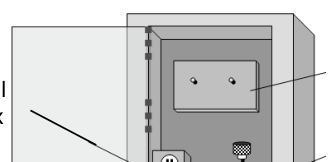

--- end of page=329 ---

Chapter 11 – Site Survey Fundamentals **302**

A structural engineer may be required to determine if a tower can be placed on top of a
building without safety risks to the occupants of the building. Permits may also be
necessary to install a tower.

**Purpose & Business Requirements**

_What is the purpose of the wireless LAN? What are the business requirements?_

From a temporary office to complete data connectivity for the Olympics, the answer to
this question will drive many decisions. Using the extreme example and contrast of a
temporary office versus the Olympics, dozens of issues might come up such as budget,
number of users, outdoor connectivity, temporary network access, and security.

Recommending a high-speed 802.11a installation for an organization that is only using a
few wireless PDAs would be a poor judgment, so the needs of the users must be
determined. As much information as can be gathered will be helpful in understanding
how the wireless LAN is to be used. This information gathering may require interviews
with some network users as well as network management.

Find out exactly what the client expects to do with the wireless LAN and what
applications are going to be used over this new network. There might be several distinct
and independent purposes for the wireless LAN. Thoroughly documenting the client's
needs enables the network architect to design a solution that will meet all of the client’s
needs, and may also assist the client in their network management.

In order for the site surveyor, and subsequently the design engineer, to keep the business
requirements as a main focus, the site surveyor must have a solid understanding of how
the network will be used and for what reasons. By knowing how the wireless network
affects the business goals of the organization, the site surveyor will be able to create a
better, more thorough RF Site Survey Report.

For example, at a ski resort, skiing instructors and ski instructor supervisors use wireless
handheld PDAs to coordinate skiing classes across several slopes at once. Since these
handhelds are used over a vast stretch of land, range is very important, but the small
amount of data being carried over the wireless network means that many of these wireless
PDAs can be used on a single access point at any given time without degraded
performance. In contrast, a small workgroup of graphic designers, sitting in one room
needing access to file servers to which they transfer large images over the wireless
network, need high-speed access, but range is minimal. Only a small number of this type
of user (high bandwidth) should be connected to an access point at any given time.

CWNA Study Guide © Copyright 2002 Planet3 Wireless, Inc.

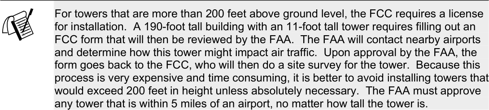

--- end of page=330 ---

**303** Chapter 11 – Site Survey Fundamentals

These scenarios show how uses of wireless LANs can vary substantially. The site
surveyor must know the business needs of the organization in order to effectively
perform a site survey.

**Bandwidth & Roaming Requirements**

_What bandwidth and roaming requirements are there?_

The answer to this question can determine the actual technology to be implemented, and
the technology to be used when doing the site survey. For example, if the client is a
warehouse facility and the only purpose that the wireless LAN will serve is scanning data
from box labels and sending that data to a central server, the bandwidth requirements are
very small. Most data collection devices require only 2 Mbps (such as a computer on a
forklift in a warehouse), but require seamless connectivity while moving. However, if
the client requires that the wireless LAN will serve 35 software developers who need
high-speed access to application servers, test servers, and the Internet, consider using
802.11a equipment.

The necessary speed, range, and throughput per user must be determined so that when the
site survey is given to the RF design engineer, the design engineer can create a solution
that is cost effective and meets the needs of the users. Figure 11.3 shows a survey
diagram that will allow for 2 Mbps per user, while Figure 11.4 allows for 5.5 Mbps per
user.  Most companies are broken into several departments such as engineering,
accounting, marketing, human resources, etc. Each department type may have different
uses of the wireless LAN in their area.

**FIGURE 11.3** 2 Mbps data rate

CWNA Study Guide © Copyright 2002 Planet3 Wireless, Inc.

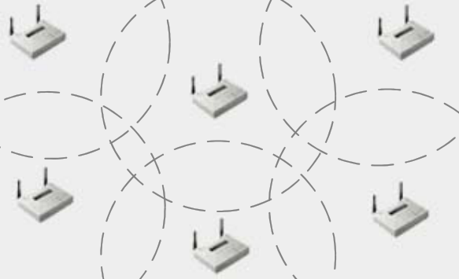

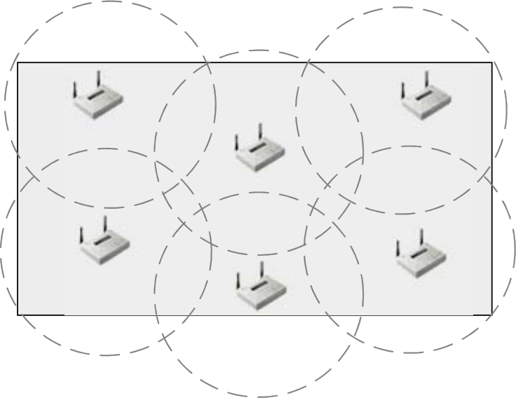

--- end of page=331 ---

Chapter 11 – Site Survey Fundamentals **304**

**FIGURE 11.4** 5.5 Mbps data rate

_How many users are typically in a given area?_

An understanding of how many users will be located in a given area is required to
calculate how much throughput each user is going to have. This information is also used
to determine which technology, such as 802.11b or 802.11a, would be most well suited to
the needs of the users. If the network manager is not able to provide this information, the
person doing the site survey will need to interview the actual users to be able to make an
informed decision. Different departments within an organization will have different
numbers of users. It is important to understand that the needs of one part of a facility
might be different from the needs of another part of a facility.

_What type of applications will be used over the wireless LAN?_

Find out if the network is being used to transmit non time-sensitive data only, or timesensitive data such as voice or video. High bandwidth applications such as voice or video
will require more throughput per user than an application that makes infrequent network
requests. Connection-oriented applications will need to maintain connectivity while
roaming. Analyzing and documenting these application requirements before the site
survey will allow the site surveyor to make more informed decisions when testing areas
for coverage.

_Are there any non-typical times in which network needs may change for a particular_
_area?_

Changes in network needs could be something as simple as more users being on a
particular shift or something as difficult to discover as seasonal changes. For example, if
a building-to-building bridge link were being surveyed in winter, the trees would be
without leaves. In the spring, trees will fill with leaves, which in turn fill with water,
which could possibly cause problems with the wireless link.

_What mobility or roaming coverage is necessary?_

CWNA Study Guide © Copyright 2002 Planet3 Wireless, Inc.

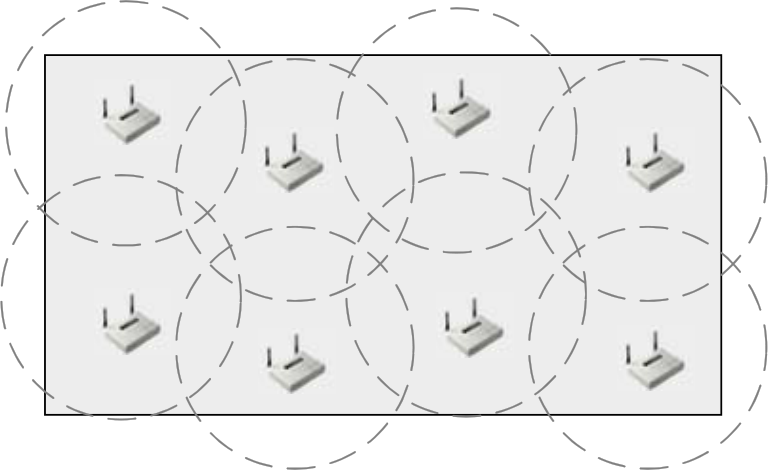

--- end of page=332 ---

**305** Chapter 11 – Site Survey Fundamentals

Users may want to roam indoors, outdoors, or both. Roaming may also have to
incorporate crossing of router boundaries, maintaining VPN connectivity, and other
complex situations. In this case, it would be important for the site surveyor to document
these facts so that the wireless network design engineer would have all of the facts before
presenting a solution to the customer. There may be areas within or around a facility that
require special connectivity solutions, due to blockage of RF coverage or to special
security requirements, in order to provide roaming.

**Available Resources**

_What are the available resources?_

Among topics to discuss with the network manager regarding available resources are the
project's budget, the amount of time allotted for the project, and whether or not the
organization has administrators trained on wireless networks. If documentation of
previous site surveys, current topology and facility maps, and current design plans are
available, the site surveyor should request copies of these plans. It is possible that the
network administrator may not give access to all of these resources, citing security
reasons. If so, then the site survey may take additional time.

_Are facility blueprints available (electronic or printed)?_

Among the first items to request from a network manager are blueprints or some kind of
map showing the layout of the facility, as shown in Figure 11.5. Without the official
building or facility schematics, a diagram must be created that shows the dimensions of
the areas, the offices, where the walls are located, network closets, power outlets, etc.

**FIGURE 11.5** Blueprints or floor plans

CWNA Study Guide © Copyright 2002 Planet3 Wireless, Inc.

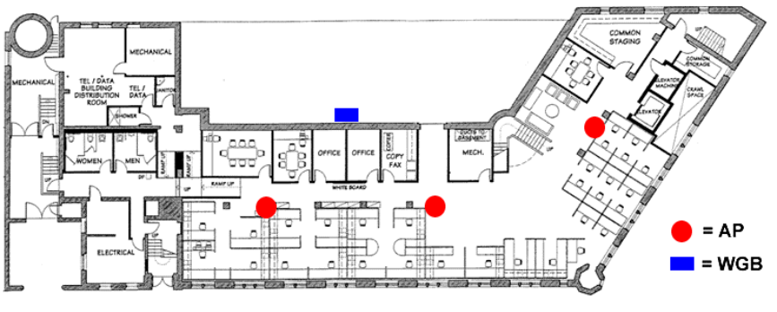

--- end of page=333 ---

Chapter 11 – Site Survey Fundamentals **306**

_Are there any previous site survey reports available?_

If a company has previously had a site survey performed, having that site survey report
available can cut down on the time it takes for the new survey to be completed. Be sure
that the previous report does not bias the decisions made regarding the current site
survey.

_Is a facilities escort or security badge required?_

A security badge or an escort may be required to move throughout the facility freely.
When performing a site survey, every square foot of the facility is usually covered in
order to answer all of the questions needed to define the RF coverage.

_Is physical access to wiring closets and the roof available if needed?_

Physical access to both the roof and to wiring closets may be needed to determine
antenna placement and network connection points.

**Security Requirements**

_What level of network security is necessary?_

Customers may have very strict demands for data security, or in some cases, no security
may be required. It should be explained to the customer that WEP should not be the only
wireless LAN security method used because WEP can be easily circumvented. Briefly
educating the customer on available security options is an important step in getting
started with a site survey. A discussion with the customer will provide them enough
information to feel informed and will allow them to better understand the solutions likely
to be presented by the design engineer. After this discussion, the customer may likely
have several questions involving wireless network security that may aid the site surveyor
in properly documenting the customer's business needs.

_What corporate policies are in place regarding wireless LAN security implementation_
_and management?_

The network manager may not have any security policies in place. If the customer
already has a wireless LAN in place, the existing security policies should be reviewed
before the site survey is started. If corporate security policies relating to wireless LANs
do not exist, ask questions about security requirements regarding installations of wireless
LANs.

During the design phase (design is not part of the site survey itself) the RF design
engineer could include a security report detailing security suggestions for this particular
installation. The network administrator could then take this information and form a
corporate policy based on the suggestions. Security policies may differ slightly between

CWNA Study Guide © Copyright 2002 Planet3 Wireless, Inc.

--- end of page=334 ---

**307** Chapter 11 – Site Survey Fundamentals

small, medium and enterprise installations, and can sometimes be re-used. There are
general security practices that are common to all installations of wireless LANs. These
policies may also include how to manage the wireless network once it is installed.

**Preparation Exercises**

As a thought-provoking exercise, consider some of the hypothetical examples mentioned
earlier (small office wireless LAN, international airport wireless LAN, and a wireless
LAN for connecting all the computers at the Olympics), and then ask the following
questions:

      - Are the users mobile within the facility (e.g., do they have portable computers or
desktops)?

      - How far – inside or outside – will the users roam and still need connectivity?

      - What level of access do these users need to sensitive data on the network? Is
security required? How secure is "secure enough"?

      - Will these users be able to take their laptop computers away from the wireless
LAN where the wireless LAN cards could be stolen?

      - Do these users use any bandwidth-intensive, time-sensitive, or connectionoriented applications?

      - How often do these users change departments or locations?

      - Will any or all of these users have Internet access, and what are the policies
regarding email and downloads?

      - Does the office/work environment of these users ever change for special events
that could disrupt a wireless LAN?

      - Who currently supports these users on the existing network, and are they
qualified to support wireless users?

      - If the users are mobile, what type of mobile computing device do they use? (e.g.,
PDA or Laptop)

      - How often and for how long will the users with laptops work without A/C
power?

There are many specific questions about the users of the wireless LAN and their needs,
and this information is vital to the site survey. The more information that can be gathered
about who will be using the wireless LAN and for what purposes the easier it will be to
conduct the site survey.

**Preparation Checklist**

Below is a general list of items that should be obtained from or scheduled with the client
prior to visiting the site for the purpose of doing the site survey, if possible.

      - Building blueprints (including power source documentation)

      - Previous wireless LAN site survey documentation

CWNA Study Guide © Copyright 2002 Planet3 Wireless, Inc.

--- end of page=335 ---

Chapter 11 – Site Survey Fundamentals **308**

      - Current network diagram (topology map)

      - A meeting with the network administrator

      - A meeting with the building manager

      - A meeting with the security officer

      - Access to all areas of the facility to be affected by the wireless LAN

      - Access to wiring closets

      - Access to roof (if outdoor antennas are anticipated)

      - Future construction plans, if available

Now that all of these questions are answered and complete documentation of the facility
has been made, you are ready to leave your office and go on site.

##### Site Survey Equipment

This section will cover the wireless LAN equipment and tools required for a site survey.
In the most basic indoor cases, you will need at least one access point, a variety of
antennas, antenna cables and connectors, a laptop computer (or PDA) with a wireless PC
card, some site survey utility software, and lots of paper. There are some minor things
that can be added to your mobile toolkit such as double-sided tape (for temporarily
mounting antennas to the wall), a DC-to-AC converter and batteries (for powering the
access point where there's no source of AC power), a digital camera for taking pictures of
particular locations within a facility, a set of two-way radios if working in teams, and a
secure case for the gear. Some manufacturers sell site survey kits already configured, but
in many cases, the individual prefers to select the tool kit and wireless LAN equipment
piece by piece to assure that they get all of the pieces they need. A more comprehensive
list of equipment required during a site survey is provided in a checklist at the end of this
section.

**Access Point**

The access point used during a site survey should have variable output power and
external antenna connectors. The variable output power feature allows for easy sizing of
coverage cells during the site survey. This tool is particularly useful for situations
involving long hallways such as in a hospital.

Many experienced site survey professionals have an access point that operates on AC
power connected to a DC-to-AC converter, which, in turn, is connected, to a battery pack.
This configuration makes the access point mobile, and able to be placed anywhere the

CWNA Study Guide © Copyright 2002 Planet3 Wireless, Inc.

--- end of page=336 ---

**309** Chapter 11 – Site Survey Fundamentals

site surveyor needs to perform testing. This group of components can be tie-strapped
together, or put into a single, portable enclosure. There are companies that have pieced
together such a "kit" for the sole purpose of making site surveying easier. Many times
the access point will be placed on a ladder or on top of the ceiling tiles while the antenna
is temporarily mounted to a wall. Having completely portable gear with no need for AC
power makes the site survey go much faster than it would otherwise.

**PC Card and Utilities**

High quality wireless pc cards will come with site survey utility software, as shown in
Figure 11.6. The site survey utilities from the different manufacturers will vary in their
functionality, but most offer a link speed indicator and signal strength meter at a
minimum. These two tools will provide general indications of coverage. To perform a
quality site survey, the following actual quantitative measurements should be recorded:

      - Signal strength (measured in dBm)

      - Noise floor (measured in dBm)

      - Signal-to-noise ratio (“SNR”) (measured in dB)

      - Link speed

Only a few vendors offer this complete set of tools in their client utility software. An
additional tool that can be utilized is a spectrum analyzer, which is used for finding
sources of RF interference. With quality site surveying software (whether using one or
more wireless PC cards), site survey measurements can be efficiently completed with
accuracy.

CWNA Study Guide © Copyright 2002 Planet3 Wireless, Inc.

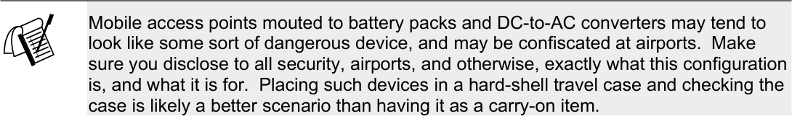

--- end of page=337 ---

Chapter 11 – Site Survey Fundamentals **310**

**FIGURE 11.6** Site Monitor application

While walking around the intended coverage area, pay particular attention to the SNR
measurement because this measurement shows the strength of the RF signal versus the
background noise. This measurement shows the viability of the RF link, and is a good
indicator of whether or not a client will connect and remain connected. Many experts
agree that an SNR measurement of 22 dB or more is a viable RF link, but there is no hard
and fast rule for this measurement. Whether a link is actually viable or not depends on
factors other than just SNR, but as long as a link is stable and the access point provides
the client with a level of RF power significantly above its sensitivity threshold, the link
can be considered viable.

Having a utility that can measure the signal strength, the SNR, and the background RF
noise level (called the "noise floor") is very useful. Knowing the signal strength is useful
for finding out if an obstacle is blocking the RF signal or if the access point is not putting
out enough power. The SNR measurement lets the site surveyor know if the link is clean
and clear enough to be considered viable. Knowing the noise level is useful in
determining if RF interference is causing the link a problem or if the level of RF in the
environment has changed from the time that a baseline was established. An engineer can
use all three of these measurements to make design and troubleshooting determinations.

One function of a wireless PC card that is particularly useful is the ability to change the
power output at the client station during the site survey. This feature is useful because a
site surveyor should test for situations in which near/far or hidden node problems might
exist. Not all site surveyors have the luxury of taking the time to do this sort of testing,
but this feature is useful when time permits.

CWNA Study Guide © Copyright 2002 Planet3 Wireless, Inc.

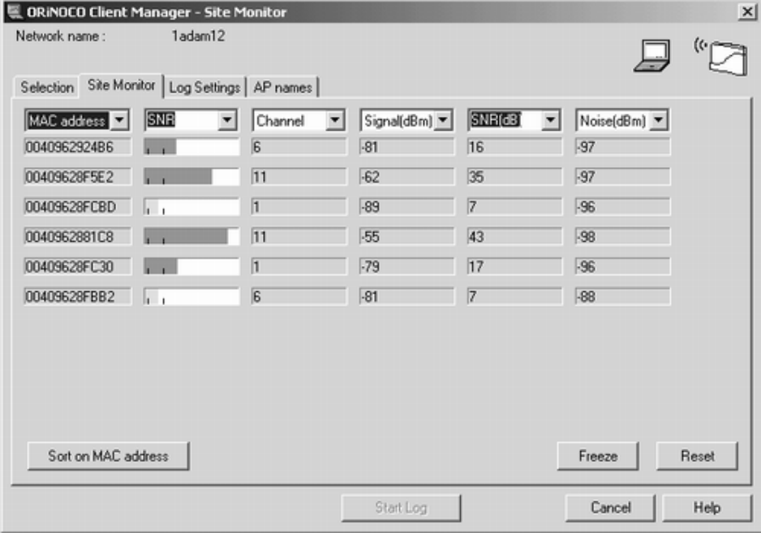

--- end of page=338 ---

**311** Chapter 11 – Site Survey Fundamentals

Third party utilities such as Netstumbler are valuable utilities during a site survey in
which there are already access points and bridges in place. These utilities enable the site
surveyor to find all of these units quickly and record their information (such as MAC
address, SSID, WEP status, signal strength, SNR, noise, etc.). These utilities can replace
what the driver software and manufacturer utilities miss in many cases.

Link speed monitor utility software can be used to measure the wireless link speed. This
information is useful in case part of the site survey requirement is to size or shape the
cells for 11 Mbps usage by clients. As we learned earlier, Dynamic Rate Shifting (DRS)
allows a client to automatically downshift link speeds as range increases. If the business
requirements are for all clients to maintain 11 Mbps connectivity while roaming, then
proper coverage patterns must be documented during the site survey.

**Laptops & PDAs**

A laptop computer or PDA unit is used by the site surveyor for checking for signal
strength and coverage while roaming around the facility. Many site survey professionals
have begun using PDAs instead of laptop computers to perform the site survey because of
battery life and portability. PDAs can report the same information and connect to the
network in the same way as the laptop without the 3 - 7 pounds of extra weight that a
laptop weighs. Three to seven pounds might not seem like much weight, but after
carrying a laptop of this weight around a facility that measures over a million square feet
(which is a common facility size), a PDA that supports the functionality you need to do
your site survey may seem like a trivial purchase. Most manufacturers make Pocket PC
and Windows CE drivers and utilities (including the site survey utilities) for their
PCMCIA cards.

There are miniature laptops available on the market weighing as little as 1.5 pounds,
which also serve the same purpose of having a more portable unit for site surveying.
However, these ultra-portable laptops tend to cost many times as much as a PDA.

Simple screen-capture software is also beneficial. For reporting purposes, screenshots
show the actual results that the site monitoring software displayed. These screenshots
will be presented to the customer as part of the RF Site Survey Report, which is why
custom screen capture software is useful. Screen capture software packages are available
for Windows, Pocket PC, and Linux operating systems.

Laptop batteries rarely last more than 3 hours, and a site survey might last 8-10 hours per
day. Always having fresh batteries on hand will keep you productive while on-site.
Without the luxury of extra laptop batteries, the only alternative is to charge the batteries
during a break, which might not be a good alternative since many laptop batteries charge
slowly. Another solution would be to find a very small, power-efficient laptop whose
batteries are specified to last much longer than the typical 2-3 hours. As mentioned
before, PDA batteries tend to last longer than do laptop batteries.

**Paper**

Both the surveyor and the network designer should make hard copy (paper)
documentation of all findings in great detail for future reference. Digital photographs of

CWNA Study Guide © Copyright 2002 Planet3 Wireless, Inc.

--- end of page=339 ---

Chapter 11 – Site Survey Fundamentals **312**

a facility make finding a particular location within the facility much easier and serve as
graphical information for the RF Site Survey Report as well. During most surveys
scratch paper, grid paper, and copies of blueprints or floor plans are necessary. When
added to the amount of equipment that will be carried around, this amount of paper and
documentation tends to become a burden. For this reason, a sufficiently large mobile
equipment cart that can contain all the necessary gear is quite useful while moving
through a facility.

There are no industry standard forms for recording all the data that will be necessary
during even the smallest site survey. However, it will prove very useful to create a set of
forms that suits your style of work and recording, and to use these same forms on every
site survey. Not only will this type of uniformity help you communicate your findings to
the client, but it will also help maintain accurate and easy to understand records of past
site surveys. These forms will be used during the creation of your site survey report as a
reference for all readings taken during the site survey.

**Outdoor Surveys**

Outdoor site surveys will take more time, effort, and equipment than will indoor surveys,
which is another reason that planning ahead will greatly improve productivity once on
site. If a survey to create an outdoor wireless link is being done, obtain the appropriate
antennas, amplifiers, connectors, cabling, and other appropriate equipment before
arriving. Generally, the more experienced site surveying professionals do the outside site
surveys because of the more complex and involved calculations and configuration
scenarios that are necessary for outdoor wireless LANs.

Knowing characteristics of the wireless link (distance, link speed required, power output
required, etc.) beforehand will aid in determining whether just an omni antenna or an
entire outdoor testing lab will be required. Remember that it takes _two_ _or more_ antennas
to create a wireless link depending on the number of locations involved in the link.
Binoculars, comfortable walking shoes, rain gear, different lengths of cables, different
types of connectors, and some method of communicating with someone at the other end
of the link (i.e., a cell phone or walkie-talkie) will also make outdoor site surveys more
efficient.

**Spectrum Analyzer**

Spectrum analyzers come in various types. The two main categories might be considered
software and hardware spectrum analyzers. Hardware spectrum analyzers are made by
many different manufacturers and may cost many thousands of dollars, depending on
resolution, speed, frequency range, and other parameters.

There are companies in the wireless LAN industry who have created software capable of
scanning the entire 2.4 GHz range and providing a graphical display of the results, as
shown in Figure 11.7. These products give a user the effective equivalent of a hardware
spectrum analyzer, which, although it may not produce precisely accurate quantitative
measurements, can give a user a general idea of what sources of RF are in use in the area.

CWNA Study Guide © Copyright 2002 Planet3 Wireless, Inc.

--- end of page=340 ---

**313** Chapter 11 – Site Survey Fundamentals

As part of the spectral analysis, have all the users turn their equipment off, if possible, so
that any sources of background interference can be detected, such as low power sources
of narrowband interference. Low power narrowband interference is easily located while
there are no other sources of RF in use, but is quite difficult to locate when many sources
of RF are in use. High power narrowband is easily located with the proper test
equipment regardless of additional RF sources.

**FIGURE 11.7** Spectrum Analyzer screenshot

Part of a spectrum analysis should be to locate any 802.11b or 802.11a networks in use in
the area around the implementation area of the proposed wireless LAN. If current or
future plans involve installation of 802.11a products, it would be advantageous to both
the site surveyor and the customer to know of any 5 GHz RF sources, especially if they
are part of a wireless LAN.

**Network Analyzer (a.k.a. "Sniffer")**

After spectrum analysis is complete, a sniffer can be used to find other wireless LANs
that are present in the area (perhaps on another floor of a building), which can affect the
wireless LAN implementation. The sniffer will pick up any packets being transmitted by
nearby wireless LANs and will provide detailed information on channels in use, distance,
and signal strength, as shown in Figure 11.8.

CWNA Study Guide © Copyright 2002 Planet3 Wireless, Inc.

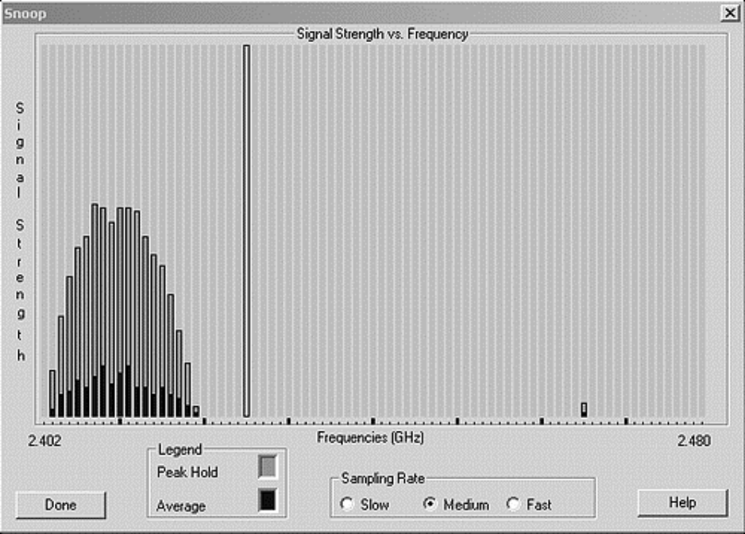

--- end of page=341 ---

Chapter 11 – Site Survey Fundamentals **314**

**FIGURE 11.8** Wireless Sniffer screenshot

**Site Survey Kit Checklist**

A complete site survey kit should include:

      - Laptop and/or PDA

      - Wireless PC card with driver & utility software

      - Access points or bridges as needed

      - Battery pack & DC-to-AC converter

      - Site survey utility software (loaded on laptop or PDA)

      - Clipboard, pen, pencils, notebook paper, grid paper, & hi-liter

      - Blueprints & network diagrams

      - Indoor & outdoor antennas

      - Cables & connectors

      - Binoculars and two-way radios

      - Umbrella and/or rain suit

      - Specialized software or hardware such as a spectrum analyzer or sniffer

      - Tools, double-sided tape, and other items for temporary hardware mountings

      - Secure and padded equipment case for housing computers, tools, and secure
documents during the survey and travel to and from the survey site

CWNA Study Guide © Copyright 2002 Planet3 Wireless, Inc.

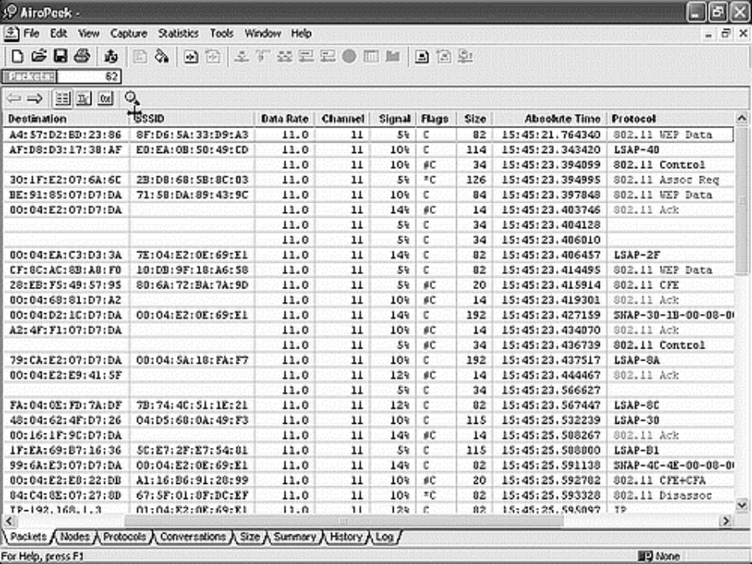

--- end of page=342 ---

**315** Chapter 11 – Site Survey Fundamentals

      - Digital camera for taking pictures of particular locations within a facility

      - Battery chargers

      - Antenna attenuator (Figure 11.9)

      - Measuring wheel (Figure 11.10)

      - Appropriate cart or other mechanism for transporting equipment &
documentation

**FIGURE 11.9** Antenna attenuator

**FIGURE 11.10** Distance wheel

**FIGURE 11.11** Access point with a battery pack

If frequent site surveys are part of your business, create a toolkit with all this gear in it, so
that you will always have the necessary site survey tools on hand. The last item in the

CWNA Study Guide © Copyright 2002 Planet3 Wireless, Inc.

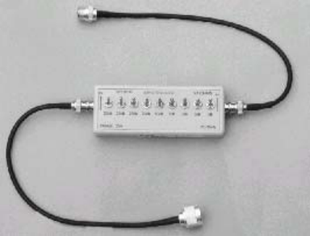

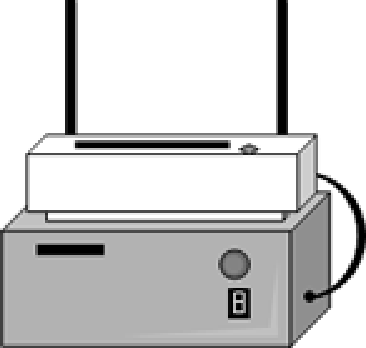

--- end of page=343 ---

Chapter 11 – Site Survey Fundamentals **316**

above list – a cart – will become a valued possession after making a few dozen trips back
and forth across a large facility moving the hardware and site survey support gear. Figure
11.12 shows the type of cart that can be used to carry gear.

**FIGURE 11.12** Site Survey travel case

##### Conducting a Site Survey

Once on site with a complete site survey toolkit, walking several miles throughout the
client’s facility is common. RF site surveying is 10% surveying and 90% walking, so
comfortable shoes should be worn when performing site surveys in large facilities.
However, the general task has not changed: collecting and recording information.
Beginning your site survey with the more general tasks of recording non-RF related
information is usually the best course of action.

**Indoor Surveys**

For indoor surveys, locate and _record_ the following items on a copy of the facility
blueprints or a drawing of the facility.

      - AC power outlets and grounding points

      - Wired network connectivity points

      - Ladders or lifts that will be needed for mounting access points

      - Potential RF obstructions such as fire doors, metal blinds, metal-mesh windows,
etc.

      - Potential RF sources such as microwave ovens, elevator motors, baby monitors,
2.4 GHz cordless phones, etc. Figure 11.13 shows a spectrum analysis of a 2.4
GHz phone.

      - Cluttered areas such as office cubical farms

CWNA Study Guide © Copyright 2002 Planet3 Wireless, Inc.

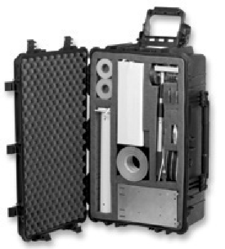

--- end of page=344 ---

**317** Chapter 11 – Site Survey Fundamentals

**FIGURE 11.13** 2.4 GHz DSSS phone as seen by a spectrum analyzer

**Outdoor Surveys**

For outdoor surveys, record the following items on a copy or sketch of the property:

      - Trees, buildings, lakes, or other obstructions between link sites

      - If in winter, locate trees that will grow leaves during other seasons and may
interfere with the RF link

      - Visual and RF line of sight between transmitter and receiver

      - Link distance (note: if greater than 7 miles, calculate compensation for Earth
bulge)

      - Weather hazards (wind, rain, snow, lightning) common to the area

      - Tower accessibility, height, or need for a new tower

      - Roof accessibility, height

**Before You Begin**

Once these preparatory items are checked and recorded, the next step is either to begin
the RF site survey, or to obtain more information. There are several sources from the
above items that could require further information from the client, including:

      - Who will provide ladders and/or lifts for mounting access points on high
ceilings?

CWNA Study Guide © Copyright 2002 Planet3 Wireless, Inc.

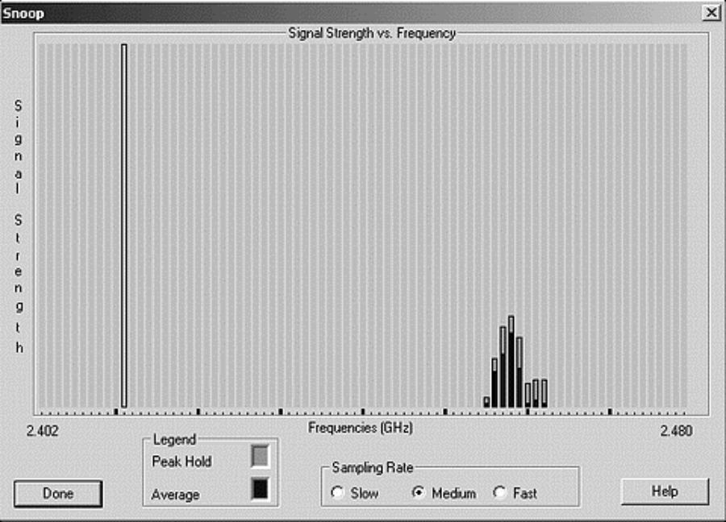

--- end of page=345 ---

Chapter 11 – Site Survey Fundamentals **318**

     - Is the client willing or able to remove trees that interfere with the Fresnel zone?

     - If a new tower is needed, does the client have the necessary permits?

     - Does the client have necessary permissions to install antennas on the roof and
will the roof support a tower if needed?

     - Do the building codes require plenum-rated equipment to be used?

Weather hazards may be easier to compensate for if you also reside in the area because
you may be familiar with the area’s weather patterns. If you do not live there, gathering
more detailed information about local weather patterns like winds, rain, hail, tornadoes,
hurricanes, and other potentially severe weather may be necessary. Remember from our
troubleshooting discussion that for the most part, only severe weather causes disruption
to wireless LANs. However, you must be aware of, prepare and compensate for, these
types of weather before the implementation of the wireless network.

Lifts and ladders could be needed for an area where a trade show or other similar function
is going to take place. The event’s location may have 40-foot ceilings, and the access
points may need to be mounted in the ceiling for proper coverage. OSHA has many
regulations regarding ladders and ladder safety.

If a facility such as a trade show is able to provide the personnel, ladders, and lifts to do
the installation, let these individuals perform the work. These individuals are familiar
with OSHA regulations and have processes in place to obtain the proper permits. The RF
Site Survey Report will need to reference any lifts, ladders, or permits required for
installation of the wireless LAN. In many cases, a sturdy 6-foot ladder for climbing into
drop-ceilings is all that is needed.

If an RF cable, Cat5 cable, access point, or any other device must be placed in the plenum
(the space between the drop ceiling (false ceiling) and the hard-cap ceiling), then the item
must be rated to meet building codes without being placed in a metal protective shell.
This restriction applies to wiring closets as well.

**RF Information Gathering**

The next task will be gathering and recording data on RF coverage patterns, coverage
gaps (also called "holes" or "dead spots"), data rate capabilities, and other RF-related
criteria for your RF Site Survey Report.

     - Range & coverage patterns

     - Data rate boundaries

     - Documentation

     - Throughput tests & capacity planning

     - Interference sources

     - Wired data connectivity & AC power requirements

     - Outdoor antenna placement

     - Spot checks

CWNA Study Guide © Copyright 2002 Planet3 Wireless, Inc.

--- end of page=346 ---

**319** Chapter 11 – Site Survey Fundamentals

Gather and record data for each of these areas by slowly and systematically surveying
and measuring the entire facility.

**Range and Coverage Patterns**

Start by placing an access point in what should be a logical location. This location may
not be the final location, but you have to start somewhere. The access point may get
moved many times before the proper location is found, as shown in Figure 11.14.
Generally speaking, starting in the center of an area is practical when using omni
antennas. In contrast, when using semi-directional antennas, consider being toward one
end of a stretch of intended coverage area.

When the best locations for access points are determined, mark the locations you for
access points and bridges with bright-colored, easily removable tape. Take a digital
picture of the location for use in the site survey report. Do not make location references
in the report to objects, such as a temporary desk, table, or plant that may be moved and
can no longer provide a reference for locating an access point. Make sure to note
orientation of your antennas because not all wireless LAN installers are familiar with
antennas.

**FIGURE 11.14** Access point coverage testing

Various types of antennas can be used for site survey testing including highly-directional,
semi-directional, and omni-directional. When using semi-directional antennas, be sure to
take into account the side and back lobes both for coverage and security reasons. Sites
may require the use of multiple antenna types to get the appropriate coverage. Long
hallways might benefit from Yagi, patch, or panel antennas while omni-directional
antennas would more easily cover large rooms.

There are differing opinions as to where measuring coverage and data speeds should
begin. Some experts recommend starting in a corner, while some say starting in the
middle of the room is best. It doesn’t matter where the measurements _start_ so long as
every point in the room is measured during the survey and covered after installation.
Pick a starting point in the room, and slowly walk with your laptop, PC card, and site
survey utility software running. While walking, record the following data for every area
of the room.

CWNA Study Guide © Copyright 2002 Planet3 Wireless, Inc.

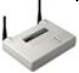

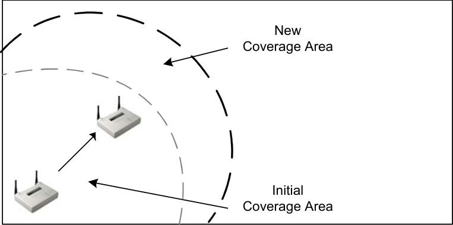

--- end of page=347 ---

Chapter 11 – Site Survey Fundamentals **320**

      - Data rate (measured in megabits/second or Mbps)

      - Signal strength (measured in dBm)

      - Noise floor (measured in dBm)

      - Signal-to-noise ratio (“SNR”) (measured in dB)

Walking fast will speed up the survey process, but may cause you to miss dead spots or
potential interference sources. Using a very simple example, Figure 11.15 illustrates
what the recordings might look like on a floor plan or blueprint.

**FIGURE 11.15** Marked up floor plan

For outdoor coverage areas, be prepared to walk farther and record more. If planning an
outdoor installation of an access point (to cover areas between campus buildings for
example), then there are usually a very limited number of places where the access point
may be mounted. For this reason, moving the access point around is rarely required.
Sitting atop a building is the most common place in such an installation. There are
potentially many more sources of interference or blockage to a wireless LAN signal
outdoors than indoors.

Site surveying is not an exact science, which is why thoroughness and attention to detail
are required. Record the measurements for the general areas of the room, including
measuring the furthest point from the access point, every corner of the room, and every
point in the room at which there is no signal or the data rate changes (either increases or
decreases). Points of measurement should be determined by the answers to the questions
that were asked before you arrived on site to do the survey. Information such as where
users will be sitting in a room, where users will be able to roam, the types of users (heavy
file transfer or bar-code scanning, for example), and locations of break rooms with
microwave ovens in them will all help determine for which points data rate and range
should be recorded.

CWNA Study Guide © Copyright 2002 Planet3 Wireless, Inc.

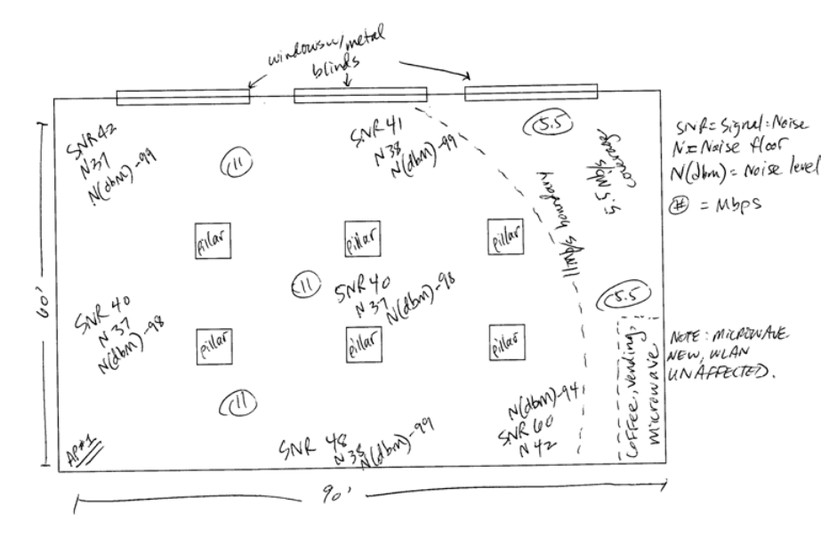

--- end of page=348 ---

**321** Chapter 11 – Site Survey Fundamentals

**Data Rate Boundaries**

Be sure to record the data rate boundaries. These boundaries are also known as the
concentric zones around the access point. If you are using an 802.11b wireless LAN, for
example, record where the data rate decreases from 11Mbps to 5.5Mbps to 2Mbps to
1Mbps, as shown in Figure 11.16. These boundaries should somewhat resemble
concentric circles, with the slower data rate areas further from the access point than the
higher data rates. The client organization must be told that when a user roams out past
the coffee machine to the mailroom, that user will not get the highest possible throughput
due to the data rate decrease, which, in turn, is due to the distance increase.

**FIGURE 11.16** Data rate boundaries

11 Mbps

11-5.5 Mbps

5.5-2 Mbps

2-1 Mbps

**Documentation**

By this point, the copy (or copies) of the facility blueprint should be well marked up, with
circles, dead spots (if any), data rates, and signal strength measurements in key spots.
Now another location within the facility can be documented, and the process begins
again. When surveying a small office, and the entire office has facility-wide coverage
with maximum throughput from the first testing location chosen, the process does not
need to be repeated - the survey is finished. However, that will rarely be the case, so this
chapter will prepare you for the worst-case scenario of site surveying.

Be prepared to survey and move, survey and move, again and again, until the optimum
coverage pattern for a particular area has been determined. This repetition is the reason
for making multiple copies of the facility blueprint or floor plan and bringing lots of
paper.

The end result of this portion of the exercise should be a map of the range and coverage
of the access point from various locations, with the best results and worst-case results
noted. Certainly it saves much time to document only the best possible coverage pattern,
so in the interest of efficiency, it is a general practice to quickly test until a "somewhat
optimum" location for the access point is found, then do the complete set of
documentation (drawings, recording of data, etc.). Site surveying, like anything else,
takes practice to become effective. Making decisions that affect the use of time are very
important because site surveying is a very time-consuming task.

CWNA Study Guide © Copyright 2002 Planet3 Wireless, Inc.

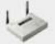

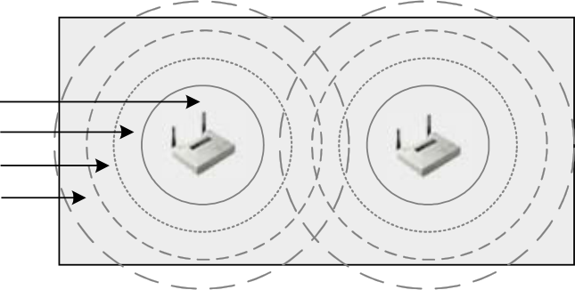

--- end of page=349 ---

Chapter 11 – Site Survey Fundamentals **322**

**Throughput Tests & Capacity Planning**

There is another type of measurement (outside of the typical SNR, noise, & signal
strength that we've discussed thus far) that can be performed by the site surveyor which
will yield valuable information to the wireless network design engineer, and that is doing
throughput testing from various points throughout the facility. The point of doing all of
this coverage and data rate documentation is to understand and control what the user's
experience will be on the wireless LAN. Doing live throughput tests such as file transfers
to and from an FTP server will give the site surveyor a more thorough look at what the
user might experience. Sometimes this test is not possible due to a lack of wired
infrastructure connectivity, but it is a valuable option when it is available.

Planning for user capacity is very important if the user is to make productive use of the
wireless LAN. From the answers provided by the network manager or administrator, you
will know to look for locations within the facility where there are different types of user
groups present. For example, if one 50’ x 50’ area were to house 20 people who work
from desktop PCs using client/server applications, determine whether or not one access
point could provide the necessary capacity, or if co-located access points would be
required to provide for these users' networking needs. In this scenario, it is likely that at
least two access points would be required. In contrast, if there were 30 doctors using
wirelessly connected PDAs all connecting through a single access point, co-located
access points would not likely be needed due to the fact that a PDA cannot transmit large
amounts of data across the network very quickly.

These pieces of information will add to the markings on the blueprint in the form of
specific data rates, throughput measurements, and capacity notes. With the 11 Mbps
coverage circle around each access point drawn to illustrate that particular coverage area,
it might be determined that there are 10 people in that area that need a minimum of 500
kbps throughput at all times. These measurements will also determine equipment needs
and expenses.

**Interference Sources**

In this phase of the site survey process, questions are asked about potential sources of
narrowband and spread spectrum RF interference.

_Are there any existing wireless LANs in use in or near the facility?_

Existing wireless LANs can cause hardship on a site-surveyor if permission is not
provided to disable existing radios as needed. Disabling existing wireless LAN gear may
not be possible due to production environments, or the surveyor may have to conduct the
site survey during non-production hours.

CWNA Study Guide © Copyright 2002 Planet3 Wireless, Inc.

--- end of page=350 ---

**323** Chapter 11 – Site Survey Fundamentals

_Are there any plans for future wireless LAN installations other than the one in question?_

Determine if there is another wireless LAN project that needs to be included in the
analysis. These projects could affect implementation of the wireless LAN for which this
site survey is being performed.

_If this is a multi-tenant building, are there any other organizations within the building_
_that have wireless LANs or sources of RF? Are any other organizations planning_
_wireless LAN implementations?_

For multi-tenant buildings, it is possible that another organization within the same
building is also planning to build a wireless LAN in the future that would impact the site
survey, as shown in Figure 11.17. Organizations within the same multi-tenant office
building could have wireless LANs in place disrupting each other’s communications. If
the location is a high-rise building, try to find out if any of the neighboring high-rises
have wireless LANs.

**FIGURE 11.17** Multi-tenant Office Buildings

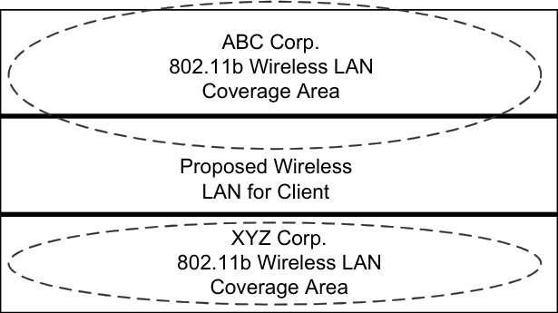

3rd Floor

2nd Floor

1st Floor

_Are there any other common sources of RF interference in the 2.4 GHz band in use in the_
_facility?_

Microwave ovens, 2.4 GHz cordless phones, radiology equipment, and baby monitors are
common sources of RF interference in the 2.4 GHz band. These potential interference
sources need to be documented in the survey as potential problems with the installation.
Microwave ovens can easily be replaced, though radiology equipment in a hospital
installation may not be. 2.4 GHz phones running on the same channel as the wireless
LAN can render a wireless LAN useless.

_In case 802.11a networks are to be installed, are there any RF sources in the 5 GHz_
_range?_

If there were many other organizations in the area already using 802.11b, using 802.11a
would avoid the interference of trying to coexist with another 802.11b network.
However, it should be noted whether or not other 802.11a networks exist in the area that
could interfere with an 802.11a implementation.

CWNA Study Guide © Copyright 2002 Planet3 Wireless, Inc.

--- end of page=351 ---

Chapter 11 – Site Survey Fundamentals **324**

**Obstacle-Induced Signal Loss**

The chart in Figure 11.18 provides estimates on RF signal losses that occur for various
objects. Using these values as a reference will save the surveyor from having to calculate
these values. For example, if a signal must penetrate drywall, the range of the signal
would be reduced by 50%. The loss is indicated in decibels, and the resulting range
effect is shown.

**FIGURE 11.18** Signal Loss Chart

|Obstruction|Additional Loss (dB)|Effective Range|
|---|---|---|
|Open Space|0|100%|
|Window (non-metallic tint)|3|70|
|Window (metallic tint)|5-8|50|
|Light wall (dry wall)|5-8|50|
|Medium wall (wood)|10|30|
|Heavy wall (6” solid core)|15-20|15|
|Very heavy wall (12” solid core)|20-25|10|
|Floor/ceiling (solid core)|15-20|15|
|Floor/ceiling (heavy solid core)|20-25|10|

Find and record all sources of interference as you map your range and coverage patterns,
as shown in Figure 11.19. When measuring the coverage in the break room, for example,
measure both when the microwave is running and when it is off. In some cases, the
microwave could impact the entire wireless LAN infrastructure if the microwave is an
older model. If this is the case, advise the client to purchase a new microwave oven and
not to use the existing unit. The client and the users need to be aware of the potential
interference and possible lack of connectivity from the break room (or wherever a
microwave oven is operated).

**FIGURE 11.19** RF Obstacles

Other common sources of indoor interference to look for include metal-mesh cubicles,
metal-mesh glass windows, metal blinds, inventory (what if the client _manufactures_

CWNA Study Guide © Copyright 2002 Planet3 Wireless, Inc.

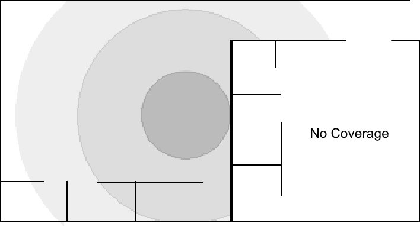

--- end of page=352 ---

**325** Chapter 11 – Site Survey Fundamentals

metal blinds?), fire doors, cement walls, elevator motors, telemetry equipment,
transformers, fluorescent lights, and metal studded walls (as opposed to wood studs).
Piles of objects made of paper, cardboard, wood, and other similar products also serve to
block RF signals.

There are standards for how a firewall (a physical fire barrier) may be penetrated. It is
important to find firewalls during the site survey because they should be noted in the site
survey report. When they prevent Cat5 or RF cabling from going wherever they are
needed, it should be documented. Firewalls can also hamper the RF signal. Some
firewalls have fire doors directly underneath. Do the site survey with the doors closed
because there are locations that require fire doors to remain shut at all times. Poured
concrete walls and hardcap ceilings pose the same problems as firewalls.

In a multi-tenant office building, interference could be caused by a microwave oven
belonging to a company located on the same floor or possibly on floors directly above or
below you. This situation can pose a difficult problem since you have no jurisdiction
over the microwave oven.
There are many outdoor interference sources, and some can change just by their nature.
Seek out and record the effects of the following:

      - Trees, buildings, lakes, or other obstructions or reflective objects

      - Trees _without_ leaves that will later have leaves or that will grow to interfere with
the Fresnel zone.

      - Automobile traffic – if linking two buildings at first-story height across a road, a
large truck or bus could disable the link.

Record the interference source, its location, and its effect and potential effect on wireless
LAN coverage, range, and throughput. This data should be recorded both on your copy
of the blueprint as well as in a separate list for easy future reference. Taking pictures of
interference sources that are permanent (e.g., lakes and buildings) will serve as a visual
reference to the client. Pictures of _potential_ sources of interference like young trees or
future building sites will also help the client’s decision making for the future.

**Wired Data Connectivity & AC Power Requirements**

While moving the access point around the site, indoors and out, the access point may not
be able to be located in the best positions. Rather the location will be constrained to
where AC power sources exist and network connectivity is within a given distance.
Record on the blueprint or floor plan the locations of each AC power source and network
connection point. These points will lead to the easier (not necessarily the best) locations
for access points. Document and make recommendations for the best locations for all
access points. Preferred access point locations may be a solid reason for the client to
install new AC power sources as well as new network connectivity points. Remember
that many brands of access points can utilize Power over Ethernet (PoE).

Some questions to consider when looking for the best place to install wireless LAN
hardware are:

CWNA Study Guide © Copyright 2002 Planet3 Wireless, Inc.

--- end of page=353 ---

Chapter 11 – Site Survey Fundamentals **326**

_Is AC power available?_

Without an available source of AC power, access points will not function. If AC power
is not available in a particular location, an electrician's services may be required (added
cost) or Power over Ethernet (PoE) can be used to power the unit.

_Is grounding available?_

Proper grounding for all wireless LAN equipment will provide added protection against
stray currents from lightning strikes or electrical surges.

_Is wired network connectivity available?_

If network connectivity is not available, a wireless bridge may be required or an access
point may need to be operated in repeater mode to provide network connectivity. Using
access points as repeaters is not a desirable scenario, and the network performance would
be much better if the access point could be wired to the network.

If the distance between the access point and the network connection is more than 100
meters, shielded twisted-pair (STP) cabling or an access point that supports a fiber
connection can be used. However, using an access point that has fiber network
connectivity negates the use of PoE and would require a source of AC power nearby.
Media transceivers can be used when fiber runs are necessary. These transceivers can
convert Cat5 to fiber and vice versa. When using an access point that has only a Cat5
connector, and its nearest network connection is more than 100 meters way, a media
transceiver can solve the problem. Remember that in this configuration, PoE cannot be
used.

Cable lengths in the site survey report should be estimated, but never "as the crow flies."
Rather, estimate RF connector cable lengths using straight runs with 90-degree turns.
Try to keep RF cable runs under 300 feet, but remember to add an extra few feet of cable
in case extra length is needed in the future to move the access point or bridge.

_Are there physical obstructions?_

Doorways, cement ceilings, walls, or other obstructions can result in some construction
costs if they need to be altered to allow for power connections or to run power or data
cabling to the access points or antennas.

**Outdoor Antenna Placement**

For outdoor antenna placement, record the location and availability of grounding points,
towers, and potential mounting locations. Outdoor antennas require lightning arrestors,
which require grounding. Grounding is an easy point to miss, and the client may not be
aware of this necessity. Make notes of where antennas could best be mounted and
whether any special mounting materials may be required.

Keep in mind that adding network connectivity _outdoors_ will be a very new concept to
most companies implementing wireless LANs. Specify exactly what is required to bring

CWNA Study Guide © Copyright 2002 Planet3 Wireless, Inc.

--- end of page=354 ---

**327** Chapter 11 – Site Survey Fundamentals

the network outside the building, including cables, power, weather protection, and
protection from vandalism and theft.

**Spot Checks**

After a wireless LAN is installed, it might not work exactly as planned, although it may
be close. Spot-checking by a site surveyor after installation is complete is most helpful in
avoiding troubleshooting situations during production use of the network. Items that
should be checked are:

      - Coverage in perimeter areas

      - Overlapping coverage for seamless roaming

      - Co-channel and adjacent channel interference in all areas

##### Site Survey Reporting

Now that you have thoroughly documented the client’s facility, the necessary data is
available to prepare a proper report for the client. The report will serve as the map for
implementation of the wireless LAN and future reference documentation for the
network’s administrators and technicians.

The site survey report is the culmination of all the effort thus far, and might take days or
even weeks to complete. It may be necessary to revisit the site to gather more data or to
confirm some of the initial findings. Several more conversations may be needed with the
decision makers and some of the people with whom you were unable to meet when you
were on site.

**Report Format**

There is no body of standards or laws that define how a site survey report should look.
The following are recommendations that will serve as a starting point and guideline.
First, remember while preparing this report that this report is what the client will have
after you leave. This work will represent both your knowledge and that of your
company. Second, you may be doing the wireless LAN implementation, and if so, you
will be working off of your own documentation. If the report is inaccurate, the
implementation will not work as planned. Third, save every piece of data collected, and
include everything with the report as an attachment, appendix, or another set of
documentation. This information may be needed in the future.

Once the site survey is delivered and reviewed by the client, have the client sign a simple
form (the site survey report is your only deliverable) which states that the client has both
received and reviewed the report, and that the report is acceptable. The client may ask
for additional information before signing off.

Below are the main sections of documentation that should be provided to the client in a
site survey report. Include graphics that may help illustrate the data when appropriate.

CWNA Study Guide © Copyright 2002 Planet3 Wireless, Inc.

--- end of page=355 ---

Chapter 11 – Site Survey Fundamentals **328**

**Purpose and Business Requirements**

The site survey report should include all contact information for the site survey company
and the client company. Both the site survey company and the customer get copies of the
report.

Restate the customer’s wants, needs, and requirements, and then provide details on how
these wireless LAN requirements can be met (item-by-item) as a result of using the site
survey as a roadmap to implementing the new wireless LAN. Supplement this section
with graphical representations (either sketches, or copies of actual blueprints) to _show_ the
client what types of coverage and wireless connectivity they requested. This section may
include an application analysis where the site surveyor has tested the client's application
to assure that the proper implementation of the new wireless LAN will provide
appropriate coverage and connectivity for wireless nodes.

**Methodology**

Discuss in detail the methodology for conducting the site survey. Tell the customer
exactly what was done, how it was done, and why it was done.

**RF Coverage Areas**

Detail RF coverage patterns and ranges specific to the requirements that were collected.
If the client said that they needed 5 Mbps for all users in one particular area, correlate the
findings and suggestions against that particular requirement. The concentric circle
drawings on the floor plan or blueprint will be the center of attention here. It may also be
helpful at this point to detail access point placements that did _not_ work. Document and
explain any coverage gaps.

**Throughput**

Detail bandwidth and throughput findings, showing exactly where in the facility there
will likely be the greatest and the least of each, also using the drawings made on blueprint
copies. Be sure to include screenshots of the actual numeric measurements that were
recorded. These exact numbers help determine the proper solution.

**Interference**

Detail RF interference and obstruction findings correlating them to the particular
requirements that were collected during the network management interview. Include the
location and other details, such as pictures, about each source of interference. Include
suggestions for removing RF interference sources where possible, and explain how the
RF interference sources will affect the wireless LAN once installed.

**Problem Areas**

Discuss, in depth, the best possible solutions to the RF (and other networking) problems
that were found and documented. The client may not be aware of problems that can

CWNA Study Guide © Copyright 2002 Planet3 Wireless, Inc.

--- end of page=356 ---

**329** Chapter 11 – Site Survey Fundamentals

surface in doing a thorough site survey. This section should include recommendations
for which technologies and equipment will best serve the customer’s needs. There is
rarely one solution to any technology situation. If possible, present 2 or 3 solutions, so
that the customer will have options. It is possible that while performing a site survey,
you may find problems with the customer's wired LAN. Tactfully mention any problems
you find to the network administrator, especially if those problems will directly affect
implementation of the wireless LAN.

**Drawings**

Provide Visio, CAD, or other types of drawings and graphical illustrations of how the
network should be configured including a topology map. All of the survey findings
should be documented in words and pictures. It will be much easier to present a range of
coverage using a floor plan than only words. Provide floor plan drawings or marked-up
blueprints to the customer to graphically show RF findings and recommendations. Figure
11.20 illustrates where access points would be placed on a multi-floor installation.

**FIGURE 11.20** Access point placement and coverage

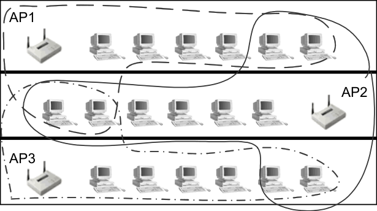

3rd Floor

2nd Floor

1st Floor

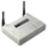

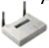

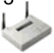

Provide screenshots of the site monitor software and digital pictures outlining locations of
access points and bridges.

As mentioned earlier in this section, the site survey report could take days or weeks, and
may require return visits to the site. The site survey report should be a professional
technical documentation of your investigation and findings of the client’s site, which can
serve as a technical reference for the wireless LAN design and future network
implementations.

**Hardware placement & configuration information**

The report should answer the following questions about hardware placement and
configuration:

  - _What is the name of each manageable device?_

  - _Where and how should each access point and bridge be placed or mounted for_
_maximum effectiveness?_

  - _What channels should each access point be on?_

CWNA Study Guide © Copyright 2002 Planet3 Wireless, Inc.

--- end of page=357 ---

Chapter 11 – Site Survey Fundamentals **330**

  - _How much output power should each access point deliver?_

A list of facts about each access point to be installed (or already installed) should be
included in the RF site survey report. This list should include at least the following:

  - Name of the device

  - Location within facility

  - Antenna type to be used

  - Power output settings

  - Connectors & cables to be used

  - Antenna mount type to be used

  - How power should be provided to unit

  - How data should be provided to unit

  - Picture of location where unit is to be installed

**Additional Reporting**

The site survey report should be focused on informing the customer of the best coverage
patterns available in the facility. Additional pieces of information that belong in the site
survey report are interference findings, equipment types needed, and equipment
placement suggestions.

A site survey report should not be turned into a consulting report for implementation and
security. A wireless consulting firm should be able to come in, read the site survey
report, and then be able to provide effective information on equipment purchasing
(including vendor selection) and security solutions. The site survey report should be kept
separate from implementation and security reports, which can be equally as involved as
the site survey, and require as much time to complete. Often, the company that does
quality work during the site survey is asked to return to perform the equipment
recommendations, installation, security audits, and subsequent security solution
implementations.

Consultants may charge additional fees for a report that includes information about one
or more of the following:

  - Which manufacturers make appropriate products for this environment and what
those particular products are.

  - Which security solution makes sense for this environment and how to implement
it.

  - Detailed diagrams and drawings on how to implement the suggested solutions.

  - Cost and time involved to implement the suggested solutions.

  - Details of how each wireless LAN requirement listed in the RF Site Survey
Report will be met (item-by-item) in the suggested solution.

CWNA Study Guide © Copyright 2002 Planet3 Wireless, Inc.

--- end of page=358 ---

**331** Chapter 11 – Site Survey Fundamentals

Recommendations for equipment vendors are very important, and require:

      - Knowing what each vendor specializes in, their strengths and weaknesses

      - What level of support is available from a vendor and how easy it is to get
replacement hardware

      - The costs and part numbers of the appropriate hardware

When a customer reads the site survey report, they may determine that another vendor
offers better or cheaper hardware that can provide the same functionality. Part of the
recommendation should be to include justification for the decision in choosing a
particular vendor’s hardware. In creating a report for the purpose of equipment
recommendations and installation, create a detailed equipment purchase list (bill of
materials) that covers everything needed to implement a solution that meets the
customer's requirements as stated in the site survey. If you recommend three solutions
(inexpensive, moderate, and full-featured, for example), three complete equipment lists
should be provided. Do not omit anything, because it is better to overestimate the
potential cost of a solution, and then provide ways to come in under budget. An
important note here is that some customers have contractual obligations to buy a
particular brand of wireless LAN hardware. In order to identify this situation, the site
surveyor may choose to ask this question as part of the network manager's interview. If
not, then this fact should be disclosed during the implementation consultation.

CWNA Study Guide © Copyright 2002 Planet3 Wireless, Inc.

--- end of page=359 ---

Chapter 11 – Site Survey Fundamentals **332**

##### Key Terms

Before taking the exam, you should be familiar with the following terms:

_data boundary_

_data rate_

_dead spot_

_interference source_

_link speed_

_noise floor_

_RF coverage_

_signal-to-noise ratio_

_signal strength_

_site survey utility software_

_sniffer_

_spectrum analyzer_

CWNA Study Guide © Copyright 2002 Planet3 Wireless, Inc.

--- end of page=360 ---

**333** Chapter 11 – Site Survey Fundamentals

##### Review Questions

1. Which of the following business requirements should be determined prior to
beginning the site survey? Choose all that apply.

A. Where the RF coverage areas are

B. Where users will need to roam

C. Whether or not users will run applications that require Quality of Service

D. Where dead spots are

2. When determining the contours of RF coverage, site survey utilities should be used
to measure which of the following? Choose all that apply.

A. Obstructions in the Fresnel Zone

B. Signal strength

C. Signal-to-noise ratio

D. Link speed

3. Which one of the following is true of an RF site survey?

A. A site survey is not necessary in order to perform a successful wireless LAN
implementation

B. A site survey should be performed every 6 months on all wireless LAN
installations

C. A site survey is the most important step in implementing a wireless LAN

D. Anyone who is familiar with the facility can perform a site survey

4. Which of the following would a site surveyor need to have before performing an
indoor site survey? Choose all that apply.

A. Blueprints or floor plans of the facility

B. Permission to access the roof and wiring closets

C. A thorough working knowledge of the existing network infrastructure

D. Advance notice of all future construction within 5 miles of the facility

CWNA Study Guide © Copyright 2002 Planet3 Wireless, Inc.

--- end of page=361 ---

Chapter 11 – Site Survey Fundamentals **334**

5. Why is a site survey a requirement for installing a successful wireless LAN?

A. To determine if a wireless LAN is an appropriate solution for the problem or
need

B. Because RF equipment will not operate in accordance with the manufacturer's
specifications without a site survey

C. To ensure that the client's network managers are experts at RF technology

D. To determine the range, coverage, and potential RF interference sources

6. Which one of the following should be done prior to conducting a site survey?

A. Interviewing network administrators

B. Preparing a thorough site survey report

C. Installing temporary access points

D. Walking the entire facility with a spectrum analyzer

7. Which one of the following measurements is important to record during a site
survey?

A. The signal-to-noise ratio in a particular area

B. The average temperature of the facility

C. The average population of people in a given workspace

D. The humidity in a particular area

8. A site survey can be executed using a PDA with a wireless connection as a client.

A. True

B. False

9. How long should an average site survey take to perform?

A. Exactly one 8-hour day

B. One to five hours

C. It depends on the facility and client needs

D. One week

CWNA Study Guide © Copyright 2002 Planet3 Wireless, Inc.

--- end of page=362 ---

**335** Chapter 11 – Site Survey Fundamentals

10. Which of the following are pieces of information pertaining to the RF link that are
gathered during a site survey? Choose all that apply.

A. Range and coverage pattern

B. Data rate and throughput

C. Interference sources

D. Wired network connectivity and power requirements

11. Which of the following items should NOT be recorded as part of an RF site survey?
Choose all that apply.

A. A/C power outlets and grounding points

B. Wired network connectivity points

C. Names of all wireless LAN users

D. Potential RF obstructions such as fire doors, metal blinds, metal-mesh
windows, etc.

E. Potential RF sources such as microwave ovens, elevator motors, baby monitors,
2.4 GHz cordless phones, etc.

12. For outdoor RF site surveys, which of the following items should be recorded?
Choose all that apply.

A. Trees, buildings, lakes, or other obstructions between link sites

B. Dimensions of all rooftops on which antennas will be placed

C. Visual line of sight

D. Outdoor power receptacles and weatherproof enclosure availability

E. Link distance (note if > 7 miles to calculate compensation for Earth bulge)

13. What items should be included in an RF Site Survey Report?

A. Ranges and RF coverage pattern of particular areas

B. Data storage details

C. Interference sources

D. Names and locations of all wireless LAN users

14. The Signal-to-Noise Ratio (SNR) is measured in:

A. dBi

B. dBm

C. dB

D. Mbps

CWNA Study Guide © Copyright 2002 Planet3 Wireless, Inc.

--- end of page=363 ---

Chapter 11 – Site Survey Fundamentals **336**

15. Which two of the following should be tested during an RF site survey?

A. RF coverage with microwave oven(s) on

B. RF coverage with microwave oven(s) off

C. RF coverage with 2.4 GHz phone(s) off

D. RF coverage with 2.4 GHz phone(s) on

16. Data rate boundaries are defined as which one of the following?

A. The line after which there is no longer any data passed to the wireless LAN
infrastructure

B. The boundary between 2 separate wireless LAN RF coverage cells

C. The point at which the data rate is decreased or increased to the next acceptable
higher or lower rate in order to maintain the fastest viable RF link

D. Square areas of coverage denoted on the facility floor plan within which access
points are installed

17. Signal strength and the noise floor are measured in:

A. dBm

B. dBi

C. Mbps

D. dB

18. To perform a site survey, you will need to record which of the following
measurements? Choose all that apply.

A. Microwave energy level on all floors with microwave ovens

B. Signal strength

C. Noise floor

D. Signal-to-noise ratio

E. Noise strength ratio

19. Which of the following are possible RF sources (that would interfere with a wireless
LAN) to look for when performing a site survey in a hospital? Choose all that
apply.

A. Microwave ovens

B. Elevator motors

C. Baby monitors

D. 2.4 GHz cordless phones

E. Walkie-talkies

CWNA Study Guide © Copyright 2002 Planet3 Wireless, Inc.

--- end of page=364 ---

**337** Chapter 11 – Site Survey Fundamentals

20. Which of the following would be NOT considered potential RF obstructions?
Choose all that apply.

A. Fire doors

B. A large crowd of users

C. Metal blinds

D. Metal-mesh windows

E. Concrete walls

F. Metal-framed office cubicles

CWNA Study Guide © Copyright 2002 Planet3 Wireless, Inc.

--- end of page=365 ---

Chapter 11 – Site Survey Fundamentals **338**

##### Answers to Review Questions

1. B, C. Determining what types of applications will be used over the wireless LAN
and what those applications require from the wireless LAN infrastructure is critical
in making sure the wireless LAN can meet the intended business need. Roaming
requirements are no different, because where the users will use the applications can
be equally as important as what applications they are using. Determining dead spots
and RF coverage is required for every RF site survey.

2. B, C, D. Link speed, SNR, signal strength, and the level of RF noise are all useful
pieces of information in deciding on the viability of an RF link, how to design the
wireless network, meeting business requirements, and network security. There are
no software utilities on the market as of this writing that can measure Fresnel Zone
interference.

3. C. An RF site survey is the most important step to performing a successful wireless
LAN implementation. Nobody can force an organization to do a site survey, but the
results of implementing a wireless LAN without first performing a thorough site
survey first can be costly in terms of both time and money.

4. A, B. It is not necessary to be intimate with a customer's wired network topology
although a basic understanding might be beneficial. Having access to wiring closets
and the roof and having current copies of building floor plans or blueprints is
essential to performing the site survey in an efficient manner. The alternative to
having this information is having to find wiring closets, guess locations of RF
barriers, and create a floor plan on grid paper or in a software application.

5. D. Although part of a site survey is gathering information such as business
requirements for the wireless LAN, it's important to note that these pieces of
information are helpful, but not absolutely required in order to perform the site
survey. In its most basic form, a site survey is simply a determination of RF
coverage areas and dead spots and finding interference sources.

6. A. All of the functions listed are part of the site survey itself other than interviewing
the network manager or administrator. This function can be done before the site
survey as a preparatory step that saves time on site.

7. A. The signal-to-noise ratio in a given area is important to document for the
purposes of determining link viability and suitability for certain user applications.
The wireless network designer can use this data to assure business requirements are
met when the wireless LAN is used.

8. A. Recent advancements in client software for PDAs make it possible to do a
thorough site survey using a PDA instead of a laptop. PDAs remove the burden of
carrying a heavy laptop, and PDA batteries tend to last significantly longer than
those in laptop computers, allowing a site surveyor to spend more consecutive hours
surveying.

9. C. Site surveys can range from an hour to many days depending on client needs and
the facility size, shape, and construction. For example, a multi-floor, multi-tenant
building would take much longer than a single floor, small office environment.

CWNA Study Guide © Copyright 2002 Planet3 Wireless, Inc.

--- end of page=366 ---

**339** Chapter 11 – Site Survey Fundamentals

10. A, B, C. Data rate, throughput, signal strength, SNR, range from access point, the
coverage pattern generated by the access point, and RF interference sources are all
pieces of information gathered during a site survey that relate directly to the RF
links between clients and access points.

11. C. Names of wireless LAN users are not useful pieces of information during a site
survey. Perhaps during the implementation of a wireless LAN security solution,
getting the names of users for the purposes of entering them into a database would
be useful, but keep in mind that a site survey consists mostly of identifying RF
coverage and dead spots for particular areas.

12. A, D, E. Obstructions and link distance are important to record during an outdoor
site survey because both figure into link budget calculations. Earth bulge, Path
Loss, Fresnel Zone encroachment, transmit power, and many other factors play into
calculating how much power the receiving antenna will receive. Knowing where
power receptacles and weatherproof enclosures are located, if they are available,
helps in knowing whether they will have to be installed later or if equipment will
have to be located indoors rather than outdoors.

13. A, C. Interference sources, distances from the access point where RF signals remain
viable, and RF coverage pattern, including "dead spots", should all be a part of the
RF site survey. There are many other items that should be included as well, such as
locations of infrastructure devices, digital pictures, suggested output power and
antenna selection information for access points and bridges, and channel selection
information on a per-access point basis.

14. C. SNR is measured in decibels (dB). Signal-to-noise ratio is a relative
measurement of the noise floor in relation to the peak of the RF data signal, which is
used to determine an RF link's viability (stability and usability).

15. A, D. Always plan for the "worst case" scenario when site surveying. This method
of preparatory troubleshooting is recommended for scenarios that have RF
interference sources such as 2.4 GHz spread spectrum phones, baby monitors,
microwave ovens, and others. Another example of this approach is to do outdoor
site surveys planning for the trees between two sites to be full of leaves that are
holding water. In this outdoor scenario, you would increase the height of the
antennas on each side of the link planning for extra room in the Fresnel Zone.

16. C. Data rate boundaries are imaginary lines where the data rate changes speeds
(either faster or slower) in order to maintain the fastest possible viable RF link
between a client and an access point. Dynamic Rate Shifting (DRS) is specified by
the 802.11, 802.11b, and 802.11a standards for performing this task automatically.

17. A. The RF noise floor and RF signal strength are quantifiable measurements that are
measured in either milliwatts or dBm (decibels referenced to milliwatts). dB and
dBi are relative units of measure used to measure changes in power, but not absolute
amounts of power.

18. B, C, D. Signal strength, Signal-to-Noise Ratio (SNR), and the RF noise floor level
are all valuable measurements when doing a site survey. In order for an RF design
engineer to have enough information to make informed design decisions, the
engineer must have a significant amount of information relating to RF levels
throughout a facility.

CWNA Study Guide © Copyright 2002 Planet3 Wireless, Inc.

--- end of page=367 ---

Chapter 11 – Site Survey Fundamentals **340**

19. A, B, C. Baby monitors are used in the nursery near the delivery section.
Microwave ovens are used in staff break rooms. 2.4 GHz cordless phones are
generally not permitted in a hospital because of the interference with the wireless
LAN installations. Cell phones are not normally permitted in hospitals at all. Staff
throughout a hospital uses walkie-talkies; however, these units almost never use the
2.4 GHz ISM band and interfere with wireless LANs. As hard as it is to believe,
elevator motors may emit RF interference across many frequency ranges including
the 2.4 GHz ISM band.

20. B. People are not generally RF obstructions; however, all of the rest of these items,
especially those that are metal or metal-related, are reflective of RF signals and can
cause multipath or signal blockage.

CWNA Study Guide © Copyright 2002 Planet3 Wireless, Inc.

--- end of page=368 ---
