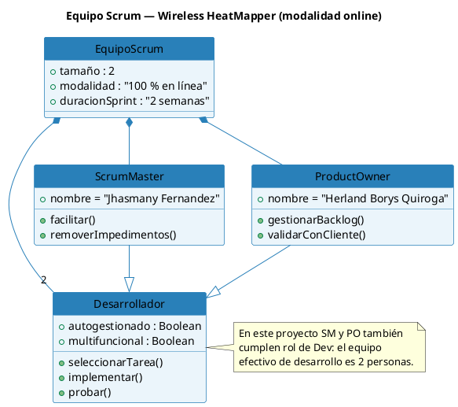
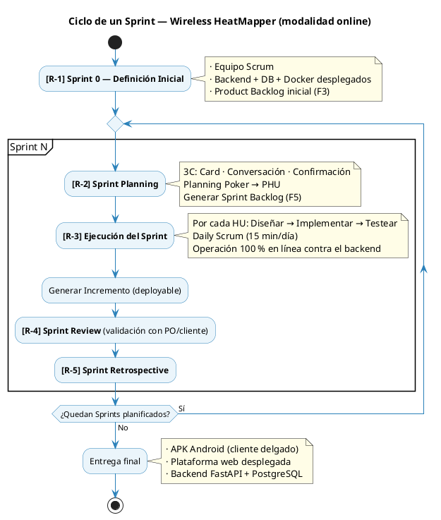

# 01 — Marco Scrum (modalidad online)

**Referencia:** Enfoque Scrum v3.2 — Secciones I y II
**Aplica a:** Wireless HeatMapper, modalidad 100 % en línea

---

## 1. Marco de trabajo

Scrum es un **marco de trabajo**, no una metodología de desarrollo: define eventos, roles y artefactos, pero no prescribe cómo se hace ingeniería. Para este proyecto se adopta la integración de Scrum con las cuatro actividades obligatorias de ingeniería de software:

| #   | Actividad      | Cuándo ocurre                | Responsable principal                  |
| --- | -------------- | ---------------------------- | -------------------------------------- |
| 1   | Análisis       | Sprint Planning (R-2)        | Product Owner + equipo                 |
| 2   | Diseño         | Ejecución del Sprint (R-3)   | Equipo de desarrollo                   |
| 3   | Implementación | Ejecución del Sprint (R-3)   | Equipo de desarrollo                   |
| 4   | Pruebas        | Ejecución + Review (R-3/R-4) | Dev (1er filtro) · QA (2do) · PO (3er) |

El proceso es **incremental** (cada Sprint añade valor sobre el anterior) e **iterativo** (cada Sprint repite las cuatro actividades).

---

## 2. Equipo Scrum

| Rol                     | Persona                            | Responsabilidades clave                                                 |
| ----------------------- | ---------------------------------- | ----------------------------------------------------------------------- |
| **Scrum Master / Dev**  | Jhasmany Jhunnior Fernandez Ortega | Facilitación de ceremonias, eliminación de impedimentos, dev backend/IA |
| **Product Owner / Dev** | Herland Borys Quiroga Flores       | Gestión del Product Backlog, validación con cliente, dev móvil/web      |
| **Cliente real**        | Bulldog Tech.                      | Aceptación funcional de los incrementos                                 |
| **Docente tutor**       | Ing. Rolando Martínez              | Supervisión académica y revisión de avances                             |

Ambos miembros del equipo son **multifuncionales** (backend, móvil, web, IA) y **autogestionados** (toman tareas del Sprint Backlog sin asignación dirigida).

---

## 3. Eventos del proceso (R-1 a R-5)

| Evento                                | Cuándo                | Duración    | Resultado                                       |
| ------------------------------------- | --------------------- | ----------- | ----------------------------------------------- |
| **R-1 Definición Inicial (Sprint 0)** | Antes del Sprint 1    | 1 semana    | Modelos base + Product Backlog (F3) + infra     |
| **R-2 Sprint Planning**               | Inicio de cada Sprint | ≤ 4 horas   | Sprint Backlog (F5) + objetivo del Sprint       |
| **R-3 Ejecución del Sprint**          | Durante el Sprint     | 2–3 semanas | Incremento operativo (deployable)               |
| **R-3.1 Daily Scrum**                 | Cada día del Sprint   | 15 minutos  | Sincronización + identificación de impedimentos |
| **R-4 Sprint Review**                 | Último día del Sprint | ≤ 2 horas   | Demo + Product Backlog actualizado              |
| **R-5 Sprint Retrospective**          | Después del Review    | ≤ 1.5 horas | Plan de mejora para el siguiente Sprint         |

---

## 4. Las 3 C de las Historias de Usuario

Aplicadas durante el Sprint Planning (R-2):

1. **Card (Tarjeta):** la HU se documenta en formato F4 con los campos: rol, acción, beneficio, descripción, reglas de negocio y criterios de aceptación.
2. **Conversación:** equipo y PO discuten cada HU para alcanzar comprensión común. Aquí ocurre el **análisis real**.
3. **Confirmación:** el PO confirma que el equipo entendió la HU. En este proyecto se hace mediante **prototipos navegables** y **escenarios Gherkin** (Dado / Cuando / Entonces).

---

## 5. Definition of Done (DoD)

Una Historia de Usuario está **terminada** cuando:

| Criterio                               | Verificación                                                            |
| -------------------------------------- | ----------------------------------------------------------------------- |
| ✅ Código implementado en backend      | Endpoints REST documentados con OpenAPI/Swagger                         |
| ✅ Código implementado en cliente      | Móvil (Flutter) y/o web (React) consumiendo los endpoints               |
| ✅ Migraciones Alembic aplicadas       | Esquema PostgreSQL versionado y reversible                              |
| ✅ Pruebas unitarias                   | Cobertura ≥ 70 % en módulos nuevos del backend; widget tests en Flutter |
| ✅ Pruebas de integración              | Tests de endpoints contra una BD efímera (pytest + httpx)               |
| ✅ Criterios de aceptación validados   | El PO ejecuta cada CA contra el incremento desplegado                   |
| ✅ Code review aprobado                | Pull Request revisado por el otro miembro del equipo                    |
| ✅ Mergeado a `main`                   | Squash-merge desde rama `feature/PB-XX-...`                             |
| ✅ Despliegue automático               | Pipeline GitHub Actions construye imagen Docker y despliega             |
| ✅ Documentación técnica actualizada   | README, OpenAPI, diagramas StarUML afectados                            |
| ✅ Sin almacenamiento local de dominio | El cliente móvil no persiste entidades de dominio entre sesiones (RP8)  |

---

## 6. Tres filtros de pruebas

| Filtro     | Responsable   | Foco                                                                                                   |
| ---------- | ------------- | ------------------------------------------------------------------------------------------------------ |
| 1er filtro | Desarrollador | **Pruebas unitarias.** El código entregado por el Dev ya debe estar probado por él mismo.              |
| 2do filtro | QA (rotativo) | **Pruebas de calidad.** Funcionalidad, latencia (p95), seguridad (OWASP Top 10), validación de inputs. |
| 3er filtro | Product Owner | **Pruebas de aceptación.** Cumplimiento de los criterios de aceptación de cada HU.                     |

En este equipo, el rol de QA rota por Sprint entre los dos miembros para evitar que el Dev pruebe únicamente su propio código.

---

## 7. Estilo arquitectónico y decisiones técnicas

Decisiones tomadas en el Sprint 0 y consistentes a lo largo de todos los sprints:

| Decisión                      | Valor                                                                     |
| ----------------------------- | ------------------------------------------------------------------------- |
| Estilo arquitectónico backend | Capas (api → services → repositories → models) sobre FastAPI              |
| Persistencia                  | PostgreSQL 15 + SQLAlchemy ORM + Alembic (migraciones)                    |
| Cliente móvil                 | Flutter / Dart con BLoC/Cubit; **sin sqflite** (cliente delgado en línea) |
| Cliente web                   | React + TypeScript + Vite + React Router + TanStack Query                 |
| Comunicación                  | HTTPS REST con tipos generados desde el OpenAPI del backend               |
| Autenticación                 | OAuth2 password flow + JWT (access 15 min + refresh 7 días) + bcrypt      |
| Contenedorización             | Docker Compose con servicios `db`, `backend`, `web`, `nginx`              |
| Reverse proxy                 | Nginx (terminación TLS, ruteo `/api → backend`, `/ → web`)                |
| CI/CD                         | GitHub Actions: lint → tests → build → push imagen → deploy               |
| Modelado UML                  | StarUML (UML 2.5+) + PlantUML embebido                                    |
| Branching                     | Trunk-based con ramas cortas `feature/PB-XX-slug`                         |

---

## 8. Modalidad 100 % en línea — restricciones operativas

Estas restricciones son **transversales a todos los sprints** y deben respetarse en cualquier diseño o implementación:

1. **Sin estado de dominio en el dispositivo móvil.** Solo se persisten en almacenamiento seguro: el token JWT y preferencias de UI no críticas.
2. **Cada operación es un request HTTPS contra el backend.** No existen colas locales, no hay reintento diferido de mediciones perdidas más allá de un buffer en memoria con backoff exponencial acotado por sesión.
3. **Indicador visible de conectividad.** La app móvil debe mostrar permanentemente el estado de conexión con el backend (verde / amarillo / rojo) y pausar la captura ante caída.
4. **Latencias objetivo (p95):**
   - Envío de un lote de scan WiFi ≤ 1 segundo
   - Solicitud de heatmap actualizado ≤ 3 segundos
   - Login ≤ 2 segundos
5. **Sin código de sincronización ni reconciliación.** Las HU del backlog que asuman estado dual (local + servidor) son rechazadas en refinamiento.
