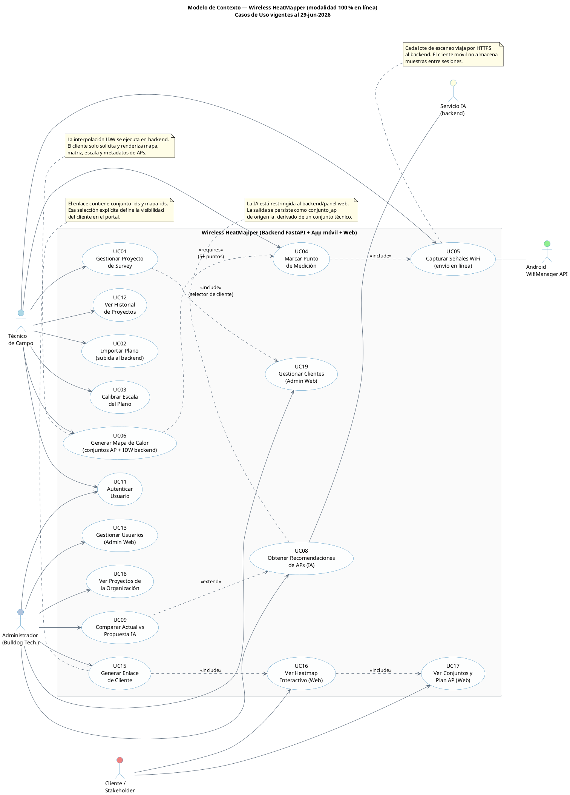

# 02 — Modelo de Contexto (modalidad online)

**Referencia:** PAPS Online §6, §7 · Enfoque Scrum v3.2 — modelos obligatorios por Sprint  
**Notación:** UML 2.5 (Casos de Uso)  
**Estado:** actualizado contra implementación real al 29-jun-2026

---

## 1. Propósito

El **modelo de contexto** delimita el alcance funcional vigente del sistema mostrando qué hace y con quién interactúa. En la modalidad 100 % en línea, todos los casos de uso del cliente móvil y de la web son mediados por el backend FastAPI; no existe ningún caso de uso que opere sobre estado local persistente.

Este modelo refleja el refinamiento aprobado en [18-reglas-gobernanza-conjuntos-ap-heatmaps.md](18-reglas-gobernanza-conjuntos-ap-heatmaps.md): no hay diagnóstico persistido, no hay exportación PDF desde el sistema y la propuesta IA se modela como conjuntos AP derivados.

## 2. Actores

| Id  | Actor                         | Tipo            | Descripción                                                                                                 |
| --- | ----------------------------- | --------------- | ----------------------------------------------------------------------------------------------------------- |
| A1  | Técnico de campo              | Humano          | Usuario principal de la app móvil. Realiza relevamiento WiFi, planos, capturas, conjuntos AP y heatmaps.    |
| A2  | Administrador (Bulldog Tech.) | Humano          | Usuario del panel web. Gestiona usuarios, clientes, proyectos, propuestas IA y enlaces cliente.             |
| A3  | Cliente / Stakeholder         | Humano          | Accede al portal web mediante enlace único y consulta solo el contenido publicado explícitamente.            |
| A4  | Android WifiManager API       | Sistema externo | Provee al móvil resultados de escaneo: RSSI, SSID, BSSID, canal y frecuencia.                               |
| A5  | Servicio IA (interno backend) | Componente      | Motor backend que genera conjuntos AP derivados y heatmaps proyectados desde mediciones y restricciones RF. |

> No se considera "almacenamiento local" como actor: en esta modalidad no existe persistencia local de dominio.

## 3. Diagrama de casos de uso

> **UC eliminados:** UC07 (diagnóstico persistido), UC10 (reporte PDF) y UC14 (sincronización offline) no forman parte del alcance vigente. Sus entidades y endpoints fueron podados de la implementación.

## 4. Trazabilidad UC ↔ RP

| Caso de uso                                     | Requerimiento Principal | Sprint | Estado         |
| ----------------------------------------------- | ----------------------- | ------ | -------------- |
| UC01 Gestionar proyecto                         | RP8                     | 1      | Implementado   |
| UC02 Importar plano                             | RP2                     | 2      | Implementado   |
| UC03 Calibrar escala                            | RP2                     | 2      | Implementado   |
| UC04 Marcar punto                               | RP2                     | 3      | Implementado   |
| UC05 Capturar señales WiFi                      | RP1                     | 3      | Implementado   |
| UC06 Generar heatmap                            | RP3                     | 4      | Implementado   |
| UC08 Recomendaciones IA                         | RP5                     | 5      | Implementado   |
| UC09 Comparar actual vs propuesta IA            | RP5                     | 5      | Implementado   |
| UC11 Autenticar                                 | RP8                     | 1      | Implementado   |
| UC12 Historial de proyectos                     | RP8                     | 1      | Implementado   |
| UC13 Gestionar usuarios (admin)                 | RP7                     | 1      | Implementado   |
| UC15 Generar enlace de cliente                  | RP9                     | 6      | Implementado   |
| UC16 Ver heatmap web (cliente)                  | RP9                     | 6      | Implementado   |
| UC17 Ver conjuntos y plan AP (cliente)          | RP9                     | 6      | Implementado   |
| UC18 Ver proyectos de la organización           | RP7                     | 1      | Implementado   |
| UC19 Gestionar clientes (admin)                 | RP7                     | 1      | Implementado   |
| UC07 Analizar cobertura persistida              | RP4                     | —      | Eliminado      |
| UC10 Exportar reporte PDF                       | RP6                     | —      | Eliminado      |
| UC14 Sincronizar proyecto offline con servidor  | —                       | —      | Eliminado      |

> **Mapeo RP autoritativo:** [PAPS Online §7](../Wireless%20Heatmapper%20-%20PAPS%20-%20Modalidad%20Online.md). RP4 y RP6 se conservan como requerimientos históricos del PAPS, pero quedan sin HU activa por refinamiento de alcance.
