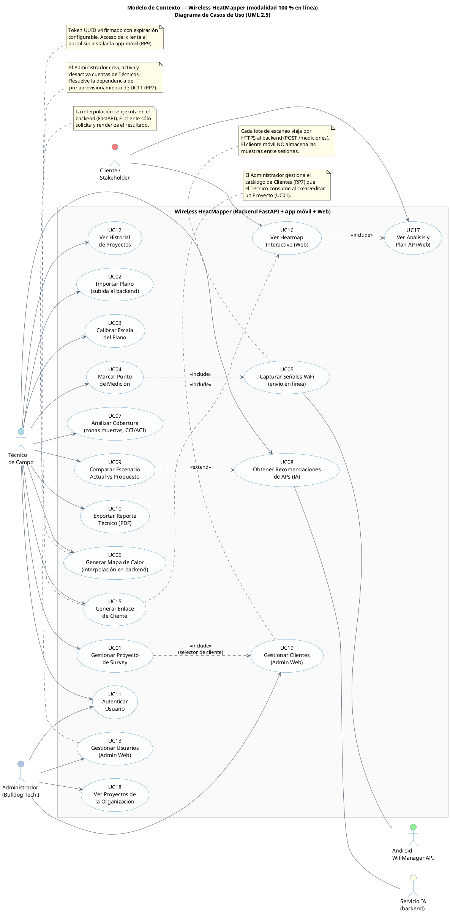

# 02 — Modelo de Contexto (modalidad online)

**Referencia:** PAPS Online §6, §7 · Enfoque Scrum v3.2 — modelos obligatorios por Sprint
**Notación:** UML 2.5 (Casos de Uso)

---

## 1. Propósito

El **modelo de contexto** delimita el alcance funcional del sistema mostrando qué hace (casos de uso) y con quién interactúa (actores). En la modalidad 100 % en línea, todos los casos de uso del cliente móvil y de la web son **mediados por el backend FastAPI**: no existe ningún caso de uso que opere sobre estado local persistente.

## 2. Actores

| Id  | Actor                         | Tipo            | Descripción                                                                          |
| --- | ----------------------------- | --------------- | ------------------------------------------------------------------------------------ |
| A1  | Técnico de campo              | Humano          | Usuario principal de la app móvil. Realiza el relevamiento WiFi en sitio.            |
| A2  | Administrador (Bulldog Tech.) | Humano          | Usuario del panel web. Gestiona técnicos y supervisa proyectos de la organización.   |
| A3  | Cliente / Stakeholder         | Humano          | Recibe el reporte y accede al portal web mediante enlace único.                      |
| A4  | Android WifiManager API       | Sistema externo | Provee al móvil el resultado de los escaneos (RSSI, SSID, BSSID, canal, frecuencia). |
| A5  | Servicio IA (interno backend) | Componente      | Modelo de ML hospedado en el backend; expuesto vía REST.                             |

> No se considera "almacenamiento local" como actor: en esta modalidad no existe.

## 3. Diagrama de casos de uso

> **UC14 (sincronizar proyecto al servidor) eliminado:** en la modalidad online la persistencia es centralizada desde el primer request, por lo que no existe operación de sincronización app↔servidor.

## 4. Trazabilidad UC ↔ RP

| Caso de uso                           | Requerimiento Principal | Sprint |
| ------------------------------------- | ----------------------- | ------ |
| UC01 Gestionar proyecto               | RP8                     | 1      |
| UC02 Importar plano                   | RP2                     | 2      |
| UC03 Calibrar escala                  | RP2                     | 2      |
| UC04 Marcar punto                     | RP2                     | 3      |
| UC05 Capturar señales WiFi            | RP1                     | 3      |
| UC06 Generar heatmap                  | RP3                     | 4      |
| UC07 Analizar cobertura               | RP4                     | 4      |
| UC08 Recomendaciones IA               | RP5                     | 5      |
| UC09 Comparar escenarios              | RP5                     | 5      |
| UC10 Exportar reporte                 | RP6                     | 5      |
| UC11 Autenticar                       | RP8                     | 1      |
| UC12 Historial de proyectos           | RP8                     | 1      |
| UC13 Gestionar usuarios (admin)       | RP7                     | 1      |
| UC15 Generar enlace de cliente        | RP9                     | 6      |
| UC16 Ver heatmap web (cliente)        | RP9                     | 6      |
| UC17 Ver análisis y plan AP (cliente) | RP9                     | 6      |
| UC18 Ver proyectos de la organización | RP7                     | 1      |
| UC19 Gestionar clientes (admin)       | RP7                     | 1      |

> **Mapeo RP autoritativo:** [PAPS Online §7](../Wireless%20Heatmapper%20-%20PAPS%20-%20Modalidad%20Online.md). UC14 eliminado por modalidad online.
