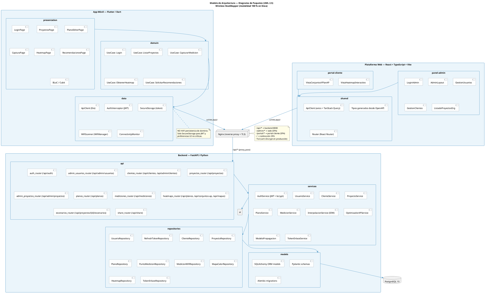
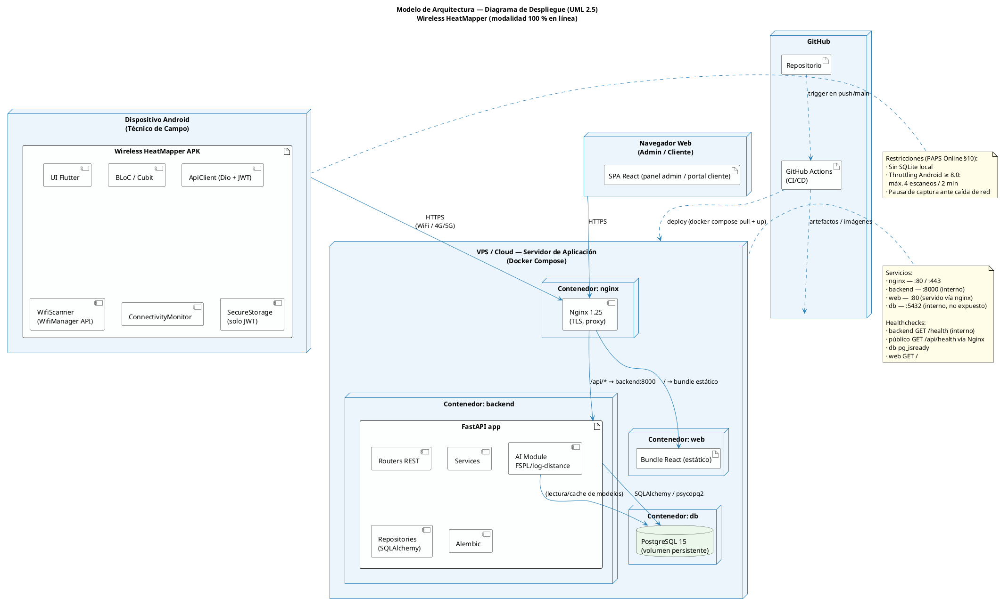

# 03 — Modelo de Arquitectura (modalidad online)

**Notación:** UML 2.5 — Diagramas de Paquetes y de Despliegue
**Referencia:** PAPS Online §6, §11 · `docker-infra.instructions.md`

---

## 1. Visión general

La arquitectura del Wireless HeatMapper en modalidad 100 % en línea se compone de **tres aplicaciones cliente** y **un backend único** que actúa como fuente de verdad:

- **App móvil Android** (Flutter / Dart) — cliente delgado para el técnico de campo.
- **Plataforma web** (React + TypeScript) — panel de administración + portal de cliente.
- **Backend FastAPI** — REST + IA + autenticación + base de datos PostgreSQL.

Todo el tráfico atraviesa **Nginx** como reverse proxy con terminación TLS.

> **Convención de prefijos REST:** los routers FastAPI declaran rutas sin el prefijo `/api` (p. ej. `/auth/login`, `/admin/usuarios`, `/clientes`). Nginx anteceden el prefijo `/api` mediante `proxy_pass http://backend:8000/` (sin re-prefix), de modo que los clientes consumen `/api/auth/login`, `/api/admin/usuarios`, `/api/clientes`, etc. Los nombres mostrados en el diagrama incluyen el prefijo público para reflejar la URL final que ven los clientes.

> **Estado de implementación al 29-jun-2026:** están operativos los routers `auth`, `admin/usuarios`, `clientes`, `admin/proyectos`, `proyectos`, `notificaciones`, `planos`, `mediciones`, `heatmaps`, `escenarios` y `share`; también están operativos el panel admin, la app móvil y el portal cliente.

---

## 2. Diagrama de paquetes



---

## 3. Diagrama de despliegue



---

## 4. Estilo arquitectónico del backend (capas)

```
┌─────────────────────────────────────────────┐
│  api/        Routers FastAPI + dependencies │ ← entrada HTTP
├─────────────────────────────────────────────┤
│  services/   Lógica de negocio              │ ← orquestación
├─────────────────────────────────────────────┤
│  ai/         Modelo RF + optimizador        │ ← inferencia
├─────────────────────────────────────────────┤
│  repositories/  Acceso a BD (SQLAlchemy)    │ ← persistencia
├─────────────────────────────────────────────┤
│  models/     ORM + schemas Pydantic         │ ← contratos
└─────────────────────────────────────────────┘
                       ↓
                  PostgreSQL 15
```

Reglas:

- Las dependencias siempre apuntan **hacia abajo**.
- Los routers no acceden directamente a `repositories`; pasan por `services`.
- Los `services` reciben sesión SQLAlchemy por inyección (`Depends(get_db)`).
- Los modelos Pydantic (`schemas/`) son el contrato público; los ORM (`models/`) son internos.

---

## 5. Comunicación cliente-servidor

| Cliente            | Endpoint base               | Autenticación        | Formato                   |
| ------------------ | --------------------------- | -------------------- | ------------------------- |
| App móvil          | `https://<host>/api/`       | Bearer JWT (técnico) | JSON + multipart (planos) |
| Panel admin web    | `https://<host>/api/admin/` | Bearer JWT (admin)   | JSON                      |
| Portal cliente web | `https://<host>/api/share/` | Token de enlace UUID | JSON (lectura solamente)  |

El backend publica **OpenAPI** en `/api/openapi.json`. La web puede generar tipos TS con `openapi-typescript`; la app móvil mantiene datasources Dart escritos manualmente sobre Dio.

---

## 6. Despliegue mediante Docker Compose

Servicios definidos e implementados en `docker-compose.yml`:

| Servicio  | Imagen base                      | Puerto interno | Volumen / Dependencia                      |
| --------- | -------------------------------- | -------------- | ------------------------------------------ |
| `db`      | `postgres:15-alpine`             | 5432           | `pgdata:/var/lib/postgresql/data`          |
| `backend` | Python + Uvicorn                 | 8000           | depende de `db`; healthcheck `/health`     |
| `web`     | Node build + Nginx SPA           | 80             | bundle estático servido por nginx          |
| `nginx`   | `nginx:1.27-alpine`              | 80             | depende de `backend` y `web`               |
