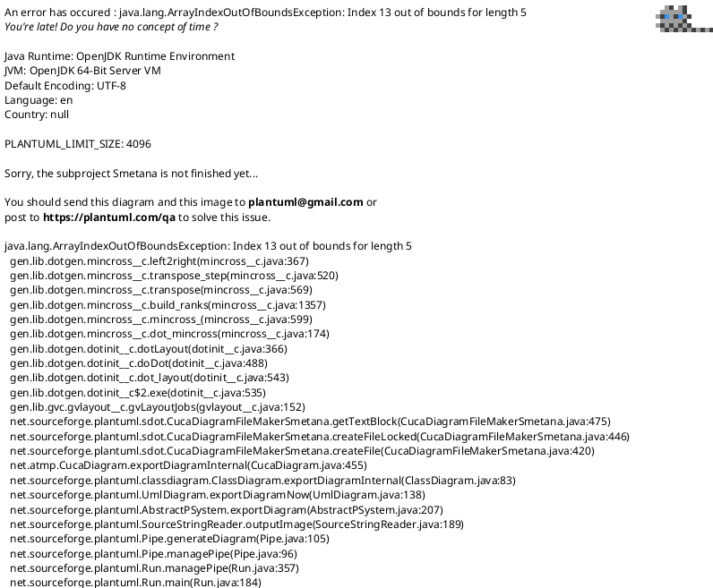

# 04 — Modelo de Datos (modalidad online)

**Notación:** UML 2.5 — Diagrama de clases conceptual + lectura relacional  
**Fuente de verdad:** PostgreSQL 15+ en backend FastAPI  
**Estado:** actualizado contra implementación real al 29-jun-2026  
**Detalle físico:** [19-modelo-base-datos-implementado.md](19-modelo-base-datos-implementado.md)

---

## 1. Principios vigentes

En la modalidad 100 % en línea todas las entidades de dominio residen en PostgreSQL. La app móvil no mantiene base de datos local de dominio ni sincronización diferida. El móvil solo conserva credenciales de sesión en `flutter_secure_storage` y preferencias no críticas.

El esquema implementado aplica los refinamientos aprobados en [18-reglas-gobernanza-conjuntos-ap-heatmaps.md](18-reglas-gobernanza-conjuntos-ap-heatmaps.md):

- La IA no crea escenarios independientes; crea `conjunto_ap` de origen `ia`.
- Las propuestas IA derivan de un único conjunto técnico por `conjunto_origen_id`.
- Las lecturas estimadas se materializan como `lectura_rssi.origen = IA_ESTIMADA`.
- Los heatmaps reales y proyectados se guardan en `mapa_calor`.
- La publicación al cliente se controla con `token_enlace_cliente.contenido`.
- No existen tablas vigentes de diagnóstico persistido, reporte PDF ni inventario RF físico.

---

## 2. Diagrama de clases conceptual

---

## 3. Lectura relacional vigente

| Área | Tablas | Responsabilidad |
| ---- | ------ | --------------- |
| Seguridad y sesión | `usuario`, `refresh_token`, `dispositivo_push` | Login, refresh token y notificaciones FCM |
| Clientes y proyectos | `cliente`, `proyecto` | Catálogo de clientes y trabajo de survey |
| Planos y captura | `plano`, `punto_medicion`, `lectura_rssi` | Planos calibrados, puntos y RSSI real/estimado |
| Conjuntos AP | `conjunto_ap`, `conjunto_ap_item` | Selecciones técnicas y propuestas IA derivadas |
| Heatmaps | `mapa_calor` | Matrices e imágenes generadas por IDW |
| Portal cliente | `token_enlace_cliente` | Publicación explícita por token |

---

## 4. Entidades eliminadas

| Entidad eliminada | Motivo |
| ----------------- | ------ |
| `analisis_cobertura` | No se persiste diagnóstico separado |
| `ap_detectado` | No se confirma inventario inferido desde diagnóstico |
| `escenario_optimizado` | La propuesta IA se modela como `conjunto_ap.origen = ia` |
| `recomendacion_ap` | Las recomendaciones viven en `conjunto_ap_item` |
| `valor_proyectado_punto` | Los valores proyectados viven en `lectura_rssi` y `mapa_calor` |
| `reporte` | No se exporta PDF desde el alcance vigente |
| `ap_fisico`, `radio_ap`, `bssid_radio` | Se eliminó inventario RF físico persistido |

---

## 5. Reglas de integridad principales

| Regla | Aplicación |
| ----- | ---------- |
| Usuario único por email | `usuario.email` único |
| Cliente único por nombre | `cliente.nombre` único |
| Plano pertenece a un proyecto | `plano.proyecto_id` con borrado en cascada |
| Punto pertenece a un plano | `punto_medicion.plano_id` con borrado en cascada |
| Lectura pertenece a un punto | `lectura_rssi.punto_id` con borrado en cascada |
| AP no repetido en conjunto | `UNIQUE(conjunto_ap_id, bssid)` |
| Conjunto IA no modifica su fuente | `conjunto_origen_id` conserva trazabilidad |
| Enlace cliente es revocable y expirable | `token_enlace_cliente.token`, `expira_en`, `revocado` |

---

## 6. Referencias técnicas

- [19 — Modelo de Base de Datos Implementado](19-modelo-base-datos-implementado.md)
- [18 — Reglas de Gobierno para Conjuntos de APs, Heatmaps e IA](18-reglas-gobernanza-conjuntos-ap-heatmaps.md)
- [21 — Auditoría de Implementación vs Plan Scrum](21-auditoria-implementacion-vs-plan.md)

