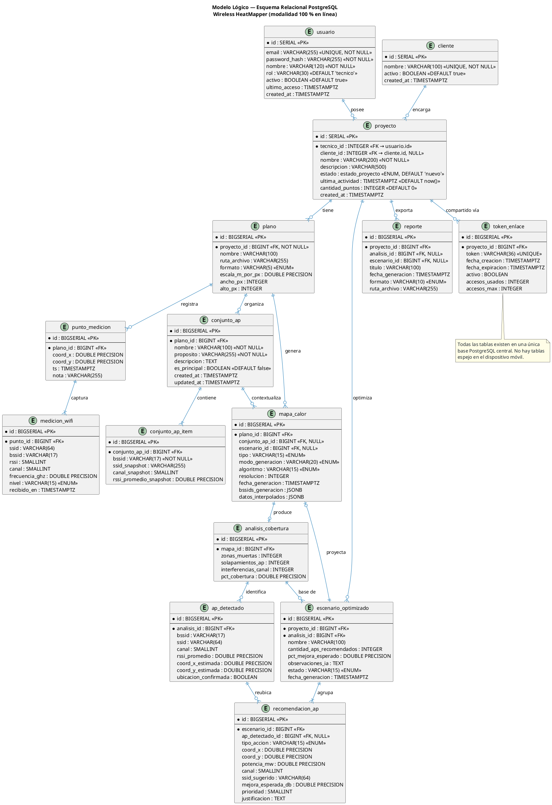
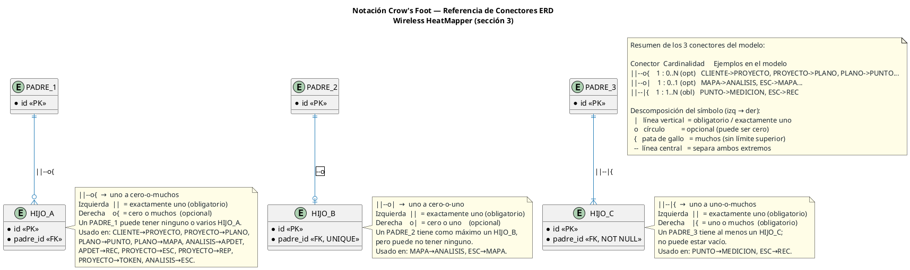

# 04 — Modelo de Datos (modalidad online)

**Notación:** UML 2.5 — Diagrama de Clases conceptual + Modelo lógico relacional
**Fuente de verdad:** PostgreSQL 15 (única, en el servidor backend)

---

## 1. Principios

> **Refinamiento aprobado de Sprint 5:** para RP5/PB-07/PB-12, la jerarquía AP físico → radio → BSSID, las instantáneas de configuración y los valores proyectados por punto definidos en el [modelo RF aprobado](17-especificacion-optimizacion-rf/02-modelo-de-dominio-y-datos.md) complementan y sustituyen la interpretación simplificada de `APDetectado`/`RecomendacionAP` presentada en este documento. Las mediciones observadas permanecen inmutables.

En la modalidad 100 % en línea **todas las entidades de dominio residen en PostgreSQL**. No existen tablas paralelas en el dispositivo móvil. El cliente móvil solo persiste en `flutter_secure_storage`:

- `access_token` (JWT, 15 min)
- `refresh_token` (JWT, 7 días)
- Preferencias de UI no críticas (tema, idioma)

El esquema relacional se versiona con **Alembic** y se aplica al levantar el contenedor `backend`.

---

## 2. Diagrama de clases conceptual

```plantuml
@startuml
!pragma layout smetana
title Modelo de Datos — Diagrama de Clases Conceptual (UML 2.5)\nWireless HeatMapper (modalidad 100 % en línea)
skinparam classBackgroundColor #EBF5FB
skinparam classBorderColor #2980B9
skinparam classHeaderBackgroundColor #2980B9
skinparam classHeaderFontColor white
skinparam arrowColor #2980B9
skinparam noteBackgroundColor #FFFDE7
hide circle

enum RolUsuario {
  ADMIN
  TECNICO
}

enum EstadoProyecto {
  NUEVO
  EN_PROGRESO
  COMPLETADO
  ARCHIVADO
}

enum FormatoPlano {
  PNG
  JPG
  PDF
}

enum NivelSenal {
  EXCELENTE
  BUENA
  ACEPTABLE
  DEBIL
  ZONA_MUERTA
}

enum AlgoritmoInterp {
  IDW
  KRIGING
  SPLINE
}

enum TipoMapa {
  REAL
  PROYECTADO
}

enum ModoGeneracionHeatmap {
  INDIVIDUAL
  SUBCONJUNTO
  CONJUNTO_COMPLETO
}

enum TipoAccionAP {
  NUEVO
  REUBICACION
  ELIMINAR
  CAMBIAR_CANAL
}

enum EstadoEscenario {
  BORRADOR
  FINALIZADO
  IMPLEMENTADO
}

enum FormatoReporte {
  PDF
  HTML
  JSON
}

class Usuario {
  +id : Long
  +email : String
  +passwordHash : String
  +nombre : String
  +rol : RolUsuario
  +activo : Boolean
  +createdAt : DateTime
  +ultimoAcceso : DateTime
}

class Cliente {
  +id : Long
  +nombre : String
  +activo : Boolean
  +createdAt : DateTime
}

class Proyecto {
  +id : Long
  +nombre : String
  +descripcion : String
  +estado : EstadoProyecto
  +ultimaActividad : DateTime
  +cantidadPuntos : Int
  +createdAt : DateTime
}

class Plano {
  +id : Long
  +rutaArchivo : String
  +formato : FormatoPlano
  +escalaMetrosPorPixel : Float
  +anchoPixeles : Int
  +altoPixeles : Int
}

class PuntoMedicion {
  +id : Long
  +coordX : Float
  +coordY : Float
  +timestamp : DateTime
  +nota : String
}

class MedicionWifi {
  +id : Long
  +ssid : String
  +bssid : String
  +rssi : Int
  +canal : Int
  +frecuenciaGHz : Float
  +nivel : NivelSenal
  +recibidoEn : DateTime
}

class ConjuntoAP {
  +id : Long
  +nombre : String
  +proposito : String
  +descripcion : String
  +esPrincipal : Boolean
  +createdAt : DateTime
  +updatedAt : DateTime
}

class ConjuntoAPItem {
  +id : Long
  +bssid : String
  +ssidSnapshot : String
  +canalSnapshot : Int
  +rssiPromedioSnapshot : Float
}

class MapaCalor {
  +id : Long
  +tipo : TipoMapa
  +modoGeneracion : ModoGeneracionHeatmap
  +algoritmo : AlgoritmoInterp
  +resolucion : Int
  +fechaGeneracion : DateTime
  +bssidsGeneracion : JSONB
  +datosInterpolados : JSONB
}

class AnalisisCobertura {
  +id : Long
  +zonasMuertas : Int
  +solapamientosAP : Int
  +interferenciasCanal : Int
  +porcentajeCobertura : Float
}

class APDetectado {
  +id : Long
  +bssid : String
  +ssid : String
  +canal : Int
  +rssiPromedio : Float
  +coordXEstimada : Float
  +coordYEstimada : Float
  +ubicacionConfirmada : Boolean
}

class EscenarioOptimizado {
  +id : Long
  +nombre : String
  +cantidadApsRecomendados : Int
  +porcentajeMejoraEsperado : Float
  +observacionesIA : String
  +estado : EstadoEscenario
}

class RecomendacionAP {
  +id : Long
  +tipoAccion : TipoAccionAP
  +coordX : Float
  +coordY : Float
  +potenciaRecomendadaMw : Float
  +canal : Int
  +ssidSugerido : String
  +mejoraEsperadaDb : Float
  +prioridad : Int
  +justificacion : String
}

class Reporte {
  +id : Long
  +titulo : String
  +fechaGeneracion : DateTime
  +formato : FormatoReporte
  +rutaArchivo : String
}

class TokenEnlace {
  +id : Long
  +token : String
  +fechaCreacion : DateTime
  +fechaExpiracion : DateTime
  +activo : Boolean
  +accesosUsados : Int
  +accesosMax : Int
}

Cliente "0..1" --o "0..*" Proyecto : encarga >
Usuario "1" --o "0..*" Proyecto : posee >
Proyecto "1" *-- "0..*" Plano : contiene
Plano "1" *-- "0..*" PuntoMedicion : registra
PuntoMedicion "1" *-- "1..*" MedicionWifi : captura
Plano "1" *-- "0..*" ConjuntoAP : organiza
ConjuntoAP "1" *-- "1..*" ConjuntoAPItem : contiene
Plano "1" *-- "0..*" MapaCalor : genera
ConjuntoAP "0..1" --o "0..*" MapaCalor : contexto de
MapaCalor "1" --o "0..1" AnalisisCobertura : produce
AnalisisCobertura "1" *-- "0..*" APDetectado : identifica
Proyecto "1" *-- "0..*" EscenarioOptimizado : optimiza
AnalisisCobertura "1" -- "0..*" EscenarioOptimizado : base de
EscenarioOptimizado "1" *-- "1..*" RecomendacionAP : agrupa
EscenarioOptimizado "1" -- "0..1" MapaCalor : proyecta
RecomendacionAP "0..*" --o "0..1" APDetectado : refiere a
Proyecto "1" *-- "0..*" Reporte : exporta
Proyecto "1" *-- "0..*" TokenEnlace : compartido vía

note bottom of MedicionWifi
  Umbrales CWNA-107 (Cap. 13 + 14):
  EXCELENTE   ≥ −50 dBm
  BUENA       −51 a −70 dBm  ← objetivo de diseño
  ACEPTABLE   −71 a −80 dBm
  DEBIL       −81 a −90 dBm
  ZONA_MUERTA < −90 dBm
end note

note bottom of ConjuntoAP
  Subconjunto persistente de APs detectados
  en un plano. Su propósito explica por qué
  se generan heatmaps focalizados.
end note

note bottom of TokenEnlace
  UUID v4 firmado, expiración configurable.
  El cliente accede al portal sin instalar app.
  Revocable manualmente desde la web del técnico.
end note

note top of Usuario
  Persiste en PostgreSQL central.
  Rol ADMIN: panel de administración web.
  Rol TECNICO: app móvil + portal del técnico.
  Pre-aprovisionado por el ADMIN (PB-13).
end note

note right of Cliente
  Creado y gestionado exclusivamente
  por el ADMIN (PB-19).
  El técnico solo selecciona el cliente
  al crear/editar un proyecto.
end note
@enduml
```

---

## 3. Modelo lógico (esquema relacional)

---

## 4. Índices y restricciones clave

| Tabla              | Índice / Restricción                                    | Razón                                     |
| ------------------ | ------------------------------------------------------- | ----------------------------------------- |
| `usuario`          | `UNIQUE(email)`                                         | Login                                     |
| `cliente`          | `UNIQUE(nombre)`                                        | Evitar duplicados                         |
| `proyecto`         | `INDEX(tecnico_id, ultima_actividad DESC)`              | Listado paginado de proyectos del técnico |
| `proyecto`         | `INDEX(cliente_id)`                                     | Filtrar proyectos por cliente             |
| `medicion_wifi`    | `INDEX(punto_id)`, `INDEX(bssid)`                       | Agregación por AP detectado               |
| `medicion_wifi`    | `CHECK (rssi BETWEEN -120 AND 0)`                       | Validación de rango físico                |
| `punto_medicion`   | `INDEX(plano_id)`                                       | Render del heatmap                        |
| `plano`            | `INDEX(proyecto_id)`                                    | Listado de planos por proyecto            |
| `conjunto_ap`      | `INDEX(plano_id, updated_at DESC)`                      | Listado de conjuntos por plano            |
| `conjunto_ap`      | `UNIQUE(plano_id, nombre)`                              | Evitar conjuntos duplicados por plano     |
| `conjunto_ap_item` | `UNIQUE(conjunto_ap_id, bssid)`                         | Evitar AP duplicado en el conjunto        |
| `conjunto_ap_item` | `INDEX(bssid)`                                          | Validación contra mediciones              |
| `mapa_calor`       | `INDEX(plano_id, fecha_generacion DESC)`                | Recuperar el más reciente                 |
| `mapa_calor`       | `INDEX(conjunto_ap_id, fecha_generacion DESC)`          | Historial por conjunto de APs             |
| `token_enlace`     | `UNIQUE(token)`, `INDEX(proyecto_id) WHERE activo=true` | Validación de acceso público              |
| `recomendacion_ap` | `INDEX(escenario_id, prioridad)`                        | Render del plan AP ordenado               |

---

## 5. Migraciones por sprint (Alembic)

| Sprint | Migración (revision id)                                 | Tablas creadas / modificadas                                            | Estado         |
| ------ | ------------------------------------------------------- | ----------------------------------------------------------------------- | -------------- |
| 0      | `073ed4d23a33_init_vacia`                               | (sello inicial vacío)                                                   | ✅ Aplicada    |
| 1      | `d4e5f6a7b8c9_crear_tabla_usuario`                      | `usuario`                                                               | ✅ Aplicada    |
| 1      | `e5f6a7b8c9d0_sp1_ultimo_acceso_refresh_token_proyecto` | `usuario.ultimo_acceso`, `refresh_token`, `proyecto`                    | ✅ Aplicada    |
| 1      | `83b6c2b1a08c_sp1_agregar_descripcion_proyecto`         | `proyecto.descripcion`                                                  | ✅ Aplicada    |
| 1      | `f6a7b8c9d0e1_sp1_cliente_y_proyecto_fk`                | `cliente`, `proyecto.cliente_id` (FK reemplaza `proyecto.cliente` text) | ✅ Aplicada    |
| 2      | `0006_proyectos_y_planos` (planificada)                 | `plano`                                                                 | ⏳ Planificada |
| 3      | `0007_mediciones` (planificada)                         | `punto_medicion`, `medicion_wifi`                                       | ⏳ Planificada |
| 4      | `0008_heatmap_y_analisis` (planificada)                 | `mapa_calor`, `analisis_cobertura`, `ap_detectado`                      | ⏳ Planificada |
| 4      | `0009_conjuntos_ap` (planificada)                       | `conjunto_ap`, `conjunto_ap_item`, contexto de generación en `mapa_calor` | ⏳ Planificada |
| 5      | `0009_ia_y_reportes` (planificada)                      | `escenario_optimizado`, `recomendacion_ap`, `reporte`                   | ⏳ Planificada |
| 6      | `0010_tokens_enlace` (planificada)                      | `token_enlace`                                                          | ⏳ Planificada |

> **Tabla `refresh_token` (entidad de soporte de RP8):** no aparece en el diagrama conceptual de §2 porque corresponde al mecanismo de autenticación (rotación de tokens JWT) y no al dominio de site-survey. Se documenta como soporte técnico de `Usuario` 1—N `RefreshToken` (campos: `id` SERIAL PK, `usuario_id` INTEGER FK → `usuario.id` ON DELETE CASCADE, `token` VARCHAR(64) UNIQUE, `expires_at` TIMESTAMPTZ, `created_at` TIMESTAMPTZ). El logout efectúa eliminación física del registro (no hay marca `revocado`).

---

## 6. Referencia de tipos de relación entre clases (PlantUML)

```plantuml
@startuml
!pragma layout smetana
title Tipos de Relaciones entre Clases — Referencia PlantUML\nWireless HeatMapper

skinparam classBackgroundColor #EBF5FB
skinparam classBorderColor #2980B9
skinparam classHeaderBackgroundColor #2980B9
skinparam classHeaderFontColor white
skinparam arrowColor #2980B9
skinparam noteBackgroundColor #FFFDE7
skinparam noteFontColor #1A252F
hide circle
hide members

' ── 1. Herencia (Extensión) ──────────────────────────────────────
class "ClaseHija" as H1
class "ClasePadre" as P1
H1 <|-- P1
note right of P1
  **Herencia / Extensión**
  Símbolo: <|--
  La ClaseHija especializa a ClasePadre.
  Relación "es-un" (is-a).
end note

' ── 2. Realización (Implementación) ─────────────────────────────
class "ClaseConcreta" as H2
class "<<interface>>\nInterfaz" as P2
H2 <|.. P2
note right of P2
  **Realización / Implementación**
  Símbolo: <|..
  La ClaseConcreta implementa la Interfaz.
  Línea punteada + triángulo hueco.
end note

' ── 3. Composición ───────────────────────────────────────────────
class "Todo" as H3
class "Parte" as P3
H3 *-- P3
note right of P3
  **Composición**
  Símbolo: *--
  La Parte **no puede existir** sin el Todo.
  Si el Todo se elimina, la Parte también.
  Rombo relleno en el lado del Todo.
end note

' ── 4. Agregación ────────────────────────────────────────────────
class "Contenedor" as H4
class "Elemento" as P4
H4 o-- P4
note right of P4
  **Agregación**
  Símbolo: o--
  El Elemento puede existir
  **independientemente** del Contenedor.
  Rombo hueco en el lado del Contenedor.
end note

' ── 5. Dependencia (uso) ─────────────────────────────────────────
class "Cliente" as H5
class "Servicio" as P5
H5 --> P5
note right of P5
  **Dependencia (uso)**
  Símbolo: -->
  El Cliente **usa** al Servicio.
  Flecha sólida; relación transitoria.
end note

' ── 6. Dependencia débil (uso punteado) ──────────────────────────
class "Llamador" as H6
class "Auxiliar" as P6
H6 ..> P6
note right of P6
  **Dependencia débil**
  Símbolo: ..>
  Forma más débil de dependencia.
  Línea punteada con flecha abierta.
end note

' ── 7. Asociación simple ─────────────────────────────────────────
class "ClaseA" as H7
class "ClaseB" as P7
H7 -- P7
note right of P7
  **Asociación simple**
  Símbolo: --
  Relación estructural sin sentido
  de propiedad; bidireccional por defecto.
end note

' ── 8. Asociación dirigida ───────────────────────────────────────
class "Origen" as H8
class "Destino" as P8
H8 --> P8
note right of P8
  **Asociación dirigida**
  Símbolo: -->
  Igual que dependencia de uso pero
  representa una referencia persistente
  (atributo). Contexto define el tipo.
end note

note as GENERAL
  **Regla de dirección de lectura:**
  A -- B      línea sólida, sin dirección
  A --> B     línea sólida, A conoce a B
  A ..> B     línea punteada, A usa B
  A <|-- B    B hereda de A
  A <|.. B    B implementa A
  A *-- B     composición (rombo relleno en A)
  A o-- B     agregación (rombo hueco en A)
  Reemplazar -- por .. convierte cualquier
  relación en su variante punteada.
end note
@enduml
```

---

## 7. Referencia de notación Crow's Foot (ERD — diagrama entidad-relación)

Los conectores del **Modelo lógico (sección 3)** usan notación **Crow's Foot** propia de diagramas `entity` en PlantUML. Cada extremo del conector se compone de dos partes: el **marcador de cardinalidad** (cuántos) y el **marcador de obligatoriedad** (si puede ser cero).

### 7.1 Componentes básicos de cada extremo

| Símbolo | Nombre         | Significado                       |
| ------- | -------------- | --------------------------------- |
| `\|`    | Línea vertical | Exactamente **uno** (obligatorio) |
| `o`     | Círculo        | **Cero** (opcional)               |
| `{`     | Pata de gallo  | **Muchos** (sin límite superior)  |

Los componentes se combinan en pares para formar el extremo de la relación:

| Extremo | Lectura        | Ejemplo visual |
| ------- | -------------- | -------------- |
| `\|\|`  | Uno y solo uno | `─┤`           |
| `o\|`   | Cero o uno     | `─○┤`          |
| `\|{`   | Uno o muchos   | `─┼<`          |
| `o{`    | Cero o muchos  | `─○<`          |

### 7.2 Diagrama de referencia

