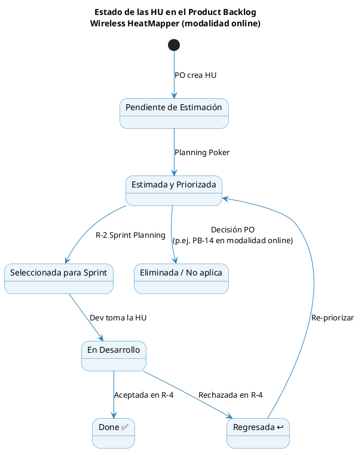

# 05 — Product Backlog (F3) — Modalidad online

**Formato:** F3 — Product Backlog
**Versión:** 2.0 (ajustada a modalidad 100 % en línea)
**Product Owner:** Herland Borys Quiroga Flores

---

## 1. Cambios respecto al backlog original

| Cambio                                      | Razón                                                                                                                                                        |
| ------------------------------------------- | ------------------------------------------------------------------------------------------------------------------------------------------------------------ |
| **PB-14 eliminado**                         | "Sincronizar proyecto al servidor" no aplica: toda operación ya es online                                                                                    |
| **PB-13 (admin) reubicado al Sprint 1**     | El pre-aprovisionamiento de técnicos es prerrequisito de la autenticación móvil                                                                              |
| **PB-01 y PB-10 adelantados al Sprint 1**   | El CRUD móvil de proyectos y su listado quedaron implementados durante Sprint 1; se consolida la fundación CRUD (Usuario/Cliente/Proyecto) en un solo sprint |
| **Estimaciones de PB-03 y PB-05 ajustadas** | El cliente delgado en línea reduce la carga de implementación móvil                                                                                          |
| **PB-09 redefinido**                        | Autenticación contra backend con JWT (no contra SQLite local)                                                                                                |
| **PB-02 redefinido**                        | El plano se sube al backend; el cliente solo lo solicita por URL firmada                                                                                     |
| **PB-20 incorporado**                       | La pantalla de Heatmaps requiere conjuntos persistentes de APs con propósito para generar mapas por AP individual, subconjunto o conjunto completo            |
| **PB-06 eliminado**                         | El diagnóstico persistido queda fuera de alcance; las métricas operativas se calculan desde `mapa_calor` sin tablas separadas                                 |
| **PB-08 eliminado**                         | La entrega al cliente se realiza mediante portal web con enlace, no mediante generación PDF                                                                   |

---

## 2. Diagrama de estados del Product Backlog

---

## 3. Product Backlog completo

**Leyenda:** 🔴 Alta · 🟡 Media · 🟢 Baja · PHU = Puntos de Historia (Fibonacci 1·2·3·5·8·13·21)

| Id        | Nombre corto                             | Como / Quiero / Para                                                                                                                                                              | Prio.    | PHU | Sprint   | RP  |
| --------- | ---------------------------------------- | --------------------------------------------------------------------------------------------------------------------------------------------------------------------------------- | -------- | --- | -------- | --- |
| **PB-13** | Gestionar usuarios (admin web)           | Como administrador, quiero crear, activar y desactivar cuentas de técnicos desde el panel web, para controlar el acceso al sistema sin intervenir la app móvil.                   | 🔴 Alta  | 8   | Sprint 1 | RP7 |
| **PB-19** | Gestionar clientes (admin web)           | Como administrador, quiero crear y gestionar clientes desde el panel web, para que los técnicos los seleccionen al crear proyectos sin escribirlos a mano.                        | 🔴 Alta  | 3   | Sprint 1 | RP7 |
| **PB-09** | Autenticar usuario (móvil)               | Como técnico de campo, quiero iniciar sesión en la app contra el backend para acceder solo a mis proyectos, evitando uso no autorizado del sistema.                               | 🔴 Alta  | 5   | Sprint 1 | RP8 |
| **PB-18** | Ver proyectos de la organización         | Como administrador, quiero ver todos los proyectos de todos los técnicos con su estado y última actividad, para supervisar el trabajo de campo.                                   | 🟢 Baja  | 5   | Sprint 1 | RP7 |
| **PB-01** | Gestionar proyecto de survey             | Como técnico, quiero crear, editar, archivar y eliminar proyectos en el backend, para organizar mis mediciones por edificio o cliente.                                            | 🔴 Alta  | 5   | Sprint 1 | RP8 |
| **PB-10** | Ver historial de proyectos               | Como técnico, quiero ver mis proyectos con estado y última actividad, para retomarlos o consultarlos rápidamente.                                                                 | 🟡 Media | 3   | Sprint 1 | RP8 |
| **PB-02** | Importar plano de edificio               | Como técnico, quiero subir un plano (PNG/JPG/PDF) al backend asociado a un proyecto, para georreferenciar mediciones sobre él.                                                    | 🔴 Alta  | 8   | Sprint 2 | RP2 |
| **PB-11** | Calibrar escala del plano                | Como técnico, quiero definir la escala real del plano dibujando una línea de referencia e ingresando su longitud en metros, para que las distancias en el heatmap sean correctas. | 🔴 Alta  | 8   | Sprint 2 | RP2 |
| **PB-03** | Capturar señales WiFi (en línea)         | Como técnico, quiero que la app escanee redes WiFi y envíe cada lote en línea al backend, para evitar pérdidas y disponer de los datos de inmediato en el servidor.               | 🔴 Alta  | 13  | Sprint 3 | RP1 |
| **PB-04** | Marcar puntos de medición                | Como técnico, quiero marcar la posición de cada punto sobre el plano (toque puntual o registro continuo), para asociar cada escaneo a una ubicación real.                         | 🔴 Alta  | 8   | Sprint 3 | RP2 |
| **PB-20** | Gestionar conjuntos de APs por plano     | Como técnico, quiero crear conjuntos de APs con un propósito específico, para generar heatmaps focalizados sin rehacer la selección manual cada vez.                              | 🔴 Alta  | 8   | Sprint 4 | RP3 |
| **PB-05** | Generar mapa de calor                    | Como técnico, quiero ver un mapa de calor continuo (verde→rojo) sobre el plano generado por el backend, para visualizar la distribución de cobertura WiFi.                        | 🔴 Alta  | 13  | Sprint 4 | RP3 |
| **PB-06** | ~~Analizar cobertura automáticamente~~   | **Eliminada por refinamiento** — no se persiste diagnóstico separado; las métricas se consultan desde heatmaps y conjuntos AP vigentes.                                          | —        | —   | N/A      | RP4 |
| **PB-07** | Obtener recomendaciones de APs por IA    | Como técnico, quiero recibir escenarios RF completos por AP físico y radio para 2,4/5 GHz, para diseñar una instalación nueva u optimizar una red existente.                       | 🔴 Alta  | 21  | Sprint 5 | RP5 |
| **PB-12** | Comparar escenario actual vs propuesto   | Como técnico, quiero comparar mediciones y proyecciones por banda y punto sin alterar la evidencia real, para demostrarle al cliente la mejora esperada.                          | 🟡 Media | 8   | Sprint 5 | RP5 |
| **PB-08** | ~~Exportar reporte técnico~~             | **Eliminada por refinamiento** — el portal cliente sustituye el PDF como mecanismo de entrega del resultado.                                                                         | —        | —   | N/A      | RP6 |
| **PB-15** | Generar enlace de cliente                | Como técnico, quiero generar un enlace único (token + expiración) para compartir un proyecto con el cliente, para que acceda al portal sin instalar la app.                       | 🟡 Media | 5   | Sprint 6 | RP9 |
| **PB-16** | Ver heatmap interactivo (portal cliente) | Como cliente, quiero acceder por enlace único a una vista web con el heatmap actual y el proyectado, para evaluar visualmente el trabajo realizado.                               | 🟡 Media | 13  | Sprint 6 | RP9 |
| **PB-17** | Ver análisis y plan AP (portal cliente)  | Como cliente, quiero ver el análisis de cobertura y las posiciones recomendadas de APs en el portal web, para entender el plan propuesto antes de aprobar la inversión.           | 🟡 Media | 8   | Sprint 6 | RP9 |
| **PB-14** | ~~Sincronizar proyecto al servidor~~     | **Eliminada en modalidad online** — todas las operaciones ya se realizan contra el backend desde el Sprint 1.                                                                     | —        | —   | N/A      | —   |

---

## 4. Resumen por Sprint

| Sprint    | HU                                       | PHU         | Objetivo del Sprint                                                |
| --------- | ---------------------------------------- | ----------- | ------------------------------------------------------------------ |
| Sprint 1  | PB-13, PB-19, PB-09, PB-18, PB-01, PB-10 | 29          | Backend base + admin web + auth móvil + CRUD proyectos móvil       |
| Sprint 2  | PB-02, PB-11                             | 16          | Planos en línea (importar + calibrar)                              |
| Sprint 3  | PB-03, PB-04                             | 21          | Captura WiFi en línea con ingesta REST                             |
| Sprint 4  | PB-20, PB-05                             | 21          | Conjuntos de APs + heatmap backend                                 |
| Sprint 5  | PB-07, PB-12                             | 29          | IA y comparación de propuestas como conjuntos AP derivados         |
| Sprint 6  | PB-15, PB-16, PB-17                      | 26          | Portal de cliente y enlace único                                   |
| **TOTAL** |                                          | **142 PHU** |                                                                    |

> **Velocidad esperada:** 18–29 PHU por Sprint de 2 semanas. Sprint 5 queda en 29 PHU por el esfuerzo de IA, sin PB-08.

---

## 5. Notas de refinamiento

- **PB-13 antes que PB-09:** sin admin web no hay forma de crear cuentas de técnico para que se autentiquen en la app.
- **PB-19 en Sprint 1:** el catálogo de clientes es prerrequisito para que PB-01 permita asociar un cliente al crear un proyecto.
- **PB-01 + PB-10 adelantadas a Sprint 1:** el CRUD móvil de proyectos quedó implementado durante el Sprint 1 junto con la autenticación. Se documenta como adelanto formal para mantener trazabilidad F5 y consolidar la fundación CRUD (Usuario/Cliente/Proyecto) antes de entrar al dominio de planos.
- **PB-18 incluida en Sprint 1:** consume el mismo modelo `Usuario` y endpoints; agregarla aquí cuesta poco.
- **PB-20 en Sprint 4:** se incorpora por decisión del PO como refinamiento obligatorio de la pantalla de Heatmaps. El técnico no solo filtra APs: define conjuntos persistentes con propósito por plano y luego genera heatmaps sobre un AP, un subconjunto o todo el conjunto.
- **PB-15 antes que PB-16/PB-17:** el portal necesita un mecanismo de validación de token funcional desde el primer endpoint público.
- **PB-06 eliminada:** el alcance vigente descarta diagnóstico persistido. Las etiquetas y métricas visibles se derivan de `mapa_calor`, `lectura_rssi` y conjuntos AP, sin entidad `analisis_cobertura`.
- **PB-08 eliminada:** el portal cliente con token reemplaza la exportación PDF como entrega del resultado al cliente.
- **PB-07/PB-12 refinadas:** aplicar la [Especificación de Optimización RF por Escenarios](17-especificacion-optimizacion-rf/00-indice.md), aprobada por el Product Owner el 20-jun-2026.

---

## 6. Restricciones técnicas trazadas a HU

| Umbral / Restricción CWNA-107                       | HU afectada         |
| --------------------------------------------------- | ------------------- |
| Throttling Android ≥ 8.0 = 4 escaneos / 2 min       | PB-03               |
| Zona muerta = RSSI < −90 dBm                        | PB-05, PB-07, PB-16 |
| Objetivo de diseño = RSSI ≥ −70 dBm                 | PB-05, PB-07, PB-16 |
| Potencia recomendada de AP = 1/4 a 1/3 del máximo   | PB-07               |
| Atenuación por distancia/frecuencia (FSPL)          | PB-07               |
| Calibración de escala obligatoria antes de medir    | PB-04               |
| Indicador permanente de conectividad con backend    | PB-03, PB-04, PB-05 |
| Heatmap por APs de interés con propósito trazable   | PB-20, PB-05        |

> **Referencias CWNA:** usar la carpeta [Certified Wireless Network Administrator - Official Study Guide Markdown](../../Certified%20Wireless%20Network%20Administrator%20-%20Official%20Study%20Guide%20Markdown/index.md), especialmente `02-rf-fundamentals.md`, `03-spread-spectrum-technology.md`, `05-antennas-and-accessories.md` y `11-site-survey-fundamentals.md`.
