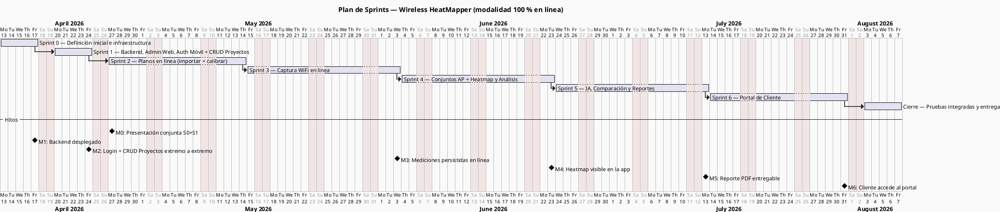
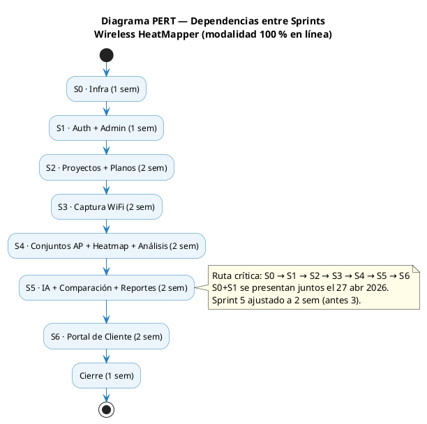
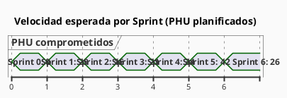

# 06 — Plan de Sprints

**Referencia:** PAPS Online §14 (Gantt + PERT) y §13 (Ecuación del Software)
**Equipo:** 2 desarrolladores (multifuncionales y autogestionados)
**Duración estándar de Sprint:** 2 semanas (10 días hábiles)
**Capacidad por Sprint:** 80 hrs (2 devs × 4 hrs efectivas/día × 10 días) → ~72 hrs comprometidas + 10 % buffer

---

## 1. Diagrama de Gantt

---

## 2. Diagrama PERT (dependencias entre sprints)

**Ruta crítica:** Sprint 0 → Sprint 1 → Sprint 2 → Sprint 3 → Sprint 4 → Sprint 5 → Sprint 6 → Cierre.

Total: 5 + 5 + 14 + 14 + 14 + 14 + 14 + 5 = **85 días hábiles ≈ 4 meses** (S0+S1 presentados juntos el 27 abr 2026; desde abril hasta julio 2026).

---

## 3. Objetivos por Sprint

| Sprint   | Objetivo del Sprint                                                                                                                              | Demo en R-4                                                                        |
| -------- | ------------------------------------------------------------------------------------------------------------------------------------------------ | ---------------------------------------------------------------------------------- |
| Sprint 0 | Tener un backend "hello world" con Docker Compose, PostgreSQL inicializado, CI/CD funcionando y modelos UML aprobados                            | `curl /api/health` → 200 OK                                                        |
| Sprint 1 | El admin crea técnicos y clientes en el panel web; un técnico inicia sesión desde la app móvil y gestiona (CRUD) sus proyectos contra el backend | Crear usuario y cliente en web → loguearse en app → crear/editar/archivar proyecto |
| Sprint 2 | Un técnico sube un plano (PNG/PDF) y lo calibra sobre un proyecto existente; todo persiste en PostgreSQL                                         | Recorrido completo plano + calibración                                             |
| Sprint 3 | Un técnico marca puntos sobre el plano y captura mediciones WiFi que se persisten en línea en el backend                                         | Demo en vivo de captura → BD muestra registros                                     |
| Sprint 4 | El técnico organiza APs por propósito, genera heatmaps por AP/subconjunto/conjunto y ve el análisis automático (zonas muertas, CCI/ACI)           | Conjunto AP + heatmap renderizado + panel de análisis                              |
| Sprint 5 | El técnico recibe recomendaciones de la IA, compara escenarios y exporta el reporte PDF                                                          | Recomendaciones IA + comparación + PDF descargable                                 |
| Sprint 6 | El técnico genera un enlace; el cliente lo abre en navegador y ve heatmap, análisis y plan AP                                                    | Demo del portal de cliente con token real                                          |

---

## 4. Asignación tentativa de horas por componente y Sprint

| Sprint   | Backend (Python) | App móvil (Flutter) | Web (React) | IA / ML | Total est. |
| -------- | ---------------: | ------------------: | ----------: | ------: | ---------: |
| Sprint 0 |               20 |                   8 |           4 |       — |         32 |
| Sprint 1 |               30 |                  20 |          22 |       — |         72 |
| Sprint 2 |               25 |                  35 |          10 |       — |         70 |
| Sprint 3 |               20 |                  45 |           5 |       — |         70 |
| Sprint 4 |               55 |                  40 |           8 |       — |      103\* |
| Sprint 5 |               25 |                  20 |           8 |      50 |      103\* |
| Sprint 6 |               15 |                  10 |          45 |       — |         70 |

\* Sprint 4 queda excedido por incorporación de PB-20; Sprint 5 tiene 2 semanas → capacidad ~80 hrs.

---

## 5. Velocidad esperada y burndown

> Si la velocidad real difiere en más de 20 % de la planificada durante **dos sprints consecutivos**, el equipo convoca reunión extraordinaria para re-priorizar el backlog (PAPS Online §18.2).

---

## 6. Hitos y entregables

| Hito  | Después de | Entregable verificable                                                                   |
| ----- | ---------- | ---------------------------------------------------------------------------------------- |
| M1    | Sprint 0   | `docker compose up` levanta `db + backend + web + nginx`; CI verde                       |
| M2    | Sprint 1   | Login extremo a extremo + CRUD de proyectos en móvil (admin web + técnico móvil) con JWT |
| M3    | Sprint 3   | Filas en `medicion_wifi` provenientes de la app durante una captura en vivo              |
| M4    | Sprint 4   | Conjunto AP + imagen heatmap + objeto análisis devueltos por el backend y mostrados en app |
| M5    | Sprint 5   | Reporte PDF descargable con escenario IA aplicado                                        |
| M6    | Sprint 6   | URL pública con token válido renderizando la vista de cliente completa                   |
| Final | Cierre     | Documentación + APK firmado + URL del backend + URL del panel admin                      |
