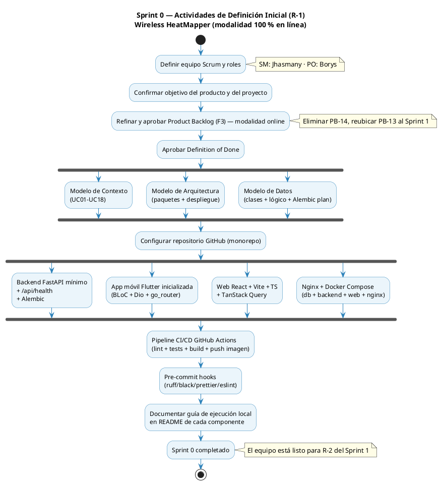

# 07 — Sprint 0: Definición Inicial e Infraestructura

**Referencia Scrum:** R-1 — Definición Inicial
**Duración:** 1 semana (5 días hábiles) · **13 abr – 17 abr 2026**
**Presentación conjunta S0+S1:** lunes 27 abr 2026
**Objetivo:** Dejar listo el entorno de desarrollo y operación para que el Sprint 1 pueda iniciar con un backend desplegable, BD inicializada, CI/CD funcionando y modelos UML aprobados.

---

## 1. Justificación

El Sprint 0 es **obligatorio** en este proyecto porque:

- Es la primera vez que el equipo trabaja con la modalidad 100 % en línea: hay que decidir y cablear la integración entre Docker Compose, Nginx, FastAPI y PostgreSQL.
- Antes de hacer Sprint Planning hay que tener un Product Backlog ordenado (F3) y un esqueleto de arquitectura validado.
- El cliente de tipos del frontend depende del OpenAPI que publica el backend, por lo que el backend "vacío pero corriendo" debe existir desde el día 1 del Sprint 1.

---

## 2. Tareas del Sprint 0

| Id        | Tarea                                                                                                                                                           | Responsable |     Estim. |
| --------- | --------------------------------------------------------------------------------------------------------------------------------------------------------------- | ----------- | ---------: |
| Sp0-01    | Definir equipo Scrum, roles y formato de Daily                                                                                                                  | Ambos       |     0.5 hr |
| Sp0-02    | Confirmar objetivo del producto y del proyecto                                                                                                                  | Borys (PO)  |       1 hr |
| Sp0-03    | Refinar y aprobar el Product Backlog (F3) ajustado a modalidad online                                                                                           | Borys (PO)  |      3 hrs |
| Sp0-04    | Aprobar duración estándar de Sprint = 2 semanas                                                                                                                 | Ambos       |     0.5 hr |
| Sp0-05    | Definir Definition of Done                                                                                                                                      | Ambos       |       1 hr |
| Sp0-06    | Aprobar diagramas: Contexto, Arquitectura (paquetes + despliegue), Datos                                                                                        | Ambos       |      4 hrs |
| Sp0-07    | Crear repositorio GitHub con estructura de monorepo (`backend/`, `mobile/`, `web/`)                                                                             | Jhasmany    |      2 hrs |
| Sp0-08    | Crear `docker-compose.yml` con servicios `db`, `backend`, `web`, `nginx`                                                                                        | Jhasmany    |      4 hrs |
| Sp0-09    | Crear `Dockerfile` del backend (Python 3.12 + Uvicorn) y `pyproject.toml` mínimo                                                                                | Jhasmany    |      3 hrs |
| Sp0-10    | Crear endpoint `GET /api/health` que retorna `{"status":"ok","db":"ok"}`                                                                                        | Jhasmany    |      2 hrs |
| Sp0-11    | Configurar Alembic con migración inicial vacía                                                                                                                  | Jhasmany    |      2 hrs |
| Sp0-12    | Inicializar proyecto Flutter `mobile/` (`flutter create`) con BLoC + Dio + go_router                                                                            | Borys       |      2 hrs |
| Sp0-13    | Inicializar proyecto Web `web/` (Vite + React + TS + TanStack Query + axios)                                                                                    | Borys       |      2 hrs |
| Sp0-14    | Configurar `nginx/nginx.conf` con `/api → backend:8000` y `/ → web`                                                                                             | Jhasmany    |      2 hrs |
| Sp0-15    | Configurar GitHub Actions: lint + tests + build de imagen Docker                                                                                                | Jhasmany    |      4 hrs |
| Sp0-16    | Configurar pre-commit (ruff + ruff-format, prettier, eslint) — `ruff-format` sustituye a `black` por decisión técnica (compatible al 100 % con el estilo black) | Borys       |       1 hr |
| Sp0-17    | Documentar guía de ejecución local en README de cada componente                                                                                                 | Ambos       |      2 hrs |
| **TOTAL** |                                                                                                                                                                 |             | **36 hrs** |

---

## 3. Diagrama de actividades del Sprint 0

---

## 4. Definition of Ready para el Sprint 1

Al cerrar el Sprint 0, deben cumplirse:

| Criterio                                                        | Verificación                                                     |
| --------------------------------------------------------------- | ---------------------------------------------------------------- |
| Repositorio GitHub creado y accesible para ambos miembros       | URL del repo + permisos de escritura                             |
| `docker compose up` levanta los 4 servicios sin errores         | Demo en máquina local                                            |
| `curl http://localhost/api/health` → `200 OK`                   | Captura de pantalla en el README                                 |
| Migración inicial Alembic aplicada en `db`                      | `alembic current` muestra `head`                                 |
| Pipeline CI verde en `main`                                     | Badge en el README                                               |
| Modelos UML (contexto, arquitectura, datos) aprobados por el PO | PR mergeado en `docs/ONLINE/PLAN-IMPLEMENTACION/`                |
| Product Backlog (F3) aprobado y ordenado por el PO              | Ver [05-product-backlog-online.md](05-product-backlog-online.md) |

---

## 5. Riesgos del Sprint 0

| Riesgo                                           | Mitigación                                                |
| ------------------------------------------------ | --------------------------------------------------------- |
| Complejidad de configurar CI con Docker          | Usar templates oficiales de GitHub Actions; cap. de 4 hrs |
| Conflictos de puertos al levantar Docker Compose | Documentar puertos `80/443` y reservarlos en `.env`       |
| Olvidar configurar pre-commit                    | Tarea Sp0-16 explícita y con responsable                  |

---

## 6. R-4 / R-5 del Sprint 0 (versión simplificada)

- **Sprint Review (R-4):** demo de `docker compose up` + `curl /api/health` ante el otro miembro del equipo y, si está disponible, ante el docente tutor.
- **Sprint Retrospective (R-5):** registrar 3 cosas que salieron bien y 1 a mejorar antes del Sprint 1 en `docs/ONLINE/PLAN-IMPLEMENTACION/retrospectivas/sprint-0.md` (a crear durante la ejecución, no en este plan).
