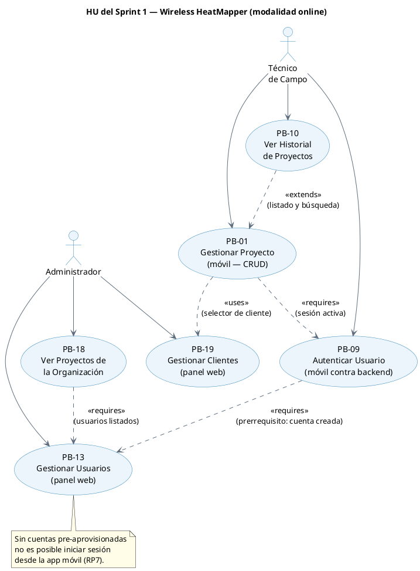
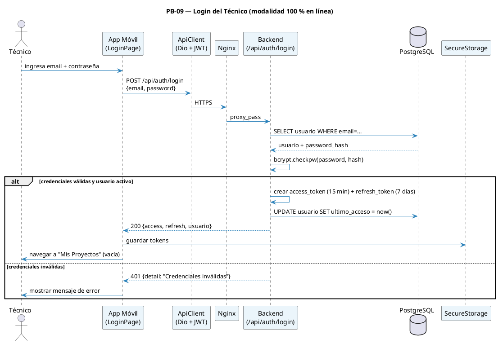

# 08 — Sprint 1: Backend Base + Admin Web + Auth Móvil + CRUD Proyectos

**Duración:** 1 semana (5 días hábiles) · **20 abr – 26 abr 2026**
**Presentación conjunta S0+S1:** lunes 27 abr 2026
**Capacidad:** ~40 hrs (2 devs)
**PHU comprometidos:** 29
**Objetivo del Sprint:**

> Disponer de un backend que autentica usuarios con JWT, un panel web donde el administrador crea técnicos y clientes y supervisa los proyectos de la organización, una pantalla de login móvil que valida credenciales contra el backend en línea, y un CRUD completo de proyectos en la app móvil para que el técnico pueda crear, listar, editar, archivar y eliminar proyectos asociados a un cliente. Al cierre, un técnico recién creado puede iniciar sesión desde la app, gestionar sus proyectos y dejarlos listos para recibir planos en el Sprint 2.

**HU incluidas:** PB-13, PB-19, PB-09, PB-18, PB-01, PB-10

> **Nota de alcance (25-abr-2026):** PB-01 y PB-10 se adelantaron desde el Sprint 2 al Sprint 1 para reflejar el código ya implementado y consolidar el CRUD de Proyecto/Usuario/Cliente en una sola entrega de fundación. El Sprint 2 queda enfocado en planos (PB-02, PB-11).

---

## 1. Diagrama de relación entre HU del Sprint 1



---

## 2. Diagrama de secuencia — Login extremo a extremo



---

## 3. Historias de Usuario del Sprint 1 (F4)

### PB-19 — Gestionar Clientes (panel web)

```
Historia de Usuario
─────────────────────────────────────────────────────────────────
Id: PB-19   Nombre: Gestionar clientes (admin web)   Prioridad: Alta   PHU: 3

Como     : Administrador de Bulldog Tech.
Quiero   : Crear y gestionar el catálogo de clientes desde el panel web
Para     : Que los técnicos seleccionen el cliente correcto al crear proyectos,
           evitando ingresar nombres a mano con posibles inconsistencias

Descripción:
  El administrador accede a la sección "Clientes" del panel web y puede
  crear nuevos clientes (nombre), listar los existentes y desactivar los
  que ya no estén activos. Cuando un técnico crea un proyecto, el campo
  "Cliente" es un selector que consume GET /api/clientes (devuelve solo
  los clientes activos). La tabla `proyecto` almacena `cliente_id` (FK)
  en lugar del nombre como texto libre.

Reglas de negocio:
  · Solo usuarios con rol ADMIN pueden crear/desactivar clientes.
  · Todo usuario autenticado (ADMIN y TECNICO) puede listar clientes activos
    (necesario para el selector en la app móvil y en la web).
  · El nombre del cliente es único (UNIQUE) y no puede estar vacío.
  · Un cliente desactivado no aparece en el selector de proyectos, pero
    los proyectos existentes mantienen la FK y muestran el nombre histórico.
  · No se puede eliminar un cliente con proyectos asociados; solo desactivarlo.

Criterios de aceptación:
  - CA1: Admin crea un cliente con nombre válido → aparece en la lista en
    estado ACTIVO en menos de 1 s.
  - CA2: Nombre duplicado → 409 Conflict con mensaje claro.
  - CA3: Técnico autenticado puede listar clientes activos (GET /api/clientes)
    pero recibe 403 al intentar crear (POST /api/admin/clientes).
  - CA4: Cliente desactivado no aparece en el selector de proyectos de la app.
  - CA5: Los proyectos existentes con ese cliente siguen mostrando el nombre
    aunque el cliente esté desactivado.

Desarrollador: Borys (web) + Jhasmany (backend)
```

### PB-13 — Gestionar Usuarios (panel web)

```
Historia de Usuario
─────────────────────────────────────────────────────────────────
Id: PB-13   Nombre: Gestionar usuarios (admin web)   Prioridad: Alta   PHU: 8

Como     : Administrador de Bulldog Tech.
Quiero   : Crear, activar y desactivar cuentas de técnicos desde el panel web
Para     : Controlar el acceso al sistema sin intervenir el código de la app móvil

Descripción:
  El administrador accede al panel web mediante credenciales y, en la sección
  "Usuarios", puede crear nuevas cuentas de técnico (email, nombre completo,
  contraseña inicial), activarlas o desactivarlas, y reestablecer la contraseña.
  Las cuentas creadas pueden iniciar sesión inmediatamente desde la app móvil.

Reglas de negocio:
  · Solo usuarios con rol ADMIN acceden a /admin/usuarios.
  · El email es único en la tabla `usuario`.
  · La contraseña inicial debe tener ≥ 8 caracteres y se almacena hasheada (bcrypt).
  · Desactivar un usuario invalida sus tokens activos en el siguiente request.
  · No se puede eliminar un usuario que tenga proyectos creados; sólo desactivarlo.

Criterios de aceptación:
  - CA1: Dado un admin autenticado, cuando completa el formulario de "Nuevo
    técnico" con datos válidos, entonces la cuenta aparece en la lista en
    estado ACTIVO en menos de 1 s.
  - CA2: Dado un técnico inactivo, cuando intenta iniciar sesión, entonces
    el backend responde 403 con mensaje "Cuenta desactivada".
  - CA3: Email duplicado al crear → 409 Conflict con mensaje claro.
  - CA4: Solo el rol ADMIN ve la sección /admin/usuarios; el TECNICO recibe 403.
  - CA5: La contraseña nunca viaja en texto plano fuera del request HTTPS de
    creación; en GET no se devuelve `password_hash`.

Desarrollador: Borys (web) + Jhasmany (backend)
```

### PB-09 — Autenticar Usuario (móvil contra backend)

```
Historia de Usuario
─────────────────────────────────────────────────────────────────
Id: PB-09   Nombre: Autenticar usuario (móvil)   Prioridad: Alta   PHU: 5

Como     : Técnico de campo de Bulldog Tech.
Quiero   : Iniciar sesión en la app móvil usando mi email y contraseña
           validados contra el backend en línea
Para     : Acceder solamente a mis proyectos y proteger los datos del cliente

Descripción:
  La app móvil presenta una pantalla de Login al abrirse. Al ingresar
  credenciales válidas, la app llama a POST /api/auth/login y recibe un
  access_token + refresh_token. Los tokens se guardan en flutter_secure_storage.
  La app navega a la lista de proyectos. NO se almacena el `password_hash` ni
  ninguna entidad de dominio en el dispositivo: en cada arranque la app intenta
  refrescar el token y, si tiene éxito, sigue autenticada.

Reglas de negocio:
  · Toda llamada a /api/* requiere `Authorization: Bearer <access_token>`.
  · Cuando el access_token expira (401), el AuthInterceptor intenta refrescar
    automáticamente con el refresh_token; si también está expirado, la app
    cierra sesión y vuelve al Login.
  · Sin conexión con el backend, la pantalla de Login muestra un banner "Sin
    conexión" y deshabilita el botón de inicio (no hay modo offline).
  · La sesión se considera "iniciada" únicamente si el backend respondió 200.

Criterios de aceptación:
  - CA1: Login con credenciales válidas → navega a "Mis Proyectos" en p95 ≤ 2 s.
  - CA2: Credenciales inválidas → mensaje "Credenciales inválidas" sin revelar
    cuál campo es incorrecto.
  - CA3: Cuenta inactiva → mensaje "Cuenta desactivada. Contacte al administrador".
  - CA4: Cierre de sesión → POST /api/auth/logout (revoca refresh) + borra
    tokens locales + vuelve al Login.
  - CA5: Sin conexión → la app muestra "Sin conexión" y el botón queda
    deshabilitado; ningún intento de login local.
  - CA6: El dispositivo no almacena `password_hash` ni email en texto plano
    fuera de SecureStorage.

Desarrollador: Jhasmany
```

### PB-18 — Ver Proyectos de la Organización (panel web)

```
Historia de Usuario
─────────────────────────────────────────────────────────────────
Id: PB-18   Nombre: Ver proyectos de la organización   Prioridad: Baja   PHU: 5

Como     : Administrador de Bulldog Tech.
Quiero   : Ver la lista de todos los proyectos de todos los técnicos de la
           organización con su estado y última actividad
Para     : Supervisar el trabajo de campo sin interrumpir a los técnicos

Descripción:
  En el dashboard del admin, una sección "Proyectos" lista todos los proyectos
  de la organización: nombre, técnico responsable, cliente, estado, fecha de
  última actividad y cantidad de mediciones. Soporta filtro por técnico,
  estado y rango de fechas.

Reglas de negocio:
  · Solo el rol ADMIN accede a esta vista.
  · Paginación: 20 ítems por página.
  · Orden por defecto: última actividad descendente.

Criterios de aceptación:
  - CA1: ADMIN ve todos los proyectos; TECNICO recibe 403.
  - CA2: La lista muestra al menos: nombre, técnico, cliente, estado, fecha
    de última actividad, cantidad de puntos.
  - CA3: Filtro por técnico funciona correctamente.
  - CA4: Si no hay proyectos, se muestra estado vacío "No hay proyectos
    registrados aún".
  - CA5: La carga inicial responde en p95 ≤ 1.5 s con 100 proyectos en BD.

Desarrollador: Borys
```

### PB-01 — Gestionar Proyecto de Survey (móvil)

```
Historia de Usuario
──────────────────────────────────────────────────────────────
Id: PB-01   Nombre: Gestionar proyecto de survey   Prioridad: Alta   PHU: 5

Como     : Técnico de campo de Bulldog Tech.
Quiero   : Crear, editar, archivar y eliminar proyectos en el backend desde
           la app móvil
Para     : Organizar mis mediciones por edificio o cliente

Descripción:
  Desde la pantalla "Mis Proyectos" de la app móvil, el técnico autenticado
  puede crear un proyecto nuevo (nombre obligatorio, cliente del catálogo
  PB-19, descripción opcional), editarlo, archivarlo (no se muestra en la
  lista principal) o eliminarlo (cascada sobre planos, puntos, mediciones
  cuando existan en sprints posteriores). Toda operación es un request al
  backend; no hay edición offline.

Reglas de negocio:
  · El técnico autenticado solo ve y modifica proyectos donde `tecnico_id`
    coincide con su id (validación en backend).
  · Estados válidos: nuevo, en_progreso, completado, archivado. El estado inicial al crear es `nuevo`.
  · El selector de cliente consume `GET /api/clientes` (solo activos).
  · Archivar = `estado = archivado`; no elimina datos.
  · Eliminar pide confirmación explícita en diálogo modal.
  · Un proyecto con reportes exportados no se puede eliminar (`409 Conflict`,
    aplica desde Sprint 5).

Criterios de aceptación:
  - CA1: Crear proyecto válido → POST /api/proyectos → 201 + aparece en la
    lista del técnico en p95 ≤ 1 s.
  - CA2: Editar nombre/descripción/cliente → PUT /api/proyectos/{id} →
    cambios reflejados en el siguiente fetch.
  - CA3: Archivar → PATCH /api/proyectos/{id}/archivar → desaparece del
    listado por defecto y aparece al filtrar por estado=archivado.
  - CA4: Eliminar con confirmación → DELETE → 204 + desaparece de la lista.
  - CA5: Intentar acceder a un proyecto de otro técnico → 404 (no se revela
    existencia).

Desarrollador: Jhasmany (móvil) + Borys (backend)
```

### PB-10 — Ver Historial de Proyectos (móvil)

```
Historia de Usuario
──────────────────────────────────────────────────────────────
Id: PB-10   Nombre: Ver historial de proyectos   Prioridad: Media   PHU: 3

Como     : Técnico de campo
Quiero   : Ver mis proyectos con estado, última actividad y conteo de puntos
Para     : Retomarlos rápidamente o consultarlos sin perder contexto

Reglas de negocio:
  · Endpoint `GET /api/proyectos` (sin filtro = activos del técnico) y
    `GET /api/proyectos?estado=archivado` para los archivados.
  · Orden por `ultima_actividad DESC`.
  · Búsqueda case-insensitive en cliente sobre `nombre` y `cliente`.

Criterios de aceptación:
  - CA1: Listado del técnico en p95 ≤ 1 s.
  - CA2: Búsqueda en tiempo real (filtro local sobre el listado cargado).
  - CA3: Estado vacío con CTA "Crear primer proyecto" si no hay proyectos.
  - CA4: Toggle / vista "Ver archivados" muestra los proyectos archivados.
  - CA5: Tap en un proyecto navega al detalle en p95 ≤ 500 ms (excluyendo red).

Desarrollador: Jhasmany (móvil) + Borys (backend)
```

---

## 4. Sprint Backlog (F5) — Sprint 1

### HU PB-19 (3 PHU) — Backend + Web

| Id     | Tarea                                                                                 | Resp.    | Estim. |
| ------ | ------------------------------------------------------------------------------------- | -------- | -----: |
| Sp1-29 | Modelo SQLAlchemy `Cliente` + migración `0002_cliente_y_proyecto` (tabla + FK)        | Jhasmany |  3 hrs |
| Sp1-30 | Schemas Pydantic `ClienteCreate`/`ClienteOut`/`ClienteBasicoOut`/`ClienteUpdate`      | Jhasmany |   1 hr |
| Sp1-31 | `ClienteRepository` (listar, crear, actualizar, desactivar)                           | Jhasmany |  2 hrs |
| Sp1-32 | Endpoint `GET /api/clientes` (público para autenticados, lista activos)               | Jhasmany |   1 hr |
| Sp1-33 | Endpoint `POST /api/admin/clientes` (solo ADMIN)                                      | Jhasmany |   1 hr |
| Sp1-34 | Endpoint `PUT /api/admin/clientes/{id}` + `PATCH /api/admin/clientes/{id}/desactivar` | Jhasmany |   1 hr |
| Sp1-35 | Tests pytest: crear, duplicado, listar, desactivar, 403 para TECNICO                  | Jhasmany |  2 hrs |
| Sp1-36 | Página `GestionClientesPage.tsx` (tabla + modal crear/desactivar)                     | Borys    |  3 hrs |
| Sp1-37 | Hook `useClientes` + integrar selector de clientes en formulario de proyecto (web)    | Borys    |  2 hrs |
| Sp1-38 | Prueba de aceptación PB-19 con PO                                                     | Ambos    |   1 hr |

### HU PB-13 (8 PHU) — Backend + Web

| Id     | Tarea                                                                       | Resp.    | Estim. |
| ------ | --------------------------------------------------------------------------- | -------- | -----: |
| Sp1-01 | Migración Alembic `0001_inicial_usuarios` (tabla `usuario`)                 | Jhasmany |   1 hr |
| Sp1-02 | Modelo SQLAlchemy + schemas Pydantic `Usuario`/`UsuarioCreate`/`UsuarioOut` | Jhasmany |  2 hrs |
| Sp1-03 | `UsuarioRepository` (CRUD básico + filtro por activo)                       | Jhasmany |  2 hrs |
| Sp1-04 | `AuthService` con bcrypt (hash, verify) + emisión de JWT (python-jose)      | Jhasmany |  3 hrs |
| Sp1-05 | Endpoint `POST /api/admin/usuarios` (crear) protegido por rol ADMIN         | Jhasmany |  2 hrs |
| Sp1-06 | Endpoints `PATCH /usuarios/{id}` (activar/desactivar/reset password)        | Jhasmany |  2 hrs |
| Sp1-07 | Tests pytest: creación, duplicado, activar/desactivar                       | Jhasmany |  3 hrs |
| Sp1-08 | Pantalla `LoginAdmin.tsx` (React + react-hook-form)                         | Borys    |  2 hrs |
| Sp1-09 | Pantalla `GestionUsuarios.tsx` con tabla + modal de creación                | Borys    |  4 hrs |
| Sp1-10 | Hook `useUsuarios` (TanStack Query: list, create, toggle)                   | Borys    |  2 hrs |
| Sp1-11 | Tipos TS generados desde OpenAPI (`openapi-typescript`)                     | Borys    |   1 hr |
| Sp1-12 | Prueba de aceptación PB-13 con PO                                           | Ambos    |   1 hr |

### HU PB-09 (5 PHU) — Backend + Móvil

| Id     | Tarea                                                                         | Resp.    | Estim. |
| ------ | ----------------------------------------------------------------------------- | -------- | -----: |
| Sp1-13 | Endpoint `POST /api/auth/login` (OAuth2 password flow)                        | Jhasmany |  2 hrs |
| Sp1-14 | Endpoint `POST /api/auth/refresh`                                             | Jhasmany |  2 hrs |
| Sp1-15 | Endpoint `POST /api/auth/logout` (revoca refresh)                             | Jhasmany |   1 hr |
| Sp1-16 | Tests pytest del flujo auth (login OK, login KO, refresh, logout)             | Jhasmany |  2 hrs |
| Sp1-17 | `LoginPage` Flutter con `flutter_form_builder` + validaciones                 | Jhasmany |  3 hrs |
| Sp1-18 | `AuthRepository` (Dio) y `AuthCubit` (BLoC) con persistencia en SecureStorage | Jhasmany |  3 hrs |
| Sp1-19 | `AuthInterceptor` Dio: refresh automático al recibir 401                      | Jhasmany |  3 hrs |
| Sp1-20 | `ConnectivityMonitor` + banner "Sin conexión" en `LoginPage`                  | Jhasmany |  2 hrs |
| Sp1-21 | Widget tests de `LoginPage` y unit tests de `AuthCubit`                       | Jhasmany |  2 hrs |
| Sp1-22 | Prueba de aceptación PB-09 con PO (crear admin → crear técnico → loguearse)   | Ambos    |   1 hr |
| Sp1-56 | Integrar FCM en Flutter: permiso, canal Android, ciclo de token y apertura del proyecto asignado | Jhasmany |  3 hrs |

### HU PB-18 (5 PHU) — Backend + Web

| Id     | Tarea                                                                                                                                                  | Resp.    | Estim. |
| ------ | ------------------------------------------------------------------------------------------------------------------------------------------------------ | -------- | -----: |
| Sp1-23 | Endpoint `GET /api/admin/proyectos` (paginado, filtros)                                                                                                | Jhasmany |  3 hrs |
| Sp1-24 | Tests pytest del listado con seed data                                                                                                                 | Jhasmany |  2 hrs |
| Sp1-25 | Pantalla `ListadoProyectosOrg.tsx` (tabla + filtros)                                                                                                   | Borys    |  4 hrs |
| Sp1-26 | Hook `useProyectosOrg` con paginación TanStack Query                                                                                                   | Borys    |  2 hrs |
| Sp1-27 | Estado vacío y skeleton de carga                                                                                                                       | Borys    |   1 hr |
| Sp1-28 | Prueba de aceptación PB-18 con PO                                                                                                                      | Ambos    |   1 hr |
| Sp1-51 | Endpoints admin `PATCH /admin/proyectos/{id}/archivar` y `/{id}/reasignar` + `obtener_por_id_admin` en repo                                            | Borys    |  2 hrs |
| Sp1-52 | Botones "Archivar" y "Reasignar" en `ListadoProyectosOrg.tsx` + modal de selección de técnico + hooks `useArchivarProyectoAdmin`/`useReasignarTecnico` | Borys    |  3 hrs |
| Sp1-53 | Modelo/migración `DispositivoPush` + endpoints autenticados de registro y baja de token FCM                                                  | Jhasmany |  2 hrs |
| Sp1-54 | Servicio Firebase Admin y envío tolerante a fallos al crear o reasignar un proyecto                                                          | Jhasmany |  3 hrs |
| Sp1-55 | Completar ABM web de proyectos: alta, edición, estado, técnico, cliente y baja protegida                                                     | Borys    |  4 hrs |
| Sp1-57 | Tests backend del registro de dispositivos y del flujo asignación → notificación                                                            | Ambos    |  2 hrs |

### HU PB-01 (5 PHU) — Backend + Móvil

| Id     | Tarea                                                                                   | Resp.    | Estim. |
| ------ | --------------------------------------------------------------------------------------- | -------- | -----: |
| Sp1-39 | Modelo SQLAlchemy `Proyecto` + migración incluida en `0002_cliente_y_proyecto`          | Jhasmany |  2 hrs |
| Sp1-40 | Schemas Pydantic `ProyectoIn`/`ProyectoTecnicoOut` + `ProyectoRepository` con ownership | Jhasmany |  2 hrs |
| Sp1-41 | Endpoints REST `GET/POST/PUT /api/proyectos`, `PATCH /{id}/archivar`, `DELETE /{id}`    | Jhasmany |  3 hrs |
| Sp1-42 | Tests pytest CRUD: crear, editar, archivar, eliminar, ownership 404 cross-tecnico       | Jhasmany |  3 hrs |
| Sp1-43 | `ProyectoRemoteDatasource` (Dio) + `ProyectoRepositoryImpl` + `ProyectoCubit` (BLoC)    | Jhasmany |  3 hrs |
| Sp1-44 | `ProyectoFormPage` (Flutter) con selector de cliente (`ClienteRemoteDatasource`)        | Jhasmany |  3 hrs |
| Sp1-45 | Diálogos de confirmación para archivar y eliminar en `ProyectosPage`                    | Jhasmany |   1 hr |
| Sp1-46 | Prueba de aceptación PB-01 con PO (login → crear → editar → archivar → eliminar)        | Ambos    |   1 hr |

### HU PB-10 (3 PHU) — Backend + Móvil

| Id     | Tarea                                                                            | Resp.    | Estim. |
| ------ | -------------------------------------------------------------------------------- | -------- | -----: |
| Sp1-47 | Endpoint `GET /api/proyectos` con filtro de estado (activos / archivados)        | Jhasmany |   1 hr |
| Sp1-48 | Widget de búsqueda local + ordenamiento por última actividad en `proyectos_page` | Jhasmany |  2 hrs |
| Sp1-49 | Estado vacío con CTA "Crear primer proyecto" + skeleton de carga                 | Jhasmany |   1 hr |
| Sp1-50 | Prueba de aceptación PB-10 con PO (listar, buscar, archivar, ver archivados)     | Ambos    |   1 hr |

### Resumen Sprint 1

| Concepto          |   Valor |
| ----------------- | ------: |
| Total de tareas   |      57 |
| Horas estimadas   | ~113 hrs |
| Horas disponibles | ~80 hrs |
| Buffer            | -19 hrs |
| PHU comprometidos |      29 |

> **Nota de capacidad:** la mayoría de las tareas Sp1-39..Sp1-57 corresponden a código ya implementado o completado en el sprint. Las horas reportadas reflejan el esfuerzo real para mantener la trazabilidad F5; el sobre-compromiso documentado se compensa en la próxima retrospectiva (R-5).

---

## 5. Definition of Done específica del Sprint 1

- [ ] Migración `0001` aplicada en `db` y reversible (`alembic downgrade -1` funciona)
- [ ] Migración `0002_cliente_y_proyecto` aplicada y reversible
- [ ] Coverage backend ≥ 80 % en `auth`, `usuarios`, `clientes` y `proyectos`
- [ ] OpenAPI publicado con tags `auth`, `admin/usuarios`, `admin/proyectos`, `clientes`, `proyectos`
- [ ] Bundle web sirviendo `/admin/login`, `/admin/usuarios`, `/admin/clientes`, `/admin/proyectos`
- [ ] APK de la app móvil construido por CI con login funcional + CRUD de proyectos contra backend de staging
- [ ] APK recibe una notificación FCM al crear o reasignar un proyecto desde el panel web
- [ ] Widget tests de `ProyectosPage` y `ProyectoFormPage` pasando en `flutter test`
- [ ] Demo grabada del flujo completo: admin crea cliente → admin crea técnico → técnico inicia sesión en app → técnico crea proyecto seleccionando cliente → admin lo ve en `/admin/proyectos`
