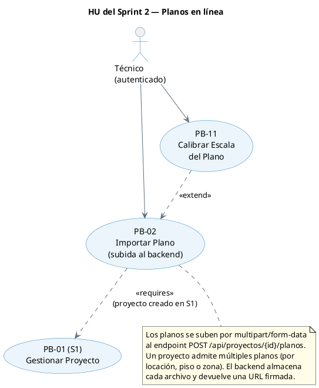
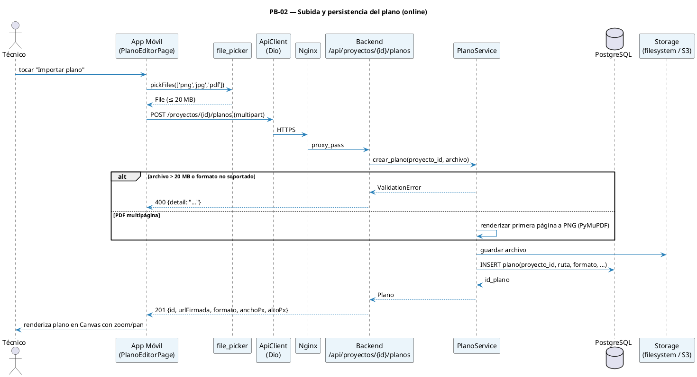

# 09 — Sprint 2: Planos en línea (importar + calibrar)

**Estado:** ✅ Implementado
**Duración:** 2 semanas (10 días hábiles) · **28 abr – 11 may 2026**
**PHU comprometidos:** 16
**Objetivo del Sprint:**

> Sobre los proyectos ya gestionados en Sprint 1 (PB-01, PB-10), permitir al técnico autenticado subir planos en formato PNG/JPG/PDF al backend y calibrar la escala del plano. Al cierre, un proyecto con plano calibrado queda persistido en PostgreSQL listo para recibir mediciones en el Sprint 3.

**HU incluidas:** PB-02, PB-11

> **Nota de alcance (25-abr-2026):** PB-01 (CRUD de proyectos) y PB-10 (historial) se trasladaron al Sprint 1 para reflejar el código ya implementado. Sus historias y tareas ahora viven en [08-sprint-1-fundacion-backend-y-admin.md](08-sprint-1-fundacion-backend-y-admin.md).

---

## 1. Diagrama de relación entre HU del Sprint 2



---

## 2. Diagrama de secuencia — Subida de plano



---

## 3. Historias de Usuario del Sprint 2 (F4)

### PB-01 — Gestionar Proyecto de Survey

```
Historia de Usuario
─────────────────────────────────────────────────────────────────
Id: PB-01   Nombre: Gestionar proyecto de survey   Prioridad: Alta   PHU: 5

Como     : Técnico de campo de Bulldog Tech.
Quiero   : Crear, editar, archivar y eliminar proyectos en el backend
Para     : Organizar mis mediciones por edificio o cliente

Descripción:
  Desde la pantalla "Mis Proyectos", el técnico puede crear un proyecto nuevo
  (nombre obligatorio, cliente, descripción), editarlo, archivarlo (no se
  muestra en la lista principal) o eliminarlo (cascada sobre planos, puntos,
  mediciones, etc.). Toda operación es un request al backend; no hay edición
  offline.

Reglas de negocio:
  · El técnico autenticado solo ve y modifica proyectos donde `tecnico_id`
    coincide con su id (validación en backend).
  · Estados válidos: NUEVO, EN_PROGRESO, COMPLETADO, ARCHIVADO.
  · Archivar = `estado = ARCHIVADO`; no elimina datos.
  · Eliminar pide confirmación + nombre del proyecto como verificación
    secundaria (similar a GitHub).
  · Eliminar pide confirmación explícita y borra en cascada planos, puntos,
    lecturas, conjuntos, mapas y enlaces del proyecto.

Criterios de aceptación:
  - CA1: Crear proyecto válido → POST /api/proyectos → 201 + aparece en la
    lista en p95 ≤ 1 s.
  - CA2: Editar nombre/descripción/cliente → PATCH → cambios reflejados en
    el siguiente fetch.
  - CA3: Archivar → PATCH estado=ARCHIVADO → desaparece del listado por defecto.
  - CA4: Eliminar con confirmación válida → 204 y se eliminan sus artefactos
    asociados por cascada.
  - CA5: Intentar acceder a un proyecto de otro técnico → 403/404.

Desarrollador: Borys
```

### PB-10 — Ver Historial de Proyectos

```
Historia de Usuario
─────────────────────────────────────────────────────────────────
Id: PB-10   Nombre: Ver historial de proyectos   Prioridad: Media   PHU: 3

Como     : Técnico de campo
Quiero   : Ver mis proyectos con estado, última actividad y conteo de puntos
Para     : Retomarlos rápidamente o consultarlos sin perder contexto

Reglas de negocio:
  · Endpoint `GET /api/proyectos?archivados=false&search=&page=`.
  · Orden por `ultima_actividad DESC`.
  · Búsqueda case-insensitive sobre `nombre` y `cliente`.

Criterios de aceptación:
  - CA1: Listado paginado (20/página) en p95 ≤ 1 s.
  - CA2: Búsqueda en tiempo real (debounce 300 ms).
  - CA3: Estado vacío con CTA "Crear primer proyecto" si no hay proyectos.
  - CA4: Toggle "Ver archivados" muestra los proyectos archivados.
  - CA5: Tap en un proyecto navega al detalle en p95 ≤ 500 ms (excluyendo red).

Desarrollador: Borys
```

### PB-02 — Importar Plano de Edificio

```
Historia de Usuario
─────────────────────────────────────────────────────────────────
Id: PB-02   Nombre: Importar plano de edificio   Prioridad: Alta   PHU: 8

Como     : Técnico de campo
Quiero   : Subir uno o más planos del edificio (PNG, JPG o PDF de una página)
           al backend asociados a mi proyecto
Para     : Tener una referencia visual por locación, piso o zona sobre la cual
           georreferenciar mediciones WiFi

Reglas de negocio:
  · Formatos aceptados: PNG, JPG, PDF (primera página únicamente).
  · Tamaño máximo: 20 MB.
  · Si el PDF tiene > 1 página, el backend renderiza solo la primera y
    devuelve un warning informativo en la respuesta.
  · El plano se almacena con nombre `plano_{proyecto_id}_{uuid}.{ext}` en
    `/var/lib/heatmapper/planos/` (o bucket S3 en producción).
  · La URL devuelta es firmada y expira en 1 hora; el cliente la renueva
    al re-abrir la pantalla.
  · Un proyecto admite múltiples planos (uno por locación, piso o zona).
    No existe límite de planos por proyecto.
  · Eliminar un plano solo es posible si no tiene puntos de medición
    asociados; de lo contrario 409.

Criterios de aceptación:
  - CA1: PNG/JPG/PDF válido ≤ 20 MB → 201 con `id`, `urlFirmada`, dimensiones.
  - CA2: Archivo > 20 MB → 413 Payload Too Large con mensaje claro.
  - CA3: Formato no soportado → 415 Unsupported Media Type.
  - CA4: PDF multipágina → 201 + warning "Se importó solo la primera página".
  - CA5: Plano renderiza en la app con zoom (pinch) y desplazamiento (pan).
  - CA6: Si un plano ya tiene puntos de medición asociados, no puede ser
    eliminado; el botón "Eliminar plano" está deshabilitado con tooltip
    "No es posible eliminar un plano con mediciones registradas".
  - CA7: `GET /api/proyectos/{id}/planos` devuelve la lista de planos del
    proyecto con `id`, `nombre`, `formato` y `urlFirmada` de cada uno.

Desarrollador: Jhasmany (móvil) + Borys (backend)
```

### PB-11 — Calibrar Escala del Plano

```
Historia de Usuario
─────────────────────────────────────────────────────────────────
Id: PB-11   Nombre: Calibrar escala del plano   Prioridad: Alta   PHU: 8

Como     : Técnico de campo
Quiero   : Definir la escala real del plano dibujando una línea de referencia
           e ingresando la longitud real en metros
Para     : Asegurar que las distancias en el heatmap correspondan a las
           reales y que la IA opere con un modelo de propagación correcto

Reglas de negocio:
  · La calibración es OBLIGATORIA antes de marcar puntos (Sprint 3).
  · `escala_m_por_px = distancia_real_m / distancia_px`.
  · Distancia mínima de referencia: 1 metro.
  · Endpoint `PATCH /api/planos/{id}/calibracion {x1,y1,x2,y2,distanciaRealM}`.
  · Solo recalibrable si el plano no tiene puntos asociados (validación en
    backend → 409).

Criterios de aceptación:
  - CA1: Tocar dos puntos en el plano dibuja una línea entre ellos.
  - CA2: Confirmar con distancia real ≥ 1 m → PATCH → 200 con factor calculado.
  - CA3: Distancia < 1 m → mensaje "La distancia debe ser al menos 1 metro".
  - CA4: La distancia real entre dos puntos cualquiera del plano se muestra
    en metros tras la calibración.
  - CA5: Si ya existen puntos → 409 + tooltip "No es posible recalibrar con
    mediciones registradas".
  - CA6: La calibración persistida sobrevive a reconexión y reapertura del
    proyecto desde otro dispositivo (es estado del backend).

Desarrollador: Jhasmany (móvil) + Borys (backend)
```

---

## 4. Sprint Backlog (F5) — Sprint 2

### HU PB-02 (8 PHU)

| Id     | Tarea                                                                          | Resp.    | Estim. |
| ------ | ------------------------------------------------------------------------------ | -------- | -----: |
| Sp2-01 | Modelo + schemas `Plano`                                                       | Jhasmany |   1 hr |
| Sp2-02 | `PlanoRepository` + storage (filesystem local con interfaz para S3)            | Jhasmany |  3 hrs |
| Sp2-03 | Endpoint `POST /api/proyectos/{id}/planos` (multipart, validaciones)           | Jhasmany |  3 hrs |
| Sp2-04 | Renderizado de primera página de PDF con PyMuPDF                               | Jhasmany |  3 hrs |
| Sp2-05 | Endpoint `GET /api/proyectos/{id}/planos` + `GET /api/planos/{id}/url-firmada` | Jhasmany |  2 hrs |
| Sp2-06 | Tests pytest: validaciones de tamaño, formato, multipágina                     | Jhasmany |  3 hrs |
| Sp2-07 | Pantalla `PlanoEditorPage` (Flutter Canvas)                                    | Jhasmany |  4 hrs |
| Sp2-08 | Integración `file_picker` + `pdfx` (renderizado en cliente como preview)       | Jhasmany |  3 hrs |
| Sp2-09 | Gestos pinch-to-zoom y pan con `InteractiveViewer`                             | Jhasmany |  2 hrs |
| Sp2-10 | Aceptación con PO                                                              | Ambos    |   1 hr |

### HU PB-11 (8 PHU)

| Id     | Tarea                                                       | Resp.    | Estim. |
| ------ | ----------------------------------------------------------- | -------- | -----: |
| Sp2-11 | Endpoint `PATCH /api/planos/{id}/calibracion`               | Borys    |  2 hrs |
| Sp2-12 | Validación: distancia ≥ 1 m, sin puntos previos             | Borys    |   1 hr |
| Sp2-13 | Tests pytest de calibración                                 | Borys    |  2 hrs |
| Sp2-14 | Modo "calibración" en `PlanoEditorPage` (capturar 2 toques) | Jhasmany |  3 hrs |
| Sp2-15 | Dibujo de línea + diálogo de distancia real                 | Jhasmany |  2 hrs |
| Sp2-16 | Cálculo y envío de calibración + feedback visual            | Jhasmany |  2 hrs |
| Sp2-17 | Visualización de distancia real entre dos puntos (ruler)    | Jhasmany |  2 hrs |
| Sp2-18 | Bloqueo de re-calibración cuando hay puntos                 | Borys    |   1 hr |
| Sp2-19 | Aceptación con PO                                           | Ambos    |   1 hr |

### Resumen Sprint 2

| Concepto          |   Valor |
| ----------------- | ------: |
| Total de tareas   |      19 |
| Horas estimadas   | ~46 hrs |
| Horas disponibles | ~80 hrs |
| Buffer            | ~34 hrs |
| PHU comprometidos |      16 |

> **Nota:** el buffer holgado se reserva para absorber imprevistos técnicos en el manejo de PDF (PyMuPDF) y para iterar sobre la UX de calibración (PB-11), que requiere validación exhaustiva con el PO.

---

## 5. DoD específica del Sprint 2

- [ ] Migración `0002` aplicada y reversible
- [ ] Storage de planos persistente entre reinicios del contenedor (volumen Docker)
- [ ] OpenAPI documenta todos los endpoints con ejemplos
- [ ] App móvil ofrece feedback claro ante red caída en cualquier operación de proyecto/plano
- [ ] Demo: técnico crea proyecto → sube plano PDF → calibra escala → mide regla virtual
