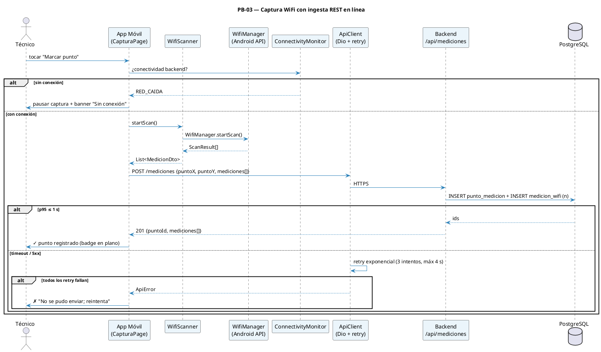
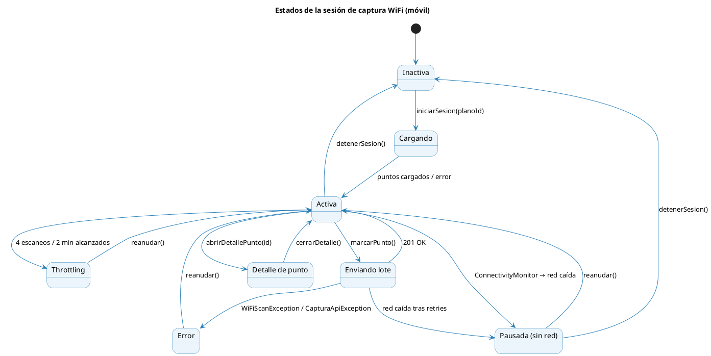

# 10 — Sprint 3: Captura WiFi en línea

**Estado:** ✅ Implementado
**Duración:** 2 semanas (10 días hábiles) · **12 may – 25 may 2026**
**PHU comprometidos:** 21
**Objetivo del Sprint:**

> Implementar la captura automática de señales WiFi desde la app móvil con envío en línea (request por request) al backend, y permitir al técnico marcar puntos de medición sobre el plano calibrado. Al cierre, una sesión de captura en campo deja registros visibles en `medicion_wifi` y `punto_medicion` en PostgreSQL en tiempo real.

**HU incluidas:** PB-03, PB-04
**Restricciones CWNA-107:** Throttling Android ≥ 8.0 = 4 escaneos / 2 min · sin almacenamiento local de muestras.

---

## 1. Diagrama de secuencia — Captura y envío en línea



> **Importante:** ningún `MedicionDto` se persiste en el dispositivo. Si los retries fallan, el lote se descarta del estado en memoria y se notifica al técnico explícitamente. Esto es coherente con la modalidad 100 % en línea (PAPS Online §10.1).

---

## 2. Diagrama de estados — Sesión de captura



> **Nota de implementación:** el estado `CapturaPuntoDetalle` se añadió sobre el plan original para soportar el flujo de detalle/eliminación de punto sin perder el contexto del plano activo (modo continuo incluido).

---

## 3. Historias de Usuario del Sprint 3 (F4)

### PB-03 — Capturar Señales WiFi (en línea)

```
Historia de Usuario
─────────────────────────────────────────────────────────────────
Id: PB-03   Nombre: Capturar señales WiFi (en línea)   Prioridad: Alta   PHU: 13

Como     : Técnico de campo
Quiero   : Que la app escanee redes WiFi (RSSI, SSID, BSSID, canal, frecuencia)
           y envíe cada lote en línea al backend
Para     : Disponer de los datos de inmediato en el servidor sin riesgo de
           pérdida por almacenamiento local

Reglas de negocio:
  · Cada lote contiene: punto (x,y) + lista de ScanResult del escaneo.
  · Endpoint: POST /api/mediciones (acepta el lote completo).
  · Plugin de escaneo: ``wifi_scan: ^0.4.1`` + ``permission_handler: ^12.0.0``
    (permiso ``ACCESS_FINE_LOCATION`` en tiempo de ejecución).
  · Throttling Android ≥ 8.0: máximo 4 escaneos cada 2 minutos en background.
    La app respeta esta restricción (``ThrottlingManager``) y muestra un
    contador regresivo en la barra de estado de la pantalla.
  · Reintentos del cliente: gestionados por interceptores Dio (no en cubit).
  · Si los reintentos fallan, el lote se descarta y se notifica al técnico.
  · NO se persiste el lote en el dispositivo bajo ninguna circunstancia.
  · Cobertura objetivo CWNA-107: ≥ −70 dBm; valores < −90 dBm marcados como
    ZONA_MUERTA (clasificación calculada en el backend al guardar).
Criterios de aceptación:
  - CA1: Tocar "Marcar punto" inicia un escaneo y envía el lote en p95 ≤ 1 s.
  - CA2: El backend retorna 201 con los ids creados; la app marca el punto
    en el plano con un badge.
  - CA3: Sin red, el botón se deshabilita y se muestra "Sin conexión".
  - CA4: Tras 3 retries fallidos, la app muestra error explícito; nada se
    guarda localmente.
  - CA5: El contador de throttling se respeta; el botón se deshabilita
    cuando se alcanzaron 4 escaneos en 2 min con un timer hasta la próxima.
  - CA6: El backend valida `rssi BETWEEN -120 AND 0`; valores fuera de rango
    devuelven 422.
  - CA7: Cerrar y reabrir la app no recupera ningún lote en memoria.

Desarrollador: Jhasmany (móvil + ingesta backend)
```

### PB-04 — Marcar Puntos de Medición

```
Historia de Usuario
─────────────────────────────────────────────────────────────────
Id: PB-04   Nombre: Marcar puntos de medición   Prioridad: Alta   PHU: 8

Como     : Técnico de campo
Quiero   : Marcar la posición de cada punto sobre el plano (toque puntual o
           registro continuo a intervalos)
Para     : Asociar cada escaneo WiFi a una ubicación real en el edificio

Reglas de negocio:
  · Modo "Puntual": cada toque sobre el plano dispara un escaneo + envío.
  · Modo "Continuo": el técnico se desplaza y la app escanea automáticamente
    cada N segundos (configurable: 15, 30, 60 s).
  · El plano debe estar calibrado (PB-11) o el modo de captura está deshabilitado.
  · Cada punto se renderiza sobre el plano como marcador neutro de ubicación;
    el color por nivel se reserva para mediciones individuales y heatmaps por AP.
  · El técnico puede tocar un punto registrado para ver el detalle de
    mediciones asociadas (consulta GET /api/puntos/{id}).
  · El técnico puede eliminar un punto (DELETE /api/puntos/{id}) — con
    confirmación.

Criterios de aceptación:
  - CA1: En modo Puntual, cada toque sobre el plano genera un punto + escaneo
    + envío + render del badge.
  - CA2: En modo Continuo, los escaneos respetan el intervalo + throttling.
  - CA3: Plano sin calibrar → botón "Iniciar captura" deshabilitado con tooltip.
  - CA4: Tocar un punto registrado abre un panel inferior con SSID/BSSID/RSSI
    de cada medición del lote, ordenado por RSSI descendente.
  - CA5: Eliminar un punto pide confirmación y, al confirmar, hace DELETE +
    actualiza el plano.
  - CA6: La posición del punto sobre el plano usa coordenadas en píxeles
    del plano (no de pantalla); la conversión usa el factor de zoom/pan actual.

Desarrollador: Jhasmany (móvil) + Borys (backend de puntos)
```

---

## 4. Sprint Backlog (F5) — Sprint 3

### HU PB-03 (13 PHU) — Captura WiFi y ingesta

| Id     | Tarea                                                                                                            | Resp.    | Estim. | Estado |
| ------ | ---------------------------------------------------------------------------------------------------------------- | -------- | -----: | ------ |
| Sp3-01 | Migración Alembic `c3d4e5f6a7b8_sp3_mediciones` (`punto_medicion`, `medicion_wifi`)                             | Jhasmany |  2 hrs | ✅ |
| Sp3-02 | Modelos + schemas (`MedicionItemIn`, `LoteMedicionIn`, `LoteMedicionOut`, `PuntoMedicionDetalleOut`, etc.)       | Jhasmany |  2 hrs | ✅ |
| Sp3-03 | `MedicionRepository` + clasificación de `nivel` por umbrales CWNA-107                                           | Jhasmany |  2 hrs | ✅ |
| Sp3-04 | Endpoint `POST /api/mediciones` (acepta lote)                                                                    | Jhasmany |  3 hrs | ✅ |
| Sp3-05 | Validaciones (RSSI rango, BSSID format, ownership de plano, plano no calibrado → 422)                            | Jhasmany |  2 hrs | ✅ |
| Sp3-06 | Tests pytest del endpoint (lote válido, RSSI fuera de rango, ownership, no calibrado, clasificación CWNA-107)     | Jhasmany |  3 hrs | ✅ |
| Sp3-07 | Métricas: latencia p95 del endpoint con 50 mediciones por lote                                                   | Jhasmany |  2 hrs | ✅ |
| Sp3-08 | `WifiScanner` Flutter: wrapper sobre `wifi_scan: ^0.4.1` + `permission_handler: ^12.0.0` + permisos             | Jhasmany |  4 hrs | ✅ |
| Sp3-09 | `ThrottlingManager`: 4 scans / 2 min con `segundosHastaProximo` expuesto al cubit y UI                          | Jhasmany |  3 hrs | ✅ |
| Sp3-10 | `DioClient` con interceptores de auth (refresh) y gestión de errores                                            | Jhasmany |  3 hrs | ✅ |
| Sp3-11 | `CapturaCubit` con estados: Inactiva / Loading / Activa / Enviando / Throttling / Pausada / PuntoDetalle / Error | Jhasmany |  4 hrs | ✅ |
| Sp3-12 | Tests unitarios del Cubit (transiciones de estado: 5 grupos de pruebas)                                          | Jhasmany |  3 hrs | ✅ |
| Sp3-13 | Aceptación con PO                                                                                                | Ambos    |   1 hr | ✅ |
| Sp3-25 | **[Adición]** Migración `d5e6f7a8b9c0_sp3_numero_lectura_medicion`: campo `numero_lectura` en `medicion_wifi`    | Borys    |  1 hr  | ✅ |
| Sp3-26 | **[Adición]** Endpoint `POST /api/puntos/{id}/mediciones` — modo continuo (acumular lotes en un punto)          | Borys    |  2 hrs | ✅ |

### HU PB-04 (8 PHU) — Marcado de puntos

| Id     | Tarea                                                                                                          | Resp.    | Estim. | Estado |
| ------ | -------------------------------------------------------------------------------------------------------------- | -------- | -----: | ------ |
| Sp3-14 | Endpoints `GET /api/planos/{id}/puntos` y `GET /api/puntos/{id}`                                               | Borys    |  2 hrs | ✅ |
| Sp3-15 | Endpoint `DELETE /api/puntos/{id}` con cascada                                                                 | Borys    |   1 hr | ✅ |
| Sp3-16 | Tests pytest de listado, detalle, eliminación, ownership y punto inexistente                                    | Borys    |  2 hrs | ✅ |
| Sp3-17 | `CapturaPage` con `InteractiveViewer` + `TransformationController` (zoom/pan) — modo Puntual                   | Jhasmany |  4 hrs | ✅ |
| Sp3-18 | Modo Continuo: `Timer` por intervalo + `_BarraModo` con countdown + `_ModoSelector` en AppBar                  | Jhasmany |  3 hrs | ✅ |
| Sp3-19 | `PlanoPuntosPainter` (CustomPainter): círculos neutros de punto de lectura, selección visual                   | Jhasmany |  3 hrs | ✅ |
| Sp3-20 | `PuntoDetalleSheet` (`DraggableScrollableSheet`) con mediciones agrupadas por `numero_lectura`                  | Jhasmany |  3 hrs | ✅ |
| Sp3-21 | Diálogo de confirmación de eliminación de punto                                                                | Jhasmany |   1 hr | ✅ |
| Sp3-22 | `PlanoPuntosPainter.pantallaToPlanoCoordenadas()`: conversión coords canvas ↔ coords plano                     | Jhasmany |  2 hrs | ✅ |
| Sp3-23 | Tests unitarios del `CapturaCubit` con `bloc_test` + `mocktail`                                                | Jhasmany |  3 hrs | ✅ |
| Sp3-24 | Aceptación con PO                                                                                              | Ambos    |  2 hrs | ✅ |
| Sp3-27 | **[Adición]** `agregarMedicionesAPunto()` en `CapturaCubit` — modo continuo acumulación                        | Jhasmany |  2 hrs | ✅ |
| Sp3-28 | **[Adición]** Estado `CapturaPuntoDetalle` + `abrirDetallePunto()` / `cerrarDetalle()` en `CapturaCubit`        | Jhasmany |  2 hrs | ✅ |

### Resumen Sprint 3

| Concepto          |   Valor |
| ----------------- | ------: |
| Total de tareas   |      28 |
| Tareas originales |      24 |
| Adiciones         |       4 |
| Horas estimadas   | ~79 hrs |
| PHU comprometidos |      21 |

---

## 5. DoD específica del Sprint 3

- [x] Permisos Android en `pubspec.yaml`: `ACCESS_FINE_LOCATION` (vía `permission_handler`), `ACCESS_WIFI_STATE`, `CHANGE_WIFI_STATE` (vía `wifi_scan`)
- [x] Latencia p95 de POST /mediciones ≤ 1 s con lotes de 50 mediciones
- [x] No existe ninguna tabla local en el dispositivo con datos de mediciones
- [x] `ConnectivityMonitor` + `CapturaPausada` activo en `CapturaPage` con SnackBar visible
- [x] Demo en campo: `CapturaCubit` integrado, router ruteado en `/proyectos/:id/planos/:planoId/captura`
- [x] Todos los tests backend (`test_mediciones.py`) pasan incluyendo 10 pruebas parametrizadas de umbrales CWNA-107
- [x] Tests unitarios del `CapturaCubit` en `captura_cubit_test.dart` pasan (5 grupos: `iniciarSesion`, `marcarPunto`, `agregarMedicionesAPunto`, `abrirDetallePunto`, `eliminarPunto`)

---

## 6. Funcionalidades añadidas sobre el plan original

Durante la implementación se incorporaron las siguientes capacidades no previstas en el Sprint Backlog original:

### 6.1 Campo `numero_lectura` en `medicion_wifi` (Sp3-25)

Se añadió el campo entero `numero_lectura` a la tabla `medicion_wifi` para identificar a qué ciclo de escaneo pertenece cada resultado cuando un técnico acumula lecturas sobre el mismo punto en modo continuo:

- `1` = primer escaneo (modo puntual o primer ciclo continuo).
- `2, 3, …` = ciclos siguientes en modo continuo sobre el mismo punto.

Se creó la migración adicional `d5e6f7a8b9c0_sp3_numero_lectura_medicion` encadenada a `c3d4e5f6a7b8`. El `PuntoDetalleSheet` agrupa las mediciones por `numero_lectura` para visualizar la evolución de la señal en el tiempo.

### 6.2 Endpoint `POST /api/puntos/{id}/mediciones` — modo continuo (Sp3-26)

Endpoint que permite añadir un nuevo lote de mediciones a un `punto_medicion` ya existente (en lugar de crear un punto nuevo). El backend recalcula el `nivel` técnico del punto tomando el peor RSSI de **todas** las mediciones acumuladas (anteriores + nuevas), pero ese agregado no se usa para colorear el marcador del plano. Este endpoint es consumido por `agregarMedicionesAPunto()` en el cubit para el ciclo periódico del modo continuo.

### 6.3 `agregarMedicionesAPunto()` en `CapturaCubit` (Sp3-27)

Método del cubit que ejecuta el ciclo periódico del modo continuo: verifica conectividad y throttling, escanea, y llama al endpoint `POST /api/puntos/{id}/mediciones`. Si el escaneo arroja cero redes o se está en throttling, el ciclo se omite silenciosamente (no interrumpe el timer). Solo escala a `CapturaError` si el backend rechaza explícitamente el lote.

### 6.4 Estado `CapturaPuntoDetalle` + métodos `abrirDetallePunto` / `cerrarDetalle` (Sp3-28)

Estado adicional del cubit (no en el diagrama original) que representa el momento en que el técnico tiene un `PuntoDetalleSheet` abierto. Preserva `modosContinuo` e `intervaloSegundos` del estado anterior para restaurarlos correctamente al cerrar el detalle. El `CapturaCubit.abrirDetallePunto()` hace `GET /api/puntos/{id}` para cargar las mediciones completas con sus `numero_lectura`.
