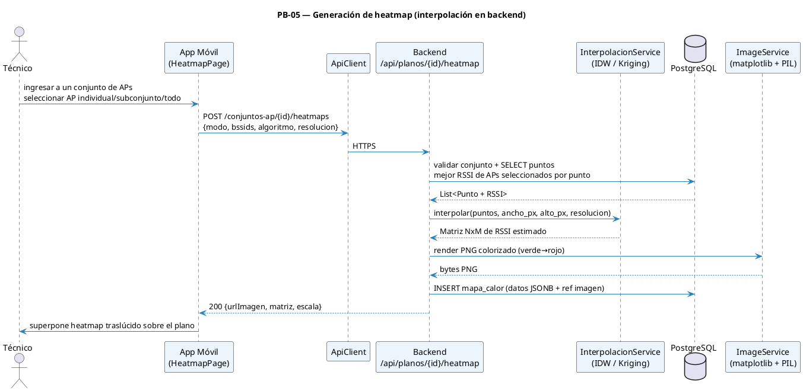
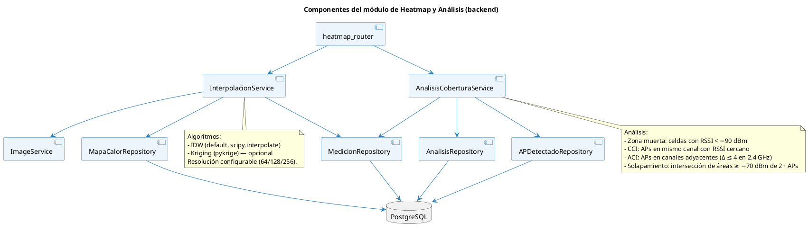

# 11 — Sprint 4: Heatmap (backend) y Análisis de Cobertura

**Duración:** 2 semanas (10 días hábiles) · **26 may – 8 jun 2026**
**PHU comprometidos:** 34
**Objetivo del Sprint:**

> Implementar conjuntos persistentes de APs por plano con propósito explícito, y sobre cada conjunto generar mapas de calor mediante interpolación espacial (IDW como baseline, Kriging como opción) en el backend FastAPI. Dentro de un conjunto, el técnico puede generar heatmaps para un AP individual, un subconjunto de APs o el conjunto completo. Añadir el análisis automático de cobertura (zonas muertas, solapamiento de APs, CCI/ACI). Al cierre, un técnico organiza los APs detectados por propósito, genera el heatmap requerido y revisa el panel de análisis sobre el plano de su proyecto.

**HU incluidas:** PB-20, PB-05, PB-06
**Restricciones:** latencia p95 del heatmap ≤ 3 s para hasta 200 puntos · cobertura objetivo ≥ −70 dBm · zona muerta < −90 dBm.

---

## 1. Diagrama de secuencia — Solicitud de heatmap



---

## 2. Diagrama de componentes — Backend del heatmap



---

## 3. Historias de Usuario del Sprint 4 (F4)

### PB-20 — Gestionar Conjuntos de APs por Plano

```
Historia de Usuario
─────────────────────────────────────────────────────────────────
Id: PB-20   Nombre: Gestionar conjuntos de APs por plano   Prioridad: Alta   PHU: 8

Como     : Técnico de campo
Quiero   : Crear conjuntos de APs con un propósito específico dentro de cada plano
Para     : Generar heatmaps focalizados sin rehacer la selección manual cada vez

Descripción:
  Cada plano puede tener múltiples APs detectados a partir de sus capturas. El
  técnico organiza esos APs en conjuntos persistentes, por ejemplo "Red
  corporativa principal", "APs de invitados", "APs críticos para roaming" o
  "AP sospechoso". Al ingresar a un conjunto, puede generar heatmaps para un
  AP individual, un subconjunto de ese conjunto o todo el conjunto.

Reglas de negocio:
  · Cada conjunto pertenece a un solo plano y a los proyectos del técnico autenticado.
  · El conjunto tiene nombre obligatorio y propósito obligatorio.
  · Un conjunto debe incluir al menos 1 AP detectado en las mediciones del plano.
  · No se puede agregar un BSSID que no exista en las mediciones del plano.
  · El sistema ofrece un conjunto virtual "Todos los APs detectados" cuando el
    plano tiene mediciones, pero los conjuntos creados por el técnico se
    persisten en PostgreSQL.
  · El propósito del conjunto se conserva para trazabilidad en los mapas de
    calor, análisis y reportes posteriores.
  · Al modificarse las mediciones del plano, los conjuntos se mantienen, pero
    el backend valida de nuevo los BSSID antes de generar un heatmap.

Criterios de aceptación:
  - CA1: Crear conjunto con nombre, propósito y 1+ BSSID válidos → 201 y aparece
    en la lista del plano.
  - CA2: Crear conjunto sin propósito o sin APs → 422 con mensaje claro.
  - CA3: Intentar agregar un BSSID inexistente para el plano → 422.
  - CA4: Editar nombre, propósito o miembros → 200 y se preserva la trazabilidad
    de heatmaps ya generados.
  - CA5: El técnico ve la lista de conjuntos del plano con cantidad de APs y
    fecha de actualización.
  - CA6: Desde un conjunto puede elegir AP individual, subconjunto o conjunto
    completo antes de solicitar el heatmap.

Desarrollador: Borys (backend) + Jhasmany (móvil)
```

### PB-05 — Generar Mapa de Calor

```
Historia de Usuario
─────────────────────────────────────────────────────────────────
Id: PB-05   Nombre: Generar mapa de calor   Prioridad: Alta   PHU: 13

Como     : Técnico de campo
Quiero   : Ver un mapa de calor continuo (verde→rojo) sobre el plano,
           generado por el backend a partir de mis mediciones
Para     : Visualizar la distribución de cobertura WiFi del edificio

Reglas de negocio:
  · Antes de generar el mapa, el técnico ingresa a un conjunto de APs del plano
    y selecciona el modo de generación: AP individual, subconjunto o conjunto
    completo.
  · El mapa conserva `conjunto_ap_id`, modo de generación y BSSID usados para
    que el análisis y el reporte expliquen el propósito del heatmap.
  · El heatmap se calcula con las mediciones de los APs seleccionados, tomando
    por punto la mejor señal disponible entre esos APs; no usa un agregado global
    de todas las redes.
  · La ubicación de los APs sobre el plano es referencial para visualización y
    análisis; no se usa como muestra RSSI sintética para interpolar.
  · Dentro de un conjunto, la app permite alternar entre vista de todo el
    conjunto, subconjunto temporal y AP individual, regenerando el mapa con los
    BSSID correspondientes sin modificar el conjunto persistente.
  · La respuesta incluye los puntos de lectura usados, RSSI mínimo/promedio/máximo
    y advertencias cuando la densidad de muestras puede producir un mapa uniforme.
  · Algoritmos disponibles: IDW (default), Kriging.
  · Resoluciones: 64×64, 128×128, 256×256 (default 128).
  · Escala visual de calidad RSSI:
      ≥ −60 dBm → verde oscuro (Excelente)
      −61 a −67 → verde claro (Muy buena)
      −68 a −70 → verde lima (Buena, límite de diseño)
      −71 a −75 → amarillo (Advertencia operativa)
      −76 a −80 → naranja (Débil)
      −81 a −90 → rojizo (Muy débil)
      < −90    → rojo (Zona muerta oficial)
  · Mínimo de 5 puntos para generar heatmap; menos → 422.
  · Cada generación crea un nuevo registro en `mapa_calor`; el último por
    plano se considera "activo".
  · Latencia objetivo: p95 ≤ 3 s para 200 puntos.
  · El backend cachea el heatmap por (plano_id, conjunto_ap_id, modo, BSSID,
    algoritmo, resolución, firma de mediciones) y lo invalida cuando cambian
    las mediciones relevantes.

Criterios de aceptación:
  - CA1: Generar desde un conjunto con 5+ puntos de lectura → 200 con URL de
    imagen, matriz, puntos usados, métricas RSSI, conjunto_ap_id y modo.
  - CA2: Selección con < 5 puntos de lectura → 422 con mensaje
    "Se requieren al menos 5 puntos de los APs seleccionados".
  - CA3: Latencia p95 ≤ 3 s con 200 puntos (medida con `pytest-benchmark`).
  - CA4: La app superpone el heatmap sobre el plano con transparencia 60 %,
    leyenda de escala, puntos de lectura y métricas RSSI.
  - CA5: Cambiar algoritmo o resolución regenera el heatmap.
  - CA6: Tras añadir un punto nuevo para ese AP, el heatmap cacheado se invalida
    y el siguiente GET devuelve un mapa actualizado.
  - CA7: Seleccionar AP individual dentro del conjunto genera un heatmap solo
    para ese BSSID sin eliminar los demás APs del conjunto.
  - CA8: Seleccionar un subconjunto temporal genera un heatmap solo con esos
    BSSID y mantiene intacto el conjunto persistente.

Desarrollador: Borys (backend) + Jhasmany (móvil)
```

### PB-06 — Analizar Cobertura Automáticamente

```
Historia de Usuario
─────────────────────────────────────────────────────────────────
Id: PB-06   Nombre: Analizar cobertura automáticamente   Prioridad: Alta   PHU: 13

Como     : Técnico de campo
Quiero   : Que el backend identifique zonas muertas, solapamiento entre APs
           y CCI/ACI, y devuelva un análisis estructurado
Para     : Revisar el diagnóstico de la red sin interpretar la matriz manualmente

Reglas de negocio:
  · Endpoint: POST /api/mapas/{id}/analisis (idempotente: si existe lo regenera).
  · El análisis se limita a los APs usados por el heatmap generado desde el
    conjunto; no mezcla APs externos al propósito seleccionado.
  · Calcula:
      - zonas_muertas: cantidad de celdas con RSSI < −90 dBm (porcentaje)
      - zonas_problematicas: cantidad de celdas con RSSI < −75 dBm (porcentaje)
      - solapamientos_ap: cantidad de pares de APs cuyas áreas con RSSI ≥ −70
        se intersectan
      - interferencias_canal: pares de APs con CCI (mismo canal) o ACI (Δ ≤ 4
        en 2.4 GHz)
      - pct_cobertura: % de celdas con RSSI ≥ −70 dBm (objetivo CWNA-107)
  · Identifica APs detectados (agrupando por BSSID): SSID, canal, RSSI promedio,
    coord estimada (RSSI ponderado de los puntos donde aparece).
  · Devuelve también la lista de `APDetectado` para visualización sobre el plano
    y conserva la referencia al conjunto/mode del mapa analizado.

Criterios de aceptación:
  - CA1: POST /mapas/{id}/analisis con un mapa válido → 200 con análisis completo.
  - CA2: pct_cobertura calculado correctamente (validado con dataset sintético).
  - CA3: Detecta CCI cuando 2 APs están en el mismo canal con RSSI ≥ −80 en
    áreas que se intersectan.
  - CA4: Detecta ACI en banda 2.4 GHz cuando |canal1 − canal2| ≤ 4 y áreas
    se intersectan.
  - CA5: Lista de APs detectados con coord estimada visible sobre el plano.
  - CA6: La app muestra un panel inferior con: % cobertura, # zonas muertas,
    # solapamientos, # interferencias y lista de APs.
  - CA7: Latencia p95 del análisis ≤ 2 s para mapa de 128×128 con 10 APs.
  - CA8: El análisis de un heatmap generado desde un subconjunto solo considera
    los BSSID de ese subconjunto.

Desarrollador: Borys (backend) + Jhasmany (móvil)
```

---

## 4. Sprint Backlog (F5) — Sprint 4

### HU PB-20 (8 PHU)

| Id     | Tarea                                                                                         | Resp.    | Estim. |
| ------ | --------------------------------------------------------------------------------------------- | -------- | -----: |
| Sp4-00 | Migración Alembic `0009_conjuntos_ap` (`conjunto_ap`, `conjunto_ap_item`)                     | Borys    |  2 hrs |
| Sp4-24 | Modelos + schemas + repositorio de conjuntos de APs                                           | Borys    |  3 hrs |
| Sp4-25 | Endpoints CRUD `GET/POST/PATCH/DELETE /api/planos/{id}/conjuntos-ap` y `/api/conjuntos-ap`    | Borys    |  4 hrs |
| Sp4-26 | Endpoint `POST /api/conjuntos-ap/{id}/heatmaps` con modo INDIVIDUAL/SUBCONJUNTO/COMPLETO     | Borys    |  4 hrs |
| Sp4-27 | Pantalla móvil de lista de conjuntos y formulario de creación/edición                         | Jhasmany |  5 hrs |
| Sp4-28 | Detalle móvil de conjunto con selección individual/subconjunto/todo                           | Jhasmany |  5 hrs |
| Sp4-29 | Tests backend y widget/cubit para conjuntos de APs                                            | Ambos    |  5 hrs |

### HU PB-05 (13 PHU)

| Id     | Tarea                                                                                            | Resp.    | Estim. |
| ------ | ------------------------------------------------------------------------------------------------ | -------- | -----: |
| Sp4-01 | Migración Alembic `0004_heatmap_y_analisis` (`mapa_calor`, `analisis_cobertura`, `ap_detectado`) | Borys    |  2 hrs |
| Sp4-02 | Modelos + schemas de `MapaCalor`                                                                 | Borys    |   1 hr |
| Sp4-03 | `InterpolacionService.idw()` con scipy + caching por (plano, algoritmo, resolución)              | Borys    |  5 hrs |
| Sp4-04 | `InterpolacionService.kriging()` con pykrige (opcional pero baseline)                            | Borys    |  4 hrs |
| Sp4-05 | `ImageService` con matplotlib (colormap personalizado por umbrales CWNA-107)                     | Borys    |  3 hrs |
| Sp4-06 | Endpoint `GET /api/planos/{id}/heatmap` compatible + generación desde `POST /conjuntos-ap/{id}/heatmaps` | Borys    |  3 hrs |
| Sp4-07 | Invalidación de caché al INSERT/DELETE en `punto_medicion`                                       | Borys    |  2 hrs |
| Sp4-08 | Tests pytest: dataset sintético, validación de matriz, validación visual del PNG                 | Borys    |  4 hrs |
| Sp4-09 | Benchmark p95 con `pytest-benchmark` (200 puntos)                                                | Borys    |  2 hrs |
| Sp4-10 | Pantalla `HeatmapPage` Flutter: superposición de imagen sobre plano                              | Jhasmany |  4 hrs |
| Sp4-11 | Selector de algoritmo y resolución; refetch al cambiar                                           | Jhasmany |  2 hrs |
| Sp4-12 | Leyenda de escala de color visible en pantalla                                                   | Jhasmany |   1 hr |
| Sp4-13 | Aceptación con PO                                                                                | Ambos    |   1 hr |

### HU PB-06 (13 PHU)

| Id     | Tarea                                                                         | Resp.    | Estim. |
| ------ | ----------------------------------------------------------------------------- | -------- | -----: |
| Sp4-14 | `AnalisisCoberturaService.calcular_zonas_muertas(matriz)`                     | Borys    |  2 hrs |
| Sp4-15 | Detección de CCI/ACI y solapamientos                                          | Borys    |  4 hrs |
| Sp4-16 | Identificación de APs detectados (agregación por BSSID + estimación de coord) | Borys    |  4 hrs |
| Sp4-17 | Endpoint `POST /api/mapas/{id}/analisis`                                      | Borys    |  2 hrs |
| Sp4-18 | Tests con dataset sintético y casos límite                                    | Borys    |  4 hrs |
| Sp4-19 | Pantalla `AnalisisPage` Flutter: panel con métricas + lista de APs            | Jhasmany |  4 hrs |
| Sp4-20 | Render de APs detectados como íconos sobre el plano                           | Jhasmany |  3 hrs |
| Sp4-21 | Tap sobre AP → dialogo con BSSID, canal, RSSI promedio, ubicación confirmable | Jhasmany |  3 hrs |
| Sp4-22 | Endpoint `PATCH /api/aps/{id}` (confirmar ubicación)                          | Borys    |   1 hr |
| Sp4-23 | Aceptación con PO                                                             | Ambos    |   1 hr |

### Resumen Sprint 4

| Concepto          |   Valor |
| ----------------- | ------: |
| Total de tareas   |      30 |
| Horas estimadas   | ~103 hrs |
| Horas disponibles | ~80 hrs |
| Buffer            | ~-23 hrs |
| PHU comprometidos |      34 |

> **Nota de replanificación PO (19-jun-2026):** PB-20 se incorpora a Sprint 4 como ajuste de alcance porque la generación de heatmaps requiere propósito trazable por conjunto de APs. La capacidad queda excedida; el equipo acepta el riesgo académico y prioriza backend + flujo móvil mínimo antes de ampliar reportes/portal.

---

## 5. DoD específica del Sprint 4

- [x] Migración `e6f7a8b9c0d1_sp4_heatmap_y_analisis` aplicada y reversible
- [x] Migración de conjuntos de APs aplicada y reversible
- [x] Prueba automatizada de p95 local ≤ 3 s para heatmap con 200 puntos (`tests/test_heatmaps.py`)
- [x] El técnico crea un conjunto de APs con propósito y genera heatmap de AP individual, subconjunto o conjunto completo
- [x] App muestra leyenda CWNA-107 con los 5 niveles
- [x] Tests del módulo `interpolacion` y `analisis` cubren dataset sintético, cache, CCI/ACI y confirmación de AP
- [x] Demo implementada: técnico abre proyecto de Sprint 3 → ve heatmap → ve panel de análisis con APs detectados
