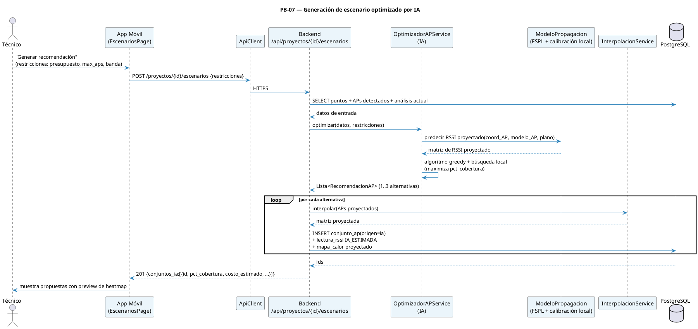

# 12 — Sprint 5: IA y Comparación de Propuestas

**Duración:** 2 semanas (10 días hábiles) · **9 jun – 22 jun 2026**
**PHU comprometidos:** 29
**Objetivo del Sprint:**

> Desplegar el motor híbrido RF + optimización que recomienda APs como conjuntos derivados, genera lecturas estimadas y heatmaps proyectados, y permite compararlos sin alterar mediciones reales.

**HU incluidas:** PB-07, PB-12  
**HU eliminada por refinamiento:** PB-08 (reporte PDF)  
**Restricciones:** modelo físico FSPL/log-distance como baseline · calibración local por plano cuando existan suficientes lecturas reales · comparación lado a lado · mediciones observadas inmutables.

> **Refinamiento aprobado (20-jun-2026):** la [Especificación de Optimización RF por Escenarios](17-especificacion-optimizacion-rf/00-indice.md) es normativa para PB-07/PB-12. La Tabla 3.1 aporta atenuación de materiales; FSPL y la regla de 6 dB se tratan como fundamentos separados.

> **Ajuste de implementación (22-jun-2026):** para el alcance académico vigente, el backend no entrena un modelo global con datos sintéticos ni promete precisión generalizada. Por cada plano con captura finalizada, APs ubicados y BSSID asociados, `ModeloPropagacion` calibra parámetros locales por banda usando las lecturas reales; si no hay datos suficientes, degrada al baseline FSPL/log-distance.

> **Refinamiento vigente (27-jun-2026):** se eliminan `escenario_optimizado`, `recomendacion_ap`, `valor_proyectado_punto` y `reporte`. La IA persiste propuestas como `conjunto_ap.origen = ia`, derivadas de un único conjunto técnico por `conjunto_origen_id`. Los resultados proyectados viven en `lectura_rssi.origen = IA_ESTIMADA` y `mapa_calor`.

---

## 1. Diagrama de secuencia — Recomendación IA



---

## 2. Historias de Usuario del Sprint 5 (F4)

### PB-07 — Recomendaciones IA de Reubicación / Adición de APs

```
Historia de Usuario
─────────────────────────────────────────────────────────────────
Id: PB-07   Nombre: Recomendaciones IA de APs   Prioridad: Alta   PHU: 21

Como     : Técnico de campo
Quiero   : Recibir recomendaciones automáticas sobre dónde añadir, mover o
           cambiar APs para alcanzar la cobertura objetivo
Para     : Diseñar la red sin depender de mi experiencia subjetiva

Reglas de negocio:
  · Entrada: conjunto AP técnico fuente + plano calibrado + lecturas RSSI +
    restricciones (tipo de negocio, max_aps, presupuesto, banda y modelo permitido).
  · Modelo de propagación baseline: FSPL/log-distance, preservando la regla
    CWNA-107 de 6 dB de pérdida por duplicar la distancia.
  · Mejora local: cuando el plano tiene APs ubicados, radios/BSSID asociados y
    mediciones reales, se calibran por banda la referencia efectiva a 1 m y la
    pérdida por duplicar distancia. Si el dataset del plano es insuficiente,
    se usa solo FSPL (degradación controlada).
  · Algoritmo: greedy con búsqueda local (intentar mover cada AP propuesto
    en una grilla de pasos) para maximizar `pct_cobertura ≥ −70 dBm`.
  · Devuelve hasta 3 alternativas ordenadas por (pct_cobertura DESC, costo ASC).
  · Cada alternativa se persiste como `conjunto_ap` de origen `ia`, con items,
    métricas, justificaciones, lecturas estimadas y heatmap proyectado asociado.
    Las acciones son MANTENER / AGREGAR / MOVER / RECONFIGURAR /
    CAMBIAR_MODELO / RETIRAR.

Criterios de aceptación:
  - CA1: POST /proyectos/{id}/escenarios → 201 con 1..3 conjuntos IA en p95 ≤ 8 s.
  - CA2: Cada alternativa expone pct_cobertura, # APs, costo estimado y heatmap
    proyectado.
  - CA3: La justificación textual menciona al menos un dato técnico (RSSI
    proyectado en zonas críticas, distancia al AP más cercano, etc.).
  - CA4: Restricciones respetadas: # APs ≤ max_aps; banda dentro de la
    seleccionada; costo ≤ presupuesto si se especificó.
  - CA5: La app móvil renderiza las alternativas como cards con preview
    miniatura del heatmap.
  - CA6: Test de regresión: dataset sintético "edificio en U" → IA propone
    al menos 1 AP en cada extremo de la U.
  - CA7: El conjunto IA guarda métricas de `calibracion_modelo` sin modificar
    lecturas de campo (`lectura_rssi.origen = CAMPO`).

Desarrollador: Borys (IA + backend) + Jhasmany (móvil)
```

### PB-12 — Comparar Escenario Actual vs Optimizado

```
Historia de Usuario
─────────────────────────────────────────────────────────────────
Id: PB-12   Nombre: Comparar escenarios   Prioridad: Media   PHU: 8

Como     : Técnico de campo
Quiero   : Ver lado a lado el heatmap actual y el heatmap proyectado del
           escenario seleccionado, con diferencias resaltadas
Para     : Decidir si el escenario propuesto justifica la inversión

Reglas de negocio:
  · Endpoint: `GET /api/escenarios/{id}/comparacion` → devuelve:
    - heatmap_actual (URL + matriz)
    - heatmap_proyectado (URL + matriz)
    - matriz_diferencia (RSSI_proyectado − RSSI_actual)
    - resumen: Δ pct_cobertura, Δ # zonas muertas, costo, # cambios
  · La matriz de diferencia se renderiza con paleta divergente (rojo →
    blanco → verde) donde verde = mejora.

Criterios de aceptación:
  - CA1: GET devuelve los 3 mapas + resumen.
  - CA2: La app móvil muestra dos canvas en paralelo (vertical en portrait,
    horizontal en landscape) + un tercero opcional para diferencia.
  - CA3: El resumen aparece como tabla con códigos de color (verde/rojo)
    por delta.
  - CA4: Tap sobre cualquier punto del plano comparado muestra valores
    actual / proyectado / Δ en un tooltip.

Desarrollador: Borys + Jhasmany
```

### PB-08 — Exportar Reporte PDF

**Estado:** eliminada por refinamiento vigente.  
**Justificación:** el portal cliente con enlace único reemplaza la entrega por PDF. No se mantiene entidad `reporte`, endpoint de reportes ni descarga pública de PDF.

---

## 3. Sprint Backlog (F5) — Sprint 5

### HU PB-07 (21 PHU) — IA y propuestas

| Id     | Tarea                                                                                 | Resp.    | Estim. |
| ------ | ------------------------------------------------------------------------------------- | -------- | -----: |
| Sp5-01 | Migraciones Alembic de metadatos IA en `conjunto_ap`, `conjunto_ap_item` y `lectura_rssi` | Borys    |  2 hrs |
| Sp5-02 | Modelos + schemas de conjuntos IA derivados                                           | Borys    |  2 hrs |
| Sp5-03 | `ModeloPropagacion.fspl()` basado en pérdida por distancia/frecuencia                 | Borys    |  3 hrs |
| Sp5-04 | Calibración local por plano desde BSSID de conjunto técnico y mediciones reales       | Borys    |  5 hrs |
| Sp5-05 | Fallback FSPL/log-distance y métricas de calibración persistidas en escenario          | Borys    |  5 hrs |
| Sp5-06 | `OptimizadorAPService.greedy_busqueda_local()`                                        | Borys    |  6 hrs |
| Sp5-07 | Restricciones (max_aps, presupuesto, banda) + validación                              | Borys    |  3 hrs |
| Sp5-08 | Generación de justificaciones textuales por recomendación                             | Borys    |  3 hrs |
| Sp5-09 | Endpoint `POST /api/proyectos/{id}/escenarios` que persiste conjuntos IA              | Borys    |  3 hrs |
| Sp5-10 | Tests unitarios IA (FSPL, greedy, restricciones, edificio en U)                       | Borys    |  5 hrs |
| Sp5-11 | Pantalla `EscenariosPage` con cards de alternativas                                   | Jhasmany |  4 hrs |
| Sp5-12 | Diálogo de configuración de restricciones                                             | Jhasmany |  2 hrs |
| Sp5-13 | Integración + pruebas end-to-end con datos del Sprint 4                               | Ambos    |  3 hrs |
| Sp5-14 | Aceptación con PO                                                                     | Ambos    |   1 hr |

### HU PB-12 (8 PHU) — Comparación

| Id     | Tarea                                                  | Resp.    | Estim. |
| ------ | ------------------------------------------------------ | -------- | -----: |
| Sp5-15 | Endpoint `GET /api/escenarios/{id}/comparacion`        | Borys    |  3 hrs |
| Sp5-16 | Cálculo de matriz_diferencia + resumen Δ               | Borys    |  2 hrs |
| Sp5-17 | `ImageService.render_diferencia()` (paleta divergente) | Borys    |  2 hrs |
| Sp5-18 | Tests de comparación con dataset sintético             | Borys    |  2 hrs |
| Sp5-19 | Pantalla `ComparacionPage` (dual canvas, responsive)   | Jhasmany |  5 hrs |
| Sp5-20 | Tooltip con valores actual/proyectado/Δ                | Jhasmany |  3 hrs |
| Sp5-21 | Tabla resumen con códigos de color                     | Jhasmany |  2 hrs |
| Sp5-22 | Aceptación con PO                                      | Ambos    |   1 hr |

### HU PB-08 (0 PHU) — Reporte PDF eliminado

| Id     | Tarea                                             | Resp. | Estim. |
| ------ | ------------------------------------------------- | ----- | -----: |
| Sp5-23 | Documentar eliminación de PDF y actualizar trazabilidad | Ambos |   1 hr |

### Resumen Sprint 5

| Concepto          |    Valor |
| ----------------- | -------: |
| Total de tareas   |       23 |
| Horas estimadas   |  ~78 hrs |
| Horas disponibles |  ~80 hrs |
| Buffer            |   ~2 hrs |
| PHU comprometidos |       29 |

---

## 4. DoD específica del Sprint 5

- [x] Migraciones de conjuntos IA, lecturas estimadas y metadatos aplicadas y reversibles
- [x] Motor IA disponible en `backend/app/ai/` con baseline FSPL/log-distance y degradación controlada
- [x] Cobertura de tests del módulo IA/heatmaps en `backend/tests/test_optimizacion_rf.py` y `backend/tests/test_heatmaps.py`
- [x] Métricas objetivo de IA documentadas para p95 ≤ 8 s con dataset académico
- [x] Demo: administrador genera propuesta IA → compara con conjunto técnico → conserva mediciones observadas
