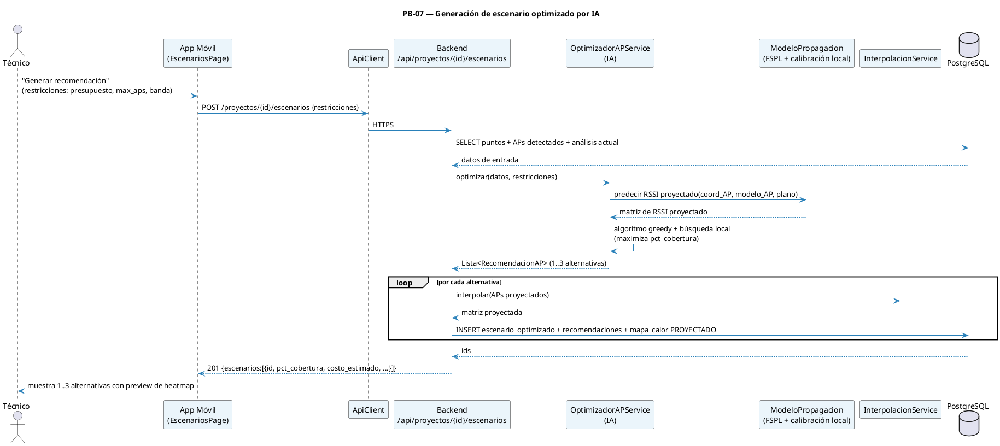

# 12 — Sprint 5: IA, Comparación de Escenarios y Reportes

**Duración:** 2 semanas (10 días hábiles) · **9 jun – 22 jun 2026**
**PHU comprometidos:** 42
**Objetivo del Sprint:**

> Desplegar el motor híbrido RF + optimización que recomienda APs físicos y configuración de radios 2,4/5 GHz para instalaciones nuevas o redes existentes, genera valores y heatmaps proyectados por banda, permite compararlos sin alterar mediciones reales y exporta reportes profesionales en PDF.

**HU incluidas:** PB-07, PB-12, PB-08
**Restricciones:** modelo físico FSPL/log-distance como baseline · calibración local por plano cuando existan APs/BSSID vinculados a mediciones reales · comparación lado a lado · PDF reproducible.

> **Refinamiento aprobado (20-jun-2026):** la [Especificación de Optimización RF por Escenarios](17-especificacion-optimizacion-rf/00-indice.md) es normativa para PB-07/PB-12. La Tabla 3.1 aporta atenuación de materiales; FSPL y la regla de 6 dB se tratan como fundamentos separados.

> **Ajuste de implementación (22-jun-2026):** para el alcance académico vigente, el backend no entrena un modelo global con datos sintéticos ni promete precisión generalizada. Por cada plano con captura finalizada, APs ubicados y BSSID asociados, `ModeloPropagacion` calibra parámetros locales por banda usando las lecturas reales; si no hay datos suficientes, degrada al baseline FSPL/log-distance.

---

## 1. Diagrama de secuencia — Recomendación IA



---

## 2. Historias de Usuario del Sprint 5 (F4)

### PB-07 — Recomendaciones IA de Reubicación / Adición de APs

```
Historia de Usuario
─────────────────────────────────────────────────────────────────
Id: PB-07   Nombre: Recomendaciones IA de APs   Prioridad: Alta   PHU: 21

Como     : Técnico de campo
Quiero   : Recibir recomendaciones automáticas sobre dónde añadir, mover o
           cambiar APs para alcanzar la cobertura objetivo
Para     : Diseñar la red sin depender de mi experiencia subjetiva

Reglas de negocio:
  · Entrada: análisis actual + inventario AP físico/radio/BSSID + restricciones
    (tipo de negocio, max_aps, presupuesto, bandas 2,4/5 GHz y modelo permitido).
  · Modelo de propagación baseline: FSPL/log-distance, preservando la regla
    CWNA-107 de 6 dB de pérdida por duplicar la distancia.
  · Mejora local: cuando el plano tiene APs ubicados, radios/BSSID asociados y
    mediciones reales, se calibran por banda la referencia efectiva a 1 m y la
    pérdida por duplicar distancia. Si el dataset del plano es insuficiente,
    se usa solo FSPL (degradación controlada).
  · Algoritmo: greedy con búsqueda local (intentar mover cada AP propuesto
    en una grilla de pasos) para maximizar `pct_cobertura ≥ −70 dBm`.
  · Devuelve hasta 3 alternativas ordenadas por (pct_cobertura DESC, costo ASC).
  · Cada alternativa genera configuración por radio, mapas por banda y valores
    proyectados en cada punto. Las acciones son MANTENER / AGREGAR / MOVER /
    RECONFIGURAR / CAMBIAR_MODELO / RETIRAR.

Criterios de aceptación:
  - CA1: POST /proyectos/{id}/escenarios → 201 con 1..3 alternativas en p95 ≤ 8 s.
  - CA2: Cada alternativa expone pct_cobertura, # APs, costo estimado y heatmap
    proyectado.
  - CA3: La justificación textual menciona al menos un dato técnico (RSSI
    proyectado en zonas críticas, distancia al AP más cercano, etc.).
  - CA4: Restricciones respetadas: # APs ≤ max_aps; banda dentro de la
    seleccionada; costo ≤ presupuesto si se especificó.
  - CA5: La app móvil renderiza las alternativas como cards con preview
    miniatura del heatmap.
  - CA6: Test de regresión: dataset sintético "edificio en U" → IA propone
    al menos 1 AP en cada extremo de la U.
  - CA7: Si existen APs físicos vinculados a BSSID medidos, el escenario guarda
    métricas de `calibracion_modelo` sin modificar `MedicionWifi`.

Desarrollador: Borys (IA + backend) + Jhasmany (móvil)
```

### PB-12 — Comparar Escenario Actual vs Optimizado

```
Historia de Usuario
─────────────────────────────────────────────────────────────────
Id: PB-12   Nombre: Comparar escenarios   Prioridad: Media   PHU: 8

Como     : Técnico de campo
Quiero   : Ver lado a lado el heatmap actual y el heatmap proyectado del
           escenario seleccionado, con diferencias resaltadas
Para     : Decidir si el escenario propuesto justifica la inversión

Reglas de negocio:
  · Endpoint: `GET /api/escenarios/{id}/comparacion` → devuelve:
    - heatmap_actual (URL + matriz)
    - heatmap_proyectado (URL + matriz)
    - matriz_diferencia (RSSI_proyectado − RSSI_actual)
    - resumen: Δ pct_cobertura, Δ # zonas muertas, costo, # cambios
  · La matriz de diferencia se renderiza con paleta divergente (rojo →
    blanco → verde) donde verde = mejora.

Criterios de aceptación:
  - CA1: GET devuelve los 3 mapas + resumen.
  - CA2: La app móvil muestra dos canvas en paralelo (vertical en portrait,
    horizontal en landscape) + un tercero opcional para diferencia.
  - CA3: El resumen aparece como tabla con códigos de color (verde/rojo)
    por delta.
  - CA4: Tap sobre cualquier punto del plano comparado muestra valores
    actual / proyectado / Δ en un tooltip.

Desarrollador: Borys + Jhasmany
```

### PB-08 — Exportar Reporte PDF

```
Historia de Usuario
─────────────────────────────────────────────────────────────────
Id: PB-08   Nombre: Exportar reporte PDF   Prioridad: Alta   PHU: 13

Como     : Técnico de campo
Quiero   : Generar y descargar un PDF profesional del proyecto con: portada,
           datos del cliente, heatmap actual, análisis, escenarios propuestos
           y recomendaciones
Para     : Entregárselo al cliente como evidencia técnica

Reglas de negocio:
  · Endpoint: `POST /api/proyectos/{id}/reportes` → encola la generación
    (síncrona si toma < 5 s, asíncrona con polling si más).
  · Generación con WeasyPrint (HTML/CSS → PDF) usando plantilla Jinja2.
  · Estructura:
    1. Portada con logo de Bulldog Tech., nombre del proyecto, fecha, técnico
    2. Resumen ejecutivo (1 página)
    3. Plano + heatmap actual + leyenda
    4. Análisis de cobertura: tabla de métricas + lista de APs detectados
    5. Por cada escenario propuesto: heatmap proyectado + lista de
       `RecomendacionAP` con justificaciones
    6. Anexo técnico: tabla de mediciones (CSV opcional)
  · Cada generación crea un registro en `reporte` con hash SHA-256 del PDF
    para verificación.
  · El PDF queda accesible vía `GET /api/reportes/{id}/descargar` (URL firmada
    con expiración 24 h).
  · Un proyecto con reporte exportado no se puede eliminar (PB-01).

Criterios de aceptación:
  - CA1: POST devuelve `id` + `urlDescarga` para reporte síncrono.
  - CA2: Reporte > 5 s → POST devuelve `id` + `estado=PROCESANDO`; polling
    GET /reportes/{id} hasta `LISTO`.
  - CA3: El PDF contiene todas las secciones obligatorias y el plano se
    renderiza con resolución mínima 150 DPI.
  - CA4: El hash SHA-256 del PDF se devuelve y se puede recalcular para
    verificar integridad.
  - CA5: Descargar PDF desde móvil abre el visor del SO.
  - CA6: Eliminar proyecto con reportes → 409 (validado en PB-01 CA4).

Desarrollador: Borys
```

---

## 3. Sprint Backlog (F5) — Sprint 5

### HU PB-07 (21 PHU) — IA y escenarios

| Id     | Tarea                                                                                 | Resp.    | Estim. |
| ------ | ------------------------------------------------------------------------------------- | -------- | -----: |
| Sp5-01 | Migración Alembic `0005_escenarios_e_ia` (`escenario_optimizado`, `recomendacion_ap`) | Borys    |  2 hrs |
| Sp5-02 | Modelos + schemas de Escenario y RecomendacionAP                                      | Borys    |  2 hrs |
| Sp5-03 | `ModeloPropagacion.fspl()` con Tabla 3.1 CWNA-107                                     | Borys    |  3 hrs |
| Sp5-04 | Calibración local por plano desde AP físico, BSSID y mediciones reales                | Borys    |  5 hrs |
| Sp5-05 | Fallback FSPL/log-distance y métricas de calibración persistidas en escenario          | Borys    |  5 hrs |
| Sp5-06 | `OptimizadorAPService.greedy_busqueda_local()`                                        | Borys    |  6 hrs |
| Sp5-07 | Restricciones (max_aps, presupuesto, banda) + validación                              | Borys    |  3 hrs |
| Sp5-08 | Generación de justificaciones textuales por recomendación                             | Borys    |  3 hrs |
| Sp5-09 | Endpoint `POST /api/proyectos/{id}/escenarios`                                        | Borys    |  3 hrs |
| Sp5-10 | Tests unitarios IA (FSPL, greedy, restricciones, edificio en U)                       | Borys    |  5 hrs |
| Sp5-11 | Pantalla `EscenariosPage` con cards de alternativas                                   | Jhasmany |  4 hrs |
| Sp5-12 | Diálogo de configuración de restricciones                                             | Jhasmany |  2 hrs |
| Sp5-13 | Integración + pruebas end-to-end con datos del Sprint 4                               | Ambos    |  3 hrs |
| Sp5-14 | Aceptación con PO                                                                     | Ambos    |   1 hr |

### HU PB-12 (8 PHU) — Comparación

| Id     | Tarea                                                  | Resp.    | Estim. |
| ------ | ------------------------------------------------------ | -------- | -----: |
| Sp5-15 | Endpoint `GET /api/escenarios/{id}/comparacion`        | Borys    |  3 hrs |
| Sp5-16 | Cálculo de matriz_diferencia + resumen Δ               | Borys    |  2 hrs |
| Sp5-17 | `ImageService.render_diferencia()` (paleta divergente) | Borys    |  2 hrs |
| Sp5-18 | Tests de comparación con dataset sintético             | Borys    |  2 hrs |
| Sp5-19 | Pantalla `ComparacionPage` (dual canvas, responsive)   | Jhasmany |  5 hrs |
| Sp5-20 | Tooltip con valores actual/proyectado/Δ                | Jhasmany |  3 hrs |
| Sp5-21 | Tabla resumen con códigos de color                     | Jhasmany |  2 hrs |
| Sp5-22 | Aceptación con PO                                      | Ambos    |   1 hr |

### HU PB-08 (13 PHU) — Reporte PDF

| Id     | Tarea                                                                   | Resp.    | Estim. |
| ------ | ----------------------------------------------------------------------- | -------- | -----: |
| Sp5-23 | Migración Alembic `0006_reportes` (`reporte`)                           | Borys    |   1 hr |
| Sp5-24 | Plantilla Jinja2 + CSS para reporte                                     | Borys    |  5 hrs |
| Sp5-25 | Servicio `ReporteService.generar()` con WeasyPrint                      | Borys    |  4 hrs |
| Sp5-26 | Generación asíncrona con FastAPI BackgroundTasks (pool simple)          | Borys    |  3 hrs |
| Sp5-27 | Endpoint `POST /api/proyectos/{id}/reportes`                            | Borys    |  2 hrs |
| Sp5-28 | Endpoint `GET /api/reportes/{id}` (estado) + `/descargar` (URL firmada) | Borys    |  2 hrs |
| Sp5-29 | Cálculo de SHA-256 + verificación                                       | Borys    |   1 hr |
| Sp5-30 | Tests pytest del servicio (estructura del PDF, hash, casos de error)    | Borys    |  3 hrs |
| Sp5-31 | Botón "Exportar reporte" en `ProyectoPage` con loader/polling           | Jhasmany |  3 hrs |
| Sp5-32 | Apertura del PDF en visor del SO con `open_filex`                       | Jhasmany |  2 hrs |
| Sp5-33 | Aceptación con PO                                                       | Ambos    |   1 hr |

### Resumen Sprint 5

| Concepto          |    Valor |
| ----------------- | -------: |
| Total de tareas   |       33 |
| Horas estimadas   | ~110 hrs |
| Horas disponibles | ~120 hrs |
| Buffer            |  ~10 hrs |
| PHU comprometidos |       42 |

---

## 4. DoD específica del Sprint 5

- [ ] Migraciones `0005` y `0006` aplicadas y reversibles
- [ ] Modelo IA persistido en `backend/app/ai/models/optimizador_ap.joblib` con script de retraining reproducible
- [ ] PDF de prueba generado y revisado por el PO (formato profesional, sin layout roto)
- [ ] Cobertura de tests del módulo `ai/` ≥ 75 %
- [ ] Métricas: p95 de IA ≤ 8 s para 200 puntos + 5 APs detectados
- [ ] Demo: técnico genera 3 alternativas → compara con actual → exporta PDF → cliente lo recibe
