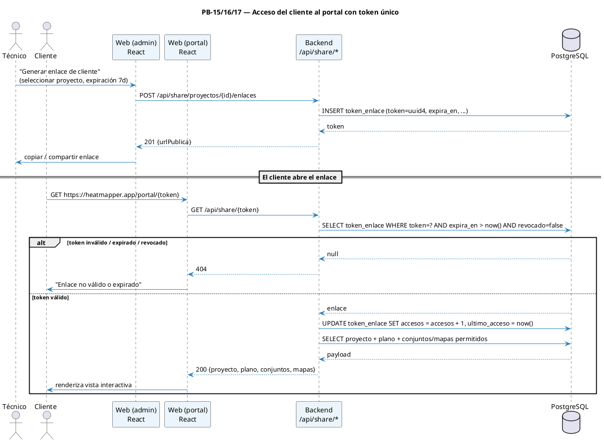
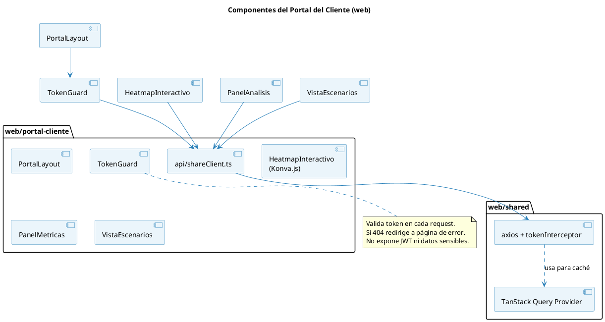

# 13 — Sprint 6: Portal del Cliente (web)

**Duración:** 2 semanas (10 días hábiles) · **23 jun – 6 jul 2026**
**PHU comprometidos:** 26
**Objetivo del Sprint:**

> Habilitar el portal web público para clientes de Bulldog Tech.: el administrador genera un enlace único con contenido seleccionado, el cliente accede sin login a una vista interactiva con heatmaps y conjuntos AP permitidos. Cierra el alcance del producto en su modalidad 100 % en línea.

**HU incluidas:** PB-15, PB-16, PB-17

---

## 1. Diagrama de secuencia — Acceso del cliente al enlace público



---

## 2. Diagrama de componentes — Portal del cliente



---

## 3. Historias de Usuario del Sprint 6 (F4)

### PB-15 — Generar Enlace Único para Cliente

```
Historia de Usuario
─────────────────────────────────────────────────────────────────
Id: PB-15   Nombre: Generar enlace único para cliente   Prioridad: Alta   PHU: 5

Como     : Administrador de Bulldog Tech.
Quiero   : Generar un enlace único, seguro y con expiración configurable
           para compartir un proyecto con el cliente sin que requiera login
Para     : Entregar resultados rápidamente sin gestionar credenciales

Reglas de negocio:
  · Token: UUID v4 + HMAC firmado con secret del backend (256 bits).
  · Expiración configurable: 1 día, 7 días, 30 días o personalizada.
  · Endpoint: POST /api/share/proyectos/{id}/enlaces {expiraEnDias, contenido} → 201.
  · Lista de enlaces activos por proyecto: GET /api/share/proyectos/{id}/enlaces.
  · Revocación: PATCH /api/share/enlaces/{id} {revocado: true} → 200.
  · El backend mantiene `accesos`, `ultimo_acceso` y `ip_ultimo_acceso` por
    enlace (auditoría).
  · El enlace generado tiene formato `https://{host}/portal/{token}`.
  · El contenido publicado queda limitado a `conjunto_ids` y `mapa_ids`.
  · La selección de contenido en la web admin se agrupa por plano para
    proyectos con múltiples mapas cargados.

Criterios de aceptación:
  - CA1: Generar enlace → 201 con URL completa visible para el técnico.
  - CA2: Listar enlaces de un proyecto en la web admin con estado y métricas.
  - CA3: Revocar enlace → futuros accesos devuelven 404.
  - CA4: Token expirado devuelve 404 sin filtrar información del proyecto.
  - CA5: Botón "Copiar enlace" funciona en la web admin.
  - CA6: Validación: si la API recibe expiraEnDias > 365 → 422.

Desarrollador: Borys
```

### PB-16 — Ver Heatmap Interactivo en el Portal

```
Historia de Usuario
─────────────────────────────────────────────────────────────────
Id: PB-16   Nombre: Ver heatmap interactivo (web)   Prioridad: Alta   PHU: 13

Como     : Cliente de Bulldog Tech.
Quiero   : Abrir el enlace que me compartieron y ver el heatmap del edificio
           con zoom, pan, tooltips y leyenda
Para     : Entender visualmente la cobertura WiFi sin instalar nada

Reglas de negocio:
  · La vista carga sin pedir login (token en URL).
  · Render con Konva.js (canvas 2D performante).
  · Tooltip al hacer hover/tap muestra RSSI estimado y nivel CWNA-107.
  · Leyenda fija con los 5 niveles.
  · Botón "Cambiar algoritmo" oculto al cliente (solo admin).
  · El cliente visualiza únicamente mapas incluidos en `mapa_ids`; no genera
    mapas nuevos desde el portal.
  · El portal clasifica los contenidos publicados por plano antes de listar
    datos relevados o propuestas IA.
  · La vista es responsive (móvil + desktop).
  · Performance: First Contentful Paint ≤ 2 s en 3G simulada con plano de
    1 MB; render del heatmap ≤ 2 s adicionales.

Criterios de aceptación:
  - CA1: Token válido → la página renderiza el plano + heatmap con leyenda.
  - CA2: Zoom (rueda/pinch) y pan (drag) funcionan en desktop y móvil.
  - CA3: Tooltip con RSSI estimado y nivel coloreado al hacer hover/tap.
  - CA4: Token inválido → página de error amigable sin filtrar datos.
  - CA5: Lighthouse ≥ 80 en Performance, ≥ 90 en Accessibility.
  - CA6: Sin warnings en consola en producción.

Desarrollador: Borys + Jhasmany
```

### PB-17 — Ver Análisis y Plan de APs en el Portal

```
Historia de Usuario
─────────────────────────────────────────────────────────────────
Id: PB-17   Nombre: Ver análisis y plan de APs (web)   Prioridad: Media   PHU: 8

Como     : Cliente de Bulldog Tech.
Quiero   : Ver métricas de cobertura derivadas del heatmap y los conjuntos AP
           compartidos con sus heatmaps reales o proyectados
Para     : Tomar decisión informada sobre la inversión

Reglas de negocio:
  · El panel de métricas se calcula desde los `mapa_ids` incluidos en el enlace.
  · Tabs de conjuntos compartidos con preview del heatmap disponible.
  · Los previews del portal usan el carrusel de mapas ya cargados; no exponen
    acciones de generación.
  · Los conjuntos publicados se agrupan por plano para facilitar la lectura
    cuando el proyecto contiene más de un mapa.
  · No existe descarga PDF en el alcance vigente.

Criterios de aceptación:
  - CA1: Panel de métricas muestra RSSI promedio, mínimo/máximo, cobertura
    objetivo y zonas muertas derivadas de la matriz.
  - CA2: Tabs de conjuntos compartidos muestran costo estimado, # APs y resumen
    cuando el conjunto proviene de IA.
  - CA3: Tap/click en un conjunto muestra el heatmap proyectado a pantalla
    completa con leyenda.
  - CA4: Si no hay mapa disponible, el portal muestra estado vacío sin filtrar
    datos internos.
  - CA5: Sin información del técnico ni de otros proyectos visible.

Desarrollador: Borys + Jhasmany
```

---

## 4. Sprint Backlog (F5) — Sprint 6

### HU PB-15 (5 PHU)

| Id     | Tarea                                                                         | Resp. | Estim. |
| ------ | ----------------------------------------------------------------------------- | ----- | -----: |
| Sp6-01 | Migración Alembic `0007_token_enlace`                                         | Borys |   1 hr |
| Sp6-02 | Modelo + schemas + servicio de generación con HMAC                            | Borys |  3 hrs |
| Sp6-03 | Endpoints CRUD de enlaces + revocación + auditoría                            | Borys |  3 hrs |
| Sp6-04 | Tests pytest (generación, expiración, revocación, ownership)                  | Borys |  3 hrs |
| Sp6-05 | Vista admin "Enlaces del proyecto" con tabla + botones generar/revocar/copiar | Borys |  4 hrs |
| Sp6-06 | Aceptación con PO                                                             | Ambos |   1 hr |

### HU PB-16 (13 PHU)

| Id     | Tarea                                                                   | Resp.    | Estim. |
| ------ | ----------------------------------------------------------------------- | -------- | -----: |
| Sp6-07 | Endpoint `GET /api/share/{token}` (payload completo del proyecto)       | Borys    |  3 hrs |
| Sp6-08 | Tests pytest (token válido, inválido, expirado, revocado, contadores)   | Borys    |  3 hrs |
| Sp6-09 | Setup React Router con ruta `/portal/:token` + TokenGuard               | Jhasmany |  3 hrs |
| Sp6-10 | `api/shareClient.ts` (axios + react-query) generado desde OpenAPI       | Jhasmany |  2 hrs |
| Sp6-11 | Componente `HeatmapInteractivo` con Konva.js                            | Jhasmany |  8 hrs |
| Sp6-12 | Tooltip con RSSI estimado en posición del cursor                        | Jhasmany |  4 hrs |
| Sp6-13 | Leyenda + diseño responsive (Tailwind o CSS modules)                    | Jhasmany |  3 hrs |
| Sp6-14 | Página de error para token inválido/expirado                            | Jhasmany |  2 hrs |
| Sp6-15 | Optimización de performance (lazy load, code split, image optimization) | Jhasmany |  3 hrs |
| Sp6-16 | Lighthouse audit + ajustes de accesibilidad                             | Jhasmany |  3 hrs |
| Sp6-17 | Tests con Vitest + React Testing Library                                | Jhasmany |  4 hrs |
| Sp6-18 | Aceptación con PO                                                       | Ambos    |   1 hr |

### HU PB-17 (8 PHU)

| Id     | Tarea                                                                    | Resp.    | Estim. |
| ------ | ------------------------------------------------------------------------ | -------- | -----: |
| Sp6-19 | Endpoint público limitado a contenido de `token_enlace_cliente`          | Borys    |  2 hrs |
| Sp6-20 | Tests pytest de token válido, expirado, revocado y contenido filtrado     | Borys    |  2 hrs |
| Sp6-21 | Panel de métricas del heatmap (web)                                      | Jhasmany |  3 hrs |
| Sp6-22 | Vista de conjuntos compartidos con tabs                                  | Jhasmany |  4 hrs |
| Sp6-23 | Render del heatmap proyectado a pantalla completa                        | Jhasmany |  3 hrs |
| Sp6-24 | Estado vacío cuando no hay mapa seleccionado                             | Jhasmany |  2 hrs |
| Sp6-25 | Tests Vitest/RTL de flujo token → vista                                  | Jhasmany |  4 hrs |
| Sp6-26 | Aceptación con PO + sesión con cliente piloto                            | Ambos    |  2 hrs |

### Resumen Sprint 6

| Concepto          |   Valor |
| ----------------- | ------: |
| Total de tareas   |      26 |
| Horas estimadas   | ~80 hrs |
| Horas disponibles | ~80 hrs |
| Buffer            |   0 hrs |
| PHU comprometidos |      26 |

> **Nota de capacidad:** este sprint queda al 100 % de la capacidad. Si surge desviación, la primera HU candidata a recortar es PB-17 (carrusel de escenarios) manteniendo PB-15 y PB-16 como mínimo viable.

---

## 5. DoD específica del Sprint 6

- [x] Migración de `token_enlace_cliente` aplicada y reversible
- [x] Web portal disponible en la ruta `/portal/:token`
- [x] Tests de portal con Vitest/React Testing Library
- [x] Endpoint público filtra contenido por `conjunto_ids` y `mapa_ids`
- [x] OWASP top 10 revisado a nivel de alcance: ningún endpoint público expone datos del técnico ni de otros proyectos
- [x] Demo final: administrador genera enlace → comparte → cliente lo abre desde su navegador → revisa heatmap interactivo
