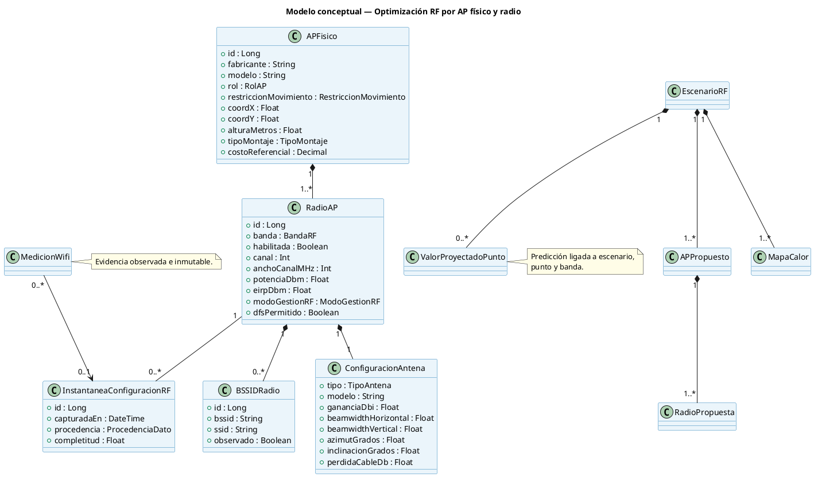

# 02 — Modelo de Dominio y Datos

## 1. Corrección estructural

El modelo vigente agrupa y recomienda principalmente por BSSID. La evolución propuesta introduce la jerarquía:

```text
AP físico 1 ── 1..* Radio AP 1 ── 0..* BSSID
```

Los BSSID detectados que todavía no hayan sido identificados pueden mantenerse sin AP físico asociado. El técnico completa la asociación antes de solicitar una optimización de alta confianza.

## 2. Modelo conceptual propuesto



## 3. Entidades y atributos mínimos

### `ap_fisico`

- `proyecto_id`, `plano_id` y, para varios pisos, identificador de planta.
- fabricante, modelo, número de inventario opcional y rol `TEMPORAL`, `EXISTENTE` o `CANDIDATO`.
- coordenadas, altura, montaje, restricción de movimiento y costo.
- fuente de información y fecha de verificación.

### `radio_ap`

- banda, estado habilitado, canal primario y ancho.
- potencia original, unidad original, referencia `IR`/`EIRP`, potencia normalizada y máximo permitido.
- modo `ESTATICO`, `RRM` o `TPC`.
- dominio regulatorio, DFS y capacidades soportadas.

### `configuracion_antena`

- interna/externa, tipo, modelo y ganancia.
- beamwidth o referencia a patrón de azimut/elevación.
- orientación, inclinación y pérdidas de cable/conectores.

### `instantanea_configuracion_rf`

Congela la configuración activa durante una captura. Una modificación posterior del inventario no altera la interpretación histórica de las mediciones.

### `escenario_rf`

- tipo de negocio, perfil de optimización, versión del motor y estado.
- restricciones de entrada normalizadas.
- métricas por banda, costo, factibilidad, advertencias y confianza.
- referencia al baseline observado utilizado.

### `ap_propuesto` y `radio_propuesta`

Separan la acción sobre el equipo físico de la configuración por banda. `radio_propuesta` contiene banda, canal, ancho, potencia, EIRP, antena y justificación.

### `valor_proyectado_punto`

| Campo                       | Descripción                                            |
| --------------------------- | ------------------------------------------------------ |
| `escenario_id`              | Alternativa que produjo la predicción                  |
| `punto_medicion_id`         | Punto real sobre el plano                              |
| `banda`                     | 2,4 o 5 GHz                                            |
| `rssi_observado_dbm`        | Snapshot comparativo; puede ser nulo en instalación nueva |
| `rssi_proyectado_dbm`       | Mejor señal estimada de la banda                       |
| `diferencia_db`             | Proyectado menos observado                             |
| `radio_primaria_id`         | Radio recomendada con mayor nivel                      |
| `radio_secundaria_id`       | Segunda radio para redundancia/roaming                 |
| `rssi_secundario_dbm`       | Nivel estimado de la radio secundaria                  |
| `snr_proyectado_db`         | Se calcula solo si existe ruido confiable              |
| `incertidumbre_db`          | Intervalo/error estimado del predictor                 |

## 4. Invariantes

1. Una radio opera en una sola banda.
2. Los BSSID son únicos dentro del inventario activo del plano.
3. Las radios de un AP propuesto comparten coordenadas y altura.
4. `MedicionWifi` no referencia directamente una propuesta futura.
5. Todo mapa proyectado pertenece a un escenario y declara banda o política combinada.
6. La potencia recomendada debe pertenecer a los niveles soportados por el modelo y respetar EIRP regional.
7. Un AP `FIJO` conserva sus coordenadas en todas las propuestas.

## 5. Compatibilidad con entidades vigentes

- `ConjuntoAPItem.bssid` continúa funcionando como selección observada, pero se resuelve hacia `BSSIDRadio` cuando exista inventario.
- `APDetectado` pasa a representar una detección provisional, no necesariamente un AP físico.
- `RecomendacionAP` se reemplaza conceptualmente por `APPropuesto` + `RadioPropuesta`; durante una migración puede mantenerse como vista de compatibilidad.
- `MapaCalor` incorpora `banda`, `politica_combinacion` y versión del predictor.

