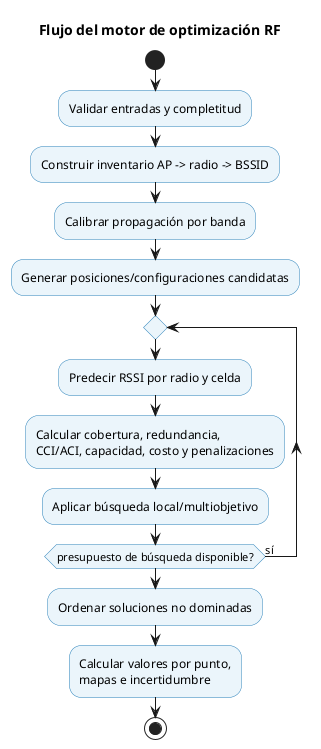

# 04 — Motor Predictivo y Optimizador

## 1. Enfoque híbrido

La solución se divide en tres responsabilidades:

1. **Predictor RF:** estima RSSI por radio y coordenada.
2. **Corrector ML:** aprende el error residual del predictor físico cuando existen datos suficientes.
3. **Optimizador:** busca posiciones y configuraciones factibles usando el predictor como función de evaluación.

El modelo de ML no sustituye las restricciones físicas ni regulatorias.

> **Implementación vigente (22-jun-2026):** el backend opera con un predictor
> FSPL/log-distance calibrable por plano. Cuando un mapa finalizado tiene APs
> ubicados, BSSID asociados y mediciones reales, el sistema ajusta parámetros
> locales por banda y usa ese predictor dentro del optimizador greedy +
> búsqueda local. El corrector ML residual queda como evolución posterior; no
> se entrena un modelo global con datos sintéticos para afirmar precisión en un
> edificio real.



## 2. Predictor físico

Baseline recomendado:

```text
RSSI = EIRP + ganancia_receptor
       - pérdida_log_distance(frecuencia, distancia, exponente)
       - suma_atenuaciones_obstáculos_por_banda
       + ajuste_patron_antena(azimut, elevación)
       + corrección_calibrada
```

La Tabla 3.1 de CWNA-107 se usa como prior de atenuación de materiales a 2,4 GHz, no como fórmula FSPL. La regla de 6 dB al duplicar distancia y las fórmulas FSPL pertenecen a la sección de pérdida en espacio libre.

La predicción se ejecuta para cada radio. El valor de una banda en una celda corresponde al máximo RSSI de sus radios elegibles, conservando también la radio primaria y secundaria.

## 3. Calibración

### Instalación nueva

Las mediciones de APs temporales con configuración conocida ajustan:

- exponente de pérdida por banda;
- atenuación efectiva de materiales;
- sesgo del dispositivo de medición;
- error residual por tipo de ambiente.

### Red existente

Se usan APs con ubicación y configuración confirmadas. Los APs no identificados pueden contribuir al diagnóstico observado, pero no a una calibración de alta confianza.

Se divide la información en calibración y validación espacial para evitar evaluar el predictor con los mismos puntos usados para ajustarlo.

## 4. Corrector ML

El corrector recibe las variables físicas y predice un residual en dB. Debe existir una comparación obligatoria contra el baseline físico:

- si mejora MAE/RMSE en validación espacial, se utiliza;
- si no mejora o faltan datos, se conserva el predictor físico;
- la versión, dataset y métricas quedan registradas en el escenario.

Los datos sintéticos sirven para pruebas y preentrenamiento, pero no justifican por sí solos la afirmación de precisión en un edificio real.

## 5. Variables del optimizador

- posición, planta, altura y orientación del AP;
- modelo y antena dentro del catálogo permitido;
- radio habilitada por banda;
- canal, ancho y potencia discreta soportada;
- acciones sobre APs existentes.

## 6. Restricciones duras

- posiciones permitidas y disponibilidad de cableado/PoE;
- APs fijos y modelos autorizados;
- presupuesto y máximo de equipos;
- canales, DFS, potencia y EIRP permitidos por región;
- radios del mismo AP en una sola posición física;
- bandas requeridas por los clientes.

Una solución que viola una restricción dura se descarta, no se compensa con mayor cobertura.

## 7. Objetivos y penalizaciones

El score multiobjetivo considera:

- porcentaje de área objetivo con RSSI suficiente por banda;
- cobertura primaria y secundaria para roaming;
- déficit de SNR cuando exista ruido confiable;
- CCI/ACI y reutilización de canales;
- capacidad estimada por densidad y perfil de aplicaciones;
- cantidad de APs, costo y número de cambios;
- exceso de potencia y celdas sobredimensionadas;
- incertidumbre del predictor.

Las ponderaciones dependen del perfil solicitado y se guardan con el escenario.

## 8. Tratamiento de bandas

### 2,4 GHz

- evaluar solamente canales permitidos y no solapados según dominio regulatorio;
- priorizar 20 MHz;
- controlar celdas sobredimensionadas y CCI;
- mantener cobertura para clientes legacy cuando sea requisito.

### 5 GHz

- diseñar como banda principal cuando el perfil lo indique;
- evaluar canales DFS únicamente si equipos y clientes lo permiten;
- penalizar anchos que reduzcan excesivamente el reuso;
- recordar que la pérdida en espacio libre es mayor que en 2,4 GHz.

### Mapa combinado

No usa simplemente el mayor RSSI entre bandas. Debe declarar una política, por ejemplo:

- `MEJOR_BANDA_COMPATIBLE`;
- `PREFERIR_5_GHZ_SI_CUMPLE_UMBRAL`;
- `SOLO_CLIENTES_DUAL_BAND`.

## 9. Incertidumbre

Cada mapa y punto proyectado incluye error estimado. El escenario presenta advertencias cuando extrapola lejos de puntos medidos, usa antenas supuestas o carece de caracterización de obstáculos.
