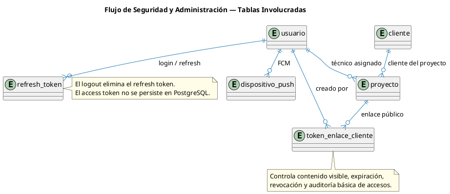
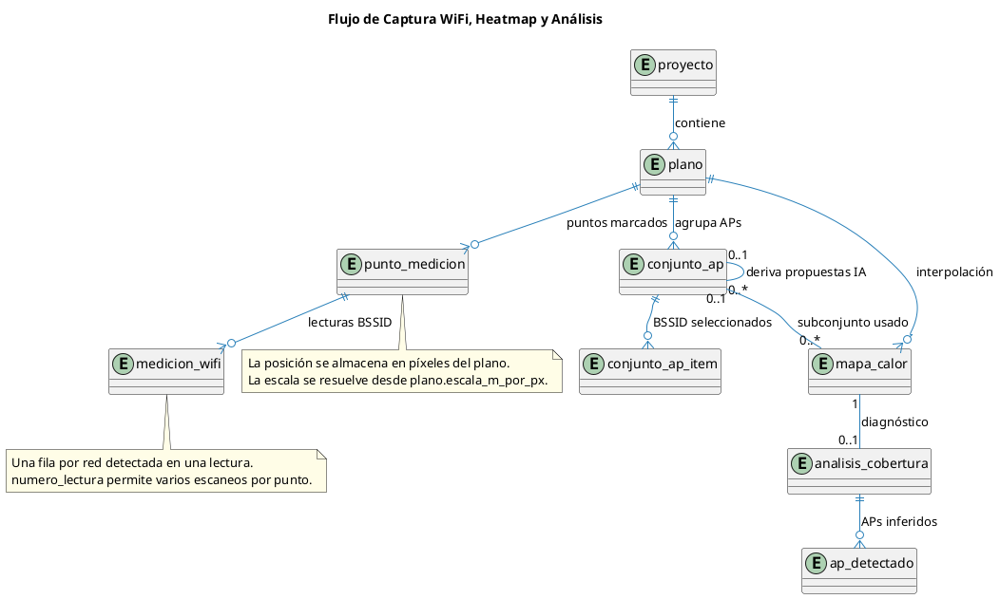
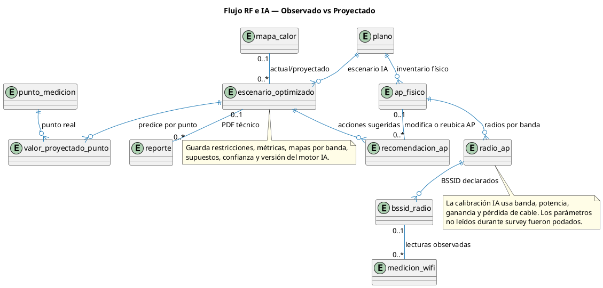
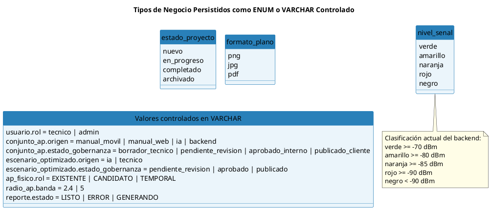

# 19 — Modelo de Base de Datos Implementado

**Fuente:** modelos SQLAlchemy en `backend/app/models/` y migraciones Alembic en `backend/alembic/versions/`
**Alcance:** esquema físico actual del backend FastAPI, persistido en PostgreSQL como única fuente de verdad.
**Propósito:** explicar cómo se organiza y fluye la información desde la base de datos implementada.

---

## 1. Lectura funcional del esquema

La base de datos está organizada alrededor de `proyecto`. Un administrador crea `usuario` y `cliente`; el técnico autenticado trabaja sus proyectos, carga `plano`, captura `punto_medicion` y `medicion_wifi`, genera `mapa_calor`, obtiene `analisis_cobertura`, arma `conjunto_ap`, registra inventario RF físico y solicita `escenario_optimizado` con recomendaciones IA. La publicación al cliente se controla mediante `token_enlace_cliente`, y las notificaciones móviles se soportan con `dispositivo_push`.

Las mediciones reales quedan separadas de las proyecciones IA:

- `punto_medicion` y `medicion_wifi` guardan observaciones capturadas desde Android.
- `ap_fisico`, `radio_ap` y `bssid_radio` describen el inventario RF necesario para calibración y escenarios IA.
- `conjunto_ap` se reutiliza para conjuntos definidos por técnico y conjuntos propuestos por IA; cuando `origen = 'ia'`, `conjunto_origen_id` identifica el conjunto técnico usado como fuente. La generación IA no debe encadenarse desde otro conjunto IA.
- `escenario_optimizado`, `recomendacion_ap` y `valor_proyectado_punto` guardan métricas, acciones sugeridas y predicciones sin modificar la medición real.

---

## 2. Diagrama físico completo

```plantuml
@startuml
!pragma layout smetana
title Esquema Físico Implementado — PostgreSQL\nWireless HeatMapper (modalidad 100 % en línea)

skinparam entityBackgroundColor #EBF5FB
skinparam entityBorderColor #2980B9
skinparam entityFontColor #1A252F
skinparam entityHeaderBackgroundColor #2980B9
skinparam entityHeaderFontColor white
skinparam arrowColor #2980B9
skinparam noteBackgroundColor #FFFDE7
skinparam noteFontColor #1A252F
hide circle

package "Seguridad, administración y portal" {
  entity "usuario" as USUARIO {
    * id : INTEGER <<PK>>
    --
    nombre : VARCHAR(120) <<NOT NULL>>
    email : VARCHAR(255) <<UNIQUE, NOT NULL>>
    password_hash : VARCHAR(255) <<NOT NULL>>
    rol : VARCHAR(30) <<DEFAULT 'tecnico'>>
    activo : BOOLEAN <<DEFAULT true>>
    ultimo_acceso : TIMESTAMPTZ
    created_at : TIMESTAMPTZ
  }

  entity "refresh_token" as REFRESH {
    * id : INTEGER <<PK>>
    --
    token : VARCHAR(64) <<UNIQUE, NOT NULL>>
    usuario_id : INTEGER <<FK, NOT NULL>>
    expires_at : TIMESTAMPTZ <<NOT NULL>>
    created_at : TIMESTAMPTZ
  }

  entity "dispositivo_push" as PUSH {
    * id : INTEGER <<PK>>
    --
    usuario_id : INTEGER <<FK, NOT NULL>>
    token : VARCHAR(512) <<UNIQUE, NOT NULL>>
    plataforma : VARCHAR(20) <<DEFAULT 'android'>>
    activo : BOOLEAN <<DEFAULT true>>
    ultimo_registro : TIMESTAMPTZ
    created_at : TIMESTAMPTZ
  }

  entity "cliente" as CLIENTE {
    * id : INTEGER <<PK>>
    --
    nombre : VARCHAR(100) <<UNIQUE, NOT NULL>>
    email_referencia : VARCHAR(255)
    activo : BOOLEAN <<DEFAULT true>>
    created_at : TIMESTAMPTZ
  }

  entity "token_enlace_cliente" as TOKEN_CLIENTE {
    * id : INTEGER <<PK>>
    --
    proyecto_id : INTEGER <<FK, NOT NULL>>
    token : VARCHAR(160) <<UNIQUE, NOT NULL>>
    contenido : JSON <<NOT NULL>>
    expira_en : TIMESTAMPTZ <<NOT NULL>>
    revocado : BOOLEAN <<DEFAULT false>>
    creado_por_id : INTEGER <<FK, NULL>>
    accesos : INTEGER <<DEFAULT 0>>
    ultimo_acceso : TIMESTAMPTZ
    ip_ultimo_acceso : VARCHAR(80)
    created_at : TIMESTAMPTZ
  }
}

package "Proyecto, planos y captura" {
  entity "proyecto" as PROYECTO {
    * id : INTEGER <<PK>>
    --
    nombre : VARCHAR(200) <<NOT NULL>>
    descripcion : VARCHAR(500)
    cliente_id : INTEGER <<FK, NULL>>
    estado : estado_proyecto <<DEFAULT 'nuevo'>>
    tecnico_id : INTEGER <<FK, NOT NULL>>
    ultima_actividad : TIMESTAMPTZ
    cantidad_puntos : INTEGER <<DEFAULT 0>>
    created_at : TIMESTAMPTZ
  }

  entity "plano" as PLANO {
    * id : INTEGER <<PK>>
    --
    proyecto_id : INTEGER <<FK, NOT NULL>>
    nombre : VARCHAR(255) <<NOT NULL>>
    descripcion : VARCHAR(500)
    formato : formato_plano <<NOT NULL>>
    ruta_storage : VARCHAR(500) <<UNIQUE, NOT NULL>>
    ancho_px : INTEGER <<NOT NULL>>
    alto_px : INTEGER <<NOT NULL>>
    tamano_bytes : INTEGER <<NOT NULL>>
    calibracion_x1 : FLOAT
    calibracion_y1 : FLOAT
    calibracion_x2 : FLOAT
    calibracion_y2 : FLOAT
    distancia_real_m : FLOAT
    escala_m_por_px : FLOAT
    poligono_interes : JSON
    created_at : TIMESTAMPTZ
    updated_at : TIMESTAMPTZ
  }

  entity "punto_medicion" as PUNTO {
    * id : INTEGER <<PK>>
    --
    plano_id : INTEGER <<FK, NOT NULL>>
    pos_x : FLOAT <<NOT NULL>>
    pos_y : FLOAT <<NOT NULL>>
    nivel : nivel_senal <<NOT NULL>>
    created_at : TIMESTAMPTZ
  }

  entity "medicion_wifi" as MEDICION {
    * id : INTEGER <<PK>>
    --
    punto_id : INTEGER <<FK, NOT NULL>>
    ssid : VARCHAR(255) <<NOT NULL>>
    bssid : VARCHAR(17) <<NOT NULL>>
    rssi : INTEGER <<NOT NULL>>
    canal : INTEGER
    frecuencia_mhz : INTEGER
    nivel : nivel_senal <<NOT NULL>>
    numero_lectura : INTEGER <<DEFAULT 1>>
    created_at : TIMESTAMPTZ
  }
}

package "Heatmap, análisis y conjuntos de AP" {
  entity "conjunto_ap" as CONJUNTO {
    * id : INTEGER <<PK>>
    --
    plano_id : INTEGER <<FK, NOT NULL>>
    conjunto_origen_id : INTEGER <<FK, NULL>>
    nombre : VARCHAR(100) <<NOT NULL>>
    proposito : VARCHAR(255) <<NOT NULL>>
    descripcion : TEXT
    es_principal : BOOLEAN <<DEFAULT false>>
    origen : VARCHAR(30) <<DEFAULT 'manual_movil'>>
    estado_gobernanza : VARCHAR(30) <<DEFAULT 'borrador_tecnico'>>
    creado_por_id : INTEGER <<FK, NULL>>
    created_at : TIMESTAMPTZ
    updated_at : TIMESTAMPTZ
  }

  entity "conjunto_ap_item" as CONJUNTO_ITEM {
    * id : INTEGER <<PK>>
    --
    conjunto_ap_id : INTEGER <<FK, NOT NULL>>
    bssid : VARCHAR(17) <<NOT NULL>>
    ssid_snapshot : VARCHAR(255)
    canal_snapshot : INTEGER
    rssi_promedio_snapshot : FLOAT
    pos_x : FLOAT
    pos_y : FLOAT
  }

  entity "mapa_calor" as MAPA {
    * id : INTEGER <<PK>>
    --
    plano_id : INTEGER <<FK, NOT NULL>>
    conjunto_ap_id : INTEGER <<FK, NULL>>
    algoritmo : VARCHAR(20) <<DEFAULT 'IDW'>>
    resolucion : INTEGER <<DEFAULT 128>>
    modo_generacion : VARCHAR(20) <<DEFAULT 'SUBCONJUNTO'>>
    bssid : VARCHAR(17) <<NOT NULL>>
    ssid : VARCHAR(255) <<NOT NULL>>
    ap_pos_x : FLOAT <<NOT NULL>>
    ap_pos_y : FLOAT <<NOT NULL>>
    aps_interes : JSON
    bssids_generacion : JSON
    matriz : JSON <<NOT NULL>>
    escala : JSON <<NOT NULL>>
    ruta_imagen : VARCHAR(500) <<UNIQUE, NOT NULL>>
    cantidad_puntos : INTEGER <<NOT NULL>>
    rssi_min : FLOAT <<NOT NULL>>
    rssi_max : FLOAT <<NOT NULL>>
    firma_mediciones : VARCHAR(120) <<NOT NULL>>
    created_at : TIMESTAMPTZ
  }

  entity "analisis_cobertura" as ANALISIS {
    * id : INTEGER <<PK>>
    --
    mapa_calor_id : INTEGER <<UNIQUE, FK, NOT NULL>>
    pct_cobertura : FLOAT <<NOT NULL>>
    pct_zonas_muertas : FLOAT <<NOT NULL>>
    celdas_zonas_muertas : INTEGER <<NOT NULL>>
    cantidad_solapamientos : INTEGER <<NOT NULL>>
    cantidad_interferencias : INTEGER <<NOT NULL>>
    hallazgos : JSON <<NOT NULL>>
    resumen : TEXT <<NOT NULL>>
    created_at : TIMESTAMPTZ
  }

  entity "ap_detectado" as AP_DETECTADO {
    * id : INTEGER <<PK>>
    --
    analisis_id : INTEGER <<FK, NOT NULL>>
    bssid : VARCHAR(17) <<NOT NULL>>
    ssid : VARCHAR(255) <<NOT NULL>>
    canal : INTEGER
    frecuencia_mhz : INTEGER
    rssi_promedio : FLOAT <<NOT NULL>>
    pos_x : FLOAT <<NOT NULL>>
    pos_y : FLOAT <<NOT NULL>>
    confirmado : BOOLEAN <<DEFAULT false>>
    created_at : TIMESTAMPTZ
  }
}

package "Inventario RF físico" {
  entity "ap_fisico" as AP_FISICO {
    * id : INTEGER <<PK>>
    --
    plano_id : INTEGER <<FK, NOT NULL>>
    nombre : VARCHAR(100) <<NOT NULL>>
    fabricante : VARCHAR(100) <<NOT NULL>>
    modelo : VARCHAR(120) <<NOT NULL>>
    rol : VARCHAR(20) <<DEFAULT 'EXISTENTE'>>
    restriccion_movimiento : VARCHAR(20) <<DEFAULT 'MOVIBLE'>>
    coord_x : FLOAT <<NOT NULL>>
    coord_y : FLOAT <<NOT NULL>>
    altura_m : FLOAT <<DEFAULT 2.5>>
    tipo_montaje : VARCHAR(30) <<DEFAULT 'TECHO'>>
    verificado : BOOLEAN <<DEFAULT false>>
    created_at : TIMESTAMPTZ
    updated_at : TIMESTAMPTZ
  }

  entity "radio_ap" as RADIO {
    * id : INTEGER <<PK>>
    --
    ap_fisico_id : INTEGER <<FK, NOT NULL>>
    banda : VARCHAR(10) <<NOT NULL>>
    habilitada : BOOLEAN <<DEFAULT true>>
    canal : INTEGER <<NOT NULL>>
    ancho_canal_mhz : INTEGER <<DEFAULT 20>>
    referencia_potencia : VARCHAR(15) <<DEFAULT 'IR'>>
    potencia_dbm : FLOAT <<NOT NULL>>
    potencia_max_dbm : FLOAT <<NOT NULL>>
    tipo_antena : VARCHAR(30) <<DEFAULT 'OMNIDIRECCIONAL'>>
    ganancia_dbi : FLOAT <<DEFAULT 2.14>>
    perdida_cable_db : FLOAT <<DEFAULT 0.0>>
    created_at : TIMESTAMPTZ
  }

  entity "bssid_radio" as BSSID_RADIO {
    * id : INTEGER <<PK>>
    --
    radio_id : INTEGER <<FK, NOT NULL>>
    bssid : VARCHAR(17) <<UNIQUE, NOT NULL>>
    ssid : VARCHAR(255) <<NOT NULL>>
  }
}

package "IA, escenarios y reportes" {
  entity "escenario_optimizado" as ESCENARIO {
    * id : INTEGER <<PK>>
    --
    proyecto_id : INTEGER <<FK, NOT NULL>>
    plano_id : INTEGER <<FK, NOT NULL>>
    mapa_actual_id : INTEGER <<FK, NULL>>
    mapa_proyectado_id : INTEGER <<FK, NULL>>
    conjunto_base_id : INTEGER <<FK, NULL>>
    origen : VARCHAR(30) <<DEFAULT 'ia'>>
    estado_gobernanza : VARCHAR(30) <<DEFAULT 'pendiente_revision'>>
    generado_por_id : INTEGER <<FK, NULL>>
    aprobado_por_id : INTEGER <<FK, NULL>>
    publicado_por_id : INTEGER <<FK, NULL>>
    aprobado_at : TIMESTAMPTZ
    publicado_at : TIMESTAMPTZ
    nombre : VARCHAR(120) <<NOT NULL>>
    tipo_negocio : VARCHAR(30) <<DEFAULT 'INSTALACION_NUEVA'>>
    perfil : VARCHAR(40) <<DEFAULT 'COBERTURA_EQUILIBRADA'>>
    politica_combinacion : VARCHAR(50)
    banda : VARCHAR(10) <<DEFAULT '5'>>
    bandas : JSON <<NOT NULL>>
    modelo_ap : VARCHAR(120) <<NOT NULL>>
    pct_cobertura_actual : FLOAT <<DEFAULT 0>>
    pct_cobertura : FLOAT <<NOT NULL>>
    costo_estimado : FLOAT <<DEFAULT 0>>
    cantidad_aps : INTEGER <<NOT NULL>>
    resumen : TEXT <<NOT NULL>>
    restricciones : JSON <<NOT NULL>>
    metricas : JSON <<NOT NULL>>
    mapas_por_banda : JSON <<NOT NULL>>
    mapas_actuales_por_banda : JSON <<NOT NULL>>
    supuestos : JSON <<NOT NULL>>
    confianza : VARCHAR(15) <<DEFAULT 'MEDIA'>>
    version_motor : VARCHAR(30) <<DEFAULT 'rf-hibrido-1.0'>>
    created_at : TIMESTAMPTZ
  }

  entity "recomendacion_ap" as RECOMENDACION {
    * id : INTEGER <<PK>>
    --
    escenario_id : INTEGER <<FK, NOT NULL>>
    orden : INTEGER <<DEFAULT 1>>
    ap_fisico_id : INTEGER <<FK, NULL>>
    accion : VARCHAR(30) <<NOT NULL>>
    coord_x : FLOAT <<NOT NULL>>
    coord_y : FLOAT <<NOT NULL>>
    altura_m : FLOAT <<DEFAULT 2.5>>
    tipo_montaje : VARCHAR(30) <<DEFAULT 'TECHO'>>
    banda : VARCHAR(10) <<DEFAULT '5'>>
    modelo_ap : VARCHAR(120) <<NOT NULL>>
    costo_estimado : FLOAT <<DEFAULT 0>>
    rssi_proyectado : FLOAT <<NOT NULL>>
    radios : JSON <<NOT NULL>>
    justificacion : TEXT <<NOT NULL>>
  }

  entity "valor_proyectado_punto" as VALOR_PROYECTADO {
    * id : INTEGER <<PK>>
    --
    escenario_id : INTEGER <<FK, NOT NULL>>
    punto_medicion_id : INTEGER <<FK, NOT NULL>>
    banda : VARCHAR(10) <<NOT NULL>>
    rssi_observado_dbm : FLOAT
    rssi_proyectado_dbm : FLOAT <<NOT NULL>>
    diferencia_db : FLOAT
    radio_primaria : VARCHAR(80) <<NOT NULL>>
    radio_secundaria : VARCHAR(80)
    rssi_secundario_dbm : FLOAT
    snr_proyectado_db : FLOAT
    incertidumbre_db : FLOAT <<DEFAULT 6.0>>
  }

  entity "reporte" as REPORTE {
    * id : INTEGER <<PK>>
    --
    proyecto_id : INTEGER <<FK, NOT NULL>>
    escenario_id : INTEGER <<FK, NULL>>
    estado : VARCHAR(20) <<DEFAULT 'LISTO'>>
    ruta_pdf : VARCHAR(500) <<UNIQUE, NULL>>
    sha256 : VARCHAR(64)
    tamanio_bytes : INTEGER <<DEFAULT 0>>
    error : TEXT
    created_at : TIMESTAMPTZ
    updated_at : TIMESTAMPTZ
  }
}

USUARIO ||--o{ REFRESH : "autentica"
USUARIO ||--o{ PUSH : "recibe notificaciones"
USUARIO ||--o{ PROYECTO : "tecnico_id"
USUARIO ||--o{ CONJUNTO : "creado_por_id"
USUARIO ||--o{ TOKEN_CLIENTE : "creado_por_id"
USUARIO ||--o{ ESCENARIO : "generado/aprobado/publicado"

CLIENTE ||--o{ PROYECTO : "cliente_id"
PROYECTO ||--o{ PLANO : "proyecto_id"
PROYECTO ||--o{ ESCENARIO : "proyecto_id"
PROYECTO ||--o{ REPORTE : "proyecto_id"
PROYECTO ||--o{ TOKEN_CLIENTE : "proyecto_id"

PLANO ||--o{ PUNTO : "plano_id"
PUNTO ||--o{ MEDICION : "punto_id"

PLANO ||--o{ CONJUNTO : "plano_id"
CONJUNTO "0..1" -- "0..*" CONJUNTO : "conjunto_origen_id"
CONJUNTO ||--o{ CONJUNTO_ITEM : "conjunto_ap_id"
CONJUNTO ||--o{ MAPA : "conjunto_ap_id"
PLANO ||--o{ MAPA : "plano_id"
MAPA "1" -- "0..1" ANALISIS : "mapa_calor_id"
ANALISIS ||--o{ AP_DETECTADO : "analisis_id"

PLANO ||--o{ AP_FISICO : "plano_id"
AP_FISICO ||--o{ RADIO : "ap_fisico_id"
RADIO ||--o{ BSSID_RADIO : "radio_id"

PLANO ||--o{ ESCENARIO : "plano_id"
MAPA "0..1" -- "0..*" ESCENARIO : "mapa_actual/proyectado"
CONJUNTO "0..1" -- "0..*" ESCENARIO : "conjunto_base_id"
ESCENARIO ||--o{ RECOMENDACION : "escenario_id"
ESCENARIO ||--o{ VALOR_PROYECTADO : "escenario_id"
PUNTO ||--o{ VALOR_PROYECTADO : "punto_medicion_id"
AP_FISICO "0..1" -- "0..*" RECOMENDACION : "ap_fisico_id"
ESCENARIO "0..1" -- "0..*" REPORTE : "escenario_id"

note bottom of MEDICION
  Nivel RSSI implementado:
  verde >= -70 dBm
  amarillo >= -80 dBm
  naranja >= -85 dBm
  rojo >= -90 dBm
  negro < -90 dBm
end note

note bottom of MAPA
  La cache se controla con:
  UNIQUE(plano_id, algoritmo, resolucion, firma_mediciones).
  La imagen se referencia por ruta_storage/ruta_imagen;
  no se guarda el binario en PostgreSQL.
end note

note bottom of VALOR_PROYECTADO
  Predicción por escenario, punto real y banda.
  No reemplaza la medición observada.
end note
@enduml
```

---

## 3. Flujos principales de persistencia

### 3.1 Administración y autenticación

### 3.2 Captura, heatmap y análisis

### 3.3 Inventario RF e IA

---

## 4. Restricciones e índices relevantes

| Tabla                     | Restricción / índice                                               | Uso principal                                  |
| ------------------------- | ------------------------------------------------------------------ | ---------------------------------------------- |
| `usuario`                 | `UNIQUE(email)`                                                    | Evitar cuentas duplicadas y resolver login     |
| `refresh_token`           | `UNIQUE(token)`, `INDEX(usuario_id)`                               | Rotación y revocación de sesión                |
| `dispositivo_push`        | `UNIQUE(token)`, `INDEX(usuario_id)`, `INDEX(activo)`              | Envío de notificaciones FCM                    |
| `cliente`                 | `UNIQUE(nombre)`                                                   | Catálogo administrado sin duplicados           |
| `proyecto`                | `INDEX(tecnico_id)`, `INDEX(cliente_id)`                           | Listados por técnico y cliente                 |
| `plano`                   | `UNIQUE(ruta_storage)`, `INDEX(proyecto_id)`                       | Archivos de plano por proyecto                 |
| `punto_medicion`          | `INDEX(plano_id)`                                                  | Consulta de puntos para captura y heatmap      |
| `medicion_wifi`           | `INDEX(punto_id)`                                                  | Lecturas por punto                             |
| `conjunto_ap`             | `UNIQUE(plano_id, nombre)`, `INDEX(conjunto_origen_id)`            | Conjuntos nombrados por plano y derivados IA   |
| `conjunto_ap_item`        | `UNIQUE(conjunto_ap_id, bssid)`, `INDEX(bssid)`                    | Evitar AP duplicado dentro del conjunto        |
| `mapa_calor`              | `UNIQUE(plano_id, algoritmo, resolucion, firma_mediciones)`        | Cache de heatmaps reproducibles                |
| `analisis_cobertura`      | `UNIQUE(mapa_calor_id)`                                            | Un diagnóstico vigente por mapa                |
| `radio_ap`                | `UNIQUE(ap_fisico_id, banda)`                                      | Un radio por banda en cada AP físico           |
| `bssid_radio`             | `UNIQUE(bssid)`                                                    | Un BSSID pertenece a un solo radio declarado   |
| `valor_proyectado_punto`  | `UNIQUE(escenario_id, punto_medicion_id, banda)`                   | Una predicción por punto, escenario y banda    |
| `reporte`                 | `UNIQUE(ruta_pdf)`                                                 | Un archivo PDF persistido por ruta             |
| `token_enlace_cliente`    | `UNIQUE(token)`, índices por `proyecto_id`, `expira_en`, `revocado` | Validación rápida de enlaces públicos          |

---

## 5. Reglas de borrado y conservación

| Relación                                      | Regla implementada              | Efecto funcional                                      |
| --------------------------------------------- | ------------------------------- | ----------------------------------------------------- |
| `usuario` → `refresh_token`                   | `ON DELETE CASCADE`             | Al borrar usuario se eliminan sus sesiones persistidas |
| `usuario` → `dispositivo_push`                | `ON DELETE CASCADE`             | Se eliminan tokens FCM asociados                      |
| `proyecto` → `plano`                          | `ON DELETE CASCADE`             | Borrar proyecto elimina planos y datos dependientes   |
| `plano` → `punto_medicion`                    | `ON DELETE CASCADE`             | Borrar plano elimina puntos y mediciones              |
| `punto_medicion` → `medicion_wifi`            | `ON DELETE CASCADE`             | Borrar punto elimina lecturas WiFi                    |
| `plano` → `mapa_calor`                        | `ON DELETE CASCADE`             | Borrar plano elimina heatmaps                         |
| `mapa_calor` → `analisis_cobertura`           | `ON DELETE CASCADE`             | Borrar mapa elimina su diagnóstico                    |
| `analisis_cobertura` → `ap_detectado`         | `ON DELETE CASCADE`             | Borrar análisis elimina APs inferidos                 |
| `plano` → `conjunto_ap`                       | `ON DELETE CASCADE`             | Borrar plano elimina conjuntos                        |
| `conjunto_ap` → `conjunto_ap`                 | `ON DELETE SET NULL`            | Si se borra el conjunto fuente, la propuesta IA conserva sus datos |
| `conjunto_ap` → `conjunto_ap_item`            | `ON DELETE CASCADE`             | Borrar conjunto elimina sus APs seleccionados         |
| `plano` → `ap_fisico`                         | `ON DELETE CASCADE`             | Borrar plano elimina inventario RF del plano          |
| `ap_fisico` → `radio_ap`                      | `ON DELETE CASCADE`             | Borrar AP elimina radios                              |
| `radio_ap` → `bssid_radio`                    | `ON DELETE CASCADE`             | Borrar radio elimina sus BSSID declarados             |
| `proyecto` → `escenario_optimizado`           | `ON DELETE CASCADE`             | Borrar proyecto elimina escenarios IA                 |
| `escenario_optimizado` → `recomendacion_ap`   | `ON DELETE CASCADE`             | Borrar escenario elimina recomendaciones              |
| `escenario_optimizado` → `valor_proyectado_punto` | `ON DELETE CASCADE`          | Borrar escenario elimina predicciones                 |
| `proyecto` → `reporte`                        | `ON DELETE RESTRICT`            | No se borra proyecto si conserva reportes asociados   |
| `proyecto` → `token_enlace_cliente`           | `ON DELETE CASCADE`             | Borrar proyecto invalida enlaces públicos             |

---

## 6. Tipos y valores de negocio usados

---

## 7. Resumen por módulo

| Módulo                         | Tablas principales                                                                 | Qué resuelve                                                        |
| ------------------------------ | ---------------------------------------------------------------------------------- | ------------------------------------------------------------------- |
| Seguridad y administración     | `usuario`, `refresh_token`, `dispositivo_push`, `cliente`                          | Acceso, roles, sesiones, técnicos, clientes y notificaciones         |
| Proyecto y planos              | `proyecto`, `plano`                                                                | Estructura de trabajo y metadatos de archivos de plano              |
| Captura WiFi                   | `punto_medicion`, `medicion_wifi`                                                  | Observaciones reales sobre posiciones del plano                     |
| Heatmap y análisis             | `mapa_calor`, `analisis_cobertura`, `ap_detectado`                                 | Interpolación, diagnóstico y APs inferidos                          |
| Conjuntos de AP                | `conjunto_ap`, `conjunto_ap_item`                                                  | Selección técnica y propuestas IA derivadas por propósito            |
| Inventario RF                  | `ap_fisico`, `radio_ap`, `bssid_radio`                                             | Modelo físico AP → radio → BSSID para calibración IA                |
| IA y escenarios                | `escenario_optimizado`, `recomendacion_ap`, `valor_proyectado_punto`               | Métricas, acciones sugeridas y predicciones sin alterar mediciones reales |
| Reportes y portal cliente      | `reporte`, `token_enlace_cliente`                                                  | PDF técnico y publicación controlada al cliente                     |
