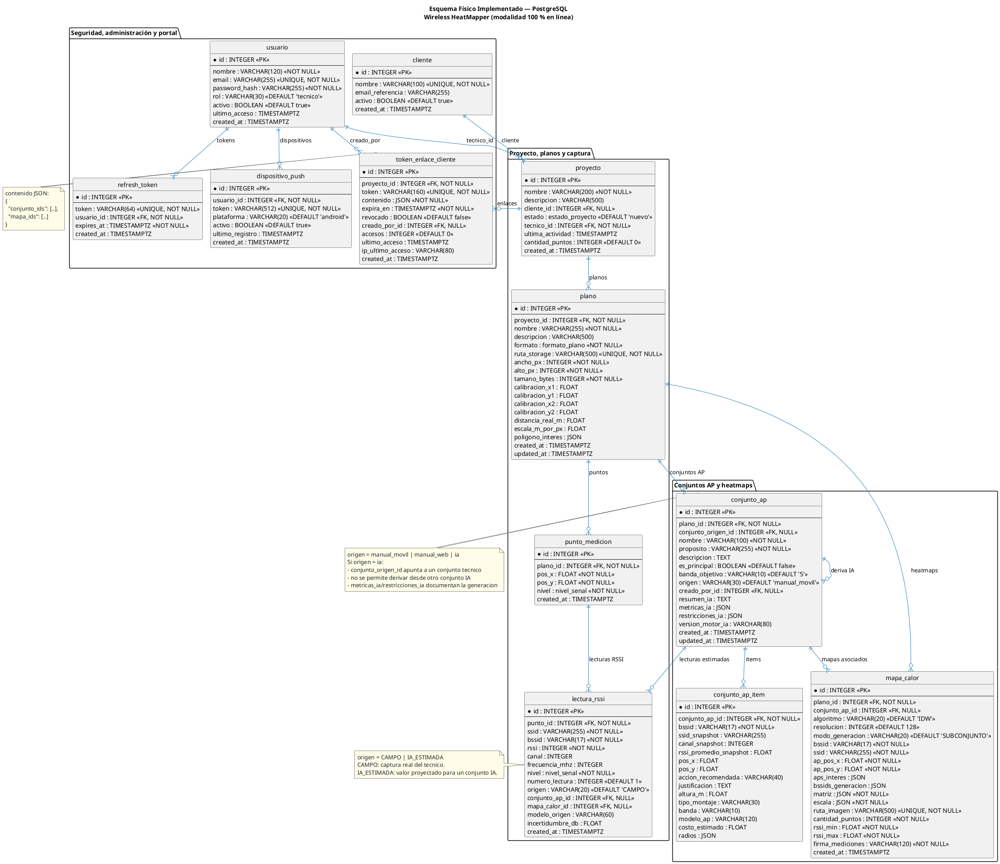

# 19 — Modelo de Base de Datos Implementado

**Fuente:** modelos SQLAlchemy en `backend/app/models/` y migraciones Alembic en `backend/alembic/versions/`
**Alcance:** esquema físico actual del backend FastAPI, persistido en PostgreSQL como única fuente de verdad.
**Propósito:** explicar cómo se organiza y fluye la información desde la base de datos implementada.

---

## 1. Lectura funcional del esquema

La base de datos está organizada alrededor de `proyecto`. Un administrador gestiona `usuario` y `cliente`; el técnico trabaja sobre `plano`, captura `punto_medicion` y `lectura_rssi`, define `conjunto_ap` con los APs relevantes del proyecto y genera `mapa_calor`. El portal cliente se controla con `token_enlace_cliente`, cuyo contenido selecciona explícitamente conjuntos y mapas.

La generación IA ya no persiste entidades separadas de escenario, recomendación, valores proyectados, diagnóstico o reporte. La regla vigente es:

- Un conjunto AP de origen `ia` nace desde un único `conjunto_ap` técnico mediante `conjunto_origen_id`.
- El conjunto IA reutiliza la misma estructura de `conjunto_ap` y `conjunto_ap_item`.
- Los metadatos propios de IA se guardan en columnas opcionales del conjunto y de sus items.
- La IA materializa lecturas `IA_ESTIMADA` en `lectura_rssi` para su conjunto derivado.
- El heatmap proyectado se genera con IDW sobre esas lecturas estimadas y se guarda como `mapa_calor` asociado al conjunto IA.
- La publicación al cliente no depende de estados de aprobación; depende del contenido explícito en `token_enlace_cliente`.

Tablas eliminadas por no responder al negocio vigente:

- `analisis_cobertura` y `ap_detectado`: no se realizará diagnóstico persistido.
- `escenario_optimizado`, `recomendacion_ap` y `valor_proyectado_punto`: la propuesta IA se modela como conjuntos AP derivados.
- `reporte`: no se exportará PDF desde el sistema.
- `estado_gobernanza` en conjuntos AP: el proyecto no mantiene flujo de aprobación/publicación por estado.
- `ap_fisico`, `radio_ap` y `bssid_radio`: se elimina el inventario RF físico; la optimización trabaja con conjuntos AP y lecturas RSSI reales/estimadas.

---

## 2. Diagrama físico completo

---

## 3. Reglas de integridad relevantes

| Tabla                    | Restricción / índice                                      | Sentido funcional                                    |
| ------------------------ | --------------------------------------------------------- | ---------------------------------------------------- |
| `usuario`                | `UNIQUE(email)`                                           | Login único                                         |
| `cliente`                | `UNIQUE(nombre)`                                          | Evita duplicidad de clientes                        |
| `plano`                  | `UNIQUE(ruta_storage)`                                    | Cada archivo cargado tiene una ruta única           |
| `lectura_rssi`           | `INDEX(origen)`, `INDEX(conjunto_ap_id)`                   | Separa lecturas reales y estimadas                  |
| `conjunto_ap_item`       | `UNIQUE(conjunto_ap_id, bssid)`                           | Un AP no se repite dentro del mismo conjunto        |
| `mapa_calor`             | `UNIQUE(ruta_imagen)`                                     | Cada imagen generada tiene almacenamiento único     |
| `token_enlace_cliente`   | `UNIQUE(token)`                                           | El portal público se resuelve por token no repetido |

---

## 4. Reglas de borrado

| Relación                         | Acción                         | Efecto esperado                                         |
| -------------------------------- | ------------------------------ | ------------------------------------------------------- |
| `proyecto` → `plano`             | `ON DELETE CASCADE`            | Borrar proyecto elimina planos                          |
| `plano` → `punto_medicion`       | `ON DELETE CASCADE`            | Borrar plano elimina puntos y lecturas asociadas        |
| `punto_medicion` → `lectura_rssi`  | `ON DELETE CASCADE`          | Borrar punto elimina lecturas RSSI                      |
| `conjunto_ap` → `lectura_rssi`     | `ON DELETE CASCADE`          | Borrar conjunto IA elimina lecturas estimadas           |
| `plano` → `conjunto_ap`          | `ON DELETE CASCADE`            | Borrar plano elimina conjuntos técnicos e IA            |
| `conjunto_ap` → `conjunto_ap_item` | `ON DELETE CASCADE`          | Borrar conjunto elimina sus APs                         |
| `conjunto_ap.conjunto_origen_id` | `ON DELETE SET NULL`           | Si se borra la fuente, la propuesta IA conserva datos   |
| `plano` → `mapa_calor`           | `ON DELETE CASCADE`            | Borrar plano elimina mapas                              |
| `conjunto_ap` → `mapa_calor`     | `ON DELETE SET NULL`           | Borrar conjunto conserva mapas históricos sin vínculo   |
| `proyecto` → `token_enlace_cliente` | `ON DELETE CASCADE`         | Borrar proyecto elimina enlaces públicos                |

---

## 5. Flujo de datos vigente

1. El técnico captura mediciones desde Android.
2. El backend persiste `punto_medicion` y `lectura_rssi` con `origen = CAMPO`.
3. El técnico selecciona los APs relevantes y crea un `conjunto_ap` de origen `manual_movil` o `manual_web`.
4. El backend genera `mapa_calor` desde un conjunto completo, subconjunto o AP individual.
5. La web solicita recomendaciones IA desde un único conjunto técnico.
6. La IA crea uno o más `conjunto_ap` de origen `ia`, cada uno con `conjunto_origen_id` apuntando al conjunto técnico.
7. La IA estima lecturas RSSI para cada AP recomendado y las persiste como `lectura_rssi.origen = IA_ESTIMADA`.
8. Cada mapa proyectado se interpola con IDW desde esas lecturas estimadas y se persiste como `mapa_calor` asociado al conjunto IA.
9. El administrador crea un enlace cliente seleccionando `conjunto_ids` y `mapa_ids`.
10. El portal cliente solo lee lo incluido en `token_enlace_cliente.contenido`.

---

## 6. Resumen ejecutivo

| Área funcional            | Tablas vigentes                                            | Responsabilidad                                      |
| ------------------------- | ---------------------------------------------------------- | ---------------------------------------------------- |
| Seguridad y usuarios      | `usuario`, `refresh_token`, `dispositivo_push`             | Acceso, sesión y notificaciones                      |
| Cliente y proyecto        | `cliente`, `proyecto`                                      | Organización del trabajo                            |
| Captura en campo          | `plano`, `punto_medicion`, `lectura_rssi`                  | Observaciones reales del relevamiento WiFi          |
| Conjuntos AP              | `conjunto_ap`, `conjunto_ap_item`                          | APs relevantes técnicos y propuestas IA derivadas   |
| Heatmaps                  | `mapa_calor`                                               | Mapas reales/proyectados asociados a conjuntos      |
| Lecturas IA               | `lectura_rssi` con `origen = IA_ESTIMADA`                  | Valores proyectados usados por IDW                  |
| Portal cliente            | `token_enlace_cliente`                                     | Publicación explícita por enlace                    |
