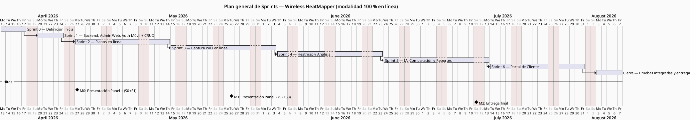
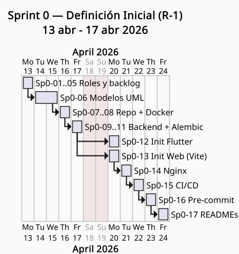
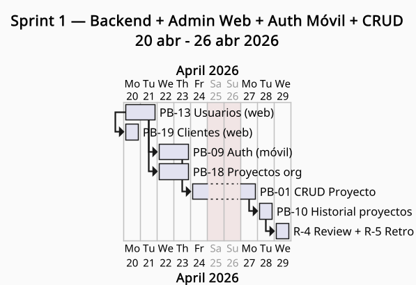
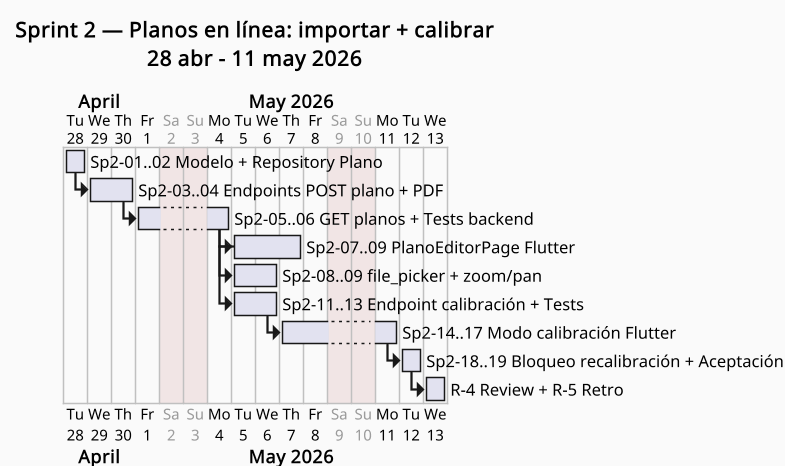
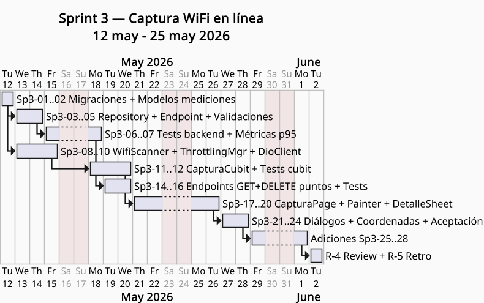

## Cronograma

La planificación temporal del proyecto se organiza en **siete iteraciones** alineadas con el marco Scrum: un Sprint inicial de definición (Sprint 0, una semana), seis Sprints de desarrollo de dos semanas (Sprints 1 al 6) y una semana de cierre para pruebas integradas y entrega final.

A continuación se presentan los Diagramas de Gantt correspondientes a la totalidad de los Sprints del proyecto, con énfasis en los Sprints 2 y 3 desarrollados durante el segundo período.

### Diagrama de Gantt — Plan general

> _Figura 4: Diagrama de Gantt general — distribución de Sprints del Wireless HeatMapper, abril–julio 2026._

### Diagrama de Gantt — Sprint 0 (Definición Inicial)

> _Figura 5: Diagrama de Gantt — Sprint 0 (Definición Inicial), 13–17 abril 2026._

### Diagrama de Gantt — Sprint 1 (Fundación CRUD)

> _Figura 6: Diagrama de Gantt — Sprint 1 (Fundación CRUD), 20–26 abril 2026._

### Diagrama de Gantt — Sprint 2 (Planos en línea)

> _Figura 7: Diagrama de Gantt — Sprint 2 (Planos en línea), 28 abril–11 mayo 2026._

### Diagrama de Gantt — Sprint 3 (Captura WiFi en línea)

> _Figura 8: Diagrama de Gantt — Sprint 3 (Captura WiFi en línea), 12–25 mayo 2026._

### Sprints planificados (4 al 6)

| Sprint   | Período             | HU                  | PHU | Objetivo del Sprint                                                |
| -------- | ------------------- | ------------------- | --: | ------------------------------------------------------------------ |
| Sprint 4 | 26 may – 8 jun 2026 | PB-05, PB-06        |  26 | Heatmap (interpolación backend) + análisis automático de cobertura |
| Sprint 5 | 9 jun – 22 jun 2026 | PB-07, PB-12, PB-08 |  42 | IA, comparación de escenarios y exportación de reportes            |
| Sprint 6 | 23 jun – 6 jul 2026 | PB-15, PB-16, PB-17 |  26 | Portal de cliente y enlace único                                   |
| Cierre   | 7 jul – 11 jul 2026 | RP6 + integración   |   — | Pruebas integradas, ajustes finales y entrega                      |

**Total acumulado Sprints 1–3 = 66 PHU implementados.**
**Total proyectado Sprints 1–6 = 160 PHU.**
