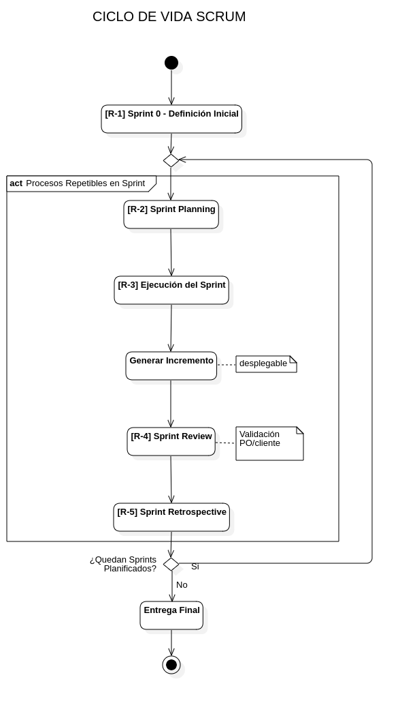
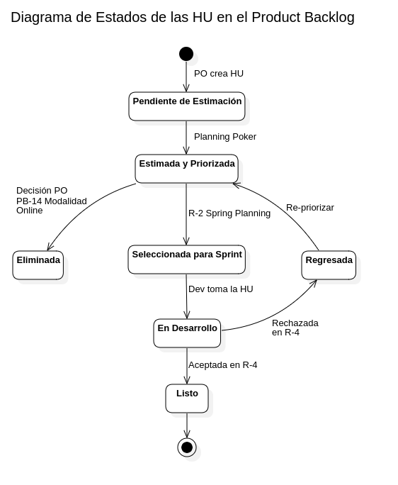
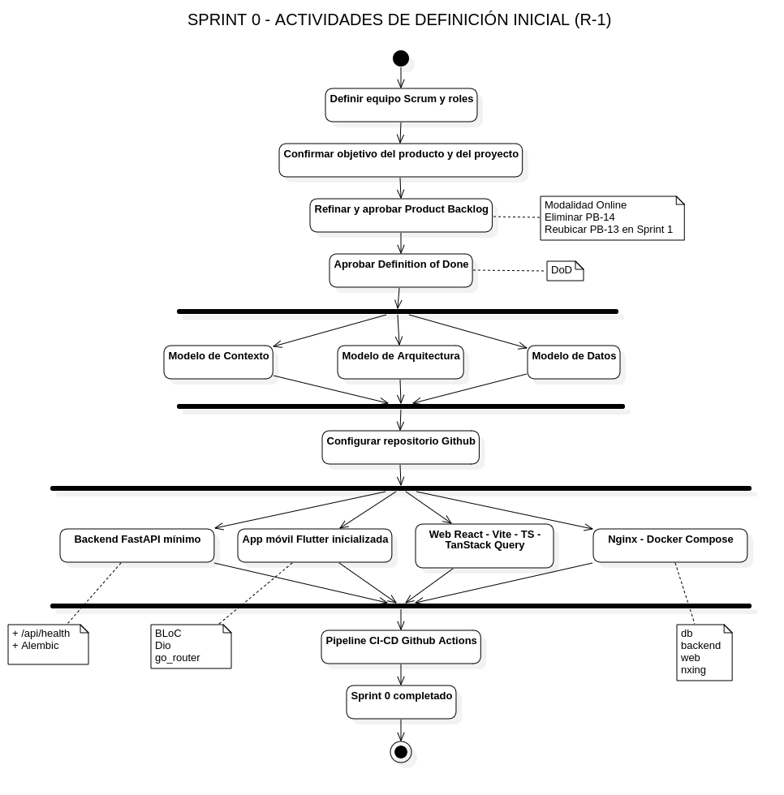
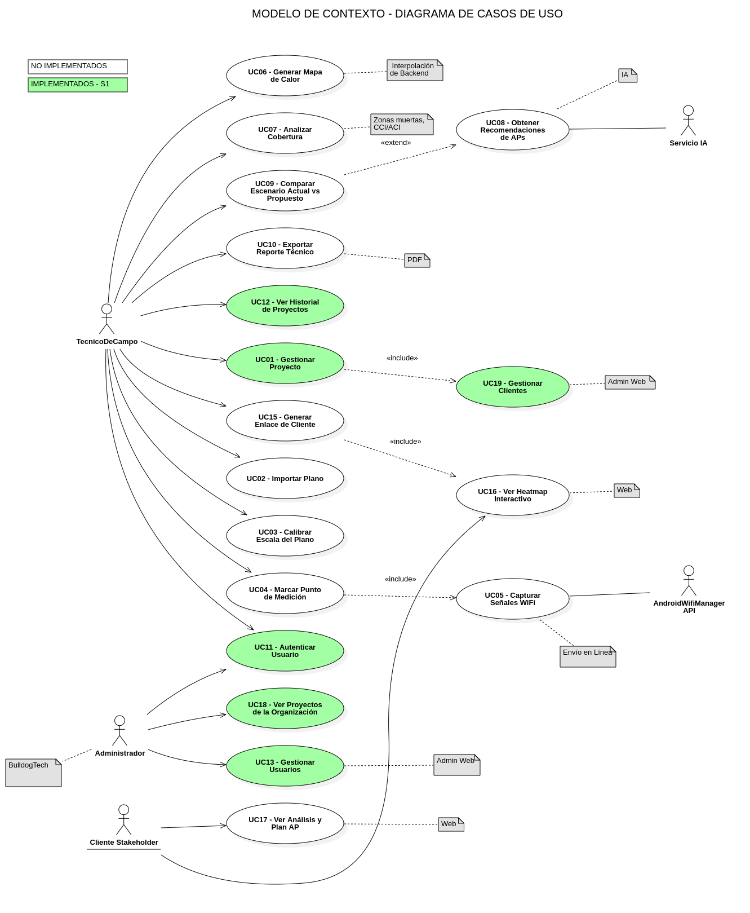

# 10.2 Sprint 0 — Definición Inicial (R-1)

**Referencia Scrum:** R-1 — Definición Inicial
**Duración:** 1 semana (5 días hábiles) · **13 abr – 17 abr 2026**
**Estado:** Implementado
**Objetivo del Sprint 0:** Dejar listo el entorno de desarrollo y operación para que el Sprint 1 pueda iniciar con un backend desplegable, base de datos inicializada, pipeline CI/CD funcionando y modelos UML aprobados.

### Ciclo de vida Scrum adoptado

El equipo adopta el Enfoque Scrum v3.2 (Martínez, 2021). El ciclo de vida del proyecto consta de un Sprint 0 de definición inicial (R-1) seguido de iteraciones de dos semanas con los cinco eventos repetibles (R-2 a R-5).

> _Diagrama de actividades — Ciclo de vida Scrum adoptado por el equipo._

## 10.2.1 Justificación del Sprint 0

El Sprint 0 fue **obligatorio** en este proyecto por tres razones:

- Es la primera vez que el equipo trabaja con la modalidad 100 % en línea: había que cablear la integración entre Docker Compose, Nginx, FastAPI y PostgreSQL antes de poder hablar de funcionalidad de negocio.
- Antes de hacer Sprint Planning era necesario tener un Product Backlog ordenado (F3) y un esqueleto de arquitectura validado por el PO.
- El cliente de tipos del frontend (`openapi-typescript`) depende del OpenAPI publicado por el backend, por lo que el backend "vacío pero corriendo" debía existir desde el día 1 del Sprint 1.

## 10.2.2 Tareas del Sprint 0

| Id        | Tarea                                                                               | Responsable |     Estim. | Estado    |
| --------- | ----------------------------------------------------------------------------------- | ----------- | ---------: | --------- |
| Sp0-01    | Definir equipo Scrum, roles y formato de Daily                                      | Ambos       |     0.5 hr | Terminado |
| Sp0-02    | Confirmar objetivo del producto y del proyecto                                      | Borys (PO)  |       1 hr | Terminado |
| Sp0-03    | Refinar y aprobar el Product Backlog (F3) ajustado a modalidad online               | Borys (PO)  |      3 hrs | Terminado |
| Sp0-04    | Aprobar duración estándar de Sprint = 2 semanas                                     | Ambos       |     0.5 hr | Terminado |
| Sp0-05    | Definir Definition of Done                                                          | Ambos       |       1 hr | Terminado |
| Sp0-06    | Aprobar diagramas: Contexto, Arquitectura (paquetes + despliegue), Datos            | Ambos       |      4 hrs | Terminado |
| Sp0-07    | Crear repositorio GitHub con estructura de monorepo (`backend/`, `mobile/`, `web/`) | Jhasmany    |      2 hrs | Terminado |
| Sp0-08    | Crear `docker-compose.yml` con servicios `db`, `backend`, `web`, `nginx`            | Jhasmany    |      4 hrs | Terminado |
| Sp0-09    | Crear `Dockerfile` del backend (Python 3.12 + Uvicorn) y `pyproject.toml` mínimo    | Jhasmany    |      3 hrs | Terminado |
| Sp0-10    | Crear endpoint `GET /api/health` que retorna `{"status":"ok","db":"ok"}`            | Jhasmany    |      2 hrs | Terminado |
| Sp0-11    | Configurar Alembic con migración inicial vacía                                      | Jhasmany    |      2 hrs | Terminado |
| Sp0-12    | Inicializar proyecto Flutter `mobile/` con BLoC + Dio + go_router                   | Borys       |      2 hrs | Terminado |
| Sp0-13    | Inicializar proyecto Web `web/` (Vite + React + TS + TanStack Query + axios)        | Borys       |      2 hrs | Terminado |
| Sp0-14    | Configurar `nginx/nginx.conf` con `/api → backend:8000` y `/ → web`                 | Jhasmany    |      2 hrs | Terminado |
| Sp0-15    | Configurar GitHub Actions: lint + tests + build de imagen Docker                    | Jhasmany    |      4 hrs | Terminado |
| Sp0-16    | Configurar pre-commit (ruff + ruff-format, prettier, eslint)                        | Borys       |       1 hr | Terminado |
| Sp0-17    | Documentar guía de ejecución local en README de cada componente                     | Ambos       |      2 hrs | Terminado |
| **TOTAL** |                                                                                     |             | **36 hrs** |           |

El siguiente diagrama muestra los estados por los que transita cada Historia de Usuario a lo largo del Product Backlog:

> _Diagrama de estados de las Historias de Usuario en el Product Backlog (Sp0-03)._

## 10.2.3 Diagrama de actividades del Sprint 0

> _Figura 10: Diagrama de actividades del Sprint 0 — Definición Inicial._

## 10.2.4 Modelos UML aprobados en el Sprint 0

### 10.2.4.1 Modelo de Contexto (Casos de Uso)

> _Figura 11: Modelo de Contexto del sistema (Diagrama de Casos de Uso UML 2.5) — UC01 a UC19, con desglose por Sprint._

### 10.2.4.2 Modelo de Arquitectura — Diagrama de Paquetes

> _Figura 12: Modelo de Arquitectura — Diagrama de Paquetes en cuatro capas._

### 10.2.4.3 Modelo de Arquitectura — Diagrama de Despliegue

> _Figura 13: Modelo de Arquitectura — Diagrama de Despliegue de los contenedores Docker._

### 10.2.4.4 Modelo de Datos (vista conceptual de Sprint 1)

El diagrama de Clases de la base de datos correspondiente al estado al cierre del Sprint 0/Sprint 1 se presenta en el bloque de Diseño de Datos del Sprint 1 (sección 10.3.4). Las entidades incluidas en la versión inicial del esquema son **Usuario**, **RefreshToken**, **Cliente** y **Proyecto**, con sus respectivas tablas, restricciones y claves foráneas.

## 10.2.5 Definition of Ready para el Sprint 1 (verificada al cierre del Sprint 0)

| Criterio                                                        | Estado |
| --------------------------------------------------------------- | ------ |
| Repositorio GitHub creado y accesible para ambos miembros       | Sí     |
| `docker compose up` levanta los 4 servicios sin errores         | Sí     |
| `curl http://localhost/api/health` → `200 OK`                   | Sí     |
| Migración inicial Alembic aplicada en `db`                      | Sí     |
| Pipeline CI verde en `main`                                     | Sí     |
| Modelos UML (contexto, arquitectura, datos) aprobados por el PO | Sí     |
| Product Backlog (F3) aprobado y ordenado por el PO              | Sí     |
