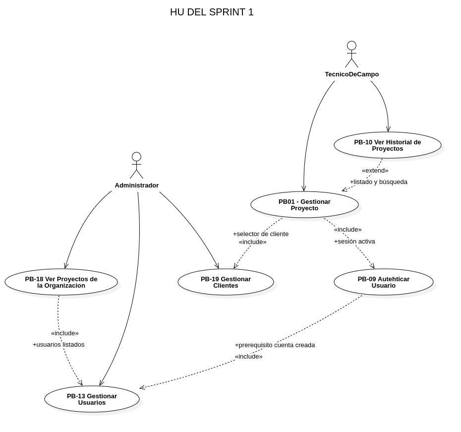

# 10.3 Sprint 1 — Sprint Planning (R-2)

**Evento:** R-2 Sprint Planning
**Sprint:** 1 — Fundación Backend + Admin Web + Auth Móvil + CRUD Proyectos
**Fecha de inicio:** 20 de abril de 2026
**Fecha de fin:** 26 de abril de 2026
**Capacidad:** ~80 hrs (2 devs × 4 hrs/día × 5 días hábiles × 2)
**PHU comprometidos:** 29

## 10.3.1 Objetivo del Sprint 1

> **Objetivo del Sprint 1:** Disponer de un backend que autentica usuarios con JWT, un panel web donde el administrador crea técnicos y clientes y supervisa los proyectos de la organización, una pantalla de login móvil que valida credenciales contra el backend en línea, y un CRUD completo de proyectos en la app móvil para que el técnico pueda crear, listar, editar, archivar y eliminar proyectos asociados a un cliente. Al cierre, un técnico recién creado puede iniciar sesión desde la app, gestionar sus proyectos y dejarlos listos para recibir planos en el Sprint 2.

## 10.3.2 Historias de Usuario seleccionadas (Planning Poker)

| HU        | Nombre                               | PHU    | Técnica de estimación |
| --------- | ------------------------------------ | ------ | --------------------- |
| PB-13     | Gestionar usuarios (admin web)       | 8      | Planning Poker        |
| PB-19     | Gestionar clientes (admin web)       | 3      | Planning Poker        |
| PB-09     | Autenticar usuario (móvil)           | 5      | Planning Poker        |
| PB-18     | Ver proyectos de la organización     | 5      | Planning Poker        |
| PB-01     | Gestionar proyecto de survey (móvil) | 5      | Planning Poker        |
| PB-10     | Ver historial de proyectos           | 3      | Planning Poker        |
| **Total** |                                      | **29** |                       |

## 10.3.3 Diagrama de relación entre HU del Sprint 1

> _Figura 14: Diagrama de relación entre las Historias de Usuario del Sprint 1._
