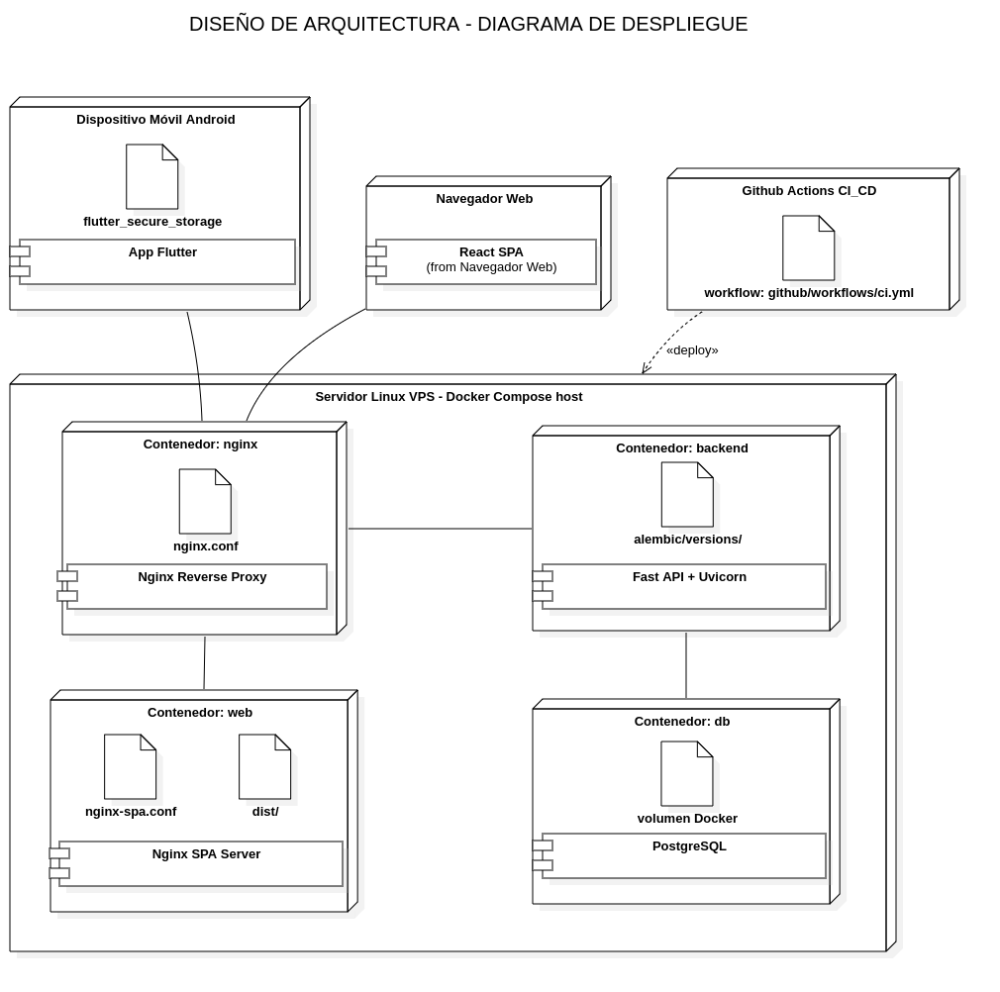
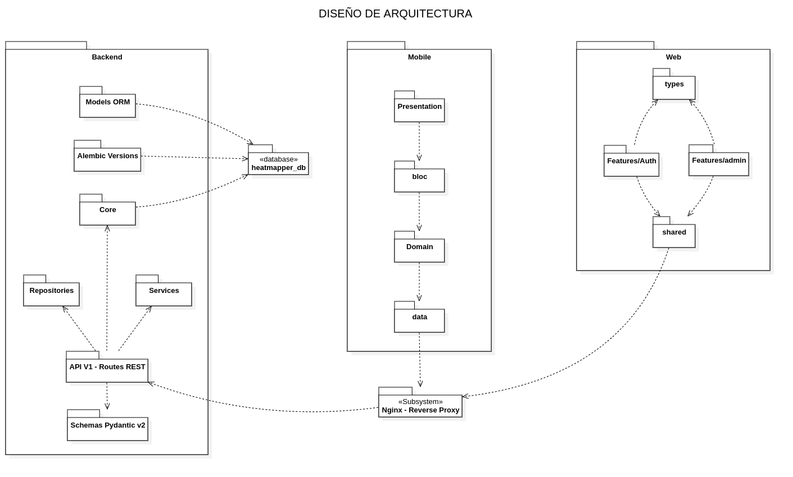
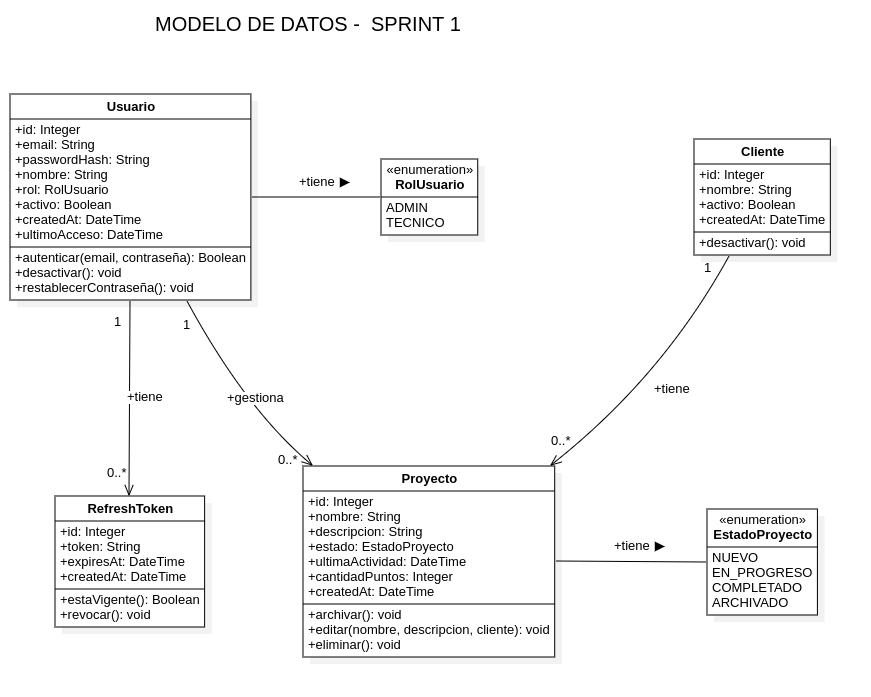
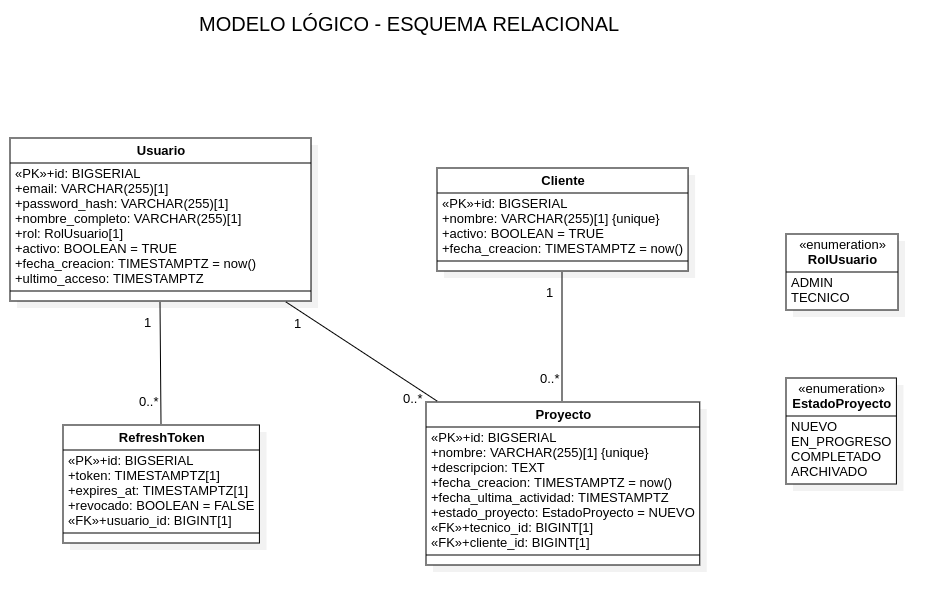

# 10.6 Patrón de desarrollo del Sprint 1

Esta sección documenta los modelos de diseño técnicos producidos durante la ejecución del Sprint 1 (R-3): la **arquitectura física** desplegada en contenedores, la **arquitectura lógica** organizada en cuatro capas y el **diseño de datos** en sus tres niveles (conceptual, lógico y físico).

## 10.6.1 Arquitectura Física — Diagrama de Despliegue

> _Figura 15: Arquitectura física — Diagrama de Despliegue de los contenedores Docker en producción._

## 10.6.2 Arquitectura Lógica — Diagrama de Paquetes

> _Figura 16: Arquitectura lógica — Diagrama de Paquetes en cuatro capas._

## 10.6.3 Diseño de Datos

### 10.6.3.1 Diagrama de Clases Conceptual (Sprint 1)

> _Figura 17: Diagrama de Clases Conceptual del Sprint 1._

### 10.6.3.2 Modelo Lógico (Esquema Relacional)

> _Figura 18: Modelo lógico (esquema relacional) del Sprint 1._

### 10.6.3.3 Diseño Físico (Tablas PostgreSQL)

**Tabla: `usuario`**

| Columna       | Tipo PostgreSQL | Restricciones              |
| ------------- | --------------- | -------------------------- |
| id            | SERIAL          | PRIMARY KEY                |
| nombre        | VARCHAR(120)    | NOT NULL                   |
| email         | VARCHAR(255)    | UNIQUE, NOT NULL           |
| password_hash | VARCHAR(255)    | NOT NULL                   |
| rol           | VARCHAR(30)     | NOT NULL DEFAULT 'tecnico' |
| activo        | BOOLEAN         | NOT NULL DEFAULT TRUE      |
| ultimo_acceso | TIMESTAMPTZ     | NULLABLE                   |
| created_at    | TIMESTAMPTZ     | NOT NULL DEFAULT now()     |

**Tabla: `refresh_token`**

| Columna    | Tipo PostgreSQL | Restricciones                                |
| ---------- | --------------- | -------------------------------------------- |
| id         | SERIAL          | PRIMARY KEY                                  |
| token      | VARCHAR(64)     | UNIQUE, NOT NULL                             |
| usuario_id | INTEGER         | NOT NULL, FK → usuario(id) ON DELETE CASCADE |
| expires_at | TIMESTAMPTZ     | NOT NULL                                     |
| created_at | TIMESTAMPTZ     | NOT NULL DEFAULT now()                       |

**Tabla: `cliente`**

| Columna    | Tipo PostgreSQL | Restricciones          |
| ---------- | --------------- | ---------------------- |
| id         | SERIAL          | PRIMARY KEY            |
| nombre     | VARCHAR(100)    | UNIQUE, NOT NULL       |
| activo     | BOOLEAN         | NOT NULL DEFAULT TRUE  |
| created_at | TIMESTAMPTZ     | NOT NULL DEFAULT now() |

**Tabla: `proyecto`**

| Columna          | Tipo PostgreSQL        | Restricciones                          |
| ---------------- | ---------------------- | -------------------------------------- |
| id               | SERIAL                 | PRIMARY KEY                            |
| nombre           | VARCHAR(200)           | NOT NULL                               |
| descripcion      | VARCHAR(500)           | NULLABLE                               |
| cliente_id       | INTEGER                | NULLABLE, FK → cliente(id)             |
| estado           | estado_proyecto (ENUM) | NOT NULL DEFAULT 'nuevo'               |
| tecnico_id       | INTEGER                | NOT NULL, FK → usuario(id)             |
| ultima_actividad | TIMESTAMPTZ            | NOT NULL DEFAULT now() ON UPDATE now() |
| cantidad_puntos  | INTEGER                | NOT NULL DEFAULT 0                     |
| created_at       | TIMESTAMPTZ            | NOT NULL DEFAULT now()                 |
