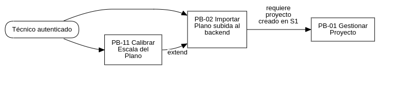
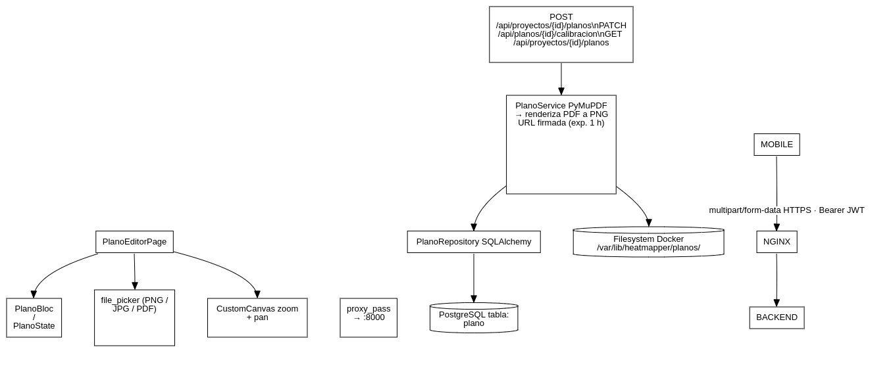
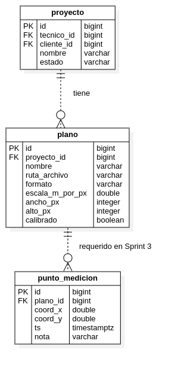

## Sprint 2

### Sprint Planning

**Evento:** R-2 Sprint Planning
**Sprint:** 2 — Planos en línea
**Fecha de inicio:** 28 de abril de 2026
**Fecha de fin:** 11 de mayo de 2026
**Capacidad:** ~80 hrs (2 devs × 4 hrs/día × 5 días hábiles × 2)
**PHU comprometidos:** 16

#### Objetivo del Sprint 2

> Sobre los proyectos ya gestionados en el Sprint 1 (PB-01, PB-10), permitir al técnico autenticado subir planos en formato PNG/JPG/PDF al backend y calibrar la escala del plano trazando una línea de referencia. Al cierre del sprint, un proyecto con plano calibrado queda persistido en PostgreSQL listo para recibir mediciones en el Sprint 3.

#### Contexto del Sistema

El siguiente diagrama muestra las Historias de Usuario comprometidas en el Sprint 2 y su relación con el sistema ya implementado en el Sprint 1:

> _Figura 9: Diagrama de relación entre las Historias de Usuario del Sprint 2._

---

### Historias de Usuario

| Campo                 | Contenido                                                                                                                                                                                                                                                                                                                                                                                                                                                     |
| --------------------- | ------------------------------------------------------------------------------------------------------------------------------------------------------------------------------------------------------------------------------------------------------------------------------------------------------------------------------------------------------------------------------------------------------------------------------------------------------------- |
| **Id**                | PB-02                                                                                                                                                                                                                                                                                                                                                                                                                                                         |
| **Nombre**            | Importar plano de edificio                                                                                                                                                                                                                                                                                                                                                                                                                                    |
| **Prioridad**         | Alta                                                                                                                                                                                                                                                                                                                                                                                                                                                          |
| **PHU**               | 8                                                                                                                                                                                                                                                                                                                                                                                                                                                             |
| **Estado**            | Completado                                                                                                                                                                                                                                                                                                                                                                                                                                                    |
| **Como**              | Técnico de campo                                                                                                                                                                                                                                                                                                                                                                                                                                              |
| **Quiero**            | Subir uno o más planos del edificio (PNG, JPG o PDF de una página) al backend asociados a mi proyecto.                                                                                                                                                                                                                                                                                                                                                        |
| **Para**              | Tener una referencia visual por locación, piso o zona sobre la cual georreferenciar mediciones WiFi.                                                                                                                                                                                                                                                                                                                                                          |
| **Reglas de negocio** | (a) Formatos aceptados: PNG, JPG, PDF (primera página únicamente). (b) Tamaño máximo: 20 MB. (c) PDF con más de 1 página: el backend renderiza solo la primera y devuelve un warning. (d) El plano se almacena en `/var/lib/heatmapper/planos/` (volumen Docker). (e) URL firmada, expira en 1 hora; el cliente la renueva al re-abrir la pantalla. (f) Un proyecto admite múltiples planos. (g) Eliminar un plano con puntos asociados retorna 409 Conflict. |
| **CA1**               | PNG/JPG/PDF válido ≤ 20 MB → 201 con id, urlFirmada y dimensiones.                                                                                                                                                                                                                                                                                                                                                                                            |
| **CA2**               | Archivo > 20 MB → 413 Payload Too Large con mensaje claro.                                                                                                                                                                                                                                                                                                                                                                                                    |
| **CA3**               | Formato no soportado → 415 Unsupported Media Type.                                                                                                                                                                                                                                                                                                                                                                                                            |
| **CA4**               | PDF multipágina → 201 + warning "Se importó solo la primera página".                                                                                                                                                                                                                                                                                                                                                                                          |
| **CA5**               | El plano renderiza en la app con zoom (pinch) y desplazamiento (pan).                                                                                                                                                                                                                                                                                                                                                                                         |
| **CA6**               | Plano con puntos de medición asociados no puede eliminarse; botón deshabilitado con tooltip "No es posible eliminar un plano con mediciones registradas".                                                                                                                                                                                                                                                                                                     |
| **CA7**               | `GET /api/proyectos/{id}/planos` devuelve la lista de planos con id, nombre, formato y urlFirmada.                                                                                                                                                                                                                                                                                                                                                            |
| **Desarrollador**     | Jhasmany (móvil) + Borys (backend)                                                                                                                                                                                                                                                                                                                                                                                                                            |

| Campo                 | Contenido                                                                                                                                                                                                                                                                                                                                                              |
| --------------------- | ---------------------------------------------------------------------------------------------------------------------------------------------------------------------------------------------------------------------------------------------------------------------------------------------------------------------------------------------------------------------- |
| **Id**                | PB-11                                                                                                                                                                                                                                                                                                                                                                  |
| **Nombre**            | Calibrar escala del plano                                                                                                                                                                                                                                                                                                                                              |
| **Prioridad**         | Alta                                                                                                                                                                                                                                                                                                                                                                   |
| **PHU**               | 8                                                                                                                                                                                                                                                                                                                                                                      |
| **Estado**            | Completado                                                                                                                                                                                                                                                                                                                                                             |
| **Como**              | Técnico de campo                                                                                                                                                                                                                                                                                                                                                       |
| **Quiero**            | Definir la escala real del plano dibujando una línea de referencia e ingresando la longitud real en metros.                                                                                                                                                                                                                                                            |
| **Para**              | Asegurar que las distancias en el heatmap correspondan a las reales y que la IA opere con un modelo de propagación correcto.                                                                                                                                                                                                                                           |
| **Reglas de negocio** | (a) La calibración es OBLIGATORIA antes de marcar puntos. (b) Fórmula: `escala_m_por_px = distancia_real_m / distancia_px`. (c) Distancia mínima de referencia: 1 metro. (d) Endpoint: `PATCH /api/planos/{id}/calibracion` con campos `{x1, y1, x2, y2, distanciaRealM}`. (e) Solo recalibrable si el plano no tiene puntos asociados; de lo contrario, 409 Conflict. |
| **CA1**               | Tocar dos puntos en el plano dibuja una línea de referencia entre ellos.                                                                                                                                                                                                                                                                                               |
| **CA2**               | Confirmar con distancia real ≥ 1 m → PATCH → 200 con factor calculado.                                                                                                                                                                                                                                                                                                 |
| **CA3**               | Distancia < 1 m → mensaje "La distancia debe ser al menos 1 metro".                                                                                                                                                                                                                                                                                                    |
| **CA4**               | La distancia real entre dos puntos cualesquiera se muestra en metros tras la calibración (regla virtual en pantalla).                                                                                                                                                                                                                                                  |
| **CA5**               | Si ya existen puntos → 409 + tooltip "No es posible recalibrar con mediciones registradas".                                                                                                                                                                                                                                                                            |
| **CA6**               | La calibración persistida sobrevive a reconexión y reapertura del proyecto desde otro dispositivo.                                                                                                                                                                                                                                                                     |
| **Desarrollador**     | Jhasmany (móvil) + Borys (backend)                                                                                                                                                                                                                                                                                                                                     |

---

### Sprint Backlog

**Objetivo del Sprint:** Permitir al técnico subir planos al backend (PNG/JPG/PDF) y calibrar su escala con una línea de referencia, dejando el plano listo para recibir mediciones WiFi en el Sprint 3.

| Sprint número       | 2          | Tiempo programado         | 10 días hábiles |
| ------------------- | ---------- | ------------------------- | --------------- |
| **Fecha de inicio** | 28/04/2026 | **Fecha de finalización** | 11/05/2026      |

#### HU PB-02 — Importar plano (8 PHU)

| Id     | Tarea                                                                                 | Responsable | Estim. | Estado |
| ------ | ------------------------------------------------------------------------------------- | ----------- | -----: | ------ |
| Sp2-01 | Modelo ORM + schemas `Plano` (`PlanoCreate`, `PlanoOut`, `PlanoListItem`)             | Jhasmany    |   1 hr | Sí.    |
| Sp2-02 | `PlanoRepository` + servicio de storage (filesystem local con interfaz para S3)       | Jhasmany    |  3 hrs | Sí.    |
| Sp2-03 | Endpoint `POST /api/proyectos/{id}/planos` (multipart/form-data, validaciones)        | Jhasmany    |  3 hrs | Sí.    |
| Sp2-04 | Renderizado de primera página de PDF con PyMuPDF                                      | Jhasmany    |  3 hrs | Sí.    |
| Sp2-05 | Endpoint `GET /api/proyectos/{id}/planos` + `GET /api/planos/{id}/url-firmada`        | Jhasmany    |  2 hrs | Sí.    |
| Sp2-06 | Tests pytest: validaciones de tamaño (413), formato (415), PDF multipágina, ownership | Jhasmany    |  3 hrs | Sí.    |
| Sp2-07 | Pantalla `PlanoEditorPage` con Flutter Canvas (`CustomPainter`)                       | Jhasmany    |  4 hrs | Sí.    |
| Sp2-08 | Integración `file_picker` + `pdfx` (renderizado de preview PDF en cliente)            | Jhasmany    |  3 hrs | Sí.    |
| Sp2-09 | Gestos zoom (pinch-to-zoom) y desplazamiento (pan) con `InteractiveViewer`            | Jhasmany    |  2 hrs | Sí.    |
| Sp2-10 | Aceptación con PO                                                                     | Ambos       |   1 hr | Sí.    |

#### HU PB-11 — Calibrar escala (8 PHU)

| Id     | Tarea                                                                             | Responsable | Estim. | Estado |
| ------ | --------------------------------------------------------------------------------- | ----------- | -----: | ------ |
| Sp2-11 | Endpoint `PATCH /api/planos/{id}/calibracion`                                     | Borys       |  2 hrs | Sí.    |
| Sp2-12 | Validación: distancia ≥ 1 m, bloqueo si existen puntos asociados                  | Borys       |   1 hr | Sí.    |
| Sp2-13 | Tests pytest de calibración: factor calculado, distancia mínima, plano con puntos | Borys       |  2 hrs | Sí.    |
| Sp2-14 | Modo "calibración" en `PlanoEditorPage`: capturar 2 toques sobre el canvas        | Jhasmany    |  3 hrs | Sí.    |
| Sp2-15 | Dibujo de línea de referencia + diálogo de ingreso de distancia real              | Jhasmany    |  2 hrs | Sí.    |
| Sp2-16 | Cálculo y envío del factor de calibración al backend + feedback visual            | Jhasmany    |  2 hrs | Sí.    |
| Sp2-17 | Visualización de la distancia real entre dos puntos del plano (regla virtual)     | Jhasmany    |  2 hrs | Sí.    |
| Sp2-18 | Bloqueo de re-calibración cuando el plano tiene puntos registrados                | Borys       |   1 hr | Sí.    |
| Sp2-19 | Aceptación con PO                                                                 | Ambos       |   1 hr | Sí.    |

#### Resumen Sprint 2

| Concepto          |   Valor |
| ----------------- | ------: |
| Total de tareas   |      19 |
| Horas estimadas   | ~46 hrs |
| Horas disponibles | ~80 hrs |
| PHU comprometidos |      16 |

---

### Patrón de Desarrollo

#### Diseño de la Arquitectura

El Sprint 2 extiende la arquitectura de cuatro capas definida en el Sprint 0 con los siguientes nuevos componentes:

> _Figura 10: Arquitectura lógica del Sprint 2 — subida y calibración de planos._

#### Diseño de Datos

El Sprint 2 introduce la tabla `plano` al modelo de datos existente:

> _Figura 11: Diagrama de clases — tabla plano y su relación con proyecto y punto_medicion._

**Migración Alembic del Sprint 2:**
La migración `b2c3d4e5f6a7_sp2_planos` crea la tabla `plano` con las columnas `escala_m_por_px` y `calibrado`. Es reversible con `alembic downgrade -1`.

---

### Sprint Review

|                             |                                                                                                                                                              |
| --------------------------- | ------------------------------------------------------------------------------------------------------------------------------------------------------------ | --------- | ---------- | -------- | ----- |
| **Nombre del proyecto**     | Wireless HeatMapper — Sistema Inteligente de Análisis y Optimización de Cobertura WiFi                                                                       |
| **Número de revisión**      | 2                                                                                                                                                            |
| **Objetivo de la revisión** | Verificar que el técnico puede subir planos al backend, visualizarlos en la app con zoom/pan, calibrar la escala y que la calibración persiste en PostgreSQL |
| **Lugar**                   | Santa Cruz de la Sierra                                                                                                                                      | **Fecha** | 11/05/2026 | **Hora** | 20:00 |

**Participantes:**

| Nombre                             | Rol                 |
| ---------------------------------- | ------------------- |
| Herland Borys Quiroga Flores       | Product Owner / Dev |
| Jhasmany Jhunnior Fernandez Ortega | Scrum Master / Dev  |

**Presentación del incremento:**

| Función presentada                              | HU    | Resultado                                                                                   |
| ----------------------------------------------- | ----- | ------------------------------------------------------------------------------------------- |
| Subida de plano PNG/JPG desde la app            | PB-02 | Sí. Plano sube y se renderiza en el canvas con zoom/pan                                     |
| Subida de plano PDF (primera página)            | PB-02 | Sí. PyMuPDF convierte y devuelve PNG; warning informativo si hay más páginas                |
| Validación de tamaño y formato                  | PB-02 | Sí. 413/415 con mensajes claros; rechaza formatos no soportados                             |
| Calibración de escala con línea de referencia   | PB-11 | Sí. Dos toques → línea dibujada → diálogo distancia → factor calculado y persistido         |
| Visualización de distancia real (regla virtual) | PB-11 | Sí. La distancia en metros se muestra al trazar cualquier segmento sobre el plano calibrado |
| Bloqueo de re-calibración con puntos existentes | PB-11 | Sí. 409 desde backend + tooltip explicativo en la UI                                        |

**Flujo de demo (extremo a extremo):**

| Paso | Actor         | Acción demostrada                                            | Resultado verificable                                                 |
| ---: | ------------- | ------------------------------------------------------------ | --------------------------------------------------------------------- |
|    1 | Técnico (app) | Navega al proyecto "Edificio Central" creado en Sprint 1     | Proyecto carga con estado EN_PROGRESO                                 |
|    2 | Técnico (app) | Toca "Importar plano" y selecciona el plano PDF del edificio | Plano sube, PyMuPDF convierte, canvas muestra la imagen               |
|    3 | Técnico (app) | Realiza zoom con pinch y desplaza el plano                   | El canvas responde fluidamente con InteractiveViewer                  |
|    4 | Técnico (app) | Activa modo calibración, toca dos extremos de un pasillo     | Se dibuja una línea roja entre los dos puntos                         |
|    5 | Técnico (app) | Ingresa "15 metros" como longitud real del pasillo           | El factor `escala_m_por_px` se calcula y envía al backend (PATCH)     |
|    6 | Admin (web)   | Consulta el proyecto en el panel                             | El plano aparece con estado "calibrado" y el factor de escala visible |

**Retroalimentación del Product Owner:**

| Comentario                                                                         | Respuesta del equipo                                                                       |
| ---------------------------------------------------------------------------------- | ------------------------------------------------------------------------------------------ |
| ¿Es posible que el técnico renombre el plano después de subirlo?                   | Se registra como mejora para Sprint 4; no bloquea el flujo actual.                         |
| ¿Qué pasa si el plano tiene colores muy claros y la línea de calibración no se ve? | Se añadirá contraste en la línea (borde negro sobre relleno rojo) en la próxima iteración. |
| ¿Se puede ver el factor de escala calculado en la interfaz?                        | Sí, se muestra en el panel de estado del plano como "1 px = X.XX m".                       |

**Tareas completadas:**

| HU        | Estado |        PHU |
| --------- | ------ | ---------: |
| PB-02     | Done   |          8 |
| PB-11     | Done   |          8 |
| **Total** |        | **16 PHU** |

**Para lo que viene — Sprint 3:**

- **PB-03:** Capturar señales WiFi (RSSI, SSID, BSSID, canal, frecuencia) desde la app y enviar cada lote al backend en tiempo real.
- **PB-04:** Marcar puntos de medición sobre el plano calibrado con modo puntual y modo continuo.

---

### Sprint Retrospective

|                   |            |
| ----------------- | ---------- |
| **Sprint número** | 2          |
| **Fecha**         | 11/05/2026 |

**Asistentes:**

- Herland Borys Quiroga Flores
- Jhasmany Jhunnior Fernandez Ortega

| Aspecto                     | Detalle                                                                                                                                                                                                                                                    |
| --------------------------- | ---------------------------------------------------------------------------------------------------------------------------------------------------------------------------------------------------------------------------------------------------------- |
| **¿Qué salió bien?**        | La integración de PyMuPDF para convertir PDFs fue más sencilla de lo esperado. La arquitectura de `StorageService` con interfaz abstracta facilita migrar a S3 sin cambiar el backend. Los tests de calibración (13 casos) cubrieron todos los edge cases. |
| **¿Qué no salió bien?**     | La pantalla de calibración en Flutter requirió más iteraciones de UX de lo previsto para lograr que el usuario entienda el flujo de "dos toques para definir la línea".                                                                                    |
| **¿Problemas encontrados?** | `InteractiveViewer` y el `GestureDetector` para los toques de calibración entraron en conflicto en la detección de eventos. Se resolvió envolviendo el `GestureDetector` dentro del `InteractiveViewer` con manejo correcto de coordenadas locales.        |
| **¿Qué debemos cambiar?**   | Preparar mocks de storage más realistas en los tests de integración. Anticipar conflictos de gestos en pantallas con `InteractiveViewer`.                                                                                                                  |
