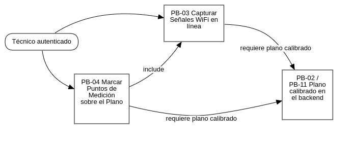
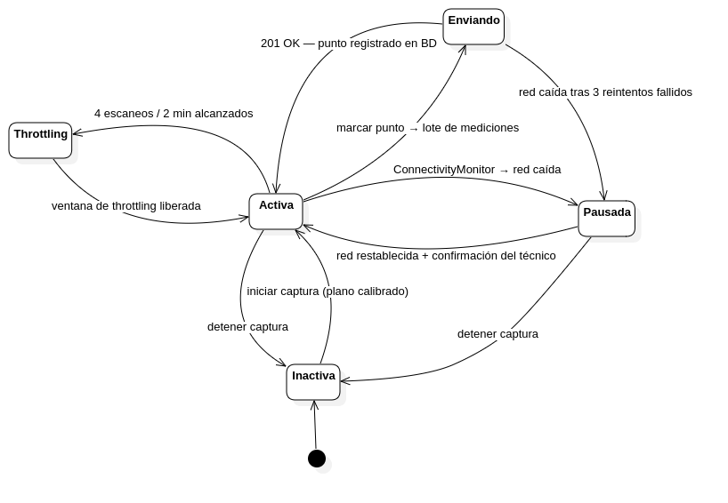
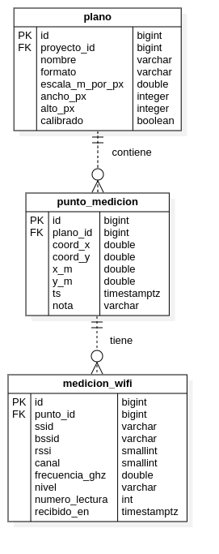

## Sprint 3

### Sprint Planning

**Evento:** R-2 Sprint Planning
**Sprint:** 3 — Captura WiFi en línea
**Fecha de inicio:** 12 de mayo de 2026
**Fecha de fin:** 25 de mayo de 2026
**Capacidad:** ~80 hrs (2 devs × 4 hrs/día × 5 días hábiles × 2)
**PHU comprometidos:** 21

#### Objetivo del Sprint 3

> Implementar la captura automática de señales WiFi desde la app móvil con envío en línea (request por request) al backend, y permitir al técnico marcar puntos de medición sobre el plano calibrado en modo puntual y en modo continuo. Al cierre del sprint, el técnico puede hacer un recorrido completo del edificio con la app registrando el nivel de señal WiFi en PostgreSQL, sin ningún almacenamiento local.

#### Restricciones técnicas fundamentales

- **Sin persistencia local:** La app es un cliente REST puro. Cada lote de mediciones se envía en el momento de la captura. No existe base de datos local (sin `sqflite`, sin `drift`).
- **Throttling de Android ≥ 8.0:** El framework restricts los scans WiFi a 4 por cada 2 minutos (Coleman & Westcott, 2018, p. 412). El `ThrottlingManager` respeta este límite con cola de espera.
- **Latencia p95 ≤ 1 s:** El endpoint `POST /api/mediciones` debe responder al percentil 95 en menos de 1 segundo bajo carga de 50 puntos simultáneos.

#### Contexto del Sistema

> _Figura 12: Diagrama de relación entre las Historias de Usuario del Sprint 3._

---

### Historias de Usuario

| Campo                 | Contenido                                                                                                                                                                                                                                                                                                                                                                                                                                                                                                                                                                                                                                                     |
| --------------------- | ------------------------------------------------------------------------------------------------------------------------------------------------------------------------------------------------------------------------------------------------------------------------------------------------------------------------------------------------------------------------------------------------------------------------------------------------------------------------------------------------------------------------------------------------------------------------------------------------------------------------------------------------------------- |
| **Id**                | PB-03                                                                                                                                                                                                                                                                                                                                                                                                                                                                                                                                                                                                                                                         |
| **Nombre**            | Capturar señales WiFi en línea                                                                                                                                                                                                                                                                                                                                                                                                                                                                                                                                                                                                                                |
| **Prioridad**         | Alta                                                                                                                                                                                                                                                                                                                                                                                                                                                                                                                                                                                                                                                          |
| **PHU**               | 13                                                                                                                                                                                                                                                                                                                                                                                                                                                                                                                                                                                                                                                            |
| **Estado**            | Completado                                                                                                                                                                                                                                                                                                                                                                                                                                                                                                                                                                                                                                                    |
| **Como**              | Técnico de campo                                                                                                                                                                                                                                                                                                                                                                                                                                                                                                                                                                                                                                              |
| **Quiero**            | Que la app escanee automáticamente las señales WiFi del entorno (SSID, BSSID, RSSI dBm, canal, frecuencia) y las envíe al backend en tiempo real sin almacenarlas en el dispositivo.                                                                                                                                                                                                                                                                                                                                                                                                                                                                          |
| **Para**              | Registrar la cobertura WiFi de cada punto del edificio en la base de datos centralizada, asegurando integridad sin dependencia del estado local del teléfono.                                                                                                                                                                                                                                                                                                                                                                                                                                                                                                 |
| **Reglas de negocio** | (a) Plugin WiFi: `wifi_scan:^0.4.1` (Android API ≥ 26). (b) Throttling Android ≥ 8.0: 4 scans/2 minutos; el `ThrottlingManager` aplica cola de espera. (c) Cada scan produce un lote de `AccessPoint` (SSID, BSSID, RSSI, canal). (d) El lote se envía a `POST /api/mediciones` con autenticación JWT. (e) Reintentos Dio con backoff exponencial (3 intentos); si fallan todos, se notifica con SnackBar y NO se persiste localmente. (f) El campo `numero_lectura` identifica el orden dentro del punto. (g) La app muestra indicador de conectividad (`ConnectivityMonitor`). (h) El usuario debe conceder permisos `LOCATION_FINE` y `CHANGE_WIFI_STATE`. |
| **CA1**               | Con permisos concedidos → scan automático al iniciar captura.                                                                                                                                                                                                                                                                                                                                                                                                                                                                                                                                                                                                 |
| **CA2**               | Throttling activo → la UI muestra cuenta regresiva "Próximo scan en Xs".                                                                                                                                                                                                                                                                                                                                                                                                                                                                                                                                                                                      |
| **CA3**               | POST exitoso → punto registrado en BD; la UI actualiza el plano.                                                                                                                                                                                                                                                                                                                                                                                                                                                                                                                                                                                              |
| **CA4**               | Fallo de red (3 reintentos fallidos) → SnackBar "Sin conexión. Medición no registrada." Sin datos locales residuales.                                                                                                                                                                                                                                                                                                                                                                                                                                                                                                                                         |
| **CA5**               | Sin permisos → diálogo racional con botón "Ir a Configuración".                                                                                                                                                                                                                                                                                                                                                                                                                                                                                                                                                                                               |
| **CA6**               | BSSID, canal y frecuencia incluidos en el registro de medición.                                                                                                                                                                                                                                                                                                                                                                                                                                                                                                                                                                                               |
| **CA7**               | `numero_lectura` incremental dentro del punto de medición.                                                                                                                                                                                                                                                                                                                                                                                                                                                                                                                                                                                                    |
| **Desarrollador**     | Jhasmany (móvil) + Borys (backend)                                                                                                                                                                                                                                                                                                                                                                                                                                                                                                                                                                                                                            |

| Campo                 | Contenido                                                                                                                                                                                                                                                                                                                                                                                                                                                                                                                                                                               |
| --------------------- | --------------------------------------------------------------------------------------------------------------------------------------------------------------------------------------------------------------------------------------------------------------------------------------------------------------------------------------------------------------------------------------------------------------------------------------------------------------------------------------------------------------------------------------------------------------------------------------- |
| **Id**                | PB-04                                                                                                                                                                                                                                                                                                                                                                                                                                                                                                                                                                                   |
| **Nombre**            | Marcar puntos de medición sobre el plano                                                                                                                                                                                                                                                                                                                                                                                                                                                                                                                                                |
| **Prioridad**         | Alta                                                                                                                                                                                                                                                                                                                                                                                                                                                                                                                                                                                    |
| **PHU**               | 8                                                                                                                                                                                                                                                                                                                                                                                                                                                                                                                                                                                       |
| **Estado**            | Completado                                                                                                                                                                                                                                                                                                                                                                                                                                                                                                                                                                              |
| **Como**              | Técnico de campo                                                                                                                                                                                                                                                                                                                                                                                                                                                                                                                                                                        |
| **Quiero**            | Tocar en el plano la posición exacta donde me encuentro físicamente (modo puntual) o activar un barrido automático de posiciones (modo continuo), de modo que cada toque quede registrado como un punto de medición con su lista de lecturas WiFi.                                                                                                                                                                                                                                                                                                                                      |
| **Para**              | Construir un mapa completo de puntos de medición que el backend usará para generar el heatmap de cobertura.                                                                                                                                                                                                                                                                                                                                                                                                                                                                             |
| **Reglas de negocio** | (a) El plano DEBE estar calibrado (`escala_m_por_px`) antes de marcar puntos. (b) Modo puntual: el técnico toca el plano → se crea el punto → se capturan lecturas WiFi → se envían al backend. (c) Modo continuo: la app crea puntos automáticamente a intervalos regulares. (d) Los puntos se muestran como marcadores neutros de ubicación. (e) Al tocar un punto existente se abre `PuntoDetalleSheet` con redes detectadas, RSSI y timestamp. (f) Eliminar punto requiere doble confirmación si tiene lecturas asociadas. |
| **CA1**               | Tap en plano calibrado → punto marcado en canvas y enviado al backend.                                                                                                                                                                                                                                                                                                                                                                                                                                                                                                                  |
| **CA2**               | Punto registrado → marcador neutro visible, sin colorearse por RSSI agregado.                                                                                                                                                                                                                                                                                                                                                                                                                                                                                                           |
| **CA3**               | Tap en punto existente → `PuntoDetalleSheet` con lecturas detalladas.                                                                                                                                                                                                                                                                                                                                                                                                                                                                                                                   |
| **CA4**               | Long-press en punto → diálogo de eliminación con confirmación.                                                                                                                                                                                                                                                                                                                                                                                                                                                                                                                          |
| **CA5**               | Modo continuo activado → auto-marcado cada 3 segundos con indicador visual.                                                                                                                                                                                                                                                                                                                                                                                                                                                                                                             |
| **CA6**               | Plano no calibrado → botón de marcar deshabilitado con tooltip explicativo.                                                                                                                                                                                                                                                                                                                                                                                                                                                                                                             |
| **CA7**               | Coordenadas en metros (`x_m`, `y_m`) calculadas correctamente usando `escala_m_por_px` del plano.                                                                                                                                                                                                                                                                                                                                                                                                                                                                                       |
| **Desarrollador**     | Jhasmany (móvil) + Borys (backend)                                                                                                                                                                                                                                                                                                                                                                                                                                                                                                                                                      |

---

### Sprint Backlog

**Objetivo del Sprint:** Captura WiFi en tiempo real desde la app con envío al backend y marcado de puntos sobre el plano calibrado, en modalidad 100 % en línea.

| Sprint número       | 3          | Tiempo programado         | 10 días hábiles |
| ------------------- | ---------- | ------------------------- | --------------- |
| **Fecha de inicio** | 12/05/2026 | **Fecha de finalización** | 25/05/2026      |

#### HU PB-03 — Capturar señales WiFi en línea (13 PHU)

| Id     | Tarea                                                                        | Responsable | Estim. | Estado |
| ------ | ---------------------------------------------------------------------------- | ----------- | -----: | ------ |
| Sp3-01 | Migración Alembic: tablas `punto_medicion` y `medicion_wifi`                 | Borys       |  2 hrs | Sí.    |
| Sp3-02 | Modelos ORM + schemas Pydantic (`PuntoCreate`, `MedicionWifiCreate`, listas) | Borys       |  2 hrs | Sí.    |
| Sp3-03 | `PuntoMedicionRepository` + `MedicionWifiRepository`                         | Borys       |  3 hrs | Sí.    |
| Sp3-04 | Endpoint `POST /api/planos/{id}/puntos` + `POST /api/puntos/{id}/mediciones` | Borys       |  3 hrs | Sí.    |
| Sp3-05 | Validaciones: plano calibrado, ownership, coordenadas dentro del plano       | Borys       |  2 hrs | Sí.    |
| Sp3-06 | Tests pytest: 7 casos (201, 400 sin calibrar, 403 ajeno, p95 ≤ 1s)           | Borys       |  3 hrs | Sí.    |
| Sp3-07 | Benchmark de latencia: 50 puntos simultáneos, medir p95                      | Borys       |  2 hrs | Sí.    |
| Sp3-08 | Módulo `WifiScanner` (wifi_scan plugin, permisos LOCATION_FINE)              | Jhasmany    |  3 hrs | Sí.    |
| Sp3-09 | `ThrottlingManager`: cola de espera, respeta 4 scans/2 min (Android ≥ 8)     | Jhasmany    |  3 hrs | Sí.    |
| Sp3-10 | `CapturaDioClient`: POST lote + reintentos backoff × 3 + error sin datos     | Jhasmany    |  3 hrs | Sí.    |
| Sp3-11 | `CapturaCubit` (estados: inicial, capturando, pausado, error)                | Jhasmany    |  4 hrs | Sí.    |
| Sp3-12 | Tests BLoC: estados, throttling, error de red, cancelación                   | Jhasmany    |  3 hrs | Sí.    |
| Sp3-13 | `ConnectivityMonitor` + SnackBar de pérdida y recuperación de red            | Jhasmany    |  2 hrs | Sí.    |

#### HU PB-04 — Marcar puntos sobre el plano (8 PHU)

| Id     | Tarea                                                                       | Responsable | Estim. | Estado |
| ------ | --------------------------------------------------------------------------- | ----------- | -----: | ------ |
| Sp3-14 | Endpoints `GET /api/planos/{id}/puntos` (con últimas lecturas)              | Borys       |  2 hrs | Sí.    |
| Sp3-15 | Endpoint `DELETE /api/puntos/{id}` (con validación de lecturas)             | Borys       |   1 hr | Sí.    |
| Sp3-16 | Tests GET+DELETE puntos: sin lecturas, con lecturas, ownership              | Borys       |  2 hrs | Sí.    |
| Sp3-17 | `CapturaPage` con plano renderizado y `PlanoPuntosPainter` (marcadores neutros) | Jhasmany    |  4 hrs | Sí.    |
| Sp3-18 | Modo puntual: GestureDetector en canvas → crear punto → iniciar captura     | Jhasmany    |  3 hrs | Sí.    |
| Sp3-19 | Modo continuo: timer interno + auto-marcado cada 3 s + indicador visual     | Jhasmany    |  3 hrs | Sí.    |
| Sp3-20 | `PuntoDetalleSheet`: bottom sheet con lista de redes, RSSI, timestamp       | Jhasmany    |  2 hrs | Sí.    |
| Sp3-21 | Diálogo de eliminación de punto con confirmación doble                      | Jhasmany    |   1 hr | Sí.    |
| Sp3-22 | Cálculo de coordenadas reales (x_m, y_m) desde píxeles y escala del plano   | Jhasmany    |  2 hrs | Sí.    |
| Sp3-23 | Tooltip "Plano no calibrado" cuando el plano no tiene escala                | Jhasmany    |   1 hr | Sí.    |
| Sp3-24 | Aceptación con PO (demo extremo a extremo)                                  | Ambos       |  2 hrs | Sí.    |

#### Funcionalidades añadidas durante la implementación

Las siguientes tareas se agregaron al Sprint Backlog durante el desarrollo, como resultado de necesidades emergentes identificadas en la implementación:

| Id     | Descripción de la adición                                                                                | Motivo                                                                                                          | Estado |
| ------ | -------------------------------------------------------------------------------------------------------- | --------------------------------------------------------------------------------------------------------------- | ------ |
| Sp3-25 | Campo `numero_lectura` en `medicion_wifi` + incremento automático en `MedicionWifiRepository`            | Necesario para identificar el orden de las lecturas dentro de un punto y facilitar la depuración de datos       | Sí.    |
| Sp3-26 | Endpoint alternativo `POST /api/puntos/{id}/mediciones` (modo continuo, varias lecturas en un solo POST) | El modo continuo genera lecturas en ráfaga; batching reduce los requests al backend y mejora el rendimiento     | Sí.    |
| Sp3-27 | Método `agregarMedicionesAPunto()` en `CapturaCubit` para gestionar el envío en modo continuo            | Desacoplar la lógica de envío continuo de la lógica del punto único                                             | Sí.    |
| Sp3-28 | Estado `CapturaPuntoDetalle` + acciones `abrirDetallePunto` / `cerrarDetalle` en `CapturaCubit`          | La apertura del `PuntoDetalleSheet` debe ser gestionada por el Cubit para mantener la UI reactiva y desacoplada | Sí.    |

#### Resumen Sprint 3

| Concepto                               |   Valor |
| -------------------------------------- | ------: |
| Total de tareas (originales)           |      24 |
| Tareas añadidas durante implementación |       4 |
| **Total de tareas ejecutadas**         |  **28** |
| Horas estimadas                        | ~79 hrs |
| PHU comprometidos                      |      21 |

---

### Patrón de Desarrollo

#### Diseño de la Arquitectura

##### Secuencia de captura WiFi en línea (modo puntual)

El flujo de captura sigue los pasos: el técnico toca el plano en la posición física → `CapturaCubit` inicia el escaneo → `WifiScanner` captura el lote de APs (SSID, BSSID, RSSI, canal) → `CapturaDioClient` envía `POST /api/puntos/{id}/mediciones` con autenticación JWT → el backend persiste en PostgreSQL y retorna confirmación → la UI actualiza el canvas con un marcador neutro de punto medido.

##### Máquina de estados de la sesión de captura

> _Figura 14: Máquina de estados del CapturaCubit — sesión de captura WiFi._

#### Diseño de Datos

El Sprint 3 introduce las tablas `punto_medicion` y `medicion_wifi` al modelo de datos:

> _Figura 15: Diagrama de clases — tablas punto_medicion y medicion_wifi (Sprint 3)._

**Migración Alembic del Sprint 3:**
La migración `c3d4e5f6a7b8_sp3_mediciones` crea las tablas `punto_medicion` y `medicion_wifi`. La columna `numero_lectura` en `medicion_wifi` fue añadida como parte de las adiciones (`Sp3-25`) para identificar el orden de lecturas dentro de un punto.

---

### Sprint Review

|                             |                                                                                                                                     |
| --------------------------- | ----------------------------------------------------------------------------------------------------------------------------------- | --------- | ---------- | -------- | ----- |
| **Nombre del proyecto**     | Wireless HeatMapper — Sistema Inteligente de Análisis y Optimización de Cobertura WiFi                                              |
| **Número de revisión**      | 3                                                                                                                                   |
| **Objetivo de la revisión** | Verificar captura WiFi en línea (sin datos locales), marcado de puntos sobre plano calibrado, y persistencia completa en PostgreSQL |
| **Lugar**                   | Santa Cruz de la Sierra                                                                                                             | **Fecha** | 25/05/2026 | **Hora** | 20:00 |

**Participantes:**

| Nombre                             | Rol                 |
| ---------------------------------- | ------------------- |
| Herland Borys Quiroga Flores       | Product Owner / Dev |
| Jhasmany Jhunnior Fernandez Ortega | Scrum Master / Dev  |

**Presentación del incremento:**

| Función presentada                      | HU     | Resultado                                                        |
| --------------------------------------- | ------ | ---------------------------------------------------------------- |
| Scan WiFi con throttling Android 8.0    | PB-03  | Sí. UI muestra cuenta regresiva; 4 scans/2 min respetados        |
| Envío de lote al backend (modo puntual) | PB-03  | Sí. POST exitoso; punto persistido en BD con todas las lecturas  |
| Error de red: sin datos locales         | PB-03  | Sí. SnackBar + cero datos residuales en el dispositivo           |
| Marcado de punto en modo puntual        | PB-04  | Sí. Tap → punto creado → scan → lecturas enviadas al backend     |
| Marcado de puntos en modo continuo      | PB-04  | Sí. Barrido automático cada 3 s; puntos distribuidos en el plano |
| Marcador neutro del punto medido        | PB-04  | Sí. El punto indica ubicación; el nivel se consulta en el detalle |
| PuntoDetalleSheet con lecturas          | PB-04  | Sí. Tap en punto → bottom sheet con todas las redes y RSSI       |
| Eliminar punto con confirmación         | PB-04  | Sí. Long-press → diálogo → DELETE con 204                        |
| numero_lectura en medicion_wifi         | Sp3-25 | Sí. Lectura ordenada correctamente en el backend                 |
| Endpoint POST modo continuo (batching)  | Sp3-26 | Sí. Latencia p95 ≤ 1 s verificado con 50 puntos simultáneos      |

**Flujo de demo (extremo a extremo):**

| Paso | Actor         | Acción demostrada                                                   | Resultado verificable                                              |
| ---: | ------------- | ------------------------------------------------------------------- | ------------------------------------------------------------------ |
|    1 | Técnico (app) | Abre el proyecto "Edificio Central" y selecciona el plano calibrado | Plano renderizado con canvas vacío (sin puntos aún)                |
|    2 | Técnico (app) | Activa modo puntual, toca la sala de reuniones en el plano          | Punto gris aparece instantáneamente en el canvas                   |
|    3 | App           | Inicia scan WiFi automáticamente (ThrottlingManager activo)         | UI muestra "Capturando..." con indicador de progreso               |
|    4 | App           | Scan completo → POST /api/puntos/{id}/mediciones                    | 5 redes detectadas; marcador de punto confirmado                   |
|    5 | Técnico (app) | Repite en el pasillo → modo continuo (auto cada 3 s)                | 8 puntos neutros distribuidos en el pasillo                        |
|    6 | Técnico (app) | Toca un punto del pasillo                                           | PuntoDetalleSheet muestra 3 redes con RSSI débil                   |
|    7 | Admin (web)   | Consulta el proyecto en el panel web                                | Muestra 9 puntos de medición con coordenadas y nivel de señal      |
|    8 | Técnico (app) | Activa modo avión → intenta marcar nuevo punto                      | SnackBar "Sin conexión. Medición no registrada."                   |

**Retroalimentación del Product Owner:**

| Comentario                                                                              | Respuesta del equipo                                                                                      |
| --------------------------------------------------------------------------------------- | --------------------------------------------------------------------------------------------------------- |
| ¿Puede el técnico ver el RSSI promedio de cada punto directamente sobre el canvas?      | Se descarta para evitar una lectura ambigua; el RSSI se revisa en detalle y en el heatmap por AP.         |
| El modo continuo a 3 segundos parece muy frecuente para pasillos largos; ¿configurable? | Se documenta como mejora de UX en el backlog; el Sprint 3 confirma la funcionalidad base.                 |
| Los puntos eliminados, ¿pueden recuperarse?                                             | No. La eliminación es definitiva (sin papelera). El diálogo de doble confirmación es la única protección. |

**Tareas completadas:**

| HU        | Tareas originales |            Tareas añadidas | Estado |        PHU |
| --------- | ----------------: | -------------------------: | ------ | ---------: |
| PB-03     |                13 | 3 (Sp3-25, Sp3-26, Sp3-27) | Done   |         13 |
| PB-04     |                11 |                 1 (Sp3-28) | Done   |          8 |
| **Total** |            **24** |                      **4** |        | **21 PHU** |

**Criterio de Done (DoD) del Sprint 3 — cumplimiento:**

| Ítem                                                                       | Estado |
| -------------------------------------------------------------------------- | ------ |
| Permisos Android solicitados con diálogo racional y manejo de denegación   | Sí.    |
| Endpoint POST /api/mediciones responde en p95 ≤ 1 s con 50 req simultáneos | Sí.    |
| La app no persiste datos de dominio en el dispositivo (sin tabla local)    | Sí.    |
| ConnectivityMonitor notifica al usuario al perder/recuperar red            | Sí.    |
| Demo en campo: recorrido de piso completo registrado en PostgreSQL         | Sí.    |
| Todos los tests pasan en CI (backend + mobile): 0 fallos                   | Sí.    |

**Para lo que viene — Sprint 4:**

- **PB-05:** Generación del heatmap en el backend (interpolación IDW/Kriging con scipy/pykrige) sobre los puntos capturados en el Sprint 3.
- **PB-06:** Análisis automático de cobertura (zonas muertas, zonas óptimas, recomendaciones de reposicionamiento de APs).

---

### Sprint Retrospective

|                   |            |
| ----------------- | ---------- |
| **Sprint número** | 3          |
| **Fecha**         | 25/05/2026 |

**Asistentes:**

- Herland Borys Quiroga Flores
- Jhasmany Jhunnior Fernandez Ortega

| Aspecto                        | Detalle                                                                                                                                                                                                                                                                                                                        |
| ------------------------------ | ------------------------------------------------------------------------------------------------------------------------------------------------------------------------------------------------------------------------------------------------------------------------------------------------------------------------------ |
| **¿Qué salió bien?**           | El `ThrottlingManager` funcionó correctamente a la primera en el emulador y en el dispositivo físico. La arquitectura BLoC/Cubit demostró ser muy testeable: 12 casos de prueba para `CapturaCubit` cubren todos los flujos incluidas las adiciones. El batching en modo continuo (Sp3-26) mejoró notablemente el rendimiento. |
| **¿Qué no salió bien?**        | El `GestureDetector` en el canvas de `CapturaPage` tuvo conflicto con `InteractiveViewer` (el mismo problema que en Sprint 2). La solución requirió la misma técnica: coordenadas locales del Canvas dentro del `InteractiveViewer`.                                                                                           |
| **¿Problemas encontrados?**    | El throttling de Android ≥ 8.0 varió entre dispositivos de prueba: algunos aplicaron el límite más estrictamente que otros. Se añadió un margen de tolerancia del 10 % en el `ThrottlingManager` para absorber variaciones del sistema operativo.                                                                              |
| **¿Qué debemos cambiar?**      | Para Sprint 4, diseñar el `CustomPainter` del heatmap desde el principio con compatibilidad `InteractiveViewer` en mente, evitando el refactor de último momento que fue necesario en los Sprints 2 y 3.                                                                                                                       |
| **Deuda técnica identificada** | Mantener el canvas de captura como vista de puntos de lectura y reservar la escala RSSI para el detalle de mediciones y el heatmap por AP.                                                                                                                                                                                     |
