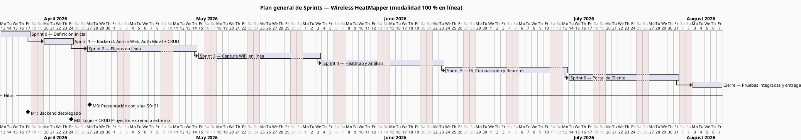
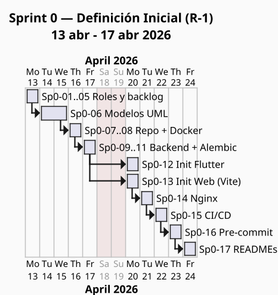
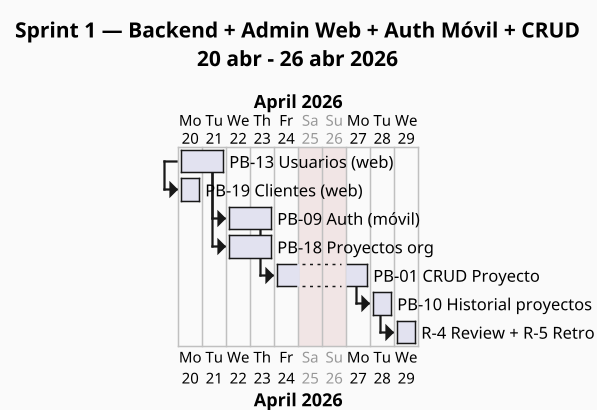

# 9. Cronograma

La planificación temporal del proyecto se organiza en **siete iteraciones** alineadas con el marco Scrum: un Sprint inicial de definición (Sprint 0, una semana), seis Sprints de desarrollo de dos semanas (Sprints 1 al 6) y una semana de cierre para pruebas integradas y entrega final. La **revisión conjunta del Sprint 0 + Sprint 1 se realiza el 27 de abril de 2026**, conforme al hito M0 del plan.

A continuación se presenta un Diagrama de Gantt por cada Sprint (vista general, Sprint 0 y Sprint 1; los Sprints 2 al 6 figuran en el Plan de Implementación vigente).

## 9.1 Diagrama de Gantt — Plan general

> _Figura 4: Diagrama de Gantt general — distribución de Sprints del Wireless HeatMapper, abril–julio 2026._

## 9.2 Diagrama de Gantt — Sprint 0 (Definición Inicial)

> _Figura 5: Diagrama de Gantt — Sprint 0 (Definición Inicial), 13–17 abril 2026._

## 9.3 Diagrama de Gantt — Sprint 1 (Fundación CRUD)

> _Figura 6: Diagrama de Gantt — Sprint 1 (Fundación CRUD), 20–26 abril 2026._

## 9.4 Sprints 2 al 6 (vista resumida)

| Sprint   | Período            | HU                  | PHU | Objetivo del Sprint                                                |
| -------- | ------------------ | ------------------- | --: | ------------------------------------------------------------------ |
| Sprint 2 | 28 abr – 11 may 26 | PB-02, PB-11        |  16 | Planos en línea (importar + calibrar)                              |
| Sprint 3 | 12 may – 25 may 26 | PB-03, PB-04        |  21 | Captura WiFi en línea con ingesta REST                             |
| Sprint 4 | 26 may – 8 jun 26  | PB-05, PB-06        |  26 | Heatmap (interpolación backend) + análisis automático de cobertura |
| Sprint 5 | 9 jun – 22 jun 26  | PB-07, PB-12, PB-08 |  42 | IA, comparación de escenarios y exportación de reportes            |
| Sprint 6 | 23 jun – 6 jul 26  | PB-15, PB-16, PB-17 |  26 | Portal de cliente y enlace único                                   |
| Cierre   | 7 jul – 11 jul 26  | RP6 + integración   |   — | Pruebas integradas, ajustes finales y entrega                      |

**Total Sprints 1–6 = 160 PHU**.
