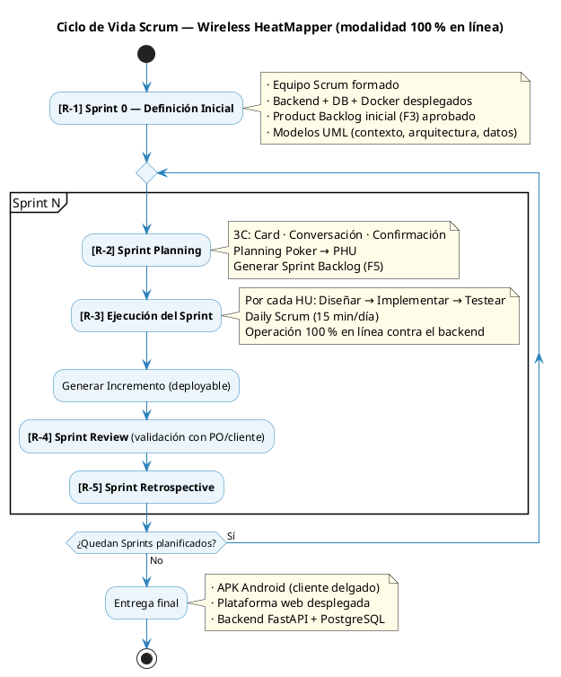
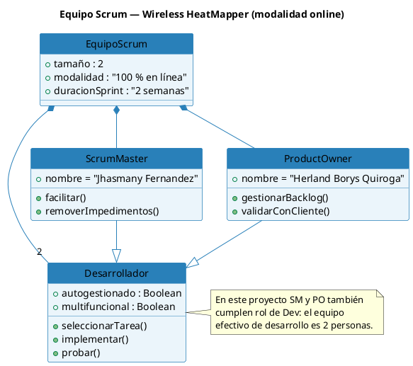
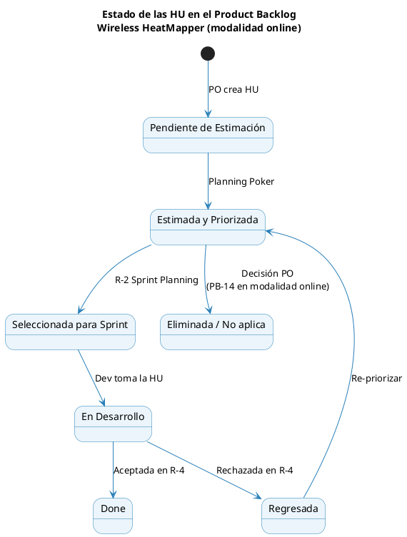

# 10. Proceso de Desarrollo SCRUM

## 10.1 Definiciones del Proceso de Desarrollo

### 10.1.1 Marco de trabajo

El proyecto adopta **Scrum** como marco de trabajo. Scrum es un **marco de trabajo**, no una metodología prescriptiva: define eventos, roles y artefactos pero no indica cómo se hace ingeniería. Para este proyecto, Scrum se integra con las cuatro actividades obligatorias de la ingeniería de software:

| #   | Actividad      | Cuándo ocurre                  | Responsable principal                     |
| --- | -------------- | ------------------------------ | ----------------------------------------- |
| 1   | Análisis       | Sprint Planning (R-2)          | Product Owner + equipo                    |
| 2   | Diseño         | Ejecución del Sprint (R-3)     | Equipo de desarrollo                      |
| 3   | Implementación | Ejecución del Sprint (R-3)     | Equipo de desarrollo                      |
| 4   | Pruebas        | Ejecución + Review (R-3 / R-4) | Dev (1.er filtro) · QA (2.do) · PO (3.er) |

El proceso es **incremental** (cada Sprint añade valor sobre el anterior) e **iterativo** (cada Sprint repite las cuatro actividades).

### 10.1.2 Ciclo de vida

> _Figura 7: Ciclo de vida Scrum aplicado a Wireless HeatMapper, integrado con las cuatro actividades obligatorias de ingeniería de software._

### 10.1.3 Eventos Scrum

| Evento                                | Cuándo                | Duración    | Resultado                                       |
| ------------------------------------- | --------------------- | ----------- | ----------------------------------------------- |
| **R-1 Definición Inicial (Sprint 0)** | Antes del Sprint 1    | 1 semana    | Modelos base + Product Backlog (F3) + infra     |
| **R-2 Sprint Planning**               | Inicio de cada Sprint | ≤ 4 horas   | Sprint Backlog (F5) + objetivo del Sprint       |
| **R-3 Ejecución del Sprint**          | Durante el Sprint     | 2 semanas   | Incremento operativo (deployable)               |
| **R-3.1 Daily Scrum**                 | Cada día del Sprint   | 15 minutos  | Sincronización + identificación de impedimentos |
| **R-4 Sprint Review**                 | Último día del Sprint | ≤ 2 horas   | Demo + Product Backlog actualizado              |
| **R-5 Sprint Retrospective**          | Después del Review    | ≤ 1.5 horas | Plan de mejora para el siguiente Sprint         |

### 10.1.4 Equipo SCRUM

| Persona                            | Rol                     | Descripción                                                             |
| ---------------------------------- | ----------------------- | ----------------------------------------------------------------------- |
| Herland Borys Quiroga Flores       | **Product Owner / Dev** | Gestión del Product Backlog, validación con cliente real, dev móvil/web |
| Jhasmany Jhunnior Fernandez Ortega | **Scrum Master / Dev**  | Facilitación de ceremonias, eliminación de impedimentos, dev backend/IA |
| Ambos                              | **Developers**          | Multifuncionales (backend, móvil, web, IA) y autogestionados            |

Adicionalmente:

- **Cliente real:** Bulldog Tech. — aceptación funcional de los incrementos.

> _Figura 8: Equipo Scrum del proyecto — distribución de roles y multifuncionalidad._

### 10.1.5 Objetivo del Producto

> **Objetivo del Producto:** Proveer a Bulldog Tech. y a sus clientes finales una solución integral, en línea y multiplataforma para el relevamiento, análisis y optimización de la cobertura WiFi en interiores, que sustituya el flujo manual actual (apps de WiFi analyzer + planos impresos + planillas Excel) por un proceso digital end-to-end con captura georreferenciada en tiempo real, generación automatizada de mapas de calor por interpolación espacial, análisis automático de cobertura y recomendaciones de posicionamiento de APs producidas por inteligencia artificial, accesible para los clientes finales mediante un portal web con enlace único.

### 10.1.6 Duración de los Sprints

| Sprint   | Inicio     | Fin        | Duración  |
| -------- | ---------- | ---------- | --------- |
| Sprint 0 | 13/04/2026 | 17/04/2026 | 1 semana  |
| Sprint 1 | 20/04/2026 | 26/04/2026 | 1 semana¹ |
| Sprint 2 | 28/04/2026 | 11/05/2026 | 2 semanas |
| Sprint 3 | 12/05/2026 | 25/05/2026 | 2 semanas |
| Sprint 4 | 26/05/2026 | 08/06/2026 | 2 semanas |
| Sprint 5 | 09/06/2026 | 22/06/2026 | 2 semanas |
| Sprint 6 | 23/06/2026 | 06/07/2026 | 2 semanas |
| Cierre   | 07/07/2026 | 11/07/2026 | 1 semana  |

¹ El Sprint 1 se ejecuta en una semana acelerada para coincidir con la revisión conjunta S0+S1 del 27 de abril de 2026 (hito M0). Los Sprints 2–6 mantienen la duración estándar de dos semanas.

### 10.1.7 Definition of Done (acordada en Sprint 0)

| Criterio                            | Verificación                                                     |
| ----------------------------------- | ---------------------------------------------------------------- |
| Código implementado en backend      | Endpoints REST documentados con OpenAPI/Swagger                  |
| Código implementado en cliente      | Móvil (Flutter) y/o web (React) consumiendo los endpoints        |
| Migraciones Alembic aplicadas       | Esquema PostgreSQL versionado y reversible                       |
| Pruebas unitarias                   | Cobertura ≥ 70 % en módulos nuevos del backend                   |
| Pruebas de integración              | Tests de endpoints contra BD efímera (pytest + httpx)            |
| Criterios de aceptación validados   | El PO ejecuta cada CA contra el incremento desplegado            |
| Code review aprobado                | Pull Request revisado por el otro miembro del equipo             |
| Mergeado a `main`                   | Squash-merge desde rama `feature/PB-XX-slug`                     |
| Despliegue automático               | Pipeline GitHub Actions construye imagen Docker                  |
| Sin almacenamiento local de dominio | El cliente móvil no persiste entidades de dominio entre sesiones |

### 10.1.8 Product Backlog (F3)

**Versión:** 2.0 (ajustada a modalidad 100 % en línea) · **Product Owner:** Herland Borys Quiroga Flores · **Fecha:** abril 2026.

**Cambios respecto al backlog original (modalidad offline):**

| Cambio                                      | Razón                                                                           |
| ------------------------------------------- | ------------------------------------------------------------------------------- |
| **PB-14 eliminado**                         | "Sincronizar proyecto al servidor" no aplica: toda operación ya es online       |
| **PB-13 (admin) reubicado al Sprint 1**     | El pre-aprovisionamiento de técnicos es prerrequisito de la autenticación móvil |
| **PB-01 y PB-10 adelantados al Sprint 1**   | El CRUD móvil de proyectos quedó implementado; se consolida la fundación CRUD   |
| **Estimaciones de PB-03 y PB-05 ajustadas** | El cliente delgado en línea reduce la carga de implementación móvil             |
| **PB-09 redefinido**                        | Autenticación contra backend con JWT (no contra SQLite local)                   |
| **PB-02 redefinido**                        | El plano se sube al backend; el cliente solo lo solicita por URL firmada        |

**Diagrama de estados del Product Backlog:**

> _Figura 9: Diagrama de estados de las Historias de Usuario en el Product Backlog del Wireless HeatMapper._

**Product Backlog completo.** Las prioridades se expresan como Alta, Media y Baja. Los PHU corresponden a Puntos de Historia en escala de Fibonacci (1, 2, 3, 5, 8, 13, 21). A continuación se presenta primero un cuadro resumen y luego el detalle de cada Historia en formato de formulario tabular.

**Cuadro resumen del Product Backlog:**

| Id        | Nombre corto                             | Prioridad | PHU | Sprint   | RP  | Estado    |
| --------- | ---------------------------------------- | --------- | --: | -------- | --- | --------- |
| PB-13     | Gestionar usuarios (admin web)           | Alta      |   8 | Sprint 1 | RP7 | Done      |
| PB-19     | Gestionar clientes (admin web)           | Alta      |   3 | Sprint 1 | RP7 | Done      |
| PB-09     | Autenticar usuario (móvil)               | Alta      |   5 | Sprint 1 | RP8 | Done      |
| PB-18     | Ver proyectos de la organización         | Baja      |   5 | Sprint 1 | RP7 | Done      |
| PB-01     | Gestionar proyecto de survey             | Alta      |   5 | Sprint 1 | RP8 | Done      |
| PB-10     | Ver historial de proyectos               | Media     |   3 | Sprint 1 | RP8 | Done      |
| PB-02     | Importar plano de edificio               | Alta      |   8 | Sprint 2 | RP2 | Estimada  |
| PB-11     | Calibrar escala del plano                | Alta      |   8 | Sprint 2 | RP2 | Estimada  |
| PB-03     | Capturar señales WiFi (en línea)         | Alta      |  13 | Sprint 3 | RP1 | Estimada  |
| PB-04     | Marcar puntos de medición                | Alta      |   8 | Sprint 3 | RP2 | Estimada  |
| PB-05     | Generar mapa de calor                    | Alta      |  13 | Sprint 4 | RP3 | Estimada  |
| PB-06     | Analizar cobertura automáticamente       | Alta      |  13 | Sprint 4 | RP4 | Estimada  |
| PB-07     | Obtener recomendaciones de APs por IA    | Alta      |  21 | Sprint 5 | RP5 | Estimada  |
| PB-12     | Comparar escenario actual vs propuesto   | Media     |   8 | Sprint 5 | RP5 | Estimada  |
| PB-08     | Exportar reporte técnico                 | Media     |  13 | Sprint 5 | RP6 | Estimada  |
| PB-15     | Generar enlace de cliente                | Media     |   5 | Sprint 6 | RP9 | Estimada  |
| PB-16     | Ver heatmap interactivo (portal cliente) | Media     |  13 | Sprint 6 | RP9 | Estimada  |
| PB-17     | Ver análisis y plan AP (portal cliente)  | Media     |   8 | Sprint 6 | RP9 | Estimada  |
| ~~PB-14~~ | ~~Sincronizar proyecto al servidor~~     | —         |   — | N/A      | —   | Eliminada |

**Detalle de cada Historia de Usuario (formato F4 — formulario):**

**PB-13 — Gestionar usuarios (admin web)**

| Campo           | Contenido                                                               |
| --------------- | ----------------------------------------------------------------------- |
| Prioridad / PHU | Alta · 8                                                                |
| Sprint / RP     | Sprint 1 · RP7                                                          |
| Estado          | Done                                                                    |
| Como            | Administrador                                                           |
| Quiero          | Crear, activar y desactivar cuentas de técnicos desde el panel web      |
| Para            | Controlar el acceso al sistema sin intervenir el código de la app móvil |

**PB-19 — Gestionar clientes (admin web)**

| Campo           | Contenido                                           |
| --------------- | --------------------------------------------------- |
| Prioridad / PHU | Alta · 3                                            |
| Sprint / RP     | Sprint 1 · RP7                                      |
| Estado          | Done                                                |
| Como            | Administrador                                       |
| Quiero          | Crear y gestionar clientes desde el panel web       |
| Para            | Que los técnicos los seleccionen al crear proyectos |

**PB-09 — Autenticar usuario (móvil)**

| Campo           | Contenido                                  |
| --------------- | ------------------------------------------ |
| Prioridad / PHU | Alta · 5                                   |
| Sprint / RP     | Sprint 1 · RP8                             |
| Estado          | Done                                       |
| Como            | Técnico de campo                           |
| Quiero          | Iniciar sesión en la app contra el backend |
| Para            | Acceder solo a mis proyectos               |

**PB-18 — Ver proyectos de la organización**

| Campo           | Contenido                                                                      |
| --------------- | ------------------------------------------------------------------------------ |
| Prioridad / PHU | Baja · 5                                                                       |
| Sprint / RP     | Sprint 1 · RP7                                                                 |
| Estado          | Done                                                                           |
| Como            | Administrador                                                                  |
| Quiero          | Ver todos los proyectos de todos los técnicos con su estado y última actividad |
| Para            | Supervisar el trabajo de campo                                                 |

**PB-01 — Gestionar proyecto de survey**

| Campo           | Contenido                                                  |
| --------------- | ---------------------------------------------------------- |
| Prioridad / PHU | Alta · 5                                                   |
| Sprint / RP     | Sprint 1 · RP8                                             |
| Estado          | Done                                                       |
| Como            | Técnico                                                    |
| Quiero          | Crear, editar, archivar y eliminar proyectos en el backend |
| Para            | Organizar mis mediciones por edificio o cliente            |

**PB-10 — Ver historial de proyectos**

| Campo           | Contenido                                       |
| --------------- | ----------------------------------------------- |
| Prioridad / PHU | Media · 3                                       |
| Sprint / RP     | Sprint 1 · RP8                                  |
| Estado          | Done                                            |
| Como            | Técnico                                         |
| Quiero          | Ver mis proyectos con estado y última actividad |
| Para            | Retomarlos o consultarlos rápidamente           |

**PB-02 — Importar plano de edificio**

| Campo           | Contenido                                                            |
| --------------- | -------------------------------------------------------------------- |
| Prioridad / PHU | Alta · 8                                                             |
| Sprint / RP     | Sprint 2 · RP2                                                       |
| Estado          | Estimada                                                             |
| Como            | Técnico                                                              |
| Quiero          | Subir un plano (PNG/JPG/PDF) al backend asociado a un proyecto       |
| Para            | Disponer de un soporte gráfico georreferenciable para las mediciones |

**PB-11 — Calibrar escala del plano**

| Campo           | Contenido                                                               |
| --------------- | ----------------------------------------------------------------------- |
| Prioridad / PHU | Alta · 8                                                                |
| Sprint / RP     | Sprint 2 · RP2                                                          |
| Estado          | Estimada                                                                |
| Como            | Técnico                                                                 |
| Quiero          | Definir la escala real del plano dibujando una línea de referencia      |
| Para            | Convertir distancias en píxeles a metros reales en cálculos posteriores |

**PB-03 — Capturar señales WiFi (en línea)**

| Campo           | Contenido                                                           |
| --------------- | ------------------------------------------------------------------- |
| Prioridad / PHU | Alta · 13                                                           |
| Sprint / RP     | Sprint 3 · RP1                                                      |
| Estado          | Estimada                                                            |
| Como            | Técnico                                                             |
| Quiero          | Que la app escanee redes WiFi y envíe cada lote en línea al backend |
| Para            | Persistir mediciones de RSSI georreferenciadas sin estado local     |

**PB-04 — Marcar puntos de medición**

| Campo           | Contenido                                                     |
| --------------- | ------------------------------------------------------------- |
| Prioridad / PHU | Alta · 8                                                      |
| Sprint / RP     | Sprint 3 · RP2                                                |
| Estado          | Estimada                                                      |
| Como            | Técnico                                                       |
| Quiero          | Marcar la posición de cada punto sobre el plano               |
| Para            | Asociar mediciones a coordenadas precisas dentro del edificio |

**PB-05 — Generar mapa de calor**

| Campo           | Contenido                                                            |
| --------------- | -------------------------------------------------------------------- |
| Prioridad / PHU | Alta · 13                                                            |
| Sprint / RP     | Sprint 4 · RP3                                                       |
| Estado          | Estimada                                                             |
| Como            | Técnico                                                              |
| Quiero          | Ver un mapa de calor continuo sobre el plano generado por el backend |
| Para            | Visualizar la cobertura WiFi de manera intuitiva                     |

**PB-06 — Analizar cobertura automáticamente**

| Campo           | Contenido                                                                     |
| --------------- | ----------------------------------------------------------------------------- |
| Prioridad / PHU | Alta · 13                                                                     |
| Sprint / RP     | Sprint 4 · RP4                                                                |
| Estado          | Estimada                                                                      |
| Como            | Técnico                                                                       |
| Quiero          | Que el backend identifique zonas muertas (< −90 dBm), solapamientos y CCI/ACI |
| Para            | Diagnosticar problemas de cobertura sin análisis manual                       |

**PB-07 — Obtener recomendaciones de APs por IA**

| Campo           | Contenido                                                                                |
| --------------- | ---------------------------------------------------------------------------------------- |
| Prioridad / PHU | Alta · 21                                                                                |
| Sprint / RP     | Sprint 5 · RP5                                                                           |
| Estado          | Estimada                                                                                 |
| Como            | Técnico                                                                                  |
| Quiero          | Que el backend (IA) sugiera posiciones óptimas para APs garantizando cobertura ≥ −70 dBm |
| Para            | Optimizar la red WiFi del cliente con criterios técnicos objetivos                       |

**PB-12 — Comparar escenario actual vs propuesto**

| Campo           | Contenido                                                                           |
| --------------- | ----------------------------------------------------------------------------------- |
| Prioridad / PHU | Media · 8                                                                           |
| Sprint / RP     | Sprint 5 · RP5                                                                      |
| Estado          | Estimada                                                                            |
| Como            | Técnico                                                                             |
| Quiero          | Ver el heatmap actual junto al heatmap proyectado del escenario optimizado de la IA |
| Para            | Cuantificar la mejora esperada antes de ejecutar cambios físicos                    |

**PB-08 — Exportar reporte técnico**

| Campo           | Contenido                                                                |
| --------------- | ------------------------------------------------------------------------ |
| Prioridad / PHU | Media · 13                                                               |
| Sprint / RP     | Sprint 5 · RP6                                                           |
| Estado          | Estimada                                                                 |
| Como            | Técnico                                                                  |
| Quiero          | Exportar un reporte PDF con heatmap actual, análisis y plan AP propuesto |
| Para            | Entregar un documento profesional al cliente                             |

**PB-15 — Generar enlace de cliente**

| Campo           | Contenido                                                                              |
| --------------- | -------------------------------------------------------------------------------------- |
| Prioridad / PHU | Media · 5                                                                              |
| Sprint / RP     | Sprint 6 · RP9                                                                         |
| Estado          | Estimada                                                                               |
| Como            | Técnico                                                                                |
| Quiero          | Generar un enlace único (token + expiración) para compartir un proyecto con el cliente |
| Para            | Permitir el acceso seguro al portal de cliente sin crear cuentas formales              |

**PB-16 — Ver heatmap interactivo (portal cliente)**

| Campo           | Contenido                                                                      |
| --------------- | ------------------------------------------------------------------------------ |
| Prioridad / PHU | Media · 13                                                                     |
| Sprint / RP     | Sprint 6 · RP9                                                                 |
| Estado          | Estimada                                                                       |
| Como            | Cliente                                                                        |
| Quiero          | Acceder por enlace único a una vista web con el heatmap actual y el proyectado |
| Para            | Comprender la cobertura WiFi de mi propio edificio                             |

**PB-17 — Ver análisis y plan AP (portal cliente)**

| Campo           | Contenido                                                                          |
| --------------- | ---------------------------------------------------------------------------------- |
| Prioridad / PHU | Media · 8                                                                          |
| Sprint / RP     | Sprint 6 · RP9                                                                     |
| Estado          | Estimada                                                                           |
| Como            | Cliente                                                                            |
| Quiero          | Ver el análisis de cobertura y las posiciones recomendadas de APs en el portal web |
| Para            | Tomar decisiones informadas sobre la inversión en infraestructura WiFi             |

**PB-14 — Sincronizar proyecto al servidor (eliminada)**

| Campo         | Contenido                                                                                                              |
| ------------- | ---------------------------------------------------------------------------------------------------------------------- |
| Estado        | Eliminada en modalidad online                                                                                          |
| Justificación | Todas las operaciones ya se realizan contra el backend en línea; la sincronización diferida deja de aplicar por diseño |

**Resumen por Sprint:**

| Sprint    | HU                                       | PHU         | Objetivo del Sprint                                                |
| --------- | ---------------------------------------- | ----------- | ------------------------------------------------------------------ |
| Sprint 1  | PB-13, PB-19, PB-09, PB-18, PB-01, PB-10 | 29          | Backend base + admin web + auth móvil + CRUD proyectos móvil       |
| Sprint 2  | PB-02, PB-11                             | 16          | Planos en línea (importar + calibrar)                              |
| Sprint 3  | PB-03, PB-04                             | 21          | Captura WiFi en línea con ingesta REST                             |
| Sprint 4  | PB-05, PB-06                             | 26          | Heatmap (interpolación backend) + análisis automático de cobertura |
| Sprint 5  | PB-07, PB-12, PB-08                      | 42          | IA, comparación de escenarios y exportación de reportes            |
| Sprint 6  | PB-15, PB-16, PB-17                      | 26          | Portal de cliente y enlace único                                   |
| **TOTAL** |                                          | **160 PHU** |                                                                    |
