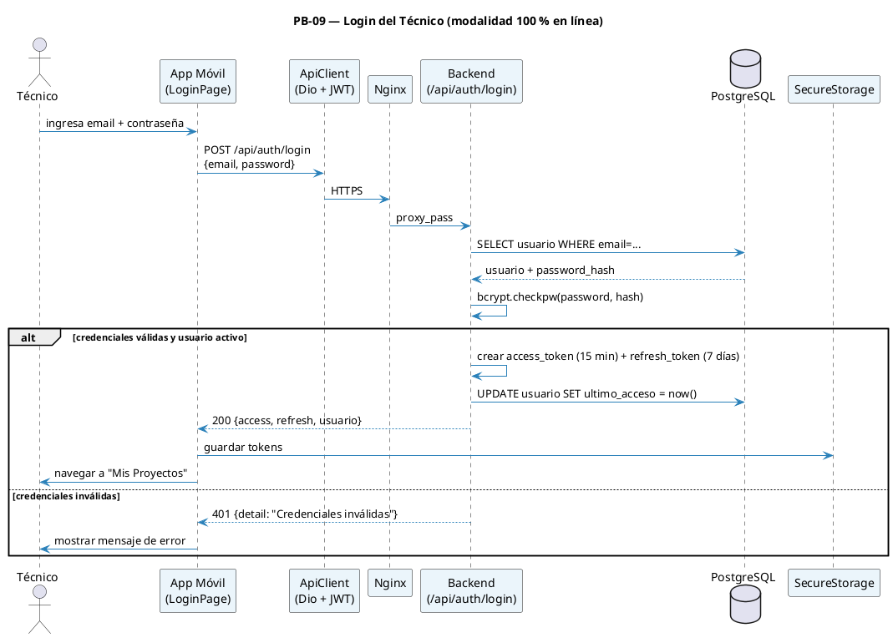
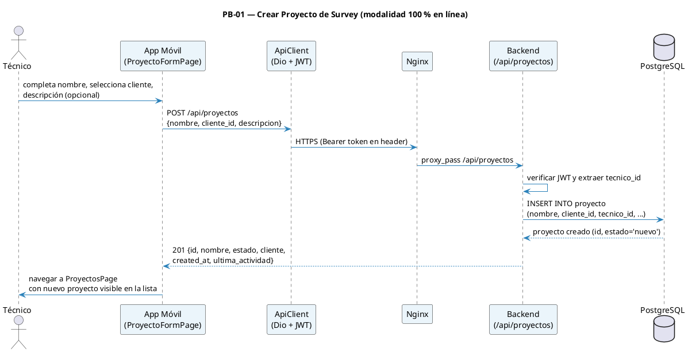
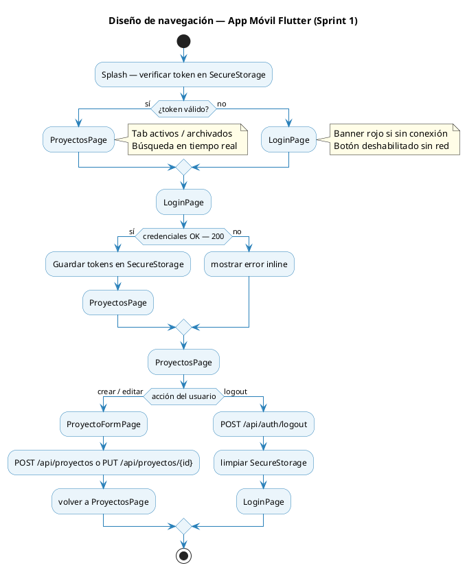

# 10.7 Sprint 1 — Ejecución (R-3)

## 10.7.1 Diagrama de secuencia — Login extremo a extremo (PB-09)

> _Figura 19: Diagrama de secuencia — Login extremo a extremo (PB-09)._

## 10.7.2 Diagrama de secuencia — Crear Proyecto (PB-01)

> _Figura 20: Diagrama de secuencia — Crear proyecto de survey (PB-01)._

## 10.7.3 Diseño de interfaces de usuario

Siguiendo la actividad R-3 del marco Scrum adoptado por el equipo, para cada HU seleccionada se definió el diseño de la interfaz antes de implementarla. La app móvil sigue **Material 3** con paleta clara/oscura y tokens de diseño (`AppPalette`, `AppSpacing`, `AppRadius`); la plataforma web usa CSS Modules con variables de color, tipografía Poppins/Inter y un sistema consistente de badges, tablas y modales.

**Pantallas diseñadas e implementadas en Sprint 1:**

| Plataforma | Pantalla                  | Componentes de diseño clave                                             |
| ---------- | ------------------------- | ----------------------------------------------------------------------- |
| Móvil      | `LoginPage`               | Card centrada, campos email/contraseña, banner rojo "Sin conexión", CTA |
| Móvil      | `ProyectosPage`           | AppBar, SearchBar, ListView con tarjetas de proyecto, FAB "+ Nuevo"     |
| Móvil      | `ProyectoFormPage`        | Form scrollable, DropdownSearch clientes, TextFields, Guardar/Cancelar  |
| Web Admin  | `LoginAdmin.tsx`          | Layout centrado, card login, validación inline con react-hook-form      |
| Web Admin  | `GestionUsuarios.tsx`     | Sidebar + tabla paginada, modal "Nuevo técnico", toggle activo/inactivo |
| Web Admin  | `GestionClientes.tsx`     | Tabla, badge estado activo/inactivo, modal crear cliente                |
| Web Admin  | `ListadoProyectosOrg.tsx` | Tabla con filtros (técnico, estado), paginación, acciones contextuales  |

### 10.7.3.1 Flujo de navegación — App Móvil (Sprint 1)

> _Figura 21: Flujo de navegación de la app móvil en el Sprint 1._

## 10.7.4 Resultados de pruebas — backend (pytest)

| Suite de tests            | Tests  | Estado | HU cubierta         |
| ------------------------- | ------ | ------ | ------------------- |
| `tests/test_auth.py`      | 12     | 12/12  | PB-09               |
| `tests/test_usuarios.py`  | OK     | Sí     | PB-13               |
| `tests/test_clientes.py`  | 16     | 16/16  | PB-19               |
| `tests/test_proyectos.py` | OK     | Sí     | PB-18, PB-01, PB-10 |
| `tests/test_health.py`    | OK     | Sí     | Infraestructura     |
| **TOTAL**                 | **60** | 60/60  | Cobertura **87 %**  |

## 10.7.5 Daily Scrum (R-3.1)

El equipo realizó el **Daily Scrum de 15 minutos** cada día hábil durante el Sprint 1 (20–26 abr 2026), respondiendo las tres preguntas estándar:

| #   | Pregunta                                                             | Propósito                                                |
| --- | -------------------------------------------------------------------- | -------------------------------------------------------- |
| 1   | ¿Qué hice **ayer** para contribuir al Sprint?                        | Sincronizar avances y detectar solapamiento de trabajo   |
| 2   | ¿Qué voy a hacer **hoy** para contribuir al Sprint?                  | Planear el día y señalar dependencias entre miembros     |
| 3   | ¿Veo algún **impedimento** que impida lograr el objetivo del Sprint? | Identificar bloqueos para que el SM los elimine o escale |

**Impedimentos detectados y resoluciones durante el Sprint 1:**

| Fecha       | Impedimento detectado                                         | Resolución (SM)                                                  |
| ----------- | ------------------------------------------------------------- | ---------------------------------------------------------------- |
| 21 abr 2026 | Mock de `ConnectivityMonitor` en Flutter tests falla          | Registrado como deuda técnica; postergado al inicio del Sprint 2 |
| 22 abr 2026 | 99 hrs estimadas superan capacidad real (~80 hrs disponibles) | PO re-priorizó; se mantienen las 6 HU sin agregar tareas nuevas  |
| 23 abr 2026 | CI/CD no genera APK Android automáticamente                   | Construcción manual para Sprint 1; tarea nueva para Sprint 2     |
| 24 abr 2026 | Framework de pruebas web (Vitest) no configurado              | PO decidió posponer configuración al inicio del Sprint 2         |

## 10.7.6 Definition of Done — Sprint 1

| Criterio DoD                                                                                  | Estado      |
| --------------------------------------------------------------------------------------------- | ----------- |
| Migración `0001` aplicada y reversible                                                        | Sí          |
| Migración `0002_cliente_y_proyecto` aplicada y reversible                                     | Sí          |
| Coverage backend ≥ 80 % en módulos auth, usuarios, clientes, proyectos                        | 87 %        |
| OpenAPI publicado con tags `auth`, `admin/usuarios`, `clientes`, `proyectos`                  | Sí          |
| Bundle web sirviendo `/admin/login`, `/admin/usuarios`, `/admin/clientes`, `/admin/proyectos` | Sí          |
| APK de la app móvil con login funcional + CRUD proyectos                                      | Sí          |
| Widget tests de `ProyectosPage` y `ProyectoFormPage` pasando                                  | Parcial 5/8 |
| Demo grabada del flujo completo                                                               | ⏳          |
