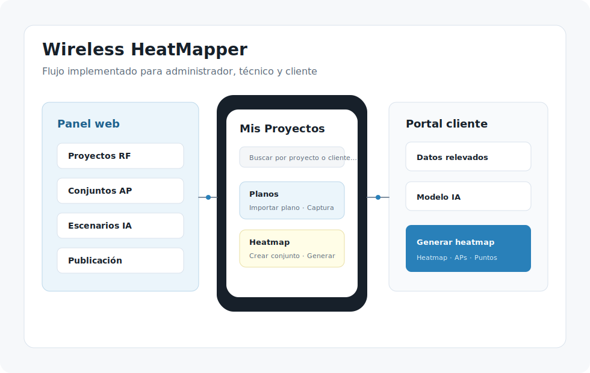
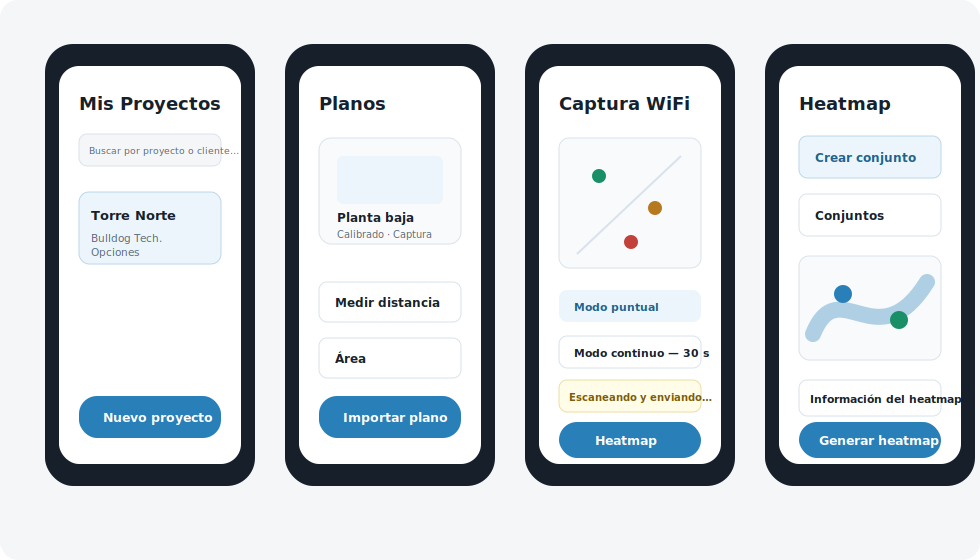
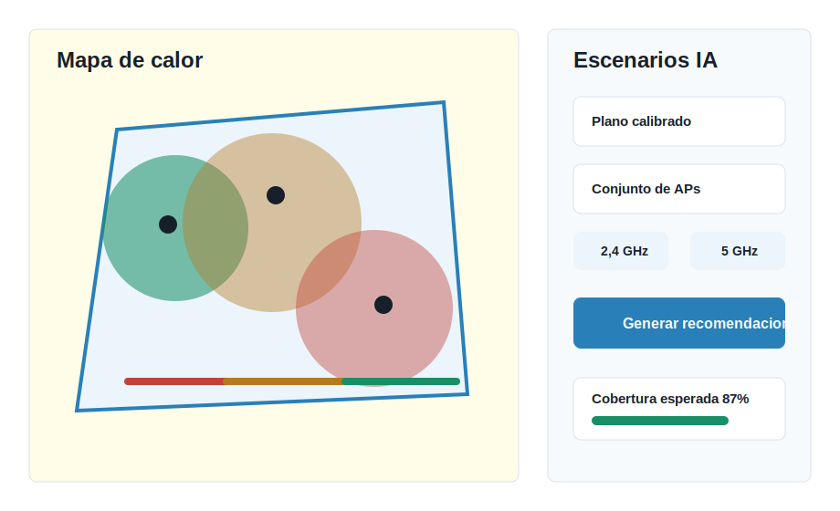
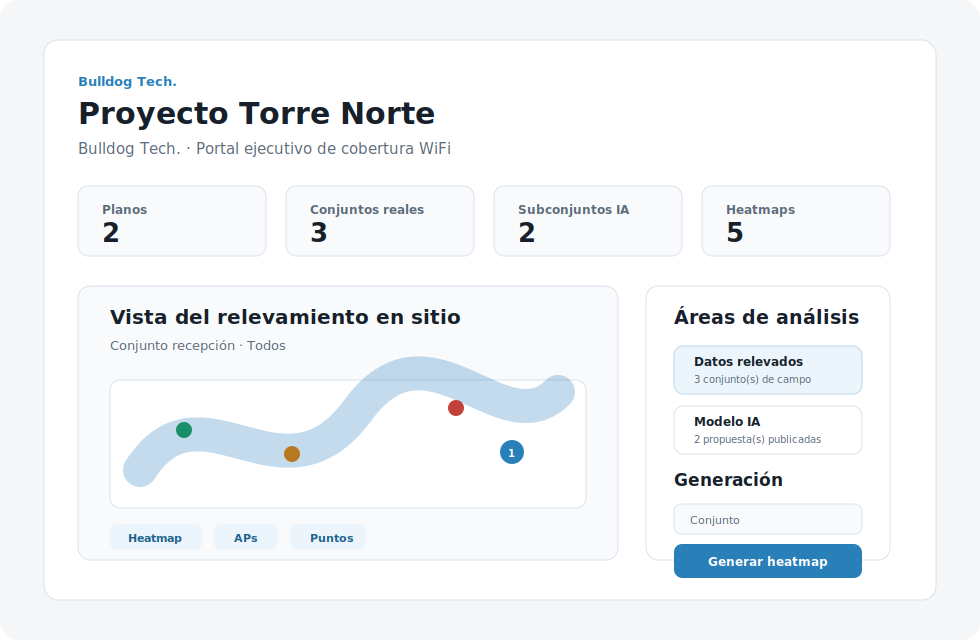

# Wireless HeatMapper - Guion resumido para presentación final

**Proyecto:** Sistema Inteligente de Análisis y Optimización de Cobertura WiFi mediante Mapas de Calor  
**Materia:** Ingeniería de Software II - FICCT-UAGRM  
**Grupo:** 24  
**Equipo:** Jhasmany Jhunnior Fernandez Ortega - Herland Borys Quiroga Flores  
**Cliente:** Bulldog Tech.  
**Fecha de exposición:** 30-jun-2026  
**Base documental:** PAPS Online y Plan de Implementación Scrum vigente en `docs/ONLINE/PLAN-IMPLEMENTACION/`

---

## Criterio editorial para el PowerPoint

La presentación debe tener **máximo 12 diapositivas** y defender el proyecto como producto de ingeniería. Las diapositivas deben mostrar pocas ideas visibles; la explicación técnica va en notas del expositor.

**No incluir:** sincronización offline, PDF como alcance vigente, Kriging como algoritmo operativo, estados de gobernanza RF, IA ejecutada en móvil, modelado de muros/materiales no implementado.

---

## Diapositiva 1 - Portada

**Mensaje central:** Presentar el producto, el equipo y el cliente.

**Contenido visible:**

- Wireless HeatMapper
- Sistema inteligente para análisis y optimización de cobertura WiFi
- Ingeniería de Software II - Grupo 24
- Cliente: Bulldog Tech.
- Jhasmany Jhunnior Fernandez Ortega - Herland Borys Quiroga Flores

**Visual sugerido:** Logo del sistema, fondo oscuro técnico y una línea de color tipo heatmap.  
**Imagen integrada:**  

**Notas:** Abrir con: "El proyecto convierte mediciones WiFi de campo en evidencia técnica centralizada, optimizable y compartible con el cliente."

---

## Diapositiva 2 - Problema y oportunidad

**Mensaje central:** El diseño WiFi interior basado solo en experiencia no garantiza cobertura real.

**Contenido visible:**

- La señal cambia por distancia, obstáculos, interferencia y canales.
- Las zonas débiles suelen detectarse tarde.
- El cliente necesita evidencia visual para decidir.
- Bulldog Tech. requiere un proceso repetible y trazable.

**Visual sugerido:** Comparación "estimación empírica" vs. "medición + heatmap + propuesta".  
**Notas:** Enfatizar que el problema no es dibujar colores; es tomar decisiones de red con datos medidos.

---

## Diapositiva 3 - Solución propuesta

**Mensaje central:** Sistema integrado 100 % en línea para capturar, analizar, optimizar y publicar resultados WiFi.

**Contenido visible:**

1. Técnico captura RSSI desde Android.
2. Backend persiste datos en PostgreSQL.
3. Sistema genera heatmaps sobre planos calibrados.
4. IA propone conjuntos AP derivados.
5. Cliente revisa resultados desde un portal por enlace.

**Visual sugerido:** Flujo horizontal: Captura -> Backend -> Heatmap -> IA -> Portal.  
**Imagen integrada:**  

**Notas:** Aclarar que la app móvil es cliente delgado y no mantiene base local de dominio.

---

## Diapositiva 4 - Arquitectura online

**Mensaje central:** La arquitectura evita doble fuente de verdad y concentra la lógica en backend.

**Contenido visible:**

| Capa | Tecnología | Responsabilidad |
| ---- | ---------- | --------------- |
| Móvil | Flutter / Dart | Captura y visualización operativa |
| Web | React + TypeScript | Admin y portal cliente |
| Backend | FastAPI / Python | REST, validación, heatmaps e IA |
| Datos | PostgreSQL 15 | Fuente única de verdad |
| Infra | Docker Compose + Nginx | Despliegue y reverse proxy |

**Visual sugerido:** Diagrama de arquitectura con móvil/web -> Nginx -> FastAPI -> PostgreSQL.  
**Imagen para crear en PPT:** diagrama limpio de arquitectura online en 5 bloques: App móvil, Web admin/portal, Nginx, FastAPI, PostgreSQL. Usar el diagrama existente solo como referencia, no insertarlo completo si queda saturado.

**Notas:** Resaltar la decisión de modalidad 100 % en línea: sin `sqflite`, sin `drift`, sin sincronización diferida.

---

## Diapositiva 5 - Alcance y Scrum

**Mensaje central:** El proyecto se desarrolló incrementalmente y con trazabilidad entre RP, HU y sprints.

**Contenido visible:**

| Sprint | Valor entregado |
| ------ | --------------- |
| S0-S1 | Base técnica, admin, auth y proyectos |
| S2-S3 | Planos, calibración, captura WiFi y puntos |
| S4 | Conjuntos AP y heatmaps backend |
| S5 | IA RF y comparación de propuestas |
| S6 | Portal cliente y enlaces únicos |

**Dato clave:** 17 HU vigentes - 142 PHU - PB-14 eliminada por modalidad online.

**Visual sugerido:** Roadmap de sprints compacto, sin imagen adicional.

**Notas:** Mencionar R-1 a R-5 del enfoque Scrum y que el alcance fue refinado para mantener coherencia técnica.

---

## Diapositiva 6 - Flujo de uso completo

**Mensaje central:** El sistema cubre el ciclo desde administración hasta entrega al cliente.

**Contenido visible:**

1. Admin registra técnicos y clientes.
2. Técnico crea proyecto y sube plano.
3. Técnico calibra escala y marca puntos.
4. App envía mediciones RSSI al backend.
5. Backend genera heatmap.
6. Web genera propuesta IA.
7. Admin publica contenido.
8. Cliente accede por enlace.

**Visual sugerido:** Diagrama de proceso de 8 pasos con colores por canal.  
**Imagen integrada:**  

**Notas:** Esta diapositiva puede guiar la demo en vivo.

---

## Diapositiva 7 - Núcleo del modelo de datos RF

**Mensaje central:** La parte más importante del esquema relacional es el flujo RF desde proyecto hasta heatmap.

**Contenido visible:**

- `proyecto` agrupa el trabajo del cliente.
- `plano` contiene escala, dimensiones y polígono de interés.
- `punto_medicion` ubica cada captura en el plano.
- `lectura_rssi` guarda SSID, BSSID, canal, frecuencia y RSSI.
- `conjunto_ap` / `conjunto_ap_item` definen APs relevantes.
- `mapa_calor` persiste matriz, escala, APs usados y firma de mediciones.

**Visual sugerido:** Diagrama relacional parcial y limpio:

`proyecto -> plano -> punto_medicion -> lectura_rssi`  
`plano -> conjunto_ap -> conjunto_ap_item`  
`plano + conjunto_ap -> mapa_calor`

**Notas:** Explicar que la IA no tiene tablas de escenario separadas: persiste propuestas como `conjunto_ap` de origen `ia`, trazadas por `conjunto_origen_id`.

---

## Diapositiva 8 - Heatmaps y criterios RF

**Mensaje central:** Los mapas de calor se generan desde evidencia RSSI real y criterios técnicos explícitos.

**Contenido visible:**

- Fuente observada: `lectura_rssi.origen = CAMPO`.
- Algoritmo persistido: IDW.
- Objetivo de diseño: RSSI >= -70 dBm.
- Zona muerta: RSSI < -90 dBm.
- Android >= 8.0: máximo 4 scans / 2 min.
- Generación por AP individual, subconjunto o conjunto completo.

**Visual sugerido:** Plano con overlay heatmap y leyenda RSSI.  
**Imagen integrada:**  

**Notas:** Explicar que IDW interpola mediciones reales; no simula una red inexistente.

---

## Diapositiva 9 - IA RF y optimización AP

**Mensaje central:** La IA propone escenarios futuros sin alterar la evidencia real capturada.

**Contenido visible:**

- Entrada: plano calibrado, mediciones y conjunto AP técnico.
- Predictor: FSPL/log-distance con calibración local por banda.
- Corrección espacial si existen residuos suficientes.
- Salida: conjunto AP de origen `ia`.
- Heatmap proyectado: IDW sobre lecturas `IA_ESTIMADA`.

**Visual sugerido:** Pipeline: conjunto técnico -> predictor RF -> conjunto IA -> heatmap proyectado.  
**Imagen para crear en PPT:** reutilizar la misma estética de `heatmap-ia.svg`, pero no duplicar la imagen de la diapositiva anterior. Dibujar un pipeline compacto con tres bloques: conjunto técnico, predictor RF, conjunto IA.

**Notas:** Frase de defensa: "IDW y FSPL no compiten; IDW persiste mapas y FSPL estima escenarios futuros para la IA."

---

## Diapositiva 10 - Seguridad y portal cliente

**Mensaje central:** El cliente accede a resultados interactivos sin recibir acceso interno al sistema.

**Contenido visible:**

- Usuarios internos: JWT + refresh token + bcrypt.
- Portal: `/portal/:token`.
- Enlace con expiración y revocación.
- Contenido limitado a `conjunto_ids` y `mapa_ids`.
- Auditoría: accesos, último acceso e IP.
- Sin login para cliente y sin exposición de otros proyectos.

**Visual sugerido:** Dos carriles: usuario autenticado vs. cliente con enlace público controlado.  
**Imagen integrada:**  

**Notas:** El portal reemplaza el PDF porque permite entregar información visual e interactiva con control de acceso.

---

## Diapositiva 11 - Calidad y evidencia de implementación

**Mensaje central:** La solución está implementada por capas y acompañada por pruebas automatizadas.

**Contenido visible:**

- Backend: routers `auth`, `usuarios`, `clientes`, `proyectos`, `planos`, `mediciones`, `heatmaps`, `escenarios`, `share`.
- Tests backend: pytest para endpoints, heatmaps, IA y portal.
- Tests web: Vitest / React Testing Library.
- Tests móvil: unit/widget tests para auth, proyectos, planos, captura y heatmap.
- Migraciones Alembic y despliegue con Docker Compose.

**Visual sugerido:** Tres columnas textuales: Backend, Web, Móvil + una franja de infraestructura. Sin imagen adicional para reservar espacio al detalle de evidencia.

**Notas:** No prometer un porcentaje de cobertura si no se muestra reporte; hablar de cobertura funcional por áreas.

---

## Diapositiva 12 - Valor entregado y cierre

**Mensaje central:** Wireless HeatMapper convierte el relevamiento WiFi en un proceso medible, trazable y compartible.

**Contenido visible:**

- Evidencia centralizada en PostgreSQL.
- Mapas de calor basados en mediciones reales.
- Propuestas IA trazables desde conjuntos técnicos.
- Entrega profesional al cliente por portal seguro.
- Base extensible para nuevos criterios RF y despliegue real.

**Visual sugerido:** Cierre limpio con cuatro bloques pequeños: App móvil, Backend, Web admin, Portal cliente. No duplicar `vista-general.svg`; usar solo iconos o tarjetas mínimas.

**Notas:** Cierre sugerido: "El resultado no es solo una visualización de cobertura; es una cadena completa de evidencia técnica para tomar decisiones WiFi."

---

## Fuentes internas usadas

- `docs/ONLINE/Wireless Heatmapper - PAPS - Modalidad Online.md`
- `docs/ONLINE/PLAN-IMPLEMENTACION/00-indice.md`
- `docs/ONLINE/PLAN-IMPLEMENTACION/01-marco-scrum-online.md`
- `docs/ONLINE/PLAN-IMPLEMENTACION/03-modelo-arquitectura.md`
- `docs/ONLINE/PLAN-IMPLEMENTACION/05-product-backlog-online.md`
- `docs/ONLINE/PLAN-IMPLEMENTACION/18-reglas-gobernanza-conjuntos-ap-heatmaps.md`
- `docs/ONLINE/PLAN-IMPLEMENTACION/19-modelo-base-datos-implementado.md`
- `docs/ONLINE/PLAN-IMPLEMENTACION/20-criterios-fspl-heatmap-ia.md`
- `docs/ONLINE/PLAN-IMPLEMENTACION/21-auditoria-implementacion-vs-plan.md`

---

## Activos visuales sugeridos

- Logo: `docs/ONLINE/PRESENTACION/SLIDES/img/logo.png`
- Arquitectura: `docs/ONLINE/PRESENTACION/SLIDES/img/02-arq-despliegue-sprint-1.png`
- Vista general: `manual-usuario/assets/vista-general.svg`
- App móvil: `manual-usuario/assets/app-movil.svg`
- Panel admin: `manual-usuario/assets/panel-admin.svg`
- Heatmap/IA: `manual-usuario/assets/heatmap-ia.svg`
- Portal cliente: `manual-usuario/assets/portal-cliente.svg`

> Para la diapositiva del modelo de datos, crear un diagrama parcial nuevo centrado en `proyecto`, `plano`, `punto_medicion`, `lectura_rssi`, `conjunto_ap`, `conjunto_ap_item` y `mapa_calor`. No usar el diagrama completo si incluye seguridad, tokens o login.
