# Documento de Presentación Scrum — Sprint 0 y Sprint 1

**Referencia:** Enfoque Scrum v3.2 — M.Sc. Ing. Rolando Martínez Canedo
**Proyecto:** Wireless HeatMapper — Sistema Inteligente de Análisis y Optimización de Cobertura WiFi
**Materia:** Ingeniería de Software II — Grupo 24 — FICCT-UAGRM
**Cliente real:** Bulldog Tech.
**Modalidad:** 100 % en línea (sin persistencia local de dominio en el dispositivo móvil)
**Fecha de presentación:** 27 de abril de 2026

---

## UNIVERSIDAD AUTÓNOMA GABRIEL RENÉ MORENO

**Facultad de Ingeniería en Ciencias de la Computación y Telecomunicaciones**

**Docente:** Ing. Rolando Martínez
**Materia:** Ingeniería de Software II
**Grupo:** 24

**Estudiantes:**

| Estudiante                         | Registro  |
| ---------------------------------- | --------- |
| Fernandez Ortega Jhasmany Jhunnior | 207025509 |
| Quiroga Flores Herland Borys       | 200104373 |

**Santa Cruz — Bolivia, 27 de abril de 2026**

---

## Tabla de Contenido

1. [Marco de Trabajo Scrum](#1-marco-de-trabajo-scrum)
2. [Equipo Scrum](#2-equipo-scrum)
3. [R-1 — Sprint 0: Definición Inicial](#3-r-1--sprint-0-definición-inicial)
4. [Product Backlog (F3)](#4-product-backlog-f3)
5. [R-2 — Sprint Planning del Sprint 1](#5-r-2--sprint-planning-del-sprint-1)
6. [Historias de Usuario del Sprint 1 (F4)](#6-historias-de-usuario-del-sprint-1-f4)
7. [Sprint Backlog (F5) — Sprint 1](#7-sprint-backlog-f5--sprint-1)
8. [R-3 — Ejecución del Sprint 1](#8-r-3--ejecución-del-sprint-1)
9. [Modelos de Diseño](#9-modelos-de-diseño)
10. [R-4 — Sprint Review](#10-r-4--sprint-review)
11. [R-5 — Sprint Retrospective](#11-r-5--sprint-retrospective)

---

## 1. Marco de Trabajo Scrum

El proyecto adopta el **Enfoque Scrum v3.2** del M.Sc. Ing. Rolando Martínez Canedo (FICCT-UAGRM). Scrum es un **marco de trabajo**, no una metodología prescriptiva: define eventos, roles y artefactos, pero no indica cómo se hace ingeniería. Para este proyecto se integra Scrum con las cuatro actividades obligatorias de ingeniería de software:

| #   | Actividad      | Cuándo ocurre                | Responsable principal                     |
| --- | -------------- | ---------------------------- | ----------------------------------------- |
| 1   | Análisis       | Sprint Planning (R-2)        | Product Owner + equipo                    |
| 2   | Diseño         | Ejecución del Sprint (R-3)   | Equipo de desarrollo                      |
| 3   | Implementación | Ejecución del Sprint (R-3)   | Equipo de desarrollo                      |
| 4   | Pruebas        | Ejecución + Review (R-3/R-4) | Dev (1.er filtro) · QA (2.do) · PO (3.er) |

El proceso es **incremental** (cada Sprint añade valor sobre el anterior) e **iterativo** (cada Sprint repite las cuatro actividades).

### Ciclo de vida

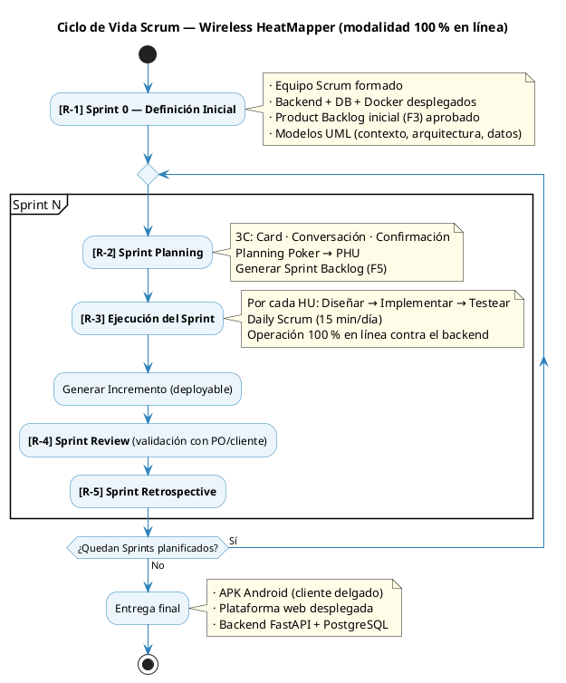

### Eventos del proceso

| Evento                                | Cuándo                | Duración    | Resultado                                       |
| ------------------------------------- | --------------------- | ----------- | ----------------------------------------------- |
| **R-1 Definición Inicial (Sprint 0)** | Antes del Sprint 1    | 1 semana    | Modelos base + Product Backlog (F3) + infra     |
| **R-2 Sprint Planning**               | Inicio de cada Sprint | ≤ 4 horas   | Sprint Backlog (F5) + objetivo del Sprint       |
| **R-3 Ejecución del Sprint**          | Durante el Sprint     | 2 semanas   | Incremento operativo (deployable)               |
| **R-3.1 Daily Scrum**                 | Cada día del Sprint   | 15 minutos  | Sincronización + identificación de impedimentos |
| **R-4 Sprint Review**                 | Último día del Sprint | ≤ 2 horas   | Demo + Product Backlog actualizado              |
| **R-5 Sprint Retrospective**          | Después del Review    | ≤ 1.5 horas | Plan de mejora para el siguiente Sprint         |

---

## 2. Equipo Scrum

| Rol                     | Persona                            | Responsabilidades clave                                                 |
| ----------------------- | ---------------------------------- | ----------------------------------------------------------------------- |
| **Scrum Master / Dev**  | Jhasmany Jhunnior Fernandez Ortega | Facilitación de ceremonias, eliminación de impedimentos, dev backend/IA |
| **Product Owner / Dev** | Herland Borys Quiroga Flores       | Gestión del Product Backlog, validación con cliente, dev móvil/web      |
| **Cliente real**        | Bulldog Tech.                      | Aceptación funcional de los incrementos                                 |
| **Docente tutor**       | Ing. Rolando Martínez              | Supervisión académica y revisión de avances                             |

Ambos miembros del equipo son **multifuncionales** (backend, móvil, web, IA) y **autogestionados** (toman tareas del Sprint Backlog sin asignación dirigida).

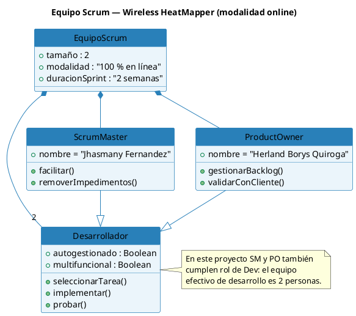

---

## 3. R-1 — Sprint 0: Definición Inicial

**Referencia Scrum:** R-1 — Definición Inicial
**Duración:** 1 semana (5 días hábiles) · 13 abr – 17 abr 2026
**Estado en Notion:** ✅ Implementado
**Objetivo:** Dejar listo el entorno de desarrollo y operación para que el Sprint 1 pueda iniciar con un backend desplegable, BD inicializada, CI/CD funcionando y modelos UML aprobados.

### 3.1 Justificación del Sprint 0

El Sprint 0 fue **obligatorio** en este proyecto porque:

- Es la primera vez que el equipo trabaja con la modalidad 100 % en línea: había que cablear la integración entre Docker Compose, Nginx, FastAPI y PostgreSQL.
- Antes de hacer Sprint Planning era necesario tener un Product Backlog ordenado (F3) y un esqueleto de arquitectura validado.
- El cliente de tipos del frontend depende del OpenAPI que publica el backend, por lo que el backend "vacío pero corriendo" debía existir desde el día 1 del Sprint 1.

### 3.2 Tareas del Sprint 0

| Id        | Tarea                                                                               | Responsable |     Estim. | Estado       |
| --------- | ----------------------------------------------------------------------------------- | ----------- | ---------: | ------------ |
| Sp0-01    | Definir equipo Scrum, roles y formato de Daily                                      | Ambos       |     0.5 hr | ✅ Terminado |
| Sp0-02    | Confirmar objetivo del producto y del proyecto                                      | Borys (PO)  |       1 hr | ✅ Terminado |
| Sp0-03    | Refinar y aprobar el Product Backlog (F3) ajustado a modalidad online               | Borys (PO)  |      3 hrs | ✅ Terminado |
| Sp0-04    | Aprobar duración estándar de Sprint = 2 semanas                                     | Ambos       |     0.5 hr | ✅ Terminado |
| Sp0-05    | Definir Definition of Done                                                          | Ambos       |       1 hr | ✅ Terminado |
| Sp0-06    | Aprobar diagramas: Contexto, Arquitectura (paquetes + despliegue), Datos            | Ambos       |      4 hrs | ✅ Terminado |
| Sp0-07    | Crear repositorio GitHub con estructura de monorepo (`backend/`, `mobile/`, `web/`) | Jhasmany    |      2 hrs | ✅ Terminado |
| Sp0-08    | Crear `docker-compose.yml` con servicios `db`, `backend`, `web`, `nginx`            | Jhasmany    |      4 hrs | ✅ Terminado |
| Sp0-09    | Crear `Dockerfile` del backend (Python 3.12 + Uvicorn) y `pyproject.toml` mínimo    | Jhasmany    |      3 hrs | ✅ Terminado |
| Sp0-10    | Crear endpoint `GET /api/health` que retorna `{"status":"ok","db":"ok"}`            | Jhasmany    |      2 hrs | ✅ Terminado |
| Sp0-11    | Configurar Alembic con migración inicial vacía                                      | Jhasmany    |      2 hrs | ✅ Terminado |
| Sp0-12    | Inicializar proyecto Flutter `mobile/` con BLoC + Dio + go_router                   | Borys       |      2 hrs | ✅ Terminado |
| Sp0-13    | Inicializar proyecto Web `web/` (Vite + React + TS + TanStack Query + axios)        | Borys       |      2 hrs | ✅ Terminado |
| Sp0-14    | Configurar `nginx/nginx.conf` con `/api → backend:8000` y `/ → web`                 | Jhasmany    |      2 hrs | ✅ Terminado |
| Sp0-15    | Configurar GitHub Actions: lint + tests + build de imagen Docker                    | Jhasmany    |      4 hrs | ✅ Terminado |
| Sp0-16    | Configurar pre-commit (ruff + ruff-format, prettier, eslint)                        | Borys       |       1 hr | ✅ Terminado |
| Sp0-17    | Documentar guía de ejecución local en README de cada componente                     | Ambos       |      2 hrs | ✅ Terminado |
| **TOTAL** |                                                                                     |             | **36 hrs** |              |

### 3.3 Diagrama de actividades del Sprint 0

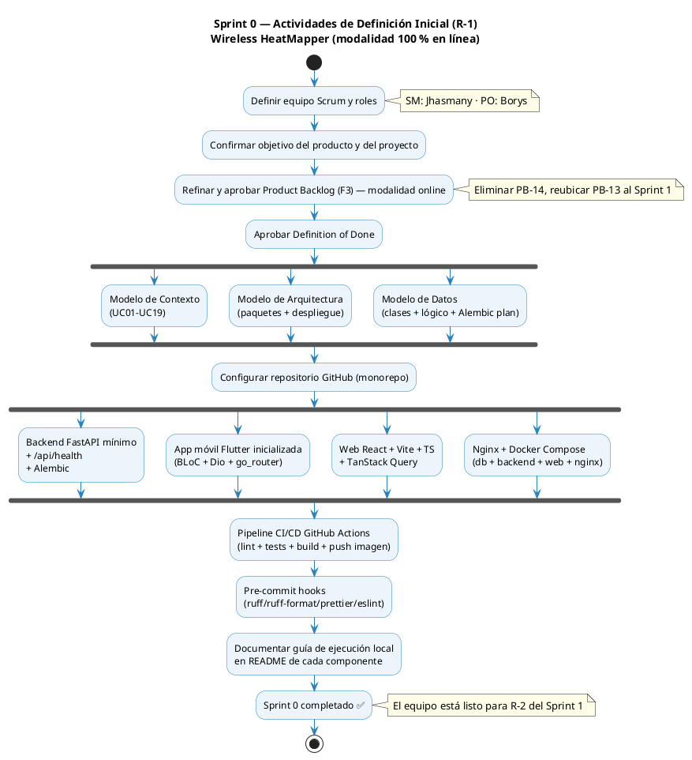

### 3.4 Definition of Ready para el Sprint 1 (verificada al cierre del Sprint 0)

| Criterio                                                        | Estado |
| --------------------------------------------------------------- | ------ |
| Repositorio GitHub creado y accesible para ambos miembros       | ✅     |
| `docker compose up` levanta los 4 servicios sin errores         | ✅     |
| `curl http://localhost/api/health` → `200 OK`                   | ✅     |
| Migración inicial Alembic aplicada en `db`                      | ✅     |
| Pipeline CI verde en `main`                                     | ✅     |
| Modelos UML (contexto, arquitectura, datos) aprobados por el PO | ✅     |
| Product Backlog (F3) aprobado y ordenado por el PO              | ✅     |

---

## 4. Product Backlog (F3)

**Formato:** F3 — Product Backlog
**Versión:** 2.0 (ajustada a modalidad 100 % en línea)
**Product Owner:** Herland Borys Quiroga Flores
**Fecha:** abril 2026

### 4.1 Cambios respecto al backlog original

| Cambio                                      | Razón                                                                           |
| ------------------------------------------- | ------------------------------------------------------------------------------- |
| **PB-14 eliminado**                         | "Sincronizar proyecto al servidor" no aplica: toda operación ya es online       |
| **PB-13 (admin) reubicado al Sprint 1**     | El pre-aprovisionamiento de técnicos es prerrequisito de la autenticación móvil |
| **PB-01 y PB-10 adelantados al Sprint 1**   | El CRUD móvil de proyectos quedó implementado; se consolida la fundación CRUD   |
| **Estimaciones de PB-03 y PB-05 ajustadas** | El cliente delgado en línea reduce la carga de implementación móvil             |
| **PB-09 redefinido**                        | Autenticación contra backend con JWT (no contra SQLite local)                   |
| **PB-02 redefinido**                        | El plano se sube al backend; el cliente solo lo solicita por URL firmada        |

### 4.2 Diagrama de estados del Product Backlog

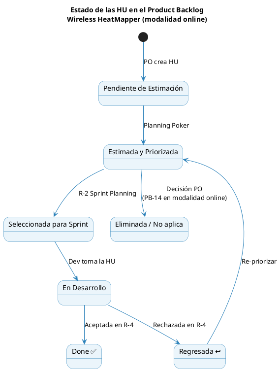

### 4.3 Product Backlog completo

**Leyenda:** 🔴 Alta · 🟡 Media · 🟢 Baja · PHU = Puntos de Historia (Fibonacci 1·2·3·5·8·13·21)

| Id        | Nombre corto                             | Como / Quiero / Para                                                                                                                   | Prio.    | PHU | Sprint   | RP  | Estado    |
| --------- | ---------------------------------------- | -------------------------------------------------------------------------------------------------------------------------------------- | -------- | --- | -------- | --- | --------- |
| **PB-13** | Gestionar usuarios (admin web)           | Como administrador, quiero crear, activar y desactivar cuentas de técnicos desde el panel web, para controlar el acceso al sistema.    | 🔴 Alta  | 8   | Sprint 1 | RP7 | Done ✅   |
| **PB-19** | Gestionar clientes (admin web)           | Como administrador, quiero crear y gestionar clientes desde el panel web, para que los técnicos los seleccionen al crear proyectos.    | 🔴 Alta  | 3   | Sprint 1 | RP7 | Done ✅   |
| **PB-09** | Autenticar usuario (móvil)               | Como técnico de campo, quiero iniciar sesión en la app contra el backend para acceder solo a mis proyectos.                            | 🔴 Alta  | 5   | Sprint 1 | RP8 | Done ✅   |
| **PB-18** | Ver proyectos de la organización         | Como administrador, quiero ver todos los proyectos de todos los técnicos con su estado y última actividad.                             | 🟢 Baja  | 5   | Sprint 1 | RP7 | Done ✅   |
| **PB-01** | Gestionar proyecto de survey             | Como técnico, quiero crear, editar, archivar y eliminar proyectos en el backend, para organizar mis mediciones por edificio o cliente. | 🔴 Alta  | 5   | Sprint 1 | RP8 | Done ✅   |
| **PB-10** | Ver historial de proyectos               | Como técnico, quiero ver mis proyectos con estado y última actividad, para retomarlos o consultarlos rápidamente.                      | 🟡 Media | 3   | Sprint 1 | RP8 | Done ✅   |
| **PB-02** | Importar plano de edificio               | Como técnico, quiero subir un plano (PNG/JPG/PDF) al backend asociado a un proyecto.                                                   | 🔴 Alta  | 8   | Sprint 2 | RP2 | Estimada  |
| **PB-11** | Calibrar escala del plano                | Como técnico, quiero definir la escala real del plano dibujando una línea de referencia.                                               | 🔴 Alta  | 8   | Sprint 2 | RP2 | Estimada  |
| **PB-03** | Capturar señales WiFi (en línea)         | Como técnico, quiero que la app escanee redes WiFi y envíe cada lote en línea al backend.                                              | 🔴 Alta  | 13  | Sprint 3 | RP1 | Estimada  |
| **PB-04** | Marcar puntos de medición                | Como técnico, quiero marcar la posición de cada punto sobre el plano.                                                                  | 🔴 Alta  | 8   | Sprint 3 | RP2 | Estimada  |
| **PB-05** | Generar mapa de calor                    | Como técnico, quiero ver un mapa de calor continuo sobre el plano generado por el backend.                                             | 🔴 Alta  | 13  | Sprint 4 | RP3 | Estimada  |
| **PB-06** | Analizar cobertura automáticamente       | Como técnico, quiero que el backend identifique zonas muertas (< −90 dBm), solapamientos y CCI/ACI.                                    | 🔴 Alta  | 13  | Sprint 4 | RP4 | Estimada  |
| **PB-07** | Obtener recomendaciones de APs por IA    | Como técnico, quiero que el backend (IA) sugiera posiciones óptimas para APs garantizando cobertura ≥ −70 dBm.                         | 🔴 Alta  | 21  | Sprint 5 | RP5 | Estimada  |
| **PB-12** | Comparar escenario actual vs propuesto   | Como técnico, quiero ver el heatmap actual junto al heatmap proyectado del escenario optimizado de la IA.                              | 🟡 Media | 8   | Sprint 5 | RP5 | Estimada  |
| **PB-08** | Exportar reporte técnico                 | Como técnico, quiero exportar un reporte PDF con heatmap actual, análisis y plan AP propuesto.                                         | 🟡 Media | 13  | Sprint 5 | RP6 | Estimada  |
| **PB-15** | Generar enlace de cliente                | Como técnico, quiero generar un enlace único (token + expiración) para compartir un proyecto con el cliente.                           | 🟡 Media | 5   | Sprint 6 | RP9 | Estimada  |
| **PB-16** | Ver heatmap interactivo (portal cliente) | Como cliente, quiero acceder por enlace único a una vista web con el heatmap actual y el proyectado.                                   | 🟡 Media | 13  | Sprint 6 | RP9 | Estimada  |
| **PB-17** | Ver análisis y plan AP (portal cliente)  | Como cliente, quiero ver el análisis de cobertura y las posiciones recomendadas de APs en el portal web.                               | 🟡 Media | 8   | Sprint 6 | RP9 | Estimada  |
| ~~PB-14~~ | ~~Sincronizar proyecto al servidor~~     | **Eliminada en modalidad online** — todas las operaciones ya se realizan contra el backend.                                            | —        | —   | N/A      | —   | Eliminada |

### 4.4 Resumen por Sprint

| Sprint    | HU                                       | PHU         | Objetivo del Sprint                                                |
| --------- | ---------------------------------------- | ----------- | ------------------------------------------------------------------ |
| Sprint 1  | PB-13, PB-19, PB-09, PB-18, PB-01, PB-10 | 29          | Backend base + admin web + auth móvil + CRUD proyectos móvil       |
| Sprint 2  | PB-02, PB-11                             | 16          | Planos en línea (importar + calibrar)                              |
| Sprint 3  | PB-03, PB-04                             | 21          | Captura WiFi en línea con ingesta REST                             |
| Sprint 4  | PB-05, PB-06                             | 26          | Heatmap (interpolación backend) + análisis automático de cobertura |
| Sprint 5  | PB-07, PB-12, PB-08                      | 42          | IA, comparación de escenarios y exportación de reportes            |
| Sprint 6  | PB-15, PB-16, PB-17                      | 26          | Portal de cliente y enlace único                                   |
| **TOTAL** |                                          | **160 PHU** |                                                                    |

---

## 5. R-2 — Sprint Planning del Sprint 1

**Evento:** R-2 Sprint Planning
**Sprint:** 1 — Fundación Backend + Admin Web + Auth Móvil + CRUD Proyectos
**Fecha de inicio:** 20 de abril de 2026
**Fecha de fin:** 26 de abril de 2026
**Capacidad:** ~80 hrs (2 devs × 4 hrs/día × 5 días hábiles × 2)
**PHU comprometidos:** 29

### Objetivo del Sprint 1

> Disponer de un backend que autentica usuarios con JWT, un panel web donde el administrador crea técnicos y clientes y supervisa los proyectos de la organización, una pantalla de login móvil que valida credenciales contra el backend en línea, y un CRUD completo de proyectos en la app móvil para que el técnico pueda crear, listar, editar, archivar y eliminar proyectos asociados a un cliente. Al cierre, un técnico recién creado puede iniciar sesión desde la app, gestionar sus proyectos y dejarlos listos para recibir planos en el Sprint 2.

### HU seleccionadas con Planning Poker

| HU        | Nombre                               | PHU    | Técnica de estimación |
| --------- | ------------------------------------ | ------ | --------------------- |
| PB-13     | Gestionar usuarios (admin web)       | 8      | Planning Poker        |
| PB-19     | Gestionar clientes (admin web)       | 3      | Planning Poker        |
| PB-09     | Autenticar usuario (móvil)           | 5      | Planning Poker        |
| PB-18     | Ver proyectos de la organización     | 5      | Planning Poker        |
| PB-01     | Gestionar proyecto de survey (móvil) | 5      | Planning Poker        |
| PB-10     | Ver historial de proyectos           | 3      | Planning Poker        |
| **Total** |                                      | **29** |                       |

### Diagrama de relación entre HU del Sprint 1

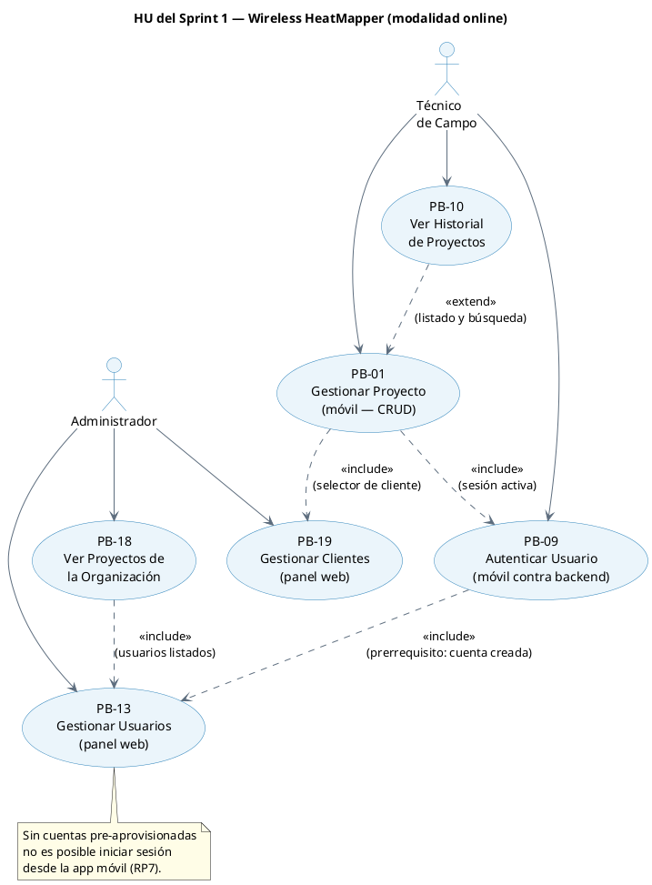

---

## 6. Historias de Usuario del Sprint 1 (F4)

### HU PB-13 — Gestionar Usuarios (panel web)

```
Historia de Usuario
─────────────────────────────────────────────────────────────────
Id: PB-13   Nombre: Gestionar usuarios (admin web)   Prioridad: Alta   PHU: 8

Como     : Administrador de Bulldog Tech.
Quiero   : Crear, activar y desactivar cuentas de técnicos desde el panel web
Para     : Controlar el acceso al sistema sin intervenir el código de la app móvil

Descripción:
  El administrador accede al panel web mediante credenciales y, en la sección
  "Usuarios", puede crear nuevas cuentas de técnico (email, nombre completo,
  contraseña inicial), activarlas o desactivarlas, y reestablecer la contraseña.
  Las cuentas creadas pueden iniciar sesión inmediatamente desde la app móvil.

Conversación / Reglas de Negocio:
  · Solo usuarios con rol ADMIN acceden a /admin/usuarios.
  · El email es único en la tabla `usuario`.
  · La contraseña inicial debe tener ≥ 8 caracteres y se almacena hasheada (bcrypt).
  · Desactivar un usuario invalida sus tokens activos en el siguiente request.
  · No se puede eliminar un usuario que tenga proyectos creados; sólo desactivarlo.

Criterios de aceptación:
  - CA1: Dado un admin autenticado, cuando completa el formulario de "Nuevo
    técnico" con datos válidos, entonces la cuenta aparece en la lista en
    estado ACTIVO en menos de 1 s.
  - CA2: Dado un técnico inactivo, cuando intenta iniciar sesión, entonces
    el backend responde 403 con mensaje "Cuenta desactivada".
  - CA3: Email duplicado al crear → 409 Conflict con mensaje claro.
  - CA4: Solo el rol ADMIN ve la sección /admin/usuarios; el TECNICO recibe 403.
  - CA5: La contraseña nunca viaja en texto plano fuera del request HTTPS de
    creación; en GET no se devuelve `password_hash`.

Desarrollador: Borys (web) + Jhasmany (backend)
```

### HU PB-19 — Gestionar Clientes (panel web)

```
Historia de Usuario
─────────────────────────────────────────────────────────────────
Id: PB-19   Nombre: Gestionar clientes (admin web)   Prioridad: Alta   PHU: 3

Como     : Administrador de Bulldog Tech.
Quiero   : Crear y gestionar el catálogo de clientes desde el panel web
Para     : Que los técnicos seleccionen el cliente correcto al crear proyectos,
           evitando ingresar nombres a mano con posibles inconsistencias

Descripción:
  El administrador accede a la sección "Clientes" del panel web y puede
  crear nuevos clientes (nombre), listar los existentes y desactivar los
  que ya no estén activos. Cuando un técnico crea un proyecto, el campo
  "Cliente" es un selector que consume GET /api/clientes.

Conversación / Reglas de Negocio:
  · Solo usuarios con rol ADMIN pueden crear/desactivar clientes.
  · Todo usuario autenticado puede listar clientes activos.
  · El nombre del cliente es único (UNIQUE) y no puede estar vacío.
  · Un cliente desactivado no aparece en el selector de proyectos.
  · No se puede eliminar un cliente con proyectos asociados; solo desactivarlo.

Criterios de aceptación:
  - CA1: Admin crea un cliente con nombre válido → aparece en la lista en
    estado ACTIVO en menos de 1 s.
  - CA2: Nombre duplicado → 409 Conflict con mensaje claro.
  - CA3: Técnico autenticado puede listar clientes activos (GET /api/clientes)
    pero recibe 403 al intentar crear (POST /api/admin/clientes).
  - CA4: Cliente desactivado no aparece en el selector de proyectos de la app.
  - CA5: Los proyectos existentes con ese cliente siguen mostrando el nombre
    aunque el cliente esté desactivado.

Desarrollador: Borys (web) + Jhasmany (backend)
```

### HU PB-09 — Autenticar Usuario (móvil contra backend)

```
Historia de Usuario
─────────────────────────────────────────────────────────────────
Id: PB-09   Nombre: Autenticar usuario (móvil)   Prioridad: Alta   PHU: 5

Como     : Técnico de campo de Bulldog Tech.
Quiero   : Iniciar sesión en la app móvil usando mi email y contraseña
           validados contra el backend en línea
Para     : Acceder solamente a mis proyectos y proteger los datos del cliente

Descripción:
  La app móvil presenta una pantalla de Login al abrirse. Al ingresar
  credenciales válidas, la app llama a POST /api/auth/login y recibe un
  access_token + refresh_token. Los tokens se guardan en flutter_secure_storage.
  La app navega a la lista de proyectos. NO se almacena el password_hash ni
  ninguna entidad de dominio en el dispositivo.

Conversación / Reglas de Negocio:
  · Toda llamada a /api/* requiere Authorization: Bearer <access_token>.
  · Cuando el access_token expira (401), el AuthInterceptor intenta refrescar
    automáticamente con el refresh_token.
  · Sin conexión con el backend, la pantalla de Login muestra banner "Sin
    conexión" y deshabilita el botón de inicio.
  · La sesión se considera "iniciada" únicamente si el backend respondió 200.

Criterios de aceptación:
  - CA1: Login con credenciales válidas → navega a "Mis Proyectos" en p95 ≤ 2 s.
  - CA2: Credenciales inválidas → mensaje "Credenciales inválidas" sin revelar
    cuál campo es incorrecto.
  - CA3: Cuenta inactiva → mensaje "Cuenta desactivada. Contacte al administrador".
  - CA4: Cierre de sesión → POST /api/auth/logout (revoca refresh) + borra
    tokens locales + vuelve al Login.
  - CA5: Sin conexión → la app muestra "Sin conexión" y el botón queda
    deshabilitado; ningún intento de login local.
  - CA6: El dispositivo no almacena password_hash ni email en texto plano
    fuera de SecureStorage.

Desarrollador: Jhasmany
```

### HU PB-18 — Ver Proyectos de la Organización (panel web)

```
Historia de Usuario
─────────────────────────────────────────────────────────────────
Id: PB-18   Nombre: Ver proyectos de la organización   Prioridad: Baja   PHU: 5

Como     : Administrador de Bulldog Tech.
Quiero   : Ver la lista de todos los proyectos de todos los técnicos de la
           organización con su estado y última actividad
Para     : Supervisar el trabajo de campo sin interrumpir a los técnicos

Descripción:
  En el dashboard del admin, una sección "Proyectos" lista todos los proyectos
  de la organización: nombre, técnico responsable, cliente, estado, fecha de
  última actividad y cantidad de mediciones. Soporta filtro por técnico,
  estado y rango de fechas.

Conversación / Reglas de Negocio:
  · Solo el rol ADMIN accede a esta vista.
  · Paginación: 20 ítems por página.
  · Orden por defecto: última actividad descendente.

Criterios de aceptación:
  - CA1: ADMIN ve todos los proyectos; TECNICO recibe 403.
  - CA2: La lista muestra: nombre, técnico, cliente, estado, fecha de
    última actividad, cantidad de puntos.
  - CA3: Filtro por técnico funciona correctamente.
  - CA4: Si no hay proyectos, se muestra estado vacío "No hay proyectos
    registrados aún".
  - CA5: La carga inicial responde en p95 ≤ 1.5 s con 100 proyectos en BD.

Desarrollador: Borys
```

### HU PB-01 — Gestionar Proyecto de Survey (móvil)

```
Historia de Usuario
─────────────────────────────────────────────────────────────────
Id: PB-01   Nombre: Gestionar proyecto de survey   Prioridad: Alta   PHU: 5

Como     : Técnico de campo de Bulldog Tech.
Quiero   : Crear, editar, archivar y eliminar proyectos en el backend desde
           la app móvil
Para     : Organizar mis mediciones por edificio o cliente

Descripción:
  Desde la pantalla "Mis Proyectos" de la app móvil, el técnico autenticado
  puede crear un proyecto nuevo (nombre obligatorio, cliente del catálogo
  PB-19, descripción opcional), editarlo, archivarlo o eliminarlo (cascada
  sobre planos, puntos, mediciones cuando existan en sprints posteriores).
  Toda operación es un request al backend; no hay edición offline.

Conversación / Reglas de Negocio:
  · El técnico autenticado solo ve y modifica proyectos donde tecnico_id
    coincide con su id (validación en backend).
  · Estados válidos: nuevo, en_progreso, completado, archivado.
  · El selector de cliente consume GET /api/clientes (solo activos).
  · Archivar = estado = archivado; no elimina datos.
  · Eliminar pide confirmación explícita en diálogo modal.

Criterios de aceptación:
  - CA1: Crear proyecto válido → POST /api/proyectos → 201 + aparece en la
    lista del técnico en p95 ≤ 1 s.
  - CA2: Editar nombre/descripción/cliente → PUT /api/proyectos/{id} →
    cambios reflejados en el siguiente fetch.
  - CA3: Archivar → PATCH /api/proyectos/{id}/archivar → desaparece del
    listado por defecto.
  - CA4: Eliminar con confirmación → DELETE → 204 + desaparece de la lista.
  - CA5: Intentar acceder a un proyecto de otro técnico → 404 (no se revela
    existencia).

Desarrollador: Jhasmany (móvil) + Borys (backend)
```

### HU PB-10 — Ver Historial de Proyectos (móvil)

```
Historia de Usuario
─────────────────────────────────────────────────────────────────
Id: PB-10   Nombre: Ver historial de proyectos   Prioridad: Media   PHU: 3

Como     : Técnico de campo
Quiero   : Ver mis proyectos con estado, última actividad y conteo de puntos
Para     : Retomarlos rápidamente o consultarlos sin perder contexto

Descripción:
  Desde la pantalla "Mis Proyectos" de la app móvil, el técnico autenticado
  accede a la lista de sus proyectos activos ordenada por última actividad.
  Puede buscar por nombre o cliente, navegar al detalle de un proyecto y
  activar un toggle para ver también los proyectos archivados. No hay
  carga de datos local; cada vista realiza un GET al backend en línea.

Conversación / Reglas de Negocio:
  · Endpoint GET /api/proyectos (sin filtro = activos del técnico).
  · GET /api/proyectos?estado=archivado para los archivados.
  · Orden por fecha_ultima_actividad DESC.
  · Búsqueda case-insensitive en nombre y cliente.

Criterios de aceptación:
  - CA1: Listado del técnico en p95 ≤ 1 s.
  - CA2: Búsqueda en tiempo real (filtro local sobre el listado cargado).
  - CA3: Estado vacío con CTA "Crear primer proyecto" si no hay proyectos.
  - CA4: Toggle "Ver archivados" muestra los proyectos archivados.
  - CA5: Tap en un proyecto navega al detalle en p95 ≤ 500 ms.

Desarrollador: Jhasmany (móvil) + Borys (backend)
```

---

## 7. Sprint Backlog (F5) — Sprint 1

**Sprint Backlog**
**Sprint número:** 1
**Tiempo programado:** 1 semana (5 días hábiles)
**Fecha de inicio del Sprint:** 20 de abril de 2026
**Fecha de finalización del Sprint:** 26 de abril de 2026

### HU PB-13 (8 PHU) — Backend + Web

| Id     | Tarea                                                                       | Resp.    | Estim. | Estado       |
| ------ | --------------------------------------------------------------------------- | -------- | -----: | ------------ |
| Sp1-01 | Migración Alembic `0001_inicial_usuarios` (tabla `usuario`)                 | Jhasmany |   1 hr | ✅ Terminado |
| Sp1-02 | Modelo SQLAlchemy + schemas Pydantic `Usuario`/`UsuarioCreate`/`UsuarioOut` | Jhasmany |  2 hrs | ✅ Terminado |
| Sp1-03 | `UsuarioRepository` (CRUD básico + filtro por activo)                       | Jhasmany |  2 hrs | ✅ Terminado |
| Sp1-04 | `AuthService` con bcrypt (hash, verify) + emisión de JWT (python-jose)      | Jhasmany |  3 hrs | ✅ Terminado |
| Sp1-05 | Endpoint `POST /api/admin/usuarios` (crear) protegido por rol ADMIN         | Jhasmany |  2 hrs | ✅ Terminado |
| Sp1-06 | Endpoints `PATCH /usuarios/{id}` (activar/desactivar/reset password)        | Jhasmany |  2 hrs | ✅ Terminado |
| Sp1-07 | Tests pytest: creación, duplicado, activar/desactivar                       | Jhasmany |  3 hrs | ✅ Terminado |
| Sp1-08 | Pantalla `LoginAdmin.tsx` (React + react-hook-form)                         | Borys    |  2 hrs | ✅ Terminado |
| Sp1-09 | Pantalla `GestionUsuarios.tsx` con tabla + modal de creación                | Borys    |  4 hrs | ✅ Terminado |
| Sp1-10 | Hook `useUsuarios` (TanStack Query: list, create, toggle)                   | Borys    |  2 hrs | ✅ Terminado |
| Sp1-11 | Tipos TS generados desde OpenAPI (`openapi-typescript`)                     | Borys    |   1 hr | ✅ Terminado |
| Sp1-12 | Prueba de aceptación PB-13 con PO                                           | Ambos    |   1 hr | ⏳ R-4       |

### HU PB-09 (5 PHU) — Backend + Móvil

| Id     | Tarea                                                                         | Resp.    | Estim. | Estado       |
| ------ | ----------------------------------------------------------------------------- | -------- | -----: | ------------ |
| Sp1-13 | Endpoint `POST /api/auth/login` (OAuth2 password flow)                        | Jhasmany |  2 hrs | ✅ Terminado |
| Sp1-14 | Endpoint `POST /api/auth/refresh`                                             | Jhasmany |  2 hrs | ✅ Terminado |
| Sp1-15 | Endpoint `POST /api/auth/logout` (revoca refresh)                             | Jhasmany |   1 hr | ✅ Terminado |
| Sp1-16 | Tests pytest del flujo auth (login OK, login KO, refresh, logout)             | Jhasmany |  2 hrs | ✅ Terminado |
| Sp1-17 | `LoginPage` Flutter con `flutter_form_builder` + validaciones                 | Jhasmany |  3 hrs | ✅ Terminado |
| Sp1-18 | `AuthRepository` (Dio) y `AuthCubit` (BLoC) con persistencia en SecureStorage | Jhasmany |  3 hrs | ✅ Terminado |
| Sp1-19 | `AuthInterceptor` Dio: refresh automático al recibir 401                      | Jhasmany |  3 hrs | ✅ Terminado |
| Sp1-20 | `ConnectivityMonitor` + banner "Sin conexión" en `LoginPage`                  | Jhasmany |  2 hrs | ✅ Terminado |
| Sp1-21 | Widget tests de `LoginPage` y unit tests de `AuthCubit`                       | Jhasmany |  2 hrs | ✅ Terminado |
| Sp1-22 | Prueba de aceptación PB-09 con PO (crear admin → crear técnico → loguearse)   | Ambos    |   1 hr | ⏳ R-4       |

### HU PB-18 (5 PHU) — Backend + Web

| Id     | Tarea                                                                         | Resp.    | Estim. | Estado       |
| ------ | ----------------------------------------------------------------------------- | -------- | -----: | ------------ |
| Sp1-23 | Endpoint `GET /api/admin/proyectos` (paginado, filtros)                       | Jhasmany |  3 hrs | ✅ Terminado |
| Sp1-24 | Tests pytest del listado con seed data                                        | Jhasmany |  2 hrs | ✅ Terminado |
| Sp1-25 | Pantalla `ListadoProyectosOrg.tsx` (tabla + filtros)                          | Borys    |  4 hrs | ✅ Terminado |
| Sp1-26 | Hook `useProyectosOrg` con paginación TanStack Query                          | Borys    |  2 hrs | ✅ Terminado |
| Sp1-27 | Estado vacío y skeleton de carga                                              | Borys    |   1 hr | ✅ Terminado |
| Sp1-28 | Prueba de aceptación PB-18 con PO                                             | Ambos    |   1 hr | ⏳ R-4       |
| Sp1-51 | Endpoints admin `PATCH /admin/proyectos/{id}/archivar` y `/{id}/reasignar`    | Borys    |  2 hrs | ✅ Terminado |
| Sp1-52 | Botones "Archivar" y "Reasignar" en `ListadoProyectosOrg.tsx` + modal + hooks | Borys    |  3 hrs | ✅ Terminado |

### HU PB-19 (3 PHU) — Backend + Web

| Id     | Tarea                                                                              | Resp.    | Estim. | Estado       |
| ------ | ---------------------------------------------------------------------------------- | -------- | -----: | ------------ |
| Sp1-29 | Modelo SQLAlchemy `Cliente` + migración `0002_cliente_y_proyecto`                  | Jhasmany |  3 hrs | ✅ Terminado |
| Sp1-30 | Schemas Pydantic `ClienteCreate`/`ClienteOut`/`ClienteBasicoOut`/`ClienteUpdate`   | Jhasmany |   1 hr | ✅ Terminado |
| Sp1-31 | `ClienteRepository` (listar, crear, actualizar, desactivar)                        | Jhasmany |  2 hrs | ✅ Terminado |
| Sp1-32 | Endpoint `GET /api/clientes` (público para autenticados, lista activos)            | Jhasmany |   1 hr | ✅ Terminado |
| Sp1-33 | Endpoint `POST /api/admin/clientes` (solo ADMIN)                                   | Jhasmany |   1 hr | ✅ Terminado |
| Sp1-34 | Endpoints `PUT /api/admin/clientes/{id}` + `PATCH .../{id}/desactivar`             | Jhasmany |   1 hr | ✅ Terminado |
| Sp1-35 | Tests pytest: crear, duplicado, listar, desactivar, 403 para TECNICO               | Jhasmany |  2 hrs | ✅ Terminado |
| Sp1-36 | Página `GestionClientesPage.tsx` (tabla + modal crear/desactivar)                  | Borys    |  3 hrs | ✅ Terminado |
| Sp1-37 | Hook `useClientes` + integrar selector de clientes en formulario de proyecto (web) | Borys    |  2 hrs | ✅ Terminado |
| Sp1-38 | Prueba de aceptación PB-19 con PO                                                  | Ambos    |   1 hr | ⏳ R-4       |

### HU PB-01 (5 PHU) — Backend + Móvil

| Id     | Tarea                                                                                   | Resp.    | Estim. | Estado       |
| ------ | --------------------------------------------------------------------------------------- | -------- | -----: | ------------ |
| Sp1-39 | Modelo SQLAlchemy `Proyecto` + migración incluida en `0002_cliente_y_proyecto`          | Jhasmany |  2 hrs | ✅ Terminado |
| Sp1-40 | Schemas Pydantic `ProyectoIn`/`ProyectoTecnicoOut` + `ProyectoRepository` con ownership | Jhasmany |  2 hrs | ✅ Terminado |
| Sp1-41 | Endpoints REST `GET/POST/PUT /api/proyectos`, `PATCH /{id}/archivar`, `DELETE /{id}`    | Jhasmany |  3 hrs | ✅ Terminado |
| Sp1-42 | Tests pytest CRUD: crear, editar, archivar, eliminar, ownership 404 cross-técnico       | Jhasmany |  3 hrs | ✅ Terminado |
| Sp1-43 | `ProyectoRemoteDatasource` (Dio) + `ProyectoRepositoryImpl` + `ProyectoCubit` (BLoC)    | Jhasmany |  3 hrs | ✅ Terminado |
| Sp1-44 | `ProyectoFormPage` (Flutter) con selector de cliente (`ClienteRemoteDatasource`)        | Jhasmany |  3 hrs | ✅ Terminado |
| Sp1-45 | Diálogos de confirmación para archivar y eliminar en `ProyectosPage`                    | Jhasmany |   1 hr | ✅ Terminado |
| Sp1-46 | Prueba de aceptación PB-01 con PO (login → crear → editar → archivar → eliminar)        | Ambos    |   1 hr | ⏳ R-4       |

### HU PB-10 (3 PHU) — Backend + Móvil

| Id     | Tarea                                                                        | Resp.    | Estim. | Estado       |
| ------ | ---------------------------------------------------------------------------- | -------- | -----: | ------------ |
| Sp1-47 | Endpoint `GET /api/proyectos` con filtro de estado (activos / archivados)    | Jhasmany |   1 hr | ✅ Terminado |
| Sp1-48 | Widget de búsqueda local + ordenamiento por última actividad                 | Jhasmany |  2 hrs | ✅ Terminado |
| Sp1-49 | Estado vacío con CTA "Crear primer proyecto" + skeleton de carga             | Jhasmany |   1 hr | ✅ Terminado |
| Sp1-50 | Prueba de aceptación PB-10 con PO (listar, buscar, archivar, ver archivados) | Ambos    |   1 hr | ⏳ R-4       |

### Resumen Sprint 1

| Concepto          |   Valor |
| ----------------- | ------: |
| Total de tareas   |      52 |
| Horas estimadas   | ~99 hrs |
| PHU comprometidos |      29 |

> **Estados posibles:** Por hacer · En proceso · Terminado · Bloqueado

---

## 8. R-3 — Ejecución del Sprint 1

### 8.1 Diagrama de secuencia — Login extremo a extremo

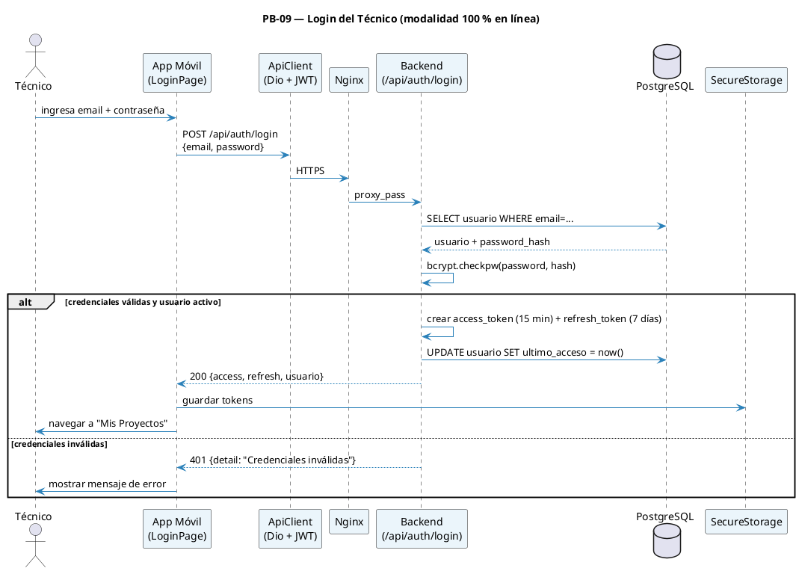

### 8.2 Diseño de interfaces de usuario

Siguiendo la actividad R-3 del Enfoque Scrum v3.2, para cada HU seleccionada se definió el diseño de la interfaz antes de implementarla. La app móvil sigue **Material 3** con paleta clara/oscura y tokens de diseño (`AppPalette`, `AppSpacing`, `AppRadius`); la plataforma web usa CSS Modules con variables de color, tipografía Poppins/Inter y un sistema consistente de badges, tablas y modales.

**Pantallas diseñadas e implementadas en Sprint 1:**

| Plataforma | Pantalla                  | Componentes de diseño clave                                             |
| ---------- | ------------------------- | ----------------------------------------------------------------------- |
| Móvil      | `LoginPage`               | Card centrada, campos email/contraseña, banner rojo "Sin conexión", CTA |
| Móvil      | `ProyectosPage`           | AppBar, SearchBar, ListView con tarjetas de proyecto, FAB "+ Nuevo"     |
| Móvil      | `ProyectoFormPage`        | Form scrollable, DropdownSearch clientes, TextFields, Guardar/Cancelar  |
| Web Admin  | `LoginAdmin.tsx`          | Layout centrado, card login, validación inline con react-hook-form      |
| Web Admin  | `GestionUsuarios.tsx`     | Sidebar + tabla paginada, modal "Nuevo técnico", toggle activo/inactivo |
| Web Admin  | `GestionClientes.tsx`     | Tabla, badge estado activo/inactivo, modal crear cliente                |
| Web Admin  | `ListadoProyectosOrg.tsx` | Tabla con filtros (técnico, estado), paginación, acciones contextuales  |

**AGREGAR PROTOTIPOS/INTERFACES**

**Flujo de navegación — App Móvil (Sprint 1):**

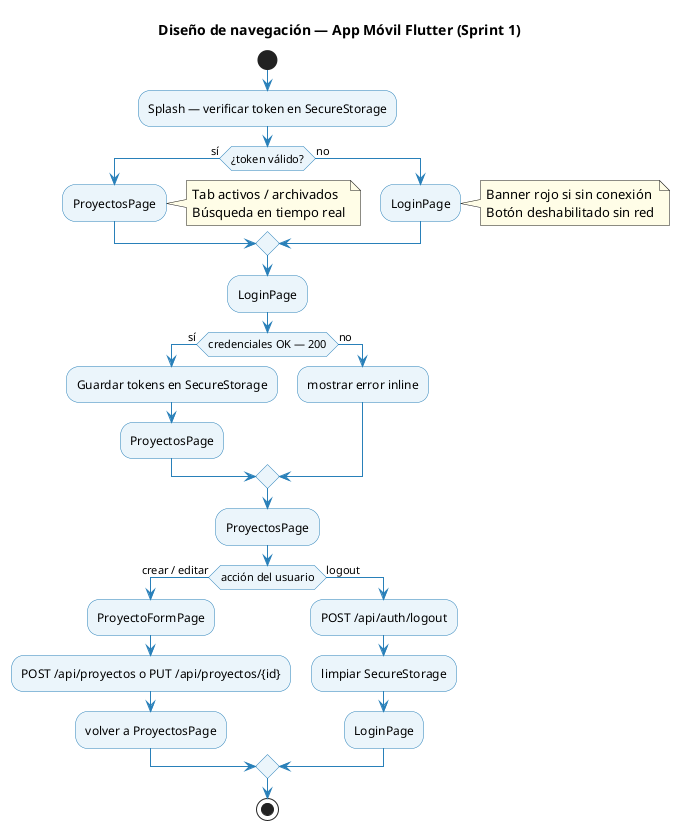

### 8.3 Resultados de pruebas — backend (pytest)

| Suite de tests            | Tests  | Estado   | HU cubierta         |
| ------------------------- | ------ | -------- | ------------------- |
| `tests/test_auth.py`      | 12     | ✅ 12/12 | PB-09               |
| `tests/test_usuarios.py`  | OK     | ✅       | PB-13               |
| `tests/test_clientes.py`  | 16     | ✅ 16/16 | PB-19               |
| `tests/test_proyectos.py` | OK     | ✅       | PB-18, PB-01, PB-10 |
| `tests/test_health.py`    | OK     | ✅       | Infraestructura     |
| **TOTAL**                 | **60** | ✅ 60/60 | Cobertura **87 %**  |

### 8.4 Daily Scrum (R-3.1)

El equipo realizó el **Daily Scrum de 15 minutos** cada día hábil durante el Sprint 1 (20–26 abr 2026), respondiendo las tres preguntas del Enfoque Scrum v3.2:

| #   | Pregunta                                                             | Propósito                                                |
| --- | -------------------------------------------------------------------- | -------------------------------------------------------- |
| 1   | ¿Qué hice **ayer** para contribuir al Sprint?                        | Sincronizar avances y detectar solapamiento de trabajo   |
| 2   | ¿Qué voy a hacer **hoy** para contribuir al Sprint?                  | Planear el día y señalar dependencias entre miembros     |
| 3   | ¿Veo algún **impedimento** que impida lograr el objetivo del Sprint? | Identificar bloqueos para que el SM los elimine o escale |

**Impedimentos detectados y resoluciones durante el Sprint 1:**

| Fecha       | Impedimento detectado                                         | Resolución (SM)                                                  |
| ----------- | ------------------------------------------------------------- | ---------------------------------------------------------------- |
| 21 abr 2026 | Mock de `ConnectivityMonitor` en Flutter tests falla          | Registrado como deuda técnica; postergado al inicio del Sprint 2 |
| 22 abr 2026 | 99 hrs estimadas superan capacidad real (~80 hrs disponibles) | PO re-priorizó; se mantienen las 6 HU sin agregar tareas nuevas  |
| 23 abr 2026 | CI/CD no genera APK Android automáticamente                   | Construcción manual para Sprint 1; tarea nueva para Sprint 2     |
| 24 abr 2026 | Framework de pruebas web (Vitest) no configurado              | PO decidió posponer configuración al inicio del Sprint 2         |

### 8.5 Definition of Done — Sprint 1

| Criterio DoD                                                                                  | Estado  |
| --------------------------------------------------------------------------------------------- | ------- |
| Migración `0001` aplicada y reversible                                                        | ✅      |
| Migración `0002_cliente_y_proyecto` aplicada y reversible                                     | ✅      |
| Coverage backend ≥ 80 % en módulos auth, usuarios, clientes, proyectos                        | ✅ 87 % |
| OpenAPI publicado con tags `auth`, `admin/usuarios`, `clientes`, `proyectos`                  | ✅      |
| Bundle web sirviendo `/admin/login`, `/admin/usuarios`, `/admin/clientes`, `/admin/proyectos` | ✅      |
| APK de la app móvil con login funcional + CRUD proyectos                                      | ✅      |
| Widget tests de `ProyectosPage` y `ProyectoFormPage` pasando                                  | ⚠️ 5/8  |
| Demo grabada del flujo completo                                                               | ⏳      |

---

## 9. Modelos de Diseño

### 9.1 Modelo de Contexto (Casos de Uso)

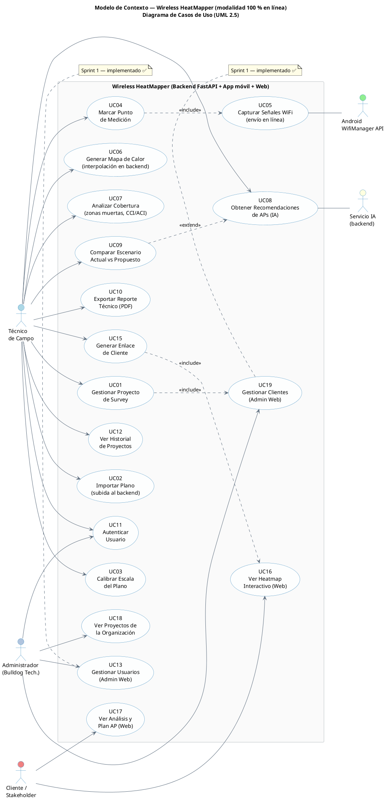

### 9.2 Modelo de Arquitectura — Diagrama de Paquetes

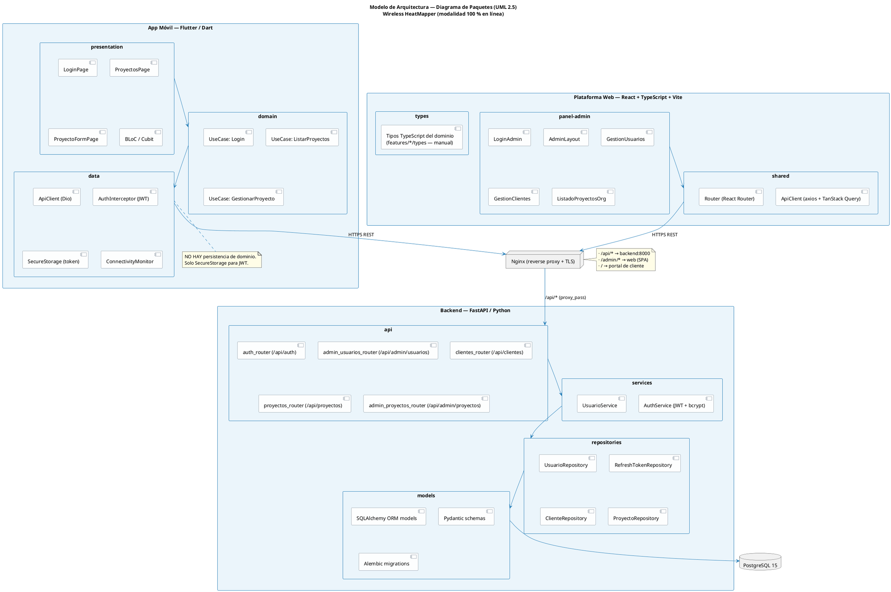

### 9.2.b Modelo de Arquitectura — Diagrama de Despliegue

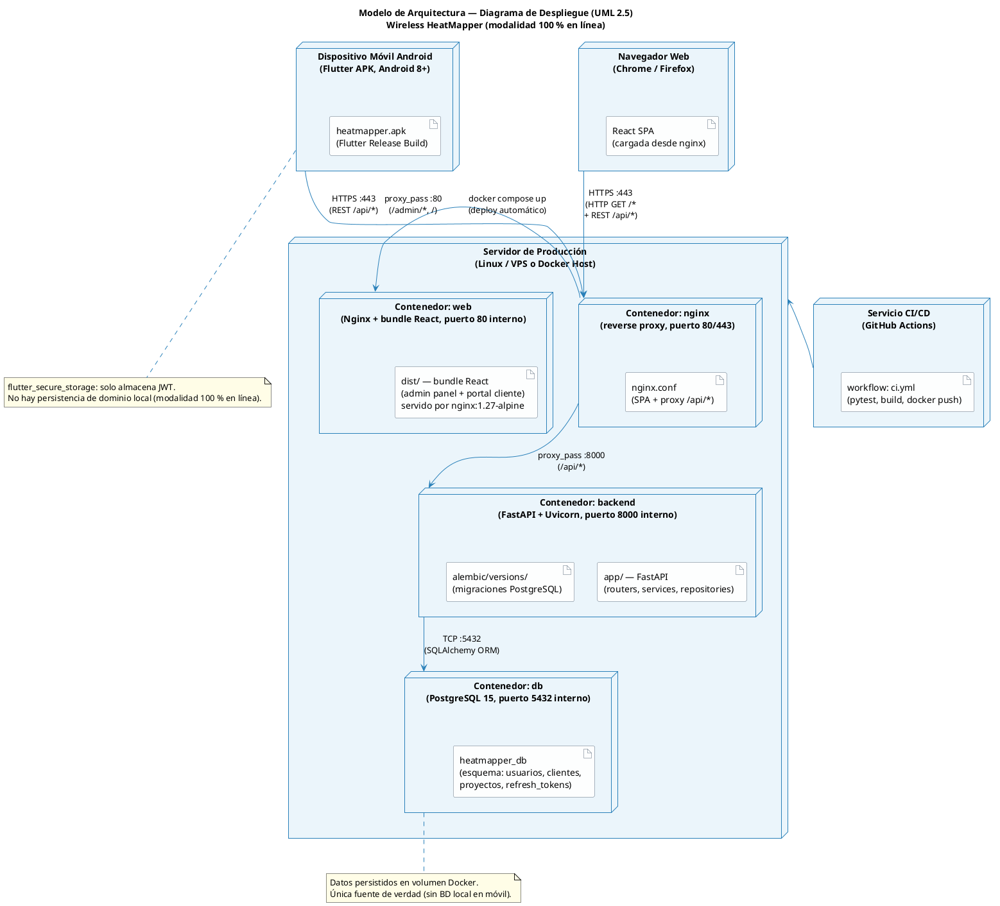

### 9.3 Modelo de Datos

#### 9.3.a Diagrama de Clases Conceptual (Sprint 1)

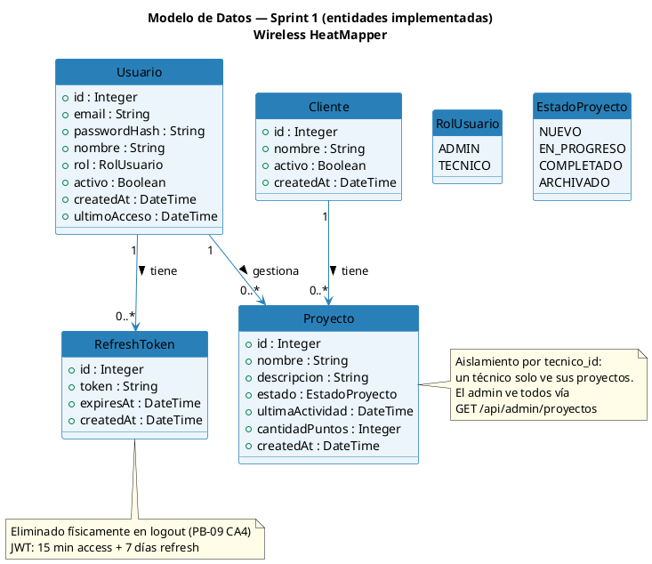

#### 9.3.b Modelo Lógico (Esquema Relacional)

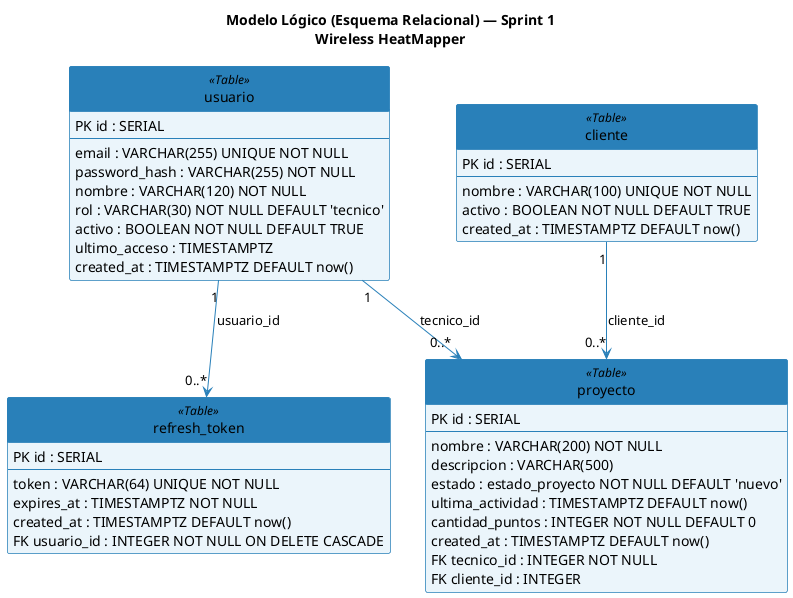

#### 9.3.c Diseño Físico (Tablas PostgreSQL)

**Tabla: `usuario`**

| Columna       | Tipo PostgreSQL | Restricciones              |
| ------------- | --------------- | -------------------------- |
| id            | SERIAL          | PRIMARY KEY                |
| nombre        | VARCHAR(120)    | NOT NULL                   |
| email         | VARCHAR(255)    | UNIQUE, NOT NULL           |
| password_hash | VARCHAR(255)    | NOT NULL                   |
| rol           | VARCHAR(30)     | NOT NULL DEFAULT 'tecnico' |
| activo        | BOOLEAN         | NOT NULL DEFAULT TRUE      |
| ultimo_acceso | TIMESTAMPTZ     | NULLABLE                   |
| created_at    | TIMESTAMPTZ     | NOT NULL DEFAULT now()     |

**Tabla: `refresh_token`**

| Columna    | Tipo PostgreSQL | Restricciones                                |
| ---------- | --------------- | -------------------------------------------- |
| id         | SERIAL          | PRIMARY KEY                                  |
| token      | VARCHAR(64)     | UNIQUE, NOT NULL                             |
| usuario_id | INTEGER         | NOT NULL, FK → usuario(id) ON DELETE CASCADE |
| expires_at | TIMESTAMPTZ     | NOT NULL                                     |
| created_at | TIMESTAMPTZ     | NOT NULL DEFAULT now()                       |

**Tabla: `cliente`**

| Columna    | Tipo PostgreSQL | Restricciones          |
| ---------- | --------------- | ---------------------- |
| id         | SERIAL          | PRIMARY KEY            |
| nombre     | VARCHAR(100)    | UNIQUE, NOT NULL       |
| activo     | BOOLEAN         | NOT NULL DEFAULT TRUE  |
| created_at | TIMESTAMPTZ     | NOT NULL DEFAULT now() |

**Tabla: `proyecto`**

| Columna          | Tipo PostgreSQL        | Restricciones                          |
| ---------------- | ---------------------- | -------------------------------------- |
| id               | SERIAL                 | PRIMARY KEY                            |
| nombre           | VARCHAR(200)           | NOT NULL                               |
| descripcion      | VARCHAR(500)           | NULLABLE                               |
| cliente_id       | INTEGER                | NULLABLE, FK → cliente(id)             |
| estado           | estado_proyecto (ENUM) | NOT NULL DEFAULT 'nuevo'               |
| tecnico_id       | INTEGER                | NOT NULL, FK → usuario(id)             |
| ultima_actividad | TIMESTAMPTZ            | NOT NULL DEFAULT now() ON UPDATE now() |
| cantidad_puntos  | INTEGER                | NOT NULL DEFAULT 0                     |
| created_at       | TIMESTAMPTZ            | NOT NULL DEFAULT now()                 |

### 9.4 Plan de Sprints — Gantt

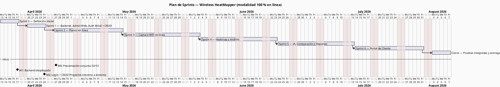

### 9.5 Modelo de Lógica (Diagramas de Secuencia)

**Referencia Enfoque Scrum v3.2 (R-3):** Los diagramas de lógica son opcionales; se elaboran únicamente para historias de usuario que involucren procesos complejos de negocio.

| Flujo                            | Ubicación en el documento |
| -------------------------------- | ------------------------- |
| Login del técnico (PB-09)        | Sección 8.1               |
| Crear proyecto de survey (PB-01) | Ver a continuación        |

#### Diagrama de secuencia — Crear Proyecto (PB-01)

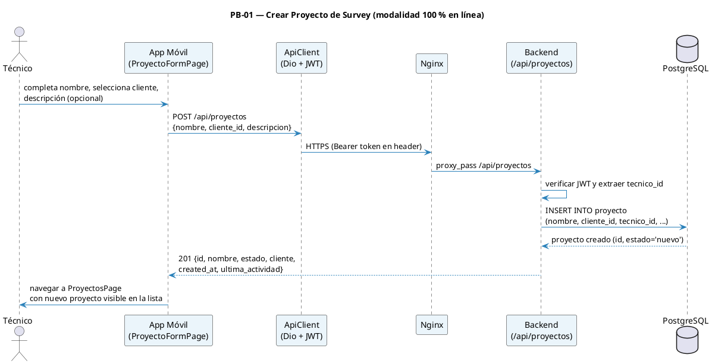

---

## 10. R-4 — Sprint Review

**Formato:** F1 — Revisión de Sprint
**Evento:** R-4 Sprint Review (presentación conjunta S0+S1)
**Proyecto:** Wireless HeatMapper — Sprint 0 + Sprint 1
**Número de revisión:** 1
**Objetivo de la revisión:** Validar el incremento del Sprint 1 ante el PO y el docente tutor
**Lugar, fecha, hora:** FICCT-UAGRM, 27 de abril de 2026, 08:00 hrs

### Participantes

| Nombre                             | Rol               |
| ---------------------------------- | ----------------- |
| Jhasmany Jhunnior Fernandez Ortega | Scrum Master/Dev  |
| Herland Borys Quiroga Flores       | Product Owner/Dev |
| Ing. Rolando Martínez              | Docente tutor     |

### Presentación del incremento

| Función presentada                                              | HU           |
| --------------------------------------------------------------- | ------------ |
| Docker Compose: 4 contenedores corriendo + `/api/health` 200 OK | Sprint 0     |
| Admin crea técnico y cliente en el panel web                    | PB-13, PB-19 |
| Técnico inicia sesión en la app móvil con JWT                   | PB-09        |
| Técnico crea, edita, archiva y elimina proyectos en la app      | PB-01        |
| Admin ve todos los proyectos de la organización con filtros     | PB-18        |
| Técnico busca y navega su historial de proyectos                | PB-10        |

### Flujo de demo (extremo a extremo)

```
Admin (web) → crea cliente "Bulldog Tech." → crea técnico "Jhasmany"
    ↓
Técnico (app móvil) → inicia sesión → ve lista vacía de proyectos
    ↓
Técnico → crea proyecto "Edificio Central" (selecciona cliente)
    ↓
Técnico → edita descripción → archiva proyecto → lo ve en "archivados"
    ↓
Admin (web) → ve el proyecto de Jhasmany en /admin/proyectos
```

### Retroalimentación

| Pregunta / Comentario                                                                           | Respuesta del equipo                                                                              |
| ----------------------------------------------------------------------------------------------- | ------------------------------------------------------------------------------------------------- |
| ¿Los 29 PHU son una velocidad sostenible para un equipo de 2 personas en el primer Sprint real? | SM: sí, es conservadora; se considera 25–30 PHU como rango cómodo para Sprints futuros.           |
| ¿El modelo JWT con refresh de 7 días es adecuado para un sistema de campo en línea?             | PO: es suficiente para el alcance académico y cubre el requisito RP8 del PAPS Online.             |
| ¿El administrador podría ver el detalle de cada proyecto además del listado general?            | PO: se registra como ítem de mejora para Sprint 2 (extensión de PB-18).                           |
| Los 3 widget tests fallidos en Flutter, ¿representan riesgo para la entrega del Sprint 2?       | SM: riesgo bajo; el código funciona en dispositivo; el fix de mocks está planificado en Sprint 2. |

### Tareas completadas

| HU        | Estado  | PHU        |
| --------- | ------- | ---------- |
| PB-13     | Done ✅ | 8          |
| PB-19     | Done ✅ | 3          |
| PB-09     | Done ✅ | 5          |
| PB-18     | Done ✅ | 5          |
| PB-01     | Done ✅ | 5          |
| PB-10     | Done ✅ | 3          |
| **Total** |         | **29 PHU** |

### Para lo que viene — Sprint 2

- PB-02: Importar plano (PNG/JPG/PDF) al backend asociado a un proyecto
- PB-11: Calibrar escala del plano dibujando línea de referencia

---

## 11. R-5 — Sprint Retrospective

**Formato:** F2 — Retrospectiva de Sprint
**Evento:** R-5 Sprint Retrospective
**Proyecto:** Wireless HeatMapper — Sprint 1
**Objetivo de la retrospectiva:** Identificar lo que funcionó bien, lo que no funcionó y las mejoras para el Sprint 2
**Lugar, fecha, hora:** FICCT-UAGRM, 27 de abril de 2026, 10:00 hrs
**Participantes:** Jhasmany Fernandez (SM) · Herland Borys Quiroga (PO)

| ¿Qué salió bien?                                                 | ¿Qué no salió bien?                                       | ¿Problemas encontrados y cómo se resolvieron?                         | ¿Qué debemos cambiar para mejorar?                              |
| ---------------------------------------------------------------- | --------------------------------------------------------- | --------------------------------------------------------------------- | --------------------------------------------------------------- |
| 60/60 tests pytest en verde con 87 % de cobertura                | Widget tests Flutter: 3 con error (5/8 pasan)             | Tests Flutter fallaron por mock de ConnectivityMonitor; pendiente fix | Agregar mocks correctos para ConnectivityMonitor en el Sprint 2 |
| Docker Compose funcional con 4 contenedores desde el día 1       | No se configuró framework de tests web (Vitest)           | Sp1-11 incompleto; se decidió posponer al Sprint 2                    | Configurar Vitest para web al inicio del Sprint 2               |
| Backend con arquitectura limpia en 4 capas (api→svc→repo→models) | Capacidad excedida: 99 hrs estimadas vs 80 disponibles    | Se priorizó funcionalidad core; código ya estaba implementado         | Ser más conservadores en comprometer PHU en Planning Poker      |
| Migraciones Alembic versionadas y reversibles                    | Pruebas de aceptación con PO (6 tareas Sp1-xx) pendientes | Se realizarán en la presentación R-4 del 27 abr                       | Hacer mini-reviews al cierre de cada HU dentro del Sprint       |
| Funcionalidad completa: admin web + auth móvil + CRUD proyectos  | APK no generado por CI/CD                                 | Se construye manualmente; CI build imagen Docker sí funciona          | Configurar step de build APK en GitHub Actions para el Sprint 2 |

---

## Apéndice A — Stack tecnológico implementado

| Componente       | Tecnología                                          | Estado Sprint 1 |
| ---------------- | --------------------------------------------------- | --------------- |
| App móvil        | Flutter / Dart · BLoC/Cubit · Dio · go_router       | ✅ Operativo    |
| Backend REST     | Python 3.12 / FastAPI · SQLAlchemy · Alembic · JWT  | ✅ Operativo    |
| Base de datos    | PostgreSQL 15 (Docker)                              | ✅ Operativo    |
| Web (admin)      | React + TypeScript + Vite + TanStack Query          | ✅ Operativo    |
| Infraestructura  | Docker Compose + Nginx (reverse proxy)              | ✅ Operativo    |
| CI/CD            | GitHub Actions (lint + tests + build imagen Docker) | ✅ Operativo    |
| Pre-commit hooks | ruff · ruff-format · prettier · eslint              | ✅ Operativo    |

---

## Apéndice B — Definition of Done (acordada en Sprint 0)

| Criterio                               | Verificación                                                     |
| -------------------------------------- | ---------------------------------------------------------------- |
| ✅ Código implementado en backend      | Endpoints REST documentados con OpenAPI/Swagger                  |
| ✅ Código implementado en cliente      | Móvil (Flutter) y/o web (React) consumiendo los endpoints        |
| ✅ Migraciones Alembic aplicadas       | Esquema PostgreSQL versionado y reversible                       |
| ✅ Pruebas unitarias                   | Cobertura ≥ 70 % en módulos nuevos del backend                   |
| ✅ Pruebas de integración              | Tests de endpoints contra BD efímera (pytest + httpx)            |
| ✅ Criterios de aceptación validados   | El PO ejecuta cada CA contra el incremento desplegado            |
| ✅ Code review aprobado                | Pull Request revisado por el otro miembro del equipo             |
| ✅ Mergeado a `main`                   | Squash-merge desde rama `feature/PB-XX-slug`                     |
| ✅ Despliegue automático               | Pipeline GitHub Actions construye imagen Docker                  |
| ✅ Sin almacenamiento local de dominio | El cliente móvil no persiste entidades de dominio entre sesiones |

---

## Apéndice C — Trazabilidad HU ↔ RP (Sprint 1)

| HU    | Nombre                               | RP  | UC   |
| ----- | ------------------------------------ | --- | ---- |
| PB-13 | Gestionar usuarios (admin web)       | RP7 | UC13 |
| PB-19 | Gestionar clientes (admin web)       | RP7 | UC19 |
| PB-09 | Autenticar usuario (móvil)           | RP8 | UC11 |
| PB-18 | Ver proyectos de la organización     | RP7 | UC18 |
| PB-01 | Gestionar proyecto de survey (móvil) | RP8 | UC01 |
| PB-10 | Ver historial de proyectos           | RP8 | UC12 |

**RP7:** Gestión de acceso y pre-aprovisionamiento de técnicos por el administrador.
**RP8:** Operaciones CRUD del técnico autenticado contra el backend (sin persistencia local).

---

_Documento generado en conformidad con el Enfoque Scrum v3.2 — M.Sc. Ing. Rolando Martínez Canedo, FICCT-UAGRM._
_Última actualización: 27 de abril de 2026_
