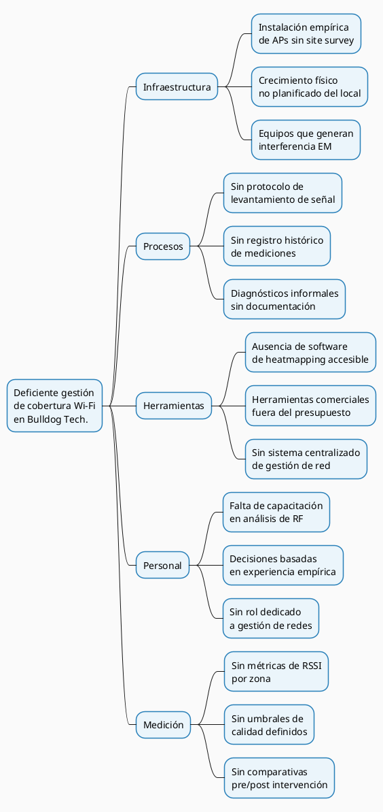
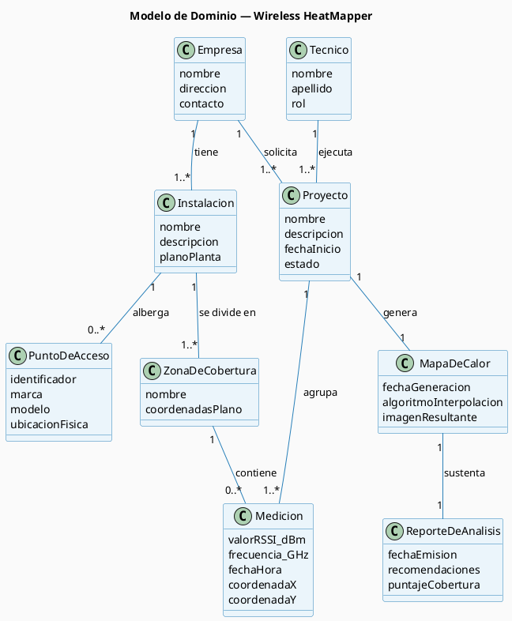

# 5. Descripción del Problema

## 5.1 Narrativa del Problema

Bulldog Tech. es una empresa tecnológica con sede en Santa Cruz de la Sierra, Bolivia, con experiencia consolidada en servicios de soporte técnico, mantenimiento de equipos y consultoría en sistemas de información. Hace aproximadamente un año, la empresa amplió su operación incorporando el área de infraestructura tecnológica de telecomunicaciones, orientada a la instalación, configuración y mantenimiento de redes de datos inalámbricas para clientes corporativos y pymes de la región.

En esta área, Bulldog Tech. aplica el proceso tradicional del sector: el técnico especializado visita las instalaciones del cliente, evalúa el espacio y determina la ubicación de los puntos de acceso (APs) a partir de su criterio y experiencia directa. Es el técnico quien, durante esa visita presencial, aporta el mayor valor para las decisiones de diseño de la red: cuántos APs instalar, dónde colocarlos y cómo configurarlos. El proyecto avanza desde esa evaluación subjetiva como único insumo técnico documentado.

Ese modelo funciona en instalaciones simples, pero presenta limitaciones estructurales conforme la empresa asume proyectos de mayor envergadura. La principal es que el proceso no genera evidencia objetiva: no se miden niveles de señal por zona, no se documenta la cobertura real alcanzada y no se deja una línea base que permita comparar el estado de la red antes y después de una intervención. La metodología profesional de *site survey*, documentada en el estándar de la industria CWNA-107, establece que el umbral mínimo de calidad de señal aceptable para una instalación nueva es de −70 dBm, y que cualquier zona con señal inferior a −90 dBm constituye una zona muerta donde la conectividad funcional no puede garantizarse. Sin instrumentos de medición, no existe forma de verificar si estos umbrales se cumplen en el trabajo que la empresa entrega a sus clientes.

Las consecuencias se manifiestan tanto hacia adentro como hacia los proyectos del cliente. En las instalaciones propias de Bulldog Tech., los técnicos reportan cortes intermitentes en el área de taller, el personal administrativo trabaja con velocidades insuficientes y los clientes que esperan en recepción perciben una señal débil. Ante cada reporte de falla, el diagnóstico es informal: se visita el lugar, se reinicia el equipo, se revisan cables, sin registro escrito, sin identificación de causa raíz y sin garantía de que el problema no reaparezca. En los proyectos de clientes, la empresa no puede demostrar objetivamente que la red entregada cumple con los parámetros técnicos acordados, lo que representa un riesgo creciente a medida que la cartera de clientes se expande.

La ausencia de una herramienta de levantamiento formal impide tomar decisiones basadas en datos para la reubicación o ampliación de puntos de acceso, y hace que el conocimiento técnico sobre cada instalación permanezca en la memoria del técnico que realizó la visita, sin sistematizarse. Este problema no es exclusivo de Bulldog Tech.: representa una limitación común en empresas que inician en el área de infraestructura de telecomunicaciones y no disponen del presupuesto para contratar herramientas comerciales de *site survey* (como Ekahau Site Survey o AirMagnet), cuyo costo de licencia puede superar los USD 3,000 anuales.

---

## 5.2 Diagrama Causa-Efecto (Ishikawa)

El siguiente diagrama identifica las causas raíz que originan la deficiente gestión de cobertura Wi-Fi en Bulldog Tech.:

_Figura 4. Diagrama de causa-efecto (Ishikawa) — Deficiente gestión de cobertura Wi-Fi en Bulldog Tech._

---

## 5.3 Modelo de Dominio

El modelo de dominio representa los conceptos clave del negocio involucrados en el problema. Cada clase es un concepto puro del negocio, no una tabla ni una clase de código:

_Figura 5. Modelo de dominio — conceptos clave del problema de cobertura Wi-Fi en Bulldog Tech._

---
