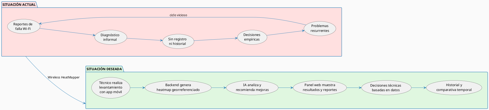

# 12. Anexos

## 12.1 Esquema Gráfico: Situación Actual vs. Situación Deseada

El siguiente diagrama ilustra el contraste entre el estado actual de gestión de cobertura Wi-Fi en Bulldog Tech. y el escenario que se alcanzará con la implementación de Wireless HeatMapper:

---

## 12.2 Datos del Caso de Estudio

| Campo               | Detalle                                                        |
| ------------------- | -------------------------------------------------------------- |
| **Empresa**         | Bulldog Tech.                                                  |
| **Rubro**           | Servicios tecnológicos: soporte, consultoría, redes           |
| **Ubicación**       | Santa Cruz de la Sierra, Bolivia                               |
| **Problemática**    | Deficiente gestión y diagnóstico de cobertura Wi-Fi interna    |
| **Áreas afectadas** | Taller técnico, área administrativa, sala de atención al cliente |
| **Necesidad clave** | Herramienta accesible de site survey y heatmapping Wi-Fi       |

---

## 12.3 Currículum Vitae de los Integrantes

### Fernandez Ortega Jhasmany Jhunnior

| Campo              | Detalle                                               |
| ------------------ | ----------------------------------------------------- |
| **Carrera**        | Ingeniería Informática — FICCT, UAGRM                |
| **Registro**       | 207025509                                             |
| **Rol en el proyecto** | Scrum Master / Desarrollador                      |
| **Áreas de enfoque** | Backend, infraestructura, DevOps                   |

---

### Quiroga Flores Herland Borys

| Campo              | Detalle                                               |
| ------------------ | ----------------------------------------------------- |
| **Carrera**        | Ingeniería Informática — FICCT, UAGRM                |
| **Registro**       | 200104373                                             |
| **Rol en el proyecto** | Product Owner / Desarrollador                    |
| **Áreas de enfoque** | Análisis de requisitos, frontend web, mobile       |

---

## Nota sobre la Carta de Formalización

La **Carta de Formalización** del acuerdo con el cliente Bulldog Tech. es un documento físico firmado que se adjunta de forma impresa al presente trabajo. Contiene el compromiso formal entre el equipo de desarrollo y el representante de Bulldog Tech. para la ejecución del proyecto Wireless HeatMapper bajo el marco de trabajo Scrum.

---
