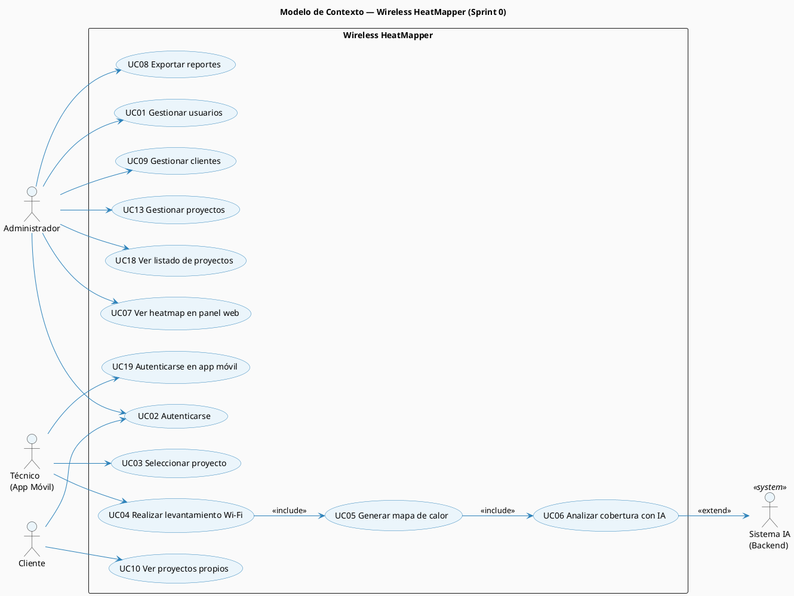
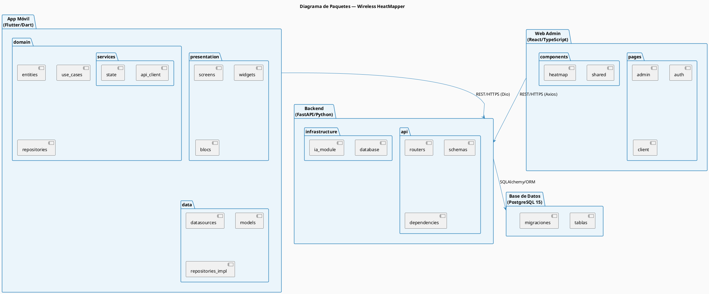
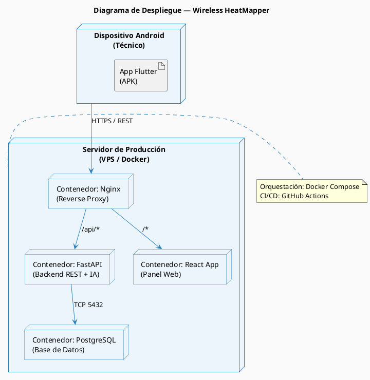
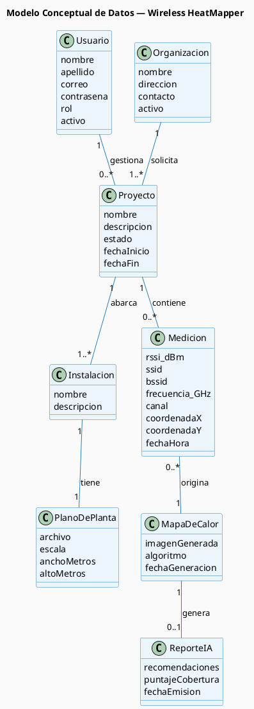

# Sprint 0 — Modelos Iniciales del Sistema

## S0.3 Modelos Iniciales

Como resultado de la ingeniería de requisitos del Sprint 0 se generaron los tres modelos iniciales que sirven como base para todos los sprints posteriores.

---

## S0.3.1 Modelo de Contexto — Diagrama de Casos de Uso

_Figura 6. Modelo de contexto — Diagrama de casos de uso del sistema Wireless HeatMapper._

---

### Diagrama de Paquetes

_Figura 7. Diagrama de paquetes — Arquitectura por capas del sistema Wireless HeatMapper._

### Diagrama de Despliegue

_Figura 8. Diagrama de despliegue — Infraestructura Docker del sistema Wireless HeatMapper._

---

## S0.3.3 Modelo de Datos Inicial — Conceptual

_Figura 9. Modelo conceptual de datos — Entidades principales del dominio de Wireless HeatMapper._

---
