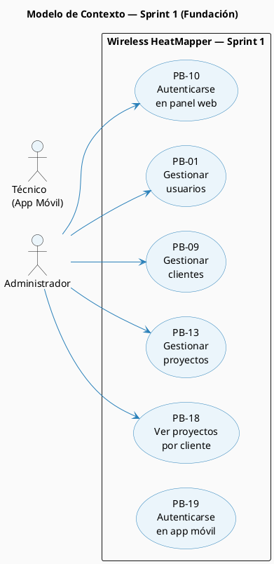
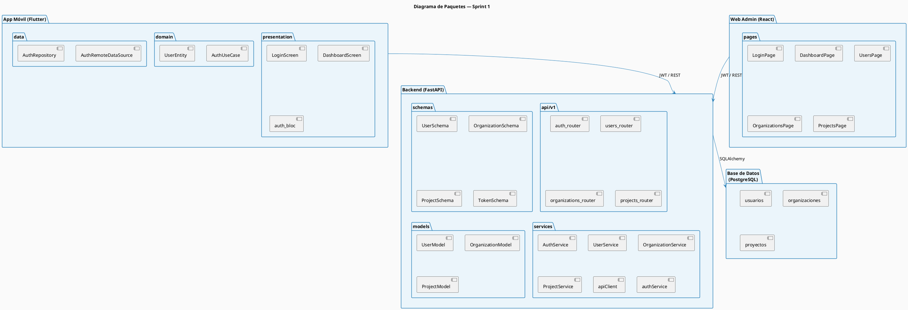
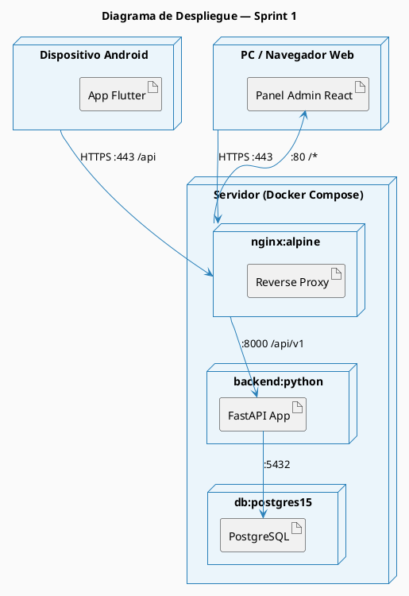
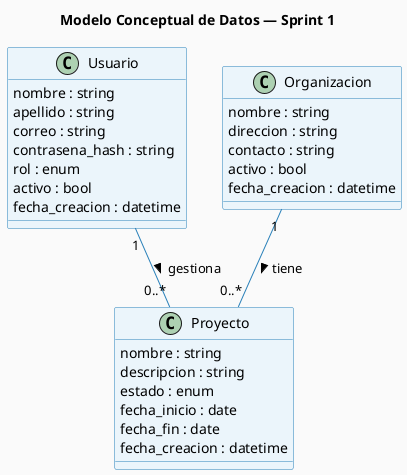
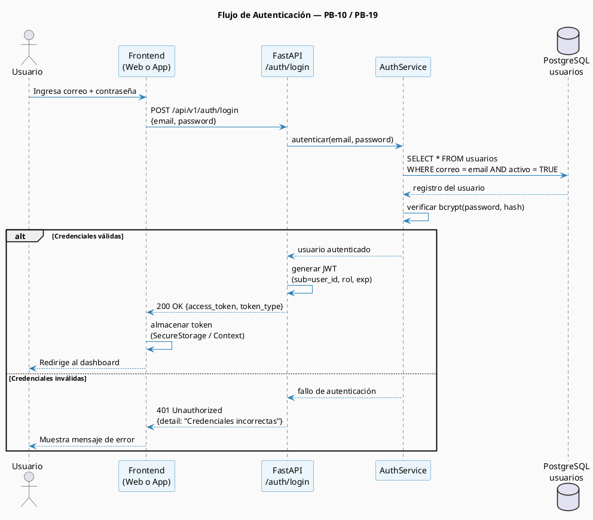

# Sprint 1 — Modelos Generados

## S1.2 Modelos del Sprint 1

---

## S1.2.1 Modelo de Contexto — Sprint 1

El diagrama de casos de uso muestra exclusivamente las funcionalidades abarcadas en el Sprint 1:



_Figura 10. Modelo de contexto actualizado al Sprint 1 — Casos de uso implementados en la primera iteración._

---

### Diagrama de Paquetes (Sprint 1)



_Figura 11. Diagrama de paquetes del Sprint 1 — Módulos implementados y sus dependencias._

### Diagrama de Despliegue (Sprint 1)



_Figura 12. Diagrama de despliegue del Sprint 1 — Configuración Docker de los contenedores en producción._

---

### Modelo Conceptual



_Figura 13. Modelo conceptual de datos del Sprint 1 — Entidades de usuario, organización y proyecto._

### Modelo Lógico (Esquema Relacional)

```
usuarios (
  id          PK  SERIAL
  nombre          VARCHAR(100)  NOT NULL
  apellido        VARCHAR(100)  NOT NULL
  correo          VARCHAR(255)  NOT NULL  UNIQUE
  contrasena_hash VARCHAR(255)  NOT NULL
  rol             VARCHAR(20)   NOT NULL  CHECK (rol IN ('admin','tecnico','cliente'))
  activo          BOOLEAN       NOT NULL  DEFAULT TRUE
  fecha_creacion  TIMESTAMP     NOT NULL  DEFAULT NOW()
)

organizaciones (
  id             PK  SERIAL
  nombre             VARCHAR(200)  NOT NULL  UNIQUE
  direccion          VARCHAR(300)
  contacto           VARCHAR(200)
  activo             BOOLEAN       NOT NULL  DEFAULT TRUE
  fecha_creacion     TIMESTAMP     NOT NULL  DEFAULT NOW()
)

proyectos (
  id               PK  SERIAL
  nombre               VARCHAR(200)  NOT NULL
  descripcion          TEXT
  estado               VARCHAR(20)   NOT NULL  DEFAULT 'activo'
                         CHECK (estado IN ('activo','pausado','completado','cancelado'))
  fecha_inicio         DATE
  fecha_fin            DATE
  fecha_creacion       TIMESTAMP     NOT NULL  DEFAULT NOW()
  organizacion_id  FK  INTEGER       NOT NULL  REFERENCES organizaciones(id)
  usuario_id       FK  INTEGER                 REFERENCES usuarios(id)
)
```

### Normalización aplicada

- **1FN:** Todos los atributos son atómicos; no hay grupos repetitivos.
- **2FN:** No hay dependencias parciales (todas las tablas tienen clave primaria simple).
- **3FN:** No hay dependencias transitivas; `rol` y `estado` usan CHECK constraint en lugar de tabla de lookup para simplicidad en este sprint.

---

## S1.2.4 Modelo de Lógica — Flujo de Autenticación (PB-10 / PB-19)

El flujo de autenticación es el proceso más relevante del Sprint 1 por involucrar múltiples componentes. Se documenta mediante diagrama de secuencia:



_Figura 14. Diagrama de secuencia — Flujo de autenticación mediante JWT (PB-10 / PB-19)._

---
