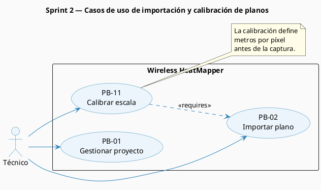
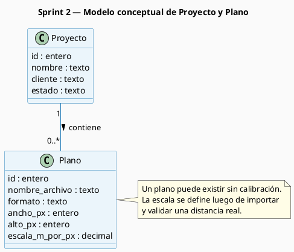
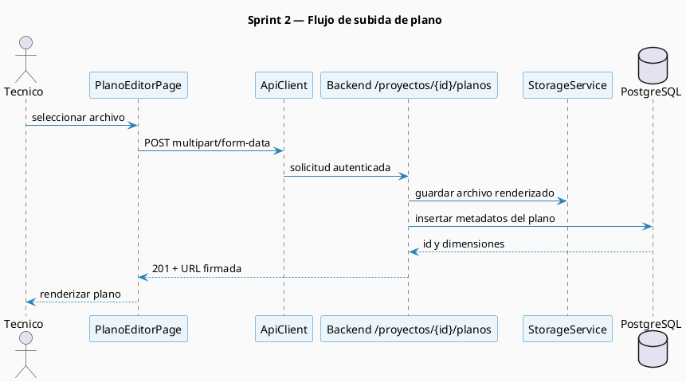
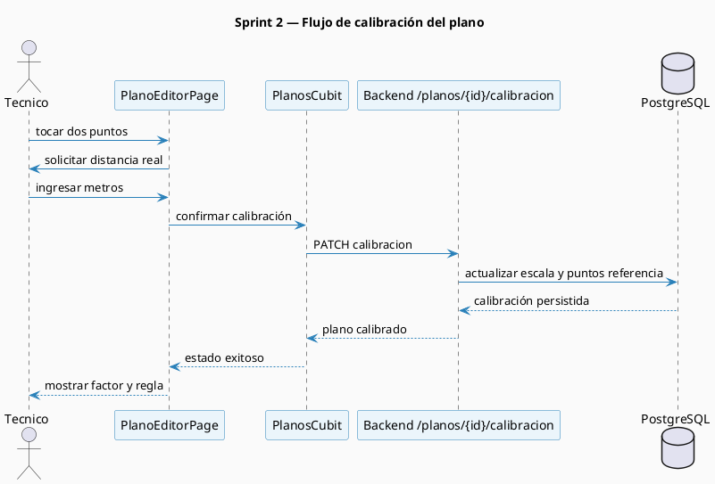

# Sprint 2 — Modelos Generados

## S2.2 Modelos del Sprint 2

### Modelo de contexto — Planos y calibración

_Figura 16. Casos de uso del Sprint 2 centrados en importación y calibración de planos._

### Diagrama de clases conceptual

_Figura 17. Modelo conceptual del Sprint 2 con la entidad Plano asociada al proyecto._

### Diagrama de secuencia — Subida de plano

_Figura 18. Secuencia de importación de plano desde la app móvil hacia el backend._

### Diagrama de secuencia — Calibración de escala

_Figura 19. Secuencia de calibración del plano a partir de una distancia conocida._

**Tabla 15.** Diseño físico de datos de la tabla `planos`

| Columna | Tipo de dato | Descripción |
| ------- | ------------ | ----------- |
| `id` | INTEGER | Identificador del plano |
| `proyecto_id` | INTEGER | Referencia al proyecto propietario |
| `nombre_archivo` | VARCHAR(255) | Nombre original del archivo importado |
| `formato` | VARCHAR(10) | Formato admitido: PNG, JPG o PDF |
| `ruta_storage` | VARCHAR(500) | Ubicación lógica del archivo en storage |
| `ancho_px` | INTEGER | Ancho del plano en píxeles |
| `alto_px` | INTEGER | Alto del plano en píxeles |
| `escala_m_por_px` | DECIMAL(10,6) | Factor de conversión de metros por píxel |
| `x1_cal` | DECIMAL(10,2) | Coordenada X del primer punto de calibración |
| `y1_cal` | DECIMAL(10,2) | Coordenada Y del primer punto de calibración |
| `x2_cal` | DECIMAL(10,2) | Coordenada X del segundo punto de calibración |
| `y2_cal` | DECIMAL(10,2) | Coordenada Y del segundo punto de calibración |
| `distancia_real_m` | DECIMAL(10,2) | Distancia física declarada por el técnico |
| `creado_en` | TIMESTAMP WITH TIME ZONE | Fecha y hora de creación del registro |

---
