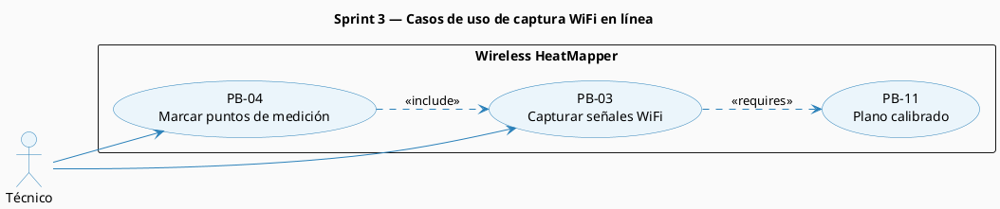
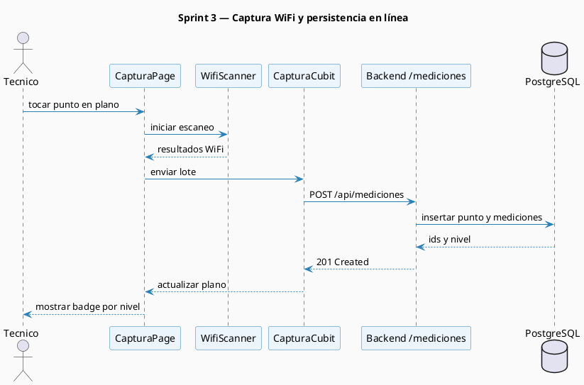
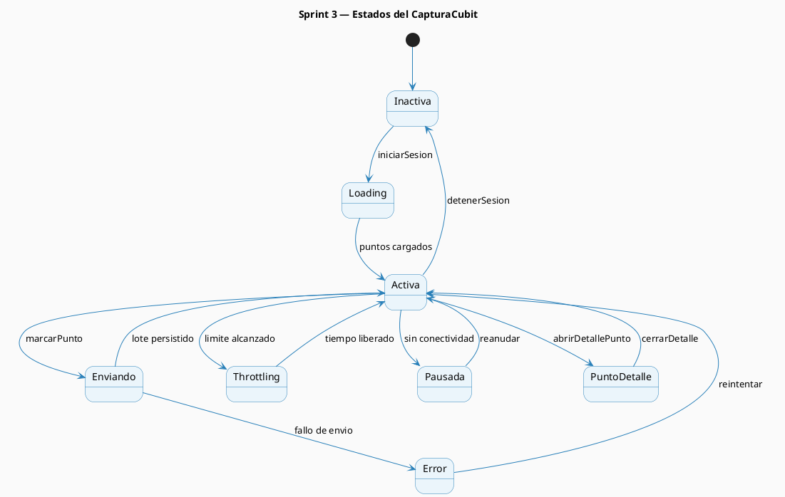

# Sprint 3 — Modelos Generados

## S3.2 Modelos del Sprint 3

### Modelo de contexto — Captura y marcado de puntos

_Figura 20. Casos de uso del Sprint 3 para captura en línea y marcado de puntos._

### Diagrama de secuencia — Captura WiFi en línea

_Figura 21. Secuencia de captura y envío de mediciones WiFi hacia el backend._

### Diagrama de estados — Sesión de captura

_Figura 22. Estados operativos del `CapturaCubit` durante una sesión de medición._

**Tabla 20.** Diseño físico de datos de `punto_medicion` y `medicion_wifi`

| Tabla | Columna | Tipo de dato | Descripción |
| ----- | ------- | ------------ | ----------- |
| `punto_medicion` | `id` | INTEGER | Identificador del punto |
| `punto_medicion` | `plano_id` | INTEGER | Referencia al plano calibrado |
| `punto_medicion` | `x_px` | DECIMAL(10,2) | Coordenada X del punto sobre el plano |
| `punto_medicion` | `y_px` | DECIMAL(10,2) | Coordenada Y del punto sobre el plano |
| `punto_medicion` | `nivel` | VARCHAR(20) | Nivel agregado del punto según peor RSSI |
| `punto_medicion` | `creado_en` | TIMESTAMP WITH TIME ZONE | Fecha de creación del punto |
| `medicion_wifi` | `id` | INTEGER | Identificador de la medición |
| `medicion_wifi` | `punto_id` | INTEGER | Referencia al punto de medición |
| `medicion_wifi` | `ssid` | VARCHAR(255) | Nombre de la red detectada |
| `medicion_wifi` | `bssid` | VARCHAR(17) | Dirección MAC del AP detectado |
| `medicion_wifi` | `rssi` | INTEGER | Intensidad de señal en dBm |
| `medicion_wifi` | `frecuencia` | INTEGER | Frecuencia de operación en MHz |
| `medicion_wifi` | `canal` | INTEGER | Canal observado |
| `medicion_wifi` | `numero_lectura` | INTEGER | Ciclo de escaneo dentro del mismo punto |
| `medicion_wifi` | `creado_en` | TIMESTAMP WITH TIME ZONE | Fecha de registro de la lectura |

**Tabla 21.** Clasificación CWNA-107 aplicada en backend

| Rango dBm | Nivel documentado | Uso interpretativo |
| --------- | ----------------- | ------------------ |
| `>= -70` | EXCELENTE | Cobertura objetivo |
| `-71 a -80` | BUENA | Cobertura funcional |
| `-81 a -85` | ACEPTABLE | Cobertura degradada |
| `-86 a -90` | DEBIL | Riesgo de pérdida de calidad |
| `< -90` | ZONA_MUERTA | Sin cobertura útil |

---
