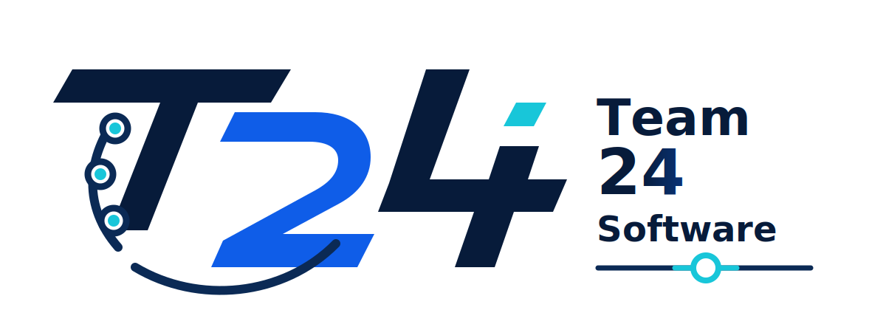

# Manual de Calidad del Software (SQAP)

**Organización:** Team 24 Software
**Eslogan:** Software medible, verificable y alineado al cliente
**Uso:** Manual institucional aplicable a todos los proyectos de software
**Código del documento:** SQAP-T24-001
**Versión:** 1.0
**Fecha:** 8 de junio de 2026
**Norma guía:** ISO/IEC 90003:2014, adopción IEEE Std 90003-2015



---

## Control del documento

| Campo | Detalle |
| ----- | ------- |
| Tipo de documento | Plan de Aseguramiento de la Calidad del Software / Manual de Calidad |
| Emitido por | Dirección de Calidad — Team 24 Software |
| Elaborado por | Equipo de Gestión de Calidad |
| Organización aplicable | Team 24 Software |
| Alcance de aplicación | Todos los proyectos de software desarrollados, mantenidos o entregados por Team 24 Software |
| Uso previsto | Marco institucional de calidad y base para la presentación formal de cada proyecto |
| Estado | Versión vigente para aplicación institucional |
| Ubicación | `docs/SQAP/Manual de Calidad - SQAP.md` |

## Historial de cambios

| Versión | Fecha | Responsable | Descripción |
| ------- | ----- | ----------- | ----------- |
| 1.0 | 8 jun 2026 | Team 24 Software | Emisión inicial del manual de calidad institucional, alineado a ISO/IEC 90003 |

## Aprobación

| Rol | Responsable | Firma / constancia |
| --- | ----------- | ------------------ |
| Representante de calidad | Responsable designado por Team 24 Software | Pendiente de aprobación |
| Dirección técnica | Responsable designado por Team 24 Software | Pendiente de aprobación |
| Dirección general | Representante autorizado de Team 24 Software | Pendiente de aprobación |

---

## 1. Propósito

El presente Manual de Calidad del Software establece el sistema institucional de aseguramiento de la calidad de Team 24 Software para la adquisición, desarrollo, verificación, validación, entrega, operación y mantenimiento de productos de software. Su propósito es definir criterios, responsabilidades, procesos, registros y controles que permitan producir software conforme a requisitos del cliente, requisitos técnicos, compromisos contractuales y estándares profesionales.

Este documento se elabora tomando como guía ISO/IEC 90003:2014, que orienta la aplicación de ISO 9001:2008 al software. No declara certificación ISO 9001 ni reemplaza requisitos contractuales específicos; establece el marco de trabajo que todo proyecto de la organización debe seguir y adaptar mediante su plan de calidad particular.

## 2. Alcance

Este manual aplica a todos los proyectos de software ejecutados por Team 24 Software, sean internos, experimentales, comerciales, de mantenimiento, de integración o desarrollados para clientes externos. Cubre las siguientes actividades:

- Gestión del sistema de calidad y de su documentación.
- Planificación de proyectos, planificación de la calidad y definición del ciclo de vida.
- Gestión de requisitos, trazabilidad y comunicación con cliente.
- Diseño, desarrollo, integración, pruebas, liberación y mantenimiento.
- Gestión de configuración, cambios, dependencias y entregables.
- Control de no conformidades, acciones correctivas, acciones preventivas y mejora continua.
- Medición de calidad de proceso, producto, servicio y satisfacción del cliente.
- Control de propiedad del cliente, preservación del producto software y herramientas de medición aplicables.

Cada proyecto desarrollado por la empresa debe preparar una **Ficha de Aplicación del Manual de Calidad** o un **Plan de Calidad del Proyecto**, donde se indique cómo se aplican estos procesos al contexto específico del cliente, alcance, tecnología, riesgos, entregables y criterios de aceptación. Dicha ficha no reemplaza este manual; lo particulariza para un proyecto concreto.

## 3. Exclusiones y límites

El manual no cubre fabricación de hardware, instalación física de redes, certificaciones de seguridad eléctrica, cumplimiento legal especializado ni soporte operativo 24/7, salvo que un contrato de proyecto lo incorpore expresamente.

En proyectos de software con componentes de hardware, medición física, inteligencia artificial, datos externos o servicios de terceros, el manual exige registrar las condiciones de uso, supuestos, límites y validez de los datos o instrumentos empleados, pero no certifica dispositivos externos ni sustituye normas técnicas propias del dominio del cliente.

## 4. Referencias

### 4.1 Referencias normativas y metodológicas

| Referencia | Uso en este manual |
| ---------- | ------------------ |
| ISO/IEC 90003:2014 / IEEE Std 90003-2015 | Guía principal para aplicar ISO 9001 al software |
| ISO 9001:2008 | Base conceptual de sistema de gestión de calidad referida por ISO/IEC 90003 |
| ISO/IEC 12207 | Referencia de procesos de ciclo de vida del software citada por ISO/IEC 90003 |
| ISO/IEC 25010 | Referencia de características de calidad de producto software |
| ISO/IEC 15939 | Referencia para procesos de medición de software |
| ISO/IEC 14764 | Referencia para mantenimiento de software |
| Guía interna de proceso Scrum de Team 24 Software | Marco operativo usado para integrar Scrum con actividades de ingeniería |

### 4.2 Documentos de aplicación por proyecto

Los documentos técnicos o metodológicos de un proyecto específico, como planes de proyecto, backlogs, matrices de trazabilidad, referencias técnicas del dominio o actas de revisión, se registran en la Ficha de Aplicación del Manual de Calidad de ese proyecto. No forman parte del alcance permanente del manual institucional, aunque pueden usarse como evidencia de aplicación.

## 5. Identidad organizacional

### 5.1 Nombre institucional

La organización adopta el nombre **Team 24 Software** como denominación corporativa oficial para este Manual de Calidad. Bajo este nombre la empresa define, ejecuta, controla y mejora su sistema de gestión de calidad aplicado al desarrollo de software.

### 5.2 Eslogan

**Software medible, verificable y alineado al cliente.**

El eslogan resume tres compromisos operativos: todo producto debe poder medirse, toda entrega debe poder verificarse y toda decisión debe responder a una necesidad validada con el cliente.

### 5.3 Misión

Desarrollar soluciones de software confiables, verificables y mantenibles, aplicando prácticas de ingeniería, aseguramiento de calidad y mejora continua para resolver necesidades reales de clientes mediante productos funcionales, documentados y técnicamente sustentados.

### 5.4 Visión

Consolidarse como una empresa de desarrollo capaz de ejecutar proyectos de software con disciplina profesional, trazabilidad completa, evidencia de calidad y entregas incrementales que puedan ser revisadas por clientes, auditores, pares técnicos y partes interesadas autorizadas.

### 5.5 Valores de calidad

| Valor | Conducta esperada |
| ----- | ----------------- |
| Enfoque al cliente | Los requisitos se levantan, revisan y aceptan con participación del cliente o su representante |
| Evidencia | Ningún avance se considera terminado sin registros verificables |
| Trazabilidad | Cada requisito debe poder vincularse con diseño, implementación, pruebas y entrega |
| Simplicidad técnica | Se eligen soluciones comprensibles, mantenibles y adecuadas al alcance |
| Mejora continua | Cada sprint o proyecto debe cerrar con lecciones y acciones de mejora |
| Responsabilidad profesional | Los hallazgos, defectos y riesgos se reportan sin ocultamiento |

## 6. Política de calidad

Team 24 Software se compromete a desarrollar productos de software que satisfagan requisitos acordados con el cliente, cumplan criterios técnicos verificables y mantengan evidencia documental suficiente para demostrar conformidad. Para ello adopta un sistema de calidad basado en planificación, trazabilidad, revisión técnica, pruebas por niveles, control de cambios, gestión de riesgos, control de no conformidades y mejora continua.

La calidad se gestiona desde el inicio del proyecto y no como una actividad final. Cada incremento debe pasar por análisis, diseño, implementación y pruebas, con participación del Product Owner, revisión del equipo y aceptación del cliente cuando corresponda.

## 7. Objetivos de calidad

Los objetivos de calidad se revisan al inicio de cada proyecto, durante los hitos de seguimiento y antes de cada liberación. Cuando el proyecto no defina valores propios, se aplican los siguientes mínimos institucionales:

| Objetivo | Métrica | Meta mínima | Evidencia esperada | Responsable |
| -------- | ------- | ----------- | ------------------ | ----------- |
| Conformidad de requisitos | Requisitos con criterios de aceptación definidos | 100 % antes de ingresar a ejecución | Backlog, caso de uso o especificación aprobada | Product Owner |
| Trazabilidad | Requisitos vinculados a diseño, implementación y prueba | 100 % en requisitos implementados | Matriz de trazabilidad actualizada | Representante de calidad |
| Calidad de código | Cambios revisados por un responsable distinto al autor | 100 % antes de integrar a la línea base | Registro de revisión o aprobación técnica | Equipo técnico |
| Pruebas relevantes | Pruebas definidas según riesgo ejecutadas | 100 % de pruebas obligatorias del plan de calidad | Reporte de pruebas, evidencia de CI o acta QA | QA / Equipo técnico |
| Defectos críticos | Defectos críticos abiertos al liberar | 0 | Registro de defectos filtrado por severidad | Representante de calidad |
| Documentación | Artefactos afectados actualizados | 100 % antes de cierre de sprint o hito | Documentos versionados y registro de cambios | Equipo técnico |
| Satisfacción del cliente | Entregables aceptados sin observaciones bloqueantes | ≥ 90 % del alcance comprometido, salvo cambio aprobado | Acta de aceptación o revisión del cliente | Product Owner |
| Mejora continua | Acciones de mejora registradas y seguidas | Al menos 1 acción por iteración o hito | Registro de retrospectiva o plan de mejora | Scrum Master / Facilitador |

Cuando un proyecto defina metas técnicas adicionales, estas deben registrarse en su Plan de Calidad del Proyecto con métricas, responsables, umbrales de aceptación y evidencia requerida. Las metas particulares no modifican este manual; lo complementan.

## 8. Sistema de gestión de calidad

### 8.1 Enfoque por procesos

El sistema de calidad se organiza en procesos interrelacionados. Cada proceso tiene entradas, actividades, salidas, responsables, registros y controles.

| Proceso | Entradas | Salidas | Control principal | Registros mínimos |
| ------- | -------- | ------- | ----------------- | ----------------- |
| Gestión de requisitos | Necesidad del cliente, acuerdos, entrevistas | Backlog, requisitos, criterios de aceptación | Revisión y aprobación del Product Owner | Actas, backlog, matriz de trazabilidad |
| Planificación | Backlog priorizado, capacidad, riesgos | Plan de iteración, objetivo, plan de calidad | Revisión de capacidad, riesgos y dependencias | Plan de calidad, cronograma, matriz de riesgos |
| Diseño | Requisitos aceptados, arquitectura base | Modelos, decisiones técnicas, contratos, prototipos | Revisión técnica de diseño | Modelos UML 2.5+, ADR, especificaciones, prototipos |
| Implementación | Diseño aprobado, estándares de código | Código, configuración, migraciones o artefactos técnicos | Revisión técnica antes de integración | Registro de cambios, revisión de código, bitácora técnica |
| Verificación | Código integrado, criterios técnicos | Resultados de pruebas y hallazgos | Ejecución de pruebas según riesgo | Reportes de prueba, cobertura, evidencias CI |
| Validación | Incremento verificable, criterios de aceptación | Aceptación, rechazo u observaciones | Validación del Product Owner o cliente | Acta de revisión, checklist de aceptación |
| Liberación | Incremento validado, checklist de release | Versión entregable | Autorización formal de liberación | Registro de release, versión, evidencia de entrega |
| Medición y mejora | Métricas, defectos, retroalimentación | Acciones correctivas, preventivas y mejoras | Revisión por dirección o comité de calidad | Retrospectivas, no conformidades, auditorías |

### 8.2 Ciclo de vida de software

La organización adopta un ciclo de vida iterativo e incremental basado en Scrum. Cada sprint integra cuatro actividades obligatorias de ingeniería:

1. **Análisis:** comprensión de historias de usuario, reglas de negocio y criterios de aceptación.
2. **Diseño:** arquitectura, datos, lógica e interfaces según necesidad.
3. **Implementación:** codificación, integración, migraciones y configuración.
4. **Pruebas:** verificación por desarrollador, QA rotativo y aceptación por Product Owner.

El ciclo se adapta a proyectos futuros, siempre que mantenga evidencia de planificación, ejecución, revisión y mejora.

### 8.3 Correspondencia con ISO/IEC 90003

| Cláusula ISO/IEC 90003 | Aplicación en Team 24 Software |
| ---------------------- | -------------------------------- |
| 4. Sistema de gestión de calidad | Manual, procesos, control documental, registros y trazabilidad |
| 5. Responsabilidad de la dirección | Política, objetivos, roles, revisión gerencial y comunicación interna |
| 6. Gestión de recursos | Competencias, herramientas, infraestructura y ambiente de trabajo |
| 7. Realización del producto | Planificación, requisitos, diseño, desarrollo, compras, liberación y configuración |
| 8. Medición, análisis y mejora | Satisfacción, auditoría, métricas, no conformidades, acciones correctivas y preventivas |

### 8.4 Manual institucional y plan de calidad por proyecto

Este manual define el marco permanente de calidad de la empresa. Cada proyecto debe derivar de él un Plan de Calidad del Proyecto o una Ficha de Aplicación que especifique:

- Cliente, partes interesadas y responsable de aceptación.
- Alcance funcional y no funcional del producto.
- Ciclo de vida y calendario de entregas.
- Roles asignados y autoridad para aprobar cambios.
- Requisitos de calidad aplicables y métricas objetivo.
- Herramientas, tecnologías, dependencias y restricciones.
- Controles de verificación, validación, liberación y mantenimiento.
- Riesgos, propiedad del cliente, datos sensibles y registros requeridos.
- Criterios de cierre, entrega y soporte posterior.

La ficha de aplicación es obligatoria para presentar formalmente un proyecto bajo el sistema de calidad de Team 24 Software.

## 9. Responsabilidad de la dirección

### 9.1 Compromiso directivo

La dirección técnica y el representante de calidad son responsables de:

- Comunicar la importancia de cumplir requisitos del cliente, requisitos normativos, compromisos contractuales y estándares profesionales.
- Mantener vigente este manual y sus registros.
- Revisar objetivos de calidad y resultados de medición.
- Asignar recursos razonables para pruebas, documentación, revisión y mejora.
- Evitar que la presión por entregar elimine controles mínimos de calidad.

### 9.2 Enfoque al cliente

El cliente o su representante participa en la definición de requisitos, revisión de incrementos y aceptación funcional. Cuando existan partes interesadas adicionales, su participación debe quedar registrada en el Plan de Calidad del Proyecto sin reemplazar la autoridad de aceptación definida con el cliente.

Los requisitos del cliente deben transformarse en historias de usuario, criterios de aceptación, reglas de negocio y casos de prueba. Cualquier ambigüedad debe resolverse antes de comprometer la historia en un sprint.

### 9.3 Roles y responsabilidades

| Rol de calidad | Responsable en la organización | Responsabilidades |
| -------------- | ------------------------------ | ----------------- |
| Dirección técnica | Product Owner + Scrum Master | Aprobar política, objetivos, cambios mayores y releases |
| Representante de calidad | Scrum Master, con rotación si el proyecto lo requiere | Mantener SQAP, controlar registros, coordinar auditorías internas |
| Product Owner | Responsable designado por proyecto | Priorizar requisitos, validar criterios de aceptación, representar al cliente |
| Scrum Master / Facilitador | Responsable designado por proyecto | Facilitar proceso, remover impedimentos, proteger controles de calidad |
| Desarrolladores | Equipo técnico del proyecto | Diseñar, implementar, probar y documentar |
| QA rotativo | Integrante distinto al autor principal del cambio | Ejecutar pruebas de calidad y buscar fallos funcionales, seguridad y rendimiento |
| Cliente / usuario representante | Organización contratante o representante designado | Validar que el producto resuelve la necesidad real |

### 9.4 Comunicación interna

La comunicación se formaliza mediante:

- Sprint Planning para análisis y compromiso.
- Daily Scrum para coordinación e impedimentos.
- Revisiones técnicas de cambios para control de calidad del código y artefactos.
- Sprint Review para validación con PO/cliente.
- Retrospective para mejora del proceso.
- Documentación versionada para decisiones, modelos y evidencias.

Las decisiones que afecten alcance, arquitectura, seguridad, datos o calidad deben registrarse en un documento del proyecto, solicitud de cambio, revisión técnica o registro de decisión arquitectónica.

### 9.5 Revisión por la dirección

Al cierre de cada sprint o fase se realiza una revisión de gestión con los siguientes insumos:

- Estado de historias, tareas y entregables.
- Resultados de pruebas y cobertura.
- No conformidades abiertas y cerradas.
- Riesgos activos y cambios de severidad.
- Retroalimentación del cliente, usuarios clave, auditoría o partes interesadas autorizadas.
- Cumplimiento de objetivos de calidad.
- Necesidades de recursos o capacitación.

La salida de la revisión debe incluir decisiones, acciones correctivas, acciones preventivas y ajustes al plan.

## 10. Gestión de recursos

### 10.1 Competencia

Cada integrante debe mantener competencia suficiente para cumplir su rol. La competencia se evidencia mediante tareas completadas, revisiones aprobadas, pruebas ejecutadas, documentación producida y participación en ceremonias.

| Área | Competencias mínimas |
| ---- | -------------------- |
| Requisitos | Historias de usuario, criterios de aceptación, trazabilidad |
| Diseño | UML 2.5 o superior, arquitectura por capas, modelos de datos, prototipos |
| Backend | Diseño de API, servicios, persistencia, seguridad, validación de datos y pruebas de integración |
| Móvil | Desarrollo de clientes móviles, consumo de servicios, manejo de permisos, UX y pruebas en dispositivo |
| Web | Desarrollo frontend, tipado, consumo de API, accesibilidad básica, rendimiento y pruebas de interfaz |
| Calidad | Pruebas unitarias, integración, aceptación, seguridad básica, revisión de código |
| DevOps | Automatización de entornos, integración continua, entrega controlada, monitoreo básico y gestión de configuración |

### 10.2 Conciencia y capacitación

Cuando una tecnología, norma o dominio técnico sea nuevo para el equipo, se debe registrar una actividad de capacitación o investigación. La evidencia puede ser una nota técnica, prototipo, prueba de concepto, checklist o referencia bibliográfica.

### 10.3 Infraestructura

La infraestructura mínima de proyecto debe incluir:

- Repositorio de control de versiones con ramas, revisiones y versiones identificables.
- Entorno reproducible mediante contenedores, máquinas virtuales, scripts de provisión o mecanismo equivalente.
- Base de datos versionada mediante migraciones.
- Pipeline de integración continua cuando el alcance lo permita.
- Herramientas de modelado y documentación.
- Gestión de secretos fuera del repositorio.

La infraestructura específica, versiones, servicios, entornos y restricciones tecnológicas se documentan en el Plan de Calidad del Proyecto y en los documentos técnicos de arquitectura.

### 10.4 Ambiente de trabajo

El ambiente de trabajo debe favorecer concentración, revisión técnica, comunicación clara y respaldo de la información. Las decisiones críticas no deben depender de memoria personal; deben quedar registradas.

## 11. Control de documentación y registros

### 11.1 Documentos controlados

Son documentos controlados:

- Manual de Calidad / SQAP.
- Planes de proyecto y planes de calidad por proyecto.
- Product Backlog, historias de usuario y Sprint Backlog.
- Modelos UML 2.5 o superior generados con herramientas CASE.
- Planes de prueba y reportes de validación.
- Matriz de trazabilidad, riesgos, retrospectivas y actas.
- Guías técnicas, guías de despliegue y documentación de servicios.

### 11.2 Reglas de control documental

| Regla | Aplicación |
| ----- | ---------- |
| Identificación | Cada documento debe tener título, propósito, ubicación y versión cuando corresponda |
| Versionado | Todo documento vive en un repositorio o sistema de control documental y se modifica mediante registros rastreables |
| Revisión | Cambios relevantes se revisan por al menos otro integrante o por el PO |
| Aprobación | Documentos base del proyecto se aprueban en revisión de sprint, revisión técnica o comité de calidad |
| Obsolescencia | Documentos históricos se conservan indicando que no son fuente vigente |
| Trazabilidad | Cambios en requisitos deben reflejarse en la matriz de trazabilidad correspondiente |

### 11.3 Control de registros

Los registros son evidencias de que el sistema de calidad opera. Deben ser legibles, recuperables y estar protegidos contra pérdida.

| Registro | Responsable | Retención mínima |
| -------- | ----------- | ---------------- |
| Product Backlog y Sprint Backlog | Product Owner | Vida del proyecto + periodo de retención definido |
| Actas de Review y Retrospective | Scrum Master | Vida del proyecto + periodo de retención definido |
| Resultados de pruebas | QA rotativo / Dev | Vida del proyecto |
| Revisiones técnicas de cambios | Equipo de desarrollo | Vida del repositorio |
| Reportes de defectos | QA rotativo | Vida del proyecto |
| No conformidades | Representante de calidad | Vida del proyecto + periodo de retención definido |
| Releases y changelog | Dirección técnica | Vida del producto |

## 12. Patrón de desarrollo institucional

### 12.1 Marco metodológico

Team 24 Software adopta Scrum como marco de trabajo, integrado con actividades de ingeniería de software. El patrón institucional se resume así:

```text
Definición inicial
  → Product Backlog
  → Sprint Planning
  → Análisis de HU
  → Diseño técnico
  → Implementación
  → Pruebas por niveles
  → Sprint Review
  → Retrospective
  → Mejora del proceso
```

### 12.2 Estándares de trabajo

| Área | Estándar adoptado |
| ---- | ----------------- |
| Requisitos | Historias de usuario con 3 C: Card, Conversación, Confirmación |
| Planificación | Scrum, estimación por PHU, Sprint Backlog con tareas pequeñas |
| Modelado | UML 2.5 o superior mediante herramientas CASE |
| Arquitectura | Capas, separación de responsabilidades y contratos explícitos |
| Código | Revisión técnica, estilo consistente, nombres de dominio en español cuando aplique |
| API | Contratos de servicio documentados, validación de entrada y errores normalizados |
| Datos | Modelo relacional, migraciones versionadas y reversibles cuando sea viable |
| Pruebas | Unitarias, integración, aceptación, seguridad y rendimiento según riesgo |
| Despliegue | Entornos reproducibles, configuración externa y entrega automatizable |
| Documentación | Documentación versionada y evidencia vinculada a requisitos |

### 12.3 Definition of Done institucional

Una historia se considera terminada solo si:

- Sus criterios de aceptación están implementados.
- Existe evidencia de pruebas proporcionales al riesgo.
- El código fue revisado por otro integrante.
- La documentación afectada fue actualizada.
- La trazabilidad requisito-diseño-prueba-entrega está registrada.
- No quedan defectos críticos o bloqueantes asociados.
- El Product Owner acepta la historia o registra observaciones.

Para proyectos con restricciones especiales, la Definition of Done debe ampliarse en el Plan de Calidad del Proyecto. Las restricciones particulares deben redactarse como criterios verificables y asociarse a evidencia objetiva.

## 13. Gestión de requisitos y comunicación con cliente

### 13.1 Determinación de requisitos

Los requisitos se levantan a partir de entrevistas, documentos, observación del proceso, necesidades del cliente, restricciones técnicas, normativas aplicables y decisiones de negocio aprobadas. Deben clasificarse como funcionales, no funcionales, técnicos, de seguridad, de operación o de documentación.

### 13.2 Revisión de requisitos

Antes de comprometer un requisito, el equipo verifica:

- Claridad de la necesidad y del usuario afectado.
- Criterios de aceptación verificables.
- Dependencias técnicas y de negocio.
- Riesgos asociados.
- Consistencia con alcance vigente.
- Factibilidad dentro del sprint o fase.
- Impacto en arquitectura, datos, seguridad y pruebas.

### 13.3 Trazabilidad

Todo requisito implementado debe poder relacionarse con:

- Requerimiento principal o necesidad del cliente.
- Historia de usuario.
- Tareas del sprint.
- Modelos o decisiones de diseño.
- Código o componente afectado.
- Pruebas ejecutadas.
- Evidencia de aceptación.

Cada proyecto define su propia matriz de trazabilidad. Como mínimo, debe permitir ubicar qué requisito originó cada entrega y qué prueba demuestra su conformidad.

### 13.4 Cambios de requisitos

Los cambios deben registrarse, evaluar impacto y aprobarse antes de implementarse. Un cambio aceptado debe actualizar backlog, trazabilidad, riesgos, estimaciones y documentación relacionada.

Los cambios urgentes se pueden atender dentro del sprint solo si no comprometen la calidad del incremento o si el Product Owner aprueba el intercambio de alcance.

| Tipo de cambio | Evaluación requerida | Aprobación mínima | Registro obligatorio |
| -------------- | -------------------- | ----------------- | -------------------- |
| Menor | No altera alcance, arquitectura, costo ni fecha comprometida | Product Owner | Backlog o registro de cambio |
| Funcional | Agrega, elimina o modifica comportamiento observable del producto | Product Owner + dirección técnica | Solicitud de cambio, impacto y criterio de aceptación |
| Técnico | Afecta arquitectura, datos, seguridad, rendimiento o infraestructura | Dirección técnica + representante de calidad | Análisis técnico, riesgos y plan de pruebas |
| Contractual | Afecta alcance formal, costo, fecha, entregable o responsabilidad del cliente | Dirección técnica + cliente | Acta, anexo contractual o aprobación escrita |
| Correctivo urgente | Atiende defecto crítico o incidente operativo | Dirección técnica | Registro de incidente, corrección y verificación posterior |

## 14. Diseño y desarrollo

### 14.1 Planificación del diseño y desarrollo

Cada proyecto debe definir:

- Ciclo de vida aplicable.
- Responsables e interfaces entre roles.
- Actividades de análisis, diseño, codificación, integración y pruebas.
- Entregables por fase o sprint.
- Herramientas y estándares.
- Criterios de revisión, verificación, validación y liberación.

### 14.2 Entradas de diseño

Las entradas mínimas de diseño son:

- Historias de usuario y criterios de aceptación.
- Reglas de negocio.
- Requisitos no funcionales.
- Restricciones tecnológicas.
- Modelos previos aprobados.
- Riesgos activos.
- Requisitos de seguridad, datos y operación.

### 14.3 Salidas de diseño

Las salidas deben ser suficientes para implementar y verificar el producto. Pueden incluir:

- Diagrama de contexto o casos de uso.
- Diagrama de paquetes, despliegue o C4.
- Modelo conceptual, lógico y físico de datos.
- Diagramas de secuencia, actividad o estado cuando el proceso lo amerite.
- Contratos API.
- Prototipos o diseños de interfaz.
- ADR para decisiones relevantes.

### 14.4 Revisión de diseño

El diseño se revisa antes o durante la implementación según complejidad. La revisión verifica:

- Correspondencia con requisitos.
- Consistencia con arquitectura vigente.
- Viabilidad técnica.
- Impacto en seguridad y datos.
- Pruebas necesarias.
- Mantenibilidad y simplicidad.

### 14.5 Verificación

La verificación responde a la pregunta: **¿el producto fue construido correctamente según las especificaciones?** Incluye revisión de código, pruebas unitarias, pruebas de integración, análisis estático, validación de migraciones, revisión de contratos API y ejecución de pipelines.

### 14.6 Validación

La validación responde a la pregunta: **¿el producto resuelve la necesidad del usuario?** Se ejecuta mediante Sprint Review, pruebas de aceptación, demostraciones, escenarios de uso y confirmación del Product Owner o cliente.

### 14.7 Control de cambios de diseño y desarrollo

Todo cambio relevante debe:

1. Identificar motivo y alcance.
2. Evaluar impacto en requisitos, diseño, datos, pruebas y documentación.
3. Registrar aprobación.
4. Implementarse mediante un cambio trazable en el sistema de control de versiones.
5. Verificarse mediante pruebas.
6. Actualizar documentación y trazabilidad.

## 15. Compras, componentes externos y software de terceros

Team 24 Software utiliza bibliotecas, frameworks y herramientas open source. Antes de incorporar un componente externo se evalúa:

- Licencia y compatibilidad con el proyecto.
- Mantenimiento y comunidad.
- Riesgos de seguridad conocidos.
- Compatibilidad técnica.
- Impacto en despliegue y operación.
- Alternativas disponibles.

Los componentes deben fijar versiones cuando sea necesario para reproducibilidad. Las dependencias críticas deben revisarse antes de una liberación.

## 16. Gestión de configuración

### 16.1 Elementos de configuración

Son elementos de configuración:

- Código fuente.
- Migraciones de base de datos.
- Archivos de infraestructura.
- Documentación controlada.
- Diagramas y modelos.
- Scripts de build, test y deploy.
- Configuraciones de integración, construcción y despliegue automatizable.
- Artefactos liberados.

### 16.2 Reglas de versionado

| Elemento | Regla |
| -------- | ----- |
| Código | Control de versiones, cambios pequeños y revisión técnica |
| Releases | Tags o marcas de versión con changelog |
| Base de datos | Migraciones incrementales y documentadas |
| Configuración | Variables de entorno; secretos fuera del repositorio |
| Documentación | Commits asociados a cambios de alcance o diseño |
| Diagramas | Modelos UML y artefactos CASE versionados junto al documento |

### 16.3 Liberación

Una liberación solo procede cuando:

- El incremento compila y se ejecuta en entorno definido.
- Las pruebas mínimas pasan.
- No existen defectos críticos abiertos.
- La documentación de uso o instalación está actualizada.
- El Product Owner o responsable designado autoriza la entrega.

### 16.4 Propiedad del cliente

Se considera propiedad del cliente cualquier información, archivo, credencial, imagen, base de datos, plano, documento, marca, configuración, muestra, dataset o acceso entregado por el cliente para el desarrollo, prueba, operación o mantenimiento del producto.

El equipo debe:

- Identificar la propiedad del cliente al recibirla.
- Registrar su ubicación, responsable y finalidad de uso.
- Protegerla contra pérdida, acceso no autorizado, corrupción o divulgación.
- Notificar al cliente si se pierde, daña o detecta uso no autorizado.
- Devolverla, eliminarla o conservarla según acuerdo formal al cierre del proyecto.

### 16.5 Preservación del producto software

El producto software debe preservarse durante desarrollo, almacenamiento, entrega y mantenimiento. Esta preservación incluye:

- Repositorios con historial y control de acceso.
- Versiones etiquetadas y artefactos de release identificables.
- Backups o exportaciones de datos cuando el proyecto lo requiera.
- Integridad de paquetes, imágenes, instaladores, contenedores y scripts.
- Documentación de instalación, configuración y recuperación.
- Protección de credenciales, llaves y variables sensibles fuera del repositorio.

### 16.6 Control de herramientas de seguimiento y medición

Cuando la conformidad del producto dependa de herramientas de medición, análisis, simulación, pruebas, monitoreo o generación de reportes, el proyecto debe registrar:

- Herramienta utilizada, versión y configuración relevante.
- Métrica o resultado que produce.
- Criterio de aceptación asociado.
- Método de verificación o calibración cuando aplique.
- Limitaciones conocidas y efecto posible sobre la validez del resultado.

En software, este control aplica a suites de prueba, analizadores estáticos, herramientas de cobertura, monitores de rendimiento, herramientas de seguridad, scripts de benchmark, modelos de IA, sensores, emuladores y cualquier instrumento que produzca evidencia de conformidad.

## 17. Pruebas y aseguramiento de calidad

### 17.1 Tres filtros de prueba

| Filtro | Responsable | Propósito |
| ------ | ----------- | --------- |
| 1er filtro: pruebas del desarrollador | Autor del cambio | Comprobar que la unidad desarrollada cumple su especificación |
| 2do filtro: QA rotativo | Integrante distinto al autor principal | Buscar fallos funcionales, de seguridad, rendimiento, usabilidad y datos |
| 3er filtro: aceptación | Product Owner / cliente | Confirmar que la historia cumple los criterios de aceptación |

### 17.2 Tipos de prueba

| Tipo | Aplicación | Evidencia mínima | Momento de ejecución |
| ---- | ---------- | ---------------- | -------------------- |
| Unitarias | Funciones, servicios, validadores y lógica de dominio | Reporte de ejecución o salida de herramienta de pruebas | Durante implementación y antes de integrar |
| Integración | Contratos entre capas, servicios, persistencia y componentes externos | Reporte de integración, logs o evidencia de entorno de prueba | Antes de validar la historia o requisito |
| Interfaz de usuario | Componentes críticos de interacción web, móvil o escritorio | Capturas, pruebas automatizadas o checklist de UI | Antes de demo o revisión con cliente |
| End-to-end | Flujos principales del usuario cuando el riesgo lo amerite | Escenario ejecutado, resultado esperado y evidencia | Antes de liberación de incremento |
| Seguridad | Autenticación, autorización, validación de entrada y exposición de datos | Checklist de seguridad, hallazgos y correcciones | Antes de liberar funciones expuestas |
| Rendimiento | Operaciones con umbrales de latencia, carga o disponibilidad | Resultado de benchmark o monitoreo definido | Antes de liberar funciones críticas |
| Regresión | Funcionalidades afectadas por cambios o defectos corregidos | Suite o checklist de regresión ejecutado | Antes de cerrar correcciones |
| Aceptación | Criterios acordados con Product Owner o cliente | Acta, checklist o aprobación documentada | Al cierre de historia, sprint o hito |

### 17.3 Criterios de severidad de defectos

| Severidad | Definición | Criterio de liberación |
| --------- | ---------- | ---------------------- |
| Crítica | Bloquea operación principal, compromete datos o seguridad | No se libera |
| Alta | Afecta una función importante sin alternativa razonable | Requiere corrección o aprobación formal de excepción |
| Media | Afecta flujo secundario o tiene solución temporal | Puede liberarse con registro y fecha de corrección |
| Baja | Defecto menor visual, texto o mejora no funcional | Puede registrarse como deuda técnica |

### 17.4 Calidad específica para IA y datos

Cuando el proyecto incorpore modelos de IA o análisis de datos, se debe registrar:

- Fuente y calidad del dataset.
- Supuestos y limitaciones del modelo.
- Métrica de evaluación.
- Validación contra baseline.
- Riesgos de sesgo, sobreajuste o uso indebido.
- Mensajes claros cuando la recomendación sea orientativa.

Si el resultado de IA se usa para apoyar una decisión del cliente, la salida debe presentarse con su alcance, limitaciones y nivel de confianza esperado. Ninguna recomendación generada por IA debe sustituir una validación profesional cuando el dominio requiera juicio experto.

## 18. Control de producto no conforme

Un producto, incremento, documento o componente es no conforme cuando no cumple un requisito, criterio de aceptación, estándar técnico, restricción de arquitectura, política de seguridad o definición de terminado.

### 18.1 Tratamiento

Toda no conformidad debe:

1. Registrarse con identificador.
2. Clasificarse por severidad.
3. Asignar responsable.
4. Definir corrección o disposición.
5. Verificar cierre.
6. Registrar lección o acción preventiva si corresponde.

### 18.2 Disposiciones posibles

| Disposición | Uso |
| ----------- | --- |
| Corrección inmediata | Defecto corregible dentro del sprint |
| Rechazo de entrega | Incumplimiento crítico o historia no aceptable |
| Aceptación bajo concesión | Se entrega con defecto conocido aprobado por PO/cliente |
| Replanificación | Se devuelve al backlog con prioridad ajustada |
| Eliminación de alcance | Se descarta formalmente por cambio aprobado |

## 19. Medición, análisis y mejora

### 19.1 Métricas de proceso

| Métrica | Fuente | Frecuencia | Responsable | Uso |
| ------- | ------ | ---------- | ----------- | --- |
| Avance real vs. planificado | Plan de iteración y tablero de trabajo | Cada sprint o hito | Scrum Master / Facilitador | Ajustar compromiso, capacidad y prioridades |
| Entregables aceptados / comprometidos | Acta de revisión y backlog | Cada sprint o hito | Product Owner | Evaluar confiabilidad de planificación |
| Defectos por severidad | Registro de defectos | Semanal o por hito | Representante de calidad | Identificar áreas de riesgo y priorizar correcciones |
| Tiempo de ciclo de cambios | Registro de cambios o revisiones técnicas | Cada sprint o hito | Dirección técnica | Mejorar flujo de revisión e integración |
| Acciones de mejora cerradas | Retrospectiva o plan de mejora | Cada sprint o hito | Representante de calidad | Medir eficacia de la mejora continua |

### 19.2 Métricas de producto

| Métrica | Fuente | Umbral base | Uso |
| ------- | ------ | ----------- | --- |
| Cobertura de pruebas | Reporte de herramienta de pruebas | Definido por proyecto; mínimo institucional en módulos críticos | Estimar confianza técnica |
| Densidad de defectos | Registro de defectos y tamaño del producto | Tendencia decreciente o justificación documentada | Evaluar estabilidad del producto |
| Rendimiento de operaciones críticas | Pruebas de rendimiento o monitoreo | Umbral definido en el Plan de Calidad del Proyecto | Validar experiencia de uso y capacidad técnica |
| Disponibilidad del servicio | Monitoreo o bitácora operativa | Umbral definido por contrato o proyecto | Controlar continuidad operativa |
| Vulnerabilidades abiertas | Revisión de seguridad o dependencias | Cero críticas sin tratamiento antes de liberar | Reducir riesgo de seguridad |
| Trazabilidad completa | Matriz de trazabilidad | 100 % en requisitos liberados | Evidenciar conformidad requisito-entrega |

### 19.3 Satisfacción del cliente

La satisfacción se mide mediante aceptación de historias, observaciones en Review, cambios solicitados, defectos reportados por usuario y cumplimiento del valor esperado.

### 19.4 Análisis de datos

El equipo revisa tendencias para tomar decisiones. Si una métrica se degrada durante dos sprints consecutivos, se debe definir acción correctiva o preventiva.

### 19.5 Mejora continua

La mejora continua se gestiona mediante retrospectivas, auditorías internas, análisis de defectos y actualización de estándares. Toda acción debe tener responsable, fecha objetivo y criterio de cierre.

## 20. Auditoría interna

### 20.1 Frecuencia

Se realiza auditoría interna al menos una vez por proyecto y, en proyectos con varios sprints, al cierre de sprints significativos o antes de entregas formales al cliente.

### 20.2 Criterios de auditoría

La auditoría verifica:

- Cumplimiento de este manual.
- Evidencia de requisitos, diseño, pruebas y aceptación.
- Trazabilidad completa.
- Control de documentos y registros.
- Gestión de riesgos y no conformidades.
- Cumplimiento de restricciones del proyecto.

La auditoría debe producir un resultado documentado con hallazgos clasificados. Los hallazgos se gestionan según la siguiente escala:

| Tipo de hallazgo | Descripción | Tratamiento requerido |
| ---------------- | ----------- | --------------------- |
| Conformidad | El proceso o artefacto cumple lo establecido | Registrar evidencia |
| Observación | Existe oportunidad de mejora sin incumplimiento directo | Evaluar acción preventiva |
| No conformidad menor | Incumplimiento parcial sin impacto crítico inmediato | Definir corrección y fecha de cierre |
| No conformidad mayor | Incumplimiento que afecta calidad, seguridad, entrega o trazabilidad | Bloquear liberación o exigir concesión formal |

### 20.3 Independencia

Cuando el tamaño del equipo lo permita, el auditor no debe auditar su propio trabajo. En equipos de dos personas, el integrante que no fue autor principal del artefacto asume la revisión y deja constancia de la limitación de independencia.

## 21. Acciones correctivas y preventivas

### 21.1 Acción correctiva

Se aplica cuando existe una no conformidad real. Debe identificar causa raíz, acción tomada, responsable, fecha y verificación de eficacia.

El flujo mínimo de una acción correctiva es:

1. Registrar la no conformidad o defecto.
2. Contener el efecto inmediato cuando exista riesgo para el cliente o la entrega.
3. Analizar causa raíz.
4. Definir acción correctiva, responsable y fecha objetivo.
5. Ejecutar la acción y registrar evidencia.
6. Verificar eficacia.
7. Cerrar o reabrir la acción si la causa persiste.

### 21.2 Acción preventiva

Se aplica ante una no conformidad potencial. Puede originarse en riesgos, tendencias de métricas, cambios técnicos, incidentes externos o lecciones aprendidas.

La acción preventiva debe ser proporcional al riesgo identificado. No se exige eliminar todo riesgo, pero sí demostrar que el equipo evaluó su probabilidad, impacto, responsable y respuesta prevista.

### 21.3 Registro mínimo

| Campo | Descripción |
| ----- | ----------- |
| ID | Identificador correlativo |
| Tipo | Correctiva o preventiva |
| Origen | Defecto, auditoría, riesgo, Review, cliente, comité de calidad |
| Descripción | Problema o riesgo observado |
| Causa raíz | Motivo principal identificado |
| Acción | Medida definida |
| Responsable | Persona asignada |
| Fecha objetivo | Compromiso de cierre |
| Evidencia | Revisión técnica, prueba, documento, acta o captura |
| Estado | Abierta, en curso, cerrada, descartada |

## 22. Ficha de aplicación del manual por proyecto

Todo proyecto presentado por Team 24 Software debe incorporar una ficha que demuestre cómo se aplica este manual a su contexto particular. Esta ficha permite mantener el manual como documento institucional y, al mismo tiempo, documentar las decisiones específicas de cada producto.

### 22.1 Información general del proyecto

| Campo | Descripción |
| ----- | ----------- |
| Nombre del proyecto | Denominación oficial del producto o servicio |
| Cliente / solicitante | Organización o persona que solicita el proyecto |
| Responsable de aceptación | Persona o rol autorizado para aceptar entregables |
| Tipo de proyecto | Nuevo desarrollo, mantenimiento, evolución, integración, prototipo u otro |
| Alcance resumido | Objetivo y límites funcionales del producto |
| Fecha de inicio / cierre | Fechas planificadas y reales |
| Versión de la ficha | Control de versión del plan de calidad del proyecto |

### 22.2 Aplicación de procesos de calidad

| Proceso del manual | Definición en el proyecto |
| ------------------ | ------------------------- |
| Requisitos | Fuente de requisitos, formato de historias/casos, responsable de aprobación |
| Planificación | Ciclo de vida, iteraciones, hitos, capacidad y cronograma |
| Diseño | Modelos, arquitectura, decisiones técnicas y revisión requerida |
| Implementación | Repositorio, ramas, estándares de codificación y revisión |
| Verificación | Pruebas unitarias, integración, seguridad, rendimiento y evidencia |
| Validación | Criterios de aceptación, responsable de validación y acta de entrega |
| Configuración | Elementos versionados, releases, artefactos y gestión de cambios |
| Medición | Métricas de calidad, umbrales y frecuencia de revisión |
| Mejora | Retrospectivas, acciones correctivas, preventivas y lecciones aprendidas |

### 22.3 Controles específicos del proyecto

Cada ficha debe declarar controles específicos cuando existan restricciones particulares, por ejemplo:

- Requisitos regulatorios, contractuales o de negocio.
- Datos sensibles, propiedad del cliente o confidencialidad.
- Dependencias de terceros, licencias o componentes COTS.
- Tecnologías obligatorias o prohibidas.
- Restricciones de conectividad, seguridad, disponibilidad o rendimiento.
- Uso de inteligencia artificial, modelos predictivos, datasets o sensores.
- Herramientas de medición, calibración o monitoreo.
- Criterios de soporte, mantenimiento y cierre.

Estos controles se aprueban antes de iniciar la ejecución y se revisan en cada hito relevante del proyecto.

## 23. Checklist institucional de liberación

El checklist institucional de liberación es una plantilla que debe completarse antes de entregar una versión del producto al cliente o ponerla disponible para uso operativo. La columna **Estado** no representa una evaluación previa del manual; debe llenarse para cada liberación concreta con uno de los siguientes valores: **Cumple**, **No cumple**, **No aplica** o **Pendiente**. Cuando un criterio quede como **No cumple** o **Pendiente**, la liberación debe ser bloqueada o aprobada bajo concesión formal por la dirección técnica y el cliente, según el riesgo.

| # | Criterio de liberación | Verificación requerida | Evidencia mínima esperada | Responsable | Estado |
| - | ---------------------- | ---------------------- | ------------------------- | ----------- | ------ |
| 1 | Requisitos comprometidos implementados o replanificados formalmente | Comparar alcance comprometido contra backlog, contrato o plan de calidad del proyecto | Backlog actualizado, acta de cambio o registro de replanificación | Product Owner | Pendiente |
| 2 | Criterios de aceptación ejecutados | Revisar que cada historia, requisito o caso de uso tenga validación registrada | Checklist de aceptación, acta de revisión o resultado de pruebas de aceptación | Product Owner / Cliente | Pendiente |
| 3 | Pruebas relevantes ejecutadas y aprobadas | Ejecutar pruebas unitarias, integración, regresión, seguridad o rendimiento según el riesgo del proyecto | Reporte de pruebas, salida de CI, evidencia de cobertura o reporte de QA | QA / Equipo técnico | Pendiente |
| 4 | Defectos críticos y altos controlados | Revisar incidencias abiertas y confirmar que no existan defectos críticos sin tratamiento | Registro de defectos, matriz de severidad o acta de concesión aprobada | Representante de calidad | Pendiente |
| 5 | Documentación afectada actualizada | Confirmar que manuales, guías, API, modelos y documentos de usuario reflejan la versión a liberar | Documentos versionados, enlaces a repositorio o registro de cambios | Equipo técnico | Pendiente |
| 6 | Trazabilidad actualizada | Verificar relación entre requisitos, diseño, implementación, pruebas y entrega | Matriz de trazabilidad o registro equivalente del proyecto | Representante de calidad | Pendiente |
| 7 | Riesgos y no conformidades revisados | Revisar riesgos abiertos, acciones correctivas, acciones preventivas y no conformidades pendientes | Matriz de riesgos, registro de no conformidades y plan de acción | Dirección técnica | Pendiente |
| 8 | Build, paquete o despliegue reproducible verificado | Confirmar que la versión puede construirse, instalarse, desplegarse o recuperarse en el entorno definido | Tag de versión, artefacto de release, pipeline exitoso o acta de despliegue | DevOps / Equipo técnico | Pendiente |
| 9 | Propiedad del cliente y datos sensibles controlados | Confirmar protección, devolución, eliminación o conservación autorizada de datos y activos del cliente | Registro de activos, respaldo, acta de devolución o evidencia de eliminación | Representante de calidad | Pendiente |
| 10 | Autorización formal de liberación registrada | Obtener aprobación de la autoridad definida en el Plan de Calidad del Proyecto | Acta de liberación, correo de aprobación, firma o registro de release | Dirección técnica / Cliente | Pendiente |

## 24. Formato de registro de no conformidad

```text
ID:
Fecha:
Proyecto:
Detectado por:
Origen:
Severidad:
Descripción:
Requisito / estándar afectado:
Causa raíz:
Acción inmediata:
Acción correctiva:
Responsable:
Fecha objetivo:
Evidencia de verificación:
Estado:
```

## 25. Formato de revisión de sprint

```text
Sprint:
Fecha:
Historias comprometidas:
Historias aceptadas:
Historias rechazadas o replanificadas:
Defectos críticos:
Evidencia de pruebas:
Observaciones del PO / cliente:
Cambios al Product Backlog:
Acciones correctivas:
Acciones preventivas:
Decisión de release:
```

## 26. Bibliografía

- Institute of Electrical and Electronics Engineers. (2015). *IEEE Std 90003-2015: IEEE Standard Adoption of ISO/IEC 90003:2014, Software Engineering — Guidelines for the Application of ISO 9001:2008 to Computer Software*. IEEE.
- International Organization for Standardization. (2014). *ISO/IEC 90003:2014: Software engineering — Guidelines for the application of ISO 9001:2008 to computer software*. ISO/IEC.
- International Organization for Standardization. (2008). *ISO 9001:2008: Quality management systems — Requirements*. ISO.
- International Organization for Standardization. (2006). *ISO/IEC 14764:2006: Software Engineering — Software Life Cycle Processes — Maintenance*. ISO/IEC.
- International Organization for Standardization. (2007). *ISO/IEC 15939:2007: Systems and Software Engineering — Measurement Process*. ISO/IEC.

---

## Anexo A. Matriz rápida ISO/IEC 90003 vs. evidencias institucionales

| ISO/IEC 90003 | Evidencia institucional esperada | Sección del manual |
| ------------- | -------------------------------- | ------------------ |
| 4.1 Sistema de gestión de calidad | Procesos identificados, secuencia, controles, medición y mejora | 8 |
| 4.2 Manual de calidad | Alcance, exclusiones, procesos y control documental | 1, 2, 3, 11 |
| 4.2 Control de documentos | Reglas de identificación, versión, revisión y obsolescencia | 11.2 |
| 4.2 Control de registros | Registros definidos, responsables y retención mínima | 11.3 |
| 5.1 Compromiso de dirección | Responsabilidad directiva y protección de controles de calidad | 9.1 |
| 5.2 Enfoque al cliente | Participación del cliente y validación de requisitos | 9.2, 13 |
| 5.3 Política de calidad | Política formal de la empresa | 6 |
| 5.4 Objetivos de calidad | Objetivos y métricas mínimas de calidad | 7 |
| 5.5 Responsabilidad y comunicación | Roles, autoridad y comunicación interna | 9.3, 9.4 |
| 5.6 Revisión por dirección | Insumos y salidas de revisión | 9.5 |
| 6 Gestión de recursos | Competencia, capacitación, infraestructura y ambiente | 10 |
| 7.1 Planificación del producto | Plan de calidad por proyecto y criterios de aceptación | 8.4, 22 |
| 7.2 Procesos relacionados con cliente | Determinación, revisión y comunicación de requisitos | 13 |
| 7.3 Diseño y desarrollo | Entradas, salidas, revisión, verificación, validación y cambios | 14 |
| 7.4 Compras | Evaluación de componentes externos y software de terceros | 15 |
| 7.5 Producción y servicio | Configuración, liberación, propiedad del cliente y preservación | 16 |
| 7.6 Seguimiento y medición | Control de herramientas de medición y evidencia | 16.6 |
| 8.2 Seguimiento y medición | Pruebas, auditoría, satisfacción y métricas | 17, 19, 20 |
| 8.3 Producto no conforme | Identificación, tratamiento y disposición | 18 |
| 8.4 Análisis de datos | Métricas, tendencias y decisiones de mejora | 19 |
| 8.5 Mejora | Acciones correctivas, preventivas y mejora continua | 19.5, 21 |
